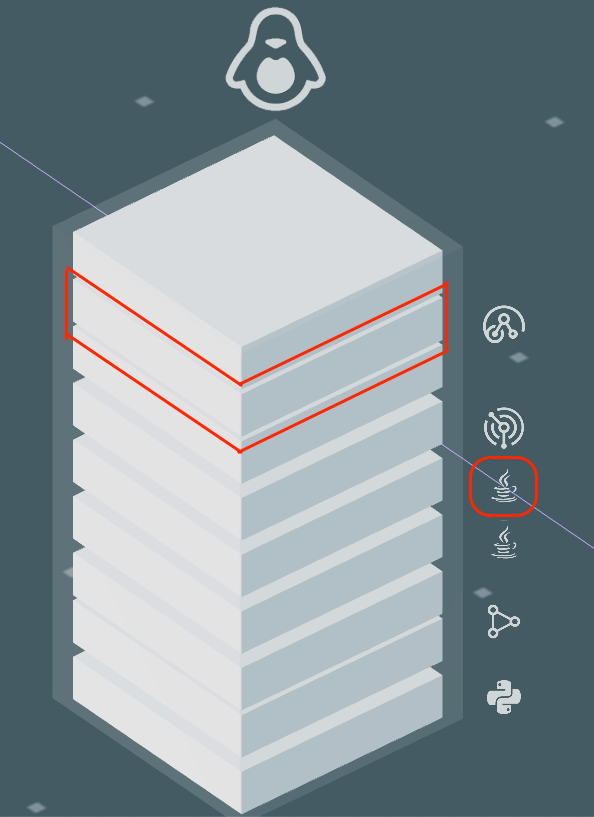
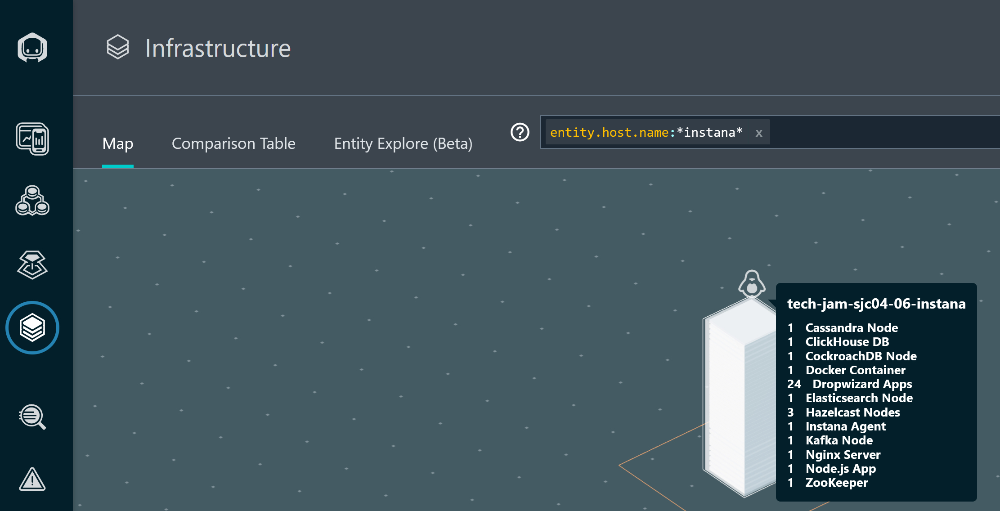

# Module 101: Instana

## Goal / End user's perspective

The goal of this lab to help explore / familiarize yourself with some key capabilities available in through the Instana UI, specifically monitoring of Kubernetes and services.

## Exploring the Infrastructure View

For this section we will examine the infrastructure using the following steps:

1. CLick on the _**Infrastructure**_ icon on the left hand had

Notice the 3D visualization of the different components for your infrastructure.

This view provides an overview of all the monitored systems, grouped into zones (three-dimensional rectangles)

From the birds eye view, each zone consists of pillars, and each pillar represents an Instana agent running on a respective system.

Instana is able to visualize all of this information thanks to Dynamic Graph and support for over 250+ sensor technologies.

In the image above, the towers represent OpenShift worker nodes.

As you zoom in to the towers, you can see the smaller boxes _(pizza boxes)_ that build up the tower. Each one of these smaller boxes represent an entity, or a discovered that Instana has discovered and is monitoring on each node along with the associated information, represented as a small stack from such as the technology used for each

## Filtering

In large environments, it can be difficult to find the server or zone that you are looking for. Fortunately, there are a number of ways that you can search for things within the _Infrastructure view_.

Imagine you are monitoring hundreds of services, servers, and endpoints. While Instana, would be able to easily provide observability for all of them, it would be overwhelming if you are only looking for services or servers with high CPU cycles.

The solution is to change the view using the icons for Tag View, Aggregate Metric View, Metric View & 3D, and Table toggle. In this case, we will be exploring the metrics view.

## Metrics View

These metrics view allow for one to easily view useful metrics as part of the broader infrastructure view.

1.  From the bottom right-hand corner try changing the default view to show the aggregate CPU cycle time
2.  Cycle through all the different metrics

    1. CPU Load

    2. CPU Usage

    3. Free Memory

3.  Reset the metric view and return to the default component view by clicking the metrics icon and select reset in the lower right corner.

_**Note**: While in the metrics view, the metrics icon itself will be highlighted as long as a metric is selected to remind you that it is turned on._

In addition to the options provided in the lower right-hand legend, Instana also makes use of the _lucene query language_ in the filter/search bar at the top of the page while in the Infrastructure view. Before beginning the search, flyover one of the towers and identify the hostname of one of the servers. For example `rs-backend-dal10-01-payments.<fully qualified hostname>`

## Query / Search

Let's try out a query by looking for a specific host

1.  Click in the filter bar and select "Entity"

2.  From the dropdown-list start typing _host_ and you will see the list filtered to "host". Once you see the single entry, select host.

3.  You should see _entity.host.name:_. After the ":", you can do a wildcard search. For example "entity.host.name:_abc_". Type in a wildcard string that matches the beginning of the hostname you want to look for. For example example, I could specify "entity.host.name:_dal10_" to filter on the servers in the dal10 region.

4.  One you have specified the filter, you'll see that the infrastructure view is filtered to just a single server that matches your search.

_**Note**: the search filter engine supports many different queries, including AND, OR, and NOT conditions. More info on the \_lucene query language_ can be [found here](https://www.ibm.com/docs/en/instana-observability/current?topic=instana-filtering-dynamic-focus)\_

5. Clear the filter at the top of the page by clicking on the X before moving onto the next step.
