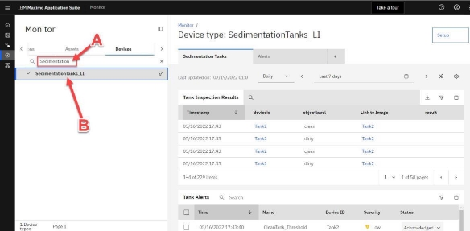
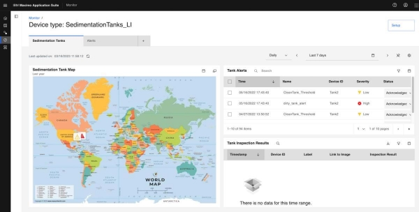
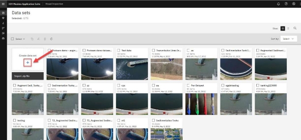
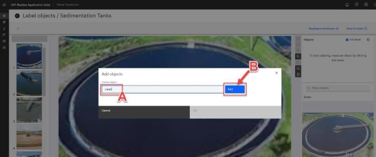
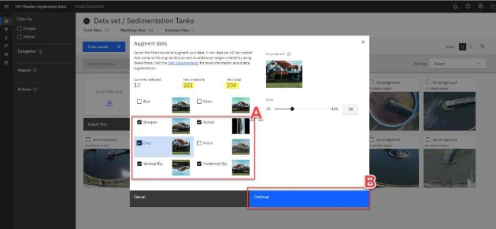
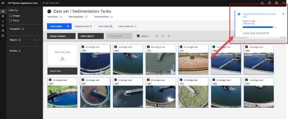

# Maximo Visual Inspection - Part 1

In this lab you will first see the connection between Maximo Monitor and MVI.

Then you will create your own data set, label, and augment using an MVI instance.

## Part One: Maximo Monitor and Maximo Visual Inspection

### Step 1: Log in to Maximo Application Suite Navigator

**Actions:**

1. Click on this [**Maximo Application Suite Demo Environment**](https://wwdemo.home.wwdemomas8.gtm-pat.com/) URL link to launch IBM Maximo Application Suite and bring up the log-in page.

2. **IBM Maximo Application Suite** log in page opens.
3. Enter MVI **Username (A)** and click **Continue (B)**
4. Enter MVI **Password** and click **Log in** (figure not shown for this step)

**Sample Dialogue:** Once the login credentials are accepted, the MAS Application **Suite navigator** window opens. Several applications that make up the Maximo Application Suite are displayed. In this demo, the focus will be on the Maximo Visual Inspection application; however, Part One of this demo, briefly looks at MVI AI model inspection results in the MAS Monitor application.

### Step 2: Viewing MVI AI Model Inspection Results in Monitor Dashboard

Assume that the analyst’s AI solution is set up so that cameras constantly monitor every tank in the facility. The feed from the cameras is analyzed every hour by Maximo Visual Inspection’s AI model and uploaded as IoT (Internet of Things) events. Maximo Monitor then maps and plots these details on a set of dashboards. Rules are also triggered to generate alerts on the dashboard. As a result, plant engineers and operational managers can view the condition of all tanks from a single screen and act on assets that need attention.

- The key idea of leading by showing the completed solution first is to enable clients to envision a fully implemented MVI solution in their line of work right from the start of the demo process. This may also increase clarity on how an MVI computer vision model fits into the larger spectrum of EAM (Enterprise Asset Management) using the MAS suite of applications.
- The Maximo Monitor application demo environment is pre-configured with inspection alerts from MVI sedimentation tanks. Instructions to perform application integration between MVI and Monitor are beyond the scope of this demo.

**Actions:**

1. Click the **Monitor** tile on the MAS application **Suite navigator** home screen.

2. Click the **Monitor** tile on the **Welcome** screen that opens.

3. On the left sidebar, click the **right arrow** icon **(A)** to view more options in the Ribbon menu. Click the **Devices** tab **(B)** from the menu to view the list of device types in this WRA.

**Sample Dialogue:** In the Monitor application, you can see a list of device types for this Water Resource Authority. Clicking on any device type can show further details about any active analysis or data inflow for the device type, as you will see in the next step.

4. In the search area, type **“Sedimentation” (A)** to filter the displayed device type’s list and click on the filtered result **SedimentationTanks_LI (B)** to view the sedimentation tanks dashboard on the right.

5. Click on the **Left sidebar** icon to hide the sidebar and view the dashboard in full-screen mode.

**Sample Dialogue:** One common challenge with manual inspections carried out by multiple inspectors across multiple teams in this scenario is to get an aggregated high-level status of all the tanks. Even more difficult is to get this information in a timely manner. Using Maximo Application Suite, this challenge becomes almost trivial to solve.

The **Tank Alerts** card (top right) shows the alert history for the Sedimentation Tanks is this group. The Plant Manager see’s there is an alert for **Tank2**  🟢

The **Inspection Results** table card (bottom right) is currently empty, but this is where the Plant Manager can view the company’s automated MVI inspection results.

 

## Part Two: Creating, labeling and augmenting a data set

### Step 1: Launch Maximo Visual Inspection

**Actions:**

1. Click on the **IBM Maximo Application Suite** label at the top left of the screen. You are returned to the MAS Suite Navigator screen.

2. On the MAS Suite navigator screen, click on the **Visual Inspection** tile.

3. Click **Continue.**

  

### Step 2: Create a Dataset for Model Training in Maximo Visual Inspection

**Sample Dialogue: What is an MVI dataset, and why do you need to create one?**

As a first step towards building your AI inspection model, you must create a dataset in MVI containing images of clean and dirty tanks to teach the model what each class looks like.

Data is at the heart of machine learning (ML). In the case of vision-based models, this data takes the form of images or videos. Built-in MVI ML models intelligently detect and learn patterns in the uploaded dataset and analyze this data repeatedly until it can discern distinctions and ultimately recognizes objects of interest in the images. For example, to train a computer to recognize automobile tires, you need to feed it with vast quantities of tire images and tire-related items to learn the differences and identify a tire, especially one with defects.

For this use case model, you will create a dataset with a limited number of clean and dirty tank images for brevity; however, in real world scenarios, a computer vision model would require many more images and processing time than this demonstration offers.

In this demo, you manually upload saved tank images from your local machine to the MVI application dashboard, however, built-in image capture modes in MVI Mobile and MVI Edge applications (parts of the MVI solution) can also be used to collect and copy images automatically into the MVI application. Now it's time to start creating a dataset.

**Action:**

1. Click **Get started** on the **MVI Welcome to IBM Maximo Visual Inspection** screen.

The Data sets window opens.

2. On the MVI **Data sets** screen, Click the **blue +** icon just under **Create data set** label on the left.

3. Enter “Sedimentation Tanks <your unique identifier>” for the **Data set name** field in the **Create data set** window (since you are sharing the Maximo Visual Inspection demo environment with other people a unique identifier is required to avoid name conflicts) **(A).**
4. Click **Create (B)**.

**Important:** This demo script does not address dataset names with any unique identifier. Hence to follow along as an example, if you are instructed to click on the **_Sedimentation Tanks_** dataset, you would instead click on **_Sedimentation Tanks <your unique identifier>_** dataset, i.e., the dataset you named along with your unique identifier.

5. Click on the lower half of the newly created **Sedimentation Tanks** tile (where a light grey image icon is shown).

**Sample Dialogue:** Once you click on this tile, a window opens for the data set you just created. As shown in the upcoming steps, you can perform several key operations on this page, such as uploading images, labeling objects, augmenting data, and training your model.

6. Navigate to the directory location where you unzipped the “Images of Sedimentation Tanks for training” folder, downloaded and extracted in the[ Pre-work Step 2.](#_page0_x57.00_y410.00)
7. Click **Import Files** to import the model training tank images from the directory where you unzipped the sample files.

8. Select all the tank images from the folder and click **Open**.

**Sample Dialogue:** After a few seconds, the images are uploaded to your newly created dataset. This dataset includes several photos of clean and dirty sedimentation tanks. You are now ready to label these images.

### Step 3: Label the Dataset

**Sample Dialogue:** In this step, you will label the tank images. Labeling is tagging the input images with information about its content. In object detection, this would involve highlighting occurrences of items of interest. In the case of this demo, you will go through each of the uploaded tank images and highlight the portion of the image that represents a clean or a dirty tank. During the training phase, these labelled images will allow your model to learn which part of the image represents a tank and next whether that image portion contains a clean or a dirty tank.

As you can imagine, labeling the images correctly is critical to the accuracy of the model you are creating because it directly impacts the overall quality of the trained model. Quite simply, when it comes to identifying objects or classifying images, you want a use case domain expert – the person with the relevant subject matter expertise (SME) – to be labeling these images. This will ensure the highest quality of input into the model training. Traditionally, data scientists have been the focal point of AI initiatives and have wasted their precious time labelling data (despite not even being a domain expert; for example, would a data scientist be able to better label a dirty tank than the on-site inspection engineer?). With MVI, a domain expert – with no data science expertise– can label the images and then subsequently build a model based on those images.

This approach lowers the barrier to entry and empowers domain experts with limited to no AI training the ability to create and deploy working AI models in a matter of hours, not days or weeks.

**Actions:**

Once all the pictures are uploaded in MVI perform the following steps:

1. Click the **Select** checkbox to automatically select all the dataset images **(A)**.
2. Click **Label objects (B)**.

**Sample Dialogue:** The **Label objects / Sedimentation Tanks** page opens. This is where you create labels for clean and dirty tanks and assign them to the relevant portion of the images in the dataset. Various sections of the Label objects page user interface for layout reference are highlighted below.

3. To start the labeling process, you must define the labels (clean and dirty). Click **+ Add label** in the **Objects** window on the far right.

4. In the **Add objects** window that opens, type “clean” in the **Create object** field **(A)** and then click the **Add** button **(B).**

5. Now, type “dirty” in the **Add objects** window and click **Add**.

6. Click **Ok** to complete the Add label process.
7. Once the labels are defined, you can start the process of labelling the tank objects appropriately. Make sure the first tank image is selected in the Image Navigator (you will see a dark blue box around the selected image in the Image Navigator on the left). Select the **clean** label name from the **Objects** window on the right **(A).**
8. Click the **Box** icon from the selection menu **(B)** and draw a box around a portion of the image that denotes the clean or dirty tank **(C)**.

Due to potential random image sorting, it may be possible that the first image you will see in the image navigator may be of a dirty tank. In this case, choose the **dirty** label instead of **clean** and label the first image in step 7 of this section appropriately.

In case you make a mistake drawing the box, select the erroneous box and click the **trashcan** icon right next to the label. You can also press **CTRL + Z** or **Command + Z** on your Windows and Mac keyboard, respectively, to undo the last action.

9. Label all the pictures in the Image Navigator using the instructions in the previous steps. You can click the **blue downward arrow** button to scroll through and select the images in sequence for labeling.

**Image Labelling Tips:**

- MVI remembers your previous label selection, so you do not need to click on the **clean** or **dirty** labels every time to label each new image. Just select the appropriate label the first time you start object labeling and continue to use it till it is required to switch to another object label, for example, switching from labeling a clean tank image to a dirty tank image and vice versa.

For your convenience, a light blue bar highlights the label that is currently in

selection, as shown in the screenshot below.

- Tanks with blue water are clean.
- If there is more than one tank (or portion of tanks) in an image, please draw separate label boxes around each tank, as shown in the screenshot below.

10. Once all tank images in the Image Navigator are appropriately labelled, click the **Back** icon (not your browser’s back button) to navigate back to the **Data set / Sedimentation Tanks** page.

### Step 4: Data Augmentation

**Sample Dialogue:** MVI offers an easy and cost-effective way to augment data sets. At this point, you have labelled all the tank images in the uploaded data set.

When building out a deep learning computer vision model, the more images added to the data set, the more accurate the model will generally be. However, there may be times when you do not have a dataset as varied or large enough to create an accurate and generalized model, and the cost of acquiring new data is too high.

To address this pain point, MVI provides image augmentation capabilities, where filters can be applied to perform operations such as flip, blur, sharpen, and crop, to create additional images, thus increasing model performance and decreasing the cost to acquire more data. This augmentation process multiplies the original number of images by several folds. And the good news is that any labeling that has been done in the original images is maintained in the new augmented images to avoid rework.

For this demo, it is fair to assume that a posted field camera is unlikely to take pictures of the tanks under the same conditions every time. The lighting will vary depending on weather and time of day. If the camera is rotatable, then it’s orientation to the tank and image focus can also be inconsistent. Rather than trying to provide images for all possible scenarios, image augmentation can help simulate these different conditions. This is how, data augmentation helps add additional data to your dataset to improve model performance (accuracy). You will use a few of the available MVI data augmentation options to add volume and variety to your tank images data set.

**Actions:**

1. Click **Augment data**.

2. The **Augment data** window opens and displays all of MVI’s available data augmentation filters. Select filters **Sharpen**, **Crop**, **Rotate**, **Vertical flip** and **Horizontal flip** to generate additional images **(A)**. Notice the number of images under **New creations** and **New total** labels increases as more filters are selected.
3. Click **Continue (B).**

4. The **Augment data** window opens**.** Name the new dataset by typing “Augmented Sedimentation Tank <Your unique identifier >” **(A)**
5. Click **Create data set** to create your new augmented data set **(B)**

Once you click **Create data set**, you can track the progress of the data augmentation process in a small window that appears at the top right of the screen.

In this window;

- A blue progress bar denotes the data augmentation is in progress.
- A completion confirmation message and a green check mark indicate the completed process.

6. Click the **Back** icon (not your browser’s back button) to return to the main **Data sets** page, where you can see your newly created augmented dataset.

7. The main **Data sets** page opens and displays both the original and augmented dataset. Notice the increased number of images in the augmented dataset compared to the original dataset (the number of images in each dataset is shown right under its name in the tile). Click on the lower half (the water tank picture) of your newly created **Augmented Sedimentation Tanks** tile.

8. Once your augmented dataset page opens, notice how all the MVI generated augmented images have a small black (“magic”) icon at the bottom right of the image. Also, how image labels are automatically transferred from the original images to their corresponding augmented images.

Congratulations, you have created a new augmented dataset from the original that is ready to be trained. Now it’s time to create the object detection model using this augmented dataset.

Part 2 of the MVI lab is available [here](VISUAL-INSPECTION2.md).

