<h1>Maximo Visual Inspection</h1>

  

<h1>Part One: Maximo Monitor and Maximo Visual Inspection</h1>
 

**<h2>Step 1: Log in to Maximo Application Suite Navigator </h2>**

To complete this step, please refer to the email confirming your demo access and containing instructions to access the demo environment (please refer to Pre-Work Step 1 for more details).

**Actions:**

1. Click on this[` `**Maximo Application Suite Demo Environment** ](https://wwdemo.home.wwdemomas8.gtm-pat.com/)URL link to launch IBM Maximo Application Suite and bring up the log-in page. Alternatively, you can also locate and click the MAS demo environment URL link from the email you received containing instructions to use the demo environment as shown in the screenshot below.

2. **IBM Maximo Application Suite** log in page opens.
3. Enter MVI **Username (A)** and click **Continue (B)**
4. Enter MVI **Password** and click **Log in** (figure not shown for this step)

MVI username and password is listed in the same email (please refer to Pre-Work Step 1 for more details).

**Sample Dialogue:** Once the login credentials are accepted, the MAS Application **Suite navigator** window opens. Several applications that make up the Maximo Application Suite are displayed. In this demo, the focus will be on the Maximo Visual Inspection application; however, Part One of this demo, briefly looks at MVI AI model inspection results in the MAS Monitor application.

If this is your first-time logging into the MAS, you may be prompted to view a quick application tour (how-to tutorial). Please dismiss any such tours for the purposes of this demo.

**<h2>Step 2: Viewing MVI AI Model Inspection Results in Monitor Dashboard </h2>**

**Sample Dialogue:** Let’s see the solution in action.

Assume that the analyst’s AI solution is set up so that cameras constantly monitor every tank in the facility. The feed from the cameras is analyzed every hour by Maximo Visual Inspection’s AI model and uploaded as IoT (Internet of Things) events. Maximo Monitor then maps and plots these details on a set of dashboards. Rules are also triggered to generate alerts on the dashboard. As a result, plant engineers and operational managers can view the condition of all tanks from a single screen and act on assets that need attention.

- The key idea of leading by showing the completed solution first is to enable clients to envision a fully implemented MVI solution in their line of work right from the start of the demo process. This may also increase clarity on how an MVI computer vision model fits into the larger spectrum of EAM (Enterprise Asset Management) using the MAS suite of applications.
- The Maximo Monitor application demo environment is pre-configured with inspection alerts from MVI sedimentation tanks. Instructions to perform application integration between MVI and Monitor are beyond the scope of this demo.

**Actions:**

1. Click the **Monitor** tile on the MAS application **Suite navigator** home screen.

2. Click the **Monitor** tile on the **Welcome** screen that opens.

3. On the left sidebar, click the **right arrow** icon **(A)** to view more options in the Ribbon menu. Click the **Devices** tab **(B)** from the menu to view the list of device types in this WRA.

**Sample Dialogue:** In the Monitor application, you can see a list of device types for this Water Resource Authority. Clicking on any device type can show further details about any active analysis or data inflow for the device type, as you will see in the next step.

4. In the search area, type **“**Sedimentation” **(A)** to filter the displayed device type’s list and click on the filtered result **SedimentationTanks_LI (B)** to view the sedimentation tanks dashboard on the right.

5. Click on the **Left sidebar** icon to hide the sidebar and view the dashboard in fit-screen mode.

**Sample Dialogue:** One common challenge with manual inspections carried out by multiple inspectors across multiple teams in this scenario is to get an aggregated high-level status of all the tanks. Even more difficult is to get this information in a timely manner. Using Maximo Application Suite, this challenge becomes almost trivial to solve.

The **Tank Alerts** card (top right) shows the alert history for the Sedimentation Tanks is this group. The Plant Manager see’s there is an alert for **Tank2**

The **Inspection Results** table card (bottom right) is currently empty, but this is where the Plant Manager can view the company’s automated MVI inspection results.

  

<h1>Part Two: Building Computer Vision Model Using Maximo Visual Inspection Training Server</h1>

**Sample Dialogue:** Now that you have seen how the Asset Analyst’s AI model provides value to your organization with automated inspections, it’s time to see how this model is built step by step.

**<h2>Step 3: Launch Maximo Visual Inspection </h2>**

**Actions:**

1. Click on the **IBM Maximo Application Suite** label at the top left of the screen. You are returned to the MAS Suite Navigator screen.

2. On the MAS Suite navigator screen, click on the **Visual Inspection** tile.

3. Click **Continue.**

  

**<h2>Step 4: Create a Dataset for Model Training in Maximo Visual Inspection </h2>**

**Sample Dialogue: What is an MVI dataset, and why do you need to create one?**

As a first step towards building your AI inspection model, you must create a dataset in MVI containing images of clean and dirty tanks to teach the model what each class looks like.

Data is at the heart of machine learning (ML). In the case of vision-based models, this data takes the form of images or videos. Built-in MVI ML models intelligently detect and learn patterns in the uploaded dataset and analyze this data repeatedly until it can discern distinctions and ultimately recognizes objects of interest in the images. For example, to train a computer to recognize automobile tires, you need to feed it with vast quantities of tire images and tire-related items to learn the differences and identify a tire, especially one with defects.

For this use case model, you will create a dataset with a limited number of clean and dirty tank images for brevity; however, in real world scenarios, a computer vision model would require many more images and processing time than this demonstration offers.

In this demo, you manually upload saved tank images from your local machine to the MVI application dashboard, however, built-in image capture modes in MVI Mobile and MVI Edge applications (parts of the MVI solution) can also be used to collect and copy images automatically into the MVI application. Now it's time to start creating a dataset in \_attatchments/mvi.

**Action:**

1. Click **Get started** on the **MVI Welcome to IBM Maximo Visual Inspection** screen.

The Data sets window opens.

2. On the MVI **Data sets** screen, Click the **blue +** icon just under **Create data set** label on the left.

3. Enter “Sedimentation Tanks <your unique identifier>” for the **Data set name** field in the **Create data set** window (since you are sharing the Maximo Visual Inspection demo environment with other people a unique identifier is required to avoid name conflicts) **(A).**
4. Click **Create (B)**.

**Important:** This demo script does not address dataset names with any unique identifier. Hence to follow along as an example, if you are instructed to click on the **_Sedimentation Tanks_** dataset, you would instead click on **_Sedimentation Tanks <your unique identifier>_** dataset, i.e., the dataset you named along with your unique identifier.

5. Click on the lower half of the newly created **Sedimentation Tanks** tile (where a light grey image icon is shown).

**Sample Dialogue:** Once you click on this tile, a window opens for the data set you just created. As shown in the upcoming steps, you can perform several key operations on this page, such as uploading images, labeling objects, augmenting data, and training your model.

6. Navigate to the directory location where you unzipped the “Images of Sedimentation Tanks for training” folder, downloaded and extracted in the[ Pre-work Step 2.](#_page0_x57.00_y410.00)
7. Click **Import Files** to import the model training tank images from the directory where you unzipped the sample files.

8. Select all the tank images from the folder and click **Open**.

**Sample Dialogue:** After a few seconds, the images are uploaded to your newly created dataset. This dataset includes several photos of clean and dirty sedimentation tanks. You are now ready to label these images.

**<h2>Step 5: Label the Dataset </h2>**

**Sample Dialogue:** In this step, you will label the tank images. Labeling is tagging the input images with information about its content. In object detection, this would involve highlighting occurrences of items of interest. In the case of this demo, you will go through each of the uploaded tank images and highlight the portion of the image that represents a clean or a dirty tank. During the training phase, these labelled images will allow your model to learn which part of the image represents a tank and next whether that image portion contains a clean or a dirty tank.

As you can imagine, labeling the images correctly is critical to the accuracy of the model you are creating because it directly impacts the overall quality of the trained model. Quite simply, when it comes to identifying objects or classifying images, you want a use case domain expert – the person with the relevant subject matter expertise (SME) – to be labeling these images. This will ensure the highest quality of input into the model training. Traditionally, data scientists have been the focal point of AI initiatives and have wasted their precious time labelling data (despite not even being a domain expert; for example, would a data scientist be able to better label a dirty tank than the on-site inspection engineer?). With MVI, a domain expert – with no data science expertise– can label the images and then subsequently build a model based on those images.

This approach lowers the barrier to entry and empowers domain experts with limited to no AI training the ability to create and deploy working AI models in a matter of hours, not days or weeks.

**Actions:**

Once all the pictures are uploaded in MVI perform the following steps:

1. Click the **Select** checkbox to automatically select all the dataset images **(A)**.
2. Click **Label objects (B)**.

**Sample Dialogue:** The **Label objects / Sedimentation Tanks** page opens. This is where you create labels for clean and dirty tanks and assign them to the relevant portion of the images in the dataset. Various sections of the Label objects page user interface for layout reference are highlighted below.

3. To start the labeling process, you must define the labels (clean and dirty). Click **+ Add label** in the **Objects** window on the far right.

4. In the **Add objects** window that opens, type “clean” in the **Create object** field **(A)** and then click the **Add** button **(B).**

5. Now, type “dirty” in the **Add objects** window and click **Add**.

6. Click **Ok** to complete the Add label process.
7. Once the labels are defined, you can start the process of labelling the tank objects appropriately. Make sure the first tank image is selected in the Image Navigator (you will see a dark blue box around the selected image in the Image Navigator on the left). Select the **clean** label name from the **Objects** window on the right **(A).**
8. Click the **Box** icon from the selection menu **(B)** and draw a box around a portion of the image that denotes the clean or dirty tank **(C)**.

Due to potential random image sorting, it may be possible that the first image you will see in the image navigator may be of a dirty tank. In this case, choose the **dirty** label instead of **clean** and label the first image in step 7 of this section appropriately.

In case you make a mistake drawing the box, select the erroneous box and click the **trashcan** icon right next to the label. You can also press **CTRL + Z** or **Command + Z** on your Windows and Mac keyboard, respectively, to undo the last action.

9. Label all the pictures in the Image Navigator using the instructions in the previous steps. You can click the **blue downward arrow** button to scroll through and select the images in sequence for labeling.

**Image Labelling Tips:**

- MVI remembers your previous label selection, so you do not need to click on the **clean** or **dirty** labels every time to label each new image. Just select the appropriate label the first time you start object labeling and continue to use it till it is required to switch to another object label, for example, switching from labeling a clean tank image to a dirty tank image and vice versa.

For your convenience, a light blue bar highlights the label that is currently in

selection, as shown in the screenshot below.

- Tanks with blue water are clean.
- If there is more than one tank (or portion of tanks) in an image, please draw separate label boxes around each tank, as shown in the screenshot below.

10. Once all tank images in the Image Navigator are appropriately labelled, click the **Back** icon (not your browser’s back button) to navigate back to the **Data set / Sedimentation Tanks** page.

**<h2>Step 6: Data Augmentation </h2>**

**Sample Dialogue:** MVI offers an easy and cost-effective way to augment data sets. At this point, you have labelled all the tank images in the uploaded data set.

When building out a deep learning computer vision model, the more images added to the data set, the more accurate the model will generally be. However, there may be times when you do not have a dataset as varied or large enough to create an accurate and generalized model, and the cost of acquiring new data is too high.

To address this pain point, MVI provides image augmentation capabilities, where filters can be applied to perform operations such as flip, blur, sharpen, and crop, to create additional images, thus increasing model performance and decreasing the cost to acquire more data. This augmentation process multiplies the original number of images by several folds. And the good news is that any labeling that has been done in the original images is maintained in the new augmented images to avoid rework.

For this demo, it is fair to assume that a posted field camera is unlikely to take pictures of the tanks under the same conditions every time. The lighting will vary depending on weather and time of day. If the camera is rotatable, then it’s orientation to the tank and image focus can also be inconsistent. Rather than trying to provide images for all possible scenarios, image augmentation can help simulate these different conditions. This is how, data augmentation helps add additional data to your dataset to improve model performance (accuracy). You will use a few of the available MVI data augmentation options to add volume and variety to your tank images data set.

**Actions:**

1. Click **Augment data**.

2. The **Augment data** window opens and displays all of MVI’s available data augmentation filters. Select filters **Sharpen**, **Crop**, **Rotate**, **Vertical flip** and **Horizontal flip** to generate additional images **(A)**. Notice the number of images under **New creations** and **New total** labels increases as more filters are selected.
3. Click **Continue (B).**

4. The **Augment data** window opens**.** Name the new dataset by typing “Augmented Sedimentation Tank <Your unique identifier >” **(A)**
5. Click **Create data set** to create your new augmented data set **(B)**

Once you click **Create data set**, you can track the progress of the data augmentation process in a small window that appears at the top right of the screen.

In this window;

- A blue progress bar denotes the data augmentation is in progress.
- A completion confirmation message and a green check mark indicate the completed process.

6. Click the **Back** icon (not your browser’s back button) to return to the main **Data sets** page, where you can see your newly created augmented dataset.

7. The main **Data sets** page opens and displays both the original and augmented dataset. Notice the increased number of images in the augmented dataset compared to the original dataset (the number of images in each dataset is shown right under its name in the tile). Click on the lower half (the water tank picture) of your newly created **Augmented Sedimentation Tanks** tile.

8. Once your augmented dataset page opens, notice how all the MVI generated augmented images have a small black (“magic”) icon at the bottom right of the image. Also, how image labels are automatically transferred from the original images to their corresponding augmented images.

Congratulations, you have created a new augmented dataset from the original that is ready to be trained. Now it’s time to create the object detection model using this augmented dataset.

**<h2>Step 7: Create Object Detection Model in Maximo Visual Inspection</h2>**

**Sample Dialogue:**

Now that you have a workable dataset of images, as the Asset Analyst, it’s time to train an object detection model in MVI using these labelled images. Training is the process of fitting a model to the input data such that it can be used to make predictions on data it hasn’t seen before in the future.

During computer vision model training, pixel-level information from the image dataset is fed into the training algorithm. A Convolutional Neural Network (CNN) helps the algorithm “look” by breaking images into pixels (CNN is a popular algorithm for computer vision). This neural network also checks the accuracy of its predictions in a series of iterations until its predictions are accurate. At this point, the CNN model is recognizing or seeing images like a human’s biological neural network (hence the name – Convolutional _Neural Network_). In this demo, the model you will train is **Faster R-CNN** (Faster Region-based Convolutional Network). **Faster R- CNN** is an extension of the CNN models that belongs to a family of object detection computer vision models.

The good news is that Maximo Visual Inspection simplifies and streamlines this model training process through automation and a no-code solution; this puts deep learning into the hands of an empowered subject matter expert.

Now it’s time to start the training process of your dirty tank detection model using MVI’s power of AI and ease of use.

**Actions:**

1. Click **Train model** to start the object detection training process.

2. The Train Model / Augmented Sedimentation Tank page opens. Select **Object detection** tile from the **Select type of training** section **(A)**.
3. In the **Optimize model using** section, select the **Faster R-CNN** tile (**B).**

**Sample Dialogue:** The **Train Model / Augmented Sedimentation Tank** window (screenshot above) allows you to configure the model’s settings.

For this demo’s use case, you will use the **Object detection** training type – because you want to train a model that can analyze the tank’s condition without getting confused with any other background entity in the incoming camera image. Also, you will use the **Faster R-CNN** model type, which is optimized for higher accuracy but takes more computing and GPU power than alternatives (that’s ok; you want higher accuracy).

Apart from the chosen options, Maximo Visual Inspection (MVI) includes several models to run inferences related to classification and detection. A brief description of when to use each model type can be read within each training and model option tile.

4. To gain more control over the model training, view your model’s hyperparameters by clicking on **Advanced settings** switch to turn it **On** (located in the upper right corner of the screen).

**Sample Dialogue:** Due to MVI’s ease of use, domain experts often progress very quickly into becoming advanced users. As they find themselves with new levels of comfort and control, they can also optionally choose to exploit advanced settings to further fine-tune the model. Once the **Advanced settings** switch is turned on, the **model hyperparameters** section becomes available at the bottom of the screen. Hyperparameters are used to optimize the model’s performance; and when it comes to improving the model accuracy, these parameters are the go-to option for data scientists and model experts. A brief description on each of the hyperparameters can be viewed by clicking on the **info** icon (the “**i**” in a circle) at the end of each corresponding hyperparameter. For now, keep hyperparameters at their default values.

If you are doing this demo in a classroom setting, or time is a factor, you can keep the number of iterations low. Setting it to a higher value will take longer, but it also means a more accurate model with better inspection results; for the demo, you can leave the hyperparameters at their default values.

5. While you could click the blue **Train model** button at the top to begin the model training process, this is **NOT** recommended in a live demo setting. 

**Sample Dialogue:** Clicking on **“Train Model”** will start the training process, but since the training here will take 25+ minutes, this guide shows you the next steps using a more practical pre-built model that has been built using the same steps but was trained using 2000+ clean and dirty tank images and hours of computation.

At the time of writing, only two Graphics Processing Units (GPUs) are available for model training and deployment in the worldwide shared demo cluster (you can view the current GPU usage at the top right of the screen).

Therefore, when you click Train Model, the training process is likely queued until resources (GPUs) become available again. If this happens, you will see a window prompting you to add the training job to the queue or cancel the training altogether. You can click Cancel to terminate the training process and avoid system overload.

For demo purposes, from this point on, you will use a prebuilt sedimentation tanks model “DONOT DELETE- Sedimentation tank model” built on 2000+ tank images to showcase the next steps (just like on a cooking show where the meal is already cooked in the oven, and they just take it out on the show).

6. Click the **Hamburger** icon (a stacked bar) on the top left to view the list of page navigation options **(A)**.
7. Select **Deployed models** from the list to view a list of pre-deployed models **(B)**.

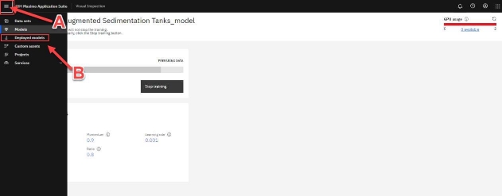

**<h2>Step 8: Model Testing </h2>**

**Sample Dialogue: Testing the AI model with a new tank image**

Once model training is complete (in this case you are using a pre-built model), the model should be tested before making it generally available. In the validation phase, you will pass tank images to the model that were not part of the training dataset (called validation or test images) and let the model auto-detect the clean or dirty state of the given tank images. In this way you are simulating the scenario of a new tank inspection image sent down to the model by the field cameras and subject the model to tank images it has never seen before.

Using a dataset that was not part of the model-building phase is a standard process to check the model performance (accuracy). This helps assure that the patterns detected during model training are generalizable (also exist in the never-before-seen images) and can be used in the real world to predict new “unseen” images.

**Actions:**

1. On the **Deployed models** screen, under the **Name** column, click **DONOT DELETE- Sedimentation tank model** (prebuilt model).

- **Caution:** It is possible that the name of the pre-built model was changed from “DONOT DELETE- Sedimentation tank model” to something else by the time you are attempting to complete this demo. Hence to quickly identify the pre-trained model, it is worth remembering that the pre-trained model will have a dataset value of “Not found” regardless of its name as highlighted in the screenshot above. This quick tip can help you identify the pre-trained model among a list of several other deployed models regardless of any future model name changes.
- Since you are working in a worldwide shared demo cluster environment, it is likely that you may see several other models previously deployed on the **Deployed models’** screen. These models can be ignored for the purposes of this demo.

2. Once you click the deployed model’s name, you are brought to the model screen where its performance can be evaluated using a test image.

Click the **Import** button in the **Test Model** tile to select an image to score.

3. Select an image of a **clean tank** from the model validation images folder (it will have the word “**clean**” in its name) and visually confirm the model result (model validation images are downloaded in[ Pre-work: Step 2)](#_page0_x57.00_y68.00).

4. Next, click **Import** again and select an image of a dirty tank from the same folder.

**Sample Dialogue:** With a validated model, you can build a dashboard in Maximo Monitor that will display the results of live camera feed inspections, as demonstrated in Part One of this demo. You observed how the MVI AI model sends inspection alerts to the Monitor dashboard. You also performed the steps to build a computer vision model.

Congratulations! You have just used IBM Maximo Visual Inspection to create a computer vision model that can identify dirty water sedimentation tanks!

  

<h1>Part Three: MVI Edge Inspections</h1>

**Sample Dialogue**: Now that you have trained and validated the AI model, it is time to use it for automated visual inspections on IBM Maximo Visual Inspection (MVI) Edge. MVI Edge is a web- based application that can be used to perform AI-based inspections using powerful edge computing.

Edge computing is a form of computing that takes place at or near the physical location of either the user or the data source. By placing computing services closer to these locations, users benefit from faster, more reliable services by removing latency issues and decreasing bandwidth usage. For example, it is ideal for usage in fixed camera deployments where data is in large video formats like this sedimentation tanks demo use case.

**Action:**

1. Access Maximo Visual Inspection Edge from this URL:[ https://mas-wwdemo-mviedge1.gtm- pat.com/](https://mas-wwdemo-mviedge1.gtm-pat.com/)

On the Log in screen:

1. Enter **rose** for Username
1. Enter **Passw0rd1!** for Password
1. Click **Log in**

2. The MVI Edge **Dashboard** page opens that displays live inspection results for different devices in this WRA authority.

**Sample Dialogue:** From the MVI Edge dashboard, you can easily keep track of your device’s health in real-time by viewing the total number of the corresponding pass or fail inspections.

3. From the dashboard screen, hover over the left side panel to view the key options available in the Edge server.

**Sample Dialogue:** Several options to configure the MVI Edge environment are available on the left side panel. The **green check mark** at the bottom of the side panel confirms that the Edge server is currently connected to the MVI training server (using an API key), allowing for any models and datasets created in the training server to be imported and deployed in the Edge environment. Using the **Input sources** option from this sidebar, image, video folders, or a RTSP (Real Time Streaming Protocol) camera feed can be selected as an input source for

the AI model inspections.

4. From the **Dashboard** screen, click on the **Tanks** link to view the inspection details (recall that Tank number 2 triggered inspection alerts on the Monitor dashboard in part one of the demo).
5. **Images** tab of the **Inspection: Sedimentation Tank 2 Inspection** page opens. Click the **Configuration** tab to view this tank’s inspection configurations.

On the configuration tab, show that any datasets, models, and projects made in the MVI training server can be easily used in the MVI Edge application by simply selecting from the corresponding dropdown menu options (**A, B, C**).

**Important:** For this demo, the project, model, and dataset are pre-selected for you on Sedimentation Tank 2 inspection screen. **Please do not change these pre-set options. Just view!**

**Sample Dialogue:** Using Edge, you can collect or inspect images by selecting the appropriate option in the **Inspection mode** section under the Inspection status section. In **Collecting** mode, any images taken as part of the inspection are simply collected to train an AI model at a later stage. In **Inspecting** mode, these images are inspected by a previously trained AI model to perform inference (detect the image elements using computer vision). Because you want to inspect the tank images, ensure that this mode is set to the **Inspecting** option.

6. Scroll down to the **Rules** section. In the **Clean Tank** row, click on the **gear** icon under the **Settings** column. This is where you can view inspection rules that the AI model will use to categorize the tank’s health to be a Pass or Fail.

7. The **Rule settings** window appears. This is where the name of the inspection, and rules for

a pass or a fail inspection can be configured. On this screen, please **keep the settings to their pre-select values and do not change anything here**.

Simply put, confidence score is a measure of how confident an AI model is about its prediction and is described in a range of 0-100%.

8. On the **Rule settings** window screen, scroll down to view the **Alert type** section. In this section, you can configure inspection results to be sent as alert notifications via two external applications, **MQTT (Message Queuing Telemetry Transport) or Twilio**. Once again, **Keep the settings to their pre-select values and do not change anything here**.

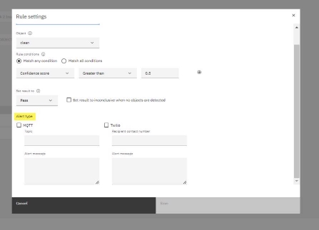

**Sample Dialogue:** Under the **Alert type** options, you can enable Maximo Visual Inspection Edge to send outbound alert messages to external recipients by configuring connections to an MQTT broker and the Twilio messaging service.

Using MQTT protocol, the Edge server integrates with other applications in the MAS Suite to display inspection alerts and enable the creation of work order requests, as you saw earlier in this demo with MAS Monitor (part one of this demo). In addition to MQTT, using Twilio, inspection results can be immediately sent as SMS to the concerned person by simply providing their contact number.

9. Click **Cancel** to exit out of the **Rule settings** window.

**Sample Dialogue:** Once the rule settings are complete,\*\* you are now performing batch processing on multiple tank images in a clean and dirty state. After running the inspections, the AI model will perform inference on each image and subsequently trigger inspection results as Pass or Fail, depending on the tank’s condition. Inspections can be initiated by either setting MQTT topic triggers, which will perform inspections by receiving remote triggers, or by setting time-based intervals. Inspection interval settings can be set according to the business requirements; for example, tank inspections could be set to take place every 24 hours (in seconds) etc.

**Note:** To avoid unexpected errors in the demo environment you are not actually triggering a new inspection in this demo. Instead in the next steps you will be showing the pre-loaded inspection results to the clients.

10. Scroll up and click on the **Images** tab where the pre-loaded inspection result would be available for viewing.

11. In the Images tab, inspection results from the images in the input source are displayed. If there are no images on this screen, please click the **Refresh** icon a few times for the images to load.

**Sample Dialogue:** All the inference results are displayed on a single screen along with important metadata. If a live feed was coming through, you will see the most recent inspection at the top left image. For convenience, icons on the images serve as a quick way to view inspection results. There is a green check mark for a clean tank and a **red X** for a dirty tank. There may also be a yellow question mark if the model is unsure about the result. A high rate of inconclusive results might indicate that the model’s performance is poor, the rule configuration is incorrect, or the quality of the camera images is compromised.

The exclamation points in the triangle indicate that the inspection result has been sent as alert notifications to Maximo Monitor via **MQTT or SMS via Twilio**, depending on the option(s) you selected in the Rules settings phase. Clicking on each of these images can show further details about the inspection, such as here you can see that the most recent tank inspection failed due to the poor tank condition, and an alert was immediately sent out about the inspection’s result. The prompt detection of the tank’s failing health helps the Water Resource Authority to avoid issues that often arise when a problem remains undetected or is detected too late.

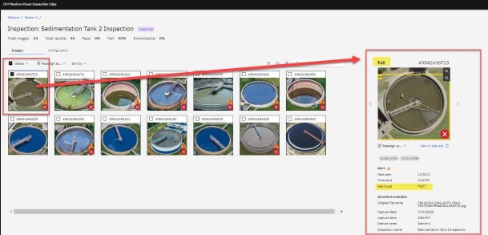

**Important:** At this point in the demo script, you are far enough to pass Maximo Visual Inspection Technical Sales Level 3 Badge.
   

<h1>Part Four (Optional): MVI Mobile Inspections and SMS alerts</h1>

This is an optional part of the demo. Please note, in addition to the MVI training server, you would also need access to an iOS mobile device (iPad or an iPhone) to demo this part because the MVI Mobile application is only available on iOS mobile devices (at the time of writing).

_Figure 2: Access to the MVI training server and iOS Mobile device is required_

**Sample Dialogue:** Now, let us see how a model trained on the Maximo Visual Inspection server can be used to perform inspections using IBM Maximo Visual Inspection Mobile (MVI Mobile) app. Maximo Visual Inspection (MVI) Mobile is a native iOS/iPadOS mobile app that runs on Apple devices such as the iPhone and iPad. This provides a low barrier to entry in terms of hardware costs and time to value. The sophisticated optics on Apple devices are combined with the ability to run models generated from the MVI core application, with native 5G support allowing clients to run

inspections at scale.

Like the rest of the applications in the MVI solution, MVI Mobile delivers agility with point- and-click ease but through the footprint of a mobile app, while providing a powerful real- time AI-powered inspection point and data management platform. In a matter of hours, clients can train complex computer vision models on the core MVI platform and deploy the trained model to the MVI Mobile device to perform inferencing.

The mobile application can be configured by either a handheld mode or a fixed position mode. For example, consider a fixed camera that can take photos of welds on a manufacturing line and perform an automated inspection on the spot. Being able to determine at this point that a particular weld is bad has many benefits. Not only are you preventing this part from finding its way into the hands of a customer (either as the part itself or as a component in a larger item) – which could have disastrous consequences, depending on the item – but this could be a symptom of an issue with the welding equipment, and identifying and fixing the problem early means less wasted product. Similarly, with the hand-held mode a quality inspector can easily carry the mobile device to an inspection site and harness the power of a powerful AI model to detect any anomalies by simply clicking a picture of the inspected part. The result is a dramatic improvement in production quality inspection.

The following part of this demo will demonstrate the core capabilities of MVI Mobile using the pre-trained water sedimentation computer vision model.

**<h2>Step 1: Integrating MVI Mobile with the MVI Training server </h2>**

**Actions:**

1. Open MVI Mobile application on your iOS Mobile device installed in the[ Pre-work : Step 3 ](#_page0_x57.00_y68.00)section. You will land on the **Global Settings** page where you can configure various options in MVI Mobile. On this page, enable **Handheld Mode** by sliding the switch to the right.

**Sample Dialogue:** To integrate MVI training server with the MVI Mobile application you can simply make use of the QR code functionality. A QR code can be generated from the MVI training server that is scanned by the MVI mobile application for automatic integration as you will see in the next steps.

Please ensure that you are logged in on IBM MVI training server on your computer . In the next few steps, you will be required to scan a QR code that appears on the MVI training server screen from your iOS mobile device.

2. On the MVI training server, click on the **API key** sub-menu option from the left side panel under the **Services** menu.

3. API Key screens appear with an API key (Application Programming Interface Key) and a QR code. In the next step you will point your iOS mobile device to this QR code for scanning and automatic application integration.

4. Using your iOS mobile device, click “**Scan QR Code**” option on the Global Settings screen of the MVI Mobile application. The camera screen appears that is ready to scan the QR code. Face your iPhone or iPad camera to the QR code to automatically integrate MVI Mobile application and MVI training server.

Note: You also have an option to manually type the API Key that is generated on MVI training server.

5. Once the QR code is successfully scanned, click **Save** on the top right corner of the screen (figure not shown for this step).

**Sample Dialogue:** Once the integration is completed, the main Inspections page appears. This is where inspections are created and managed with the help of MVI projects.
  
**<h2>Step 2: Creating Inspections in MVI Mobile </h2>**

1. To create a new inspection, click on the **blue plus sign** on the top right corner of the left panel.

2. A new screen opens. Enter a name for the inspection in the **Inspection Name** field (e.g., “Detect Clean and Dirty Sedimentation Tanks”) **(A)**.
3. Select your project by clicking on **Project Select >** and then click on “Sedimentation Tanks Model Project” from the drop-down menu **(B)**.

4. Once you have selected your project, you will be presented with additional configuration settings for the inspection being created. Click on **Model**. The default is to have no model (Collecting Mode Only), but you want to inspect tank images, not just collect only. So, select the pre-built AI model **DO NOT DELETE – OBJECT DETECTION MODEL FOR TANKS** from the presented list.

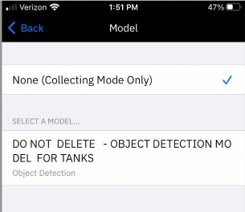

5. Now you can set inspection rules and thresholds that will determine when an inspection should be categorized a _Pass_ or _Fail_. For this, click **Set Thresholds**.

**Sample Dialogue:** On the **Set Thresholds** screen, you can specify whether an inspection is considered a _Pass_ or a _Fail_.

Associated with each label is a threshold value and a **Fail when below threshold** condition. The inspection will be marked as a _Fail_ if the confidence returned for a label is above its specified threshold or below the threshold if Fail when below threshold option is toggled on. There is also a **No Action** option which allows users to ignore the result when the object is detected.

For your model, you have both clean and dirty (tank) labels. For simplicity, let us focus on the dirty tanks, as such, you will only consider an inspection to be a failure if you find the condition of the tank to be dirty. You want to be extra careful so you will set the threshold for the dirty tank confidence level to be above 50%. On the other hand, no further actions are required for the clean sedimentation tanks. Therefore, you are going to effectively disable the clean tank rule as shown in the upcoming steps.

6. Tap **Advanced** under the **Clean** label**.**

7. On the Advanced screen for a clean tank, Enable **No Action** by sliding the switch to the right

**(A)** and then click **Set Thresholds** to go back **(B)**.

 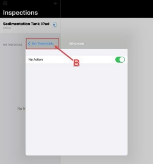

8. Now click Advanced under the **Dirty** label and set the threshold value to 50% **(A).** Click **Set Thresholds** to go back **(B)**

9. The threshold values you set will appear as shown on the screenshot below. Once verified, click

**< Model** to go back to the model selection screen.

10. The **Model** window screen appears. Click **< Back** to go back to the **Create New Inspection** screen.

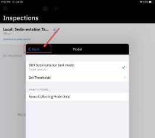

11. Each inspection in MVI mobile is required to have a dataset assigned for storing the inspection images. To specify the dataset, On the Create New Inspection window screen, click the light grey **Select >** option from the **Data Set** row.

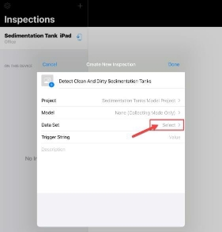

12. **Data Set** window opens. Click **Create New Data Set**.

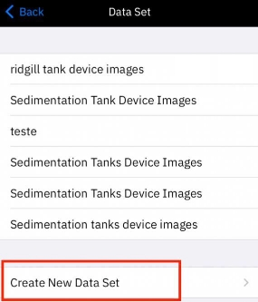

13. Enter “<Your Unique Name> Sed Tank Device Images” in the Data Set Name field and click **Done** to return to the Create New Inspection window screen. This Data Set is where your images captured on your device will be uploaded on the MVI Core instance.

14. To set a value for the **Trigger String** enter this text “Tank Inspection”**.** Click

**Done**.

15. At this point, an inspection is successfully configured in MVI Mobile. Here is what will be displayed when it is done.

If you ever want to delete an inspection that you have created, simply click **Edit** on the top right of the inspection screen and you’ll be presented with an option to delete the inspection at the bottom left of the small window screen that appears (please don’t try this right now to avoid accidental deletion of the inspection).

   

**<h2>Step 3: (Optional) Integrating MVI Mobile with Twilio Account </h2>**

**Sample Dialogue:** Although you can still go ahead now and perform inspections. However, like MVI Edge, MVI Mobile offers easy integration with the[ Twilio application ](#_page0_x57.00_y68.00)so that SMS alerts about the inspection results can be sent to the concerned person. This would be incredibly beneficial for us since the field supervisor for the Water Resource Plant is usually away on inspection rounds. Using this feature, they can immediately receive SMS alerts if the tank health is deteriorating without the need to constantly monitor inspection results by staying in front of the computer screen.

**Actions:**

1. Click on the **blue gear and phone** icon to open the **Configure Device** page.

2. Configure Device page opens, click **Twilio Settings** to enter the Twilio trial account details noted during the Pre-work : Step 4.

3. On **Twilio settings** page enter all the required details in this section. Note, that Supervisor number is any phone number where you would want the inspection alerts to be sent during the demo (this is usually your personal or corporate phone number). Once all the information is entered click **Save**. (Remember to delete this information after the demo as described in the demo Appendix B: Demo Cleanup steps).

It will be easier to simply copy-paste details from the Twilio account here instead of attempting to type these codes.
   
**<h2>Step 4: Performing Inspections in MVI Mobile </h2>**

**Actions:**

1. From the main Inspections page, with your inspection selected and displayed on the right side of the screen (as in the screenshot below), click the **Capture** button. This will turn on the camera on your mobile device.

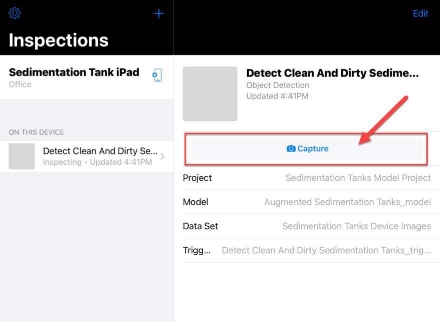

**Sample Dialogue:** Mobile device’s camera screen is now enabled. If a model was not specified within an Inspection, it is in Collect mode - it takes photos and uploads to a dataset in IBM Maximo Visual Inspection to be labelled and then for a model to be trained

When you specify a model within an inspection (as you did in this demo) it is in the Inspect mode which also takes photos but then uses the trained model to run inference on the images and upload results to the specified dataset in IBM Maximo Visual Inspection.

2. For this demo, you will run inference on an _image of an image_ of a tank. For this, on your laptop, please open one of the tank images downloaded in the Prework Step 2 section and keep it on the display for the next step.
3. Take a photo of a clean or dirty tank image displayed on your computer or projector screen (you are basically taking image of an image in this step).

The photo will remain on the display on your mobile device, so please press the **back (<)** button to go back to the camera view. Here are some examples of what you might see after a few inspections.

**Sample Dialogue:** Depending on the accuracy of the model, it has identified clean and dirty tanks in the photo. Since you are taking an image of an image it is possible that the model may struggle to accurately identify tanks or tank’s health in the image. In a real setting this could be resolved with taking an image of the actual object (and not an image of an image) or with more data and training for higher model accuracy. Note that in addition to the bounding boxes superimposed on the photo itself, the bottom of the screen shows the confidence level associated with each inferred object.

You have now performed a successful inspection using the combined power of IBM Maximo Visual Inspection Mobile and IBM Maximo Visual Inspection!

4. You can click **“Cancel”** at any point to go back to the main **Inspections** screen.
5. If you followed the steps for Twilio integration and entered a supervisor number, then you may have received SMS alerts on the number you entered in the Twilio settings section.

   

**<h2>Step 5: Exploring the MVI Mobile Dashboard </h2>**

In the previous section you defined the rules that determine whether a specific inspection (photo) represents a failure or not. You can get a collective view of inspections that have passed and failed in MVI Mobile’s Dashboard (like the MVI Edge Server environment).

1. From the **Inspections** screen, click on **Dashboard**, the second option at the bottom of the screen.

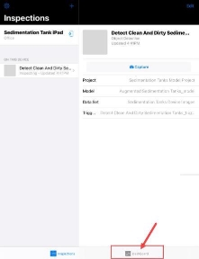

2. Here you need to first select the project that you want to view. Click the **ellipses** icon (blue circle icon with the 3 dots) and then click **Select Project**.

3. In the dashboard configuration screen, leave **IMAGES TO DISPLAY** scroll bar as-is.
4. For **SELECT A PROJECT section**, choose **Sedimentation Tanks Model Project**.

5. Click on **Data set Select > (A)** and then choose **Sedimentation Tanks Device Images** (the data set you created earlier).

 

6. This will bring you to the main dashboard screen, and here you will see statistics associated with the photos taken during the inspections. It includes all photos taken during inspection. These statistics include:

- Total number of inspection photos
- Total number of collected photos
- Fail rate for inspection
- Pass rate for inspection

You can see pass and fail rate for the inspections that were performed.

**Congratulations!** You have just used IBM Maximo Visual Inspection Mobile to identify dirty water sedimentation tanks!

**Sample Dialogue:** This concludes the demonstration. You observed how the MVI AI model sends inspection alerts to the Maximo Monitor. You also performed the steps to build a computer vision model and used that model to configure inspections in MVI Edge and in MVI Mobile. Lastly, you can think of this comprehensive solution where an AI Computer Vision model sends critical alerts beyond the use case of sedimentation tanks and apply it in any mission-critical areas where it is essential to visually detect objects of interest repeatedly at a fast pace and scale. A small assortment of examples includes fast-paced product lines, transmission lines, quality assurance, etc.

  

<h1>Appendix A: Prework</h1>

**<h2>Step 1: Access to Maximo Application Suite Demo Environment </h2>**

Completing this lab requires access to the latest version of the worldwide Maximo Application Suite (MAS) v8.6 demo cluster environment. To make a reservation for the MAS demo environment, please perform the following steps,

1. Click on this[` `**TechZone form** ](https://techzone.ibm.com/my/reservations/create/61e86836cf867a001eadbcaf)to request access to the MAS demo environment.
1. On this form, select **Reserve now** or schedule a preferred time to provision your demo environment access (by selecting **Schedule for later** option) and click **Submit**.

3. Click **Purpose** and select **Practice/Self-Education** from the drop-down list **(A)**.
4. Click **Purpose description** and enter “To follow Maximo Visual Inspection Level 3 Demo Script” **(B)**.
5. Click **Preferred Geography** and select **Dallas 1 (VPC)** from the drop-down list **(C).**
6. Choose an **End date and time** which ensures you have the time required to complete the demo script **(D)**.
7. Click **Submit (E)**. You will receive an email almost immediately that your environment has begun provisioning. After 5-10 minutes, you’ll receive another email notifying that your environment is ready, with details on how to access it.

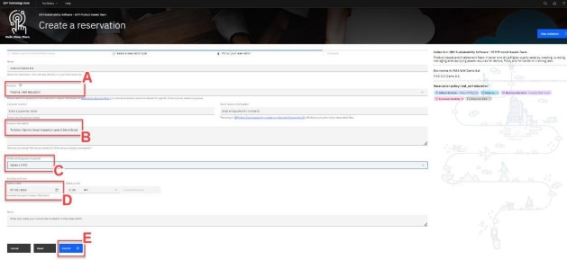

**Caution:** The default duration for reserving this demo environment is 3 days (72 hours), with a maximum duration of 2 weeks (336 hours) depending on the end date you choose when booking the demo (screenshot below). Please try and complete this demo script within the time requested to avoid losing demo access before completion.

8. Once you receive an email notifying your environment is ready to use, locate the URL (Uniform Resource Locator) link in this email for the demo environment **MAS v8.6 Demo Environment URL** and the list of corresponding login credentials. This URL and login credentials will be used later in the demo script.

9. Scroll down this email to view a list of login credentials for each application in the Maximo Application Suite. To follow this demo script, you only require using Maximo Visual Inspection (MVI) username and password. Take a note of the username and password for Maximo Visual Inspection (MVI), as it will be required to log in to the application at a later step.

**<h2>Step 2: Download the Training and Validation Tank Images for the AI Model </h2>**

1. **Download** the images folder from[ Seismic ](https://ibm.seismic.com/Link/Content/DCpWQCmg4Wbg889TgW8X383JR7XB)to your local machine. These images of Sedimentation tanks will be used to train the computer vision model in the later steps.

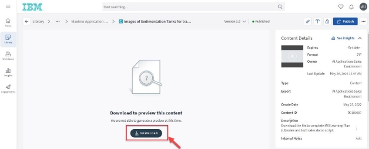

2. **Unzip** the downloaded file and note the location of the directory where you unzipped the file. Once the images are downloaded and unzipped, switch back to the MVI **Data sets** screen (from step 1 in this section)
3. **Download** the model validation images from the Seismic folder link[ Images of Sedimentation Tanks for Testing.](https://ibm.seismic.com/Link/Content/DC6Mq74dFcQV28fG6F74fCpMc9H3) Unzip the images folder and take note of the location of that folder (like you did in[ Step 3: Create a Dataset for Model Training ](#_page0_x57.00_y410.00)). Note that there are multiple images of sedimentation tanks in clean and dirty conditions in the downloaded images folder as shown in the screenshot below.

**<h2>Step 3: Install MVI Mobile Application: </h2>**

1. Open the Apple App Store on your iPhone or iPad and search for **“**IBM Maximo Visual Inspection**”** and click on the result (IBM Maximo Visual Inspection).

2. Clicking the application search result will direct to the application information and download page. This page contains a high-level overview of the IBM MVI Mobile application.

3. Click the **download** icon button (or **Get** button, depending on your device) to install the app on your device.

4. Once installed you will have a Maximo Visual icon on one of the pages in your device’s home screen.

5. If still on the MVI Mobile page in the App Store, click the **OPEN** button to run the app (or alternatively, if you have gone to your home screen then click on the **Maximo Visual icon** to start it).
6. If this is the first time starting the app, you will be presented with Terms and Conditions. Read them and click on **Agree** (step figure not shown).
7. At this point you can choose whether to explore MVI Mobile (demo mode) or get started right away. Click on **I already have an account** (since you already have an account of the MVI training server – where you labeled tank images)

8. You will be prompted to allow MVI Mobile to access the Camera, Photos, and Bluetooth; click **OK** for each one (figure not shown for this step).
9. Once all permissions are allowed, **Name this Device** page appears, enter a name of your choosing in the Device Name field (e.g., “Sedimentation Tank iPad”). Enter a location of your choosing in the Location field (e.g., “Office”). Then click **Next**.

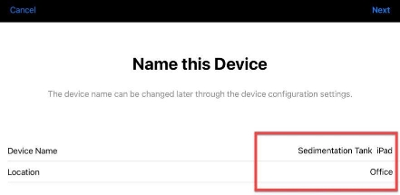

10. At this point you can click **Next** and exit out of the application. The remaining tasks are part of the demo and are defined in[ Part four ](#_page0_x57.00_y546.00)of the demo script.

**<h2>Step 4: Signup Twilio Trial Account for Text Message (SMS) Notifications </h2>**

MVI Mobile and MVI Edge are tightly integrated with Twilio (https://www.twilio.com), a cloud communications platform-as-a-service that allows consumers to programmatically make and receive phone calls, send, and receive text messages, and perform various other communications functions.

This integration allows MVI Mobile and MVI Edge to send a text message (SMS) notification to a mobile phone number when an inspection is completed. Included in the message is information about the objects detected in the inspection image.

Sending text messages via Twilio requires a Twilio account. It also requires that a phone number be assigned to your account. This is not your own personal phone number, but one that Twilio provisions for you. It is a real phone number that effectively provides a software application (MVI Mobile and Edge in this case) with a virtual presence within the physical telephony network. The Twilio phone number will be used to send text messages to your own personal or corporate mobile phone. In other words, you will be receiving text messages on your own mobile phone, and they will be coming from the Twilio phone number assigned to you.

Twilio has partnerships with various telecom providers around the world, from which they have reserved blocks of phone numbers.

Twilio offers a trial account with a preloaded amount of credit (this amount may differ depending on where you are in the world). **No credit card is required** to sign up for this trial account.

Follow the instructions below to sign up for a Twilio account and note your account details particularly;

1. Messaging Service SID
2. Account SID
3. Authorization token
4. Twilio Phone number

**Actions:**

1. Go to Twilio’s website (http[s://www.twilio.com/). ](<http://www.twilio.com/)>)
2. Click the **Sign-up** button on the far top right of the screen.

3. Fill in your personal information **(A)** and then click the **Start your free trial** button **(B)**.

4. You will be sent a verification email to the email address you provided when signing up in the above step. Click the **Confirm Your Email** link within the email you received in your inbox.

5. Once your email has been verified you will also be asked to verify your own personal/corporate mobile phone number. Enter your **mobile phone number** and click the **Verify** button.

6. Once you’ve received the verification code on your phone number as SMS, enter it

**(A)** and then click **Submit (B)**.

7. You will be prompted with a series of questions about how you intend to use Twilio. Answer the questions as required (you may take inspiration from the screenshot below)

8. You will now be taken to the main dashboard screen. If you ever leave the page, you can always click **My first Twilio account** label on the top left of the screen to get back to it.

You will start with a trial balance of credit. Each phone number that you provision (you will only use one in this demo) and all text/API interactions between MVI Mobile and Twilio, and Twilio and your mobile phone, will consume some of this credit.

9. From the dashboard, click on the **Get a Trial Number** button.

10. Next, scroll down below where your newly provisioned phone number will now be visible under **My Twilio phone number** label.

You now have a phone number associated with your account. The next step is to setup a messenger service within Twilio and associate it with your new phone number. This is done with Twilio’s “Messaging” capability, which allows text messages (SMS) to be sent and received worldwide.

11. From the left side panel of the main dashboard, click **Messaging** (**A)** and then click **Services** from the sub-menu that opens.

12. **Messaging Services** page appears on the right, click **Create Messaging Services** blue button.

13. When prompted to create the new messaging service, enter a name of your choosing for the **FRIENDLY NAME** (e.g., **“Tank Health Detection Alert Service”**) and then select **Notify my users** for the purpose from the drop-down menu. Finally, click the **Create Messaging Service** button.

14. Next you will be prompted to add senders to your messaging service. Click **Add Senders** button here.

15. **Add Senders** screen opens. Select **Phone Number** under **Sender Type** dropdown menu option **(A)** and click **Continue (B)**.

16. **Add Senders** page appears. At the bottom of the screen, you will see any Twilio numbers provisioned for your account. Click on the checkbox next to the number assigned to your account. Finally click on **Add Phone Numbers**. Now you have configured SMS inspection alerts to be sent by this Twilio number.

17. To record the Messaging Service SID, click **Properties** from the left side panel to view the properties of your newly created messaging service.

18. Take note the Messaging Service SID from the screen **(A)** (you can copy it on a new notepad file). Afterwards, click on **My first Twilio account** to go back to the main dashboard screen **(B)**.

19. On the dashboard screen, record the following pieces of information (you can copy it on the same notepad file you recorded the Messaging Services SID in the previous step).

- Account SID
- Authorization token (click **Show** to see the value)
- Phone number

20. Save the Notepad file where you recorded the Twilio account details. You will use this information to configure MVI Mobile/MVI Edge and Twilio connectivity in[ Part four : Step 3 Integrating MVI Mobile with Twilio Account.](#_page0_x57.00_y407.00)

  

<h1>Appendix B: Demo Cleanup:</h1>

Once the demo is successfully completed you are required to perform a few clean up tasks to ensure that the demo application environment is not overloaded, and your personal Twilio account information is successfully deleted from the shared demo environment.

 

**<h2>Step 1: Remove your Original and Augmented Datasets from MVI </h2>**

1. On MVI’s main **Data sets** page, select your Original and Augmented datasets (**A**) and click the **trashcan** icon to delete both these datasets (**B**).

2. **Delete data set** window opens. Click **Delete** to confirm datasets deletion.

 

**<h2>Step 2: Remove Twilio account details from MVI Mobile application </h2>**

Like the Edge environment you may need to delete Twilio account details from your MVI Mobile application (if you followed the steps to demo the optional Part Four)

1. Open MVI Mobile application and click on the **gear and phone** icon next to your inspection title (Sedimentation Tank iPad)

2. Configuration Device page appears. Click on Twilio Settings to view your account details.

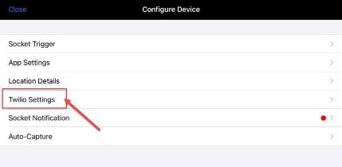

3. Disable the Twilio Notifications toggle and delete all your account information on this page. Once deleted click **Save.**

