# 102: Actions and basic Identity Access Management

## In this section

Learn about the fundamental building blocks of a virtual assistant and how to collaborate on an
assistant with colleagues.

## Prerequisites

Complete this section with the assistant you used in the 101 section **or** your own assistant. If you
want to use your own assistant, you must [upload](https://cloud.ibm.com/docs/watson-assistant?topic=watson-assistant-admin-backup-restore#backup-restore-import) the following [Action skill](https://raw.githubusercontent.com/CloudPak-Outcomes/Watson-Asst-Lab/main/action-skills/LendyrActions_v17_Live_lastchecked03Jan2023.json) which reflects the skill after completing section 101.

## Collaborating on an assistant

In order to add a user to collaborate on this assistant:

1. Click the **Profile** icon present in the top-right navigation bar.
2. From the menu selected the **Add users** options.
3. A modal will appear that you can enter valid email addresses to.
4. Once done entering email addresses click **Submit**.
5. A confirmation popup will appear showing that an invite has been sent.

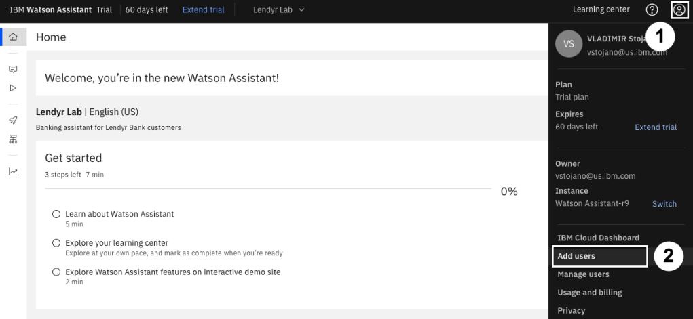

## Building your first action

Let's get started creating a new action. In order to do so start by clicking the **Actions** option available in the left-hand navigation bar to get to the Actions page. Once there you should see a long list of current actions already there if you imported the JSON file from earlier into your assistant.

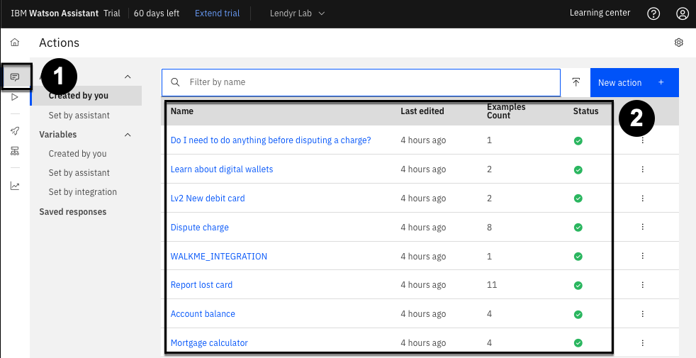

Clicking the **Search icon** you should be able to use a text input to query the list. Start by typing `Open an account` into the search field to find the corresponding action.

Now, imagine that you work on the Lendyr virtual assistant team, and you received a message that this automation will be discontinued. You need to replace this Action with a new one so that customers don't run into a "dead end" when they try to open a new account.

In order to delete the action:

1. Click the **ellipsis icon** to show options for the action.
2. Select **Delete** from the overflow menu.
3. Confirm the deletion of this action by clicking **Delete** again in the modal.

Now let's build a new conversation flow that starts with the question "I want to open a new checking account please". Something like:

To build it:

1. Click the **New action +** button
2. In the resulting menu select **Start from scratch**
3. Give it the name `I want to open a new checking account please` and click **Save**

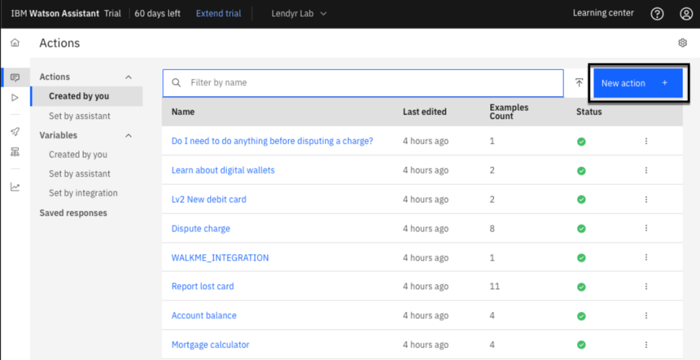

We've created our action and you should see an empty first step available to you. Now to fill in the Step 1:

1. Add the clarifying question in the **Assistants says** text box, such as "What type of account would you like to open?".
2. Then click **Define customer response**.
3. Hover over **Options**.
4. Click **As a list** to enter the account options.
5. On the resulting popup enter three options **Checking**, **Savings**, and **Investment**.
6. Click **Apply** to save your changes.

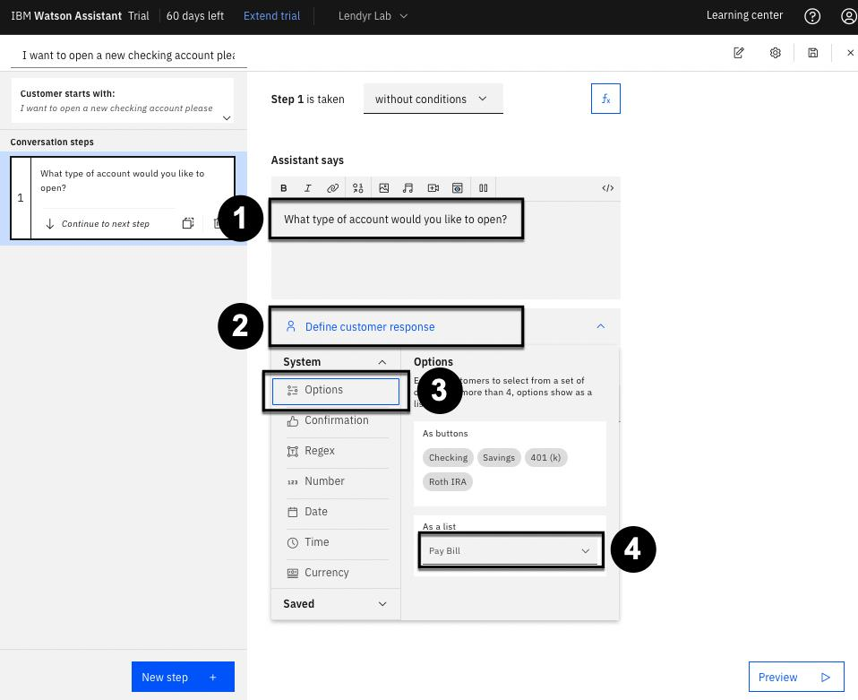

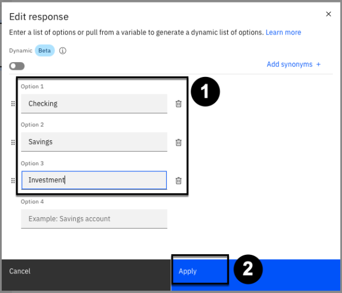

Your are now done with your first step! Click the **Save icon** in the top-right to save the changes to your new action.

> Aside from the Save button, Watson Assistant automatically saves changes when you click on a
> new step or open the preview. There's no "undo," however the auto-save can be switched off.
> For more details, check the product documentation [here](https://cloud.ibm.com/docs/watson-assistant?topic=watson-assistant-save-actions).

## Preview your action

Note the **Preview** button in the lower-right which is present on virtually every screen you build your Actions. This button gives you the ability to instantly preview how the assistant works, at any time. Go ahead and click **Preview**:

This open the **Preview** panel. Try out the newly added action by entering something similar to "How can I open a new account?".

> Note that although you didn't train the assistant on that specific question it was still able to response will the correct response for our newly created action.

Now select one of the account types, and note that the action is complete; there are no additional steps for the assistant to take.

Click the refresh icon, and try asking the question another way, such as "I need a new account". Note that the assistant doesn't recognize this input:

Let's expand the action to be able to understand this phase:

1. Click the **Customer starts with:** section on the left-hand side.
2. Enter the phrase `I need a new account`.
3. You should now have 2 phrases available for the customer to start with.

Start the preview again and use this phrase to ensure our assistant is now able to understand it.

## Create another clarification step

With your first step created and tested, let's finish this Action by creating another step:

1. Click the first step in the side menu.
2. Add **Step 2** by clicking **New step +**.
3. Enter `What's your investor number?` in the **Assistant says** box.
4. Click **Define customer response** and select **Number**.

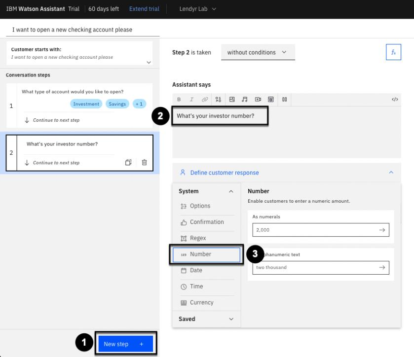

Next, you need to add some flow logic. Given the way this flow is intended to work an investor number should only be gathered in the case of the customer wanting to open an investment account. To do this:

1. Change **without conditions** to **with conditions**.
2. Ensure the ensure to the first question was **Investment** by select it from the dropdown.
3. Click the **Save icon** to ensure these changes are saved.

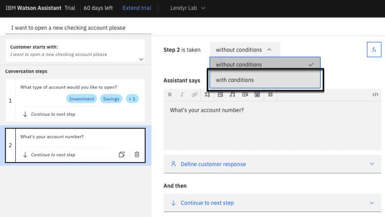

## Create an agent handoff step

Now, you will add steps 3 and 4, each of which provide a final outcome to the user. In order to create step 3:

1. Ensure you are currently viewing **Step 2**.
2. Add **Step 3** by clicking **Next step +**.
3. Select **with conditions** to make this step conditional, and enter the same condition used before (Step 1 = Investment).
4. Enter `Let's connect you to an agent who can open a new investment account for you!` into the **Assistant says** box.
5. Click the options under **And then** and select **Connect to agent**
6. In the resulting modal, under **Message to agent (Optional)** type `The customer wants to open an investment account, and their investor number is $` to give context to the live agent.
   - Note that the `$` will cause a dropdown to appear. Be sure to click **2. What's your investor number** to pass this data along to the agent.
7. Click **Apply**
8. Finally, click the **Save icon** again in the top-right.

## Create a final response step

Lastly, let's create the final step of this action. This one should return a link to the user based on type of account they want to open. To create this step:

1. Ensure **Step 3** is selected.
2. Click **Next step +** to add **Step 4**.
3. Under **Assistant says** type `To open a`.
4. Now click the **Variable** button.
5. Insert the response from Step 1 as the Action variable **(1. What type of account would you like to open?)**.
6. Now complete the line with `account, visit our online portal`.
7. Make the text `online portal` a link by selecting it and clicking the **Link** toolbar icon.
   - Under the **URL** section input `lendyr.com/open-a-new-account?account_type=$`.
   - The `$` will once again invoke our Action variables, and you can select **type of account** (Note: this will not create a working URL; it is just an illustration of how a parameter is passed through a link).
8. Click **Apply** to create the link.

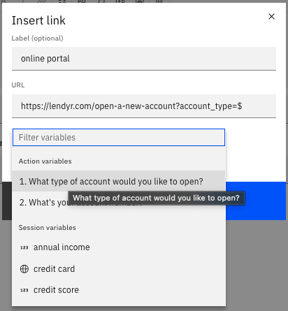

Now let's apply some conditions by:

1. Changing **without conditions** to **with conditions**.
2. Select **1. What type of account...**.
3. Change **is** to **is any of**.
4. Ensure both **Checking** and **Savings** are selected.

Finally, ensure the **And then** option is set to **End the action** to end the action after this step.

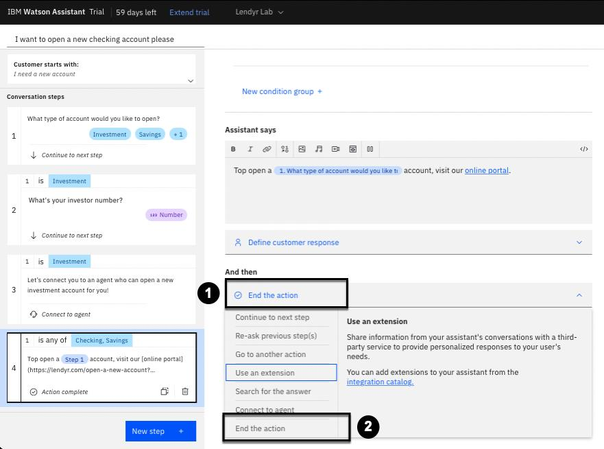

Boom! Your steps should now be complete. Open up the preview and test the some of the steps of this action.

## Preview your assistant

🟢 Parts of this section will be on the quiz 🟢

Navigate back to the home page of your assistant. Next, you will check to see how your assistant will appear to users on the web. To do this:

1. On the left side, click **Preview**.
2. Note the inline preview for you to test the assistant.
3. The **Customize web chat** button will allow you to change the look of your assistant.
4. Make sure you are in the **Style** tab of the resulting menu.
5. Change the **Assistant's name as known by customers** to "Lendyr Assistant".
6. Click on **Add an avatar image** and point to [this image link](https://web-chat.global.assistant.watson.appdomain.cloud/assets/Lendyr-Avatar.png).
7. Change **Primary color** to `#004144`. This is the color of the chant header.
8. Change **Secondary color** to `#3D3D3D`. This colors the message bubble.
9. Change **Accent color** to `#004144`. This accentuates certain responses and icons.

Now you will customize the home screen tab. Start by:

1. Click the **home screen** tab.
2. Change **Greeting** to: "Hi, I'm Lendyr assistant! How can I help you?"
3. Change **Starter 1** to: "Get to know Lendyr"
4. Change **Starter 2** to: "Pay bills"
5. Change **Starter 3** to: "Find nearest branches"

You've now customized your assistant to be similar to the Lendyr demo.

## Preview your assistant on Lendyr Bank's website

Now, you will embed your assistant in the Lendyr Bank’s website! To do this:

1. Click on the **Embed** tab.
2. Copy the value of your assistant's **integration ID** and paste it into a text document. You will use the value shortly
3. Copy the value of your assistants's **region** and paste it into a text document.
4. Copy the value of your assistants's **serviceInstanceId** and paste it into a text document.
5. Finally, click **Save and exit**.

Now take those three values, and plug them into this URL:

`https://www.ibm.com/products/watson-assistant/demos/lendyr/demo.html?integrationID=ID_HERE&region=REGION_HERE&serviceInstanceID=ID_HERE`

Open this URL and explore the "Open a new account" Action in your assistant. You have successfully created and used your first Action on the Lendyr Bank site! Nicely done.

## Simple Q&A action

🟢 Parts of this section will be on the quiz 🟢

Let’s build a second Action. This Action will simply answer an end user’s question about how
long it takes to open an account. First, get back to the **Actions (1)** screen by clicking on the
**Actions** left-hand menu item. Then, click **New action + (2)**:

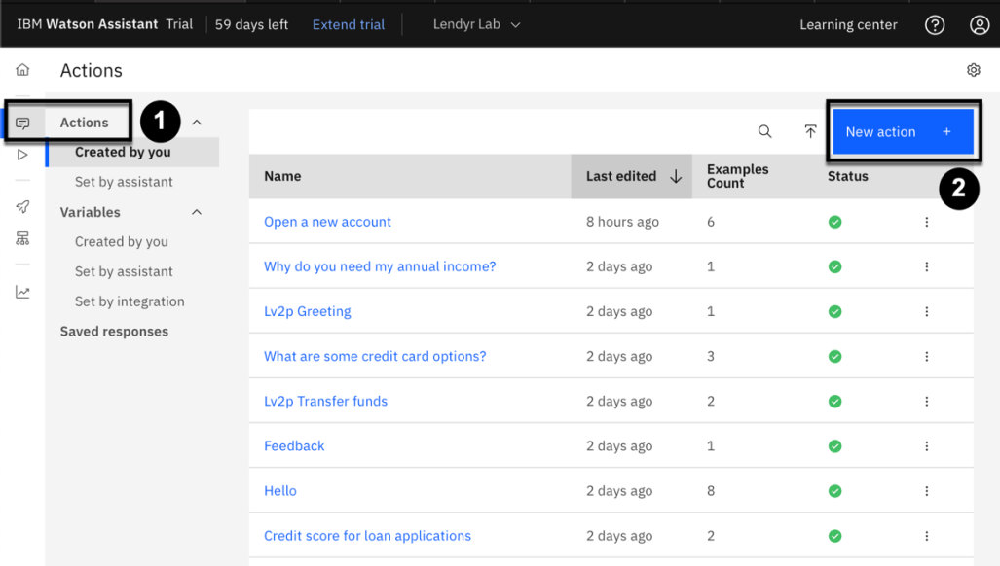

As you did earlier, select the **Start from scratch** option (we’ll look at templates later in this lab).
For the customer utterance, enter “Time to open an account” (**1)** and click **Save (2)**:

In the first step, in **Assistant says (1)**, enter: "New Lendyr customers can open a new account in
one to two business days. Existing Lendyr customers can open a new account in minutes via the
web portal or by speaking with a Lendyr account expert." Then, click **New step +**:

In this second step, click the **Image response type** icon in **Assistant says**:

Then, add an image with the following properties:

- **Source URL:** https://img.money.com/2020/10/checking-vs-savings-revised-1.gif
- **Alt text:** Checking versus savings
- **Title:** Checking versus savings
- **Description:** Learn more about checking, savings, and other account types on our website!

Verify that your screen looks like the image below, and click **Apply**:

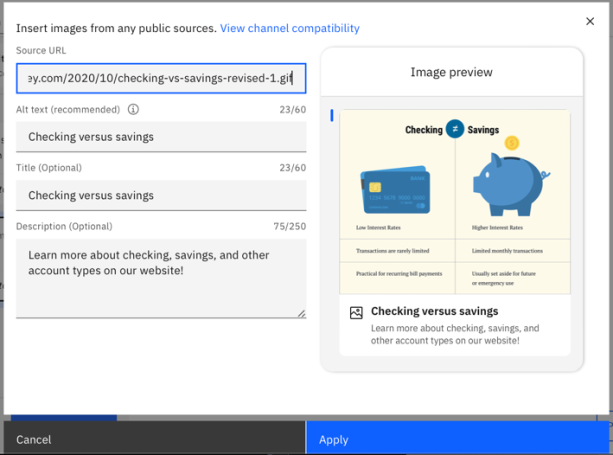

This will be the last step in this Action, so change **And then (1)** to **End the action (2)**:

Brainstorm and add a few more example phrases to this Action – start with, "How long does it
take to open a new account?" (Remember, you can enter these by clicking on the **Customer
starts with:** window.) Now, Save and Preview your new Action using your custom Lendyr
URL!
