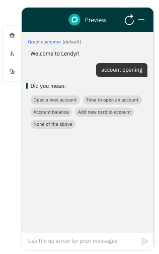
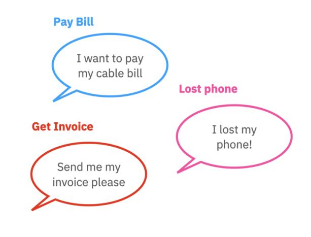
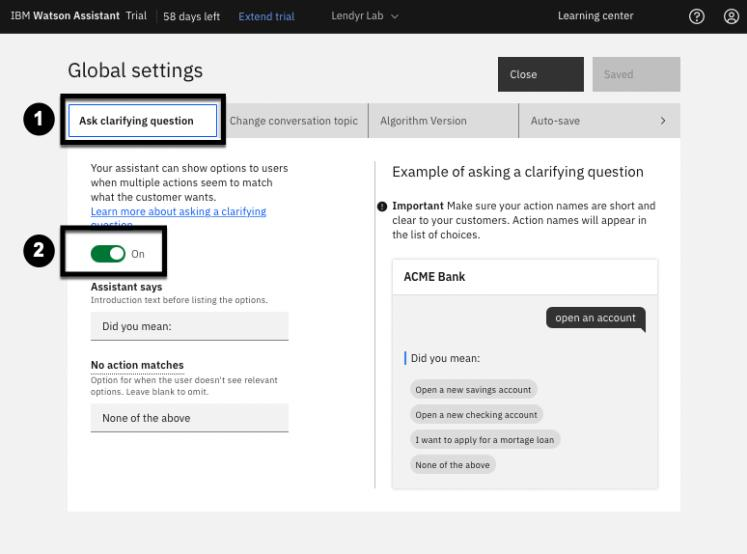
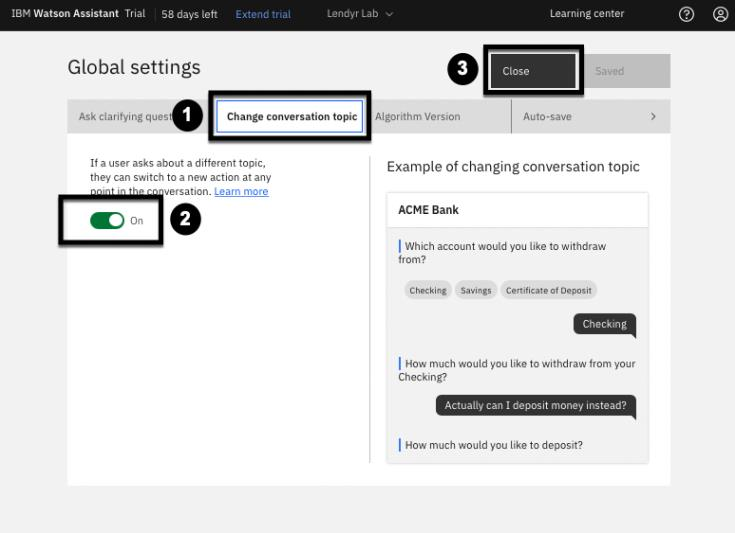
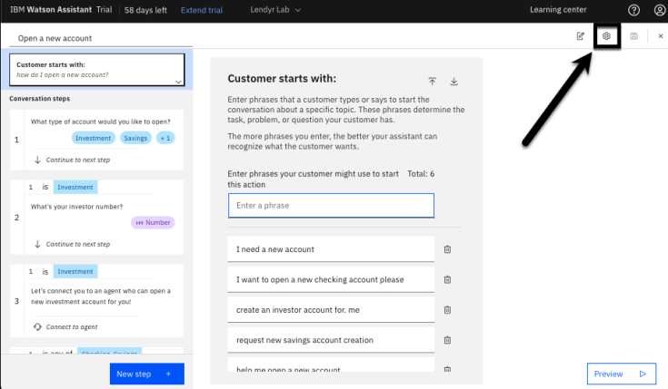
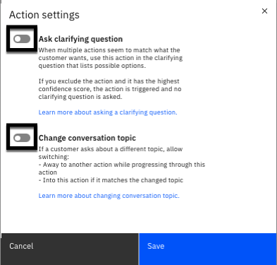

# 103: Out-the-box Artificial Intelligence

## In this lesson
Learn about the artificial intelligence that runs out-of-the-box in Watson Assistant.

## Prerequisites

Complete this section with the assistant you used in the 102 section **or** your own assistant. If you 
want to use your own assistant, you must [upload](https://cloud.ibm.com/docs/watson-assistant?topic=watson-assistant-admin-backup-restore#backup-restore-import) the following [Action skill](https://raw.githubusercontent.com/CloudPak-Outcomes/Watson-Asst-Lab/main/action-skills/begin-103-action-skill.json) which reflects the 
skill after completing section 102.

## See Disambiguation at work

To see the confidence scores, you must be in the Preview window within the Actions page of your assistant. Go back to your assistant's **Actions** page, and open the **Preview**.

Say "account opening", and note the clarifying question that your assistant asks in response to
the input.

To view the confidence scores in your assistant:

1. Click the **Debug mode** icon.
2. Hover your mouse over the **dial icon** next to the "account opening" message.
3. This will display the confidence scores as percentages.

## Autolearning

When end users interact with your assistant, they provide the assistant with a lot of data on their behavior. Watson Assistant pays attention to this, and it learns from such behaviors over time.

Consider disambiguation. When your assistant asks a clarifying question and shows a list of suggested actions, if end users most often click the same on (option #2, for example), then your assistant should (and does!) learn from that experience.

It learns that option #2 is likely to be the best answer to that type of question. Next time, it may list option #2 as the first choice, so end users can get to it more quickly.

And, if the pattern persists over time, your assistant can change its behavior even further. Instead of asking the customer to choose from a list of options, it will choose option #2 as the answer, rather than asking for clarification.As Watson Assistant learns, end users get the best answer more often, in fewer clicks, and their experience improves!

## Digression / Change conversation topic

### What is a digression?

We, as people, often get distracted or change the subject during a conversation. For example,
imagine I was telling you an incredibly interesting story about seeing my friend Arvind with
binoculars. To you, this might be far from the most interesting story you had ever heard. You
might interrupt and say, "Wow! Also, before I forget, I got some cheap tickets to see the Jets
next month. Want to come with me?""

End users also want to be able to change the topic when they interact with a virtual assistant.
Watson Assistant is flexible: it can seamlessly switch between actions when the end user wants a
change.

### See Digression at work

Here is an example of digression where Watson Assistant moves between different actions:

1. In the **Preview** type "I'm thinking about applying for a student loan".
2. Note the assistant recognizes the **Applying for a student loan** action.
3. Now type "How much can we get in loans?".
4. Note that the assistant will digress to the **Student loan amounts** action.
5. Then, once you complete the **Student loan amounts** action by selecting "Undergraduate", the assistant returns to the original "Applying for a student loan" action.

## Slot-filling

Slot-filling is a term that refers to storing information that the end user shares with the assistant.
You can think of the assistant as storing each piece of information in a slot.

To see this in action:

1. Open a **Preview** of the assistant from the **Actions** page.
   - If you have an active preview open click the refresh button.
2. Click the `fx` button to see the slots the assistant maintains.
3. Enter some of these utterances:
   - "I want to open a new account"
   - "Investment"
   - "837479088"
4. Note how data is filled in on the **Action variable** window

This, by itself, is not an artificial intelligence feature. Artificial intelligence comes in when the
end user corrects themselves or provides information out of order or ahead of time.

Click **Refresh** and say "I want to open a new account and my investor account is 8875888", and then select "investment" for the type of account. Note that Watson Assistant puts the investor number in its slot, even though you told Watson Assistant previously to expect it in a subsequent step.

## Disabling digression and disambiguation

🟢 Parts of this section will be on the quiz 🟢

While digression and disambiguation are enabled by default for all actions, builders can enable 
or disable disambiguation and digression, either across the entire assistant or for specific actions.

When disambiguation is disabled across the entire assistant, the assistant will never ask for 
clarification. It will either go to an action or tell the end user it does not understand their 
message. When disambiguation is disabled for a specific action, that action will never be 
suggested by the assistant as a potential option for the end user to choose from.

When digression is disabled across the entire assistant, the assistant will never allow an end user 
to change the topic. The end user must finish their current action before moving to a new topic. 
When digression is disabled for a specific action, the assistant will not allow the end user to 
change topics to or from that specific action.

Take a minute to think about why a builder might want to disable disambiguation across the 
entire assistant. How about disabling it across some specific actions? What about disabling 
digression across the entire assistant? How about disabling digression for some specific actions?

Now practice disabling disambiguation and digression for your assistant. As shown below, go to 
the **Actions (1)** page, then click the gear icon in the top right to open the **Global settings (2)**.

The global settings window opens directly on the **Ask clarifying question (1)** tab. This is where 
you can toggle disambiguation On or Off (2) for all actions. Leave it On for now.

Next, move to the **Change conversation topic (1)** tab, shown below. This is where you can 
toggle digression **On or Off (2)** for all actions. Leave it On. You will test turning both features 
off for an individual action, instead. Hit **Close (3)** to return to the **Actions** window.

Now, practice disabling disambiguation and digression for a specific action. Click on the “Open
a new account” action, then click on the **Action settings** icon:

Then, switch both toggles to **Off**, and hit **Save**:

> Note: It was important to leave disambiguation and digression enabled in the global settings, 
otherwise the toggles for specific actions would have been locked in the **off** position.

Now, go back to the **Preview** panel, and try these brief conversations. Type "accounts":

> Note that on the left, the "How do I open a new account" action is not shown as a suggestion –
this is because you just excluded it from disambiguation. 

Now, Refresh the chat, and type "how do I open a new account". Then, instead of responding to 
the assistant’s question of what type of an account you want to open, try to force a digression by 
saying "time to open an account":

Note that it does not let you digress when you ask how long it takes to open an account. 

> Note: Toggle both features back on if you intend to continue using your demo outside of this lab.