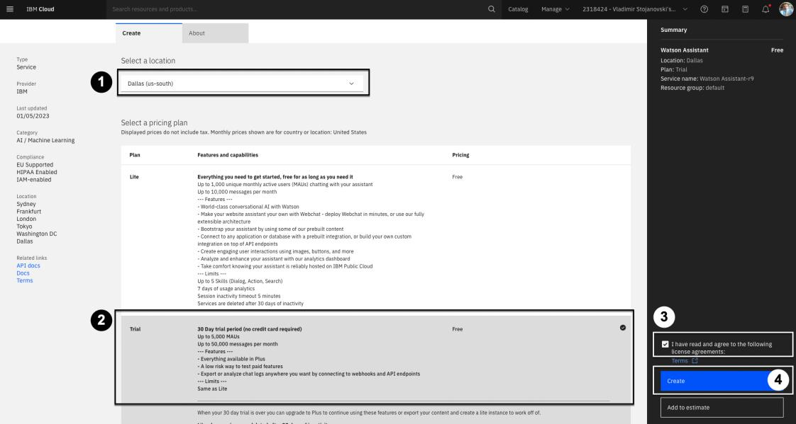
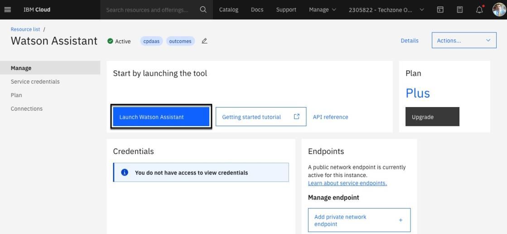
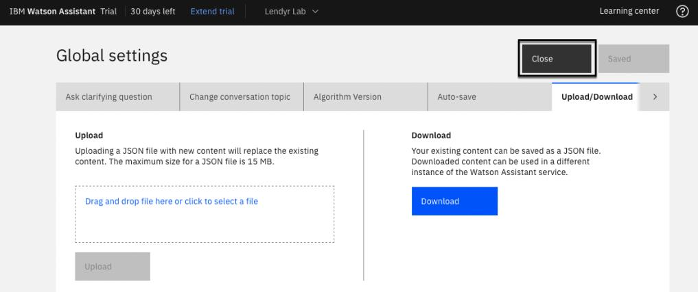
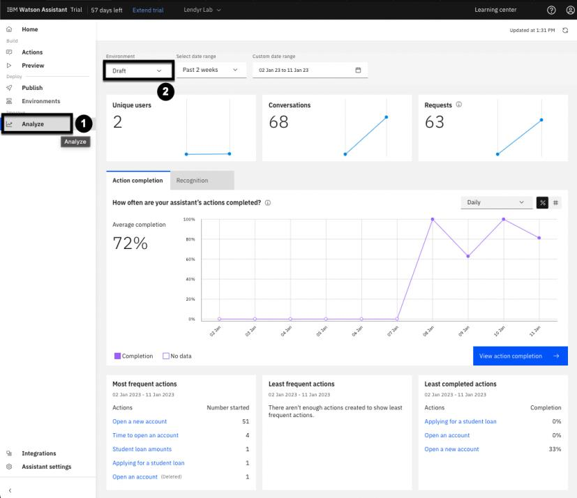
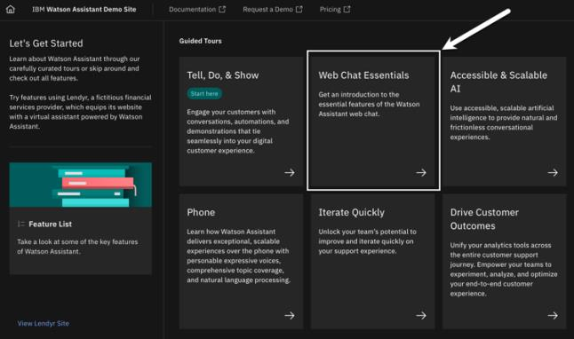
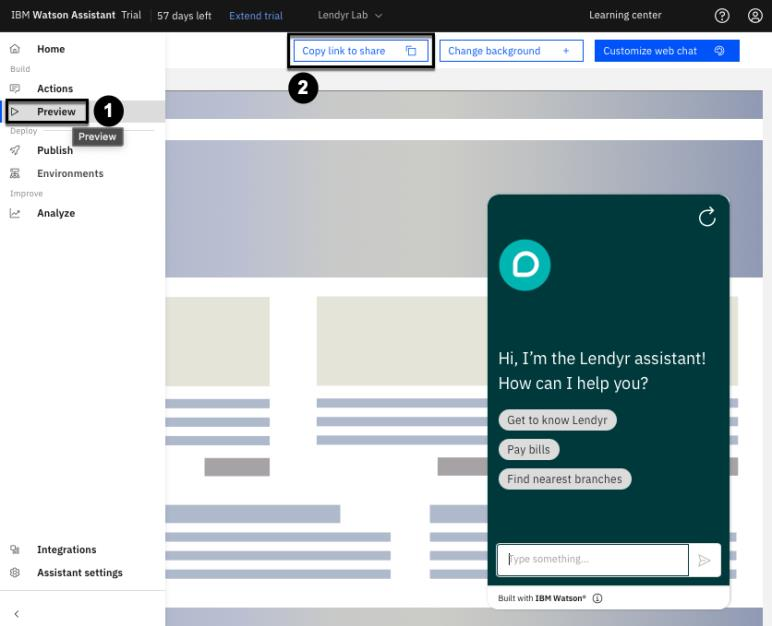

# Watson Assistant

## End user's perspective

Imagine you are an end user, and explore this virtual assistant build with Watson Assistant:

[Lendyr.com](http://lendyr.com/)

Try running through some of these conversations with the assistant:

| Conversation #1                                                                                                         | Conversation #2                                                                                      | Conversation #3                                                                                                            | Conversation #4        |
|-------------------------------------------------------------------------------------------------------------------------|------------------------------------------------------------------------------------------------------|----------------------------------------------------------------------------------------------------------------------------|------------------------|
| **Send:** I want to apply for a student loan **Send:** What's the limit on loan amount? **Send:** I'm coming from high school | **Send:** Hey, I want to use the mortgage calculator **Send:** 400,000 **Send:** actually make it $300,000 | **Send:** hey I want to send a million dollars to myself **Send:** tomorrow **Send:** ugh just let me talk to a real person!!!!! | **Send:** load application |

Take note of the features and functionality you see in the assistant:

- Asking questions as an end user
- Identifying the question that the end user is asking, or the action they want to take
- Allowing the end user to interrupt the conversation
- Doing something different if the end user answers "yes" versus answering "no"
- Starting over when something goes wrong
- A panel where the end user has the conversation with the assistant
- Synonyms and context (loan coming from high school = will be an undergraduate 
student)

## Setting up Watson Assistant

Starting by navigating to [IBM Cloud](https://cloud.ibm.com)

If you already have a Trial, Plus, or Enterprise instance of Watson Assistant, open it up and 
create a new assistant. If you don’t have an instance of Watson Assistant, follow these 
instructions to create a free Trial instance.

To create a free Trial instance, Search for "Watson Assistant" in the top search bar and click 
**Watson Assistant** under **Catalog Results**.

Now we can create our assistant by:

1. Select the region that's closest to your location.
2. Select the **Trial** pricing plan. (This is the trial version of the Plus pricing plan.)
3. Agree to the **Terms and Conditions**.
4. Click on the **Create** button in the lower-right area of the page.

Now let's validate the creation of our new assistant:

1. Click the **Resource list** icon on the left-side navigation.
2. Expand the **AI/Machine Learning** section
3. You should now be able to see your newly created Watson Assistant

> Note: The service you create may have a suffix, like “Watson Assistant-hu.” These names are 
identifiers for you to distinguish between the multiple services you may create. You can change 
them if you like.

To launch Watson Assistant, click on the new service you created. From here, clicking the **Launch Watson Assistant** button will launch to the Watson Assistant homepage. 

1. Input a name you like into the **Assistant name** field.
2. Provide a short description in the **Description field** (this is optional).
3. Click the **Next** button in the top-right corner of the page.

On the following screen, make these selections:

1. Select **Web** as this assistant will be accessed via a web browser.
2. Select **Banking and financial services** as the industry.
3. Select **Developer** as our builder persona.
4. Select **I want to provide confident answers to common questions** as the main purpose of the assistant.
5. Now click the **Next** button on the top-right

The next screen will now allow you to customize the look and feel of your assistant. Customize now or feel free to just click the **Next** button again in the top-right.

This screen allows you to preview the web chat of the assistant. Feel free to click the **Create** button in the top-right.

Finally, as shown on the image below, you will see the Home page of your new assistant.

## Builder's perspective

Let's explore the persona of the Builder.

To explore this perspective, you will create a copy of the Lendyr demo assistant in the new assistant that's been created.

From the Home page, click on the **Actions** tab on the left-side. This is where content is written that the virtual assistant will be trained to answer.

> Actions are a representation of the tasks you want your assistant to help your customers with. 
Each action contains a series of steps that represent individual exchanges with a customer. 
Actions allow you to build an Assistant that can easily converse with a customer with **no
coding** knowledge needed!

Now click the **Global settings** cog icon in the top-right. We will add some predefined actions by:

1. Clicking the **Upload/Download** tab.
2. Down [this json file](https://raw.githubusercontent.com/CloudPak-Outcomes/Watson-Asst-Lab/main/action-skills/LendyrActions_v17_Live_lastchecked03Jan2023.json).
3. Then proceed to upload it into the web page by selecting the file or dropping it in.
4. Then click the **Upload** button.
5. If a modal displays click **Upload and replace**.

A toast notification should now display confirming your upload. Finally, close the global settings window.

Your assistant is now a copy of the Lendyr.com assistant!

## Developer's perspective

Developers can work in the Actions page too, but they often focus on more technical features. From the **Home** page, open the left menu and click **Integrations** on the bottom-left.

Watson Assistant Integrations add various channels, extensions, and third-party integrations to easily configure and deploy your assistant. Spend a few minutes exploring the Integrations page.

Earlier, we noted that developers spend more time on technical features than on the Actions page, where builders create new conversational flows. Why is that? Since Watson Assistant is purposefully designed to make it easy for non-technical builders to author conversational flows, developers can focus in on the parts of a virtual assistant that require their technical expertise, like integrations with other applications.

## Product manager's perspective

Finally, let's explore the perspective of a product manager.

Product managers can work in the Actions and Integrations pages, but they typically focus on overall success, continuous improvement, and expansion. Using the left menu explore the **Publish**, **Environments**, and **Analyze** pages.

# 102: Actions and basic Identity Access Management

## Collaborating on an assistant

In order to add a user to collaborate on this assistant:

1. Click the **Profile** icon present in the top-right navigation bar.
2. From the menu selected the **Add users** options.
3. A modal will appear that you can enter valid email addresses to.
4. Once done entering email addresses click **Submit**.
5. A confirmation popup will appear showing that an invite has been sent. 

## Building your first action

Let's get started creating a new action. In order to do so start by clicking the **Actions** option available in the left-hand navigation bar to get to the Actions page. Once there you should see a long list of current actions already there if you imported the JSON file from earlier into your assistant.

Clicking the **Search icon** you should be able to use a text input to query the list. Start by typing `Open an account` into the search field to find the corresponding action.

Now, imagine that you work on the Lendyr virtual assistant team, and you received a message that this automation will be discontinued. You need to replace this Action with a new one so that customers don't run into a "dead end" when they try to open a new account.

In order to delete the action:

1. Click the **ellipsis icon** to show options for the action.
2. Select **Delete** from the overflow menu.
3. Confirm the deletion of this action by clicking **Delete** again in the modal.

Now let's build a new conversation flow that starts with the question "I want to open a new checking account please". Something like: 

To build it:

1. Click the **New action +** button
2. In the resulting menu select **Start from scratch**
3. Give it the name `I want to open a new checking account please` and click **Save**

We've created our action and you should see an empty first step available to you. Now to fill in the Step 1:

1. Add the clarifying question in the **Assistants says** text box, such as "What type of account would you like to open?".
2. Then click **Define customer response**.
3. Hover over **Options**.
4. Click **As a list** to enter the account options.
5. On the resulting popup enter three options **Checking**, **Savings**, and **Investment**.
6. Click **Apply** to save your changes.

Your are now done with your first step! Click the **Save icon** in the top-right to save the changes to your new action.

> Aside from the Save button, Watson Assistant automatically saves changes when you click on a 
new step or open the preview. There's no "undo," however the auto-save can be switched off. 
For more details, check the product documentation [here](https://cloud.ibm.com/docs/watson-assistant?topic=watson-assistant-save-actions).

## Preview your action

Note the **Preview** button in the lower-right which is present on virtually every screen you build your Actions. This button gives you the ability to instantly preview how the assistant works, at any time. Go ahead and click **Preview**:

This open the **Preview** panel. Try out the newly added action by entering something similar to "How can I open a new account?".

> Note that although you didn't train the assistant on that specific question it was still able to response will the correct response for our newly created action. 

Now select one of the account types, and note that the action is complete; there are no additional steps for the assistant to take. 

Click the refresh icon, and try asking the question another way, such as "I need a new account". Note that the assistant doesn't recognize this input:

Let's expand the action to be able to understand this phase:

1. Click the **Customer starts with:** section on the left-hand side.
2. Enter the phrase `I need a new account`.
3. You should now have 2 phrases available for the customer to start with.

Start the preview again and use this phrase to ensure our assistant is now able to understand it.

## Create another clarification step

With your first step created and tested, let's finish this Action by creating another step:

1. Click the first step in the side menu. 
2. Add **Step 2** by clicking **New step +**.
3. Enter `What's your investor number?` in the  **Assistant says** box.
4. Click **Define customer response** and select **Number**.

Next, you need to add some flow logic. Given the way this flow is intended to work an investor number should only be gathered in the case of the customer wanting to open an investment account. To do this:

1. Change **without conditions** to **with conditions**. 
2. Ensure the ensure to the first  question was **Investment** by select it from the dropdown.
3. Click the **Save icon** to ensure these changes are saved.

## Create an agent handoff step

Now, you will add steps 3 and 4, each of which provide a final outcome to the user. In order to create step 3:

1. Ensure you are currently viewing **Step 2**.
2. Add **Step 3** by clicking **Next step +**.
3. Select **with conditions** to make this step conditional, and enter the same condition used before (Step 1 = Investment).
4. Enter `Let's connect you to an agent who can open a new investment account for you!` into the **Assistant says** box.
5. Click the options under **And then** and select **Connect to agent**
6. In the resulting modal, under **Message to agent (Optional)** type `The customer wants to open an investment account, and their investor number is $` to give context to the live agent.
    - Note that the `$` will cause  a dropdown to appear. Be sure to click **2. What's your investor number** to pass this data along to the agent.
7. Click **Apply**
8. Finally, click the **Save icon** again in the top-right.

## Create a final response step

Lastly, let's create the final step of this action. This one should return a link to the user based on type of account they want to open. To create this step:

1. Ensure **Step 3** is selected.
2. Click **Next step +** to add **Step 4**.
3. Under **Assistant says** type `To open a`.
4. Now click the **Variable** button.
5. Insert the response from Step 1 as the Action variable **(1. What type of account would you like to open?)**.
6. Now complete the line with `account, visit our online portal`.
7. Make the text `online portal` a link by selecting it and clicking the **Link** toolbar icon.
    - Under the **URL** section input `lendyr.com/open-a-new-account?account_type=$`.
    - The `$` will once again invoke our Action variables, and you can select **type of account** (Note: this will not create a working URL; it is just an illustration of how a parameter is passed through a link).
8. Click **Apply** to create the link.

Now let's apply some conditions by:

1. Changing **without conditions** to **with conditions**.
2. Select **1. What type of account...**.
3. Change **is** to **is any of**.
4. Ensure both **Checking** and **Savings** are selected.

Finally, ensure the **And then** option is set to **End the action** to end the action after this step.

Boom! Your steps should now be complete. Open up the preview and test the some of the steps of this action.

## Preview your assistant

Navigate back to the home page of your assistant. Next, you will check to see how your assistant will appear to users on the web. To do this:

1. On the left side, click **Preview**.
2. Note the inline preview for you to test the assistant.
3. The **Customize web chat** button will allow you to change the look of your assistant.
4. Make sure you are in the **Style** tab of the resulting menu.
5. Change the **Assistant's name as known by customers** to "Lendyr Assistant".
6. Click on **Add an avatar image** and point to [this image link](https://web-chat.global.assistant.watson.appdomain.cloud/assets/Lendyr-Avatar.png).
7. Change **Primary color** to `#004144`. This is the color of the chant header.
8. Change **Secondary color** to `#3D3D3D`. This colors the message bubble.
9. Change **Accent color** to `#004144`. This accentuates certain responses and icons. 

Now you will customize the home screen tab. Start by:

1. Click the **home screen** tab.
2. Change **Greeting** to: "Hi, I'm Lendyr assistant! How can I help you?"
3. Change **Starter 1** to: "Get to know Lendyr"
4. Change **Starter 2** to: "Pay bills"
5. Change **Starter 3** to: "Find nearest branches"

You've now customized your assistant to be similar to the Lendyr demo.

## Preview your assistant on Lendyr Bank's website

Now, you will embed your assistant in the Lendyr Bank’s website! To do this:

1. Click on the **Embed** tab.
2. Copy the value of your assistant's **integration ID** and paste it into a text document. You will use the value shortly
3. Copy the value of your assistants's **region** and paste it into a text document. 
4. Copy the value of your assistants's **serviceInstanceId** and paste it into a text document.
5. Finally, click **Save and exit**.

Now take those three values, and plug them into this URL:

`https://www.ibm.com/products/watson-assistant/demos/lendyr/demo.html?integrationID=ID_HERE&region=REGION_HERE&serviceInstanceID=ID_HERE`

Open this URL and explore the "Open a new account" Action in your assistant. You have successfully created and used your first Action on the Lendyr Bank site! Nicely done.

# 103: Out-the-box Artificial Intelligence

## See Disambiguation at work

To see the confidence scores, you must be in the Preview window within the Actions page of your assistant. Go back to your assistant's **Actions** page, and open the **Preview**.

Say "account opening", and note the clarifying question that your assistant asks in response to 
the input.

To view the confidence scores in your assistant:

1. Click the **Debug mode** icon.
2. Hover your mouse over the **dial icon** next to the "account opening" message.
3. This will display the confidence scores as percentages.

## Autolearning

When end users interact with your assistant, they provide the assistant with a lot of data on their behavior. Watson Assistant pays attention to this, and it learns from such behaviors over time. 

Consider disambiguation. When your assistant asks a clarifying question and shows a list of suggested actions, if end users most often click the same on (option #2, for example), then your assistant should (and does!) learn from that experience.

It learns that option #2 is likely to be the best answer to that type of question. Next time, it may list option #2 as the first choice, so end users can get to it more quickly.

And, if the pattern persists over time, your assistant can change its behavior even further. Instead of asking the customer to choose from a list of options, it will choose option #2 as the answer, rather than asking for clarification.As Watson Assistant learns, end users get the best answer more often, in fewer clicks, and their experience improves!

## Digression / Change conversation topic

### What is a digression?

We, as people, often get distracted or change the subject during a conversation. For example, 
imagine I was telling you an incredibly interesting story about seeing my friend Arvind with 
binoculars. To you, this might be far from the most interesting story you had ever heard. You 
might interrupt and say, "Wow! Also, before I forget, I got some cheap tickets to see the Jets 
next month. Want to come with me?""

End users also want to be able to change the topic when they interact with a virtual assistant. 
Watson Assistant is flexible: it can seamlessly switch between actions when the end user wants a 
change.

### See Digression at work

Here is an example of digression where Watson Assistant moves between different actions:

1. In the **Preview** type "I'm thinking about applying for a student loan".
2. Note the assistant recognizes the **Applying for a student loan** action.
3. Now type "How much can we get in loans?".
4. Note that the assistant will digress to the **Student loan amounts** action.
5. Then, once you complete the **Student loan amounts** action by selecting "Undergraduate", the assistant returns to the original "Applying for a student loan" action.

## Slot-filling

Slot-filling is a term that refers to storing information that the end user shares with the assistant. 
You can think of the assistant as storing each piece of information in a slot.

To see this in action:

1. Open a **Preview** of the assistant from the **Actions** page.
    - If you have an active preview open click the refresh button.
2. Click the `fx` button to see the slots the assistant maintains.
3. Enter some of these utterances:
    - "I want to open a new account"
    - "Investment"
    - "837479088"
4. Note how data is filled in on the **Action variable** window

This, by itself, is not an artificial intelligence feature. Artificial intelligence comes in when the 
end user corrects themselves or provides information out of order or ahead of time.

Click **Refresh** and say "I want to open a new account and my investor account is 8875888", and then select "investment" for the type of account. Note that Watson Assistant puts the investor number in its slot, even though you told Watson Assistant previously to expect it in a subsequent step.

# 104: Analytics

## Introducing Analytics

### Landing on the Analytics page

Unless you thoroughly tested or experimented with your assistant as you completed previous sections of this lab, your assistant will not have a lot of data to populate its analytics. To see them:

1. Click the **Analyze** option in the left-hand menu.
2. Once there ensure you looking at the **Draft** environment.

The Analyze page displays high-level metrics on the performance of your assistant. These metrics and their underlying data are populated in real time. Take a moment to look around – you will see metrics such as number of unique users, conversations, and requests handled by the assistant in the specified date range.

### Adding data to the Analyze page via Lendyr

Open your assistant on the Lendyr using the link you created in the previous section to embed you assistant. Try out a few different conversations. To engage in an additional separate conversation with your assistant there should be a **Restart** button in upper-left menu. 

After this return to the **Analyze** page. Click the **Refresh** button in the top-right corner to pull in the latest data from the conversation you just had with the assistant.

When the page refreshes, you should now see a slightly higher request and conversation count.

### Adding data to the Analyze page via Preview

Imagine you are a builder who has finished writing a set of actions that address a new use case. 

You need a way to share your assistant with a testing or quality assurance (QA) team, so they can go test the updated actions before you deploy them to a live or production environment. In order to do so:

1. Go the the **Preview** page for your assistant.
2. Then click the **Copy link to share** button.
3. Open this link in a new tab.
    - As a builder or product manager, you can copy this shared link and send it to a testing team. The testing team can then use this shared link to access and test the assistant.

Once the testers access the system, you will be able to see the testing team’s conversation data appear in the Analyze page. Since you opened a new tab, imagine you are one of the testers. Go ahead and have a conversation with the assistant. Then, return to the Analyze page in your assistant, then refresh it again to pull in the data from your latest conversation.

> Note that conversations with the assistant via a Preview link generate data in the Draft environment. You can change the Analyze page to filter between Draft and Live environment data. The Draft environment data comes from the Preview page, and the Live environment data comes from the assistant in front of real end users.
