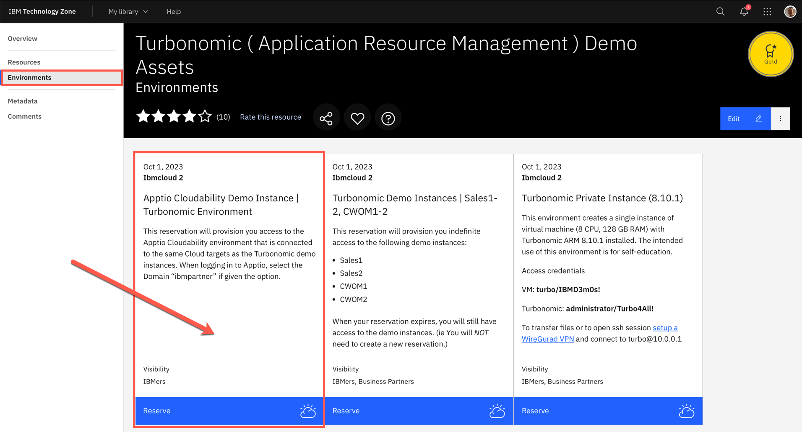
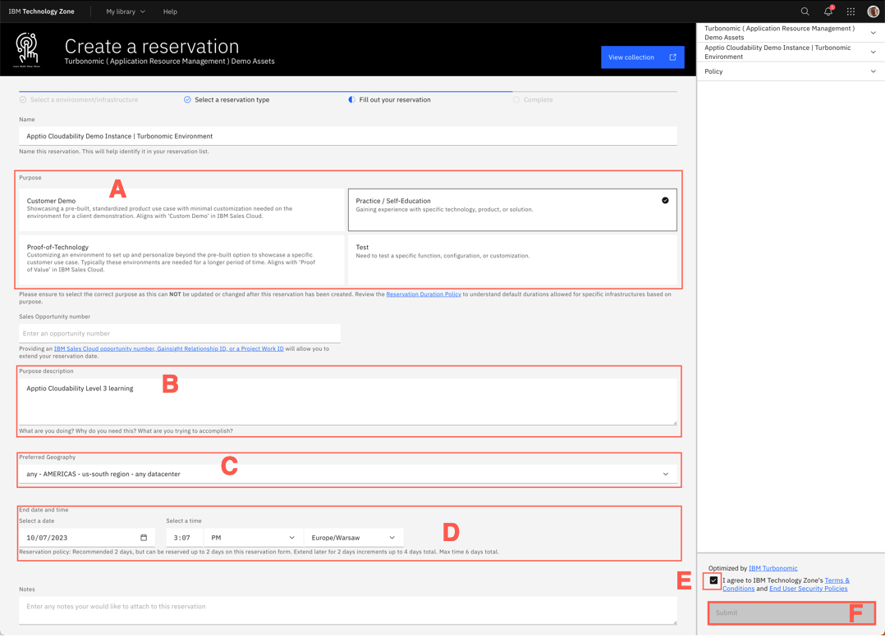
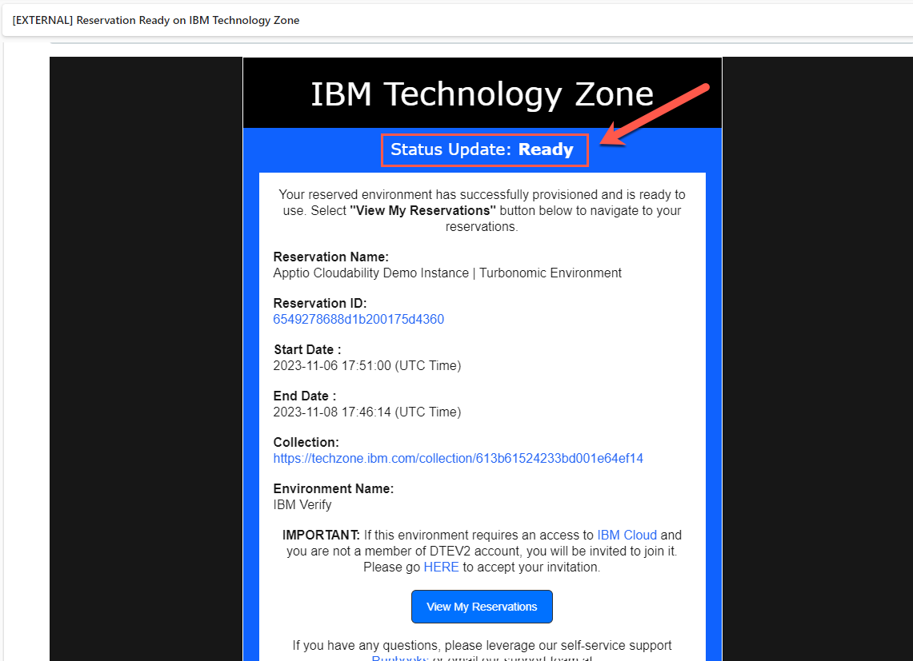
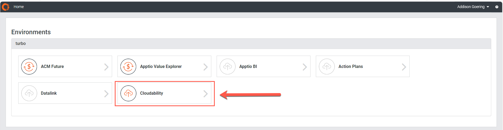
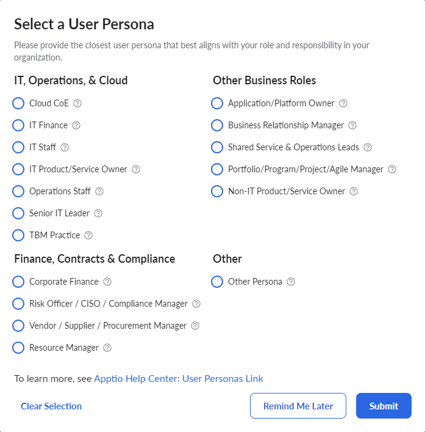
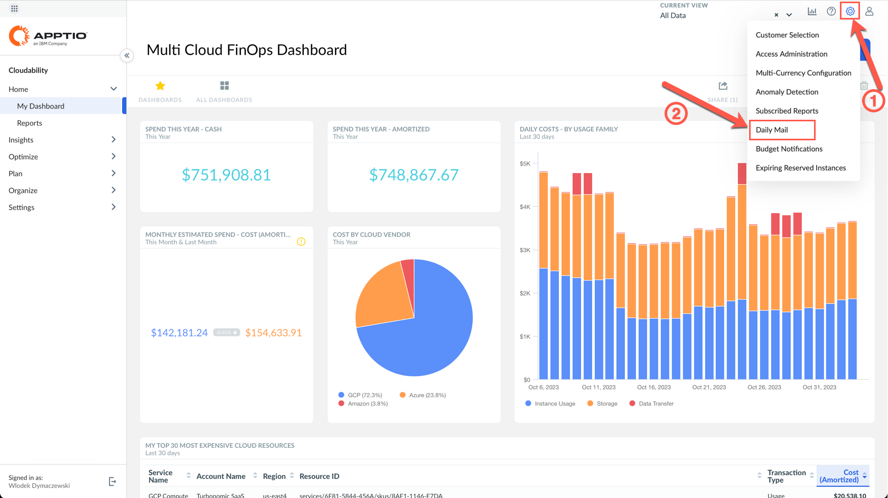
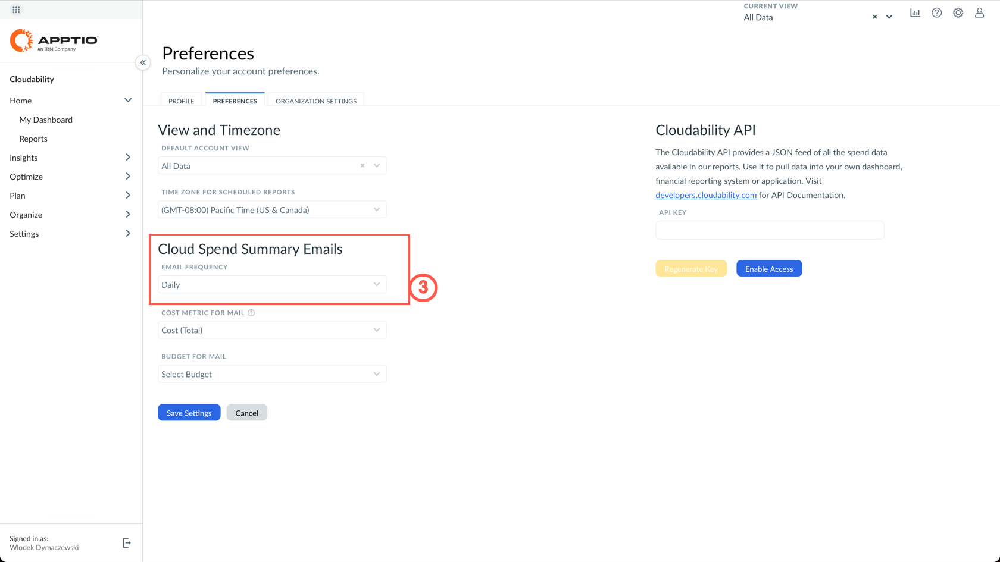
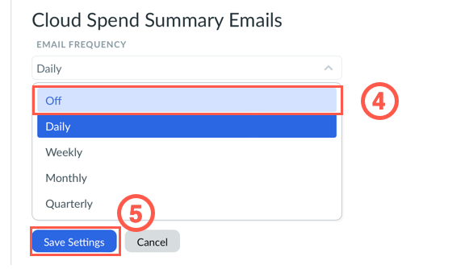

# Accessing the live Apptio Cloudability demo environment

These labs are intended to be used with the live Apptio Cloudability Sales Enablement demo environment available through [TechZone](https://techzone.ibm.com).

## Environment Setup

To request access to an instance, click [here](https://techzone.ibm.com/collection/turbonomic-application-resource-management-demo-assets/environments)

> You will need a functioning IBMid in order to access TechZone

Once the image is selected, fill the regular TechZone reservation form, providing the required information, such as:

- Purpose (A)
- Description (B)
- Preferred geography (C)
- Start and end dates (D).

Finally, accept the Terms & Conditions in the lower right corner (E) and click Submit (F).

After requesting a demo environment you will recieve an email stating that your environment is **Provisioning**. A short time after this email, you will receive another stating your environment is **ready** like so:

Once you recieve this email, you can connect to the demo evironment by click [here](https://frontdoor.apptio.com/login?domain=ibmpartner) and logging in with your IBMid.

After login you will then be askedto select an **Environment** and user interface. Select **Cloudability** as shown below:

If you are logging in for the first time, you will need to also select a **Persona**. Choose anyone you want and click **Submit**.

## Caveats

Once you provision access to Apptio Cloudability instance, you start receiving daily emails with summary of the cloud spend on the demo accounts. To turn these emails off, follow these steps:

1. Click the **gear** icon in the top-right corner and select **Daily Mail** option from the dropdown.

2. Locate **Cloud Spend Summary Emails** section on the Preferences tab.

3. Change value from **Daily** to **Off**, or any other requested frequency. Finally, click **Save Settings** button.

With that out of the way you are ready to begin the labs.
