# Cloudability Overview

The lab centers around a **FinOps dashboard**. This dashboard is designed for demos on big or small screens, so feel free to use it on your laptop (so it's well suited for a Webex) or connect it to an external display. The dashboard is designed for use with or without views applied, but it is recommended to start with the **All Data** view.

This lab's dashboard is designed to quickly showcase key FinOps concepts for an introductory demo. However, it's far from exhaustive in covering solution feature set. You are encouraged to explore more and enhance their demo over what is provided in this guide.

1. Open the Cloudability User interface and select the **Multi Cloud FinOps Dashboard**.

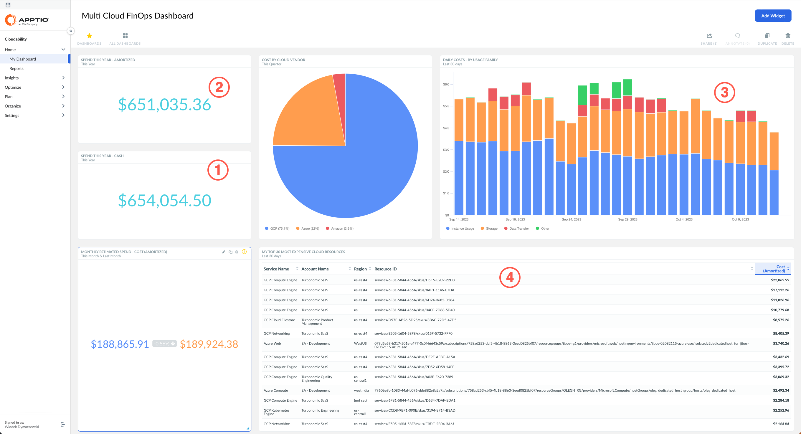

You start the demo at the Multi Cloud FinOps Dashboard as shown above. The first thing to note about the platform is that it brings single pane of glass cost visibility across the major cloud providers: AWS, Azure, and GCP. 

Clients can understand the cost of the entire cloud footprint in near real time and more importantly, measure it in a way that makes sense to the business.

For example, you can surface what you have paid to the **cloud vendors (1)** versus what has been **consumed (2)**. The amortized cost metric will allocate upfront savings plans and reserved instance payments to where and when they were consumed. You can also choose to apply custom pricing rules or strip away discounts with metrics like these, basically representing cost. 

The insights delivered by Cloudability are primarily based on the detailed billing information available from each cloud vendor which are enriched to help you make sense of it. This enrichment categorizes the spend in some handy ways. One of the most interesting definitions available by default is **usage family (3)**. 

As you can see here in this daily spending chart, you can easily see what costs are going to areas like storage versus VM instances versus data transfer and so forth. 

Other popular reporting dimensions allow users to track the consumed cloud service, identify the type of a cost item, and identify the **transaction type (4)**.

2. Select **Product:Turbonomic** from the **Current view** dropdown in the top right corner.

> You may have to scroll to the top of the window to see the dropdown.

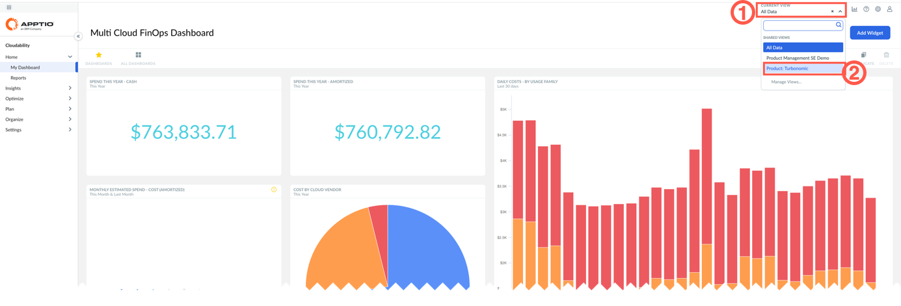

What's incredibly powerful about Cloudability is that all this data is standardized through its view engine, whether you want to sort by application, by product, or by any other meaningful dimension for your business.

Views can be defined based on any attribute of a cost record, either loaded directly from the cloud provider, such as tags, account id, labels, etc., or from business mappings that correlate these data into meaningful business dimensions (for example: product, owner, business unit, etc.).

This allows users to focus on the data that is relevant to them. It also provides access control, so users can only see the cost data that they should see.

If you log into the system as the product owner for specific product or application (in this example, you are logging in as the owner of Turbonomic product), you'll only see the data for that product.

This level of data access extends across all the features and functions within Cloudability. Every user can self-service all the data across their organization. This is true whether they want to delve into specific anomalies that happened in the cloud platform or look into the containers that the cloud leverages. Data access is ensured all the way down through rightsizing and capabilities such as forecasting.

Everything in the Cloudability platform is designed to help users self-service the cost data and make the right decision in the cloud in real time.

3. Select **All Data** from the **Current view** dropdown in the top right corner, then on the left-hand navigation pane, expand the **Insights** twisty. 

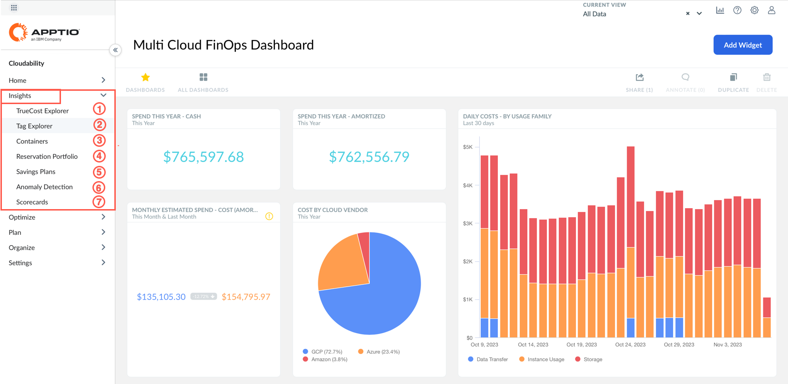

> The content of this menu depends on your assigned access level. The actual items listed may differ from the screenshots in this document, depending on your privileges.

Look at the left-hand side of the navigation bar. Cloudability, at its core, was designed as a big data analytics engine for public cloud. This means, it is going to pull in every resource ID, cluster namespace, or label across your entire environment on a per second basis and keep that data in gratuity to support year-over-year, month-over-month, quarter-over-quarter style reporting.

This data reporting capability is critical to support certain features like anomaly detection, forecasting capabilities, and general reporting and auditability of your cloud data, especially for large organizations. Clients who try to build such capabilities on their own quickly realize that storing, maintaining, and keeping data to support this granularity of reporting is typically an incredibly expensive exercise.

On top of the core dashboarding and reporting capability that was just shown, Cloudability has a suite of features around each of the different FinOps phases.

Cloudability Insights are directly related to the Inform phase of the FinOps cycle:

-	**TrueCost Explorer (1)** and **Tag Explorer (2)** help with the cost allocation. 
-	Container **cost allocation (3)** is found here too.
-	**Savings Plan (4)** and **Reserved Instance (5)** views provides tracking of these items. 
-	**Anomaly Detection (6)** helps quickly detect unusual spend
-	**Scorecards (7)** help compare the efficiency of cloud usage across teams.

1. On the left navigation pane, expand **Optimize** twisty.

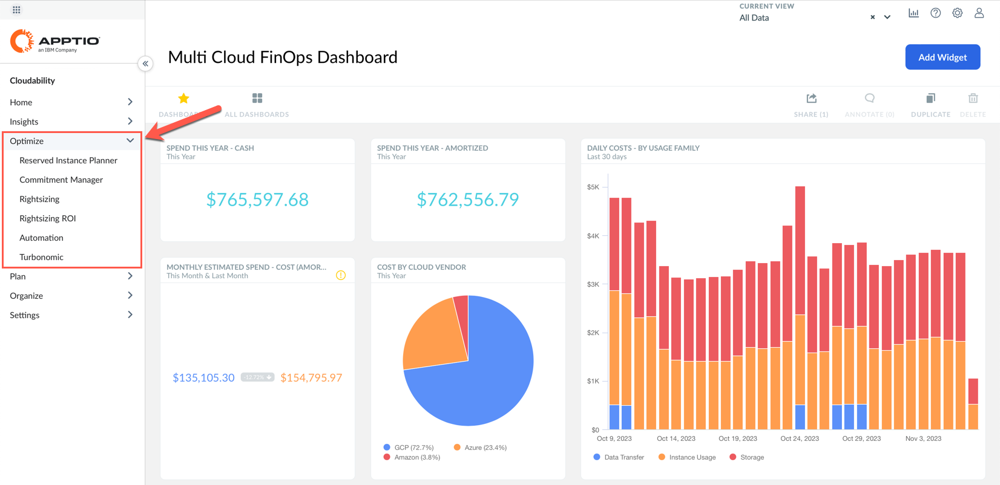

> The content of this menu depends on your assigned access level. The actual items listed may differ from the screenshots in this document, depending on your privileges.

Once you know who is spending what, you are likely to ask: *"How can Cloudability help us spend less?"*

Cloudability does that through helping plan **Reserved Instance (RI)** usage and commitment management across all the cloud providers as well as right-sizing and automatic ROI tracking for that optimization.

5. Expand the **Plan** twisty on the left navigation pane and select **Current Month**.

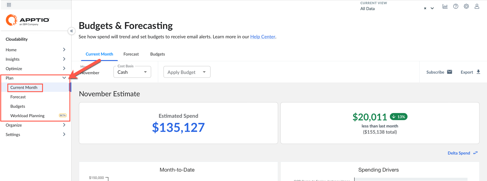

> The content of this menu depends on your assigned access level. The actual items listed may differ from the screenshots in this document, depending on your privileges.

Once you know who is spending what and that you're spending the right amount, you will want to know: *"What are we going to pay tomorrow?"*

So here is the current month analysis and longer term forecast to show you what you might be spending 6, 12, 24 months out, all while tracking your budget and your plans to actuals while re-forecasting that data throughout the year. So, you're constantly up to date on what your teams are expected to spend.

<Danger text="The next step (6) can only be completed if you have access to the Organize tab. If you do not have access it can be skipped." />

6. Expand the **Organize** twisty on the left menu.

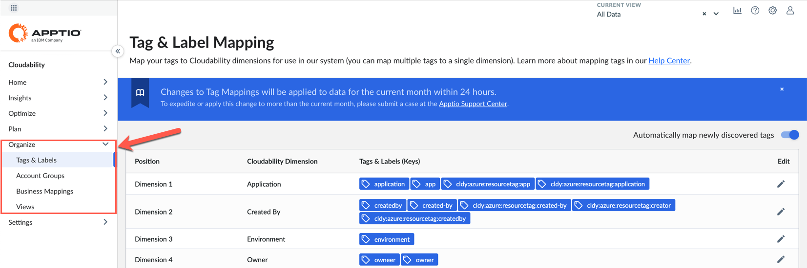

Let's talk about **Organize** tab. Cloudability will ingest all your tags and labels across all the cloud providers. It can also adhere to any sort of account hierarchy, subscription, or project, anything like that. Typically, 99% of Cloudability clients leverage "business mappings" feature. This feature provides a much more robust rules-based allocation strategy that maps cloud spend back to your actual business priorities.

7. Expand the **Insights** twisty on the left and select **Tag Explorer** option.

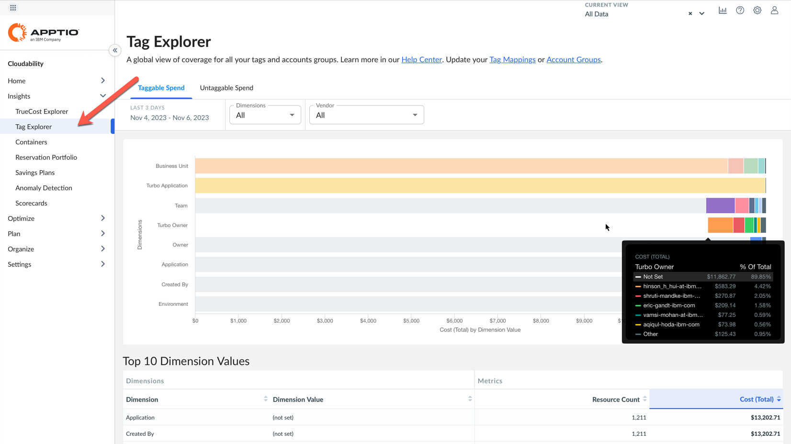

> Remember that you are accessing a live demo environment. The actual content of your demo may differ from the screenshots in this document.

The Tag Explorer lets you can quickly see the state of all your tagging across your business. This view helps achieve one of the principles of FinOps: *"Everyone takes ownership for their cloud usage"*. Looking at this chart you can quickly identify the cloud spend that is not allocated to the responsible party.
Using this report, you can see a very limited amount of cloud spend that can be directly allocated to Owner, Environment, or Application by hovering cursor over the horizontal bars on the report associated with these dimensions on the left. This is very common for most Cloudability users when they start.

There are some things you cannot tag using your cloud provider. For example, there's multi-tenancy…  In that case tagging doesn't really get you the data that you need for allocation. In this demo, not that 86% of data is not tagged by a Turbonomic owner, (there could be a lot of different reasons for that). 
Some cloud vendors have an account-based approach where clients don't need to put a tag value on resources because the account, subscription or project tells them which application or owner the workload belongs to.
There could also be infrastructure that is containerized, where how costs are allocated to an owner or application comes from a namespace or a label within the Kubernetes or OpenShift clusters. 

8. Click on the grey horizontal bar associated with the **Owner** or **Team** dimension.

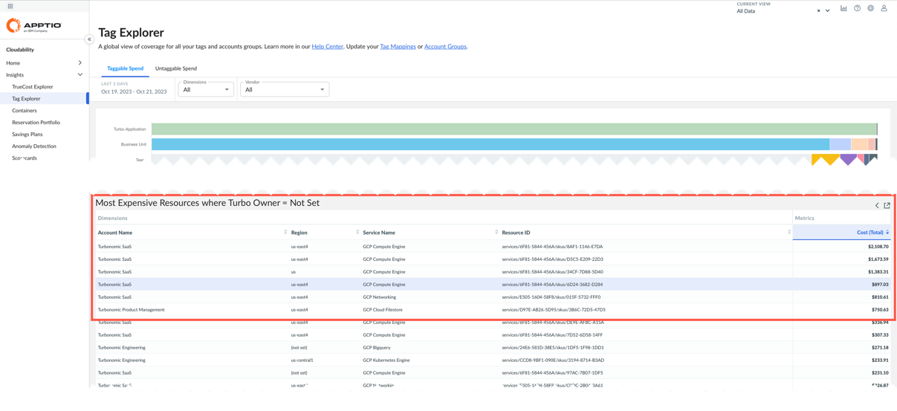

> Note how the bottom part of the report displays list of cost items without tags.

Using Cloudability's Tag Explorer, you can quickly identify the resources that can be tagged but are not tagged. Cloudability helps you quickly identify the items that should be properly tagged by your Operations team, so the associated costs are allocated to the proper owner or application. For items that cannot be tagged, Cloudability provides the flexible Business mappings engine that lets you define logical conditions using any available attributes to assign the cost to the responsible party.

This is very important, because if you can't allocate the cloud spend dollars accurately and successfully back to business units, application, or any cost centers, you won't be able to perform the optimization, forecasting or any of the other main value driving use cases supported by FinOps.

9. From the left navigation menu, expand **Insights** and select **Containers**.

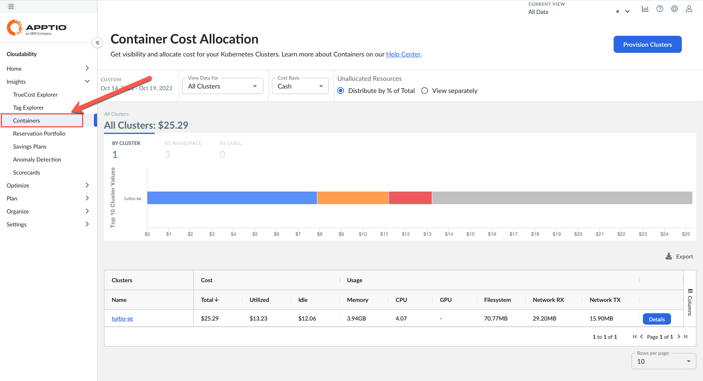

For shared environments like managed Kubernetes or OpenShift clusters, Cloudability provides a dedicated mechanism to collect usage metrics, such as CPU or memory consumption. These metrics are used to properly divide the costs of running the whole cluster to owners or initiators of the workload

10. From the left navigation menu expand **Insights** and select **Reservation Portfolio**.

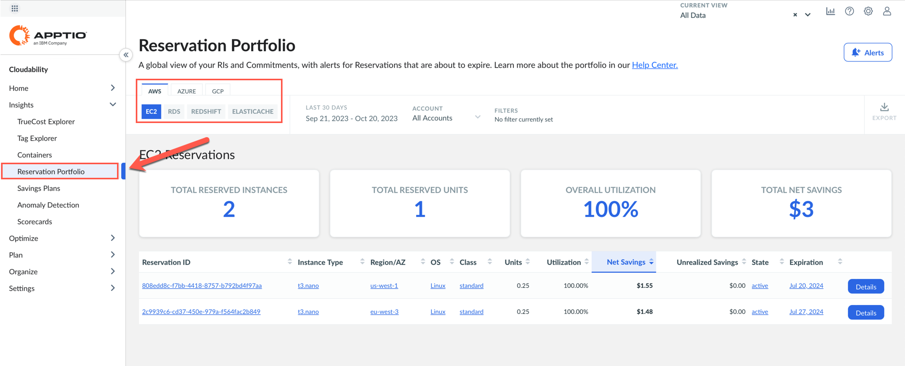

> In this demo environment, not all types of reservations are available. Pick the one that shows some values (most likely it will be AWS EC2).

This view supports the **Inform** phase of the FinOps cycle by helping users quickly review the level of utilization of already applied cost savings measures, such as **Reserved Instances (RI)** or **Savings** plans. One of the main FinOps principles requires that cost savings are managed centrally by the FinOps team to achieve economy of scale. This view helps any user understand how they are utilizing the existing savings arrangements across all cloud providers and different services.

11. From the left navigation menu expand **Insights** and select **Anomaly Detection**, then click **Details** button on any of the displayed lines on the right.

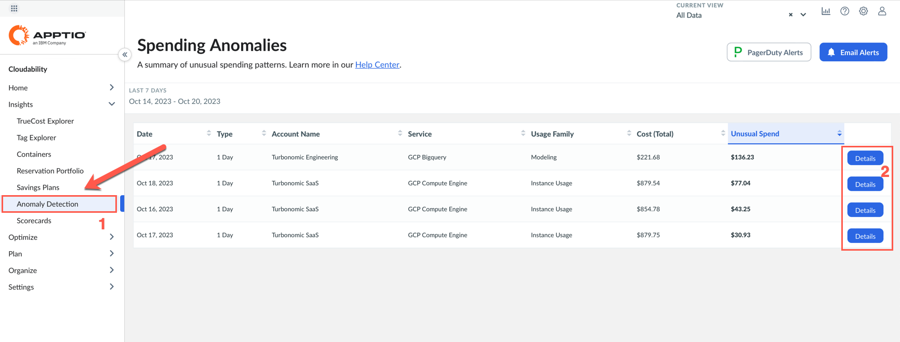

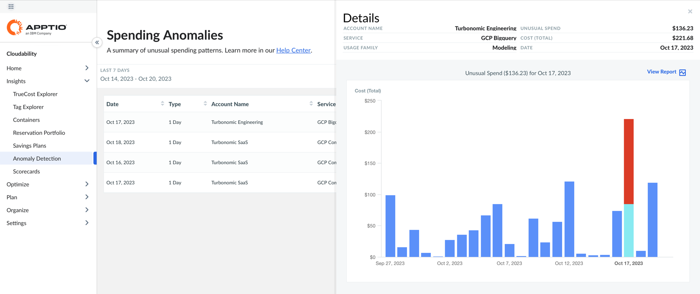

Anomaly detection is another useful function that facilitates the implementation of the Inform phase of FinOps. The goal here is simple: detect anomalous cloud spend as soon as possible and alert users, so they can verify and react. There are many situations where this can save you a lot of money. Let me give you a few examples.

There was a client that tried to test out Amazon Macie  when it was first released. They started testing Friday around noon, and they left the office end-of0day at around 5:00 pm. By around 9 pm, they had spent about $240,000 on Amazon Macie scanning through every account looking for security vulnerabilities and things like that. Cloudability raised alert within several hours, client opened a ticket with AWS support and because they were able to catch this situation within a 24-hour period, they were able to get a credit back for that service. 

Another example is related to bitcoin mining. There are many clients who have received alerts from Cloudability that they have strange, expensive workloads being deployed in weird regions they didn't typically operate in. Thanks to Cloudability anomaly detection they were able to catch and identify who was spinning these up when they happened.

Cloudability's anomaly detection feature is powerful and robust because it is fully automated and based on the standard deviation analysis on any cost item. Users do not have to define any thresholds or alert rules, they are notified on anomalous spend across any service of any connected cloud service provider.

12. Expand the **Optimize** twisty on the left-hand menu and select **Rightsizing**.

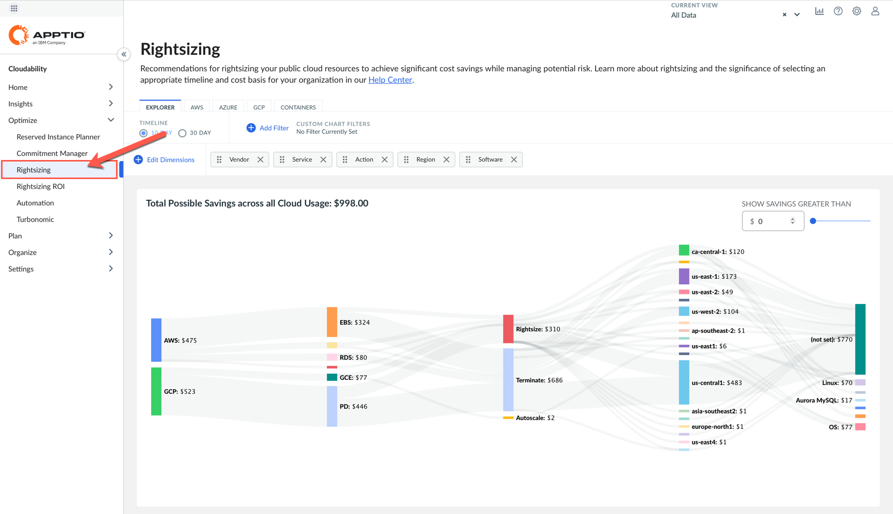

Look at the Cloudability features that supports the Optimize phase of the FinOps cycle. Let's look at Rightsizing. This is one of several items available to help you optimize your cloud spend. Cloudability is looking at the utilization metrics of different cloud services and makes a recommendation if Cloudability thinks there is a lower cost and more suitable instance type available. This Cloudability feature is often used by clients in the low FinOps maturity level (Crawl phase) when they are still learning how to operate in cloud and want to apply these actions manually. For more mature clients who want to optimize at scale in an automated fashion, IBM has a more focused solution called IBM Turbonomic.

13. Expand the **Plan** twisty in the left-side menu and select **Forecast**.

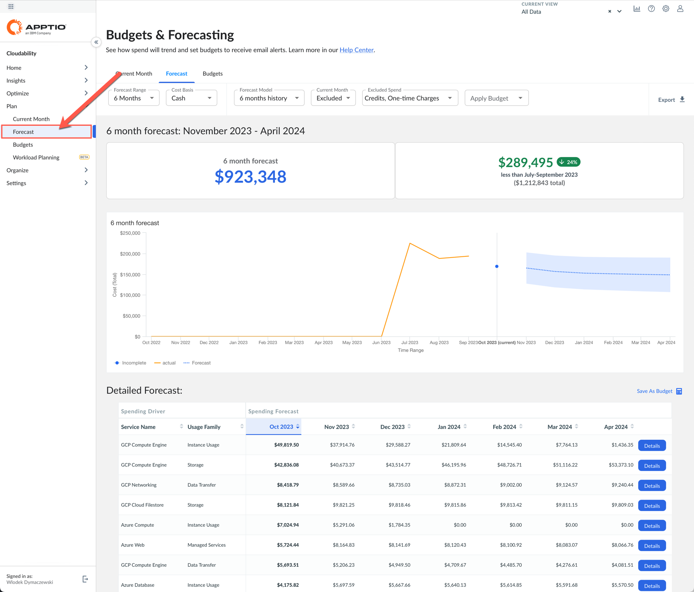

Finally, as your FinOps practices mature, you'll typically want to implement Operate practices. Cloudability supports you by providing cost forecasts based on collected data and projected trend. You can review these forecasts for any of your cloud services and save the forecast as budget. Later, when new billing data is imported the actual costs are automatically compared against budget and visualized on the reports. This helps you manage your cloud spend.

## Summary 

Let's quickly recap what has been shown. You were shown how Cloudability helps you implement practices from all phases of the FinOps cycle, starting with the **Inform** phase, through **Optimize** and **Operate**. 

You also saw a number of visualizations, dashboards and reports that help you allocate cloud costs to owners, products, business units or whatever costs centers you want. You have seen the optimization recommendations that help you save money. Finally, you saw Cloudability features that help your Finance department with planning, forecasting, and budgeting cloud costs.
