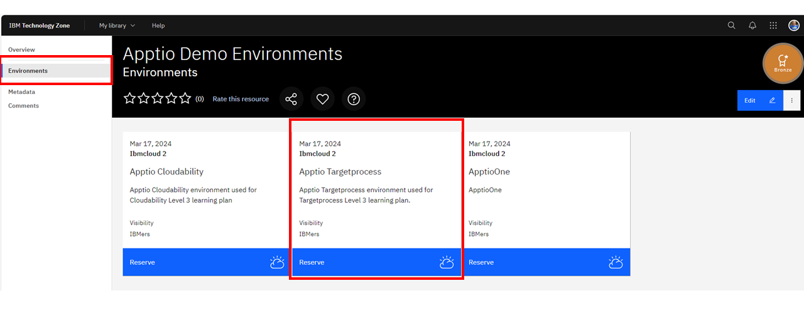
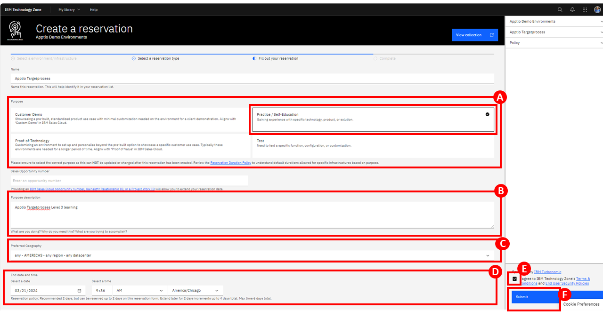
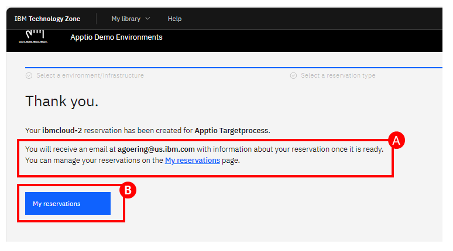
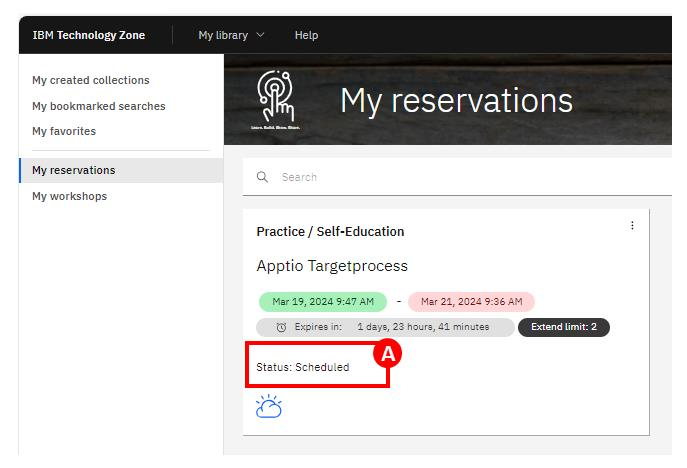
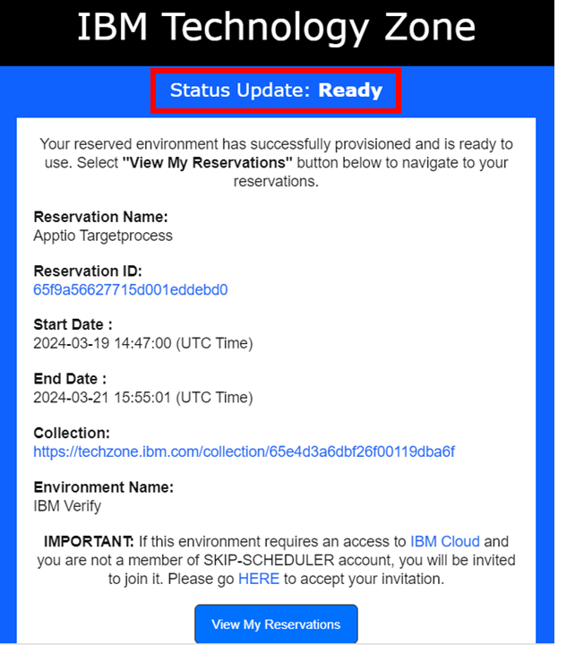
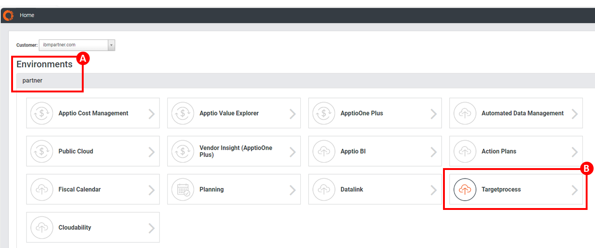
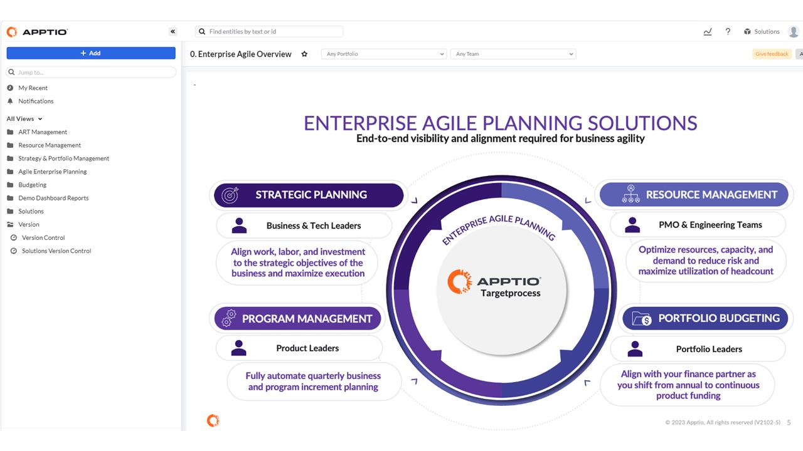

# 100: Environment setup

## Tech Zone Resources

- **[Apptio Targetprocess TechZone environments](https://techzone.ibm.com/collection/apptio-demo-environments/environments)**

## How do I access a Apptio Targetprocess instance via TechZone?

1. To request access click [here]() 

2. Click the **Apptio Targetprocess** tile.

- Select **Reserve now**.
- Complete the TechZone reservation form by providing the required information as follows:
  - **Purpose**: Practice / Self-Education **(A)**
  - **Purpose description**: Apptio Targetprocess Level 3 learning **(B)**
  - **Preferred Geography**: any **(C)**
  - **End date and time**: Selet the date two days after the current date **(D)**
  - Accept the **Terms & Conditions** **(E)**
  - Click **Submit** **(F)**

1. You will receive the following message. Check your **email (A)** for a reservation 
confirmation email. Click **My reservations (B)** to view the status of your reservation 

4. You will see the status of your reservation request.

5. Once your reservation is ready you will receive a confirmation email from TechZone that looks like this:

6. You can now click [here to connect to the environment](https://frontdoor.apptio.com/login?domain=ibmpartner). Ensure you login with your IBMid.

7. After logging in navigate to the **Environments** then **partner (A)**. Click on the **Targetprocess** tile **(B)**.

8. The main page will then open.

9. You are now ready to begin using your Apptio Targetprocess instance.
