# 101: Agile Enterprise Planning

> **Overview**: This demo scenario showcases to clients in various roles across the business
how Targetprocess can help them transition to, or continue to, use lean portfolio
management. The Targetprocess product is feature-rich, so this demo touches briefly
on most of its capabilities: strategic planning, program management, resource
management, and portfolio budgeting.

This section of the demo focuses on the views in the **Agile Enterprise Planning** folder and is a general overview of Targetprocess capabilities.

The folder has many views, but you focus on four views, specifically (Executive Room, Financial Room, Resource Room, and PMO Room). The views contain many dashboards, charts, and graphs that are designed for Agile practitioners to showcase key capabilities in Targetprocess.

> Personas used: **Business and Technology Leaders**

## Executive Room

1. Open **Agile Enterprise Planning** folder **(A)** by click on it.

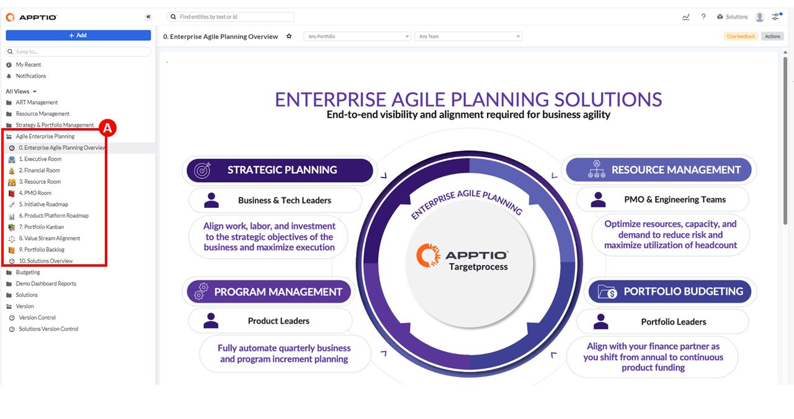

When you log in to the Targetprocess system, you see several folders. Each folder is organized into several views, which takes you to a different aspect of an agile project. For this section, you will work in the Agile Enterprise Planning folder and the views in the folder. 

The first thing to note about the platform is that it brings together in (a single window), views of agile release trains, resources, portfolios, strategic plans, budgets, and projects. As you work through this section, each view is expressed as a room. Rooms are a way to logically consolidate a vast amount of data into a consumable form. This folder has many rooms, but these four rooms (views) represent the main capabilities of Targetprocess.

- **Executive Room** is a place where business and tech leaders can collaborate to align
on the strategic objectives and initiatives of the business.
- **Financial Room** is where portfolio managers can align with financial leaders as the
business moves from annual to continuous product funding.
- **Resource Room** is used by the PMO and engineering teams to optimize resources
and improve capacity and demand planning.
- **PMO Room** is where product leaders can digitalize and automate quarterly business
and planning interval (PI) planning.

2. Click on the **Executive Room** view **(A)**

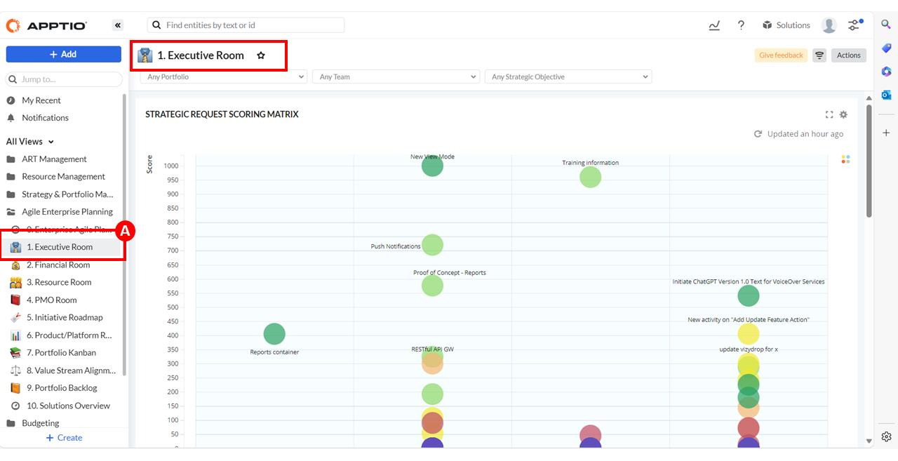

You are accessing a live demo environment. The data that is shown in these screen captures may differ from the actual demo environment. The important thing to keep in mind is that the flow and capabilities are the same. Adjust your narration as necessary.

For each step, you scroll through the Room's (view) dashboard, exploring its
charts and graphs. 

The **Executive Room** is where portfolio and product leaders can see an
overview of incoming strategic requests, strategic objectives, and initiatives. The
**Executive Room** serves several different use cases:

- Managing strategic requests that include ballpark figures and scoring
- Aligning strategic objectives to key results and work
- Managing initiatives

3. Scroll down until you see the chart: **STRATEGIC OBJECTIVES PROGRESS (A)**.

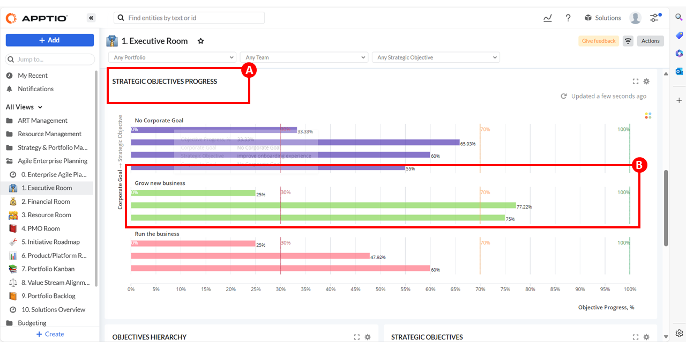

Strategic requests are ideas for work that is proposed by business and tech leaders. Business leaders review and prioritize strategic requests and then develop strategic objectives and initiatives based on the strategic requests that they want to pursue. In this chart, you can see the relationship between a corporate goal and its strategic objectives **(B)**. Three strategic objectives are connected to the **Grow new business** corporate goal. 

Hover over the corporate goal that is named **Grow new business**. Three strategic objectives are represented by the goal’s bar graph. Each strategic objective has a popup that indicates its progress. This view is valuable to an executive so they can quickly visualize the corporate goals, strategic requests, and strategic objectives of the business. 

4. Scroll down until you see the **INITIATIVE ROADMAP** chart **(A)**, then click the **Open full view** icon **(B)**.

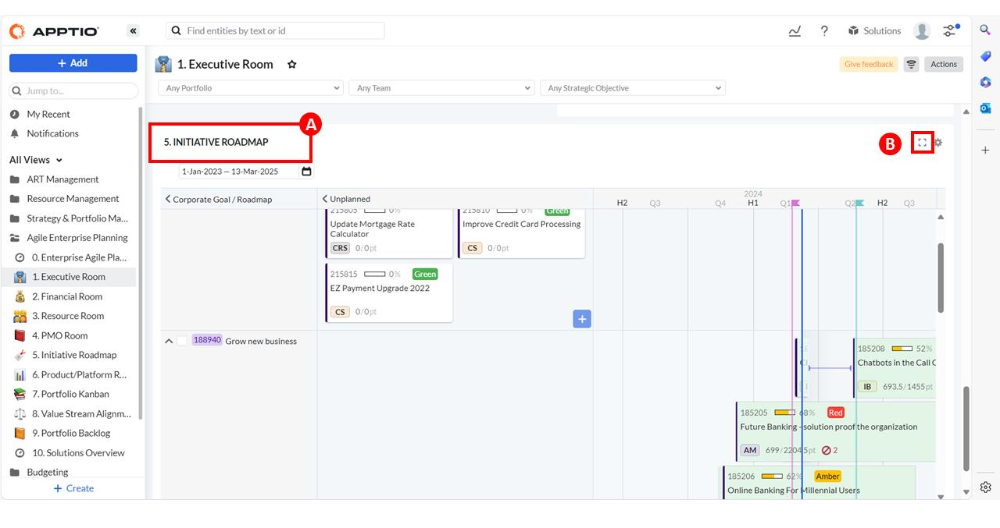

5. Click **Actions (A)** then click on **Show** in the **Relations** section. This action displays the color coding for the relationships between initiatives **(B)**.

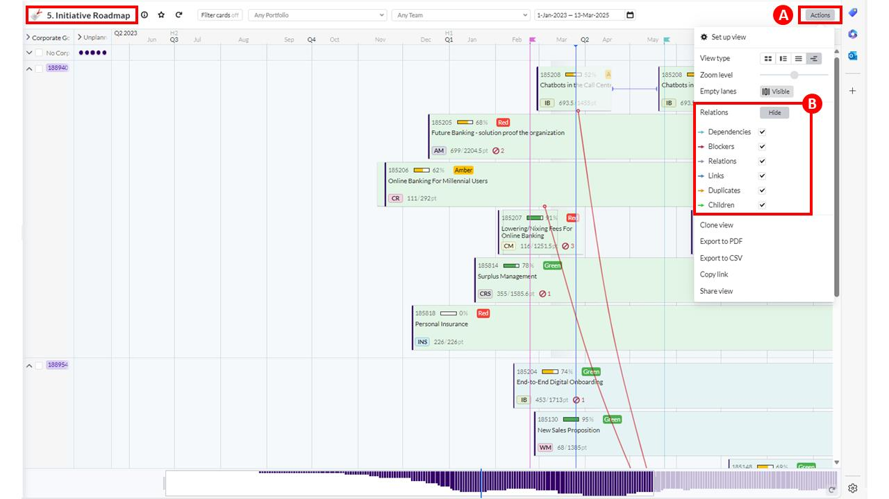

You may want to see initiative information in a more visual way. Using the **Initiative Roadmap**, you can see which initiatives are connected to specific corporate goals and when the initiative is scheduled for delivery. Initiatives become the focus of this demo as you move further along.

## Financial Room

1. Click on the **Financial Room** view **(A)**.

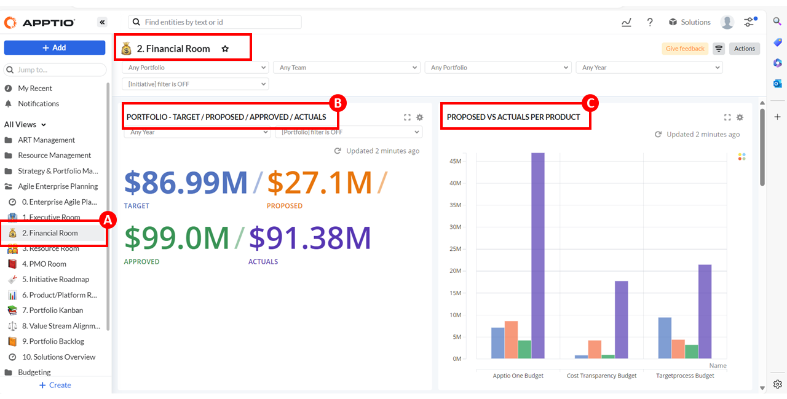

As a product or portfolio leader, you want to view the financials of your product or portfolio. Let’s look at the Financial Room that links together different funding methods into one dashboard where you can track actual costs as well as cost forecasts. It also splits them out between CapEx/OpEx and Grow/Run.

In the Financial Room, Targetprocess gives you the ability to link different funding methods to one dashboard or roll up funding to the same portfolio. Different funding methods make it difficult to view cumulative financials for years, quarters, and months. Targetprocess uses the dates that are linked to items to calculate financials for each item, regardless of the planning or funding methodology used. You can then complete tracking and forecasting on these time levels as needed.

As a portfolio leader, you can use the **PORTFOLIO – TARGET/PROPOSED/APPROVED/ACTUALS** chart **(B)** to compare portfolio-level financials.

As a product leader, you can see proposed versus actual cost in the **PROPOSED VS ACTUALS PER PRODUCT** chart **(C)**.

2. Scroll down until you see the **INITIATIVE FINANCIALS** chart **(A)**, then expand the **E-docs Functionality within the Mobile App** twisty **(B)**.

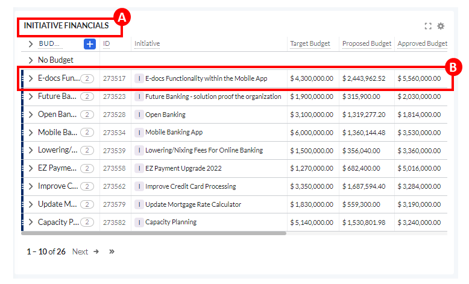

3. Click on the **E-docs Functionality within the Mobile App** initiative **(A)** in the **2023 Annual Budget**.

4. Select the **Budgeting** tab **(A)**.

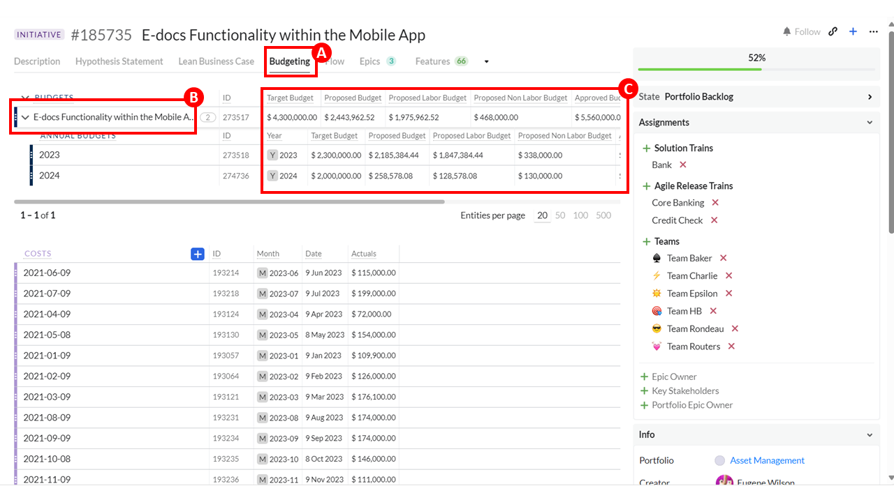

Detailed financial information can be tracked for each initiative by expanding the twisty **(B)** next to the initiative **E-docs Functionality within the Mobile App Budget**. Rolled-up financials **(C)** are shown in this view, such as the **Target Budget**, **Approved Budget**, **Labor Actuals**, and **Non Labor Actuals**. 

5. Close the window: **#185735 E-docs Functionality within the Mobile App**.

6. Scroll until you see these charts: **PRODUCT FINANCIALS**, **TARGET CAPEX/OPEX**, **TOTAL YEARLY SPEND**, and **MONTHLY VARIANCE**.

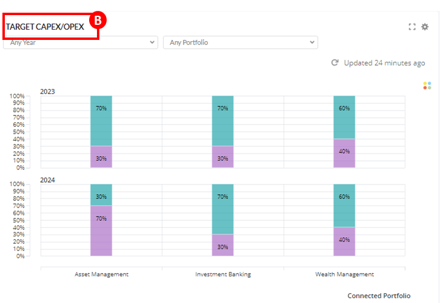

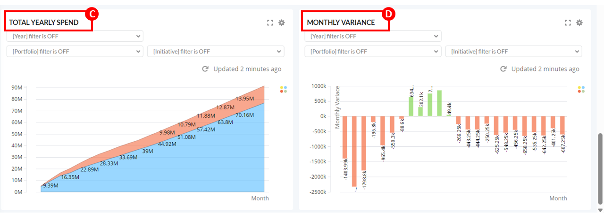

There are several more graphs and charts that give you more financial information, whether it is product or portfolio-related. As you learned, initiatives can be seen at the portfolio level, but these reports are available:

- Aggregate everything toward the product level with the **PRODUCT FINANCIALS**
table **(A)** that you can directly open from this dashboard view.
- You can also visualize the **TARGET CAPEX/OPEX** chart **(B)**.
- Targetprocess also shows a monthly trend report in the **TOTAL YEARLY SPEND**
report **(C)**, with the actuals/split between labor/no labor actuals per month and
the latest trend. This report can be filtered by initiative and portfolio.
- **MONTHLY VARIANCE** analysis **(D)** is available in this dashboard. This report can
also be filtered by initiative and portfolio.

The **Financial Room** shows you the connection between work and financials. All the necessary information is available in these dashboards to directly manage your financials whether product-related, or initiative-related. Let’s look at the Resource Room.

## Resource Room

The **Resource Room** helps product and portfolio leaders with these use cases:

- Link planned and delivered work in Jira/ADO to planning intervals (PIs) and
compare committed resources versus completed work.
- Track performance by using agile metrics such as velocity, predictability, and
value types.
- Understand initiative-level resource financials and roll up them up to the ART and
Stream level.

1. Click on the **Resource Room** view **(A)**.

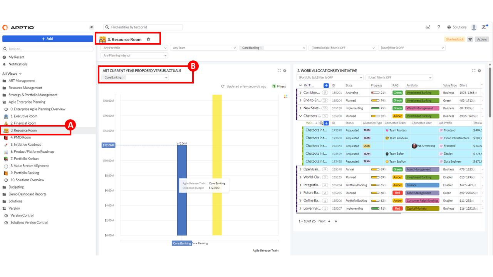

This room helps make a connection between planned and delivered work at the Planning Interval or Agile Release Train level. This linkage translates into financials and available capacity. This linkage can be agile and calculated without the use of timesheets. People dislike timesheets! Targetprocess has a team load feature that supports utilization rate or traditional resource pools.

As you hover your pointer over the columns in the **ART CURRENT YEAR PROPOSED VERSUS ACTUALS** chart **(B)**, you will see on a release train level what was proposed and what was spent. In this case, a significant variance exists from the proposed cost to the actual cost.

2. Scroll until you see the charts: **PI PROGRESS (A)** and **FLOW VELOCITY (B)**.

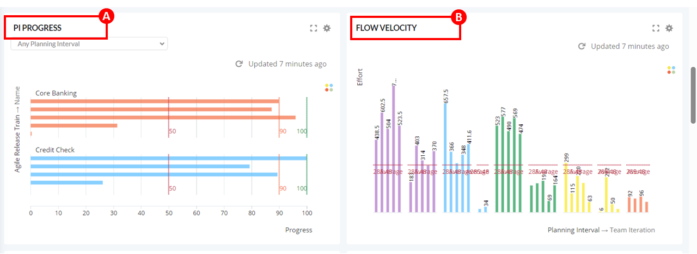

In the **PI PROGRESS** chart **(A)**, you see the agile release train that is named
Core Banking, with its planning intervals and their progress. The **FLOW VELOCITY** chart
(B) shows another agile way to measure team performance with how the flow velocity
across multiple teams or release trains has progressed over time.

3. Scroll down until you see these charts: **FEATURES/PI COMPLETED VS COMMITTED (A)** and **PI CAPACITY CHECK (B)**.

Remember, you are accessing a live demo environment. The data that is shown in the screen captures may differ from the actual demo environment. At the time this demo script was written, the **PI CAPACITY CHECK** chart **(B)** was set to show data only for future releases/PIs. Adjust your narration.

Besides what was delivered, you can also see work that was committed and completed. Is the capacity aligned? Yes or no? You can also see whether the capacity of the entire team has been used. For example, what if the team capacity or iterations are missing that are needed to complete the work? This view is directly related to and based on JIRA or DevOps data or any other team delivery data. There is no need for a manual interface or delay in resources.

## PMO Room

This room is the place for teams to monitor their shift from waterfall to more agile deliveries and governance. This room focuses on Red, Amber, Green (RAG) reporting for initiatives and tactical objectives. The charts in this room show initiatives that are over budget (reporting red). From here, engineering teams can identify major risks, create dependencies, and track risks/dependencies.

1. Click on the **PMO Room** view **(A)**.

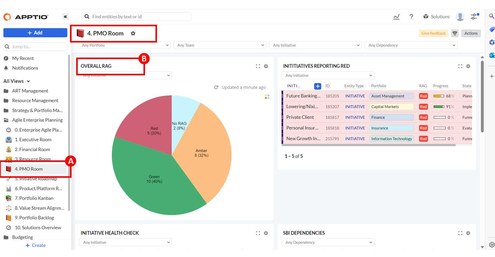

The **PMO Room** is used by PMOs and engineering teams that are in the transition from a traditional waterfall way of working to a more agile way of working.

Here you can see the status of any initiative in the **OVERALL RAG** (red, amber, green) chart **(B)**.

2. Scroll down until you see the **INITIATIVE HEALTH CHECK** chart **(A)**.

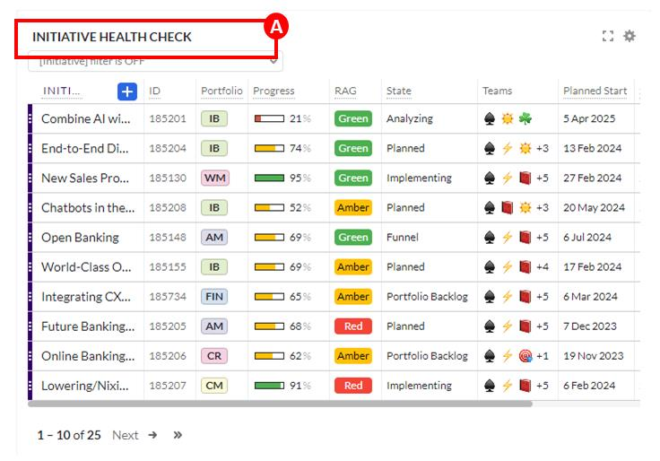

Use the **INITIATIVE HEALTH CHECK** chart **(A)** if you want to get an overall view of the status of a specific initiative or all initiatives.
