# 102: Targetprocess Capabilities

## Strategy & Portfolio Management

In this section, you move from an executive-level view to a specific role view of Targetprocess capabilities. As you work through this section and all the other sections, you reintroduce concepts from earlier. This section dives into Strategic Planning, where business and technology leaders can align work, labor, and investments to the business's strategic objectives and initiatives. The focus of this section is a deeper look into initiatives.

Two views are discussed:

- Initiative Roadmap
- Value Stream Alignment

> Personas used: **Business and Technology Leaders**

### Initiative Roadmap

1. Click on the **Strategy & Portfolio Management** folder **(A)**.

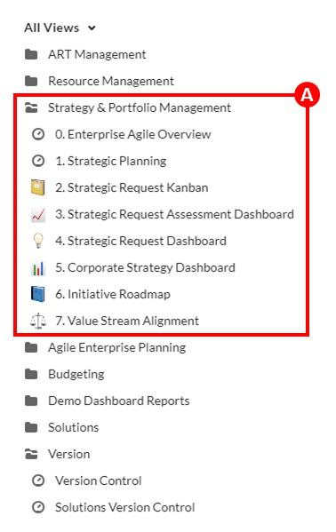

In the previous lab, you covered the transition from Strategic Requests to
Strategic Objectives to Initiatives. Now, you want to focus on Initiatives. Keep in mind
that an Initiative is a high-level business investment or plan that is moving through the
agile process.

The **Strategy & Portfolio Management** folder **(A)** has many views that speak to Targetprocess's rich set of capabilities. You may want to look at approved initiatives that are scheduled and how funding is aligned with business objectives and scaled agile using value streams.

2. Click on the **Initiative Roadmap** view **(A)**.

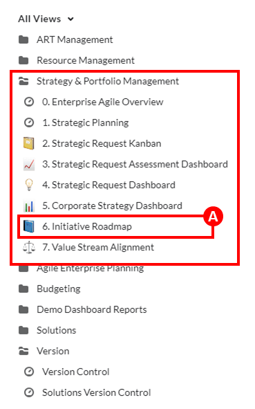

3. Locate the **Grow new business** corporate goal **(A)** in the **Corporate Goal / Roadmap**.

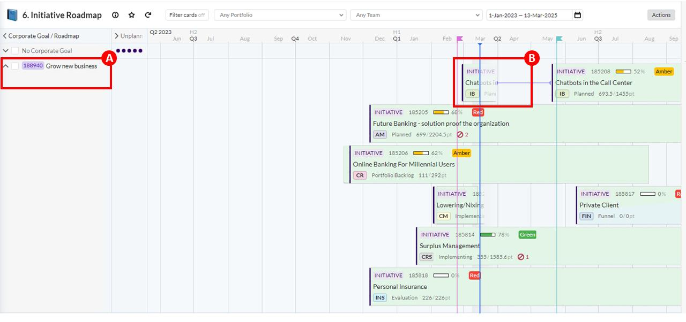

Targetprocess is different from other comparable tools because of its **Initiative Roadmap** feature. Most other tools have some version of lists and boards. The **Initiative Roadmap** is a huge differentiator.

The roadmap opens with all the **Corporate Goals (A)** that are listed on the left side. In the next step, you are going to look at the **Grow new business** corporate goal. On the right, you can see initiative (B) that are associated with this corporate goal. Let's look at one of the initiatives, **Chatbots in the Call Center**.

4. In the **Initiative Roadmap**, click on the **Chatbots** in the **Call Center** initiative **(B)**.

5. Once the Chatbots in the Call Center initiative (A) is open, select the Features tab.

You can select any initiative but be sure that it has all the features that are mentioned in the narration. In this screen capture, you notice two initiatives that are labeled **Chatbots in the Call Center**. This situation occurs because the actual start date of the initiative is listed before the planned start date.

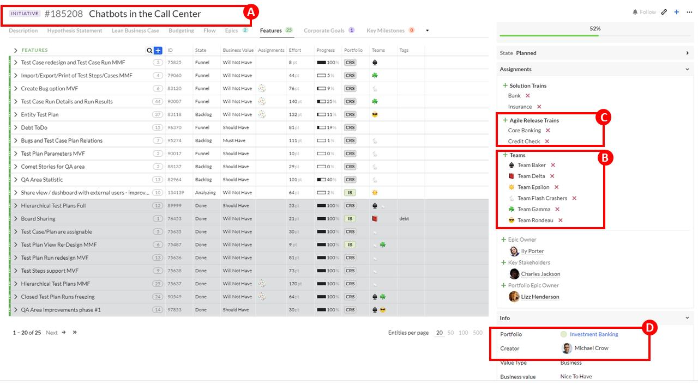

You can see all of the **Features** attached to the **Chatbots in the Call Center** initiative. The table contains various status values (State, Effort, Progress, Portfolio, and Teams). The table contains a lot of information. Explore any of the column values.

On the right, you can see the **Teams (B)** that have responsibility for this initiative. You can also see which **Agile Release Trains (C)** this initiative belongs to. There is so much information rolled up into this simple view of the initiative.

In the **Info** section, take note of the **Portfolio (D)** that the initiative belongs to. In this case, the initiative is connected to Investment Banking. In the next section, you will see this relationship by looking at the value stream.

### Value Stream Alignment

1. Click on the **Value Stream Alignment** view **(A)**.

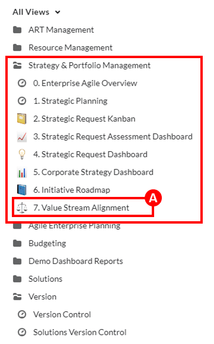

2. In the **PORTFOLIOS** section, expand the **Investment Banking** twisty **(A)** then expand
the **Banking** twisty **(B)**, and finally the **Chatbots in the Call Center** twisty **(C)**.

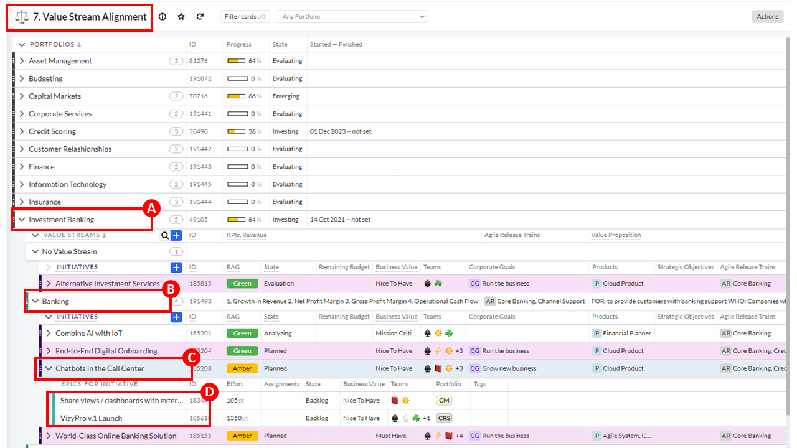

There is a value stream that is labeled **No Value Stream**, which means no value stream is connected.

A unique feature of Targetprocess is the ability to align initiatives to the company's value streams. A value stream begins with the initial concept (initiative) and flows through to delivery. Not all tools can use value streams, so this feature is another differentiator.

Let's look at the **Investment Banking** portfolio **(A)**. Within the **Banking** value stream **(B)** are four initiatives, one of which is the **Chatbots in the Call Center** initiative **(C)** you looked at earlier. As you can see, it has two Epics (D) that are connected to it. As a technology or business leader, you might move initiatives around and between value streams. You can also create a new value stream and add initiatives to it.

## Resource Management

The overall messaging for Resource Management is that the PMO and engineering teams can optimize resources, capacity, and demand to reduce risk and maximize their headcount utilization. The focus of this section is understanding the initiative from a funding perspective. To continue the demonstration's story, select the Chatbots in the Call Center initiative that you worked with in the previous section.

Four views are discussed:

- **Work Allocations by Initiative**
- **Teams**
- **Resource Utilization Dashboard**
- **Initiative Labor Financials**

> Personas used: **Initiative owner**, **Engineering Team**, and **PMO**

### Work Allocations by Initiative

1. Select the Resource Management folder (A).

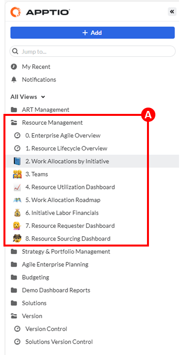

In the Strategy & Portfolio Management section, you saw how initiatives are scheduled and how to ensure that funding is aligned with business objectives and value streams. Now, you want to focus on managing the resources to work on the initiative. Recall that an initiative is an _"idea"_ that is moving through the agile process. An important part of the agile process is securing resources, properly using resources, and measuring.

The **Resource Management** folder has many views that speak to the rich set of capabilities in Targetprocess. Let's focus on managing the resources that work on an initiative.

2. Click on the **Work Allocations by Initiative** view **(A)**.

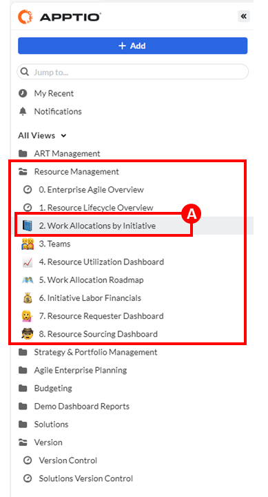

3. Expand the **Chatbots in the Call Center** twisty **(A)**.

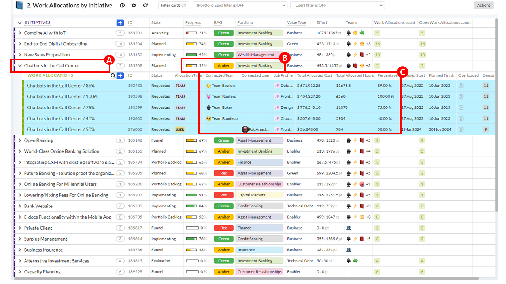

This view shows all the initiatives for the business. If you need to, you can filter and sort them. For the initiative that you have been discussing, **Chatbots in the Call Center (A)**, notice the **Progress** and **RAG** values **(B)**. Recall that this initiative was part of the Investment Banking portfolio.

When you click any initiative and expand it, you get a sense of the amount of work needed to complete it. The **Total Allocated Cost** and **Total Allocated Hours** provide a sense of the initiative's scope.

In the screen capture, you can see the **Teams (C)** that are connected to the initiative and determine whether they are overloaded. As an engineering lead, you can use this information to reallocate resources from other teams to help meet the initiative deadline.

### Teams

1. Click on the **Teams** view **(A)**.

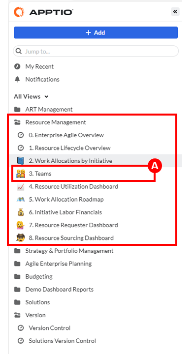

2. Expand the **Team Rondeau** twisty **(A)**.

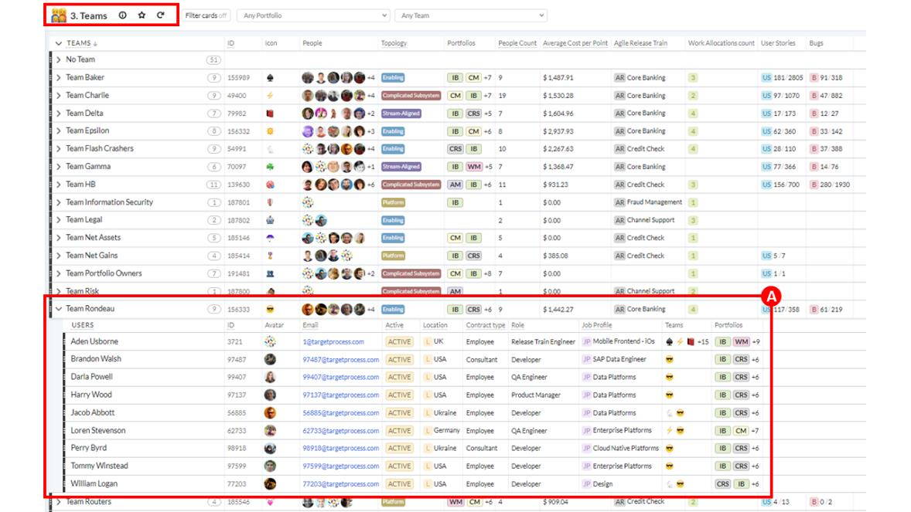

Here you get a snapshot of one of the **Teams (A)** that is assigned to the initiative. A Release Train Engineer might not be familiar with the team, so they can see which **Roles** and **Job** Profiles make up the team. Moving over to the **Portfolios** column, you can see that the team works extensively across many Portfolios.

Sometimes a team member is part of multiple teams, especially team members in the Release Train Engineer role. This snapshot doesn't provide a look into utilization. Let's look at utilization next.

### Resource Utilization Dashboard

1. Click on the **Resource Utilization Dashboard** view **(A)**.

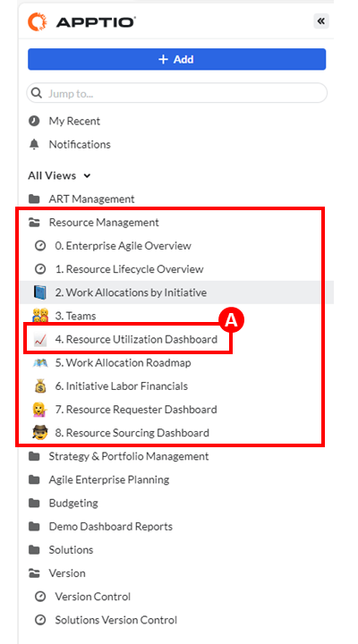

2. Click on the **Any Portfolio** drop down and select **Investment Banking** to filter the results **(A)**.

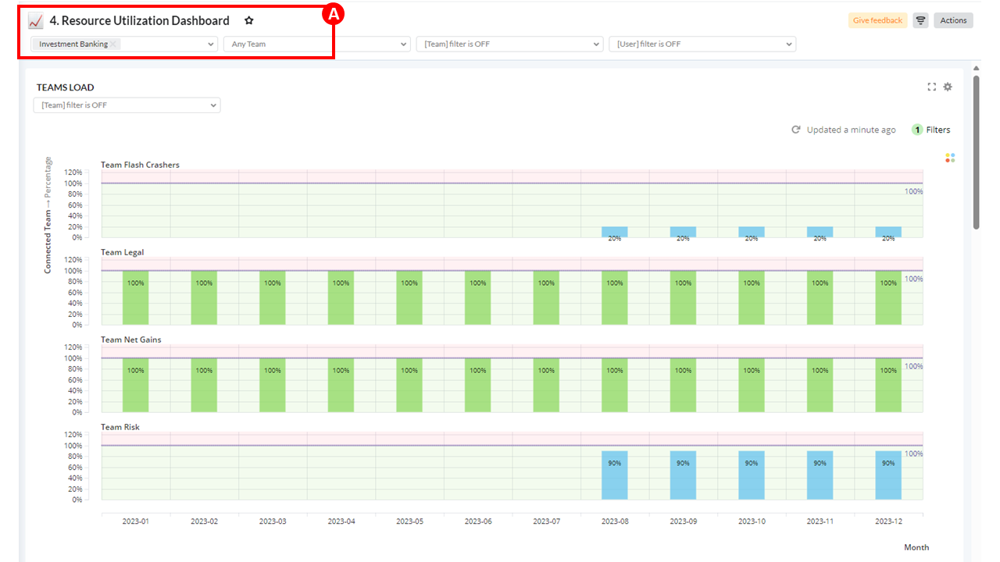

From here, you can view the workload by team. The **TEAMS LOAD** dashboard is now filtered on the **Portfolio (A)**. You can get a sense of the capacity available, or not available, for each team. A blue column indicates that the team has a load available. Green indicates that the team is properly loaded and balanced. Red indicates that the team is overloaded and needs to offload work to another team.

This view can be used to balance capacity and demand between teams.

### Initiative Labor Financials

1. Click on the **Initiative Labor Financials** view **(A)**.

2. Expand the **2024** twisty associated with **Investment Banking (A)** and then locate **Chatbots in the Call Center (B)**.

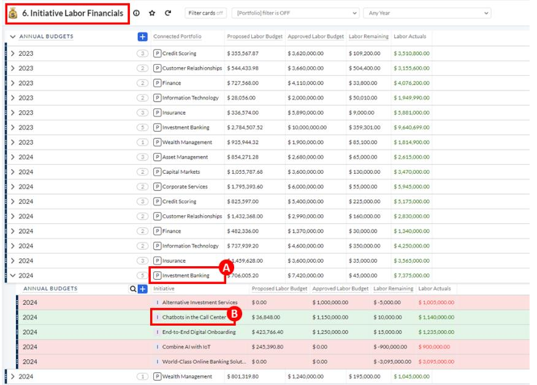

The strength of Targetprocess is that you can connect an initiative’s work to its financials. In Targetprocess, labor financials can be automatically calculated based on work allocation decisions or assignments.

Here you can see the annual budgets that are connected by portfolio. Recall that initiatives are connected to a portfolio. You expanded the **Investment Banking** portfolio **(A)** and are going to explore the connected initiatives next. Working with the **Chatbots in the Call Center** initiative **(B)**, you can see the **Proposed** and **Approved Labor Budgets**. You can compare **Labor Actuals** against **Labor Remaining**.

## ART Management

In this section, the message you deliver transitions to the Agile Release Train (ART) level. All the planning that is done at the ART level can be connected to the enterprise and portfolio views seen earlier and team-level tools such as Jira or Azure DevOps. Targetprocess can connect areas of the business that conduct planning with different methodologies – for example, traditional waterfall and scaled agile.

This section of the demo focuses on Targetprocess support for the PI Planning Event, a
key part of SAFe. Targetprocess support for PI Planning helps enable remote/hybrid
planning and simplifies the process of shifting from planning to implementation. This
support is possible because in Targetprocess, everything is connected in one system,
not separate systems.

Three views are discussed that align with a PI Planning Event:

- **Add Team PI Capacity** (Readiness)
- **ART Planning Board** (Execution)
- **Flow Dashboard** (Metrics)

> Persona used: **Release Train Engineer**

### Add Team PI Capacity

1. Click on the **ART Management** folder **(A)**.

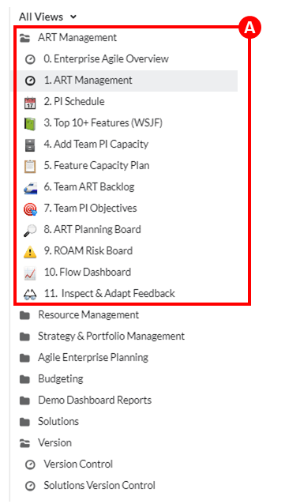

2. Select the **Add Team PI Capacity** view **(A)**.

3. Expand **PI1 Core Banking** twisty **(A)**, then expand **Team Charlie (B)**, then expand **PI1 Iteration5 (C)**.

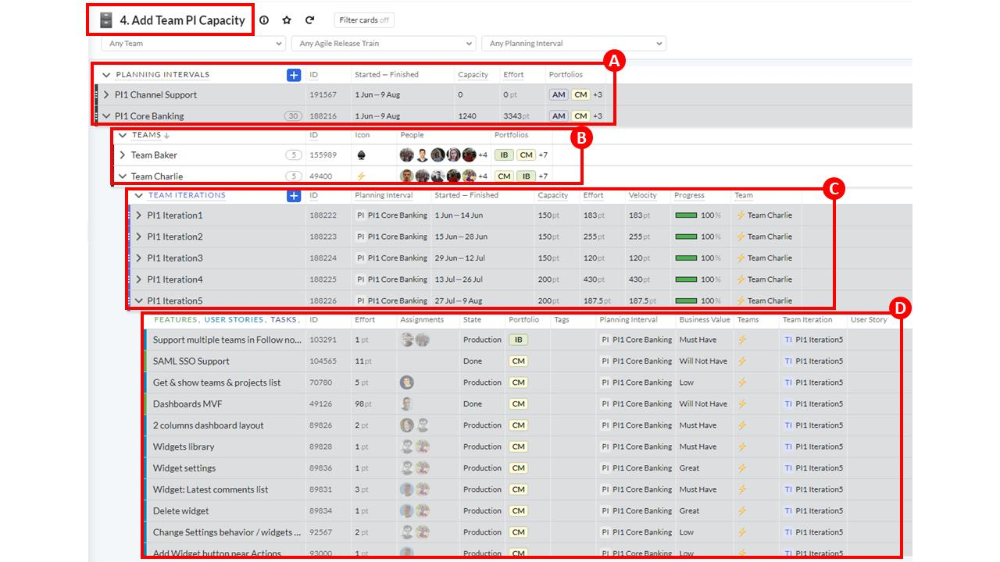

The **ART Management** folder has many views that speak to the rich set of capabilities in Targetprocess. Let’s focus on capacity planning to prepare for the Planning Interval (PI) Planning Event. It is important to understand that PIs and Team Iterations are timeboxes for capacity and effort. **Capacity** represents the amount of work that a team can do in a specified time period. **Effort** is the currently assigned work in a specified time period. Both are measured in story points.

At the **PLANNING INTERVALS** level **(A)**, you can check the **Capacity** and **Effort** for this PI. Each Agile Release Train (ART) has its own series of PIs, allowing ARTs and teams to follow the schedule that works best for them.

At the **TEAMS** level **(B)**, you can see which teams are assigned to this PI. The number in the Team field indicates how many iterations are included in the PI. In this example, Team Charlie is connected to five iterations in this PI.

At the **TEAMS ITERATION** level **(C)**, each iteration is done in a two-week sprint with each team connected to the iteration. This level of detail allows managers that run the PI Planning Event to enter and review the capacity for each team by iteration.

As you continue to expand the Team Iteration, you can see the **FEATURES**, **USER STORIES**, **TASKS (D)** connected to the iteration. These details are assigned to one or more team members and assigned an effort that is ultimately rolled up to the Planning Interval’s **Effort** column.

### ART Planning Board

1. Click on the ART Planning Board view (A). 

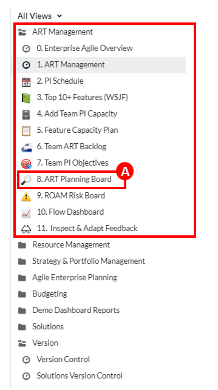

2. Click on the **Any Team** drop down and select Team Baker (A). Now, click on **Planning Interval** and select **PI1 Core Banking (B)**.

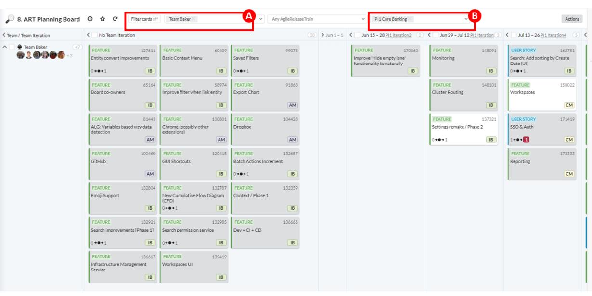

It is helpful to have a visual representation of the PI and its iterations. This board is used to show the relationships and manage dependencies.

As you can see, the view is filtered by **Team (A)** and **Planning Interval (B)**. Each column represents an iteration with its connected **Features**, **User Story(s)**, and **Tasks**. To balance a team’s capacity across sprints, a Release Train Engineer can drag/drop Features, User Story(s), or Tasks to other iterations with more available capacity. The Release Train Engineer might also balance capacity across Teams and Iterations.

### Flow Dashboard

1. Select the **Flow Dashboard** view **(A)**.

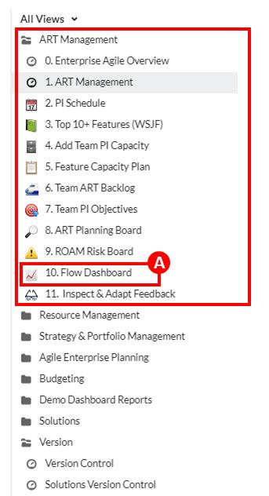

2. Click on the **Any Team** drop down and select **Team Baker (A)**.

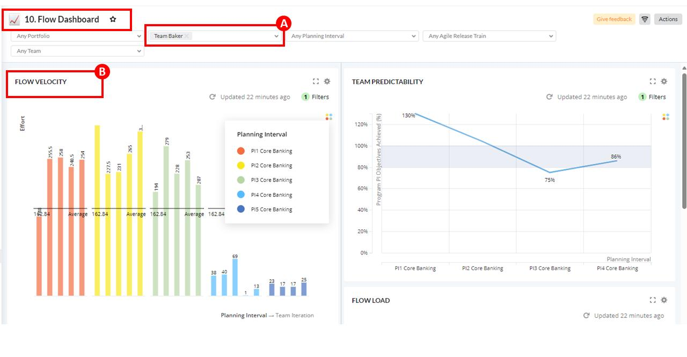

Since the Release Train Engineer did the work to balance capacity across teams, they need to see metrics that help them evaluate how well the plan and implementation of the work are aligned. The metrics are used after the PI Planning Event is complete and the PI starts. Teams have completed work at this point.

This view contains several charts that are helpful to the Release Train Engineer. Let’s
look at three charts:

- **FLOW VELOCITY**
- **FEATURES/PI COMPLETED VS COMMITTED**
- **TOP 10+ FEATURES (WSJF)**

Start with the **FLOW VELOCITY** chart **(B)** that provides a graphical representation of the effort that is required for each interval’s iteration. As you roll over each bar in the graph, you can see a pop-up summary of that iteration’s effort.

3. Navigate to the **FEATURES/PI COMPLETED VS COMMITTED** chart **(A)**.

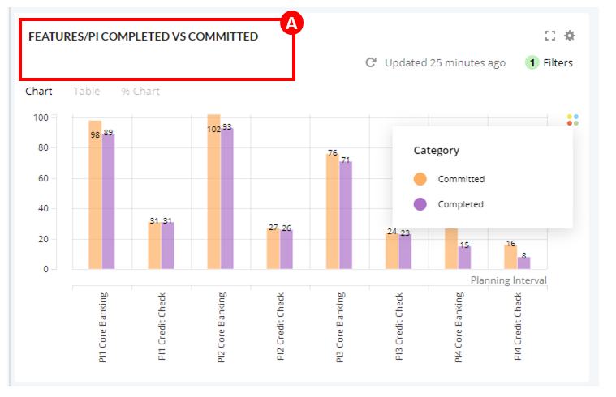

The **FEATURES/PI COMPLETED VS COMMITTED** chart **(A)** is another tool in the Release Train Engineer’s toolbox. It graphically shows the completed versus committed effort for each PI.

4. Click on the **Top 10+ Features (WSJF)** chart **(A)**.

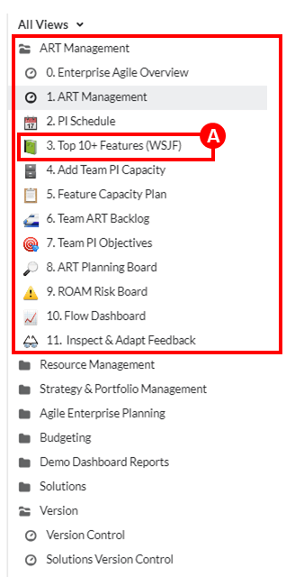

5. Click on the **Planning Interval** drop down and select **PI1 Core Banking (A)**.

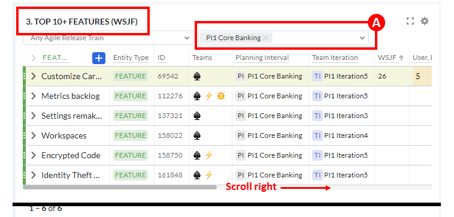

An Engineer might want to see the top features and prioritize them based on the value of Weighted Shortest Job First (WSJF) or any other feature value.

## Summary

To quickly recap this demo, you showed how Targetprocess helps clients as they transition to or continue to use lean portfolio management. This demo briefly touched on all Targetprocess’s capabilities: strategic planning, program management, resource management, and portfolio budgeting.

In the Agile Enterprise Planning folder, you were able to demonstrate how you can manage:

- Strategic planning capabilities in the **Executive Room**
- Portfolio budgeting capabilities in the **Financial Room**
- Resource management capabilities in the **Resource Room**
- Program management capabilities in the **PMO Room**

In the **Strategy & Portfolio Management** folder, you transitioned to how approved initiatives are scheduled and how you can ensure that funding is aligned with business objectives and the scaled agile using value streams.

Keeping an eye on initiatives, you learned that the **Resource Management** folder is where resources are assigned to initiatives and initiative funding is managed.

The **ART Management** folder showed how a Planning Interval (PI) event is made ready, executed, and analyzed.
