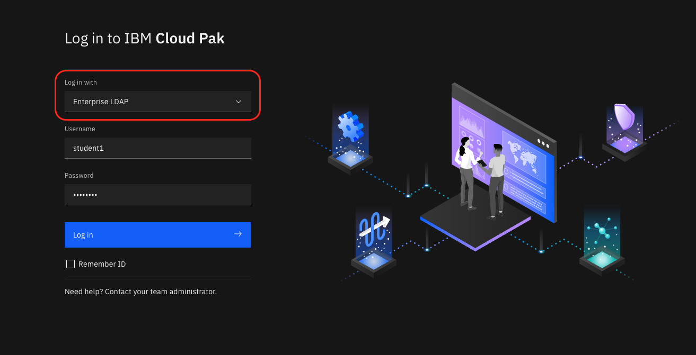
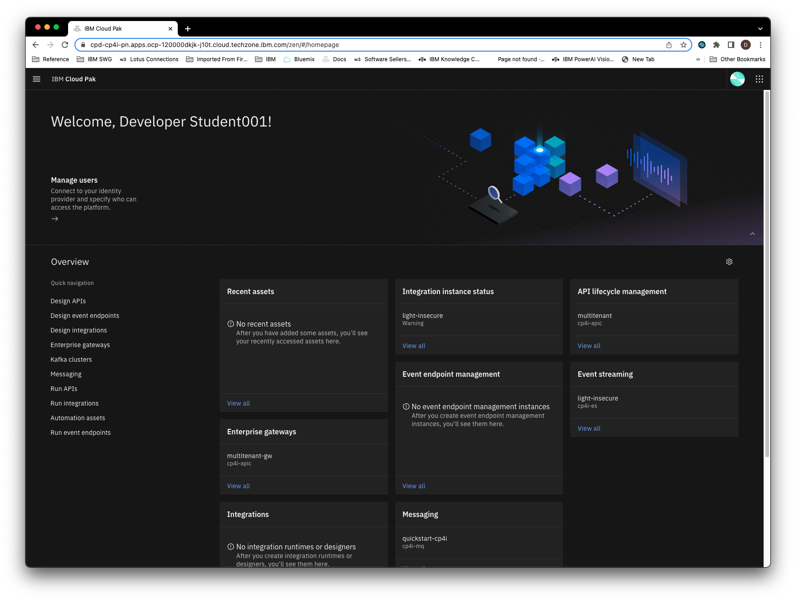
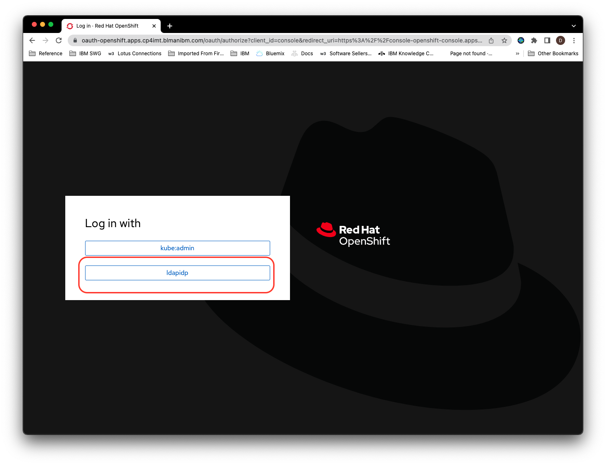
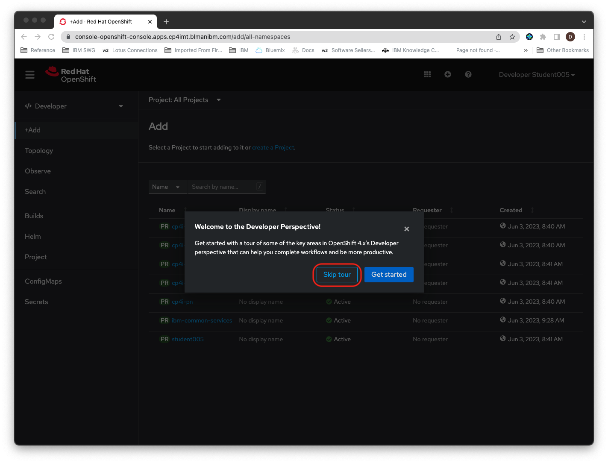
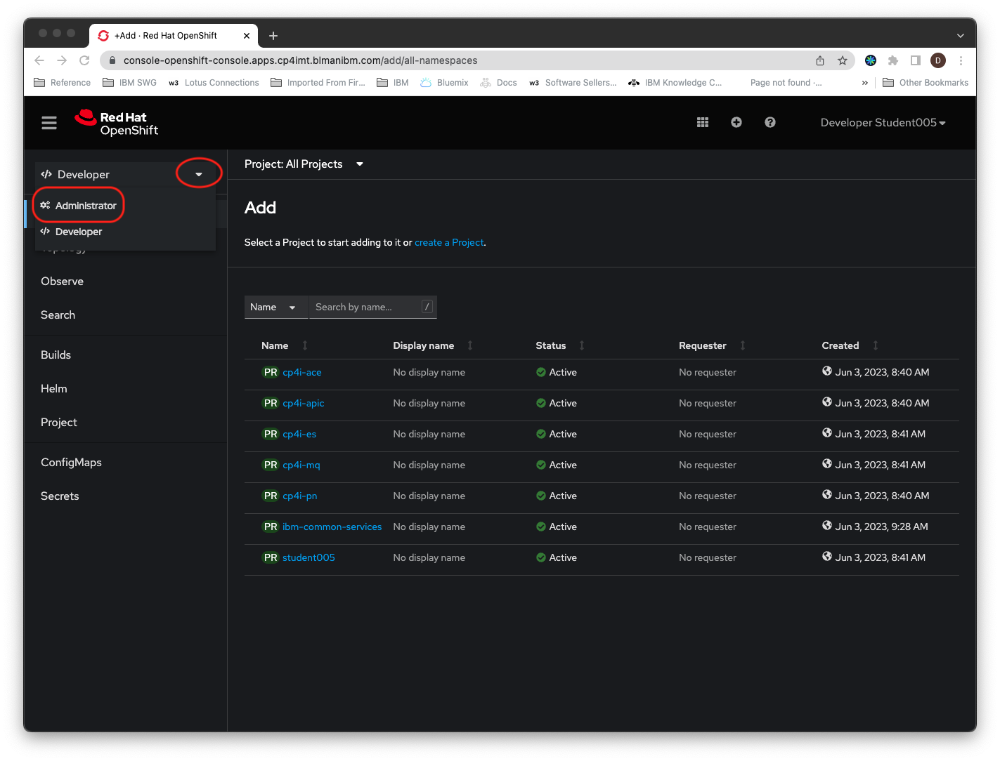
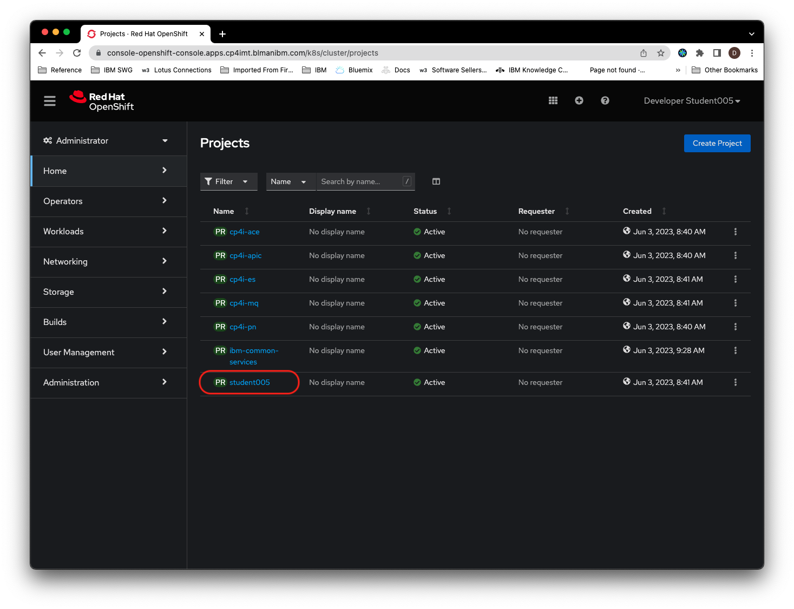
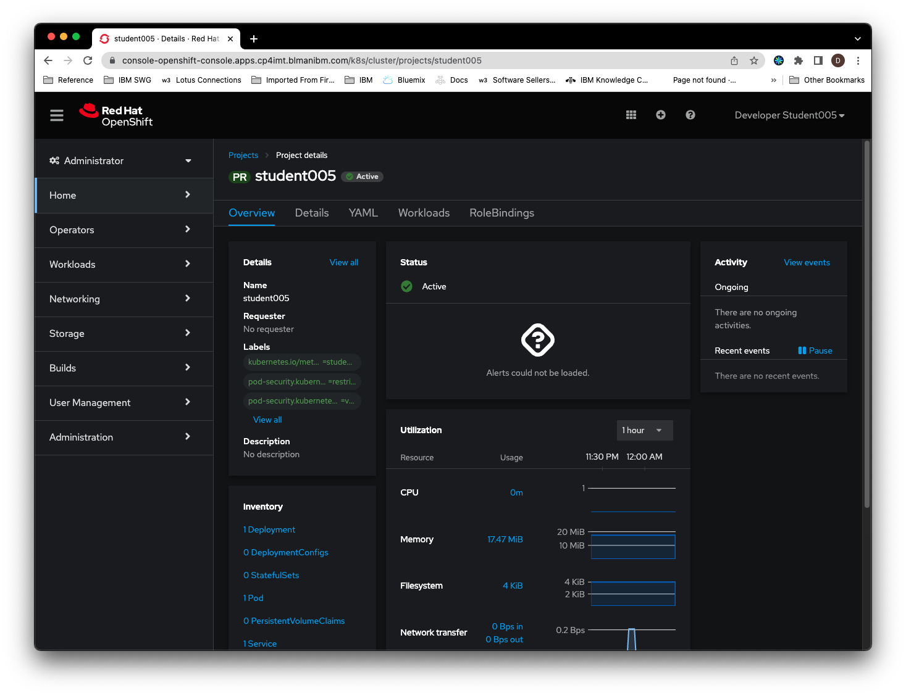

# 100: Antes del trabajo

## Cloud Pak for Integration Platform Navigator

El Cloud Pak for Integration Platform Navigator es una aplicación web que le permite acceder a todos los componentes de CP4I. Su instructor le proporcionará una URL para el CP4I Platform Navigator y un nombre de usuario y contraseña. Usted necesitará este enlace para acceder a todos los componentes de CP4I que utilizará en los laboratorios. Le recomendamos que lo mantenga abierto en una pestaña separada.

Para iniciar sesión en el Cloud Pak for Integration Platform Navigator haga lo siguiente:

1.  Haga clic en el enlace que le ha proporcionado su instructor para el Platform Navigator :

2.  Seleccione el repositorio de usuarios **Enterprise LDAP**, introduzca su nombre de usuario y contraseña y haga clic en **Iniciar sesión**

    

    > **Nota:** Es posible que aparezcan advertencias del navegador sobre certificados autofirmados. Si esto ocurre, continúe de todos modos con la página Navegador de la plataforma.

3.  Se abrirá el Navegador de la Plataforma CP4I con enlaces a todos los componentes de CP4I. Mantenga esta pestaña abierta durante el resto del taller, ya que contiene toda la información y los enlaces necesarios para completar los ejercicios de laboratorio.

    

## Consola de clúster OpenShift

Usted tendrá que acceder a la consola OpenShift para instalar aplicaciones utilizadas en el laboratorio para interactuar con los componentes CP4I . Su instructor le proporcionará un enlace . Haga clic en el enlace de la consola OpenShift.

1.  Seleccione el repositorio de usuarios **ldapidp**

    

1.  Introduzca el mismo nombre de usuario y contraseña que utilizó en el paso anterior y haga clic en **Iniciar sesión**.

1.  Haga clic en **Saltar recorrido** cuando se le solicite

    

1.  Cambiar a la vista **Administrador**

    

1.  Haga clic en el enlace del proyecto con el mismo nombre que su nombre de usuario.

    

1.  La consola de OpenShift debería parecerse ahora a la siguiente imagen. Mantenga esta pestaña del navegador abierta ya que necesitará utilizar la consola de OpenShift durante los laboratorios

    

> **Nota:** Puede hacer clic en cualquier imagen de las siguientes instrucciones para ampliarla y ver más detalles. Cuando lo hagas, haz clic en el botón Atrás de tu navegador para volver al estado anterior.
