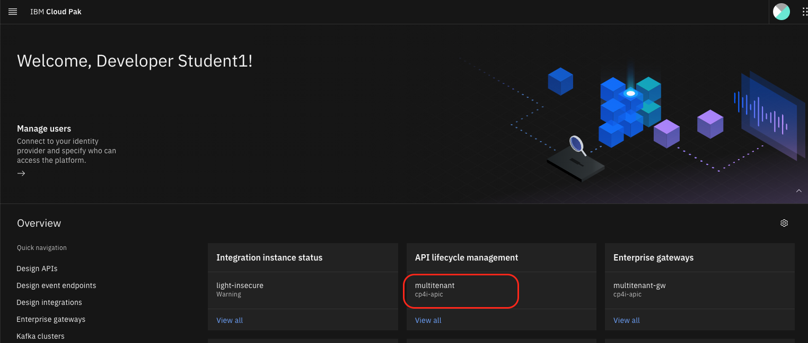
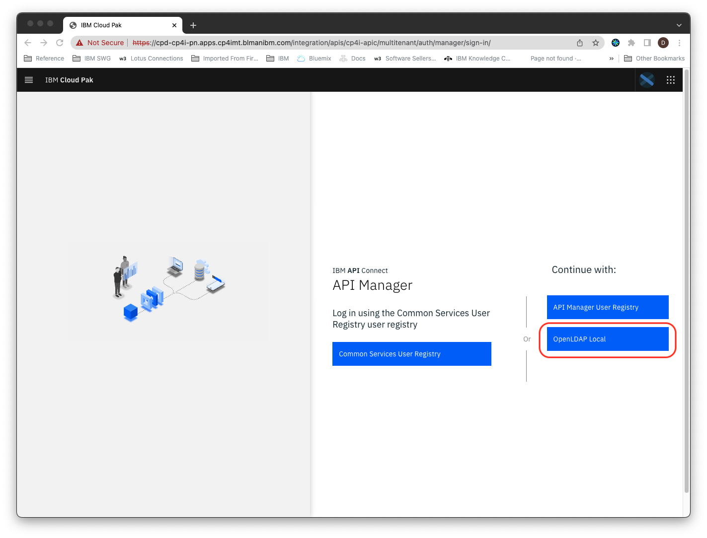
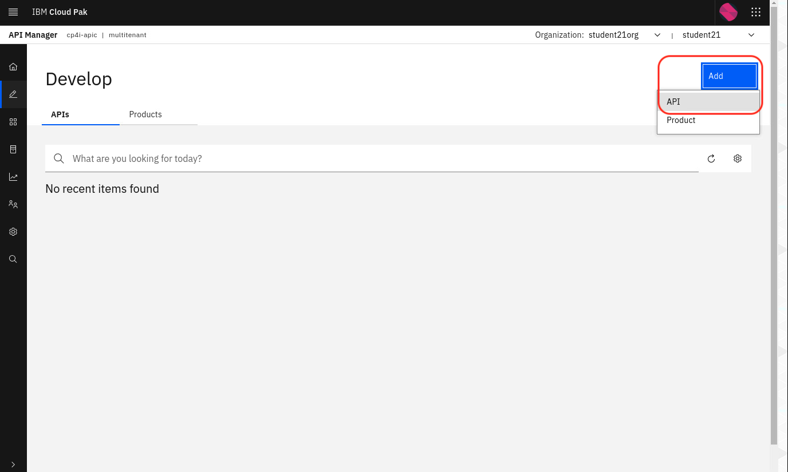
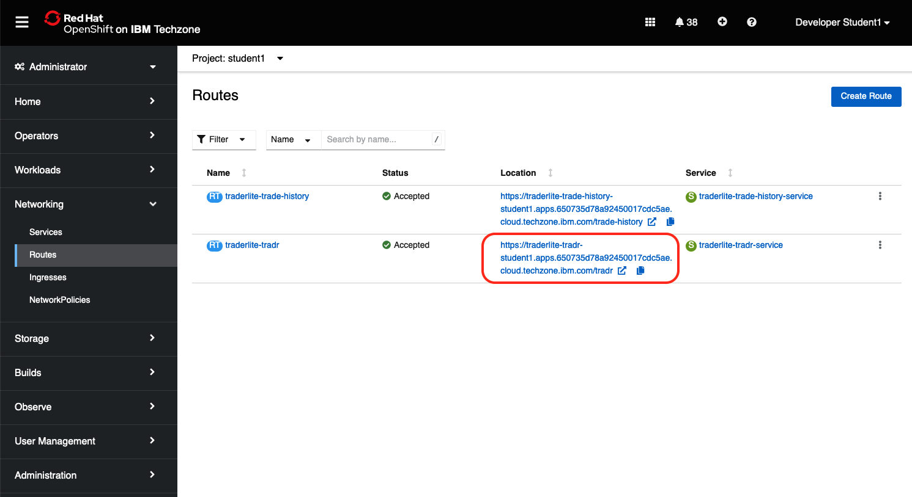

# 101: Crear, desplegar y probar una nueva API utilizando el Kit de herramientas para desarrolladores de API Connect

En este laboratorio creará una nueva API utilizando la definición OpenAPI de un servicio web RESTful existente que obtiene cotizaciones bursátiles en tiempo real. A continuación, probará la API desplegada desplegando la aplicación _IBM Trader Lite_, que es una muestra sencilla de negociación de acciones, escrita como un conjunto de microservicios. La aplicación utiliza la definición de API que creará para obtener cotizaciones bursátiles en tiempo real.

A continuación se muestra la arquitectura de la aplicación:

[](images/architecture.png)

- **Tradr** es una interfaz de usuario Node.js para el servicio de cartera.

- El microservicio **de cartera** se sitúa en el centro de la aplicación. Este microservicio

  - persiste datos de comercio usando JDBC a una base de datos MariaDB
  - invoca el servicio **de cotización de** acciones que invoca una API definida en API Connect en CP4I para obtener cotizaciones de acciones
  - llama al servicio **de historial de** operaciones para almacenar los datos de las operaciones en una base de datos PostgreSQL que puede ser consultada para la elaboración de informes.
  - llama al servicio de historial **comercial** para obtener datos comerciales históricos agregados.

Este laboratorio se divide en los siguientes pasos:

1.  [Descargar el archivo de definición OpenAPI para el servicio externo Stock Quote](#step-1-download-the-openapi-definition-file-for-the-external-stock-quote-service)
2.  [Importar el archivo de definición de OpenAPI en API Manager](#step-2-import-the-openapi-definition-file-into-api-manager)
3.  [Configurar la API](#step-3-configure-the-api)
4.  [Probar la API](#step-4-test-the-api)
5.  [Instalar la aplicación TraderLite](#step-5-install-the-traderlite-app)
6.  [Compruebe que la aplicación Trader Lite llama a su API correctamente](#step-6-verify-that-the-trader-lite-app-is-calling-your-api-successfully)
7.  [Resumen](#summary)

## Paso 1: Descargue el archivo de definición OpenAPI para el servicio externo Stock Quote

> **Nota:** Puede hacer clic en cualquier imagen de las siguientes instrucciones para ampliarla y ver más detalles. Cuando lo hagas, haz clic en el botón Atrás de tu navegador para volver al estado anterior.

1.1 En su navegador, haga clic con el botón derecho del ratón en el siguiente enlace, haga clic con el botón derecho y seleccione **Guardar enlace como.**.. en el menú contextual. Guarde el archivo _stock-quote-api.yaml_ en su sistema local.

[stock-quote-api.yaml](https://raw.githubusercontent.com/IBMStockTraderLite/traderlite-cp4i/master/apic/stock-quote-api.yaml)

## Paso 2: Importar el archivo de definición de OpenAPI en API Manager

2.1 Vaya a la pestaña del navegador CP4I Platform Navigator

> **Nota**: Si ha cerrado la pestaña Platform Navigator de su navegador, siga las instrucciones de las [FAQ](https://ibmcp4i.github.io/cloudpakforintegration-multitenant-workshop/faq/).

2.2 Haga clic en el enlace a la instancia de API Connect

[](images/nav-to-apic.png)

2.3 Seleccione el registro de usuarios **local de OpenLDAP**

[](images/nav-to-ldap.png)

2.4 Conéctese con las mismas credenciales que recibió para el taller.

> **Nota:** La aplicación API Connect puede tardar mucho en cargarse cuando la utilizas por primera vez.

2.5 Haga clic en la **ficha Desarrollar API y productos**

[](images/api-manager.png)

2.6 Haga clic en **Añadir** y seleccione **API (REST, GraphQL o SOAP)** en el menú contextual.

[](images/add-api.png)

2.7 En la siguiente pantalla, seleccione **OpenAPI existente** en **Importar** y, a continuación, haga clic en **Siguiente**.

[](images/existing-api.png)

2.8 Ahora elija **stock-quote-api.yaml** de su sistema de archivos local y haga clic en **Siguiente**.

[](images/choose-file.png)

2.9 No seleccione **Activar API**. Haga clic en **Siguiente**

2.10 La API debería importarse correctamente como se muestra a continuación. Haga clic en **Editar API**.

[](images/edit-api.png)

## Paso 3: Configurar la API

Tras importar la API existente, el primer paso es configurar la seguridad básica antes de exponerla a otros desarrolladores. La creación de una clave de cliente permite identificar la aplicación que utiliza los servicios. A continuación, definiremos los puntos finales de backend en los que se ejecuta realmente la API. API Connect permite apuntar a varios puntos finales de backend para adaptarse a los distintos entornos de compilación.

3.1 En la barra de navegación de la izquierda, seleccione **Host** y sustituya la dirección del punto final codificada por `$(catalog.host)` para indicar que desea que las llamadas a la API externa se realicen a través de API Connect.

[](images/catalog-host.png)

3.2 Haga clic en **Guardar**

3.3 En la pantalla Editar API, haga clic en **Esquemas de seguridad(0)** en el menú de navegación de la izquierda.

3.4 En la sección **Seguridad**, haga clic en el botón **Añadir** situado a la derecha y, a continuación, en **Crear un esquema de** seguridad.

[](images/security-scheme.png)

3.5 En el campo **Security Scheme Name(Key)**, escriba `client-id`.

3.6 En **Tipo de definición de seguridad**, elija **apiKey**.

3.6 En **Tipo de clave**, elija **client_id**.

3.7 Para **Situado En** elegir **cabecera**.

3.8 Introduzca `X-IBM-Client-Id` como **nombre de la variable**. La pantalla debería parecerse a la siguiente imagen.

[](images/edit-api-complete.png)

3.9 Haga clic en el botón **Crear** y, a continuación, en **Guardar**.

3.10 A continuación requerirá el uso del Id de Cliente para acceder a su API. En la barra de navegación de la izquierda, seleccione **Seguridad(0)** y haga clic en **Crear un requisito de seguridad**.

[](images/create-security-req.png)

3.11 Seleccione el esquema de seguridad que acaba de crear y haga clic en **Crear**.

[](images/security-req.png)

3.12 Haga clic en **Guardar**

3.13 A continuación definiremos el endpoint para la API externa. Seleccione la pestaña **Gateway**, expanda **Propiedades** en la navegación de la izquierda.

3.14 Haga clic en la propiedad **target-url**.

3.15 Copie y pegue la siguiente URL en el campo **Valor de la propiedad**:

[https://stocktrader.ibmc.buildlab.cloud](https://stocktrader.ibmc.buildlab.cloud)

[](images/target-url.png)

3.16 Haga clic en **Guardar** para completar la configuración.

## Paso 4: Probar la API

En el diseñador de API, tiene la posibilidad de probar la API inmediatamente después de su creación.

4.1 En la Navegación izquierda, haga clic en **Políticas**.

4.2 Haga clic en **invocar** en el diseñador de flujos. Observe la ventana de la derecha con la configuración. El nodo de **invocación** llama a la **URL de destino** (es decir, al servicio externo).

[](images/invoke.png)

4.3 Modifique el campo **URL** para que incluya también la ruta de la solicitud pasada por el autor de la llamada añadiendo `$(request.path)` a la **URL**. Cuando haya terminado el campo debe ser establecido a:

```
  $(target-url)$(request.path)
```

[](images/invoke-edited.png)

4.4 Haga clic en **Guardar**

4.5 Activa el interruptor **Offline** y haz clic en la pestaña **Test**.

[](images/test-tab.png)

4.6 La **solicitud** debe rellenarse previamente con la solicitud GET a **/stock-quote/djia**.

4.7 Tenga en cuenta que su **identificador de cliente** se rellena previamente.

4.8 Haga clic en **Enviar**.

[](images/invoke-api.png)

4.9 Si se trata de la primera prueba de la API, es posible que aparezca una excepción de certificado. Simplemente haga clic en el enlace proporcionado. Esto abrirá una nueva pestaña y le permitirá hacer clic para aceptar el certificado autofirmado. **Nota**: Deténgase cuando obtenga un código de error `401` en la nueva pestaña. (Si no puede abrirlo, verifique dos veces si está utilizando el navegador web Chrome)

[](images/cert-exception.png)

4.10 Vuelva a la pestaña anterior y pulse **Enviar** de nuevo.

4.11 Ahora debería ver una sección de **Respuesta** con el código de Estado `200 OK` y el **Cuerpo** mostrando los detalles del _Dow Jones Industrial Average_ simulado.

[](images/response.png)

4.12 A continuación, obtendrá el _Id de cliente_ y el punto final de _la puerta de_ enlace para que pueda probar su API desde la aplicación TraderLite. Haga clic en la pestaña **Endpoint**.

4.13 Copie el valor de la URL **api-gateway-service** y el **Client-Id** en un archivo de texto local para poder utilizarlo posteriormente en la aplicación Stock Trader**(Nota:** se trata de un acceso directo al proceso habitual de publicación de la API y posterior suscripción a la misma como consumidor).

[](images/endpoint-client-id.png)

## Paso 5: Instalar la aplicación TraderLite

5.1 En otra pestaña del navegador, vaya a la URL de la consola OpenShift del clúster que se le ha asignado para el taller.

> **Nota**: Hay un enlace a la consola de su cluster asignado en su página de Información del Taller. Si la has cerrado, puedes acceder a ella siguiendo las instrucciones de las [FAQ](https://ibm.github.io/cloudpakforintegration-workshop/faq/).

5.2 Haga clic en **Proyectos** en el menú de navegación de la izquierda y, a continuación, haga clic en el proyecto de su **_alumnonnn_** en la lista.

[](images/select-traderlite-project.png)

5.3 Haga clic en **Operadores instalados** (en la sección **Operadores** ) en el menú de navegación de la izquierda y, a continuación, haga clic en el **Operador TraderLite** de la lista.

[](images/select-traderlite-operator.png)

5.4 Haga clic en **Crear Instancia** para iniciar la instalación de la aplicación TraderLite.

[](images/traderlite-create-instance.png)

5.5 Nombre de la instancia _traderlite_

5.6 Desplácese por la página hasta el **Microservicio de cotización de acciones** y sustituya la URL de **API Connect** y **el ClientId de API Connect** por la URL de **api-gateway-service** y el **Client-Id** que guardó en la sección anterior. Haga clic en **Crear**

[](images/traderlite-create-values.png)

5.7 En la barra de navegación de la izquierda, seleccione **Pods** (en la sección **Workloads** ) y espere a que todos los pods TraderLite tengan el estado **Running** y estén en estado **Ready**.

> _Nota: Sabrá que los pods traderlite-xxxxx están listos cuando la columna `Listo` muestre `1/1`._

[](images/traderlite-pods-ready.png)

## Paso 6: Compruebe que la aplicación Trader Lite llama a su API correctamente

6.1 En la consola de OpenShift, haga clic en **Rutas** (en la sección **Redes** ) en el menú de navegación de la izquierda y, a continuación, haga clic en el icono situado junto a la URL de la aplicación **Tradr** (la interfaz de usuario de TraderLite).

[](images/traderlite-run-tradr.png)

6.2 Inicie sesión con el nombre de usuario `stock` y la contraseña `trader`

[](images/stock-trader-login.png)

6.3 Si el resumen DJIA simulado contiene datos, ¡enhorabuena! Significa que la API que ha creado en API Connect funciona.

[](images/djia-success.png)

## Resumen

Enhorabuena. Ha completado con éxito los siguientes pasos clave en este laboratorio:

- Crear una API importando una definición OpenAPI para un servicio REST existente.
- Configurado un ClientID/API Key para la seguridad configurar un proxy a la API existente.
- Probada la API en el kit de herramientas para desarrolladores API Connect.
- Despliega la aplicación Trader Lite y configúrala para que utilice la API que has creado.
- He probado la aplicación Trader Lite para asegurarme de que utiliza correctamente su API.
