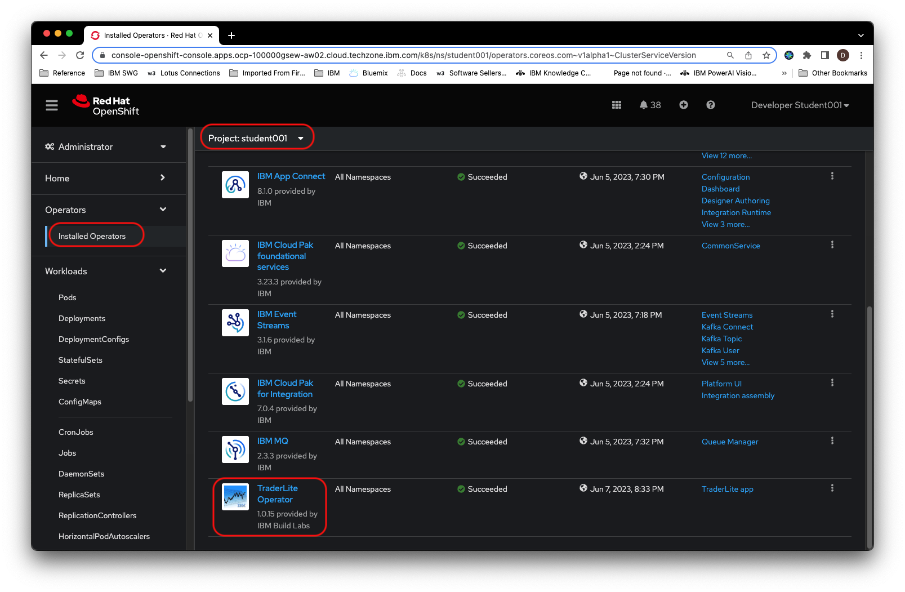
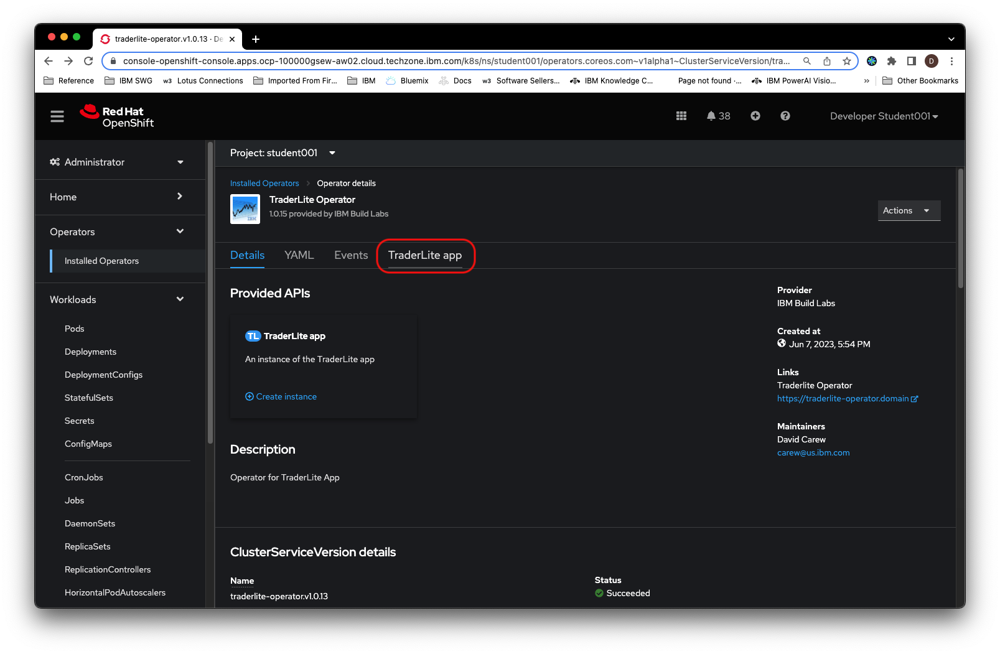
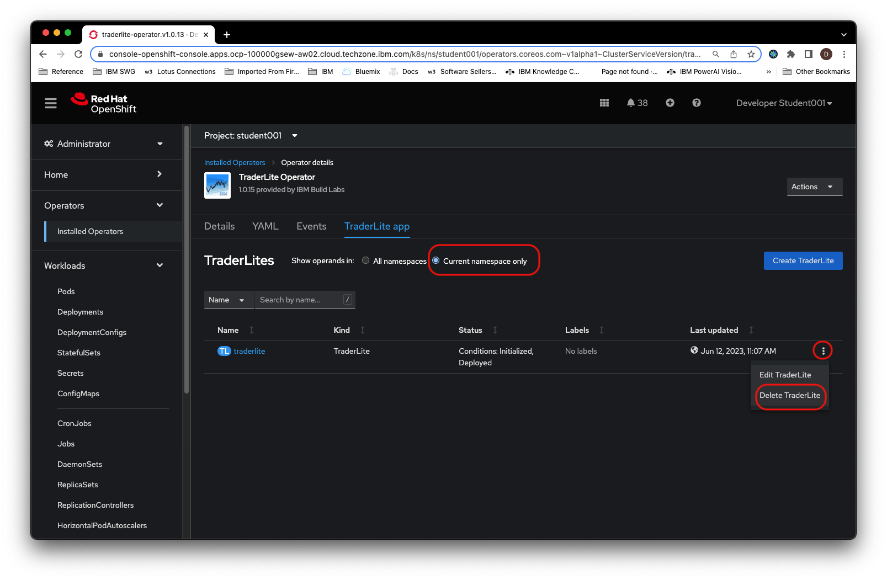
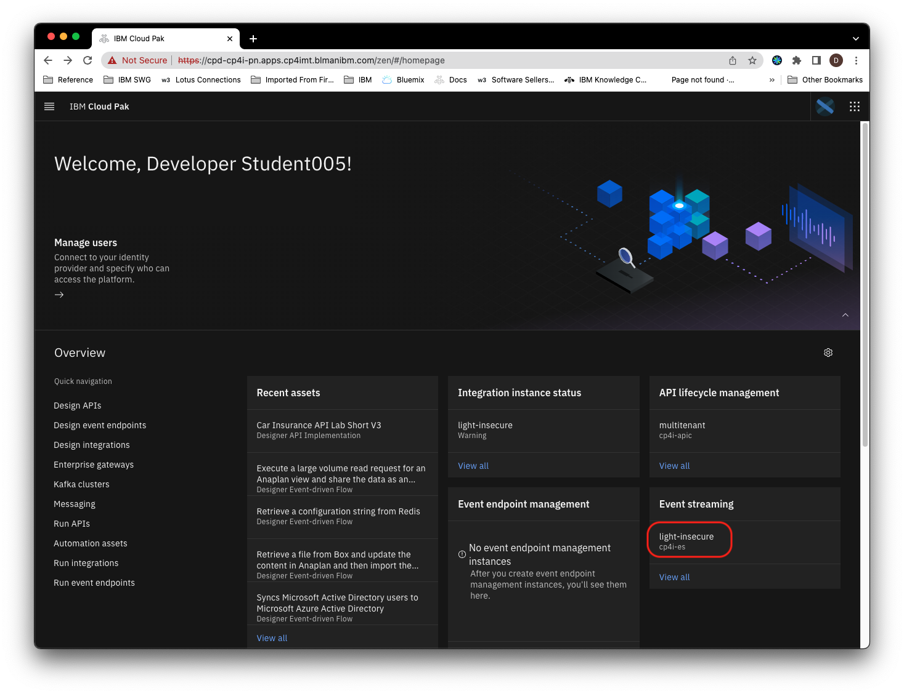
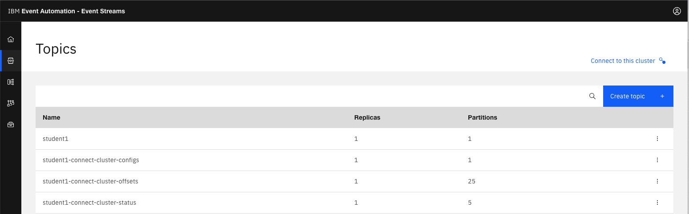
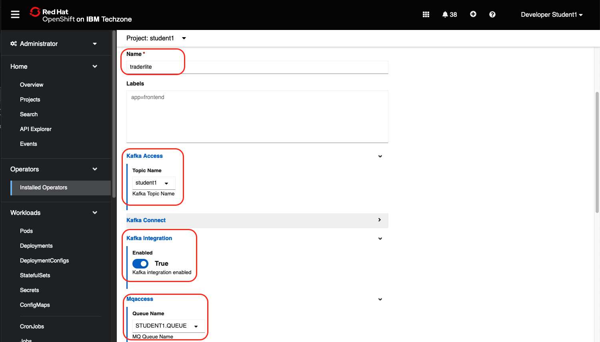
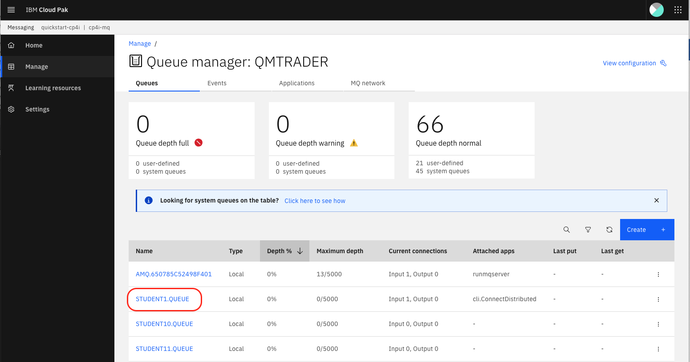
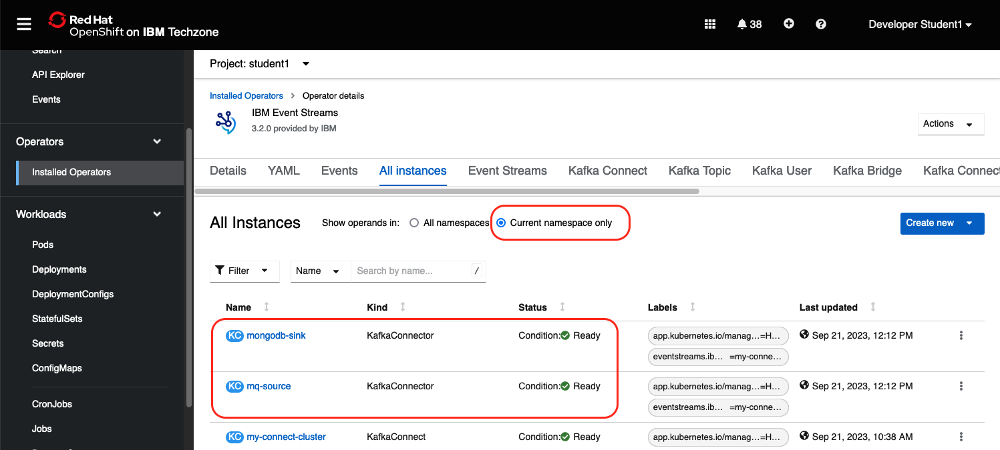
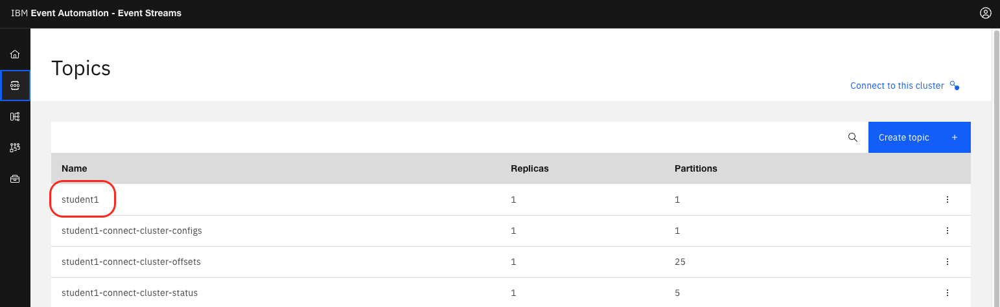

# 102: Uso de IBM MQ e IBM Event Streams para la replicación de datos casi en tiempo real

En este laboratorio utilizará IBM MQ e IBM Event Streams para replicar datos de una base de datos transaccional a una base de datos de informes. El patrón utilizado permite un escalado horizontal continuo para minimizar la latencia entre el momento en que la transacción se consigna en la base de datos transaccional y el momento en que está disponible para su consulta en la base de datos de informes.

A continuación se muestra la arquitectura de la solución que construirá:

*   El microservicio **de cartera** se sitúa en el centro de la aplicación. Este microservicio:

    *   envía las transacciones completadas a una cola IBM MQ.
    *   llama al servicio **trade-history** para obtener datos comerciales históricos agregados.

*   El origen **Kafka Connect** utiliza el marco Kafka Connect y un origen IBM MQ para consumir los datos de transacción de IBM MQ y enviarlos a un tema en IBM Event Streams. Al escalar este servicio horizontalmente, puede reducir la latencia entre el momento en que la transacción se consigna en la base de datos transaccional y el momento en que está disponible para su consulta en la base de datos de informes,

*   El sumidero **Kafka Connect** utiliza el marco Kafka Connect y un sumidero Mongodb para recibir los datos de transacción de IBM Event Streams y publicarlos en la base de datos de informes. Al escalar este servicio horizontalmente, puede reducir la latencia entre el momento en que la transacción se consigna en la base de datos transaccional y el momento en que está disponible para su consulta en la base de datos de informes.

Este laboratorio se divide en los siguientes pasos:

- [102: Uso de IBM MQ e IBM Event Streams para la replicación de datos casi en tiempo real](#102-uso-de-ibm-mq-e-ibm-event-streams-para-la-replicación-de-datos-casi-en-tiempo-real)
  - [Paso 1: Desinstalar la aplicación TraderLite](#paso-1-desinstalar-la-aplicación-traderlite)
  - [Paso 2: Crear un tema en la consola de gestión de flujos de eventos](#paso-2-crear-un-tema-en-la-consola-de-gestión-de-flujos-de-eventos)
  - [Paso 3: Añadir componentes de mensajería a la aplicación Trader Lite](#paso-3-añadir-componentes-de-mensajería-a-la-aplicación-trader-lite)
  - [Paso 4: Generar algunos datos de prueba con la aplicación TraderLite](#paso-4-generar-algunos-datos-de-prueba-con-la-aplicación-traderlite)
  - [Paso 5: Ver mensajes en IBM MQ](#paso-5-ver-mensajes-en-ibm-mq)
  - [Paso 6: Iniciar la replicación de Kafka](#paso-6-iniciar-la-replicación-de-kafka)
  - [Paso 7: Verificar que los datos de las transacciones se han replicado en la base de datos del Historial Comercial](#paso-7-verificar-que-los-datos-de-las-transacciones-se-han-replicado-en-la-base-de-datos-del-historial-comercial)
  - [Paso 8: Examinar los mensajes enviados a su tema Event Streams](#paso-8-examinar-los-mensajes-enviados-a-su-tema-event-streams)
  - [Resumen](#resumen)

> **Nota:** Puede hacer clic en cualquier imagen de las siguientes instrucciones para ampliarla y ver más detalles. Cuando lo hagas, haz clic en el botón Atrás de tu navegador para volver al estado anterior.

## Paso 1: Desinstalar la aplicación TraderLite

Si ha completado los laboratorios de integración de API Connect y/o Salesforce, entonces ya tendrá la aplicación en ejecución. Para este laboratorio es más fácil instalar la aplicación desde cero para que pueda utilizar el entorno OpenShift GUI (en lugar de editar el archivo YAML de una instancia existente) para seleccionar todas las opciones necesarias para esta aplicación. Si la aplicación *NO* está instalada, vaya al **paso 2**.

1.1 Vaya a la consola OpenShift de su clúster de taller. Seleccione su proyecto ***studentn***. En la navegación de la izquierda, seleccione **Operadores instalados** en la sección **Operadores** y seleccione el **operador TraderLite**.

1.2 Haga clic en la pestaña de **la aplicación TraderLite**

1.3 Seleccione sólo el espacio de nombres actual. Haga clic en los 3 puntos a la derecha del CRD TraderLite existente y seleccione Eliminar TraderLite en el menú contextual.

1.4 En el área de navegación de la izquierda, seleccione **Pods** en la sección **Workloads**. Debería ver que los pods *traderlite-xxxxx-yyyyy* están terminados.

> *Nota: Puede introducir `traderlite` en el campo de búsqueda por nombre para filtrar los pods.*

## Paso 2: Crear un tema en la consola de gestión de flujos de eventos

2.1 Vaya a la pestaña del navegador CP4I Platform Navigator o abra una nueva utilizando la URL y las credenciales proporcionadas.

2.2 Haga clic en el enlace a la instancia de flujos de eventos

2.3 Si se le pide que inicie sesión, seleccione el registro de usuarios **Enterprise LDAP** e inicie sesión con sus credenciales.

2.4 Haga clic en la ficha **Crear un tema**

2.5 Utiliza tu nombre de usuario para el nombre del tema. Por ejemplo, si tu nombre de usuario es `student5`, entonces llama al tema `student5`. Haz clic en **Siguiente**.

2.6 Deje el valor predeterminado para la particiones de mensajes y haga clic en **Siguiente**.

2.7 Deje el valor predeterminado para la retención de mensajes y haga clic en **Siguiente**.

2.8 Deje el valor predeterminado para las réplicas y haga clic en **Crear tema**.

2.9 Debería ver su nuevo tema en la lista.

## Paso 3: Añadir componentes de mensajería a la aplicación Trader Lite

En esta sección se instalará la aplicación TraderLite para empezar a almacenar transacciones como mensajes MQ, sin configurar la parte KafkaConnect que moverá las transacciones fuera de MQ, a Event Streams y luego a MongoDB. Esto demuestra cómo MQ puede servir como un almacenamiento fiable y un buffer de reenvío, especialmente durante una interrupción temporal de la red.

3.1 Vaya a la consola OpenShift de su clúster de taller. Seleccione su proyecto ***studentn***.

3.2 Haga clic en **Operadores instalados** (en la sección **Operadores** ) en el menú de navegación de la izquierda y, a continuación, haga clic en el **Operador TraderLite** de la lista.

3.3 Haga clic en **Crear Instancia** para iniciar la instalación de la aplicación TraderLite.

3.4 De un nombre a la instancia *traderlite*

3.5 Ajuste los siguientes valores:

*   En **Kafka Access** seleccione el tema **del estudiante**
*   Activar **KafkaIntegration**
*   En **Mqaccess** selecciona la cola **STUDENTN.QUEUE** que corresponda a tu nombre de usuario.

3.6 Desplácese hacia abajo y haga clic en **Crear**

3.7 En la barra de navegación de la izquierda, seleccione **Pods** (en la sección **Workloads** ) y espere a que todos los pods TraderLite tengan el estado **Running** y estén en estado **Ready**. mkdocs

> *Nota: Sabrá que los pods traderlite-xxxxx están listos cuando la columna `Ready` muestre `1/1`.*

## Paso 4: Generar algunos datos de prueba con la aplicación TraderLite

4.1 En la consola de OpenShift, haga clic en **Rutas** en el menú de navegación de la izquierda, en la sección **Redes** y, a continuación, haga clic en el icono situado junto a la URL de la aplicación **Tradr** (la interfaz de usuario de TraderLite).

4.2 Inicie sesión con el nombre de usuario `stock` y la contraseña `trader`

4.3 Haga clic en **Añadir cliente** y rellene el formulario. Debe utilizar formatos válidos de correo electrónico y número de teléfono para evitar errores de validación.

4.4 Haga clic en **Guardar**

4.5 Haga clic en el **ID de** la cartera del nuevo cliente para ver los detalles de la cartera

4.6 Compre algunas acciones de 2 ó 3 empresas diferentes y luego venda una parte de una de las acciones que acaba de comprar. Para comprar acciones, haga clic en el botón `Buy Stock` acciones, luego seleccione una empresa e introduzca la cantidad de acciones. Para vender acciones, pulse el botón `Sell stock`, después seleccione el símbolo de la empresa e introduzca el número de acciones que desea vender.

> **Nota:** Su ROI será incorrecto porque todavía no estamos replicando los datos históricos de operaciones que entran en el cálculo del ROI.

## Paso 5: Ver mensajes en IBM MQ

5.1 Vaya a la pestaña del navegador CP4I Platform Navigator o abra una nueva pestaña con la URL y las credenciales proporcionadas.

5.2 Haga clic en el enlace a la instancia MQ.

5.3 Si se le pide que inicie sesión, seleccione el registro de usuarios **Enterprise LDAP** e inicie sesión con sus credenciales.

5.4 Haga clic en el mosaico **Gestionar QMTRADER**

5.5 Haga clic en la cola **STUDENTN.QUEUE** que corresponda a su nombre de usuario.

5.5 Debería ver mensajes para las operaciones que acaba de ejecutar. El número de mensajes en la cola variará en función del número de operaciones de compra/venta que haya realizado en los pasos anteriores.

5.6 Mantén abierta la pestaña del navegador con la interfaz web de MQ, ya que la necesitarás más adelante en el laboratorio.

## Paso 6: Iniciar la replicación de Kafka

En esta sección se configurará la aplicación TraderLite para empezar a mover los datos de las transacciones fuera de MQ, a Kafka y luego a la base de datos de informes MongoDB.

6.1 Vaya a la consola OpenShift de su clúster asignado. En la navegación de la izquierda, seleccione **Operadores instalados** y seleccione el **operador TraderLite**.

6.2 Haga clic en la pestaña de **la aplicación TraderLite**

6.3 Haga clic en los 3 periodos a la derecha del CRD TraderLite existente y seleccione **Editar TraderLite** en el menú contextual.

6.4 Desplácese hasta la línea 151 y establezca **Kafka Connect enabled** en **true (** deje el resto de valores sin modificar).

6.5 Haga clic en **Guardar**.

6.6 En la navegación de la izquierda seleccione **Operadores Instalados** y seleccione el operador **Flujos de Eventos**.

6.7 Haga clic en la pestaña **Todas las instancias** y elija **Sólo espacio de nombres actual** y espere a que los conectores *mq-source* y *mongodb-sink* estén en estado *Listo* antes de continuar.

6.8 Vuelve a la pestaña del navegador con la consola MQ y comprueba que todos los mensajes han sido consumidos por el conector *mq-source*. *(Nota: Es posible que tengas que volver a cargar esta pestaña del navegador para ver que se han consumido los mensajes).*

## Paso 7: Verificar que los datos de las transacciones se han replicado en la base de datos del Historial Comercial

7.1 Vaya a la consola OpenShift del clúster de su taller. En la navegación de la izquierda, seleccione **Rutas** en la sección **Redes**.

7.2 Copie el enlace del microservicio *de historial comercial* y péguelo en una nueva pestaña del navegador.

> **Nota:** Recibirá un mensaje 404 (No encontrado) si intenta acceder a esta URL tal cual. Esto se debe a que el microservicio *de historial* comercial requiere información adicional sobre la ruta.

7.3 Añada la cadena `/trades/1000` a la dirección que ha pegado: debería obtener un JSON con las transacciones de prueba que ha ejecutado anteriormente.

## Paso 8: Examinar los mensajes enviados a su tema Event Streams

8.1 Vaya a la pestaña del navegador CP4I Platform Navigator o abra una nueva con la URL y las credenciales proporcionadas.

8.2 Haga clic en el enlace a la instancia de flujos de eventos

8.3 Si se le pide que inicie sesión, seleccione el registro de usuarios **Enterprise LDAP** e inicie sesión con sus credenciales.

8.4 Haga clic en el icono de temas situado a la izquierda.

8.5 Haga clic en el tema correspondiente a su nombre de usuario.

8.6 Seleccione un mensaje para ver sus detalles

## Resumen

Enhorabuena. Ha completado con éxito los siguientes pasos clave en este laboratorio:

*   Configuración de la aplicación Trader Lite para utilizar MQ
*   Despliegue de Kafka Connect con IBM Event Streams
*   Generación de transacciones en la aplicación Trader Lite y verificación de la replicación de los datos a través de MQ y Event Streams.
