# 101: Configuration of DataStage flow and Databand setup

## Initial set-up

### Register for the Business Partner Databand demo environment

Open a session in your preferred web browser at [https://ibm-bp-demo.databand.ai/](https://ibm-bp-demo.databand.ai/) and click on **Registration**. Complete the form and click on **Register**. Provide the e-mail address you used to register in the workshop slack so the workshop team can activate your registration.

### Create an Object Storage service instance in your IBM Cloud account

Follow the [service creation instructions](https://cloud.ibm.com/docs/cloud-object-storage?topic=cloud-object-storage-provision#provision-instance) to configure a `lite` plan instance of IBM Cloud Object storage. If you get a message that `lite` plan instance already exists in the account, you do not need to add another one.

### Register access to Cloud Pak for Data as-a-service in the Dallas region

If you have not previsously registered for an IBM Cloud Pak for Data as a Service account in the **Dallas** region, [click this link](https://dataplatform.cloud.ibm.com/registration/stepone?context=cpdaas&apps=all) to sign up for one in the **Dallas** region.

After agreeing to terms use the **Log in with your IBMid** button to complete the registration.

### Download the DataStage flow source file

Download this [zip file](https://ibm.seismic.com/Link/Content/DCPVPTFPjbR3B8THb9T8289XBM7j) and save it for use in Section 1 where you will create a new DataStage flow.

## Set up the Data Integration Flow/Job

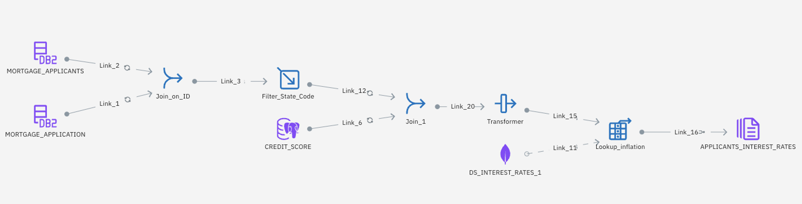
**Figure A – This labs Data Integration flow**

_This Next-Gen DataStage flow integrates data from a Db2 Warehouse on Cloud, Postgres Database, and MongoDB instance. This data is transformed via joining tables, filtering the records by State, calculating a level of debt, and ultimately assigning each individual mortgage applicant an appropriate mortgage rate._

To begin, perform the following steps:

1. If you have not already done so, [Log in to IBM Cloud Pak for Data](https://dataplatform.cloud.ibm.com/). You will use your personal Cloud Pak for Data as a Service account in the Dallas region to do this lab.

   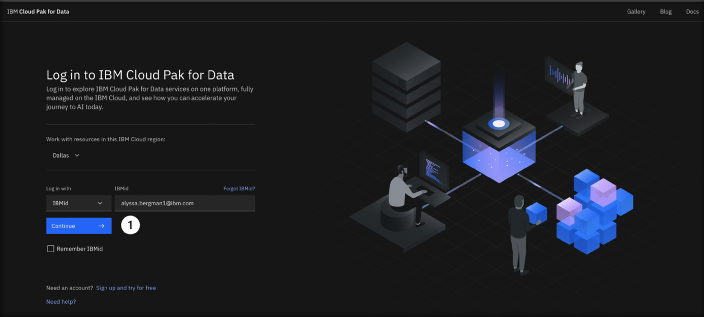

1. From the Cloud Pak for Data home screen, click **Work with data** to create a new project.

   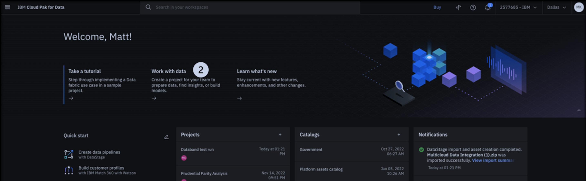

1. Click the **Create and empty project** tile.

   

1. Name the project **Databand\_\<YOUR_INITIALS>\_vest** like the example shown. Keep the settings as is (you can optionally add a description), and select a object storage instance to use for the project. Then click **Create**.

   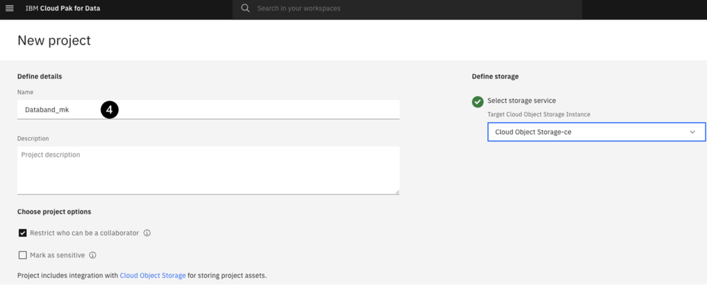
   **Important:** If you did not provision a Cloud Object Storage Instance in the prerequisites, there will be a link in this page to add one that will take you to the catalog page. Create an instance using the `lite` plan and then refresh the project settings page.

1. Once this project is created, select the **Assets** tab in the project overview screen and click the blue **New asset** icon.

   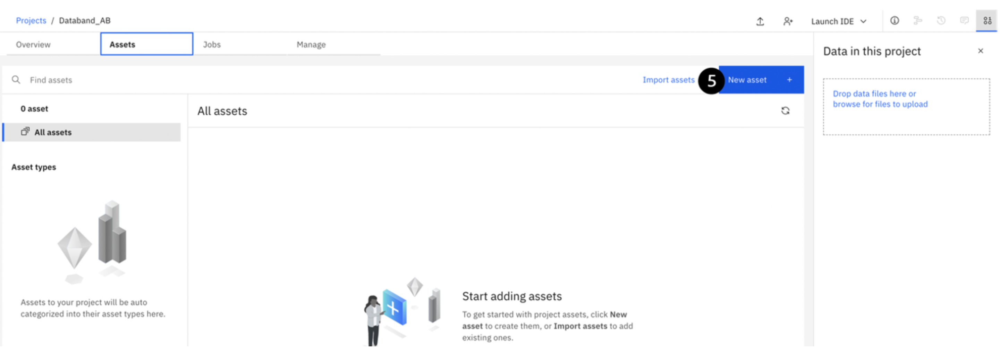

1. Scroll down to the **Graphical builders** section, and click on the **DataStage** tile.

   

1. Select the **Local file** tab on the left-hand menu. Either drag and drop, or click **Browse** and upload the **"Multicloud Data Integration.zip"** file that you downloaded as a prerequisite to this lab.

   

1. Leave all the settings as-is, and press the blue **Create** button. Wait a few moments for the import process to complete.

   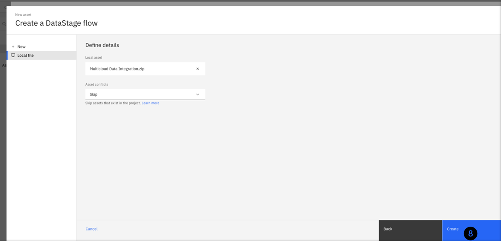

   After this import process completes, you will see three **Data Fabric Trial** connections, and a single **Multicloud Data Integration** Parallel Job.

   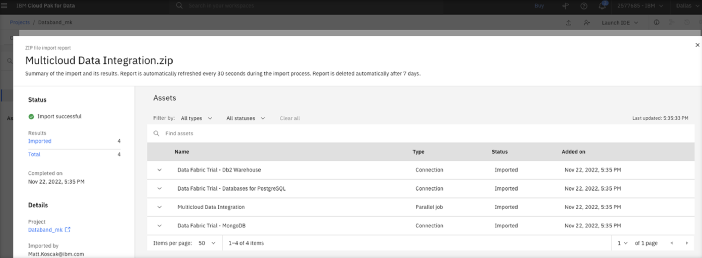

## Sync DataStage with Databand

1. Close the import screen by clicking the x in the top right corner. Open the DataStage flow titled **Multicloud Data Integration** by clicking on it.

   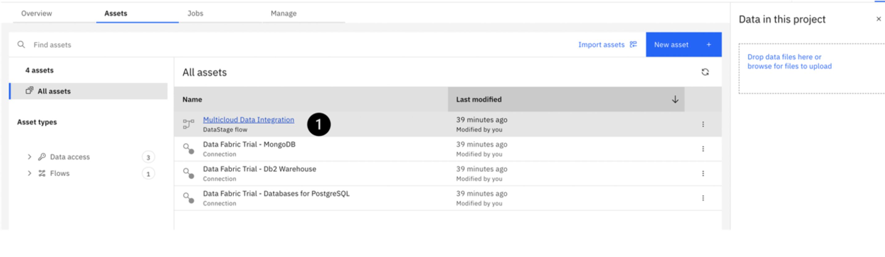
   Your DataStage flow should look like the one in Figure A (shown below).

   
   At this point, your DataStage environment is ready to be integrated with Databand. Open a new web browser tab and go to your [IBM cloud console](https://cloud.ibm.com/).

1. After logging in to IBM Cloud, make sure you are in your own account by verifying your account is selected at the top.

   

1. Create an API key for your cloud account by clicking the **Manage** dropdown on the top menu bar and selecting **Access (IAM)**. This API key will be used later to sync your DataStage job with Databand.

   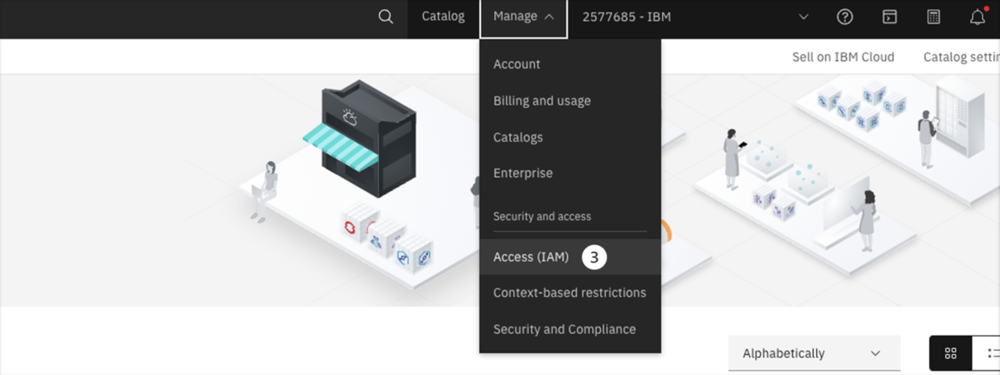

1. On the IAM screen, select the **API keys** tab on the left-hand menu.

1. Click the blue Create button.

   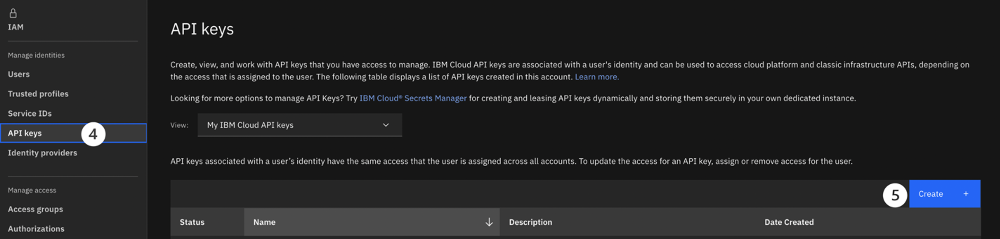

1. Name your API key **Databand\_\<YOUR_INITIALS\>**, optionally add a description, and click the blue **Create** button.

   
   Your API Key will be generated. Save this key in a safe place, as you will need it to create your DataStage Syncer in Databand.

   **IMPORTANT** – You will not be able to see the API key again. If you exited the screen before saving this key, or forget it, simply delete the key you created and make a new one by repeating Steps 4-6 above.

   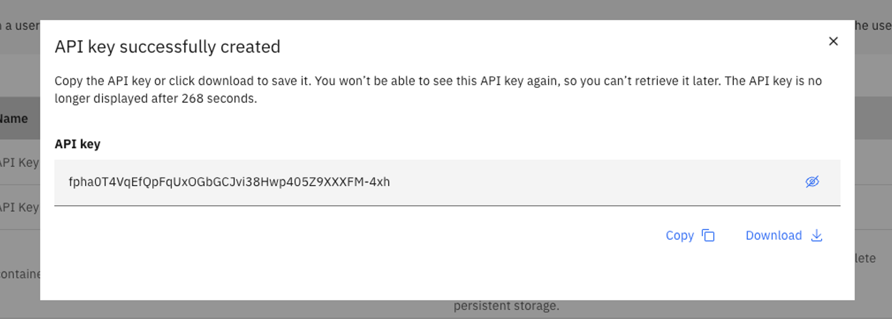

## Getting Started with Databand

1. Open a new browser with the [Databand environment](https://ibm-bp-demo.databand.ai/app/dashboard). Log in using the credentials you were given after signup.

   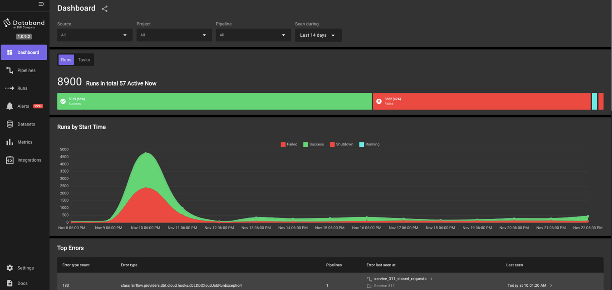

   We will now create our DataStage Syncer within Databand. A syncer will "sync” or integrate your DataStage environment with your Databand environment.

1. Select the **Integrations** tab on the left-hand menu.

1. Click the purple **Add Integration** button in the top right corner.

   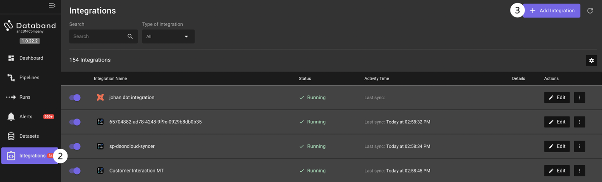

1. Select the **DataStage** tile under integration type

   

1. Select **Cloud user** and click **Confirm**.

   

1. Create a unique syncer name (for example, **\<YOUR_INITIALS\>\_datastage_syncer**) and paste the API key that you saved into the **API key** field. Then click **Next**

   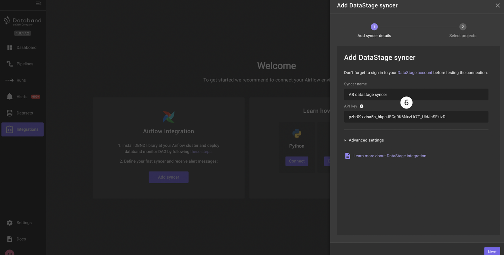

1. Select the **\<Databand_yourinitials\>** project that you created at the beginning of this lab. Then click **Save**.

   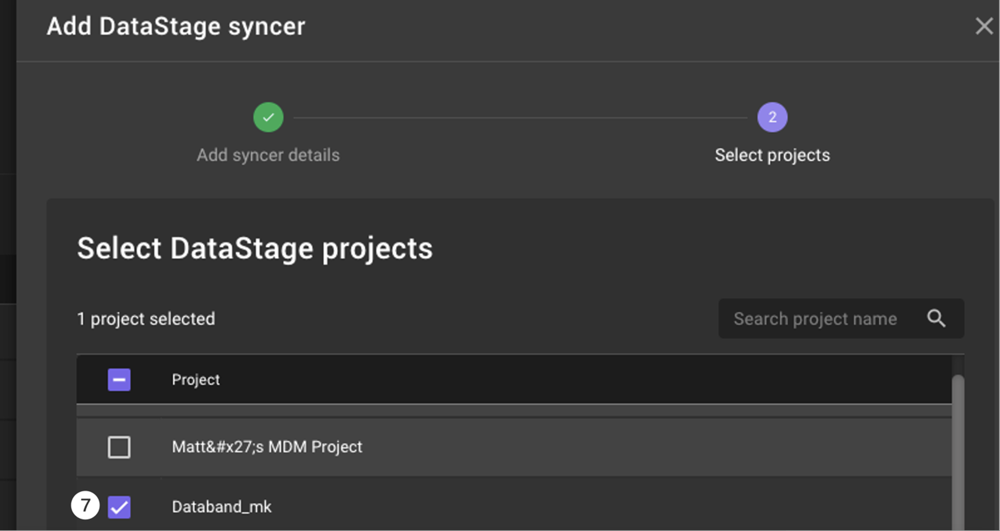

Before continuing, it’s important to rename the source for the DataStage project. By default, the source name is the name of the account that owns that DataStage project. This is not very helpful since most people don’t know their account ID off the top of their head.

1. Find your DataStage syncer. Select the **Integrations** tab in the left-hand menu
1. Start typing the beginning of your unique syncer name in the **Search** bar.
1. Click **Edit** under the **Actions** column on the right side of your DataStage syncer.

   
   This will open the edit pane for your DataStage integration.

1. Click **Next** to view your available projects.

   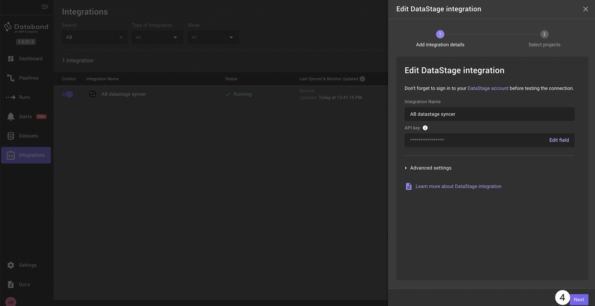

1. If your Databand project is not already selected, select the **checkbox** to the left of the Databand project source you want to edit.
1. Click the **pencil** icon to the right of your Databand project to rename it.

   

1. Change the **source** name to something unique that will help you identify the source later (for example, Alyssa B’s Account).
1. Click **Save**.

   

We have successfully synced our Cloud Pak for Data as a Service project with the Multicloud Data Integration flow, with Databand, and changed the project source name to a unique identifier.

Continue on to the [next lab](/databand/102) to start using Databand to observe the DataStage flow.
