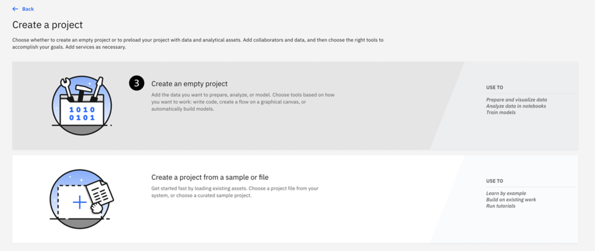
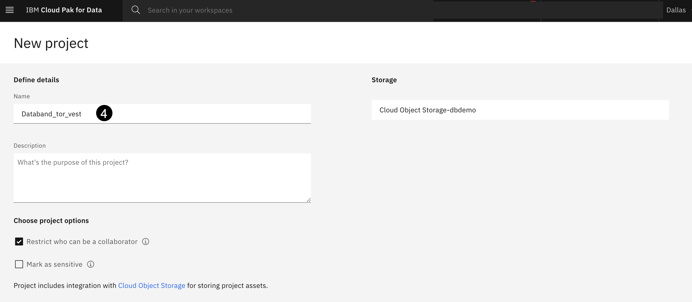
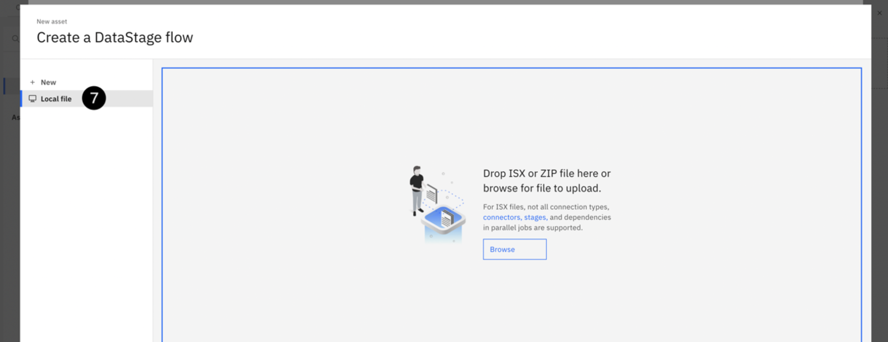
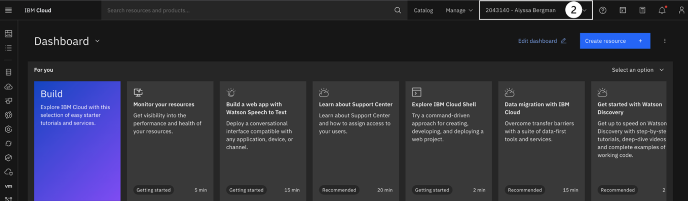
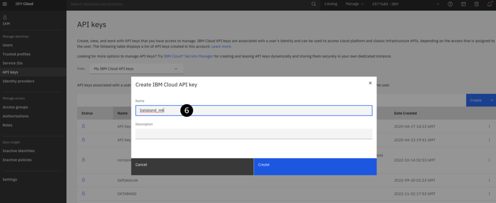
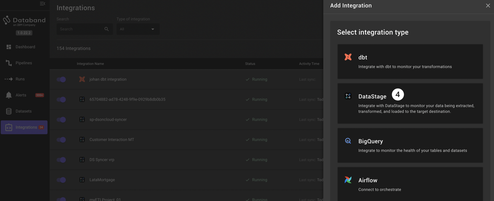
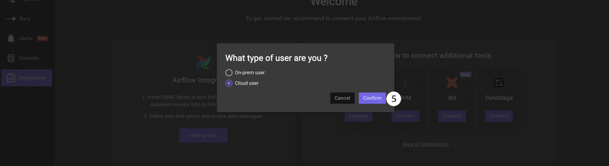
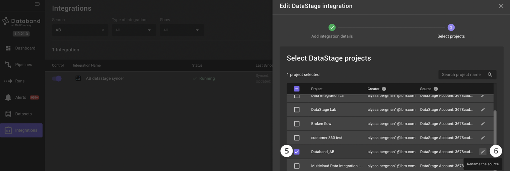
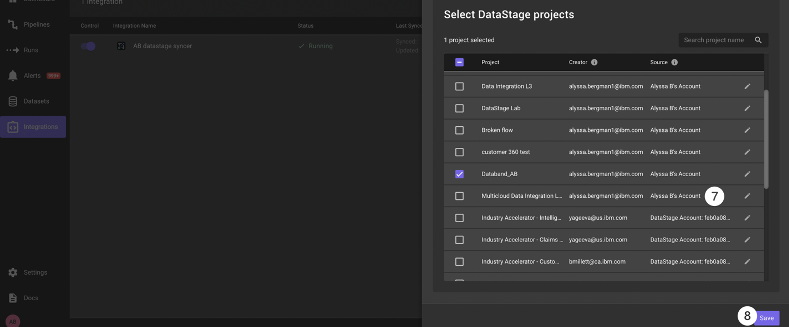

# 102: Configuración del flujo de DataStage y configuración de Databand

## Configuración inicial

### Regístrese en el entorno de demostración de Business Partner Databand

**Nota: Si se ha registrado anteriormente en el entorno de demostración de Business Partner Databand, no es necesario que repita este paso.** Abra una sesión en su navegador web preferido en [https://ibm-bp-demo.databand.ai/](https://ibm-bp-demo.databand.ai/) y haga clic en **Inscripción**. Rellene el formulario y haga clic en **Inscribirse**. Facilite la dirección de correo electrónico que utilizó para inscribirse en el Slack del taller para que el equipo del taller pueda activar su inscripción.

### Cree una instancia de servicio de almacenamiento de objetos en su cuenta de IBM Cloud

Siga las [instrucciones de creación de servicios](https://cloud.ibm.com/docs/cloud-object-storage?topic=cloud-object-storage-provision#provision-instance) para configurar una instancia de plan `lite` de IBM Cloud Object storage. Si recibe un mensaje que indica que la instancia de plan `lite` ya existe en la cuenta, no es necesario que añada otra.

### Registre el acceso a Cloud Pak for Data as-a-service en la región de Dallas

Si no se ha registrado previamente para obtener una cuenta de IBM Cloud Pak for Data as a Service en la región **de Dallas**, [haga clic en este enlace](https://dataplatform.cloud.ibm.com/registration/stepone?context=cpdaas&apps=all) para registrarse para obtener una en la región de **Dallas**.

Tras aceptar los términos, utilice el botón **Iniciar sesión con su IBMid** para completar el registro.

### Descargar el archivo fuente del flujo DataStage

Descargue este [archivo zip](https://ibm.seismic.com/Link/Content/DCPVPTFPjbR3B8THb9T8289XBM7j) y guárdelo para utilizarlo en la Sección 1, donde creará un nuevo flujo DataStage.

## Configurar el flujo/trabajo de integración de datos

 **Figura A - Flujo de integración de datos de este laboratorio**

_Este flujo de Next-Gen DataStage integra datos de un almacén Db2 en la nube, una base de datos Postgres y una instancia MongoDB. Estos datos se transforman mediante la unión de tablas, el filtrado de los registros por Estado, el cálculo de un nivel de deuda y, en última instancia, la asignación a cada solicitante individual de una tasa hipotecaria adecuada._

Para empezar, realice los siguientes pasos:

1. Si aún no lo ha hecho, inicie sesión [en IBM Cloud](https://dataplatform.cloud.ibm.com/) Pak for Data. Utilizará su cuenta personal de Cloud Pak for Data as a Service en la región de Dallas para realizar este laboratorio.

    

2. En la pantalla de inicio de Cloud Pak for Data, haz clic en **Trabajar con datos** para crear un nuevo proyecto.

    

3. Haga clic en la ficha **Crear y vaciar proyecto**.

    

4. Nombra el proyecto **Databand\_\<TU_INICIALES>\_vest** como en el ejemplo. Mantenga la configuración como está (opcionalmente puede añadir una descripción), y seleccione una instancia de almacenamiento de objetos a utilizar para el proyecto. A continuación, haga clic en **Crear**.

     **Importante:** Si no aprovisionó una instancia de almacenamiento de objetos en la nube en los requisitos previos, habrá un enlace en esta página para añadir una que le llevará a la página del catálogo. Cree una instancia utilizando el plan `lite` y, a continuación, actualice la página de configuración del proyecto.

5. Una vez creado este proyecto, seleccione la pestaña **Activos** en la pantalla de resumen del proyecto y haga clic en el icono azul **Nuevo activo**.

    

6. Desplácese hasta la sección **Constructores gráficos** y haga clic en el mosaico **DataStage**.

    

7. Seleccione la pestaña **Archivo local** en el menú de la izquierda. Arrastre y suelte o haga clic en **Examinar** y cargue el archivo **"Multicloud Data Integration.zip"** que descargó como requisito previo para este laboratorio.

    

8. Deje todos los ajustes como están y pulse el botón azul **Crear**. Espera unos instantes a que se complete el proceso de importación.

    

    Una vez finalizado este proceso de importación, verá tres conexiones de **prueba de Data Fabric** y un único trabajo paralelo de **integración de datos multicloud**.

    

## Sincronizar DataStage con Databand

1. Cierre la pantalla de importación haciendo clic en la x de la esquina superior derecha. Abra el flujo DataStage titulado **Integración de datos Multicloud** haciendo clic en él.

     Su flujo DataStage debería parecerse al de la Figura A (que se muestra a continuación).

     En este punto, su entorno DataStage está listo para integrarse con Databand. Abra una nueva pestaña del navegador web y vaya a su [consola en la nube de IBM](https://cloud.ibm.com/).

2. Después de iniciar sesión en IBM Cloud, asegúrese de que está en su propia cuenta verificando que su cuenta está seleccionada en la parte superior.

    

3. Cree una clave API para su cuenta en la nube haciendo clic en el menú desplegable **Gestionar** de la barra de menú superior y seleccionando **Acceso (IAM)**. Esta clave API se utilizará más tarde para sincronizar su trabajo DataStage con Databand.

    

4. En la pantalla IAM, seleccione la pestaña **Claves API** en el menú de la izquierda.

5. Haga clic en el botón azul Crear.

    

6. Nombre su clave API **Databand\_\<YOUR_INITIALS>**, añada opcionalmente una descripción y haga clic en el botón azul **Crear**.

     Se generará su clave API. Guarde esta clave en un lugar seguro, ya que la necesitará para crear su DataStage Syncer en Databand.

    **IMPORTANTE** - No podrá volver a ver la clave API. Si saliste de la pantalla antes de guardar esta clave, o la olvidaste, simplemente borra la clave que creaste y haz una nueva repitiendo los Pasos 4-6 anteriores.

    

## Primeros pasos con Databand

1. Abra un nuevo navegador con el [entorno Databand](https://ibm-bp-demo.databand.ai/app/dashboard). Inicie sesión con las credenciales que se le proporcionaron al registrarse.

    

    Ahora crearemos nuestro DataStage Syncer dentro de Databand. Un sincronizador "sincronizará" o integrará su entorno DataStage con su entorno Databand.

2. Seleccione la pestaña **Integraciones** en el menú de la izquierda.

3. Haga clic en el botón morado **Añadir integración** de la esquina superior derecha.

    

4. Seleccione el mosaico **DataStage** en tipo de integración

    

5. Seleccione **Usuario de la nube** y haga clic en **Confirmar**.

    

6. Cree un nombre de sincronizador único (por ejemplo, **\<YOUR_INITIALS>\_datastage_syncer**) y pegue la clave API que guardó en el campo **Clave API**. A continuación, haz clic en **Siguiente**

    

7. Seleccione el proyecto **\<Databand_yourinitials>** que creó al principio de este laboratorio. A continuación, haz clic en **Guardar**.

    

Antes de continuar, es importante cambiar el nombre de la fuente del proyecto DataStage. Por defecto, el nombre de la fuente es el nombre de la cuenta que posee ese proyecto DataStage. Esto no es muy útil ya que la mayoría de la gente no conoce el ID de su cuenta de memoria.

1. Busque su sincronizador DataStage. Seleccione la pestaña **Integraciones** en el menú de la izquierda

2. Empieza a escribir el principio de tu nombre único de sincronizador en la barra de **búsqueda**.

3. Haga clic en **Editar** bajo la columna **Acciones** en la parte derecha de su sincronizador DataStage.

     Esto abrirá el panel de edición para su integración DataStage.

4. Haga clic en **Siguiente** para ver los proyectos disponibles.

    

5. Si su proyecto Databand aún no está seleccionado, seleccione la **casilla** situada a la izquierda de la fuente del proyecto Databand que desea editar.

6. Haga clic en el icono **del lápiz** situado a la derecha de su proyecto Databand para cambiarle el nombre.

    

7. Cambia el nombre de **la** fuente por algo único que te ayude a identificarla más adelante (por ejemplo, Cuenta de Alyssa B).

8. Haga clic en **Guardar**.

    

Hemos sincronizado correctamente nuestro proyecto Cloud Pak for Data as a Service con el flujo Multicloud Data Integration, con Databand, y hemos cambiado el nombre de origen del proyecto por un identificador único.

Continúe en el [siguiente laboratorio](/databand/102) para empezar a utilizar Databand para observar el flujo de DataStage.
