# 103:  Observing jobs, Configuring Alerts and External Notifications

## Observing a job in Databand

1. Return to the browser tab with CP4DaaS. Open the Multicloud Data Integration flow (if not there), and click the **Run** button at the top.

   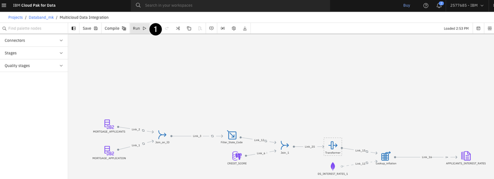
   The job may take a few minutes to run. Upon completion, you will see a green **Run successful with warnings** banner at the top. Once you see this, switch back to the Databand tab.

1. On the left-hand menu, select the **Pipelines** tab. You can identify your specific DataStage job / ETL (extract, transform, load) pipeline by looking at the **Project** column on this page, which displays the project name of your DataStage environment.

1. Click on the **Name** column of your specific project (for example, **Databand_mk**)

   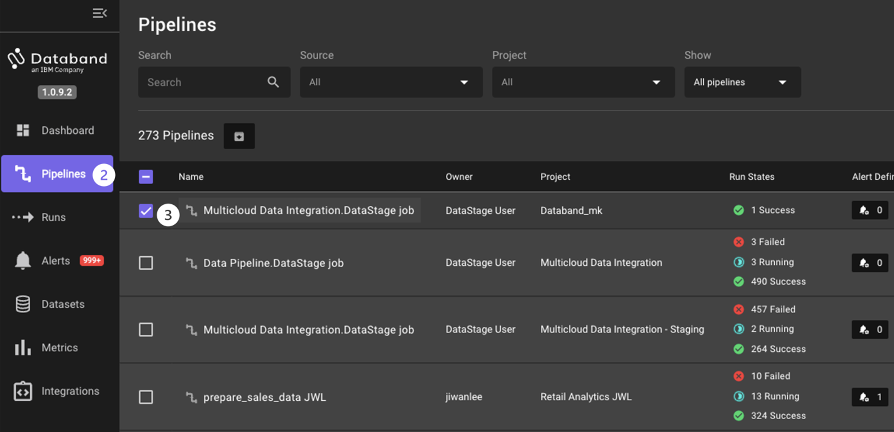
   **QUICK TIP:** You can quickly search for your specific DataStage job by clicking the **Project** dropdown and typing in your CP4DaaS project name in the search bar.  See the screenshot below for an example of this search function.

   

1. The new screen that pops up will be the Run list of each of the ETL pipeline (DataStage job) runs. This page displays the sequential list of runs for the DataStage job, the status of those runs, start and end time, alerts, errors, the number of successful/failed tasks, and the duration of those tasks.

   You only ran this DataStage job once, so only one run will show. However, as you continue to run jobs throughout this lab, you will see this page fill up with each sequential run.

1. On this same screen, click on the **Run name** for this specific job run.

   

1. Resize the window pane showing the pipeline so you can see the entire flow by dragging the arrow pointing left to the left-hand side of the screen.

   
   The screen will look like the screenshot below. You may have to drag and zoom the screen to center the job.

   
   **NOTE:** For large, complex jobs you can use a navigator window in the bottom right to scroll over the job. This is the **Toggle Minimap** icon on the right.

   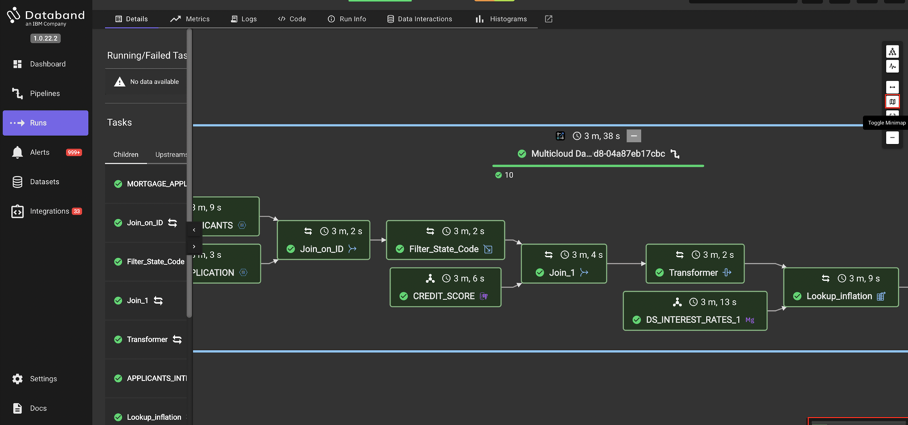

   Databand shows a graphical representation of the DataStage job. Note that each stage is green, which means it ran successfully. Each individual stage contains the name of that stage, and a timestamp of how long it took each stage to run. Additionally, the top of this view shows the total time it took this job to run.

   **NOTE:** These stages can run in parallel, and thus, the sum total of the time of each individual stage shown is likely much larger than the total time to run the job.

1. Next, click on the **MORTGAGE_APPLICANTS** stage.

1. Select the **Logs** tab on the top menu. Resize the view like you did earlier to see more of the log for the selected stage.

   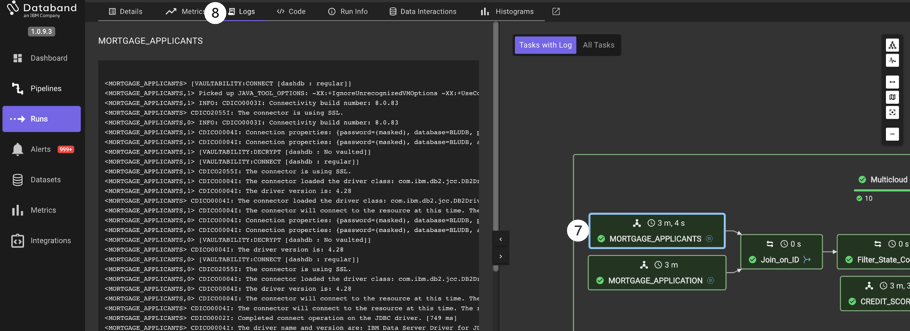

   This view will show us the logs associated with that specific stage. Feel free to click on other stages to view those logs as well.

   At this point, you have looked through some of the “step-through” functionality that Databand brings to observing our DataStage jobs. Switch back to the browser tab hosting your DataStage environment and run the job **4 more times** to generate more metrics and set some baselines for our Databand environment. This will make sense as we continue our lab and will simulate what a customer environment would look like where a job would run many times.

## Testing job alerts in Databand

1. After running the Multicloud Data Integration job four more times (you’ve now run this job a total of five times), go back to your Databand environment. Select the **Pipelines** tab on the left-hand menu, find your pipeline, drill into it, and take note of the **Run list** tab on the top menu.

   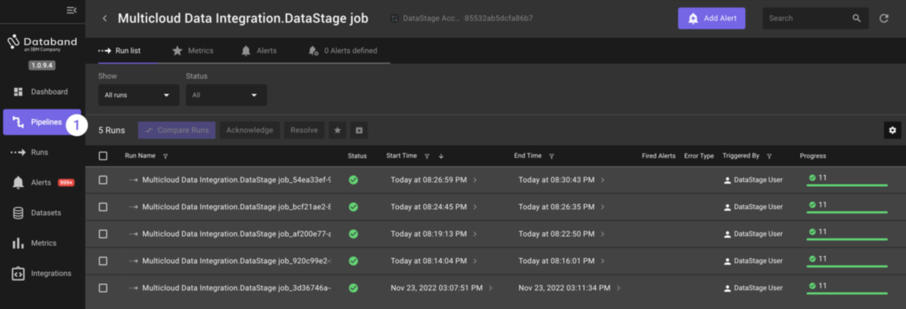

1. Select the **Metrics** tab on the top menu. The default metric shown is the **Duration** of each run.

   
   **NOTE:** You can also observe other metrics of the DataStage job; for example, rows being written to and read from each stage. This is outside the scope of this lab.

1. Now it’s time to create your first alert. Click the purple **Add Alert** button in the top right corner of your screen.

   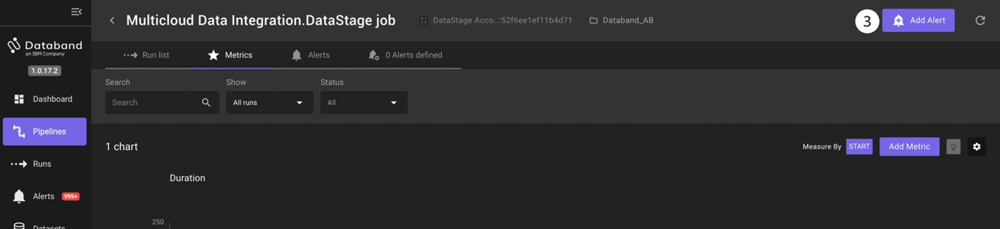
   The first step in creating a Databand alert is to create the “Alert definition”. This is the logic behind your alert. Look at all the alert possibilities you can create within Databand. You can create an alert based on run metrics for your DataStage job such as successful or failure, run duration, specific task durations, missing data operations, and schema changes.

1. Since these jobs take around 2 or 3 minutes to run, you will create an alert if your job takes greater than 4 minutes. To create this alert, click the **Set up** button in the **Pipeline duration** tile.

   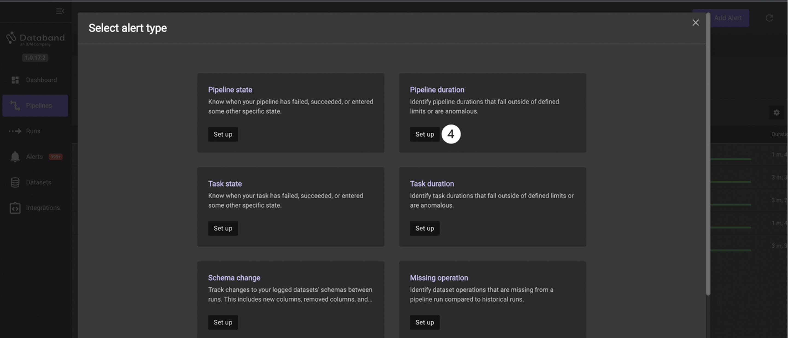

1. Click on the **Operator** dropdown and select the **greater than** option. Note the other operators listed here, including **Percentage deviation** and **Anomaly**.

1. Enter **240** in the **Duration** box, which accepts seconds as input, to designate the time of 4 minutes.

   

1. Scroll down to the **Additional settings** section and click on the **Low** box listed under the **Alert severity** section. This will alert the assigned individual group on how important this specific alert is. Since this alert will fire if a job is running slightly slower than normal, mark it as low severity.

1. Give this alert a name titled **Slow running job \<YOUR_INITIALS\>** (for example, Slow running job AB).

1. Make sure the logic of your alert definition matches the screenshots above, then click **Save alert**.

   

1. The next screen allows you to assign this alert to a receiver, which is a user or group of users that will be notified of this alert through Slack, email, or PagerDuty (this part is covered in the next portion of the lab.) For now, keep the alert within Databand. Click the **Done** button.

   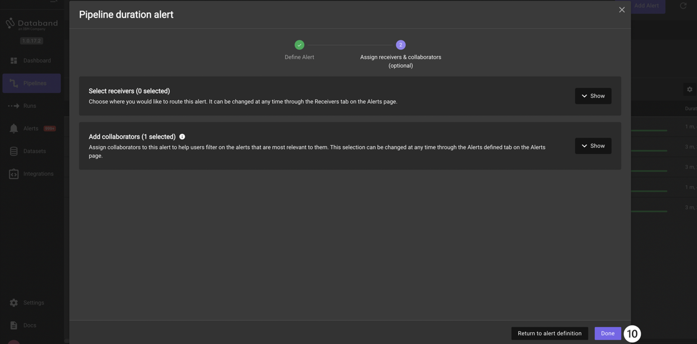

Take note of how helpful such alerting can be for monitoring the success, failure, and overall performance of our DataStage jobs.

## Alerting based on data interactions

For the final portion of this lab, you will view the data interactions of your job and create an alert based on those interactions. This is one of the key value-adds of integrating Databand with your DataStage environment, as you can now alert users in near-real-time on many custom failures, job changes, delays, and much more.

1. If you are not already at the Run list page, return to the Run list tab by selecting Run list in the top menu bar.

1. Click into the top (first) Run Name.

   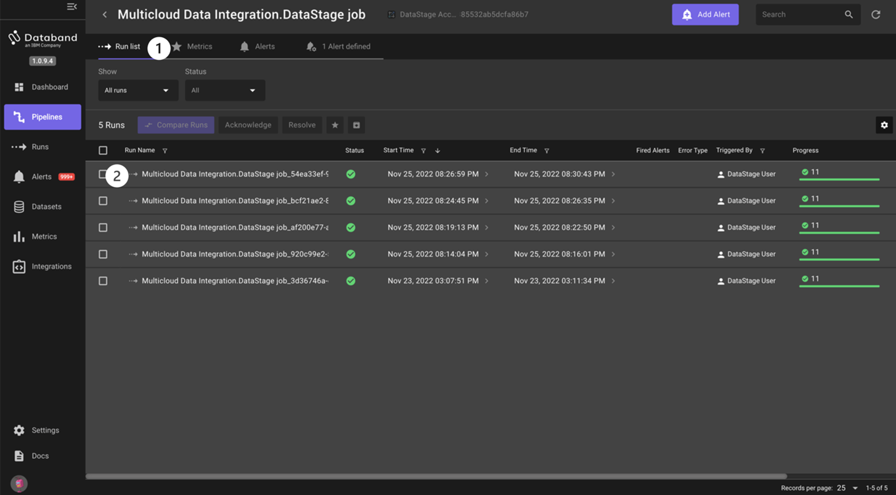

1. Select the **Data Interactions** tab in the top menu. Use the resizer to focus on the left-hand side of the screen.

   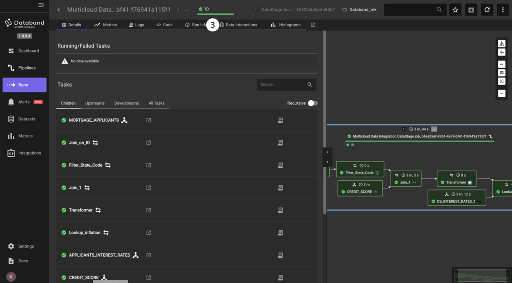
   You can see the inputs and outputs (reads/writes) of the records and columns in each respective stage. You can see the source type, associated datasets, any issues that may have come up, information on the schema and records, and the associated stage. The total of these records is represented in the chart at the top of the screen. The chart at the top titled **Runs record history (all tasks)** as well as the column titled **History Trend** gives the user a view of the job’s historical performance.

   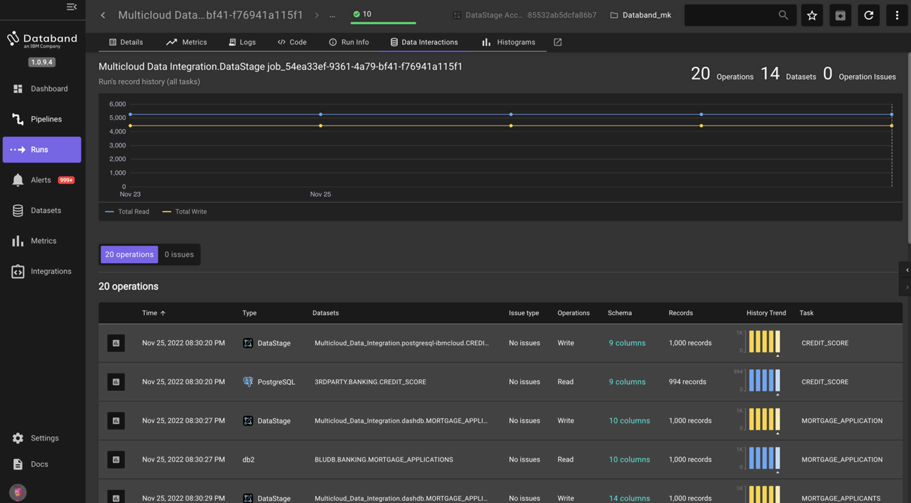
   **NOTE:** You can also use the **Data Interactions** tab for each individual stage, such as in the screenshot below. By clicking on the specific transformation, you can see information such as the schema, the row count, and the historical trend of that row count.

   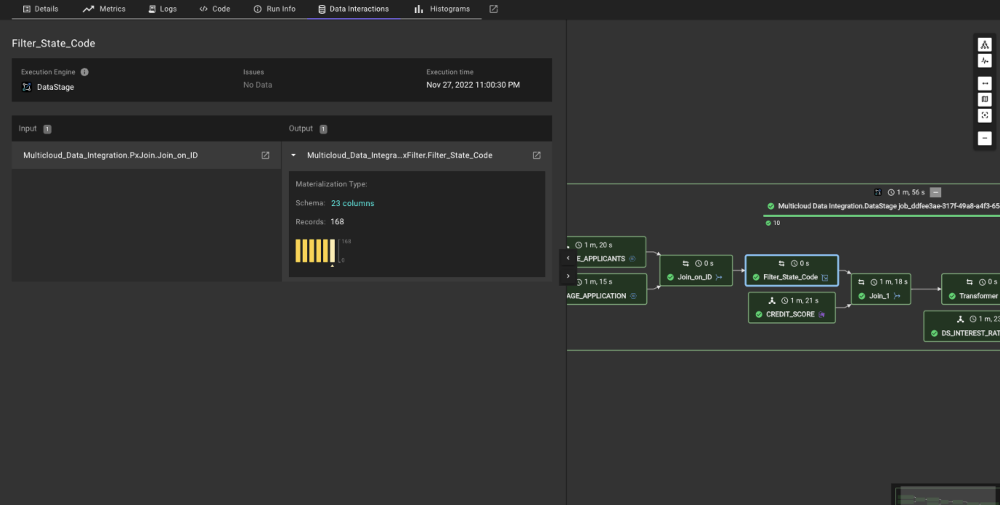

1. You will now create an alert around a schema change. Select the **Alerts** tab on the left-hand menu. This is where all Databand alerts are shown. Take a moment to look around this page to understand what information is shown to the user.

1. Click the purple **Add Alert** button in the top right corner. Here you can see (again) that you can create an alert on one pipeline (DataStage job), multiple pipelines, data quality and more.

   

1. You are going to create an alert to monitor for a schema change and set the receiver to be Slack. Click **Set up** in the **Schema change** tile.

   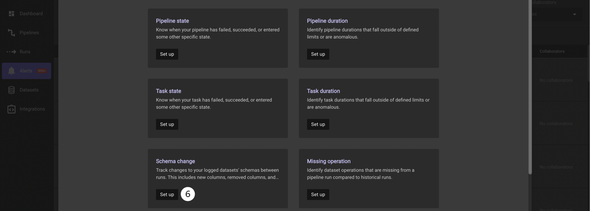

1. First, you have to specify your pipeline from the project and create your alert definition. Select the **Project** asset type. Click on the **Project** dropdown, type in the project name you created or part of the name, and select the name of your project with the DataStage Flow

   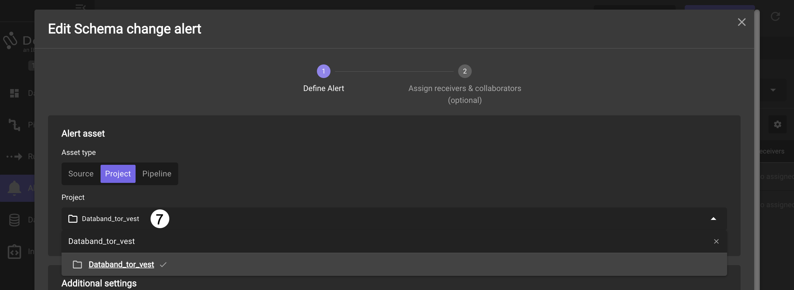

1. After selecting your project, select **High** as the severity in the **Alert severity** section.

1. Click **Save alert**.

   

   For this alert, you will set the receiver of the alert to be Slack.

1. On the next page, expand the **Recievers** list by clicking on **Show**

1. In the search list type **vest** to filter for the pre-configured workshop Slack receivers. Select the receiver with the name matching the day and month of the workshop

1. Click on **Done**.

   

## Detecting DataStage Schema Changes

Now, switch back to your Cloud Pak for Data DataStage environment where you will purposefully introduce a schema change. This schema change will trigger your schema alert we just created in Databand.

1. Double click on the Transformer stage to open its settings.

   

1. Select the **Output** tab.

1. Click the **Add column** button on the right.

1. Name your new column **RELIABILITY_SCORE**. It will add the new column to the end of the **Column name** field.

1. Next, click the **pencil** icon in the **Derivation** column, then click the **Calculator** icon to edit the expression. In this field, use the sum of the **YRS_AT_CURRENT_ADDRESS** column and the **YRS_WITH_CURRENT_EMPLOYER** column.

   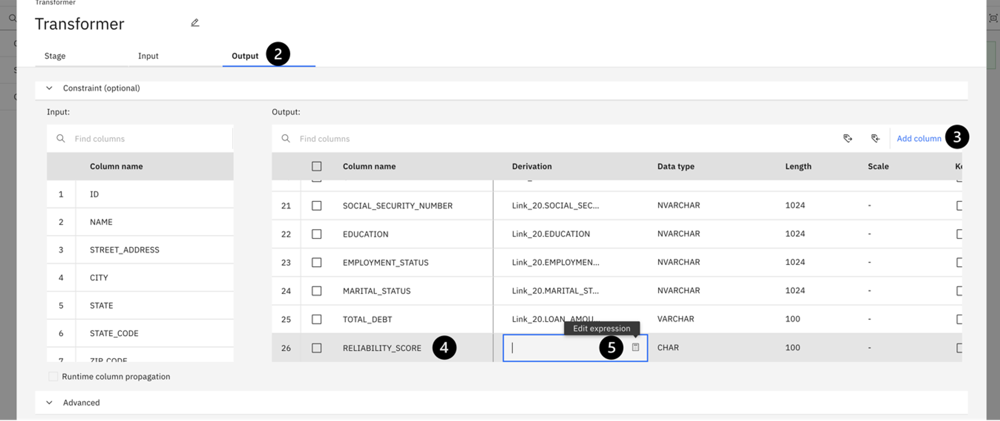

1. To create this expression, locate the two columns under the **Input columns** twistee. Double click **YRS_AT_CURRENT_ADDRESS**, insert a plus symbol (+) and then double click **YRS_WITH_CURRENT_EMPLOYER**. Notice how the expression is populated to the **Expression Builder** window on the right. Your expression should look like the screenshot.

1. Click **Apply and return** and then **Save and return** to save the changes you just made.

   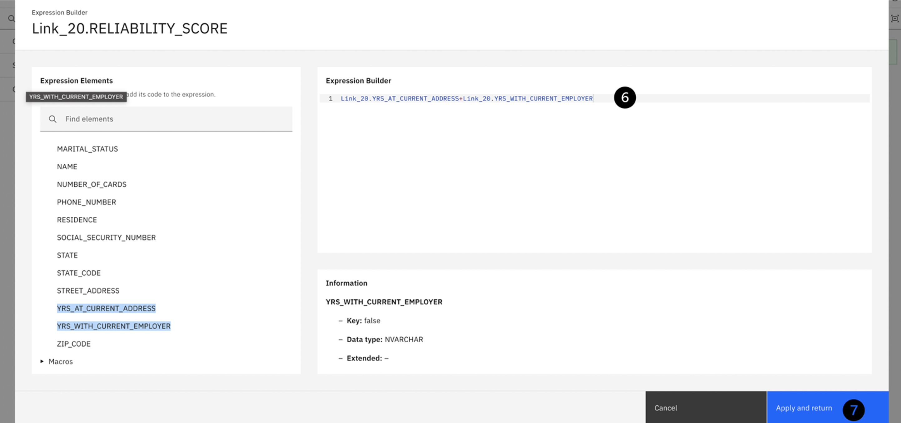

   Run the job (click the run icon at the top) and wait for a few minutes until the job completes and the alert is triggered. When the alert is triggered, you will see a message in the **#databand-alerts** Slack channel in the workshop namespace similar to the screenshot below.

1. Click on the **Schema changes in pipeline 'Multicloud Data Integration.DataStage.job'** link in the Slack message. This alert description follows the High severity **orange circle** icon. This opens the following screen:

   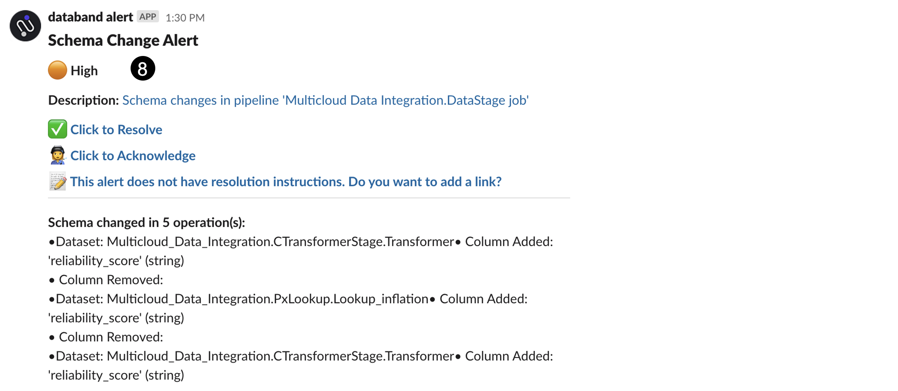

Clicking on the link take you to Databand, where you can see the impact analysis of this alert. Specifically, you can see what schema changes happened in the Datastage job, what datasets were affected, and the pipelines (DataStage Jobs) that were affected. You can also see all this information graphically in the **Lineage** tab.

   

This alert was generated in near-real time as the pipeline was run. This is another important benefit of using Databand for observability. Being able to identify issues as the pipeline runs helps improve data quality quicker, instead of retroactive inspections and potentially missing issues for days, weeks, and even months.

## Summary

Congratulations on completing this lab! You gained hands-on experience in the following integration areas:

* Syncing DataStage/CP4DaaS to Databand
* Observing the graphical representation of the DataStage job within Databand and the relevant information around this
* Viewing dataset metrics and historical trends
* Editing DataStage job inputs and outputs
* Creating and setting up alerts for DataStage jobs in Databand

This concludes the DataStage and Databand Hands on Lab. Please reach out to the VEST team or your IBM Partner contact with any questions, comments, concerns, or customer situations you run into.
