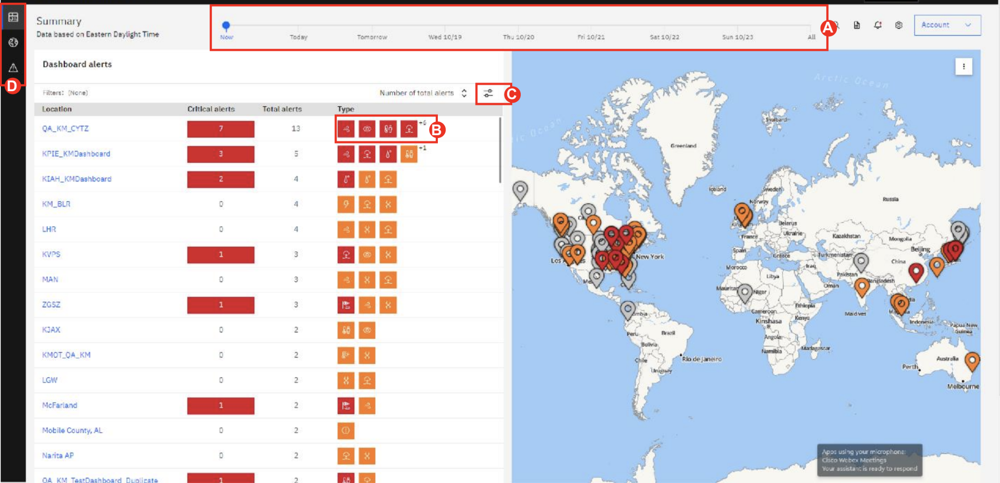
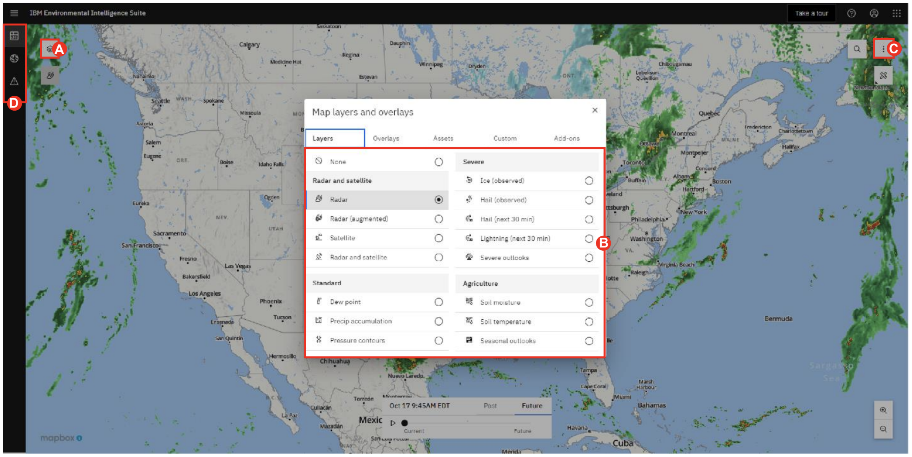

# 101: Introduction to Envizi Sustainability Performance Manager

<QuizAlert text='Heads Up! Quiz material will be flagged like this!' />

## Log into the IBM EIS platform

To complete this step, you will use your login credentials from requesting access.

1. Log in to Environmental Intelligence Suite at the following URL: https://environmentalintelligencesuite.ibm.com.
2. Enter your **Username:** _userid_ and Click the “Continue” button.
3. nter your **Password:** _password_ and Click the “Login” button.
   

## EIS Summary Page (Aviation Operations Add-on)

The IBM Aviation Operations Dashboard uses the power of artificial intelligence (AI) to respond to environmental conditions and build a more resilient operation. Plan for and respond to critical weather events with advanced analytics while ensuring business continuity. Streamlined to monitor the weather parameters the aviation industry cares about the most, clients can tailor current and forecasted weather perils to their specified operating limits, ensuring key stakeholders and management are kept informed of potential impacts.

The Aviation Operations Dashboard is an Add-on component to the Environmental Intelligence Suite (EIS). The solution is available via one’s desktop and mobile device, thus providing aviation operators whose assets and personnel are impacted by disruptive weather a way to proactively mitigate the associated risk and ensure that operations resume as soon as the threat is gone. 

After login, You will be redirected to summary page. 
 - It enables you to view your laocations in one planned view, assisting in identifying where threats are currently active and where future disruptions are expected.
 - With the summary time slider at the top of the page, a user can go 7 days into the future to see what potential weather hazards are forecasted.
 - The cursor will be colored if a high or critical alert is in effect. Orange corresponds to high and red corresponds to critical.
 - A documentation center is also available to upload any pertaining documents that may be important for operational support and necessary for personal to view.

   

# Actions:

1. **Move** the timeline on the top to see the alerts valid for that date **(A)**.

2. **Hover** over the hazard symbol to determine what hazard is in effect or will be in effect in the future **(B)**.

3. Use the filter above hazard types to sort hazards **(C)**.

## Risk Outlook View

1. To move to **Risk Overlook View**, **hover** and **view** the sub-menus under “Dashboard Visualization” (left bar menu below IBM Environmental Intelligent Suite) **(D)**. **Click** on  the “Risk Outlook” (sub-menu under “Dashboard Visualizations”)

- You will have access to the risk outlook where pre-prescribed impact keys allow operational teams to take a quick glance 7 days out and see where irregular operations may become likely.
- The types of impact keys are shown on the bottom with the values for each impact key. Moderateand high risks are below each of the types. For example, wind gusts have a moderate-risk value greater than or equal to 20 knots and a high-risk value greater than or equal to 30 knots. When these values are met, an icon will appear within the airport identifier.
- Each airport identifier shows potential risks throughout the 7-day forecast. Users are provided with forecast concerns; this allows airlines and aviation operators to have ample time to plan on how they would like to adjust their operations for that threat. For example, if a major winter snowstorm will be impacting the Northeast, operators can ensure de-icing equipment is operational and that they are well stocked with anti-freeze. Airlines on the other hand can begin to cancel flights days in advance allowing passengers time to make changes and reducing the risk of travelers being stuck in the airport.

2. Review Impact Key at the bottom of the page **(A)**.
   
3. **Hover** over the weather icons to see what weather event is forecasted or currently in effect **(B)**.

4. **Click** on the top ID (Airport identifier) on the left-hand side to see forecast discussion appear below hazard icons **(C)**.

5. Now we will look into **Individual Dashboard**, **Hover** and **view** the sub-menus under “Dashboard Visualization” (left side menu below IBM Environmental Intelligent Suite). Click
on the “Dashboard” (sub-menu under “Dashboard Visualizations”) (D).

## Individual Dashboard 

Individual dashboards are highly customizable and can cover numerous weather perils backed by Artificial Intelligence (AI). It utilizes IBM’s Global High-Resolution Atmospheric Forecasting System (IBM GRAF) modeling, which is the first large scale global weather model to run on IBM’s POWER9-based supercomputer optimized for Graphics Processing Units (GPUs), enabling it to run faster and more efficiently than older models. All dashboards are pre-set with an alerting panel which highlights any threats that are active. This panel can be expanded to view more detailed information about the active critical alerts. Panels can be created by clicking on the button in the top right-hand corner of the screen. Panels are broken down by alerting and non-alerting panels.

1. Click on the “Critical alerts” bar to expand.

2. **Drag** and **move** the panels across the screen to meet your layout preferences **(A)**.

3. **Click** on the “three-dots” (Top-right hand corner of panel screen) to **edit** or **delete** panel **(B)**.

4. We will add new pannel. navigate to “Add Panel” (Top-right hand corner of the screen) **(C)**.
   
## Panel Selection

Within the alerting panel, users can select from current conditions, forecasted conditions, and lightning to have alerts triggered on. Each panel is filled with numerous weather triggers set by the user. Aviation operators find precipitation, wind, ceilings, and visibility to be key metrics in determining impact to their operations.

The lightning panel is designed for ground operators and their safety. Users can specify which lightning type they would like to monitor. These options can be all lightning, cloud to cloud, or cloud to ground. They also can create up to three rings of varying distances centered around your operation and have the choice of level of priority. They can also add an all-clear timer which will trigger a notification when no lightning has been detected based off a count-down clock set by the user. When a lightning strike is detected within any one ring, the user will receive a notification which they can add addition alert details to if required. Lightning alerts are audible in addition to the push notification and email notifications that are standard for all other alerts. The user can also choose the map type to be displayed on the dashboard and icon to indicate a lightning strike.

Outside of the alerting panels, non-alerting panels such as Current Conditions are highly viable to the aviation industry. In the rare situation that a Meteorological Aerodrome Report(METAR) site is down, Current Conditions can populate a synthetic METAR by gathering weather data from nearby personal weather stations, satellite observations, and proprietary currents on demand modeling. 

1. **Select** the lightning alerting panel in the top row to edit **(A)**.

2. **Click** “Ok” to continue the steps and build a new panel **(B)**.

3. **Select** a “Lightning type” from the drop-down menu.

4. **Click** “Add Range +” and **Select** a distance in the “Range” drop-down.

5. **Click** the “Next” button to continue to “Notifications”.

6. **Click** the “Next” button to continue to “Map settings”.

7. **Click** the “Next” button to continue to “Review”.

8. **Click** the “Add Panel” button.

9. We will look into Interactive Map, **hover** and **view** the sub-menus under “Dashboard Visualization” (left side menu below IBM Environmental Intelligent Suite). **Click** on the “Interactive Map”(sub-menu under “Dashboard Visualizations”) **(C)**.

## Interactive Map

The interactive map is compiled with 170 various weather layers that can be overlayed onto the base map. Companies can also overlay any custom layers like severe and tropical weather, watches and warnings, and other overlays such as airport locations. Companies also have the option to import Maximo assets data to the map also. The interactive map is available for view in the dashboard itself or as a standalone via the interactive map tab.

The maps appearance can be customized based on the user preference. This can be done through the map and list setting menu. The user has an option to view range rings, view location pins,and change the look of the map from light to dark, or satellite view. 

Users can quickly search a location on the map by either by City, State, Zip Code, or coordinates by using the search button. They also have the ability to measure distance and area using the tools available.

1. **Click** the stack of papers (top left-hand corner) **(A)**.

2. Filter and display various weather layers on your base map 

3. **Click** on individual layers to turn layers on and off. Change opacity and view layer details **(B)**. 

4. **Click** on the three-dot icon on the top right of the map **(C)**.

5. **Click** to turn “Range rings” and “Location pins” on. **Click** “Base map type” drop down menu, select a map type.

6. To move to the next scene, **click** and **view** the sub-menus under “Dashboard Visualization” (left side menu below IBM Environmental Intelligent Suite). Clickon the “Dashboard” (sub-menu under “Dashboard Visualizations”) **(D)**.

## Weather Radar

Furthermore, users can view weather radar data on the map by using the radar layer to track the motion and type of precipitation. They are provided with a visual representation and can watch the weather radar from past weather to current, or current weather to future forecasts.

1. **Hover** over the radar icon located below the stack of papers (top left-hand corner) **(A)**.

2. **Click** “Past” then “Future” on the media player at the bottom of the map **(B)**.

3. **Click** the play button (Triangle button) to display radar changes through time **(C)**.

## National Weather Service Alerts

Lastly, aviation users can prescribe various National Weather Station (NWS) alerts to be triggered too. Selecting the NWS Tab one can view various warnings, watches, advisories, and statements to have enabled for any dashboard. Additionally, one can select if they want email alerts triggered when an issuance is made for a monitored dashboard.

1. Navigate to “Manage Alerts” (Top-right hand corner of the screen) **(A)**.

2. **Select** between various alerts by checking the box next to the event type **(B)**.

3. **Click** “Next” to continue to alert actions on the top of the screen when done to choose what alerts are critical and you would like email notifications on **(C)**.

4. **Click** “Save” to close the window.

### Congratulations, you've reached the end of lab 101.

Leave your browser window open, [lab 102](../102) starts from this screen.
