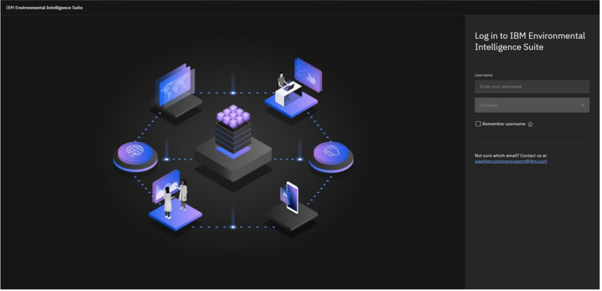
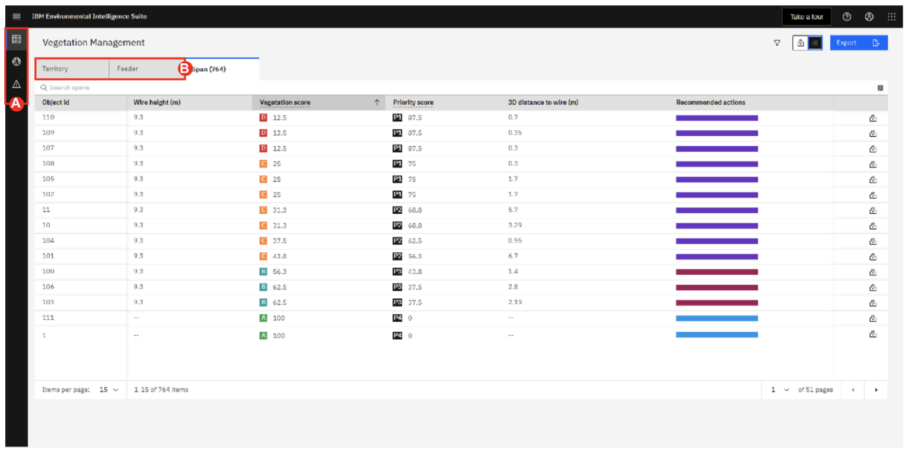
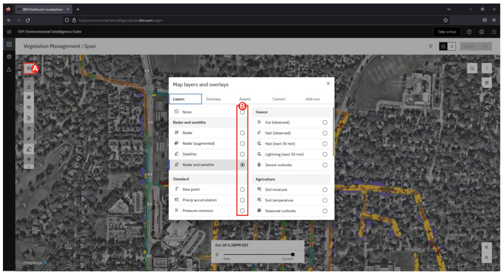
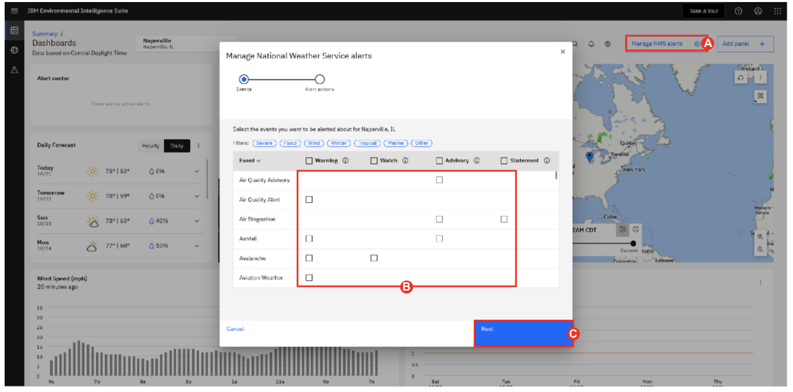

# 102: Introduction to IBM Environmental Intelligent Suite - Vegetation Management

<QuizAlert text='Heads Up! Quiz material will be flagged like this!' />

## Log into the IBM EIS platform

To complete this step, you will use your login credentials from requesting access.

1. Log in to Environmental Intelligence Suite at the following URL: https://environmentalintelligencesuite.ibm.com.
2. Enter your **Username:** _vegm@naperville.com_ and Click the “Continue” button.
3. nter your **Password:** _password_ and Click the “Login” button.

   

## Main EIS Dashboard (Vegetation Management Add-on)

Vegetation-related outages are affecting utilities’ system reliability and customer satisfaction. Traditional approaches can be both expensive and labor intensive, relying primarily on manual inspections and regular trimming cycles.

Vegetation managers can now reduce vegetation infringement with power lines at scale!

Vegetation Managers within any E&U, Gas pipeline companies, Railway Operators companies having a budget for managing the risk of vegetation close to their assets.

The IBM Vegetation Management combines AI and analytics to help address the high costs and inefficiencies associated with vegetation management. The solution allows companies to take better vegetation management decisions by combining weather, 18 satellite, and IoT data with intelligent prioritization and reporting capabilities of where the vegetation is encroaching and might put at outage risk the grid.

Vegetation Management Solution is an Add-on component to the Environmental Intelligence Suite (EIS). 

The solution leverages artificial intelligence (AI) and advance analytics to provideutilities or other companies whose assets are impacted by vegetation a way to quickly monitor and understand the current impact of the vegetation on their service territory, identify high-risk locations, and make the best planning decisions for their trimming or operations teams and their customers.

   

1. **Click** and **view** the sub-menus under "Dashboard Visualizations" (left side menu below IBM Environmental Intelligent Suite) **(A)**.

2. **Click** on the "Vegetation Management" (sub-menu under "Dashboard Visualizations").

3. Review Vegetation Score, Priority Score and the other KPIs estimated for every span analyzed (Object id) in the list view. 

4. **Click** on Feeder or Territory to see the aggregated values of the KPIs and Scores but for the higher hierarchy levels **(B)**.

## Vegetation Management Map View

There is also a map view which allows our vegetation managers to see a color-coded view of the vegetation throughout their territory. In this case, the green areas indicate spans where vegetation is less likely a thread, whereas a red area indicates more of a thread which could potentially trigger an outage. Users can apply filters to view specific parameters based on location, KPIs, or type. The type are areas that can require routine inspection, priority inspection, or areas that need work required.

1. **Click** and **view** on different color-coded spans in the map to see the differences in Scores.

2. From the sidebar, access the boundaries legend to quickly decipher the Scores and KPIs **(A)**.

3. Review the vegetation Score values/colors by hovering over the Vegetation boundaries legend from the sidebar.

## Map View: Zoom in the Score Card details for each specific span

Clicking on each individual span, allows you to see the grades, which is the vegetation Score and Criticality Score given to the individual span as well as individual key performance indicators (KPIs) calculated from the estimated vegetation and the proximity to the assets such as poles and powerlines. It can identify those high-risk circuits or corridors that will most likely receive the largest impacts from vegetation overgrowth. Users can copy the coordinates for locations of high risks to send to crews to have work completed to prevent any potential risks.

1. **Click** on any of the spans to review the information on span’s attributes and KPIs **(A)**. 
2. **Click** on “Actions” tab at the bottom of the Score Card to copy the coordinates of the specific span and be able to pass on the location of that segment to your peers or vegetation manager **(B)**.
   
## Map View: Overlay of Weather data or Custom Layers from the company

Users can sort and export data as needed, as well as combine theses insights with many other layers such as severe and tropical weather, watches and warnings and many other layers that the customer might bring into the interface.  

1. **Click** the stack of papers (top left-hand corner) **(A)**.

2. **Click** on the add-on tab to overlay any of weather layers that matter most to you. This will help you and your manager better plan the next trimming/inspection on the ground with the latest and most accurate forecasts at that location **(B)**. 

3. At any time, inspect an area by using your mouse to zoom in and out between your different boundary levels (span (smaller level), feeder, region (higher aggregated level)).

## National Weather Service Alerts

Users can choose to receive National Weather Service (NWS) alerts which includes various warnings, watches, advisories, and statements. Users can choose to receive email alerts triggered when an issuance is made. This allows utilities to prepare for major storms that could cause down vegetation that can disrupt power services.

1. **Click** the “Manage NWS Alerts” (Top-right hand corner of the screen) **(A)**.

2. **Select** between various alerts by checking the box next to the event type **(B)**. 

3. **Click** “Next” to continue to alert actions on the top of the screen when done to choose what alerts are critical and you would like email notifications on **(C)**.

4. **Click** “Save” to close the window.

This concludes the L3 lab. More EIS resources, including further demo modules can be found on the [“Manage the impact of the environment on your business” seismic page](https://ibm.seismic.com/Link/Content/DCQMFdmRcMDTqG9Q9733FW94Fc4V).

You can now [complete the quiz](https://learn.ibm.com/course/view.php?id=12079) for IBM Environmental Intelligence Suite for Sales Level 3 Quiz
