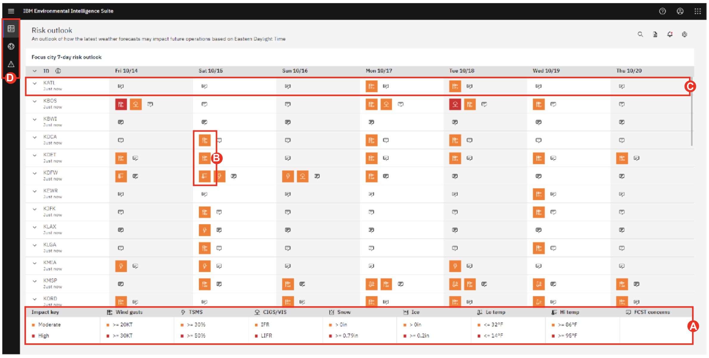
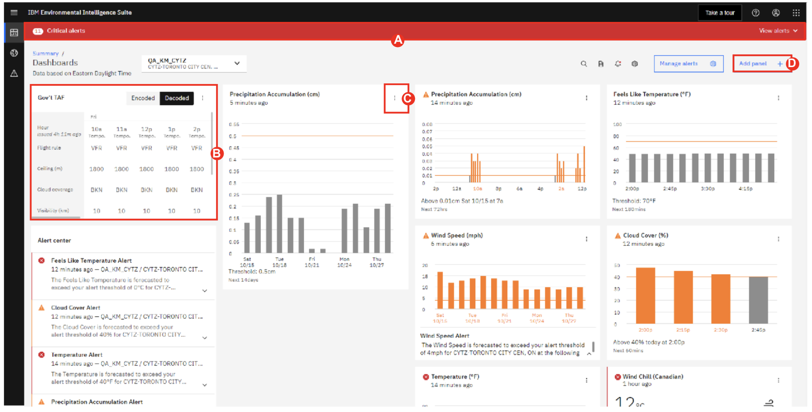
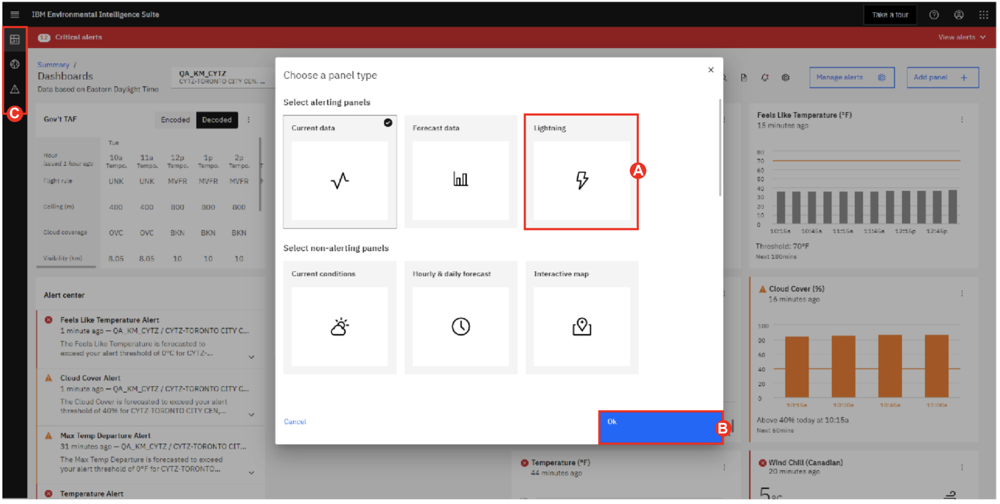
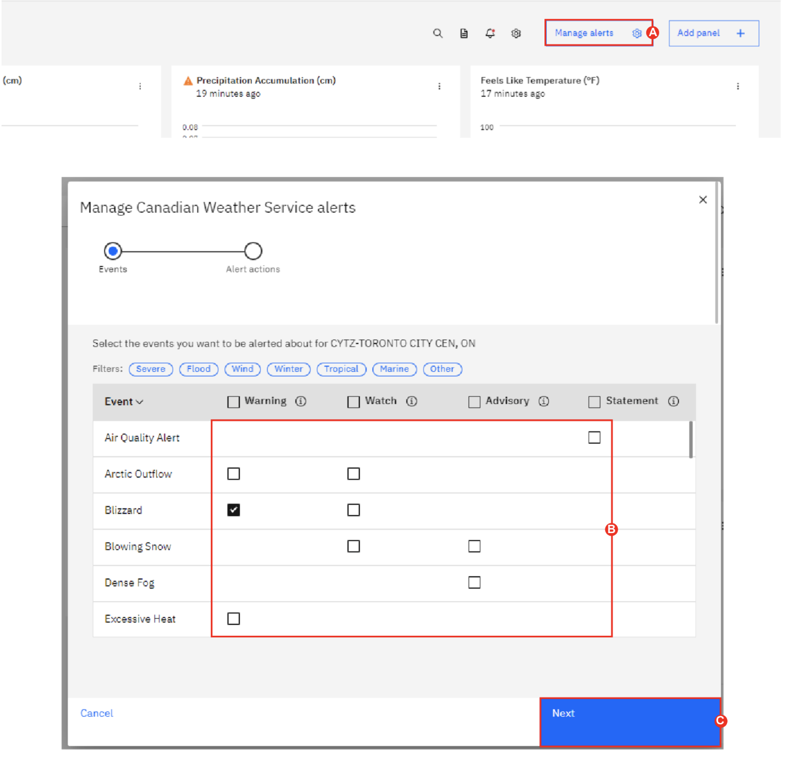

# 101: Introducción a IBM Environmental Intelligence Suite - Aviation Operations

## Inicie sesión en la plataforma IBM EIS

Para completar este paso, utilizará sus credenciales de acceso de la solicitud de acceso.

1.  Inicie sesión en Environmental Intelligence Suite en la siguiente URL: [https://environmentalintelligencesuite.ibm.com](https://environmentalintelligencesuite.ibm.com).
2.  Introduzca su **Username:** _ibm@ibmair.com_ y haga clic en el botón "Continuar".
3.  Introduzca su contraseña **Password** [En Slack] y haga clic en el botón "Login". 

## EIS Summary Page (Aviation Operations Add-on)

IBM Aviation Operations Dashboard utiliza el poder de la inteligencia artificial (IA) para responder a las condiciones ambientales y construir una operación más resiliente. Planifique y responda a fenómenos meteorológicos críticos con analítica avanzada, al tiempo que garantiza la continuidad del negocio. Racionalizado para supervisar los parámetros meteorológicos que más preocupan al sector de la aviación, los clientes pueden adaptar los peligros meteorológicos actuales y previstos a sus límites operativos especificados, garantizando que las partes interesadas clave y la dirección estén informados de los posibles impactos.

El Cuadro de mandos de operaciones de aviación es un componente complementario de Environmental Intelligence Suite (EIS). La solución está disponible a través de ordenadores de sobremesa y dispositivos móviles, proporcionando así a los operadores de aviación cuyos activos y personal se ven afectados por condiciones meteorológicas adversas una forma de mitigar proactivamente el riesgo asociado y garantizar que las operaciones se reanudan tan pronto como desaparece la amenaza.

Después de iniciar sesión, se le redirigirá a la página de resumen.

-  Le permite ver sus ubicaciones en una vista planificada, ayudándole a identificar dónde están activas actualmente las amenazas y dónde se esperan futuras interrupciones.
-  Con la barra deslizante de resumen temporal de la parte superior de la página, el usuario puede ir 7 días en el futuro para ver qué riesgos meteorológicos potenciales se prevén.
-  El cursor se coloreará si hay una alerta alta o crítica. El naranja corresponde a alta y el rojo a crítica.
-  También hay disponible un centro de documentación para cargar cualquier documento pertinente que pueda ser importante para el apoyo operativo y necesario para que el personal lo vea.

<QuizAlert text="Material del concurso: preste atención a todos los elementos de navegación"/>

1.  **Move** la línea de tiempo en la parte superior para ver las alertas válidas para esa fecha **(A)**.
2.  **Hover** por encima del símbolo de peligro para determinar qué peligro está vigente o lo estará en el futuro **(B)**.
3.  Utilice el filtro situado encima de los tipos de peligro para clasificar los peligros **(C)**.
4.  Ahora pasaremos a la **Risk Overlook View** de perspectiva de riesgos, **hover** y **view** los submenús en "Visualizaciones del cuadro de mandos" (menú de la barra de la izquierda, debajo de IBM Environmental Intelligence Suite) **(D)**. **Click** en "Risk Outlook" (submenú bajo "Dashboard Visualizations")

## Risk Outlook View

*   Tendrá acceso a la perspectiva de riesgo, donde las claves de impacto preestablecidas permiten a los equipos operativos echar un vistazo rápido a 7 días vista y ver dónde pueden ser probables las operaciones irregulares.
*   Los tipos de claves de impacto se muestran en la parte inferior con los valores de cada clave de impacto. Los riesgos moderado y alto figuran debajo de cada uno de los tipos. Por ejemplo, las ráfagas de viento tienen un valor de riesgo moderado mayor o igual a 20 nudos y un valor de riesgo alto mayor o igual a 30 nudos. Cuando se cumplan estos valores, aparecerá un icono dentro del identificador del aeropuerto.
*   Cada identificador de aeropuerto muestra los riesgos potenciales a lo largo de la previsión de 7 días. Esto permite a las compañías aéreas y a los operadores de aviación disponer de tiempo suficiente para planificar cómo desean ajustar sus operaciones ante esa amenaza. Por ejemplo, si una gran tormenta de nieve va a afectar al noreste, los operadores pueden asegurarse de que los equipos de deshielo están operativos y bien abastecidos de anticongelante. Las aerolíneas, por su parte, pueden empezar a cancelar vuelos con días de antelación, dando tiempo a los pasajeros para hacer cambios y reduciendo el riesgo de que los viajeros se queden atrapados en el aeropuerto.

<QuizAlert text="Material de prueba: atención a los umbrales de referencia"/>

1.  Revise la clave de impacto al final de la página **(A)**.
2.  **Hover** por encima de los iconos meteorológicos para ver qué fenómeno meteorológico se prevé o está actualmente en vigor **(B)**.
3.  **Click** en el ID superior (identificador del aeropuerto) en el lado izquierdo para que aparezca el debate sobre la previsión debajo de los iconos de peligro **(C)**.
4.  Ahora vamos a ver el Cuadro de mandos **Individual Dashboard**, **Hover** y **view** los submenús en "Visualizaciones del Cuadro de mandos" (menú de la izquierda debajo de IBM Environmental Intelligence Suite). Haga clic en "Dashboard" (submenú de "Dashboard Visualizations") **(D)**.

## Individual Dashboard 

Los cuadros de mando individuales son altamente personalizables y pueden cubrir numerosos riesgos meteorológicos respaldados por Inteligencia Artificial (IA). Utiliza el modelado del Sistema Global de Predicción Atmosférica de Alta Resolución de IBM (IBM GRAF), que es el primer modelo meteorológico global a gran escala que se ejecuta en el superordenador basado en POWER9 de IBM optimizado para Unidades de Procesamiento Gráfico (GPU), lo que le permite funcionar más rápida y eficientemente que los modelos más antiguos. Todos los cuadros de mando están preconfigurados con un panel de alertas que destaca las amenazas activas. Este panel puede ampliarse para ver información más detallada sobre las alertas críticas activas. Los paneles pueden crearse haciendo clic en el botón situado en la esquina superior derecha de la pantalla. Los paneles se dividen en paneles de alerta y paneles de no alerta.

1.  Haga clic en la barra "Alertas críticas" para ampliarla.
2.  **Drag** y **move** los paneles por la pantalla para adaptarlos a sus preferencias de diseño **(A)**.
3.  **Click** en los "tres puntos" (esquina superior derecha de la pantalla de paneles) para **edit** o **delete** un panel **(B)**.
4.  Vamos a añadir un nuevo panel. Navegue hasta "Añadir Panel" (esquina superior derecha de la pantalla) **(C)**.

## Panel Selection

En el panel de alertas, los usuarios pueden seleccionar entre las condiciones actuales, las condiciones previstas y los rayos para que se activen las alertas. Cada panel contiene numerosos activadores meteorológicos establecidos por el usuario. Los operadores de aviación consideran que las precipitaciones, el viento, los techos y la visibilidad son parámetros clave para determinar el impacto en sus operaciones.

El panel de rayos está diseñado para los operadores de tierra y su seguridad. Los usuarios pueden especificar qué tipo de rayos desean supervisar. Estas opciones pueden ser todos los rayos, nube a nube o nube a tierra. También pueden crear hasta tres anillos de distancias variables centrados alrededor de su operación y pueden elegir el nivel de prioridad. También pueden añadir un temporizador de "todo despejado" que activará una notificación cuando no se haya detectado ningún rayo en función de una cuenta atrás establecida por el usuario. Cuando se detecta un rayo dentro de un anillo cualquiera, el usuario recibe una notificación a la que puede añadir más detalles de alerta si es necesario. Las alertas de rayos son audibles, además de la notificación push y las notificaciones por correo electrónico que son estándar para todas las demás alertas. El usuario también puede elegir el tipo de mapa que se mostrará en el panel de control y el icono que indicará el impacto de un rayo.

Aparte de los paneles de alerta, los paneles que no son de alerta, como Current Conditions, son muy viables para el sector de la aviación. En el caso poco frecuente de que un sitio de informes meteorológicos de aeródromo (METAR) no funcione, Current Conditions puede rellenar un METAR sintético recopilando datos meteorológicos de estaciones meteorológicas personales cercanas, observaciones por satélite y modelos de corrientes bajo demanda patentados.

1.  **Select** el panel de alertas de rayos en la fila superior para editarlo **(A)**.
2.  **Click** "Aceptar" para continuar los pasos y construir un nuevo panel **(B)**.
3.  **Select** un "Tipo de rayo" en el menú desplegable.
4.  **Click** "Añadir rango +" y **Select** una distancia en el desplegable "Rango".
5.  **Click** el botón "Siguiente" para pasar a "Notificaciones".
6.  **Click** el botón "Siguiente" para pasar a "Configuración del mapa".
7.  **Click** el botón "Siguiente" para pasar a "Revisar".
8.  **Click** el botón "Añadir panel".
9.  Vamos a ver el Mapa Interactivo, **hover** y **view** los submenús en "Dashboard Visualization" (menú de la izquierda debajo de IBM Environmental Intelligence Suite). **Click** en "Mapa interactivo" (submenú de "Visualizaciones del cuadro de mando") **(C)**.

## Interactive Map

El mapa interactivo contiene 170 capas meteorológicas que pueden superponerse al mapa base. Las empresas también pueden superponer capas personalizadas como tiempo severo y tropical, avisos y alertas, y otras superposiciones como la ubicación de los aeropuertos. Las empresas también tienen la opción de importar datos de activos de Maximo al mapa. El mapa interactivo está disponible para su visualización en el propio cuadro de mandos o de forma independiente a través de la pestaña de mapa interactivo.

El aspecto de los mapas puede personalizarse según las preferencias del usuario. Esto puede hacerse a través del menú de configuración de mapas y listas. El usuario tiene la opción de ver los anillos de alcance, ver los pines de ubicación, y cambiar el aspecto del mapa de claro a oscuro, o vista de satélite.

Los usuarios pueden buscar rápidamente una ubicación en el mapa por ciudad, estado, código postal o coordenadas utilizando el botón de búsqueda. También tienen la posibilidad de medir la distancia y el área utilizando las herramientas disponibles.

1.  **Click** la pila de papeles (esquina superior izquierda) **(A)**.
2.  Filtre y muestre varias capas meteorológicas en su mapa base
3.  **Click** en las capas individuales para activarlas o desactivarlas. Cambia la opacidad y visualiza los detalles de las capas **(B)**.
4.  **Click** en el icono de tres puntos situado en la parte superior derecha del mapa **(C)**.
5.  **Click** para activar los "Anillos de alcance" y los "Pines de ubicación". **Haz clic en** el menú desplegable "Tipo de mapa base" y selecciona un tipo de mapa.
6.  Para pasar a la siguiente escena, haga **Click** y **view** los submenús en "Dashboard Visualization" (menú de la izquierda debajo de IBM Environmental Intelligence Suite). Haga clic en "Dashboard" (submenú de "Dashboard Visualizations") **(D)**.

## Weather Radar

Además, los usuarios pueden ver los datos del radar meteorológico en el mapa utilizando la capa de radar para seguir el movimiento y el tipo de precipitación. Se les ofrece una representación visual y pueden observar el radar meteorológico desde el tiempo pasado hasta el actual, o desde el tiempo actual hasta las previsiones futuras.

1.  **Hover** por encima del icono del radar situado debajo de la pila de papeles (esquina superior izquierda) **(A)**.
2.  **Click** "Pasado" y luego en "Futuro" en el reproductor multimedia situado en la parte inferior del mapa **(B)**.
3.  **Click** el botón de reproducción (botón triangular) para visualizar los cambios del radar a lo largo del tiempo **(C)**.

## National Weather Service Alerts

Por último, los usuarios del sector de la aviación también pueden prescribir la activación de varias alertas de la Estación Meteorológica Nacional (NWS). Seleccionando la pestaña NWS se pueden ver varios avisos, alertas, advertencias y declaraciones que se pueden activar para cualquier panel de control. Además, se puede seleccionar si se desea que se activen alertas por correo electrónico cuando se emita un aviso para un panel de control supervisado.

<QuizAlert text="Material de prueba: prestar atención a los distintos acontecimientos"/>

1.  Vaya a "Manage Alerts" (esquina superior derecha de la pantalla) **(A)**.
2.  **Select** entre varias alertas marcando la casilla situada junto al tipo de evento **(B)**.
3.  **Click** "Siguiente" para continuar con las acciones de alerta en la parte superior de la pantalla cuando haya terminado de elegir qué alertas son críticas y desea recibir notificaciones por correo electrónico **(C)**.
4.  **HClick** "Guardar" para cerrar la ventana.

### Enhorabuena, has llegado al final del laboratorio 101.

Deje abierta la ventana de su navegador, el [laboratorio 102](/eis-weathersolutions/102) comienza desde esta pantalla.
