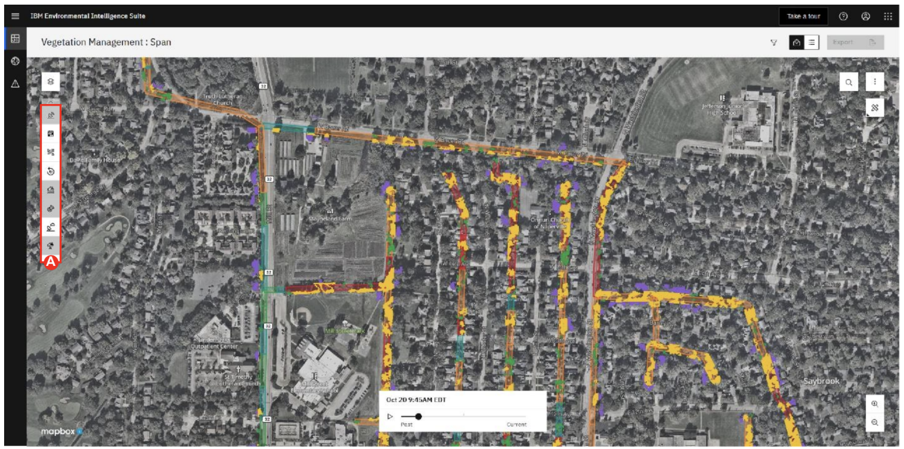
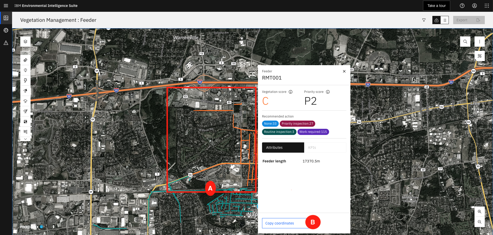

# 102: Introducción a IBM Environmental Intelligence Suite - Vegetation Management

## Inicie sesión en la plataforma IBM EIS

Para completar este paso, utilizará sus credenciales de acceso de la solicitud de acceso.

1.  Inicie sesión en Environmental Intelligence Suite en la siguiente URL: https://environmentalintelligencesuite.ibm.com.

2.  Introduzca su **Username:** _vegm@naperville.com_  y haga clic en el botón "Continuar".

3.  Introduzca su contraseña *Password:** [En Slack] y haga clic en el botón "Login".

    

## Main EIS Dashboard (Vegetation Management Add-on)

Las interrupciones relacionadas con la vegetación afectan a la fiabilidad del sistema y a la satisfacción del cliente. Los métodos tradicionales pueden ser caros y laboriosos, ya que se basan principalmente en inspecciones manuales y ciclos regulares de poda.

Los gestores de la vegetación ya pueden reducir a escala las infracciones de las líneas eléctricas.

Gestores de vegetación en cualquier empresa de E\&U, gasoductos, operadores ferroviarios que dispongan de un presupuesto para gestionar el riesgo de vegetación cerca de sus activos.

IBM Vegetation Management combina IA y analítica para ayudar a abordar los altos costes y las ineficiencias asociadas a la gestión de la vegetación. La solución permite a las empresas tomar mejores decisiones de gestión de la vegetación mediante la combinación de datos meteorológicos, satelitales y de IoT con funciones inteligentes de priorización y generación de informes sobre dónde está invadiendo la vegetación y podría poner en riesgo la red.

La solución de gestión de la vegetación es un componente adicional de Environmental Intelligence Suite (EIS).

La solución aprovecha la inteligencia artificial (IA) y los análisis avanzados para proporcionar a las empresas de servicios públicos u otras compañías cuyos activos se ven afectados por la vegetación una forma de supervisar y comprender rápidamente el impacto actual de la vegetación en su territorio de servicio, identificar las ubicaciones de alto riesgo y tomar las mejores decisiones de planificación para sus equipos de poda u operaciones y sus clientes.

<QuizAlert text="Material del concurso: preste atención a las opciones disponibles"/>

1.  **Click** y **view** los submenús en "Dashboard Visualizations" (menú de la izquierda debajo de IBM Environmental Intelligence Suite) **(A)**.
2.  **Click** en "Gestión de la vegetación" (submenú "Visualizaciones del cuadro de mandos").
3.  Revise la Puntuación de vegetación, la Puntuación de prioridad y los demás KPI estimados para cada tramo analizado (ID de objeto) en la vista de lista.
4.  **Click** en Alimentador o Territorio para ver los valores agregados de los KPI y las Puntuaciones pero para los niveles jerárquicos superiores **(B)**.

## Vegetation Management Map View

También hay una vista de mapa que permite a nuestros gestores de vegetación ver una vista codificada por colores de la vegetación en todo su territorio. En este caso, las zonas verdes indican tramos en los que es menos probable que la vegetación sea un hilo, mientras que una zona roja indica más de un hilo que potencialmente podría desencadenar un corte. Los usuarios pueden aplicar filtros para ver parámetros específicos basados en la ubicación, los KPI o el tipo. El tipo son áreas que pueden requerir una inspección rutinaria, una inspección prioritaria o áreas que necesitan trabajos.

1.  **Click** los distintos tramos del mapa codificados por colores para **view** las diferencias en las puntuaciones.
2.  Desde la barra lateral, acceda a la leyenda de los límites para descifrar rápidamente las puntuaciones y los KPI **(A)**.
3.  Revise los valores/colores de la puntuación de vegetación pasando el ratón por encima de la leyenda Límites de vegetación de la barra lateral.

## Map View: Zoom in the Score Card details for each specific span

Al hacer clic en cada tramo individual, podrá ver las calificaciones, que son la Puntuación de vegetación y la Puntuación de criticidad otorgadas al tramo individual, así como los indicadores clave de rendimiento (KPI) individuales calculados a partir de la vegetación estimada y la proximidad a los activos, como postes y líneas eléctricas. Puede identificar aquellos circuitos o corredores de alto riesgo que con mayor probabilidad recibirán los mayores impactos del crecimiento excesivo de la vegetación. Los usuarios pueden copiar las coordenadas de las ubicaciones de alto riesgo para enviarlas a las cuadrillas con el fin de que realicen los trabajos necesarios para prevenir cualquier riesgo potencial.

1.  **Click** en cualquiera de los vanos para revisar la información sobre sus atributos y KPI **(A**).
2.  **Click** en el botón "Copiar coordenadas" en la parte inferior de la tarjeta de puntuación para copiar las coordenadas del tramo específico y poder transmitir la ubicación de ese segmento a sus compañeros o al responsable de vegetación **(B)**.

## Map View: Overlay of Weather data or Custom Layers from the company

Los usuarios pueden clasificar y exportar los datos según sus necesidades, así como combinar estos datos con otras muchas capas, como el tiempo severo y tropical, los avisos y alertas y muchas otras capas que el cliente pueda introducir en la interfaz.

1.  **Click** la pila de papeles (esquina superior izquierda) **(A)**.
2.  **Click** en la pestaña de complementos para superponer cualquiera de las capas meteorológicas que más le interesen. Esto le ayudará a usted y a su gestor a planificar mejor el próximo recorte/inspección sobre el terreno con las previsiones más recientes y precisas en ese lugar **(B)**.
3.  En cualquier momento, inspeccione un área utilizando el ratón para acercar y alejar el zoom entre sus diferentes niveles de límites (span (nivel más pequeño), feeder, región (nivel agregado más alto)).

## National Weather Service Alerts

Los usuarios pueden optar por recibir alertas del Servicio Meteorológico Nacional (NWS), que incluyen diversos avisos, vigilancias, advertencias y declaraciones. Los usuarios pueden optar por recibir alertas por correo electrónico cuando se emite una alerta. Esto permite a las empresas de servicios públicos prepararse para las grandes tormentas que podrían causar la caída de vegetación que puede interrumpir los servicios de electricidad.

<QuizAlert text="Material del concurso: presta atención a todos los eventos y a la gravedad"/>

1.  **Click** "Gestionar alertas del NWS" (esquina superior derecha de la pantalla) **(A)**.
2.  **Select** entre varias alertas marcando la casilla situada junto al tipo de evento **(B)**.
3.  **Click** "Siguiente" para continuar con las acciones de alerta en la parte superior de la pantalla cuando haya terminado de elegir qué alertas son críticas y desea recibir notificaciones por correo electrónico **(C)**.
4.  **Click** "Guardar" para cerrar la ventana.

Con esto concluye el laboratorio L3. Encontrará más recursos EIS, incluidos otros módulos de demostración, en la [página sísmica "Gestione el impacto del medio ambiente en su empresa](https://ibm.seismic.com/Link/Content/DCQMFdmRcMDTqG9Q9733FW94Fc4V)".

Ya puedes [completar el cuestionario](https://learn.ibm.com/course/view.php?id=12079) de IBM Environmental Intelligence Suite for Sales Nivel 3 Quiz
