# 101: Introduction to Envizi Sustainability Performance Manager

<QuizAlert text='Heads Up! Quiz material will be flagged like this!' />

## Log into the Envizi platform

To complete this step, you will use your login credentials from requesting access.

1. Click on this Envizi homepage URL https://uk001.envizi.com/home/default.aspx to launch the Envizi demo environment.
2. You will be directed to the **Welcome To Envizi** login screen. Enter your login credentials **(A)**.
3. Click the **Login** button **(B)**.
   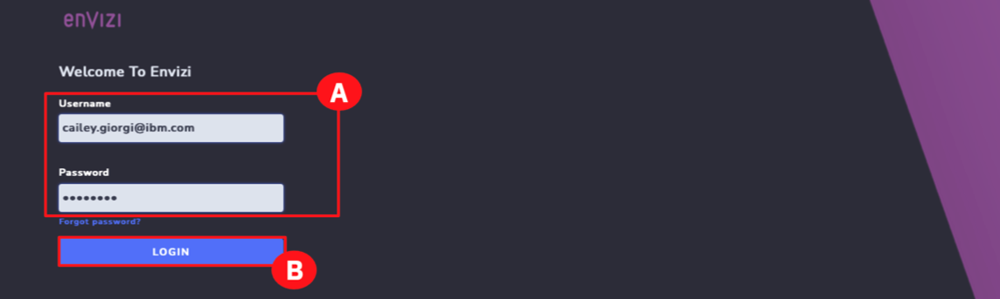

4. You may be asked to **Review time zone settings**. Click the drop-down and choose the correct time zone **(A)**. (To skip this step, click the **NOT NOW** button.)

5. Click the **CHANGE** button **(B)**.

   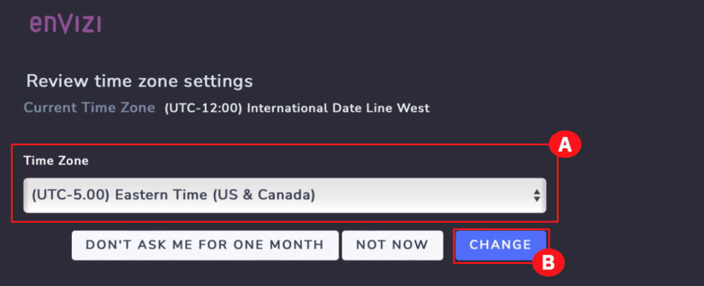

6. Read the **ENVIZI SOFTWARE TERMS OF USE** and click the **ACCEPT (A)** button.

   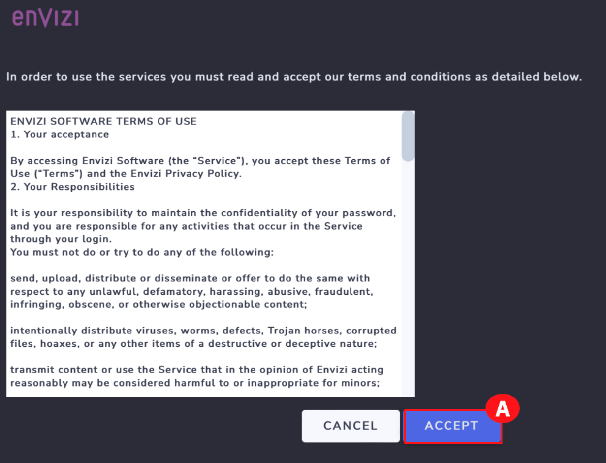

## Sustainability Reporting Manager

Once the login credentials are produced, the Envizi live environment homepage opens. Several tools and links are visible on this homepage. In this part of the demo, you will focus on the Sustainability Reporting Manager tool that helps to systematically manage all the questions, answers, people, workflows, and supporting documents required to ensure that the corporate sustainability reporting aligns with some of the external frameworks such as TCFD, SASB, and others.

1. On the home screen, in the Quick Links section, click the Sustainability Reporting Manager widget (A). This will open the Sustainability Manager tile in a new browser tab.
   <QuizAlert text="Quiz material"/>

   

   > **NOTE:** If the **Sustainability Reporting Manager** tile does not open, check your URL box as you may have the pop-up window blocked.

   > **NOTE:** Do not close **Envizi home page** browser tab as it will be used further along in the demo.

   This will open the **Sustainability Reporting Manager** tool where you can see both current disclosures and past disclosures. Each of the summaries on this page represents a project for a specific year's ESG disclosure. If this company produces an annual Corporate Sustainability Report (CSR) that is aligned with several frameworks.

   > **NOTE:** You may need to scroll down to see the **CSR 2021** report. If you don't see the report labeled as **CSR 2021**, select the **CSR Annual Report** instead to continue.

   At a glance, there are a few areas to focus on to systematically manage the progress of filing the reporting, as well as all the questions, answers, people, workflow, and supporting documents. These include:

   - The reporting frameworks that the corporate sustainability report aligns with **(A)**.
   - The key project milestones in terms of getting content ready, when all content needs to be reviewed, and the due date for the submission **(B)**.
   - The status of all responses to questions in the CSR. This shows the questions that have not been started (**To Do**), questions that are **In Progress**, questions that are **Ready for Review**, and questions that are already **Complete (C)**.

   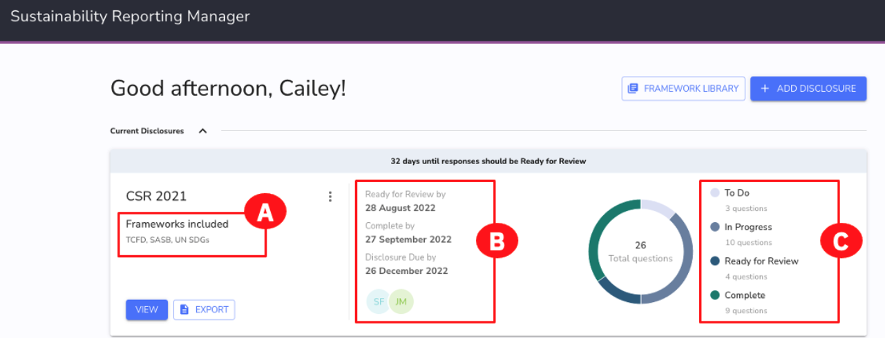

   The CSR report has more detailed information. As the Sustainability Manager for your company, you may want to drill down into the details of this report.

2. Within the **CSR 2021** report tile, click the **VIEW** button **(A)**.

   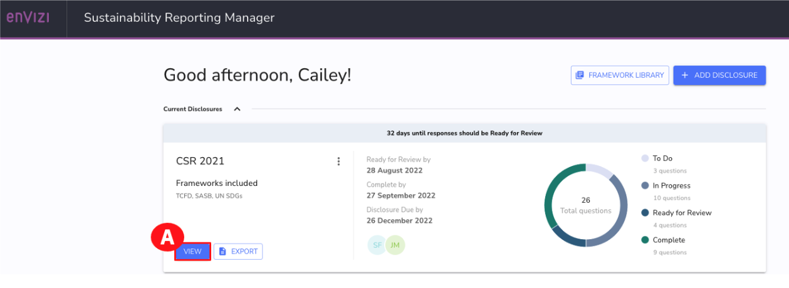

3. To find out more information about each question, look at the following areas for:

   - What external framework this disclosures links to (A).

   - Who is tasked with answering the response for this year’s disclosure (B).

   - Who is tasked with reviewing the question before publication (C).

   - What the current status of that question is: ‘To Do’, ‘In Progress’, ‘Ready for Review’, or ‘Complete’ (D).

4. Scroll through this question list to see more questions (E).

   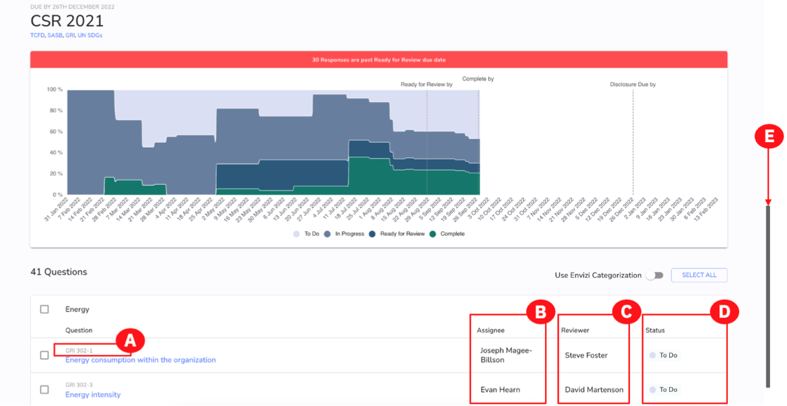

## Adding questions to – and removing questions from – a framework

After reviewing the questions in your report, you may need to add a new question. Fortunately, questions can be added or removed from this report at any time.

1.  To add (or remove) a question, click the **ACTIONS** dropdown **(A)** and click **Add / Remove Questions (B)** from the menu.

    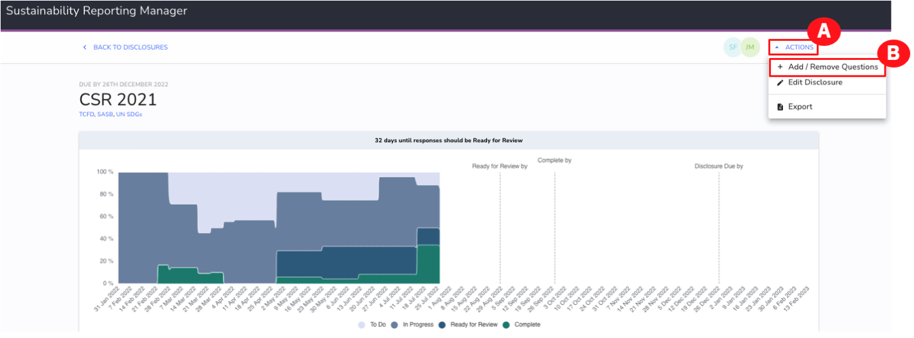

    This will open the framework library where external frameworks are listed, such as TCFD, SASB, and UN SDGs. Each of the reporting frameworks listed on this screen is a framework that your company’s Corporate Sustainability Report (CSR) aligns with. Assume that you need to add a question from the UN SDG framework. This framework has 17 Sustainable Development Goals (SDGs), 16 topics, and 159 questions.

2.  To add a question from the UN SDGs from Envizi’s framework library, click SELECT QUESTIONS under the UN SDGs tile (A).

    

    This opens a page with all the UN SDG disclosures. At the top are questions used in your company’s annual report, and past CSR reports in both 2020 and 2021. Questions in this framework are separated by headings into groups that are important to this reporting framework, such as Ending Poverty, Climate Action, Affordable and Clean Action, and more. Any questions that already exist in your CSR report will have the box selected beside the question. You can add any of the questions to your CSR 2021 report.

3.  To do this, check the box beside the question(s) that you want to add to the CSR report **(A)**. (For example, select the **Halving overall global poverty** box and **Access to basic services globally** box)
4.  Once all desired questions are selected, users would save their selection. **DO NOT DO THIS STEP**.

    > **Note:** For this demo, you are in **View Only** mode, **do not** click the **SAVE** button.

    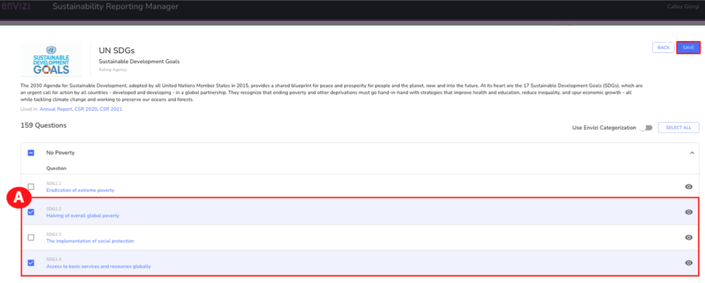

    Let’s assume you want to go back to one of the questions in the CSR 2021 report and drill into that question to review the details.

5.  To get back to the questions, on the **UN SDGs framework** page, click the **BACK** button **(A)**.

    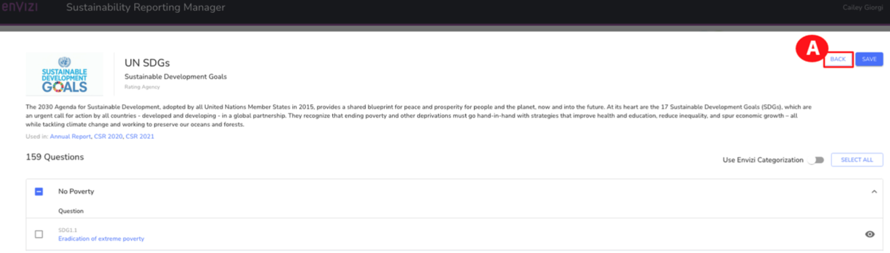

6.  Click the **BACK** button **(B)** again to return to the **CSR 2021/CSR Annual Report** overview page.

    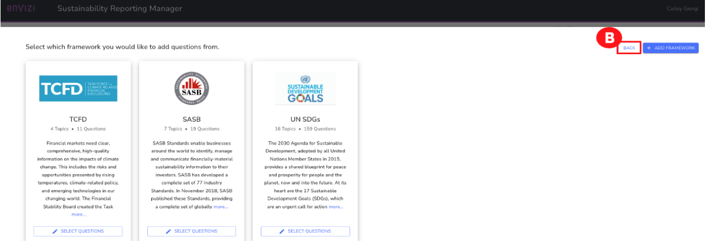

## Sustainability Reporting Manager continued

Assume you want to see the details that are provided when drilling down into a specific question.

1. Scroll down to the **Governance** section **(A)** and click the **Board’s role in managing risks and opportunities** hot link **(B)**.

   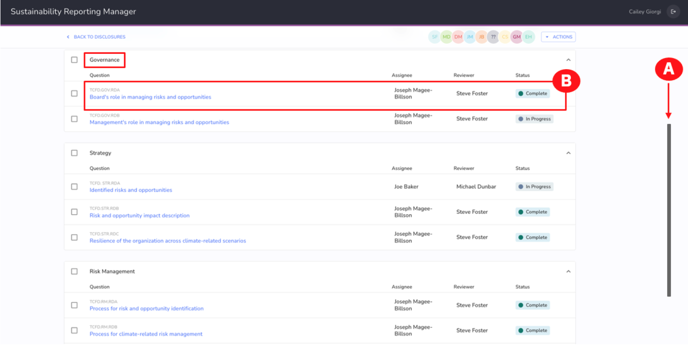

   When you click on a question from the disclosure, there are several details that will be displayed. As a Sustainability Manager, this makes it easy for you to see the question, some guidance, who the stakeholders are, and more – all in a single view.

2. For each disclosure within a selected framework, you can see:

   - The question you need to respond to, as asked by the external reporting framework, which in this example is TCFD **(A)**.
   - Guidance from the reporting framework itself **(B)**.
   - Additional guidance from IBM Envizi, based on its experience working with hundreds of clients doing ESG disclosures **(C)**.
   - The methodology that your team needs to follow. This is, in effect, the corporation’s memory; if the team faces churn over the next year, there is still a clear “recipe” to follow for how to respond to this question and all the other questions in the disclosure. There is also a list of stakeholders who can be consulted for further guidance **(D)**.
   - The final response that will be externally published **(E)**.
   - Links to external documentation that can be made available on corporate intranets or external websites **(F)**. You can click the **+ADD NEW** button to add other links.
   - Attachments that provide supporting documentation to the process or final answers **(G)**. You can click the **+ADD NEW** button to add additional documents.
   - A full audit trail (**Comments**) on Dialog between those involved in responding to and reviewing this specific question and other activities **(H)**.

   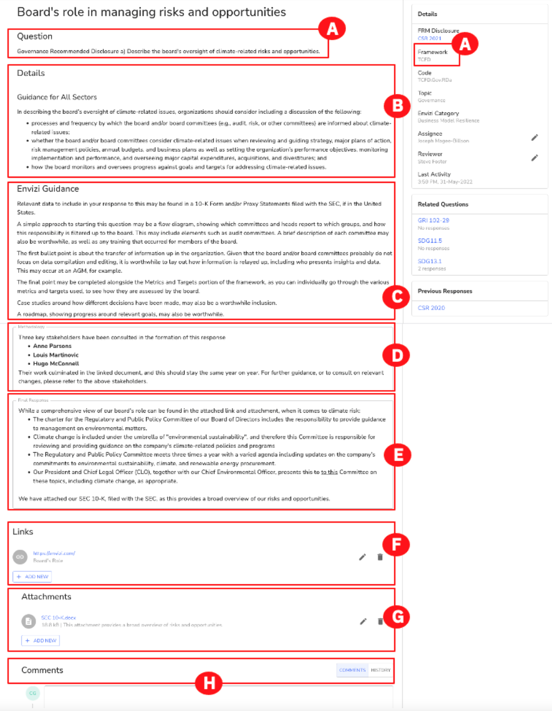

   As a Sustainability manager, you want to minimize the effort that your team spends responding to questions. This means you need to leverage the work that your team has done in previous years, as well as find synergy between similar questions in different frameworks. To help with this task, there are some Envizi tools you can leverage.

3. Copy questions, answers, and supporting information from a previous year’s disclosure. To do this, click **COPY FROM LAST YEAR (A)** at the top and select **VIEW DETAILS (B)**.

   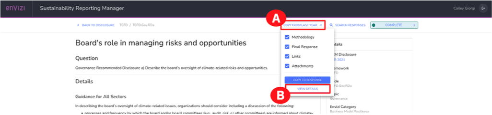

   This allows you to drill down and see the details of last year's response. Not only can you see the information that was associated with the last year's response but if you want to start this year's response with information from last year, you could do that using the **COPY TO RESPONSE** button at the bottom of this screen.

   Your team can choose what information to copy from the last year, such as methodology, final response, links, or attachments by simply selecting the box beside each heading.

   > **Note:** For this demo, you are in **View Only** mode, **do not** click the **COPY TO RESPONSE** button.

4. Click the **CANCEL** button **(A)** to return to the question.

   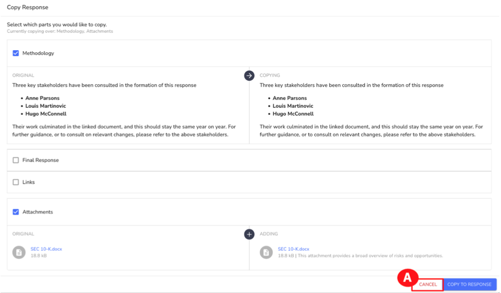

   Another capability Envizi provides is copying information into other frameworks. On the **Board’s role in managing risks and opportunities** page, you can copy information and responses from similar questions in other frameworks.

5. On the right-hand side under the **Related Questions** section, click **SDG 13.1 (A)**.

   This is a disclosure from another framework that’s very close to the current framework you’re working on. This might be a good candidate to copy its response to the disclosure you are working on. If you wanted to copy this response over, you could do so by clicking the **COPY TO RESPONSE** button.

   > **Note:** For this demo, you are in View Only mode, do not click the **COPY TO RESPONSE** button.

6. Click the **X** in the upper left corner to close the Response window **(B)**.
7. Click **BACK TO DISCLOSURE** at the top to return to the overview page for the CSR 2021 report (C).

   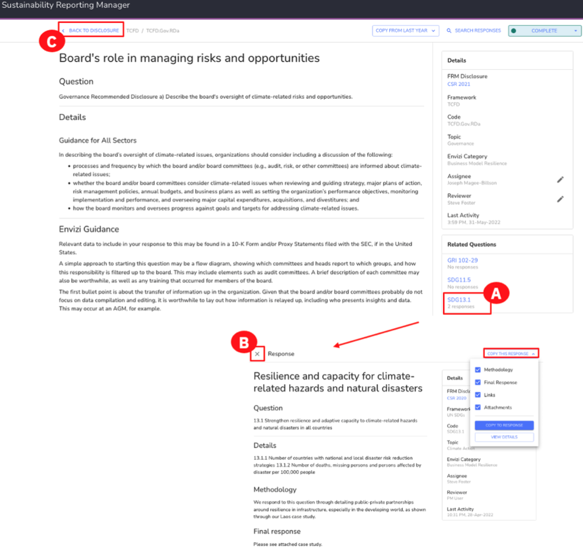

   > **Note:** The text in the fields displayed in the screenshots and in the walkthrough video may differ for the end user completing the demo at a later time.

   It’s important to note that for some questions, the answers require complex numerical calculations that aggregate thousands of data streams. This is typically the case on the environmental (“E” of ESG) side. For these questions, their answers commonly come from Envizi reports. Let’s look at an example around Scope 1, Scope 2, and Scope 3 GHG emissions.

   > **Note:** The Greenhouse Gas (GHG) Protocol categorizes greenhouse gas emissions into three ‘Scopes.’ Scope 1 covers direct emissions from owned or controlled sources, such as vehicles and fuel combustion. An example of Scope 1 emissions is fleet fuel used for an organization’s vehicle fleet. Scope 2 covers indirect emissions from the generation of purchased electricity, steam, heating, and cooling. An example of Scope 2 emissions is the emissions from the electricity an organization purchases to cool its data centers. Scope 3 covers indirect emissions such as purchased goods and services and business travel. An example of Scope 3 emissions is emissions from FedEx which was hired by the government (or any shipping company that was hired for that matter) to refrigerate and ship cold chain custody vaccines during the COVID-19 pandemic.
   >  https://ghgprotocol.org/about-us >  https://ghgprotocol.org/sites/default/files/Scope2_ExecSum_Final.pdf >  https://www.carbontrust.com/resources/briefing-what-are-scope-3-emissions >  https://www.nationalgrid.com/stories/energy-explained/what-are-scope-1-2-3- carbon-emissions

8. Scroll down to **Metrics and Targets (A)** and click the **Scope 1, 2, and 3 Greenhouse gas emissions and related risks** hot link **(B)**.

   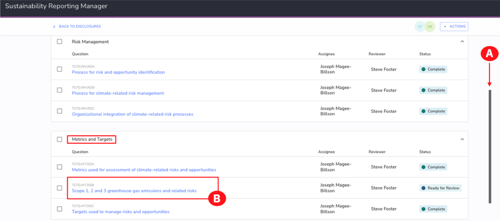

   Similar to the previous question you drilled down into, this page contains all of the information related to this question.

9. For this question, there are a number of important details to look at:

   - Under the Methodology section is the “recipe” for answering this question and letting Envizi do all the heavy lifting and extracting the numbers from an Envizi report (A).
   - Towards the bottom of the page, note that the Final Response is numerical. This is the aggregate of thousands of data streams, and you can see it is a summary number of emissions by Scope (B).
   - Under Attachments, the point-in-time report is attached for a particular period. Clicking Sustainability (Executive Report) – ESG Year Ending Dec 31 2021.pdf, allows you to view the report in a new browser tab or download the PDF for local viewing; however, this will only show you the PDF version of the report (C).

   Now assume you want to explore how you can access this report on the Envizi platform.

10. Scroll up to the top of the page **(D)** and click **BACK TO DISCLOSURE (E)**.

    > **Note:** The metrics and text in the fields displayed in the screenshots and in the walkthrough video may differ for the end user completing the demo at a later time.

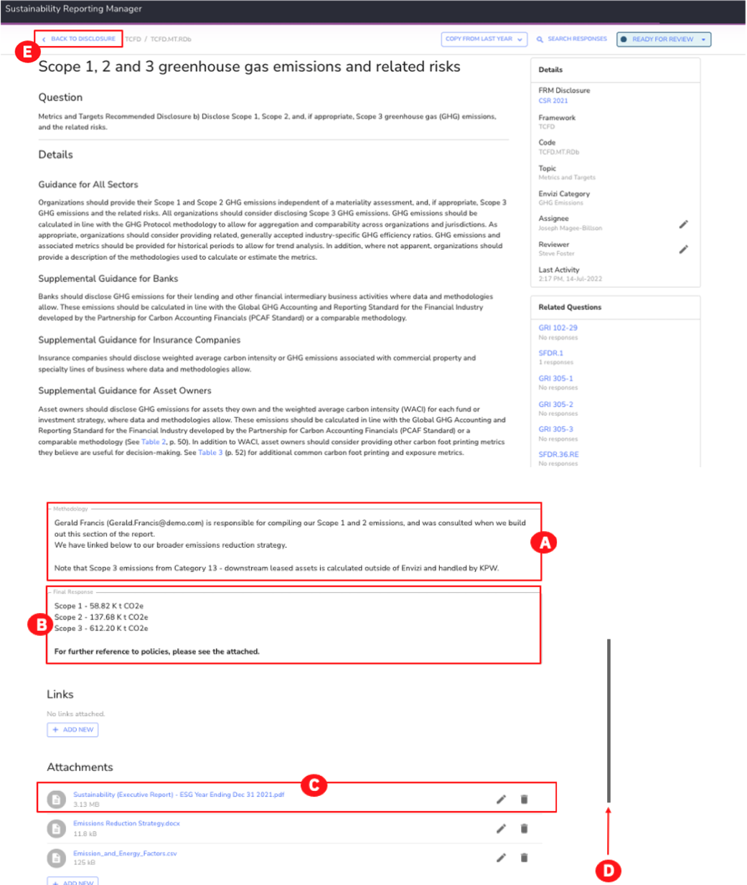

### Congratulations, you've reached the end of lab 101.

Leave your browser window open, [lab 102](../102) starts from this screen.
