# 103: Scope 3 Capabilities

<QuizAlert text='Heads Up! Quiz material will be flagged like this!' />

In recent years, there has been an explosion of interest in Scope 3 emissions. As a Sustainability Manager, you need to capture and report on Scope 3 emissions for external disclosures. However, this can be challenging because capturing, managing, and reporting on Scope 3 data can be much more complex than what is required for Scope 1 and Scope 2 because of the diversity of Scope 3 data sources, as well as the challenges in accessing that data.

Any Scope 3 data can be captured within Envizi. Envizi helps manage Scope 3 emissions in five ways:

1. Automatically capturing data, thus ensuring a systematic auditable manual data capture approach.
2. Provides a robust set of tools for ongoing emission factor management.
3. Provides performance reporting tools for tracking against targets and baselines,
   and for identifying hotspots that need to be addressed.
4. Provides external reporting tools for taking Scope 3 data and formatting it
   appropriately for different external reporting framework requirements.
5. Provides a robust audit trail to support external auditors.

## Organizing Scope 3 data streams

This section of the demo looks at how the Scope 3 data captured using Envizi can be organized for reporting and analysis. This can relate to waste, air travel, or employee commuting. For most organizations, it makes the most sense to capture this information at a site level.

1. From the Envizi home page, open the organization hierarchy to drill down into a location by clicking the **Show Organization Hierarchy** icon (the circle with 3 horizontal lines, sometimes referred to as a hamburger icon) **(A)** in the upper left corner.
2. Under **Portfolio Groups** find **Film & TV Production Group** and click the **twistee** to expand this group **(B)**.

   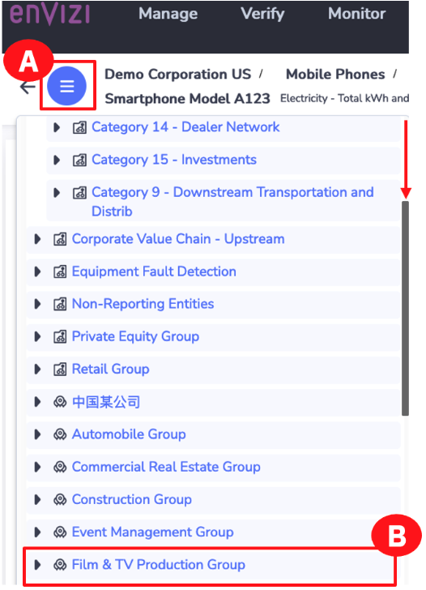

   Continue drilling down to get to the data captured:

3. Click the **Production: WS1** twistee to expand it **(A)**.
   
4. Click the **Filming Locations** twistee to expand it **(B)**.
   
5. Click the **US - US27** twistee to see this location’s accounts **(C)**.

   <QuizAlert text="Quiz material"/>

    > **Note:** The Exam has not been updated to reflect recent UI changes. There is a questions which reads "In the “Organization Hierarchy,” how many accounts are listed for the USCA location?". Refer to **US - US27** instead and note that the number of accounts is 1 off.

6. Click the **Accounts** twistee to open accounts for this location **(D)**.

7. Take note of the data. In this example, at the US - US27 location, different data is captured; for example, **Accommodations, Air travel, Recycling**, and other Scope 3 data types **(E)**.

   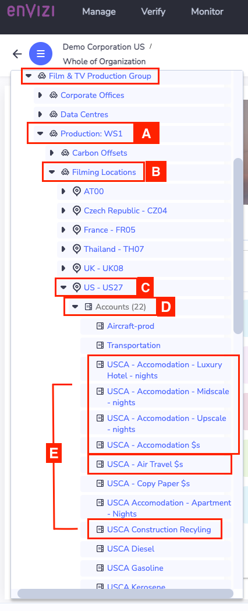

   Open a part of the hierarchy that is focused on data types that are captured at an organizational level and continue to drill down.

8.  Scroll up to the top level **Classification Groups**, and click the twistee to expand this group **(A)**.

   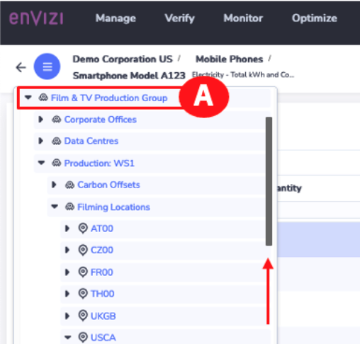

9.  Click to expand the **Corporate Value Chain – Upstream** twistee **(A)**. This hierarchy is an example and can be customized.

   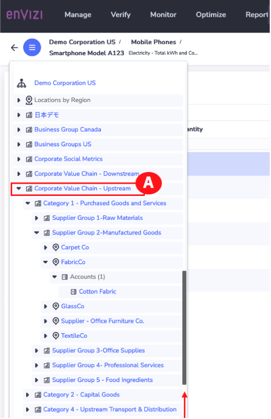

   Continue drilling down to get to the data captured:

10. Click the **Category 1 – Purchased Goods and Services** twistee to drill into the smaller supplier groups **(A)**.
11. Click the **Supplier Group 2 – Manufactured Goods** twistee to drill within the supplier groups to see specific companies **(B)**.
12. Within each supplier are specific products or commodities that are purchased.
    Click the **FabricCo** twistee to see the products for this supplier **(C)**.

13. Click the **Accounts** twistee to see **Cotton Fabric (D)**.

    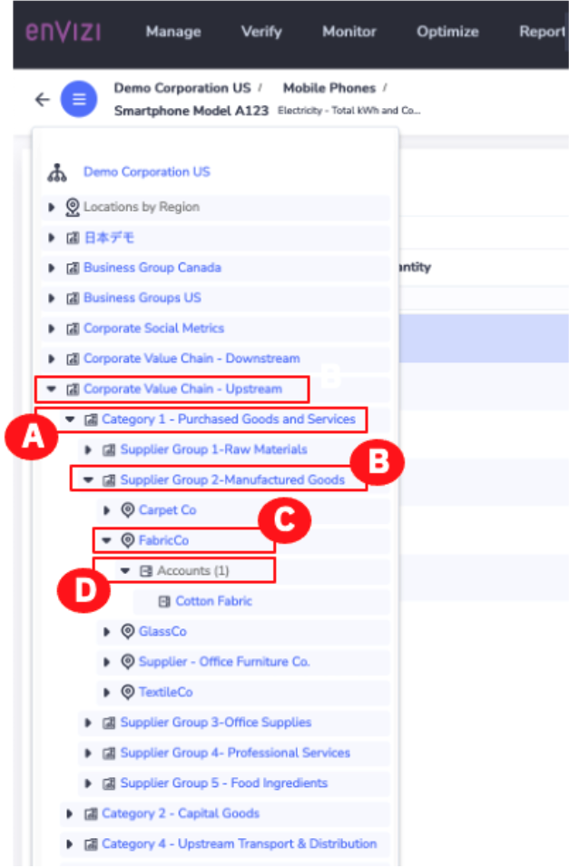

    The way the data is captured is customizable. In some cases, organizations may capture data at a sectoral level for some more personal Scope 3 emissions. Then they may capture the data at a supplier level for the top 100 or 500 suppliers that materially contribute to their Scope 3 emissions.

    The same thing happens for downstream emissions.

14. Click the **Corporate Value Chain – Upstream** twistee to collapse this group **(A)**.

    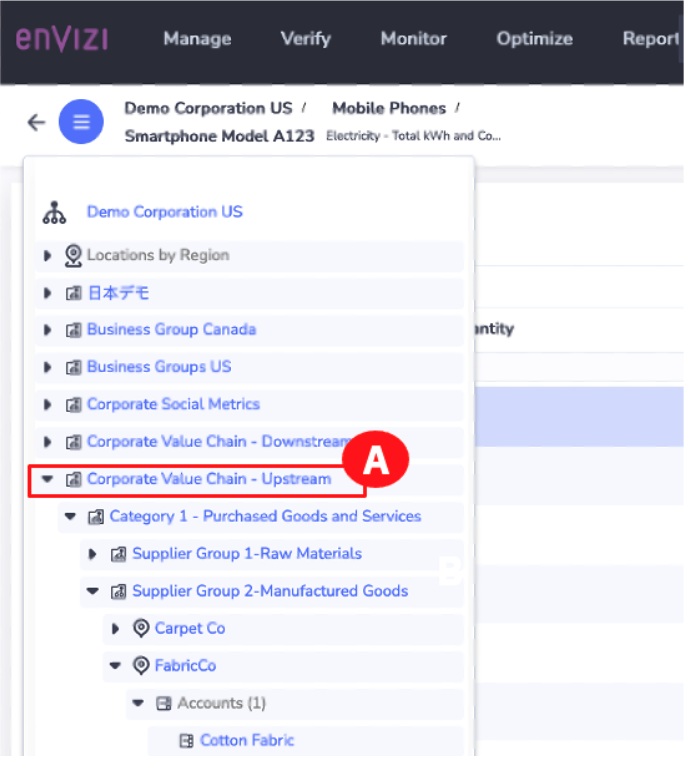

15. Click the **Corporate Value Chain – Downstream** twistee **(A)**.
16. Take note of the examples of categories of Scope 3 emissions **(B)**. These could be captured at a sectoral level or at a specific supplier level.
17. Click the **Show Organization Hierarchy** icon (the circle with 3 horizontal lines, sometimes referred to as a hamburger icon) **(C)**.

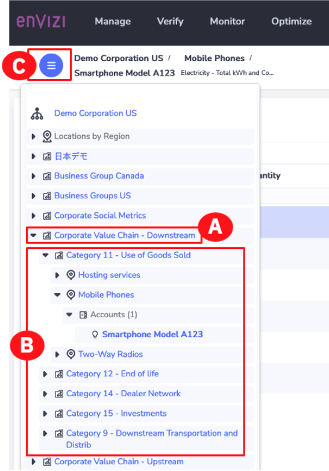

## Analyse Scope 3 emissions through reports and dashboards

Now it’s time to take a deeper look at Scope 3 insights. To explore a concept walkthrough report demonstrating Scope 3 emissions reporting, this demo will use Envizi’s Scope 3 PowerReport.

1.  In the upper global search bar, click the dropdown and select **Reports (A)**. Type _Scope 3_ in the **Search for Reports** field **(B)** and notice how results appear in real-time.
2.  Click **Scope 3 Emissions Summary – PowerReport (C)**.

    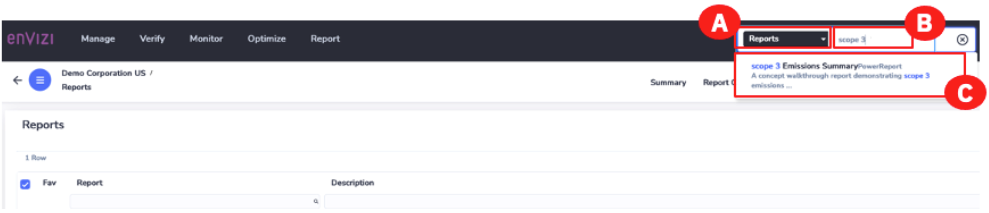

3.  Click **Scope 3 Emissions Summary – PowerReport** from the **Reports** page **(A)**. This opens PowerReport in a new browser tab.

    > **Note:** If the **Scope 3 Emissions Summary – PowerReport** does not open in a new window, check your URL box as you may have the Pop-Up Window Blocked.

    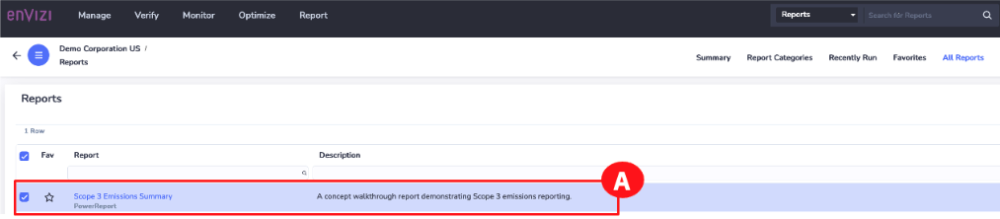

    This Scope 3 PowerReport is designed to help identify Scope 3 hotspots that represent opportunities for emission reduction. Those opportunities could be in terms of the 15 Scope 3 categories, in terms of product categories, or in terms of specific suppliers. This report also helps identify opportunities for improving Scope 3 data quality in terms of data gaps and data accuracy. Envizi uses Microsoft Power BI to build this report; it can be customized to meet specific organizational needs for visualization and analysis.

4.  Look at identifying opportunities for emission reduction. To do this, click the **CONTINUE TO REPORT** button **(A)**.

    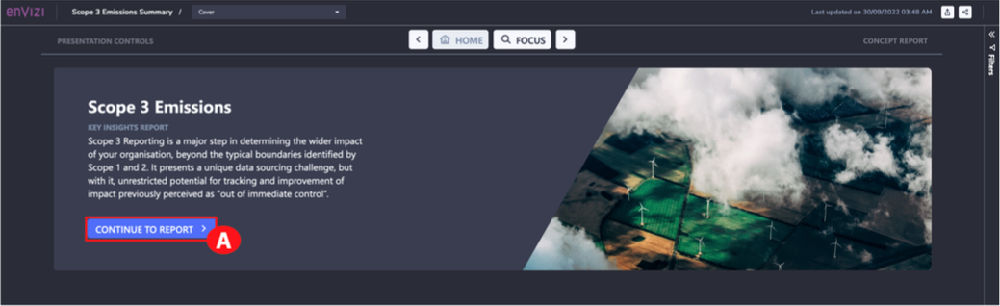

5.  This will open the **Emissions dashboard**. This dashboard provides a macro view of Scope 3 emissions, including:
    <QuizAlert text="Quiz material: pay attention to these categories"/>

    - **Emissions overview:** A comparison of Scope 3 emissions against Scope 1 and Scope 2 emissions. Both are represented in absolute terms as well as a percentage. It shows how the overall Scope 3 emissions are trending and then breaks down Scope 3 emissions by upstream and downstream categories **(A)**.
    - **Scope 3 Category Performance:** This is the emission contribution of each Scope 3 category. You can analyze any of the categories shown in this section **(B)**.
    - **Top Contributors:** The top contributors overall for the Scope 3 emissions **(C)**.

    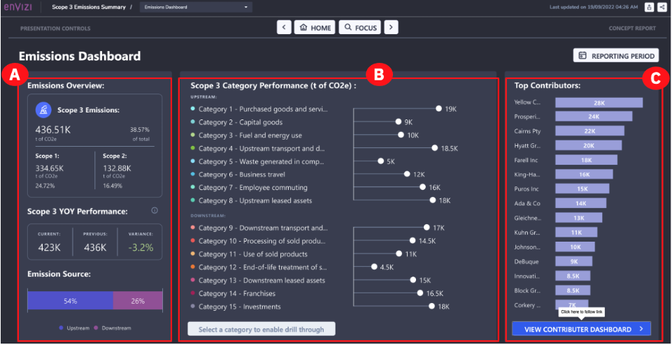

    You can also drill down into a specific Scope 3 Category. For example, assume you want to look at one of the most common categories – Category 1: Purchased goods and services.

6.  Under the **Scope 3 Category Performance** section in the middle, click **Category 1: Purchased goods and services (A)**.
7.  Click the **Analyse Category 1 Purchased goods and services** button (this button appears after you select this category in the previous step) at the bottom **(B)**.

    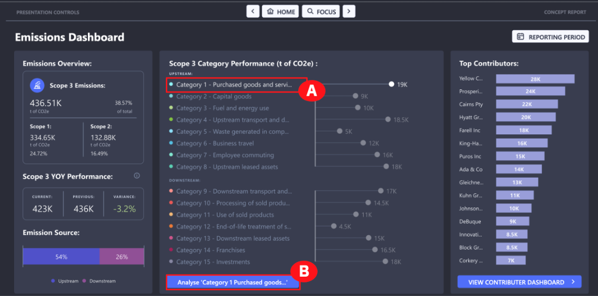

8.  This opens the **Category Analysis** dashboard. This dashboard provides the ability to analyze the selected category in several ways, including:

    - **Data Insights:** This describes the calculation methodology used for different proportions of the data and the accuracy associated with each, as defined by the Greenhouse gas (GHG) protocol **(A)**.
    - **YOY Performance:** The year-over-year (YOY) performance is a trend of the emissions in this category. There is the ability to limit the comparison to only those data sources where the calculation methodology has remained the same over the period **(B)**. (In other words, a like-for-like comparison)
    - **Emissions by Data Type Category:** The top data types that make up the emissions for this category **(C)**.
    - **Emissions By Contributor:** This category’s top contributors. For purchased goods and services, this would be the suppliers, such as Yellow Group. **(D)**.

    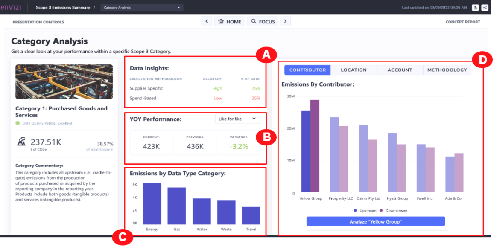

9.  To zero in on a specific supplier, for example, **Yellow Group**, click **Yellow Group** on the graph **(A)**, then click the **Analyse “Yellow Group”** button **(B)**.

    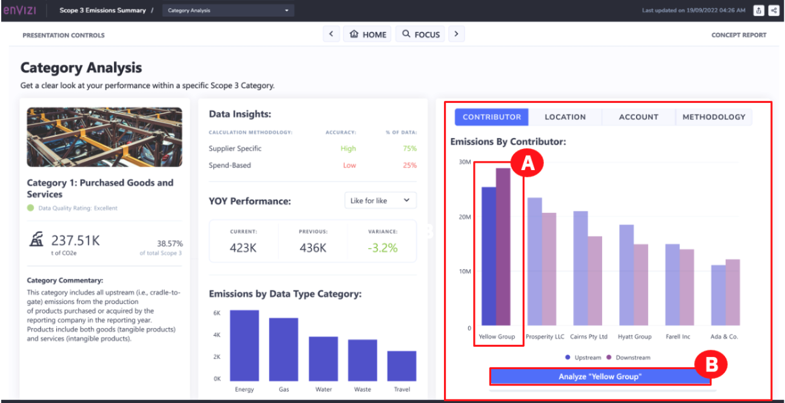

10. This opens the **Contributor Analysis** dashboard. This dashboard provides an analysis of a particular contributor or supplier:
    - **Contributor Name (Cairns Pty Ltd):** The share of emissions that this particular supplier represents, and the methodology used for emission calculations which may influence the confidence that you have in the numbers that you see. Also, note the emission categories applicable for this supplier’s emissions **(A)**.
    - **YOY Performance:** The trend for this supplier’s emissions. And under Calculation Method History, an indication of whether the calculation methodology has changed over time **(B)**.
    - **Emissions by tag (Product):** The emissions by the products that this supplier is supplying to your company **(C)**.
11. Click the **Back arrow** button at the top **(D)**.

    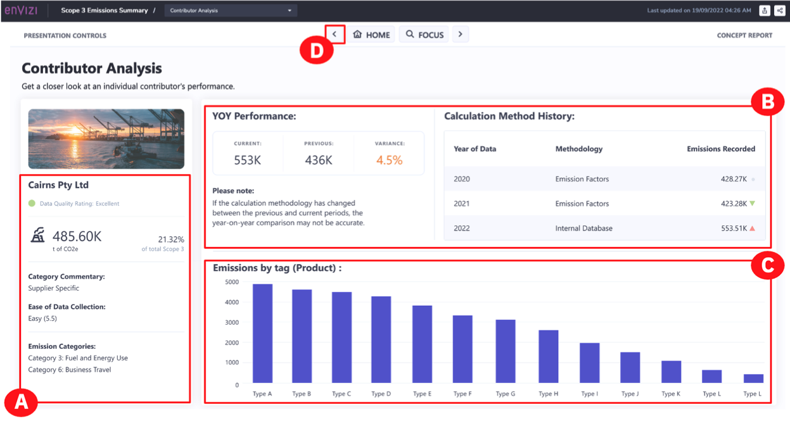

12. This takes you to the **Contributor Dashboard**. This dashboard looks at Scope 3 emissions through the lens of top contributors. This dashboard shows:

    - A view of the supplier concentration **(A)**.
    - A view of the geographic distribution of suppliers **(B)**.
    - Individual suppliers **(C)**. If you wanted to analyze a supplier, you can click the **“Supplier name”** and then the **Analyse “Supplier name”** button. This would return you to the Contributor Dashboard.

    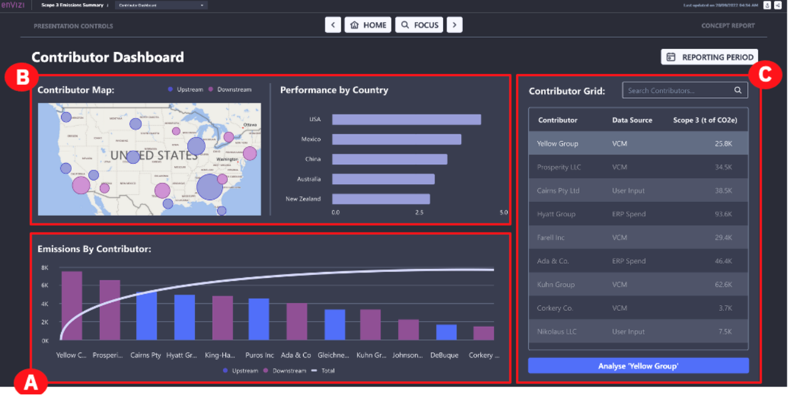

13. Click the **HOME** button at the top **(A)** to return to the **Emissions Scope 3 Summary** home page.

    

    To get a better understanding of your company’s Scope 3 data, you will also want to see data gaps and opportunities.

14. To view a dashboard with this information, click the **DATA GAPS AND OPPORTUNITIES** button **(A)** from the **Scope 3 Emissions Summary** page.

    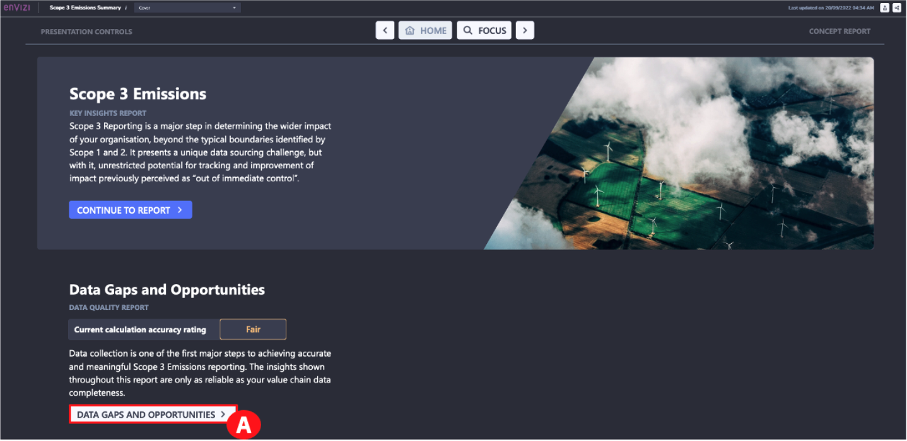

    This dashboard provides a view of which Scope 3 data sources represent a risk to determining a complete picture of Scope 3 emissions. There are two attributes associated with each emission source that is shown when you hover over a bubble:

    - For the **Cairns Pty Ltd** contributor, how easy it was to capture the data from this emission source? Automated sources are best, while manual once-per-year captures would rank poorly **(A)**.

    - How accurate the calculations are, based on the methodology used for this data source. The emissions in the top right corner represent the lowest risk for determining an accurate picture of Scope 3 emissions and those in the bottom left represent the highest risk for determining an accurate picture **(B)**.

15. This assessment could be narrowed down by selecting a category from the list **(C)**.

16. Click the **HOME** button at the top **(D)**.
    <QuizAlert text="Quiz material: pay attention to the 'Risks and Opportunities Map'"/>

    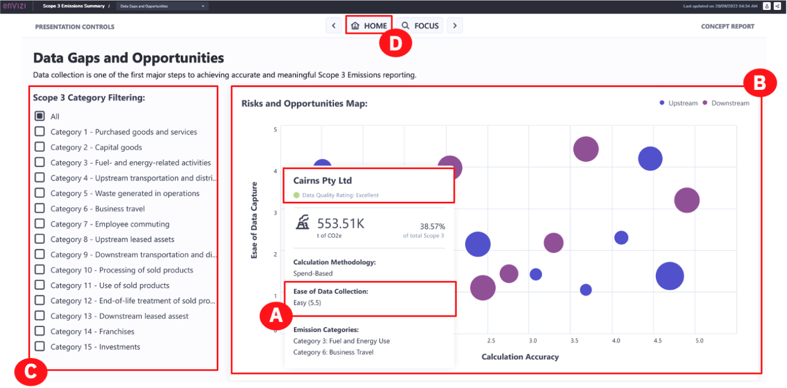

### Congratulations! You have reached the end of lab 103.

This concludes the L3 lab. More Envizi resources, including further demo modules, can be found on the [“Accelerate ESG Reporting and Performance with Envizi” seismic page](https://ibm.seismic.com/Link/Content/DC3d7gR9pH2TF82DCcDqpX48F2qd).

You can now [complete the quiz](https://learn.ibm.com/course/view.php?id=11879) for Envizi Sustainability Performance Management Technical Sales L3
