# 104: Gestión de datos Envizi

La demostración de la insignia Envizi Technical Sales Intermediate muestra el poder de Envizi para identificar oportunidades de mejoras ESG, realizar un seguimiento del progreso ESG año tras año y realizar informes ESG de acuerdo con los marcos ESG numéricos.

La racionalización de los informes y la aceleración de la descarbonización dependen de un conjunto completo de datos ESG relevantes. El primer paso en la elaboración de una solución Envizi es construir esa base de datos. En este laboratorio se analiza la arquitectura de gestión de datos de Envizi.

## Modelo de organización Envizi

A continuación se explica cómo se organizan y gestionan los datos de una organización en Envizi.

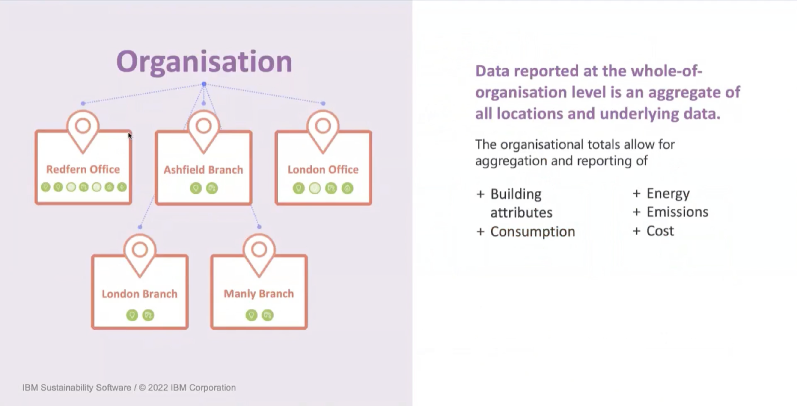

Una organización representa la totalidad del negocio de un cliente. Los informes empresariales de alto nivel agregan todos los datos de todas las cuentas y contadores de Envizi.

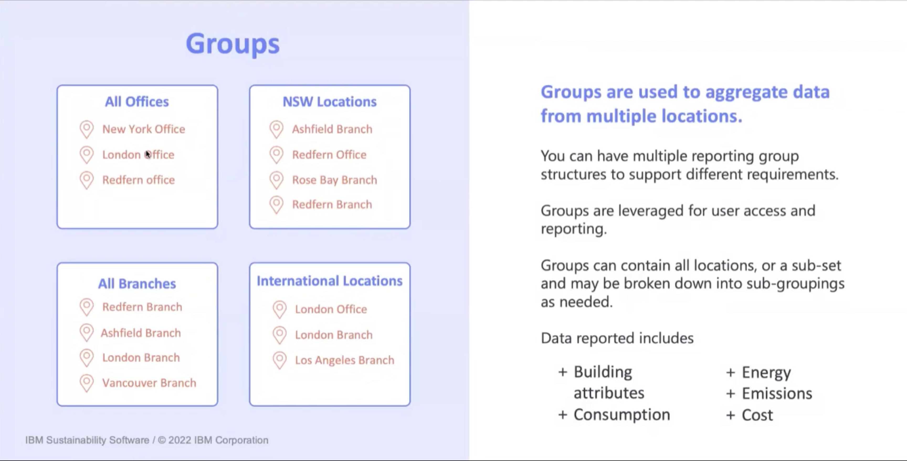

Los grupos pueden utilizarse para organizar los informes, así como para el acceso de los usuarios. Esto puede ser muy útil si desea delegar regiones a determinados gestores. Hay 3 niveles de grupos disponibles, grupos principales y hasta 2 grupos secundarios. Por ejemplo, un grupo principal podría ser todos los edificios de oficinas de la empresa, con subgrupos para cada país, como España y el Reino Unido, y subgrupos adicionales dentro de éstos para las regiones del país, como Londres y el sureste.

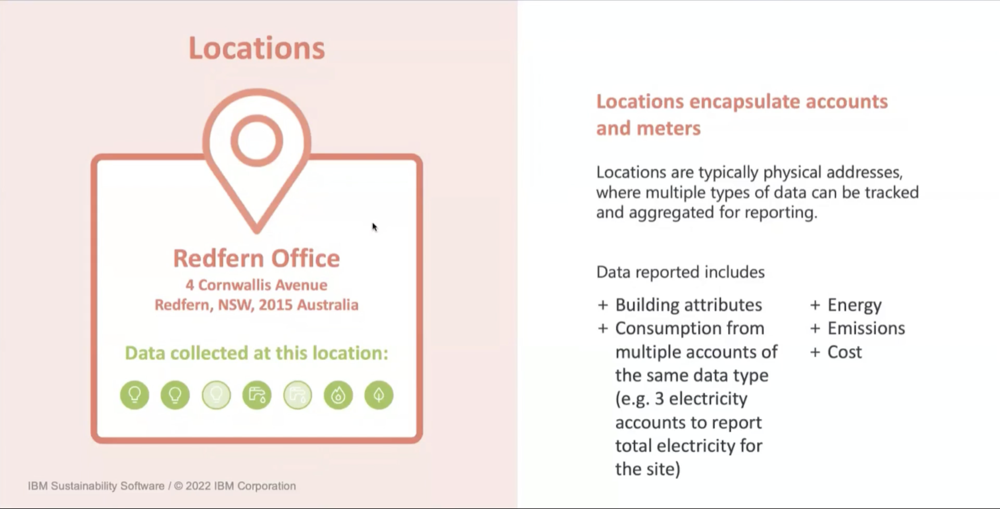

Las ubicaciones suelen representar un edificio físico o un grupo de edificios. Además de los datos de las cuentas y los contadores de una ubicación, pueden almacenarse otros atributos como la dirección, la región, la fecha de apertura, las reformas y sus fechas, la superficie útil, la ocupación, etc.

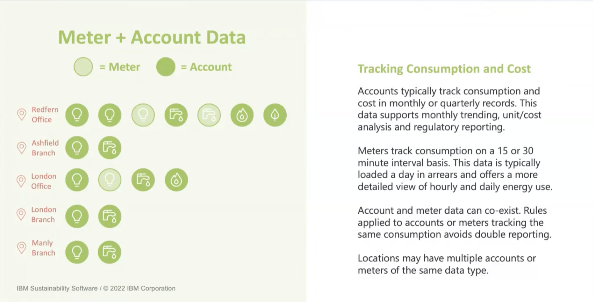

Datos transaccionales y de actividad. Las cuentas pueden ser muy variadas, desde facturas de electricidad hasta datos de viajes en avión, gastos con un proveedor concreto o en bienes o materiales. Los contadores capturan datos mucho más granulares procedentes de sensores informáticos o contadores inteligentes a los 15, 30 o 60 minutos.

## Gestión del grupo

### Grupos

Para gestionar grupos en Envizi, haz clic en "Gestionar" -> "Grupos".

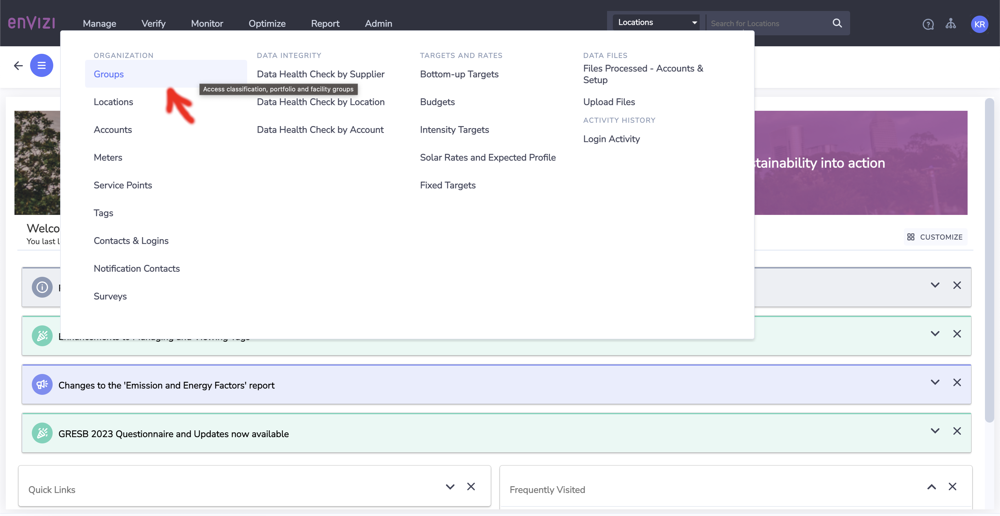

La lista de grupos es altamente configurable. Los grupos se pueden buscar, filtrar y los nombres de las columnas se pueden arrastrar y soltar y mostrar / ocultar para personalizar la vista. Estas preferencias son específicas del usuario y persistirán. Los nuevos grupos se pueden crear de 4 maneras diferentes, 3 a través de la interfaz de usuario, y también a través de correo electrónico mediante el envío de la plantilla de configuración de creación masiva. Hacer clic en el botón "Nuevo grupo" es la forma más sencilla de añadir un nuevo grupo. El botón "Crear nuevo grupo con membresías" le permite especificar las ubicaciones que forman parte del grupo, lo que se utiliza más comúnmente a posteriori cuando las ubicaciones ya están creadas. Tenga en cuenta que siempre puede hacer clic con el botón derecho del ratón y editar un grupo a posteriori.

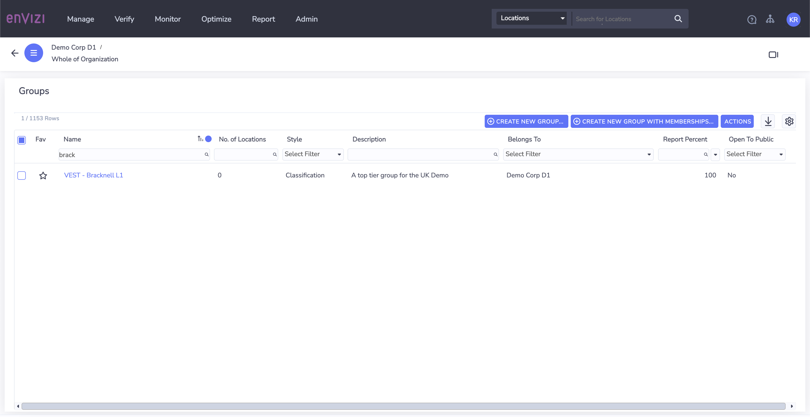

Tipo de grupo:

*   Los grupos de clasificación son la categoría principal que se utiliza, y representan la jerarquía primaria de información.
*   Los grupos de cartera pueden representar a cualquier otro grupo secundario a efectos de acceso de usuarios o elaboración de informes.

Pertenece a:

*   La organización a la que pertenece el grupo.

Parte de:

*   NA representa un grupo de primer nivel.
*   Al hacer clic en otra opción se creará este grupo como grupo secundario o terciario debajo.

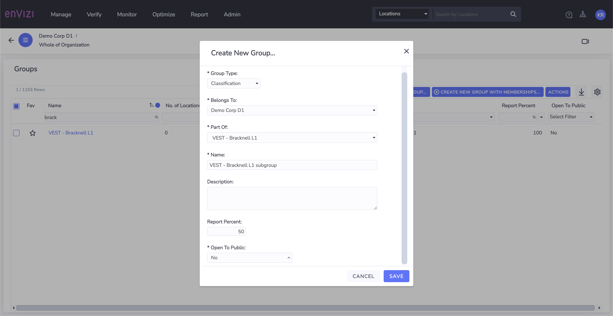

La creación masiva de grupos también es posible mediante la carga de un archivo de plantilla de grupo masivo, que puede descargarse más abajo.

grupo masivo crear / actualizar plantilla

Haga clic en "Gestionar" -> "Cargar archivos" -> "Crear nuevo" y adjunte la plantilla cumplimentada. A continuación, puede comprobar que se han creado los grupos volviendo a la vista de grupos.

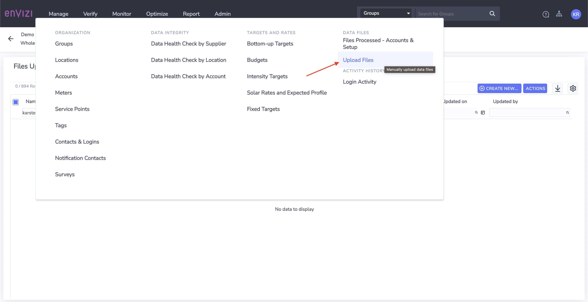

Hay otra herramienta que le permite ver los archivos cargados / enviados por correo electrónico y volver a descargarlos o verificar que se han cargado correctamente.

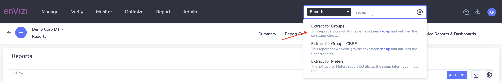

Existen procesos similares para la creación de ubicaciones, cuentas, contadores, usuarios y datos históricos, pero quedan fuera del ámbito de esta sección.

Este es el final de esta sección. Continúe para aprender sobre el modelo de datos más granular dentro de las cuentas.

## Modelo de datos granular

A continuación se explican los cuatro componentes clave del sistema de gestión de datos Envizi a nivel de cuenta.

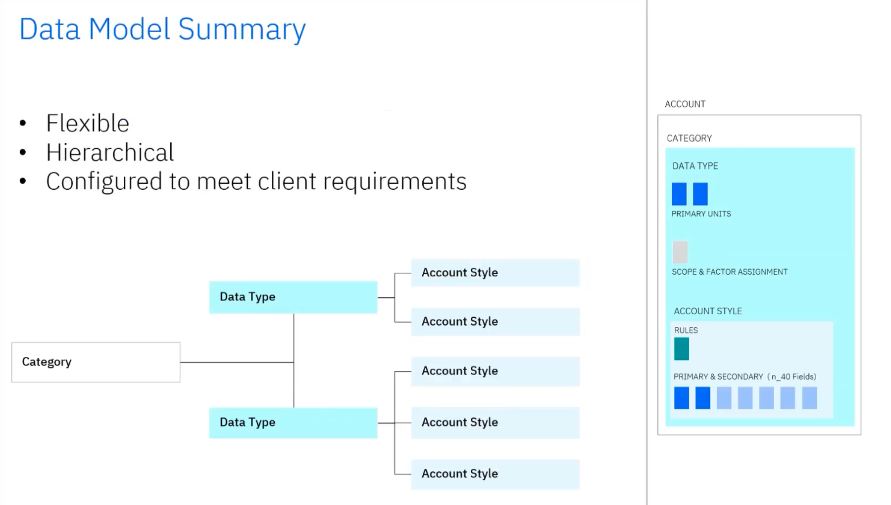

*   Flexible
*   De naturaleza jerárquica
*   Configurado para satisfacer las necesidades del cliente

El modelo de datos de cada cliente se traza durante el proceso de incorporación a través de consultas con el cliente para determinar los tipos de datos que sería necesario capturar y los estilos de cuenta necesarios para capturar campos específicos que podrían ser cualquiera de los dos:

*   Estilos de cuenta asignados a partir de los archivos de proveedores que se utilizarían en la recopilación automatizada de datos
*   campos necesarios para cumplir los requisitos de información.

### Tipos de datos

Los tipos de datos son el componente básico del modelo de datos de Envizi.

Configurable, pero gestionado por el equipo de producto de envizi.

Define:

*   Categoría de datos que debe gestionarse (por ejemplo, agua, gas natural, electricidad)
*   Unidad de medida primaria (coste y consumo) que debe registrarse en el tipo de datos
*   Alcance de las emisiones (1, 2 o 3) y proceso de asignación del factor de emisión para el tipo de datos, si procede.

Las métricas sociales o los tipos de datos de información sobre edificios pueden tener "Sin alcance".

El alcance y la categoría de los datos influyen en la forma en que se aplica el factor de emisiones a esos datos en la plataforma.

Envizi cuenta con una biblioteca de más de 4.000 tipos de datos. La biblioteca se amplía constantemente cuando es necesario para satisfacer las necesidades de recopilación de datos de los clientes.

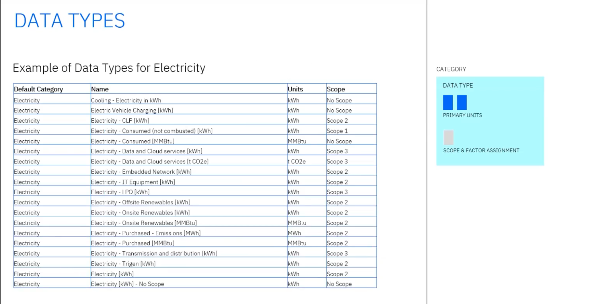

### Estilos de cuenta

Esquema de datos configurado sobre un tipo de datos Configurado **por cliente** para ofrecer flexibilidad para satisfacer diferentes requisitos de captura de datos

*   Define los campos de datos específicos que deben capturarse, divididos en campos primarios y secundarios.

*   Permite añadir desplegables para facilitar la captura de datos de varias unidades, listas de selección de divisas, etc.

*   Admite reglas para:

    *   Hacer obligatorios determinados campos
    *   Proporcionar valores por defecto
    *   Realizar operaciones matemáticas sencillas en la entrada para derivar un valor de campo basado en otros datos capturados.

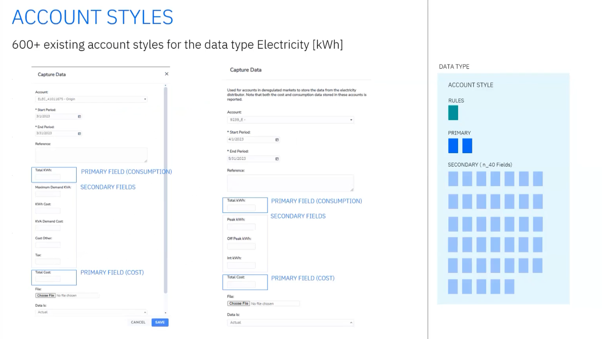

### Cuentas

Las cuentas son el punto final para el almacenamiento de datos en Envizi. Los datos capturados a través de la interfaz de usuario o los conectores se asocian a una cuenta.

*   Único por nombre e ID
*   Configurado a nivel de ubicación
*   Configurado con un tipo de datos y un estilo de cuenta específicos.
*   Al crear una nueva cuenta, elija primero el tipo de datos y, a continuación, el estilo de cuenta.
*   Sirve de punto final para el almacenamiento de datos cuando éstos se inyectan mediante captura manual o automatización a través de conectores.
*   Se utiliza como entidad informadora que se despliega a través de la jerarquía de agrupación.

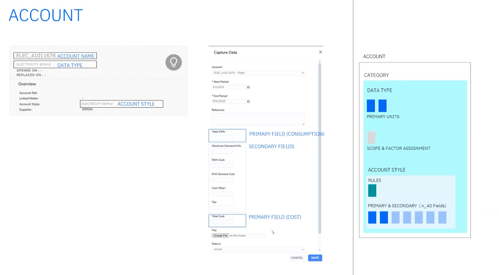

Continúe con [el laboratorio 105](/envizi/105).
