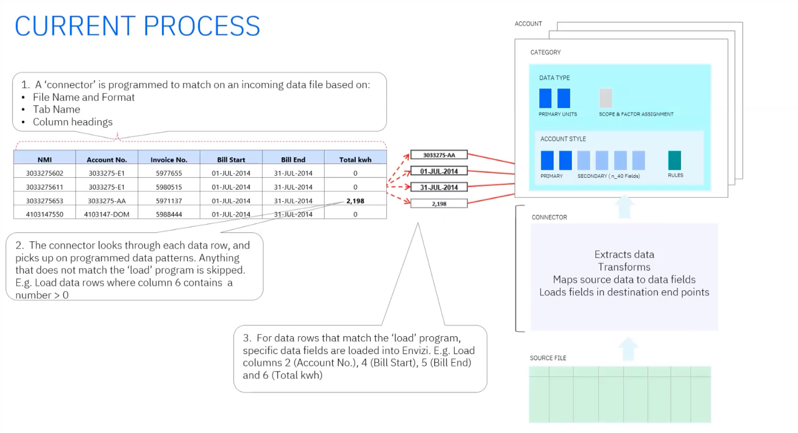
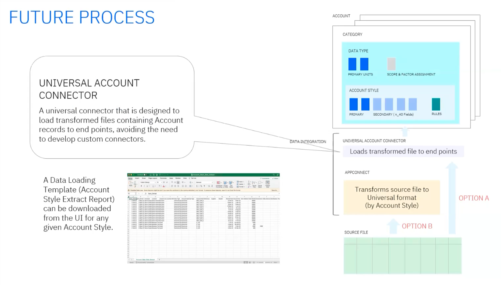

# Envizi data management and integration

The Envizi Technical Sales Intermediate badge demo displays the power of Envizi for identifying opportunities to ESG improvements, track ESG progress year over year, and perform ESG reporting in accordance with numerious ESG frameworks.  

Streamlined reporting and accelerated decarbonization depends on a comprehensive set of relevant ESG data.  The first step in crafting an Envizi solution is to build that data foundation.  This lab discusses the data management architecture within Envizi, and current and future options for loading data in an automated fashion. 

## Envizi Data model

The following is a quick explanation of the four key components of the Envizi data management system.

Flexible
Hierarchical in nature
Configured to meet client requirements

Each customer data model is mapped out during the onboarding process through customer consultation to determine the data types that would need to be captured and account styles needed to capture specific fields that might be either:
- Account styles mapped from supplier files that would be used in automated data collection
- fields needed to satisfy reporting requirements. 

### Data Types
Data Types are the foundational building block of Envizi's data model.

Configurable, but managed by envizi's product team.

Define:
- Data category to be managed (e.g. Water, Natural Gas, Electricity)
- Primary unit of measure (cost and consumption) to be recorded against the data type 
- Emissions scope (1, 2, or 3) and emissions factor assignment process for the data type if applicable. 

Social metrics or building information data types may have "No Scope".  

Scope and data category play a part in how the emissions factor is applied for that data in the platform. 

Envizi has an existing library of 4,000+ data types. The library is constantly expanding when necessary to meet client data collection needs.

### Account Styles
Data schema configured on top of a Data Type
Configured **per customer** to provide flexibility to meet different data capture requirements
- Defines the specific data fields to be captured, split in to primary and secondary fields.
- Can allow for drop-downs to be added to support things like multi-unit data capture, currency pick-lists, etc.
- Supports rules to:
  - Make certain fields mandatory
  - Provide default values
  - Perform simple math on input to derive a field value based on other captured data. 

### Accounts
Accounts are the end point for data storage within Envizi.  Data captured via UI or connectors is associated with an Account. 

- Unique by name and ID
- Configured at a location level
- Configured with a specific data type and account style.
- When creating a new account, first choose the data type, then the account style.  
- Serves as the end point for data storage when data is injested either by manual capture or automation via Connectors. 
- Use as reporting entity that rolls up through grouping hierarchy.

## Connectors 

There are several ways to capture data in Envizi.
- UI: is an option for entering smaller amounts of data in a one-off manner.  
- Bulk loading from a template

### Current Process
- Custom, per source system, per customer
- Highly specific
- Match the incoming data file based on name, format, headings, etc.
- Uses an S3 cloud storage bucket as the landing zone for files that should be consumed by the connector
- Scalability is lacking with this approach

### Coming Soon - End of Q2
Universal account connector - will require a standard template which varies by account style.

A data loading template (Account Style Extract Report can be downloaded from the UI for any Account Style). This will allow partners much more flexibility in how they want to get data into Envizi.

#### Option A
Source files are transformed by external systems or processes to match Envizi’s universal file format (varies by Account Style) and loaded directly via the Universal Account Connector.

#### Option B
Source files are transformed by a managed service using instances of App Connect to match Envizi’s universal file format (varies by Account Style) and loaded via the Universal Account Connector.
- App Connect transformation flows and monitoring services delivered by IBM Integration Services
- Set pricing based on number of data types in source file
- Custom integrations priced on request e.g. API interfaces

### Upcoming

- May 24th: Tag Management
- May 30th: PowerReport (pitching, pricing, scoping)

### Better Together: Turbonomic and Envizi
Continue to [lab 105](/envizi/105)
