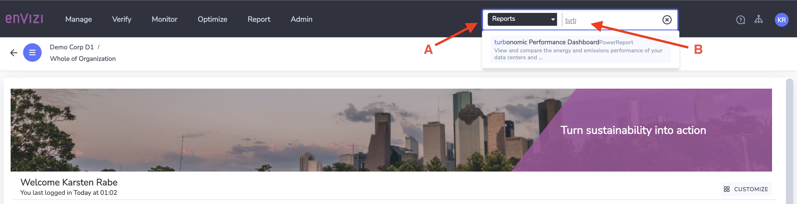
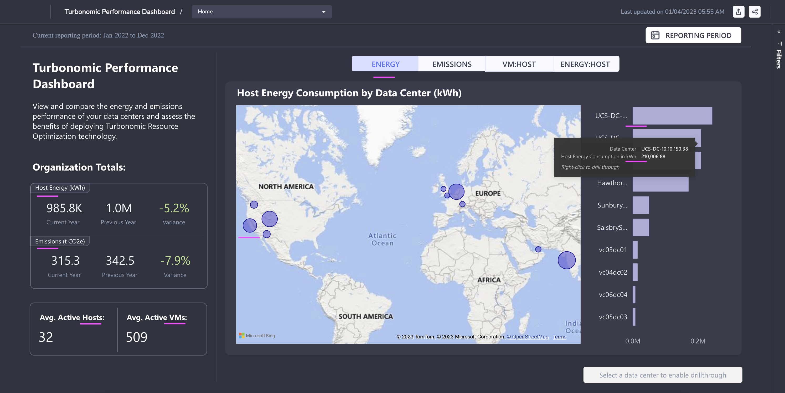
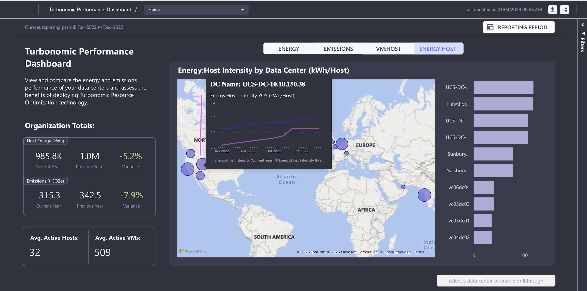
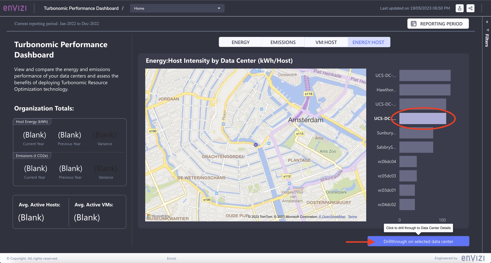
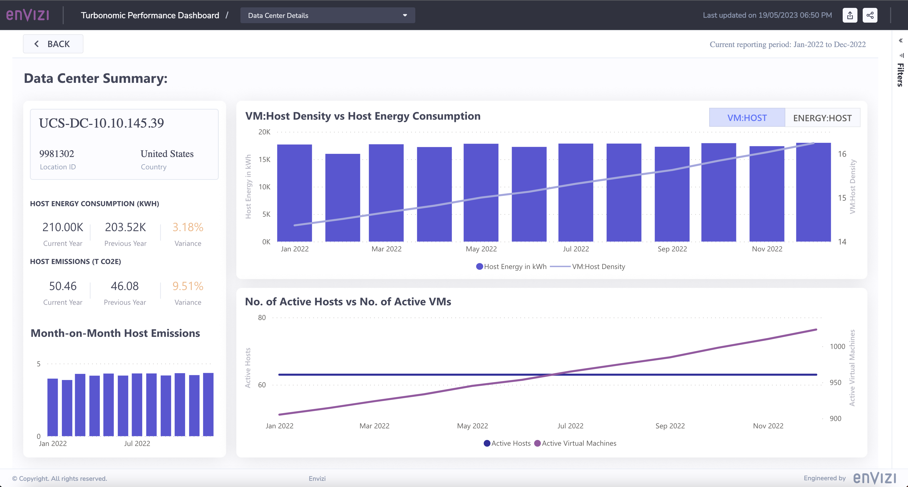
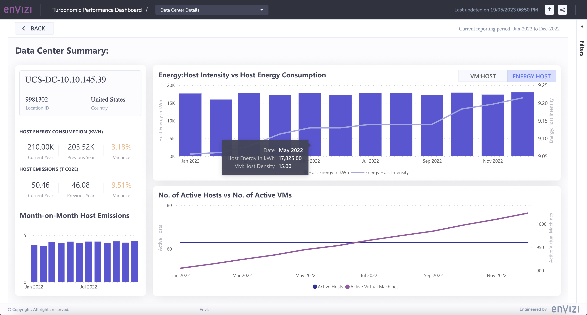
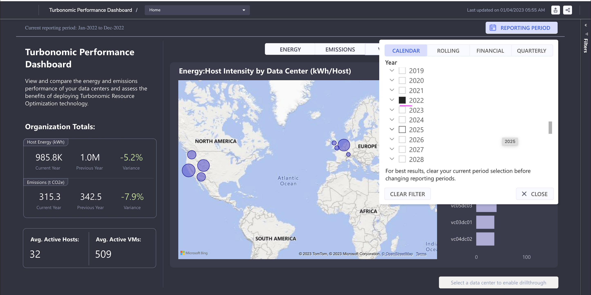

# Turbonomic Dashboard

## 1. Dashboard Home

To navigate to the Turbonomic dashboard:
- Select "Reports" in the dropdown (A)
- Start typing "Turbonomic" and select "turbonomic Performance Dashboard" (B)

 
 

The dashboard shows the entire organization's Host energy and emission details. 

#### Left Panel

The left side panel shows the following for the entire organization.

- `Host Energy` of Current Year (985.8K), Previous Year (1.0M) and variation (-5.2%)
- `Carbon Emissions`  of Current Year (315.3), Previous Year (342.5) and variation (-7.9%)
- `Average Active hosts` (32) and `Average Active VMs` (509)

So there is a reduction in Host energy consumption and Carbon Emissions  this year compared to previous year.

#### Center Panel

The center panel shows data centers marked in the map.

#### Right Panel

The right side panel shows the list of data centers ordered based on Host energy consumption.

### 1.1 Host Energy Consumption by Data Center

1. Click on any of the `data center` in the Map.

    The left side panel is updated with data center specific data.

- `Host Energy` of Current Year (171.8K), Previous Year (243.8K) and variation (-29.5%)
- `Carbon Emissions` of Current Year (39.7), Previous Year (51.1) and variation (-22.3%)
- `Average Active hosts` (47) and `Average Active VMs` (961)

    The right side panel also highlights the selected data center.

2. Mouseover the `data center` in the map shows the `Host energy Consumption` graph comparing with the previous year.

    The graph shows that `energy consumption` is less than last year.

### 1.2 Host Emissions by Data Center

1. Click on the `Emissions` tab in the Center panel.

    It refreshes the page with the Emissions details. There is no change to the left panel as it is already showing emission details.

2. Mouseover the `data center` in the map shows the `Emissions graph` comparing with the previous year.

    The graph shows that emissions are less than last year.

### 1.3 VM:Host Density by Data Center

1. Click on `VM:HOST` tab and it shows `VM and Host density` in the Data center.

    When more VMs are provisioned in a Host then it would be a effective utilization of the resources. Turbonomic helps to identify the scattered VMs and take appropriate actions.

2. Mouseover the data center in the map shows the `VM:Host` density comparing with the previous year.

### 1.4 Energy:Host Intensity by Data Center

1. Click on the `Energy:Host` tab in the Center panel.

2. Mouseover on the data center in the map shows the Energy:Host Intensity comparing with the previous year.

## 2. Data Center Summary

Lets look at the data center summary report.

1. Click on any of the data center in the right panel.

2. Click on `Drillthrough on selected data center` button.

This brings us to the `Data Center Summary` page.

#### Left Panel

The left side panel shows the following info related to the selected data center.

- Name of the Data center
- Location Id
- Country
- `Host Energy` of Current Year (210.00K), Previous Year (203.52K) and variation (3.18%)
- `Carbon Emissions` of Current Year (50.46), Previous Year (46.08) and variation (9.51%)
- Month on Month Host emissions graph.

#### Center Panel

The top of the Center Panel shows `VM:Host Density vs Host Energy Consumption` graph.

The bottom of the Center Panel shows `No. of Active Hosts vs No. of Active VMs` graph.

### 2.1 VM:Host Density vs Host Energy Consumption

1. Click on any of the month in the left panel.

The center panel get refreshed.

2. Mouseover the in the `No. of Active Hosts vs No. of Active VMs` section of the graph. It shows 
- The `Active Hosts` of the month is `63`
- The `Active VMs` of the month is `998`

3. Mouseover the in the `VM:Host Density vs Host Energy Consumption` section of the graph. It shows
- The `Host Energy` of the month is `17,932.33`
- The `VM Density` of the month is `15.84`

### 2.2 Energy:Host Intensity vs Host Energy Consumption

1. Click on the `Energy:Host` tab in the Center panel.

3. Mouseover the in the `Energy:Host Intensity vs Host Energy Consumption` section of the graph. It shows
- The `Host Energy` for May 2022 is `17,825.00`
- The `VM Host Density` of the month is `15.00`

## 3. Reporting Period 

You can change the report period to show the data between the selected dates.

#### Integrating Turbo with Envizi via AppConnect for Green IT data

[This blog](https://community.ibm.com/community/user/envirintel/blogs/jeya-gandhi-rajan-m1/2023/03/23/integrating-turbo-with-envizi-via-appconnect) explains the step-by-step instructions to pull green IT data from Turbonomic into Envizi via App Connect.

 
