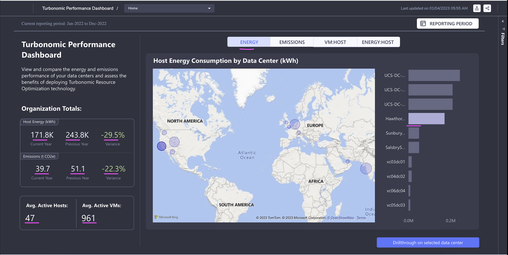
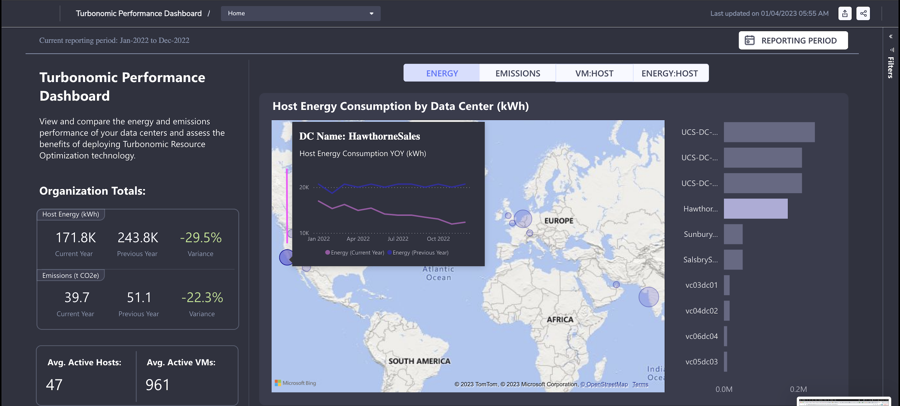
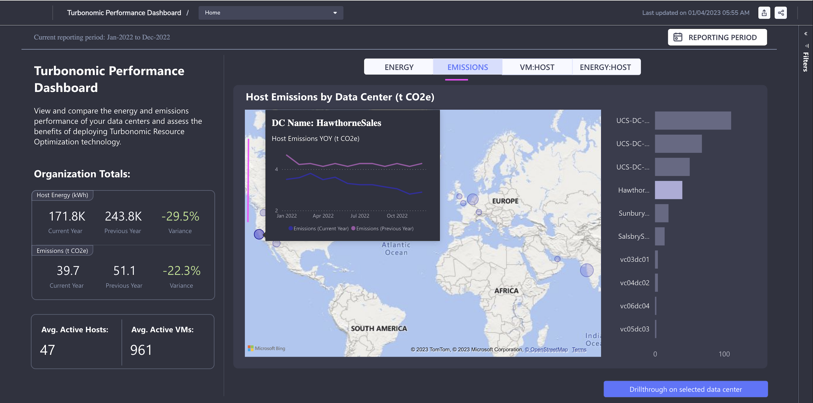
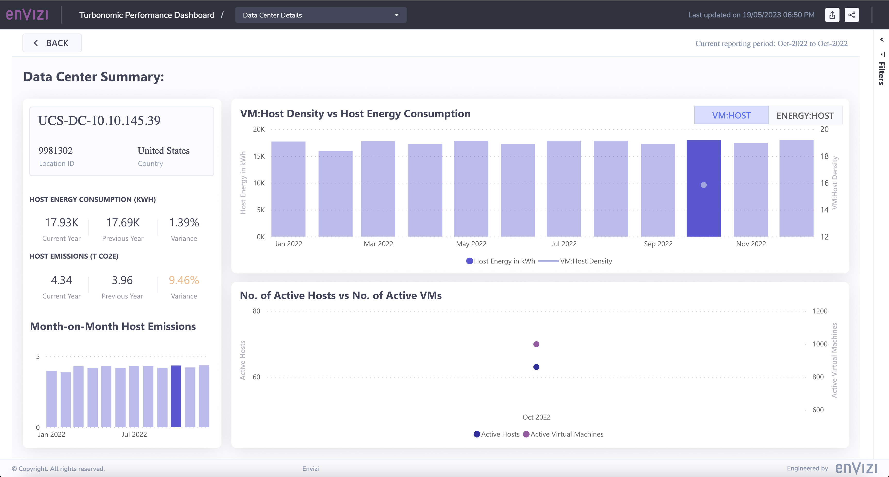

# 106: Cuadro de mandos de Turbonomic

## 1. Inicio del cuadro de mandos

Para navegar al panel de control de Turbonomic:

*   Seleccione "Informes" en el menú desplegable (A)
*   Empiece a escribir "Turbonomic" y seleccione "Turbonomic Performance Dashboard" (B)

El cuadro de mandos muestra los datos de energía y emisiones de Host de toda la organización.

### Período de referencia

Nota: puede cambiar el periodo del informe para mostrar los datos entre las fechas seleccionadas.

#### Panel izquierdo

El panel de la izquierda muestra lo siguiente para toda la organización.

*   `Energía huésped` del año en curso (985,8K), del año anterior (1,0M) y variación (-5,2%)
*   `Emisiones de carbono` del año en curso (315,3), del año anterior (342,5) y variación (-7,9%)
*   `Media de``hosts activos` (32) y `media de máquinas virtuales activas` (509)

Así pues, este año se ha reducido el consumo de energía y las emisiones de carbono en comparación con el año anterior.

#### Panel central

El panel central muestra los centros de datos marcados en el mapa.

#### Panel derecho

El panel de la derecha muestra la lista de centros de datos ordenados en función del consumo de energía del host.

### 1.1 Consumo de energía del host por centro de datos

1.  Haga clic en cualquiera de los `centros de` datos del Mapa.

    El panel lateral izquierdo se actualiza con los datos específicos del centro de datos.

*   `Energía` huésped del año en curso (171,8K), del año anterior (243,8K) y variación (-29,5%)

*   `Emisiones de carbono` del año en curso (39,7), del año anterior (51,1) y variación (-22,3%)

*   `Media de``hosts activos` (47) y `media de máquinas virtuales activas` (961)

    El panel lateral derecho también resalta el centro de datos seleccionado.

2.  Al pasar el ratón sobre el `centro de datos` en el mapa, se muestra el gráfico de `consumo de energía del host` en comparación con el año anterior.

    El gráfico muestra que `el consumo de energía` es inferior al del año pasado.

### 1.2 Emisiones del host por centro de datos

1.  Haga clic en la pestaña `Emisiones` del panel central.

    Se actualiza la página con los detalles de las emisiones. No hay ningún cambio en el panel izquierdo, ya que ya muestra los detalles de las emisiones.

2.  Al pasar el ratón por el `centro de datos` en el mapa se muestra el `gráfico de emisiones` comparado con el año anterior.

    El gráfico muestra que las emisiones son inferiores a las del año pasado.

### 1.3 Densidad VM:Host por centro de datos

1.  Haga clic en la pestaña `VM:HOST` y se mostrará la `densidad de VM y Host` en el centro de datos.

    Cuando se aprovisionan más máquinas virtuales en un host, se produce una utilización eficaz de los recursos. Turbonomic ayuda a identificar las máquinas virtuales dispersas y a tomar las medidas adecuadas.

2.  Al pasar el ratón por el centro de datos en el mapa, se muestra la densidad `VM:` Host en comparación con el año anterior.

### 1.4 Intensidad energía:host por centro de datos

1.  Haga clic en la pestaña `Energía:Host` del panel central.
2.  Al pasar el ratón sobre el centro de datos en el mapa, se muestra la Intensidad Energía:Host en comparación con el año anterior.

## 2. Resumen del centro de datos

Veamos el informe de resumen del centro de datos.

1.  Haga clic en cualquiera de los centros de datos del panel derecho.
2.  Haga clic en el botón `Drillthrough on selected data center`.

Esto nos lleva a la página `Resumen del Centro de Datos`.

#### Panel izquierdo

El panel de la izquierda muestra la siguiente información relacionada con el centro de datos seleccionado.

*   Nombre del centro de datos
*   Ubicación Id
*   País
*   `Energía` huésped del año en curso (210,00K), del año anterior (203,52K) y variación (3,18%)
*   `Emisiones de carbono` del año en curso (50,46), del año anterior (46,08) y variación (9,51%)
*   Gráfico Mes a Mes de las emisiones de Host.

#### Panel central

La parte superior del Panel Central muestra el gráfico `Densidad VM:Host vs Consumo de Energía del Host`.

La parte inferior del Panel Central muestra el gráfico `Nº de hosts activos vs Nº de máquinas virtuales activas`.

### 2.1 Densidad VM:Host vs Consumo de Energía del Host

1.  Haga clic en cualquiera de los meses del panel izquierdo.

El panel central se refresca.

2.  Pase el ratón por encima de la sección Número de `hosts activos frente a Número de máquinas virtuales activas` del gráfico. Muestra

*   Los `Anfitriones Activos` del mes son `63`
*   Las `máquinas virtuales activas` del mes son `998`

3.  Pase el ratón por encima de la sección `VM:Host Density vs Host Energy Consumption` del gráfico. Muestra

*   La `Energía Anfitriona` del mes es de `17.932,33`
*   La `Densidad VM` del mes es de `15,84`

### 2.2 Energía:Intensidad del host frente a consumo energético del host

1.  Haga clic en la pestaña `Energía:Host` del panel central.

3.  Pase el ratón por encima de la sección `Energía:Intensidad del host frente al consumo de energía del host` del gráfico. Muestra

*   La `energía de acogida` para mayo de 2022 es de `17.825,00`
*   La `densidad de hosts VM` del mes es de `15,00`

Enhorabuena! Has terminado con los laboratorios Envizi.
