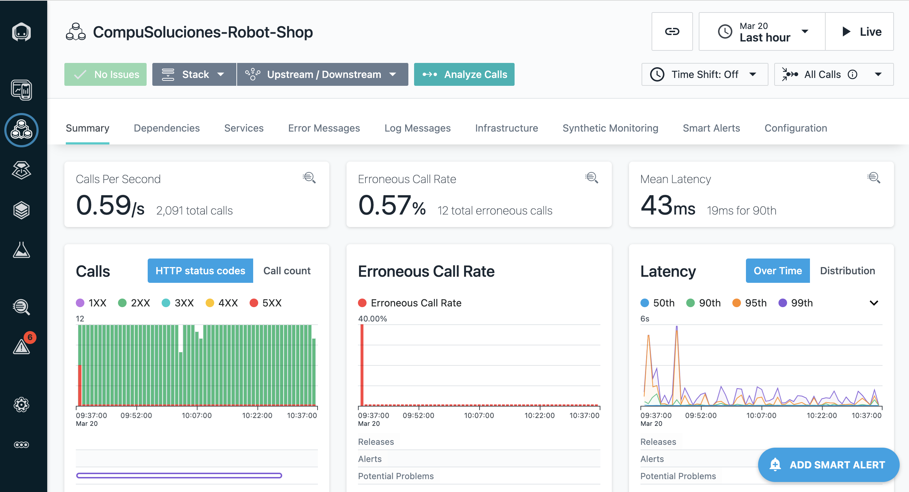
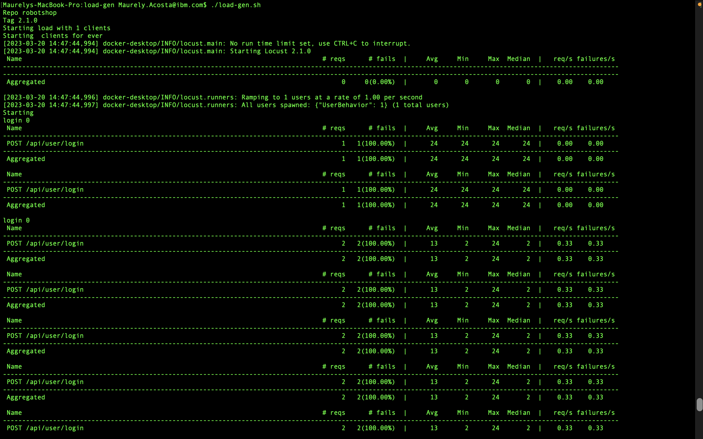
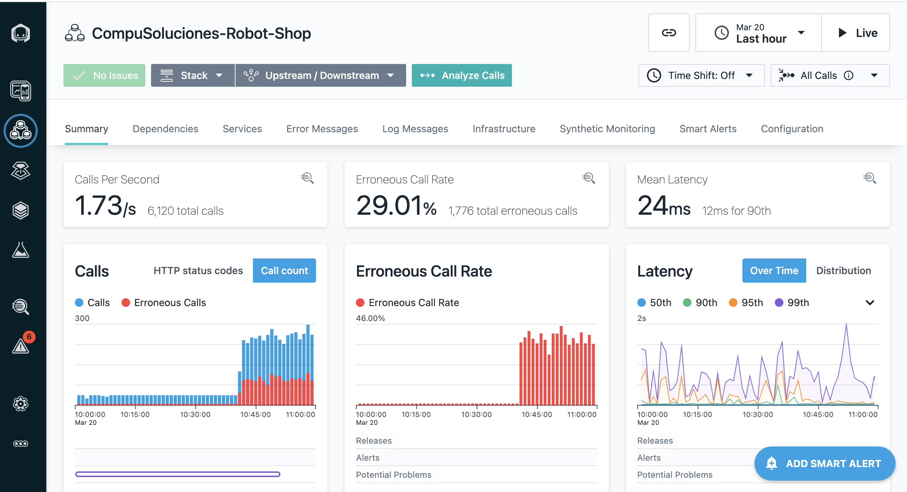

# 103: Load Testing and Chaos

## Analyzing A Load Test Using Instana

The application perspective provides you with an overview dashboard that gives you a useful first impression of the load test scenario.

Instana will give you live insights about your entire platform allowing you to instantly understand the consequences of your load test.

We will be conducting a small test on the robot shop platform provided by ([Instana](https://github.com/instana/robot-shop/tree/master/load-gen)).:

1. Run the load generation script provided by Instana

   In a terminal run this command `./load-gen.sh` under your version of robot-shop in the `load-gen` folder.

   The script output should look like the following image:

   

2. In your application perspective for robot shop, you should see the number of calls have increased and the errorneous calls have also increased.

   

3. CPU Utilization and Context Switches during the load test

   

   When the memory is completely consumed, the system starts trying to deal with the situation.

   The CPU consumption rises and the **context switching** becomes more of an issue, until it completely gets out of control. At this point it is pretty clear what the root cause for the behavior of the Application is – there are not sufficient hardware resources to handle the load. This makes sense keeping in mind that our huge technology stack is running on a small machine.

4. View all API traces

   Let’s explore an API trace by selecting it from the _Top Traces_ list to see details about those requests.
   With a single click on the link, we slice through the tracing data to get only the relevant traces. We can derive from the overview, which service is involved and the latency for each of the erroneous calls.

   

   A load test, as realistic as it might be, is only worth as much as you can get out of its analysis. Since Instana makes this process even easier, it is a perfect match for load testing
