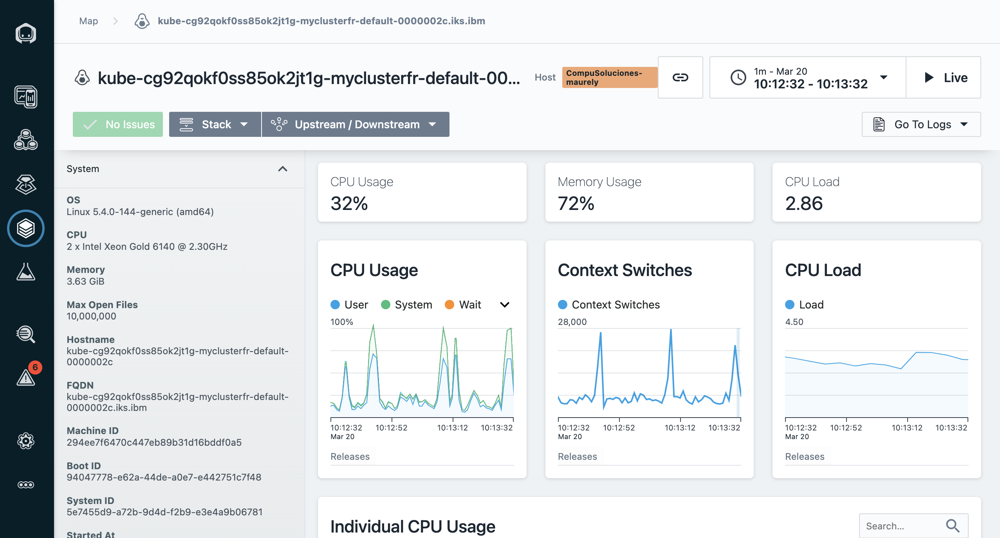
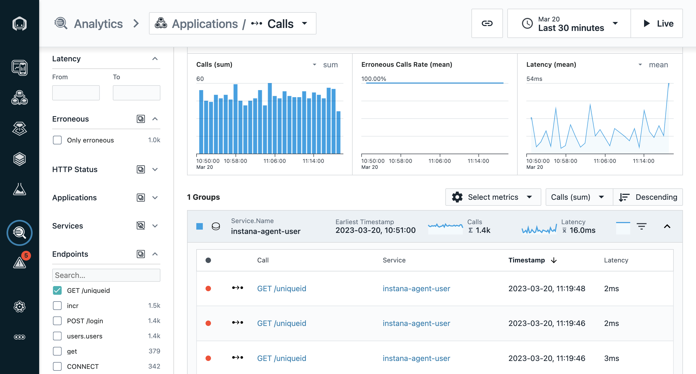

# 104: Pruebas de capacidad y caos

## Analizando una prueba de capacidad usando Instana

La perspectiva de la aplicación le ofrece un panel general que le da una primera impresión útil del escenario de la prueba de capacidad.

Instana le ofrecerá información en tiempo real sobre toda su plataforma, lo que le permitirá comprender al instante las consecuencias de su prueba de capacidad.

Llevaremos a cabo una pequeña prueba en la plataforma de tienda robótica facilitada por ([Instana](https://github.com/instana/robot-shop/tree/master/load-gen)).

1. Ejecute el script de generación de capacidad ofrecido por Instana

En un terminal ejecute este comando `./load-gen.sh` bajo su versión de robot-shop en el directorio `load-gen`.

La salida del script debe parecerse a la siguiente imagen:

2. En la perspectiva de la aplicación para la tienda del robot, debería ver que el número de llamadas ha aumentado y que las llamadas erróneas también han aumentado.

   

3. Utilización de la CPU y cambios de contexto durante la prueba de capacidad

   

Cuando la memoria se consume por completo, el sistema empieza a intentar solucionar la situación.

El consumo de CPU aumenta y el **cambio de contexto** se convierte en un problema cada vez más grave, hasta que se descontrola por completo. En este punto está bastante claro cual es la causa raíz del funcionamiento de la Aplicación - no hay suficientes recursos de hardware para manejar la capacidad . Esto tiene sentido teniendo en cuenta que nuestra enorme pila tecnológica se está ejecutando en una máquina pequeña.

4. Ver todas las trazas de API

Exploremos una traza API seleccionándola de la lista _Top Traces_ para ver detalles sobre esas solicitudes.
Con un solo clic en el enlace, cortamos a través de los datos de rastreo para obtener sólo las trazas relevantes. De la vista general podemos deducir qué servicio está involucrado y la latencia de cada una de las llamadas erróneas.

Una prueba de capacidad, por muy realista que sea, sólo vale lo que se puede sacar de su análisis. Dado que Instana facilita aún más este proceso, es un complemento perfecto para las pruebas de capacidad.
