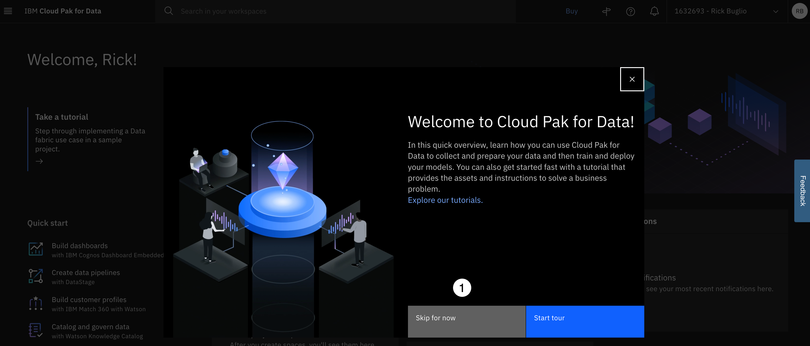
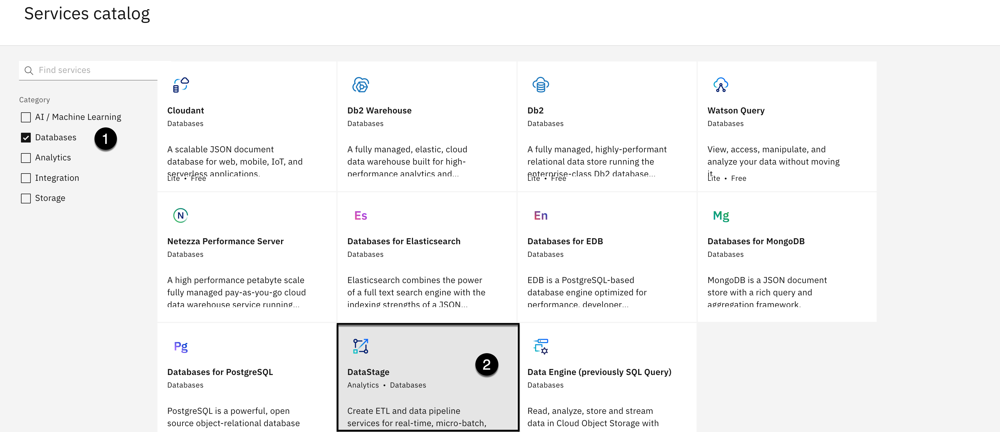
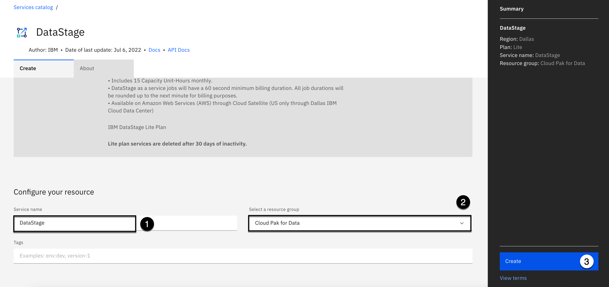
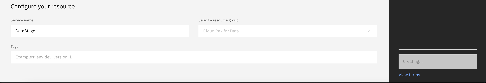
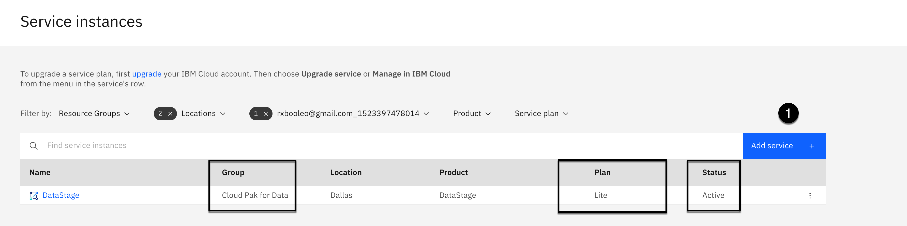

# 100: Technical Lab Preparation

This section instructs you on how to prepare your **IBM Cloud** and **Cloud Pak for Data as a Service** environments to perform the Data and AI **Data fabric labs**.

These tasks are a pre-requisite in order to perform **any** of the **Data fabric labs** successfully. These labs are **not** done in the shared, multi-user, pre-configured **Data and AI Live Demos** environment. That environment, which requires a reservation request, is primarily a read only environment that is used exclusively for the **Data fabric demos**. These technical labs require more flexibility and this is why you have to prepare your own Cloud Pak for Data accounts to do these labs.

You will need an **IBM Cloud** and **IBM Cloud Pak for Data as a Service** account to do these technical **Data fabric labs**. Depending on your account status, follow the steps below so you can use your personal IBM Cloud and Cloud Pak for Data as a Service account. This ensures that there will be zero conflicts with other users and services, that you have the proper cloud and Cloud Pak for Data as a Service privileges, and that no special naming conventions or processing will be needed for you to complete these technical labs.

To prepare your personal IBM Cloud and Cloud Pak for Data environments for these technical labs, you will perform the following steps:

1. Setup your personal IBM Cloud account.
2. Setup your personal IBM Cloud Pak for Data as a Service account.
3. Provision the IBM Cloud and Cloud Pak for Data as a Service Lite services.
4. Create the Cloud Pak for Data **Platform assets catalog**.
5. Create the **Platform connections** to the Data and AI Live Demos data sources.

Warning: Cloud Park for Data does not support Apple's **Safari** browser. You must use one of the following supported browsers:

- Mozilla Firefox (recommended) - Version 69 and higher
- Google Chrome - Version 80 and higher
- Microsoft Edge - Version 95 and higher

## Obtain an IBM Cloud Account

> If you have an IBM Cloud account you can skip this step.

If you **do not** have an IBM Cloud account, [click this link](https://cloud.ibm.com/registration) to create one. After registration, you will be sent an email to activate your account. This can take a few hours to process. Once you receive the confirmation email, follow the instructions provided in the email to activate your account.

## Sign Up for Cloud Pak for Data

The **Data and AI Live Demos** use Cloud Pak for Data services that are provisioned in the IBM cloud **Dallas** service region. This means you must use Cloud Pak for Data in the **Dallas** region, and register you account for a Cloud Pak for Data as a Service account in the **Dallas** region to do the Data fabric labs, **even** if you have an account in another region.

> If you have an IBM Cloud Pak for Data as a Service account in the Dallas region you can skip this step.

If you have **not** signed up for an IBM Cloud Pak for Data as a Service account in the **Dallas** region, [click this link](https://dataplatform.cloud.ibm.com/registration/stepone?context=cpdaas&apps=all) to sign up for one in the **Dallas** region.

Follow the instructions below to complete the account registration process and setup your account in the Dallas region:

1. Use the **Select a region** dropdown to select the **Dallas** region for your Cloud Pak for Data instance.
2. Select the checkbox to agree to the terms.
3. Click the **Log in** with your **IBMId** button.

1. Enter your **IBMid**. This should be your IBM Cloud Id.

- If you have previously logged in to Cloud Pak for Data and checked the **Remember IBMid** check box, it may already be filled in for you. If you have multiple Cloud Pak for Data accounts, you can click inside the **IBMid** area above the **Continue** button and a list of your available IBM Ids will be displayed for you to choose from.

2. Click the **Continue** button.

> If prompted, and depending on the authentication method you are presented with, enter your IBMId or IBM w3id **password**.

If you have not logged in to Cloud Pak for Data in a while, you might be presented with an IBM Privacy Statement that you have to agree to. If so, follow these steps:

1. Scroll **down** to the bottom of the privacy statement page.
2. Click the **Proceed** button.

You will see the **Provisioning your IBM Cloud Pak for Data core services** screen with a progress bar.

When **Done!** appears above the progress bar with a message of: **Your IBM Cloud Pak for Data apps are ready to use**:

1. Click the **Go to IBM Cloud Pak for Data** button.

If you are presented with a **Welcome to Cloud Pak for Data!** dialog:

1. Click the **Skip for now** button.

Now that you have an activated IBM Cloud account and have registered for a Cloud Pak for Data account in the **Dallas** region, you can proceed to the next step to request a reservation.

## Provision the Services

This step instructs you on how to provision the **free** IBM Cloud and Cloud Pak for Data **Lite** services that you will need to perform the technical **Data fabric labs**. These instructions were created using an empty IBM Cloud and Cloud Pak for Data account with no services provisioned for the benefit of those who have never setup their accounts with provisioned services. Therefore, your environment may look different than the screen shots in these instructions, but the end result should be the same.

Not all of the **Lite** service plans are in every cloud service region. For example, the IBM Match 360 with Watson and Watson OpenScale services are only available in the **Dallas** region. DataStage is only available in the **Dallas** and **Frankfurt** regions. Therefore, as you can imagine, this is a chaotic matrix of service availability. Therefore, to ensure inclusion, consistency, simplicity, and predictability, the **Data fabric labs** requires that **all** of the **Lite** services are provisioned in the **Dallas** region.

Some services take longer than others to provision, so do not be alarmed if a service status does not instantly appear after you provision them, or they have a status of **Provisioning**. By the time you are done provisioning all the required services they should all be in an **Active** status.

Lastly, if you make a mistake and choose a pricing plan other than the **Lite** plan, or assigned a service to the wrong resource group, you can **delete** the service from the Cloud Pak for Data **Services instances** section and re-provision the service again. All other changes, like renaming a service, have to be managed from your IBM Cloud account.

### 1. Required Services

For the technical labs, you will need to provision the following services:

| Service Catalog Category | Service Catalog Service Name  |
| ------------------------ | ----------------------------- |
| AI / Machine Learning    | Watson OpenScale              |
| AI / Machine Learning    | Watson Studio                 |
| AI / Machine Learning    | Watson Knowledge Catalog      |
| AI / Machine Learning    | IBM Match 360 with Watson     |
| AI / Machine Learning    | Watson Machine Learning       |
| Databases                | Db2                           |
| Databases                | Watson Query                  |
| Databases                | DataStage                     |
| Analytics                | IBM Cognos Embedded Dashboard |
| Storage                  | Cloud Object Storage          |

> If you already have any of the services listed above already provisioned in your cloud account in the **Dallas** region, you can **skip** provisioning that service.

All of the services listed in the table above can be provisioned and maintained directly from the **Services** section of your Cloud Pak for Data account. After provisioning these services, you will remain in your Cloud Pak for Data account **except** when you provision the **Cloud Object Storage** service (which is why you provision it last). Since the Cloud Object Storage service is a global cloud service, Cloud Pak for Data will take you to your IBM Cloud account in a new tab (or window) in your browser to provision it.

### 2. DataStage Service

The following instructions walk you through provisioning the **DataStage** service as an example. The remaining service provisioning instructions **do not** supply detailed screen shots. Only the required service properties and suggested names will be supplied to provision the remaining **8** required services. With that in mind, take the time to follow the detailed **DataStage** instructions so the other services will be easy to provision.

1. In your Cloud Pak for Data home screen, select the **Navigation** menu (the 4 stacked horizontal lines in the upper left corner).

1. Select the **Services > Services catalog** menu item.

1. Select the **Databases** checkbox on the left.
2. Click the **DataStage** service tile (it's likely at the bottom).

1. Using the **Select a region** dropdown, select the **Dallas** region from the list.
2. Scroll **down** the service page.

1. Select the **Lite** plan by clicking on this plan's tile. You will see a checkmark appear on the right of the Lite plan.

1. For the **Service name**, enter any name you want or accept the supplied default.

> This example removes the --xx default characters at the end of the service name and simply names it DataStage. You can name the service whatever you want, or take the default name.

2. Using the **Select a resource group** dropdown, select a resource group from the list or take the default displayed.

> Services have to be assigned to a cloud account resource group. IBM Cloud automatically creates a resource group when you register for an IBM Cloud account. This resource group is named **Default**. If you have not created any additional resource groups, or renamed the **Default** resource group, you will only have one resource group and it will be automatically chosen for you and greyed out.

This example shows a resource group named **Cloud Pak for Data** from the list because the cloud account, where these screen shots that were taken from, has multiple resource groups defined.

3. Click the **Create** button.

The **Create** button will be greyed out and turn to **Creating**.

Upon successful completion, you will be taken to your Cloud Pak for Data account **Service instances** section. **Make sure** (look at the **highlighted columns** on the screen shot) you deployed a **Lite** service **Plan**, that it was placed in the **Resource Group** you specified, and that the service **Status** is **Active**.

1. Click the **Add service +** button to create any additional required **Data fabric lab** services in the **Required Services** table above.

Repeat the process you just followed to deploy the **DataStage** service for all the remaining required services using the information for each service. The **Service name** provided in the information for each service is only a recommendation. You can name these services whatever you want and assign them to whatever resource group you want. However, **make sure** you choose the **Lite** plan so you do not get charged for the services you provision.
