# 101: Accessing data

## Introduction

As a data scientist, you have been assigned to analyze employee attrition at your retail electronics company. In 2018, your company, facing severe attrition, built a model to predict which employees would leave the company, allowing the human resources department to proactively work to retain them. However, the model has lost some of its predictive power thanks to changing conditions such as the COVID-19 pandemic, subsequent emphasis on remote work, and supply chain disruptions.

You will need to work with data from across the enterprise to develop potential replacement models. You will deploy and evaluate those models, and track them throughout their lifecycle, gathering metrics and metadata to help determine if and when they are ready to be deployed into production.

## Prerequisites

> Note: The content below can be completed entirely using free services; however, you will likely exceed your monthly free data allowance for Watson Studio. If at all possible, use a paid account instance of Watson Studio. Otherwise, you may need to wait until your data credits refresh to finish the lab.

Before you can proceed, you need to set up your environment. This involves importing a project and setting up its machine learning service. This lab has been built on Cloud Pak for Data as a Service (Cloud). For on-premises environments, platform details such as API key creation and data access via object storage will differ, but the vast majority of the lab is still applicable. It is expected that you complete this lab on the cloud.

### 1. Download the project file

Throughout this lab, you will use a Watson Studio project. This project has been prebuilt, and is provided for you in a zip file that is located in the **Data and AI Live Demos** GitHub repository. Before proceeding, please download the [Trusted-AI-L3-Tech-Lab.zip](https://github.com/CloudPak-Outcomes/Outcomes-Projects/raw/main/TrustedAI-L3-Tech-Lab/Trusted-AI-L3-Tech-Lab.zip) project file.

### 2. Log in to Cloud Pak for Data

If you have not already done so, using the instructions and the screenshots below, log in to [IBM Cloud Pak for Data](https://dataplatform.cloud.ibm.com/). You will use **your personal** Cloud Pak for Data as a Service account in the **Dallas** region to do the lab.


1. Using the **Work with resources** in this IBM Cloud region: dropdown, select the **Dallas** region.

   - This is **very important** because all of the cloud services that you were instructed to provision in the [Getting started instructions](/mlops/100), should be provisioned in the **Dallas** region.

2. Enter your **IBM ID** that you used to sign up for Cloud Pak for Data.

   - This should be your personal IBM Cloud ID. If you have logged in to Cloud Pak for Data previously and checked the **Remember IBMid** check box, it may already be filled in for you. If you have multiple Cloud Pak for Data accounts you can click inside the IBMid area above the **Continue** button and a list of available IBM IDs will be displayed for you to choose from.

3. Click the **Continue** button

If your IBM ID is recognized as an IBM w3id (internal IBM w3 intranet id), you will be prompted to enter your password using the w3id on IBM Security Verify dialog:


1. Enter the **password** for your IBM w3id.
2. Click the **Sign in** button.

If your IBM Id is **not** an IBM w3id, you will be prompted to enter your password using the standard IBM Security Verify dialog:


1. Enter the **password** for your IBM ID.
2. Click the **Log in** button

### 3. Validate Your Environment

You will be brought to the Cloud Pak for Data home page. If at any point during these instructions you get a pop-up message from **Cloud Pak for Data** asking to guide or assist you, dismiss it and simply follow the steps in the instructions.

#### Make sure you are in your personal cloud account


You can be a member of many cloud accounts. This lab is done from your personal cloud account. The account displayed should show **Your cloud account ID - Your name**. For example, in the screen shot above, the personal account is **1792871 - Rick Buglio**. If your personal account is selected, like the screen shot above, you can proceed to the next step. If not, follow the instructions below to switch to your personal account. Note that the full menu bar including your account details and region may only appear if your browser window is maximized.

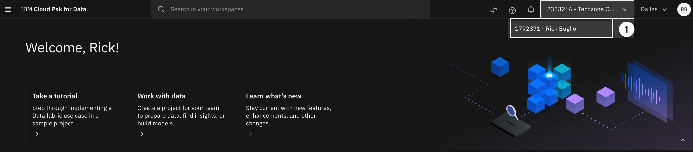

In the screenshot above, the user is in the **Techzone Outcomes** cloud account and needs to switch to their personal account. This is a common scenario because IBM sellers and business partners could still have a reservation in the Data and AI Live Demos (**Techzone Outcomes**) cloud account to do the Data Fabric Level 2 sales demos. When you login to Cloud Pak for Data, it remembers the last account you logged into, so it's a good practice to check what account you are in before proceeding.

1. Using the **Cloud account** dropdown on the toolbar, select **your personal** cloud account.

#### Make sure you are in the Dallas region

This is **very important**. Based on the [Getting started](/mlops/100) instructions, you should have your services provisioned in the **Dallas** region.

You **cannot** work across cloud service regions in Cloud Pak for Data as a Service. Only **global services**, like **Cloud Object Storage**, can be used across cloud service regions. Therefore, your services must **all** be in the same region for you to complete this lab.


In the screen shot above, the user is in the **London** region and needs to switch to the **Dallas** region. If your region is **not set** to the **Dallas** region perform the following steps:

1. Using the **Region dropdown** on the toolbar, select the **Dallas** region.

### 4. Import the lab project

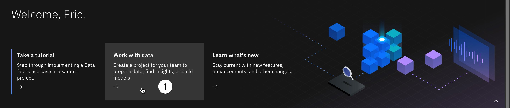

1. From the Watson Studio Cloud welcome screen, click on **Work with data**.
2. Click on **Create a project from a sample or file**.

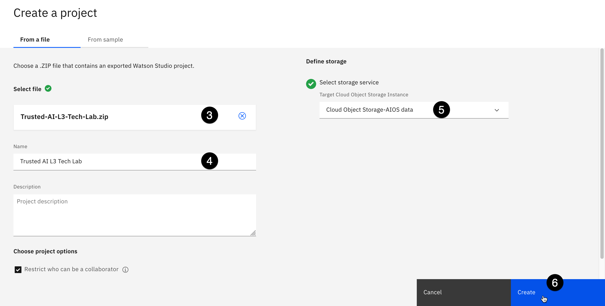

3. In the **Upload file** section, drop in the **Trusted-AI-L3-Tech-Lab.zip** file you've just downloaded.
4. In the **Name** field, give the project a name. For example: "Trusted AI L3 Tech Lab".
5. Use the **Select storage service** dropdown to select your Cloud Object Storage instance.
6. Click on **Create**. The project will be imported, which will take about a minute.

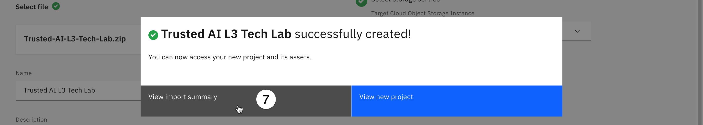

7. When the import has finished, click on **View import summary**.

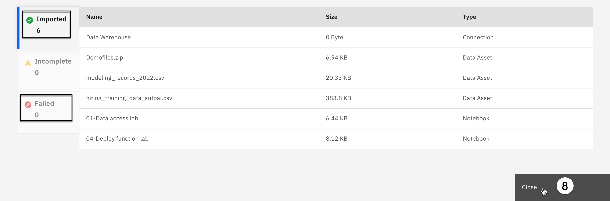

8. Verify that all assets have been successfully imported. If they have, click **Close** and move to step 11. If one or more assets has failed to import, proceed to step 9.

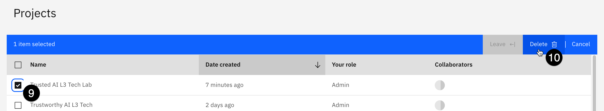

9. If one or more assets failed to import, go to your [list of projects](https://dataplatform.cloud.ibm.com/projects) and select the checkbox associated with the new project.
10. Click the blue **Delete** button in the top right and follow the prompts on screen to confirm deletion. Return to the [new project screen](https://dataplatform.cloud.ibm.com/projects/new-project?context=cpdaas) and repeat this section, starting from step 2.
11. Once your project has been successfully imported, you may proceed with the rest of the lab.

### 5. Add your Watson Machine Learning (WML) service

The WML service was created earlier as described on the [Getting started](/mlops/100) page.

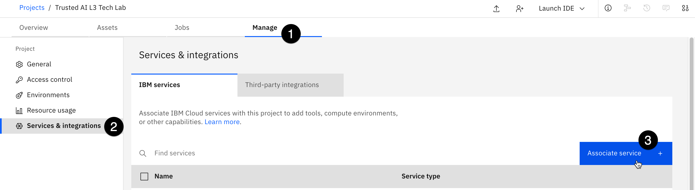

1. In your new project, select the **Manage** tab.
2. Select Services & integrations from the left menu bar.
3. Click on the blue Associate service button on the right.

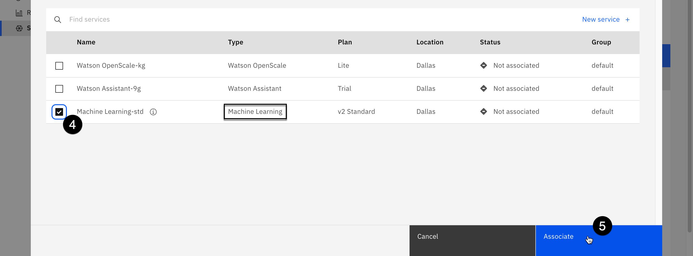

4. Click on the checkbox associated with the **Machine learning** service you provisioned. Note that you may have multiple services listed here, so be sure to select one with **Machine Learning** in the **Type** column of the table.
5. Click on the blue **Associate** button at the lower right of the screen.

## Accessing data

Data science is nothing without data. In this section, you will learn how to make data assets available in a project and how to access the data through a notebook. Data can also be accessed through other available tools, which is covered in the [No-code and low-code solutions](/mlops/103) section of this lab.

Cloud Pak for Data accesses data through two forms: files and connections. Files are **not** limited to the comma separated values (csv) format. For example, data can come as archives in a compressed zip or tar format.

Connections are access points to different repositories. Here is a **partial list** of the connections available in Cloud Pak for Data as a Service:

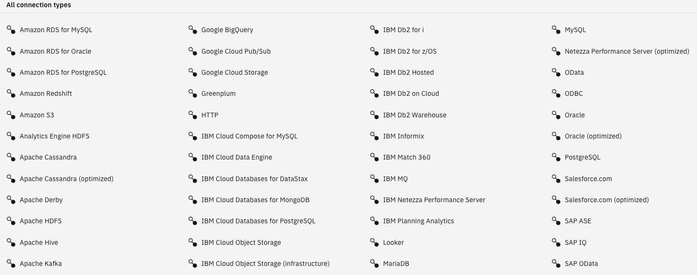

### 1. Add a connection to a project

In the **Getting started** section of the labs, you were instructed to create a Db2 service. This is the database service used in this lab. It's a perfect example of creating and accessing a connection.

Enterprises have critical data sets spread over multiple repositories; to add more complexity, those data assets can reside on-premises or in the cloud. It is critical for data science practitioners to have easy access to this data, while keeping the data in its original location to reduce cost and complexity. Copying the data leads to confusion, where, for example, users would not know if they are using the most up-to-date data. As the number of data copies increases with the number of projects in the enterprise, it leads to confusion on which copy represents the real version of the truth. Over time, different copies of the same data leads to partial versions of the truth, which makes it nearly impossible to decipher.

As shown earlier, Cloud Pak for Data supports a wide variety of connection types. Let's see how to create a connection.

1. Get the credentials for your Db2 service. Open the [Services and software resource list](https://cloud.ibm.com/resources?groups=resource-instance) from the IBM Cloud console.
2. Click on the **Db2 service**.

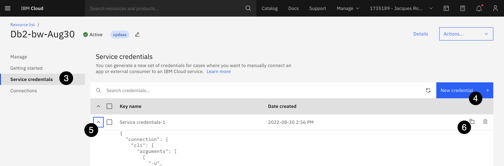

3. In the left side panel, select **Service credentials**.
4. If there are no credentials, click on the blue **New credential** button, then click on **Add**.
5. Select the twistie for the credentials.
6. Click the copy icon to copy your credentials to your clipboard. Paste them into a text editor, so the specific elements can be referenced in the Db2 connection creation below.

### 2. Create a database connection

<QuizAlert />

In this section, you use the credential created (or found) in the previous step to create a connection to a Db2 database.

This example uses the _administrator_ username and password of the administrator. In a real world situation, it would be better to create an additional user and limit its privileges. This is what was done for the use of the "Data Warehouse" connection that is part of this project.

1. From your [list of projects](https://dataplatform.cloud.ibm.com/projects?context=cpdaas), open the one you imported in a previous step by clicking on its name.

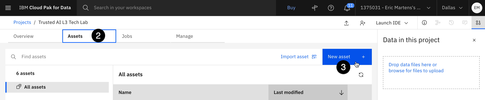

2. Select the **Assets** tab.
3. Click on the blue **New asset** button.
4. Click on the **Connection** tile.

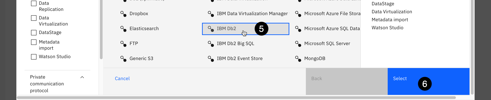

5. From the list of connection types, scroll down and select **IBM Db2** (use this specific name from all the Db2-type possibilities)
6. Click the blue **Select** button.
7. Enter a name for your connection (suggested: Db2).

For steps 8-12 below, you will be copying values from the credentials you pasted into a text editor into the form. Copy the values between the quotations from the credentials text. The values you will need are **database**, **hostname**, **port**, **username**, and **password**. They can be found in the credentials text as follows:

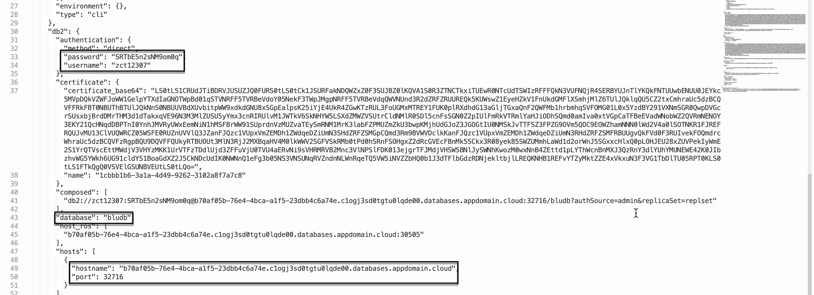

Copy the values one at a time, and paste them into the corresponding fields:

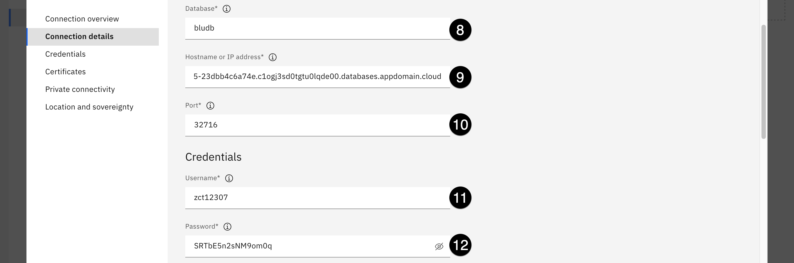

8. Scroll down to the **Database** field and enter the **database** credential element (default **bludb**).
9. In the **Hostname or IP address** field, enter the **hostname** credential element.
10. In the **Port** field, enter the **port** credential element
11. Scroll down to the **Credentials** section. In the **Username** field, enter the **username** credential element. The username also serves as the schema name.
12. In the **Password** field, enter the **password** credential element.
13. Scroll down to the **Certificates** section and select the checkbox for **Port is SSL-enabled**. While adding SSL credentials was not strictly necessary for this connection, selecting the option allows you to add a level of security by allowing the use of the connection only from trusted hosts.
14. Click **Test connection** in the upper right. If the test was unsuccessful, verify that you have correctly entered the credentials.
15. Once the connection test is successful, click the blue **Create** button in the bottom right.
16. Click **Create** in the pop-up window to confirm.

### 3. Create connected data

Connected data allows the use of data coming from any data repository as if it were a file, without copying it to a new location. This provides a way for data scientists and other team members to access the exact data they want instead of having to use SQL or other languages to get to that data.

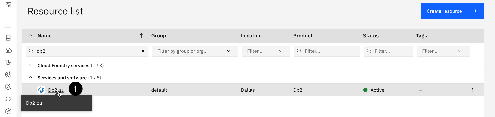

1. To create and populate a table, begin by opening the [IBM Cloud Resource list](https://cloud.ibm.com/resources?groups=resource-instance) and clicking on the Db2 instance.

> Use the filter by Name and type "Db2" to quickly get to this resource

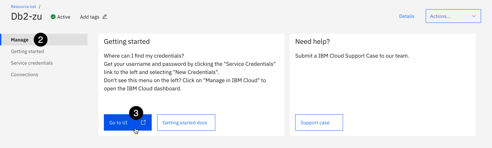

2. Select the **Manage** tab.
3. Click on the **Go to UI** button. The **IBM Db2 on Cloud** dashboard opens in a new browser tab.

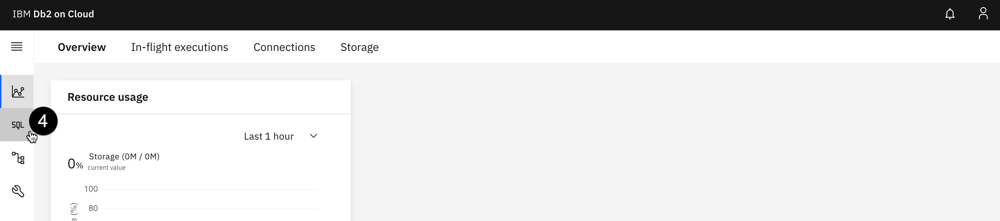

4. Click on the **SQL** icon on the left.

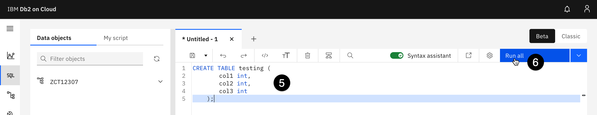

5. Enter the following SQL statement:

```sql
CREATE TABLE testing (
   col1 int,
   col2 int,
   col3 int
);
```

6. Click on the blue **Run all** button at the top right.
7. Using a local text editor, create and save a file named **test.csv**, on your computer with four rows of three columns in the following format:

```csv
col1,col2,col3
8,1,6
3,5,7
4,9,2
```

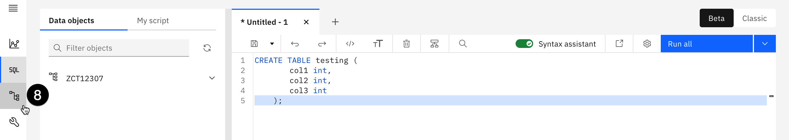

8. Click on the **Data** icon just below the **SQL** icon.

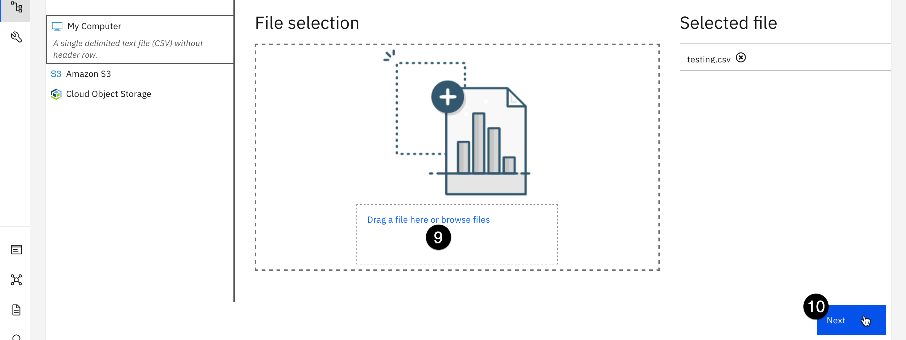

9. Drag and drop the file from your hard drive into the file selection box. You will see it appear under **Selected file** on the right when uploaded.
10. Click the blue **Next** button in the bottom right.

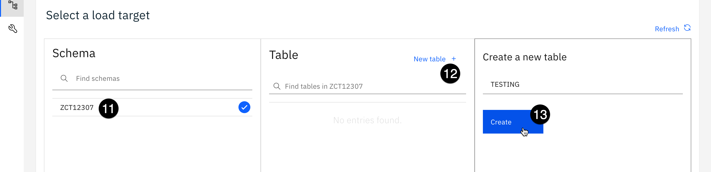

11. Select your schema. It is the username from the credential above and should be the only schema listed.
12. Click the **New table** button in the **Table** cell. Name your table **TESTING**.
13. Click **Create** to create the table.
14. Click **Next** three times to skip through the remaining screens until you see the **Begin Load** button.
15. Click **Begin Load**.

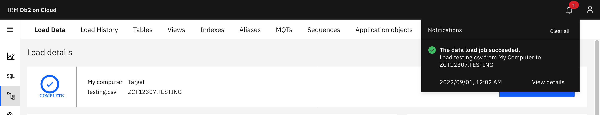

This should complete with three rows read and three rows loaded. You can close this tab. In the next step you return to your project asset tab in Cloud Pak for Data as a Service (Watson Studio).

### 4. Create a connected data asset pointing to the table

1. Return to the tab with your Watson Studio project. If you have closed the tab, open your [list of projects](https://dataplatform.cloud.ibm.com/projects) and click on the name of your project to open it.

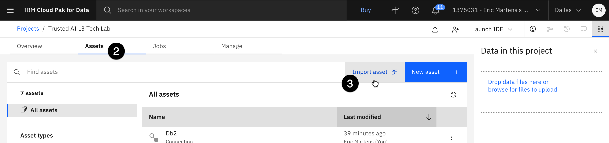

2. Select the **Assets** tab.
3. Click on **Import asset**.

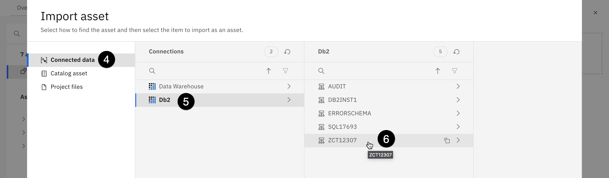

4. Select **Connected data**.
5. Click on the **Db2** connection (or the name you gave to your connection).
6. Select your **Db2** username as the schema name.
7. Select the **TESTING** table and click the blue Select button in the lower right.
8. Keep the default name and click **Import**.

### 5. Accessing files and connections through a notebook

Now that you have multiple files you can use, let's see how they can be accessed in a Jupyter notebook. Access to these files can also be done using tools such as AutoAI and SPSS Modeler. This will be explored later in this lab.

> For a quick tutorial on Jupyter notebooks, click [here](https://blog.udemy.com/jupyter-notebook-tutorial/). While in the notebook, you can use the blue **Play** button or press **Shift + Enter** on your keyboard to execute the current cell. Executing cells will be marked with an asterisk in the brackets to the left of the cell. When the cell has finished executing, the asterisk will be replaced with a number. When executing cells in the notebook, it's often best to wait until a cell has finished before executing the next one, which allows you to address any errors in the code.

In the previous (optional) section, you imported a dataset that includes masked columns. As you'll see in this notebook, these columns are unmasked when using a database connection (in this case, Db2). To preserve the masking, you need to use a Watson Query (data virtualization) connection instead.

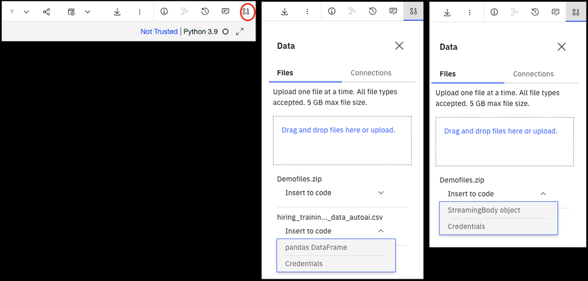

One of the key activity in the Data access notebook is something called **Insert to code**. To access this capability, from a notebook in edit mode, you need to open the data tab. The figure above has a red circle around the data icon. The data tab opens on the right and includes two tabs. A **Files** tab and a **Connections** tab. The figure above shows two examples of opening the caret next to **Insert to code**. One for a CSV file and one for a ZIP file. You can see that the options are different ("pandas DataFrame", "Credentials", "StreamingBody object"). This is what you will be exploring in the Notebook lab.

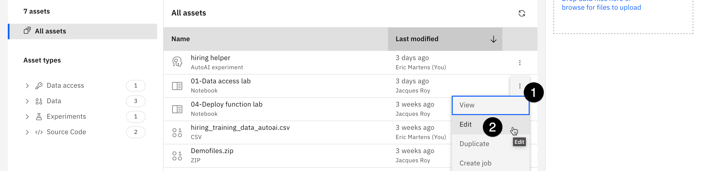

To get to the notebook, you start from within your project under the Assets tab.

1. Click on the three vertical dots at the end of the line for **01-Data access lab**. A drop down menu appears.
2. Click on **Edit**. Once the notebook is open, follow the instructions provided.
