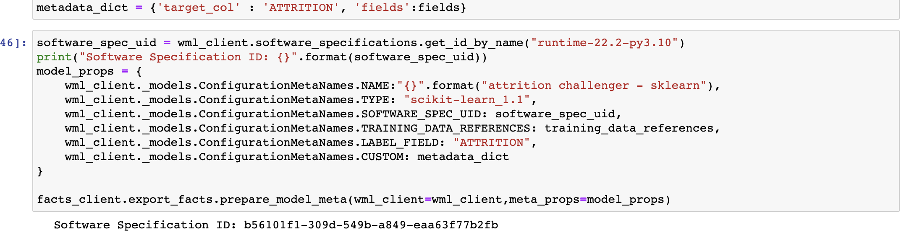

# 102: Aumentar las herramientas de código abierto

Al vender las soluciones Watson Studio Data & AI a los clientes, una de las objeciones más frecuentes que escuchará es: "No necesitamos IBM, confiamos en las soluciones de código abierto." Es fundamental entender y ser capaz de comunicar al cliente que Watson Studio proporciona acceso a toda la gama de herramientas de código abierto, pero también aumenta esas herramientas con una mayor automatización, estandarización y oportunidades de colaboración.

En esta sección, desarrollarás dos modelos utilizando cuadernos Jupyter y bibliotecas de código abierto. Por el camino, verás cómo la funcionalidad añadida de Watson Studio puede simplificar, automatizar y mejorar el flujo de trabajo diario de los desarrolladores de modelos.

## 1. Cree una entrada de catálogo para FactSheets

Lanzado en 2022, IBM FactSheets proporciona una forma automatizada y estandarizada de rastrear y almacenar información sobre el desarrollo, las pruebas, la validación y el despliegue de modelos. Estos datos se almacenan y se pueden buscar en Watson Knowledge Catalog.

1. Vaya a la [pantalla de inicio de Cloud Pak for Data](https://dataplatform.cloud.ibm.com/).


2. Haga clic en el botón azul **Nuevo catálogo** situado en la esquina superior derecha de la pantalla.


4. Cuando aparezca la pantalla **Nuevo catálogo**, asigne a su catálogo un nombre (Mi catálogo, por ejemplo) y, opcionalmente, una descripción. El menú desplegable de **IBM Cloud Storage** ya debería contener la instancia que creó anteriormente. Si no es así, utilice el menú desplegable para seleccionar la instancia correcta.
5. Haga clic en el botón azul **Crear** de la esquina inferior derecha para crear su catálogo.


A continuación, crearemos un **caso de uso de modelo** en nuestro catálogo recién creado.

1. Vaya a la [pantalla de inicio de Cloud Pak for Data](https://dataplatform.cloud.ibm.com/).


2.  Haga clic en el icono de navegación en forma de hamburguesa situado en la esquina superior izquierda y seleccione **Inventario de** modelos en la sección **Catálogos**. Es posible que Watson Studio le ofrezca una visita guiada por el gobierno de los modelos; haga clic en **Tal vez más tarde** para cerrar la ventana emergente y, si es necesario, en **Hecho** para cerrar la ventana **del panel de visita relanzada**.
3.  Haga clic en el botón azul **Nuevo** modelo en la parte superior derecha de la pantalla para abrir el cuadro de diálogo **Nuevo modelo**.


4.  Dé a su entrada modelo un nombre, como **entrada de desgaste predictivo**, y una descripción opcional. Si tiene varios catálogos disponibles en su cuenta, aparecerá el menú desplegable **Catálogo**. En el menú desplegable **Catálogo**, seleccione el catálogo que está utilizando para este laboratorio. Si sólo hay un catálogo disponible en su cuenta, el menú desplegable no aparecerá y podrá continuar. Haga clic en el botón azul **Guardar** para crear la entrada del modelo.

## 2. Crear una clave API y un token de proyecto

Las claves de API le permiten autenticarse con diferentes servicios de IBM, como Watson Machine Learning. Los tokens de proyecto permiten que el código del bloc de notas lea activos y escriba archivos en sus proyectos de Watson Studio. Deberá crear ambos para continuar. Si ya tiene una clave de API de IBM Cloud disponible para su uso, puede saltar al paso cuatro de esta sección para crear un token de proyecto.

1.  Vaya a la página de [claves API de IBM Cloud](https://cloud.ibm.com/iam/apikeys).
2.  Haga clic en el botón azul **Crear una clave API de IBM Cloud**. Asigne a su clave un nombre descriptivo, como **MLOps lab**, y una descripción opcional. Haga clic en el botón azul **Crear**.


3.  Una vez creada la clave, haz clic en el botón **Copiar** para copiar la clave en tu portapapeles. **Pégala en un editor de texto para utilizarla más tarde, ya que NO podrás recuperarla de nuevo** y tendrás que crear una nueva si la pierdes.
4.  Navega hasta [tu lista de proyectos de ciencia de datos](https://dataplatform.cloud.ibm.com/projects).
5.  Haz clic en el proyecto que creaste al principio del laboratorio.
6.  En la pantalla de inicio del proyecto, haz clic en la pestaña **Gestionar**.


7.  Haga clic en **Control** **de** acceso en la barra de navegación de la parte izquierda de la pantalla para abrir la ventana **Control de acceso**.
8.  Haga clic en la pestaña **Fichas de acceso**.


9.  Haga clic en el botón azul **Nuevo** token de acceso. En el formulario que aparece, asigne a su token un nombre descriptivo como, por ejemplo, **token de acceso a Cuaderno**. Seleccione **Editor** en la lista desplegable **Función de acceso** y, a continuación, haga clic en el botón azul **Crear**. Se creará su código de acceso y aparecerá una entrada en la tabla.

## 3. Explorar los entornos de ejecución

Como administrador del proyecto, puedes controlar y personalizar completamente los diferentes entornos de ejecución disponibles para tus científicos de datos y desarrolladores. En lugar de que cada miembro del equipo trabaje en su propia máquina con su propio conjunto (a menudo conflictivo o incompatible) de bibliotecas y herramientas, pueden colaborar en Watson Studio con un entorno común, añadiendo las herramientas que necesiten.

1.  Haga clic en **Entornos** en la barra de navegación de la parte izquierda de la pantalla. Los entornos en ejecución aparecerán en la lista de la pestaña **Tiempos de ejecución de herramientas**.


2.  Haz clic en la pestaña **Plantillas** para ver la lista de entornos disponibles. Observa la amplia variedad de entornos de ejecución disponibles, que incluyen desde Python y R estándar hasta Spark, Scala e incluso aceleración GPU. La capacidad de elegir cualquiera de estos tiempos de ejecución, e incluso de cambiarlos dinámicamente a medida que cambian las necesidades del entorno del cuaderno, es una de las principales ventajas de realizar trabajos de ciencia de datos con IBM Cloud Pak for Data frente a los entornos Jupyter instalados localmente.
3.  Haga clic en el botón azul **Nueva plantilla** situado a la derecha de la pantalla para abrir la ventana **Nuevo entorno**.


4.  Ten en cuenta que puedes definir configuraciones aquí, eligiendo si quieres incluir Spark, DataStage o aceleración GPU. Puede utilizar el menú desplegable **Configuración de hardware** para personalizar la cantidad de CPU y RAM disponible para el entorno. Por último, puedes elegir la versión de software, seleccionando entre diferentes versiones de Python o R.
5.  Ahora que ha visto las opciones disponibles para los entornos de ejecución, haga clic en **Cancelar** para cerrar la ventana.

## 4. Crear un cuaderno

A continuación, crearás un cuaderno Python que se utilizará para el desarrollo de modelos. Como has visto en la sección anterior, los entornos de cuaderno Jupyter de Watson Studio proporcionan una gran variedad de tiempos de ejecución y mejoras, como instalaciones Spark configuradas y aceleración GPU. Los recientes cambios en las licencias de JupyterLab han creado problemas potenciales para los desarrolladores de clientes que confían en él para los cuadernos Jupyter instalados localmente. El uso de cuadernos Jupyter en Watson Studio permite la misma flexibilidad, al tiempo que elimina los quebraderos de cabeza derivados de las licencias y ofrece mayores oportunidades de colaboración.

1.  Haga clic en la pestaña **Activos** de su proyecto y, a continuación, en el botón azul **Nuevo activo**.
2.  Utilice el filtro **Tipo de herramienta** situado a la izquierda de la pantalla para seleccionar **Editores de código** y haga clic en la ficha del **editor de cuadernos Jupyter**. Se abrirá la pantalla **Nuevo** cuaderno.
3.  Haga clic en la pestaña **Desde URL**. Asigne a su bloc de notas un nombre, como **desarrollo del modelo de desgaste**, y una descripción opcional. Haga clic en el menú desplegable situado debajo de **Seleccionar** tiempo de ejecución. Tenga en cuenta que los tiempos de ejecución que aparecen aquí son los entornos mostrados en el paso anterior. Si hubiera creado un nuevo modelo de entorno, estaría disponible en esta lista desplegable.
4.  Seleccione el entorno **Spark & Python predeterminado**. Tenga en cuenta que las versiones disponibles cambian con el tiempo, a medida que nuevas versiones del tiempo de ejecución son liberadas y posteriormente soportadas por Watson Studio. En el momento de escribir esto, el entorno es **Spark 3.2 y Python 3.9 por defecto**.


5.  Copie y pegue la siguiente URL en el campo **URL del bloc** de notas:

```txt
https://raw.githubusercontent.com/CloudPak-Outcomes/Outcomes-Projects/main/TrustedAI-L3-Tech-Lab/02-Open%20source%20lab.ipynb
```

6.  Haga clic en **Crear** para crear su bloc de notas e iniciar el entorno de ejecución. Pueden transcurrir hasta 30 segundos antes de que pueda trabajar con el bloc de notas.

## 5. Editar y ejecutar el cuaderno

<QuizAlert />

Los cuadernos Jupyter son una forma estándar en la industria de trabajar y visualizar datos, construir modelos y mucho más. En la sección [Acceso a los datos](/mlops/101#accessing-data) de este laboratorio, has visto cómo Watson Studio te permite añadir datos a los proyectos desde archivos locales, conexiones o bases de datos. También has visto cómo estos datos se pueden insertar como código directamente en el cuaderno con sólo unos clics. La posibilidad de trabajar fácil y rápidamente con datos de toda la empresa, respetando al mismo tiempo la normativa y los estándares de privacidad de datos, es otra de las grandes ventajas de utilizar Watson Studio frente al código abierto tradicional.


1.  El cuaderno ha sido muy comentado, y debería ser fácil de seguir a medida que ejecutas las celdas individuales. Asegúrate de empezar insertando el código de acceso al proyecto que creaste anteriormente en este laboratorio haciendo clic en el icono de los **tres puntos verticales** en la parte superior de la pantalla y seleccionando **Insertar código de acceso al proyecto**. Tenga en cuenta que el código token insertado en la parte superior del cuaderno contendrá el ID de su proyecto, que necesitará en la celda inmediatamente inferior. También necesitará la clave API de IBM Cloud que creó anteriormente en el laboratorio. Ejecute la celda antes de continuar con el resto del cuaderno.


Cuando ejecutas comandos Spark en tus blocs de notas, la funcionalidad de monitorización de Spark puede añadir una gran cantidad de desorden visual, ya que actualiza el estado de cada comando. Puedes desactivar la monitorización de Spark haciendo clic en el icono de la barra de herramientas.

### Editar el cuaderno para subir

Como nota, el entorno de ejecución por defecto de `Spark 3.3 Python 3.9` ha quedado obsoleto. Esto requerirá que edites parte del código en el cuaderno para permitirte cargar con éxito el modelo que crees.

El código clave que debe editar debe ser:

- El texto de la primera línea debería pasar de **runtime-22.1-py3.9** a **runtime-22.2-py3.10**
- En lugar de **scikit-learn_1.0** debería ser **scikit-learn_1.1**

Después de editarlo, el cuaderno debería tener el siguiente aspecto:



2.  Siga los pasos del resto del cuaderno, insertando los datos en el código donde se especifique y ejecutando las celdas.

## 6. Examinar las fichas descriptivas de los modelos

Al principio de este laboratorio, creó una entrada en Watson Knowledge Catalog para IBM FactSheets con el fin de recopilar datos sobre sus modelos. Los cuadernos que ejecutó en el paso anterior utilizaron la API de FactSheets para activar la supervisión de los modelos, escribiendo metadatos relacionados con los datos de entrenamiento, las puntuaciones de precisión y mucho más. Ahora es el momento de ir a buscar esos datos.

1.  Vuelve a la pantalla de inicio de tu proyecto, bien haciendo clic en el nombre del proyecto desde el rastro de migas de pan en la parte superior izquierda de la pantalla, o navegando a tu [lista de proyectos](https://dataplatform.cloud.ibm.com/projects) y haciendo clic allí.
2.  Haga clic en la pestaña **Activos** del proyecto. Haga clic en **Modelos** en la lista de **tipos de** Activos de la izquierda.
3.  Los modelos scikit-learn y spark que creaste al ejecutar el cuaderno deberían aparecer en la lista de modelos. Haga clic en el nombre de uno de los modelos para abrir la pantalla de detalles del modelo.
4.  Haga clic en el botón azul **Rastrear este modelo**. Ahora asociará el modelo con la entrada de modelo que creó en el catálogo.
5.  Haga clic en **Seleccionar una entrada de modelo existente**. En la lista de entradas de modelo, seleccione la que creó anteriormente en el laboratorio. Haga clic en **Seguimiento**. Volverá a la página de detalles del modelo y verá que el seguimiento del modelo está activo.
6.  Vuelva a la lista de activos del proyecto y repita los pasos del 3 al 5 con el otro modelo, de modo que ahora se realice el seguimiento de ambos.


7.  Una vez que haya activado el seguimiento en ambos modelos, en la pantalla de información del modelo, haga clic en **Abrir en el inventario de modelos**. Se abre la entrada del catálogo. Haga clic en la pestaña **Activo**.

El inventario de modelos se divide en cuatro categorías: **Desarrollar**, **Desplegar**, **Validar** y **Operar**. A medida que sus modelos avanzan en el ciclo de vida, se moverán automáticamente al bucket correspondiente. Actualmente, como acaban de crearse y no se han desplegado, se encuentran en la fase de **Desarrollo**.


8.  Haga clic en el nombre del modelo Spark en el bucket **Desarrollo**. Observe que la FactSheet del modelo contiene una gran cantidad de metadatos recopilados automáticamente.

    *   La sección **Información** del modelo contiene las fechas de creación y última modificación, así como el tipo de modelo y la especificación del software.
    *   La sección **Información** de entrenamiento contiene el nombre del proyecto utilizado para crear el modelo e información sobre los datos de entrenamiento.
    *   La sección **Parámetros de** entrenamiento contiene gran cantidad de información específica del tipo de modelo creado (Clasificador Gradient Boost), así como el ensamblador vectorial incluido en el pipeline del modelo.
    *   Por último, la sección **Etiquetas de** entrenamiento contiene metadatos adicionales sobre el estimador utilizado y el entorno de ejecución.

En los próximos pasos de la demostración, consultará con frecuencia esta hoja de datos, por lo que le recomendamos que copie la URL y la pegue en un editor de texto.

Este tipo de información tiene un valor incalculable para los validadores de modelos, ya que buscan comprender cuándo y cómo se ha construido un modelo. Watson Studio proporciona una forma de estandarizar y automatizar la recopilación de los metadatos, lo que significa que los científicos de datos pueden dedicar su tiempo a trabajar en problemas significativos e interesantes en lugar de recopilar, mantener y publicar estos datos.
