# 102: Augmenting open-source tools

When selling Watson Studio Data & AI solutions to clients, one of the most frequent objections you will hear is, "We don't need IBM, we rely on open-source solutions." It is critical to understand and be able to communicate to the client that Watson Studio provides access to the full range of open-source tools, but also augments those tools with greater automation, standardization, and opportunities for collaboration.

In this section, you will develop two models using Jupyter notebooks and open-source libraries. Along the way, you will see how the added functionality of Watson Studio can simplify, automate, and improve the daily workflow for model developers.

## 1. Create a catalog entry for FactSheets

Released in 2022, IBM FactSheets provide an automated, standardized way to track and store information about model development, testing, validation, and deployment. That data is stored and searchable in Watson Knowledge Catalog.

1. Navigate to the [Cloud Pak for Data home screen](https://dataplatform.cloud.ibm.com/).

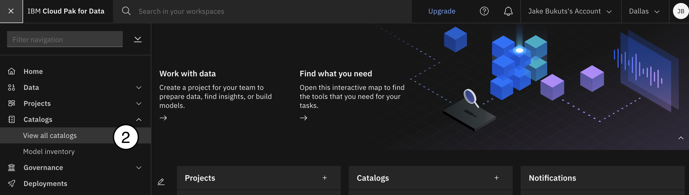

2. Click on the blue **New catalog** button in the top-right corner of the screen.

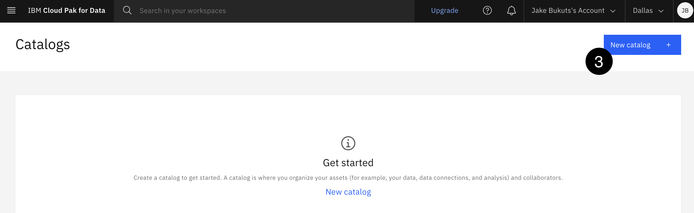

4. Once you see the **New Catalog** screen appear given your catalog a name (My Catalog for instance) and optionally a description. The **IBM Cloud Storage** dropdown should already pre-populate the instance you created early. If it is not use the dropdown to select the correct instance.
5. Click the blue **Create** button in the bottom-right corner to create your catalog.

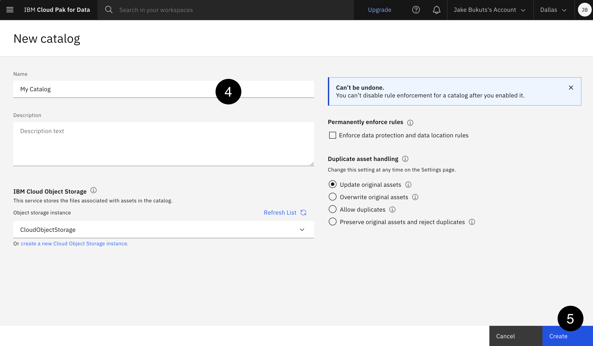

Next, we will create a **model use case** in our newly created catalog.

1. Navigate to the [Cloud Pak for Data home screen](https://dataplatform.cloud.ibm.com/).

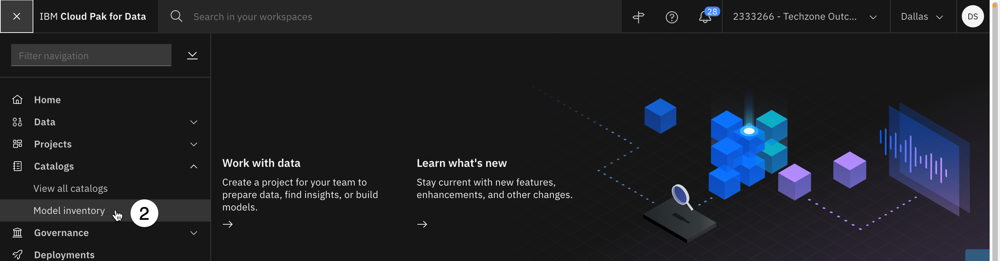

2. Click on the hamburger navigation icon in the upper-left corner, and select **Model inventory** from the **Catalogs** section. Watson Studio may offer you a guided tour of model governance; click **Maybe later** to close the popup, and the click **Done** to close the **Relaunch tour panel** window if necessary.
3. Click on the blue **New model use case** button in the top-right of the screen to open the **New model use case** dialog form.


4. Give your model entry a name such as **predictive attrition entry**, and an optional description. If you have multiple catalogs available in your account, the **Catalog** dropdown will appear. From the **Catalog** dropdown, select the catalog you are using for this lab. If there is only one catalog available on your account, the dropdown will not appear and you can proceed. Click the blue **Save** button to create the model entry.

## 2. Create an API key and a project token

API keys allow you to authenticate with different IBM services such as Watson Machine Learning. Project tokens allow notebook code to read assets from and write files to your Watson Studio projects. You will need to create both to proceed. If you already have an IBM Cloud API key available for use, you may skip ahead to step four of this section to create a project token.

1. Navigate to the [IBM Cloud API keys](https://cloud.ibm.com/iam/apikeys) page.
2. Click the blue **Create an IBM Cloud API key** button. Give your key a descriptive name, such as **MLOps lab**, and optional description. Click the blue **Create** button.

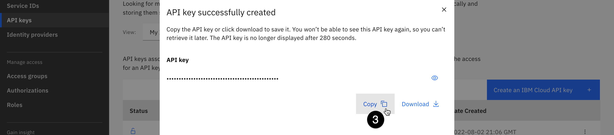

3. Once the key has been created, click the **Copy** button to copy the key to your clipboard. **Paste it into a text editor for later use, since you WILL NOT be able to retrieve it again** and will have to create a new one if you lose it.
4. Navigate to [your list of data science projects](https://dataplatform.cloud.ibm.com/projects).
5. Click on the project you created at the beginning of the lab.
6. From the project home screen, click the **Manage** tab.

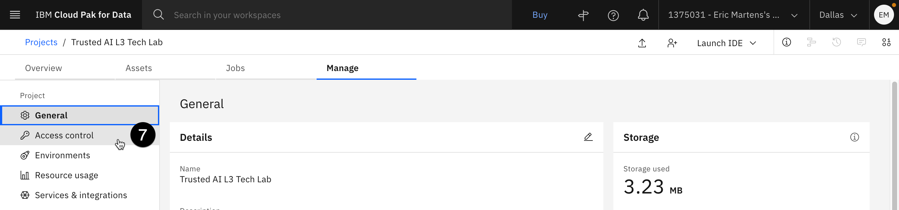

7. Click **Access control** from the navigation on the left side of the screen to open the **Access control** window.
8. Click the **Access tokens** tab.

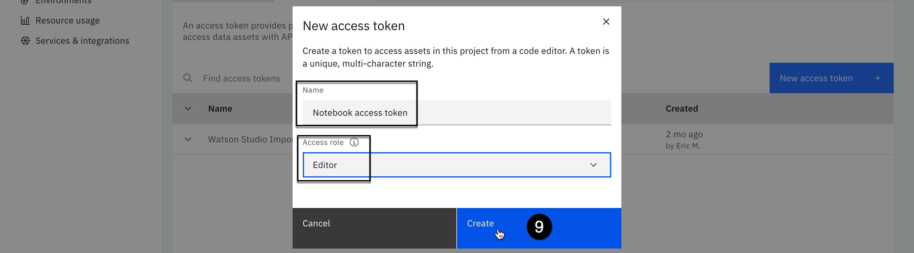

9. Click the blue **New access token** button. In the form that appears, give your token a descriptive name such as **Notebook access token**. Select **Editor** from the **Access role** dropdown, and then click the blue **Create** button. Your token will be created, and an entry will display in the table.

## 3. Explore runtime environments

As the administrator of the project, you can control and fully customize the different runtime environments available to your data scientists and developers. Rather than each team member working on their own machine with their own (often conflicting or incompatible) set of libraries and tools, they can collaborate in Watson Studio with a common environment, adding the tools they need.

1. Click **Environments** from the navigation on the left side of the screen. Any currently running environments will show in the list on the **Tool runtimes** tab.

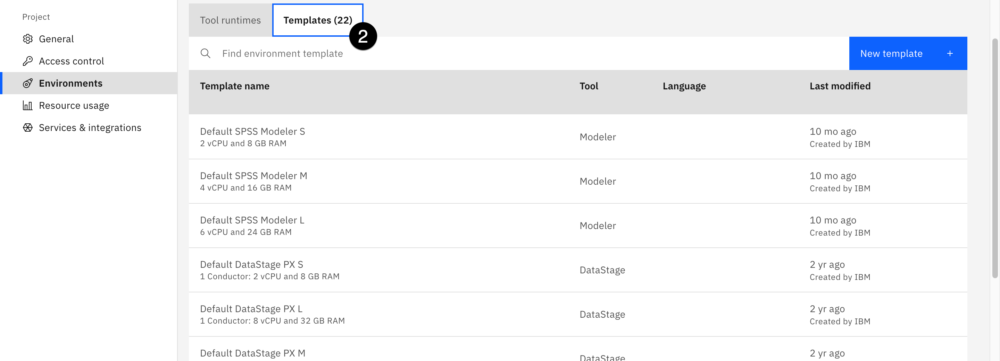

2. Click the **Templates** tab to see the list of available environments. Note the wide variety of runtime environments available, which include everything from standard Python and R to Spark, Scala, and even GPU acceleration. The ability to choose any of these runtimes, and even dynamically change them as the needs of the notebook environment change, is one of the major advantages of doing data science work with IBM Cloud Pak for Data over locally-installed Jupyter environments.
3. Click the blue **New template** button on the right side of the screen to open the **New environment** window.

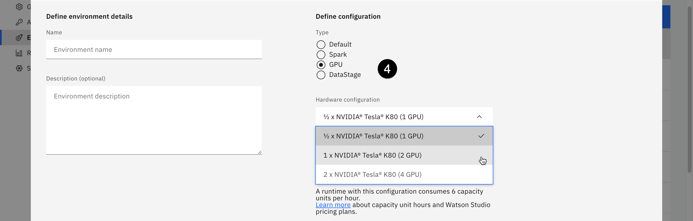

4. Note that you can define configurations here, choosing whether to include Spark, DataStage, or GPU acceleration. You can use the **Hardware configuration** dropdown to customize the amount of CPU and RAM available to the environment. Finally, you can choose the software version, selecting from different versions of Python or R.
5. Now that you have seen the available options for runtime environments, click **Cancel** to close the window.

## 4. Create a notebook

Next, you will create a Python notebook that will be used for model development. As you saw in the previous section, Watson Studio's Jupyter notebook environments provide a large variety of runtimes and enhancements, such as configured Spark installs and GPU acceleration. Recent licensing changes to JupyterLab have created potential issues for client developers who rely on it for locally-installed Jupyter notebooks. Using Jupyter notebooks in Watson Studio allows for the same flexibility, while removing the headaches of dealing with the licenses, and provides greater opportunity for collaboration.

1. Click on the **Assets** tab of your project, then click the blue **New asset** button.
2. Use the **Tool type** filter on the left of the screen to select **Code editors**, and click the tile for **Jupyter notebook editor**. The **New notebook** screen opens.
3. Click the **From URL** tab. Give your notebook a name like **attrition model development**, and an optional description. Click the dropdown beneath **Select runtime**. Note that the runtimes listed here are the environments shown in the previous step. Had you created a new environment template, it would be available in this dropdown list.
4. Select the **Default Spark & Python** environment. Note that the available versions change over time, as new versions of the runtime are released and subsequently supported by Watson Studio. At the time of writing, the environment is **Default Spark 3.3 & Python 3.9**.

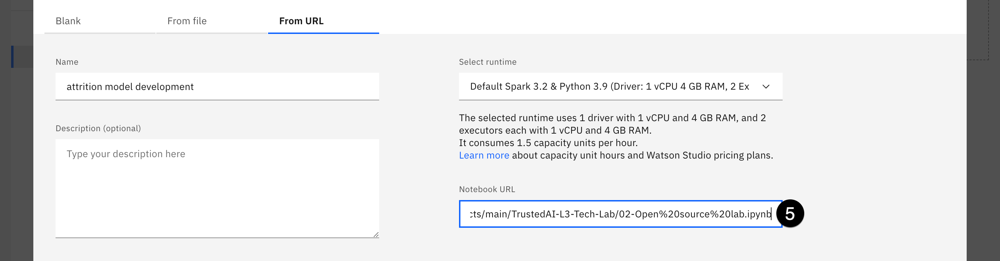

5. Copy and paste the following URL into the **Notebook URL** field:

```txt
https://raw.githubusercontent.com/ibm-build-lab/VAD-VAR-Workshop/main/content/MLOps/files/02-Open%20source%20lab.ipynb
```

6. Click **Create** to create your notebook and start the runtime environment. It may take up to 30 seconds before you are able to work with the notebook.

## 5. Edit and run the notebook

<QuizAlert />

Jupyter notebooks are an industry-standard way to work with and visualize data, build models, and more. In the [Accessing data](/mlops/101#accessing-data) section of this lab, you saw how Watson Studio allows you to add data to projects from local files, connections, or databases. You also saw how this data could be inserted as code directly into the notebook with just a few clicks. The ability to easily and quickly work with data from across the enterprise while following data privacy regulations and standards is another major advantage of using Watson Studio over traditional open source.

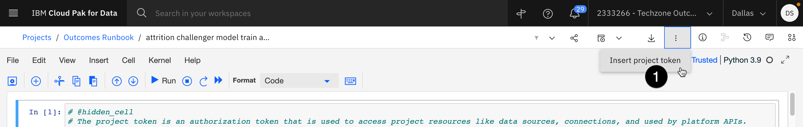

1. The notebook has been heavily commented, and should be easy to follow as you execute individual cells. Be sure to start by inserting the project access token you created earlier in this lab by clicking the **three vertical dots** icon at the top of the screen and selecting **Insert project token**. Note that the token code inserted at the top of the notebook will contain your project ID, which you will need in the cell immediately below. You will also need the IBM Cloud API key you created earlier in the lab. Execute the cell before proceeding with the rest of the notebook.

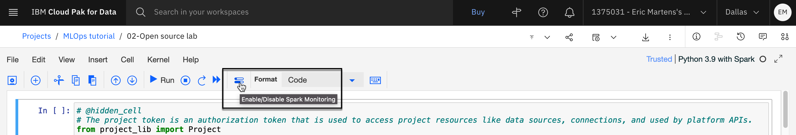

When running Spark commands in your notebooks, the Spark monitoring functionality can add a great deal of visual clutter as it updates the status of each command. You can turn off Spark monitoring by clicking the icon in the toolbar.

2. Follow the steps in the rest of the notebook, inserting data to code where specified, and running the cells.

<Danger text='The rest of this section assumes the successful completion of the notebook run.'/>

> Note: After completing the notebooks and publishing the models to the project, you can use the same steps at the end of the **Accessing Data** lab to turn off any runtimes that are still active.

## 6. Examine the FactSheets for the models

At the beginning of this lab, you created a Watson Knowledge Catalog entry for IBM FactSheets to collect data about your models. The notebooks you ran in the previous step used the FactSheets API to activate monitoring for the models, writing out metadata relating to training data, accuracy scores, and more. Now it's time to go find that data.

1. Return to your project home screen, either by clicking the name of the project from the breadcrumb trail at the top left of the screen, or by navigating to your [list of projects](https://dataplatform.cloud.ibm.com/projects) and clicking it there.
2. Click on the **Assets** tab of the project. Click on **Models** from the list of **Assets types** on the left.
3. The scikit-learn and spark models you created when you ran the notebook should appear in the list of models. Click on the name of one of the models to open the model details screen.
4. Click on the blue **Track this model** button. You will now associate the model with the model entry you created in the catalog.
5. Click **Select an existing model entry**. From the list of model entries, select the one you created earlier in the lab. Click **Track**. You will be returned to the model details page, and should see that model tracking is now active.
6. Return to your project assets list, and repeat steps 3-5 with the other model, so both are now being tracked.

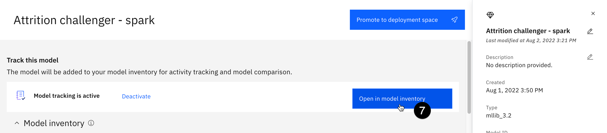

7. Once you have enabled tracking on both models, from the model information screen, click on **Open in model inventory**. The catalog entry opens. Click on the **Asset** tab.

The model inventory is divided into four buckets: **Develop**, **Deploy**, **Validate**, and **Operate**. As your models move through the lifecycle, they will be automatically moved to the corresponding bucket. Currently, having just been created and not deployed, they are in the **Development** stage.

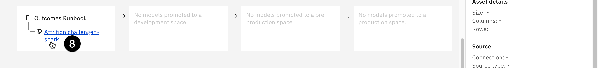

8. Click on the name of the spark model in the **Development** bucket. Note that the FactSheet for the model contains a great deal of automatically-collected metadata.
   - The **Model information** section contains the creation and last modified dates, as well as the model's type and software specification.
   - The **Training information** section contains the name of the project used to create the model and information on the training data.
   - The **Training parameters** section contains a great deal of information specific to the type of model you created (Gradient Boost Classifier), as well as the Vector Assembler included in the model pipeline.
   - Finally, the **Training tags** section contains additional metadata on the estimator used, and the runtime environment.

You will be referring back to this FactSheet frequently in the upcoming demo steps, so you may want to copy the URL and paste it into a text editor.

This kind of information is invaluable for model validators, as they seek to understand when and how a model has been built. Watson Studio provides a way to standardize and automate the collection of the metadata, meaning that data scientists can spend their time working on meaningful, interesting problems instead of collecting, maintaining, and publishing this data.
