# 103: No-code and low-code solutions

Demand for skilled data scientists has far outstripped the supply for years. Experienced data scientists are difficult to find, command high salaries, and prefer to work on interesting problems. Any client looking to accelerate their data science program and provide value to the business will need to adapt to these realities. Watson Studio provides a variety of cutting-edge tools that can not only speed up many mundane tasks for expert data scientists, but can also allow "citizen data scientists" (subject matter experts who may not be comfortable writing code) to contribute.

SPSS Modeler is a low-code solution for transforming data and building models. AutoAI is a no-code solution for rapid model prototyping. This section of the lab explores these two offerings.

## 1. SPSS Modeler flow

<QuizAlert />

SPSS Modeler is a comprehensive tool that offers a variety of modeling methods taken from machine learning, AI, and statistics. The following two figures show the operators available in SPSS Modeler. The first figure includes 61 operators for import, export, record and field operations, graph, and output capabilities. The second figure includes 56 operators used in modeling and text analytics.

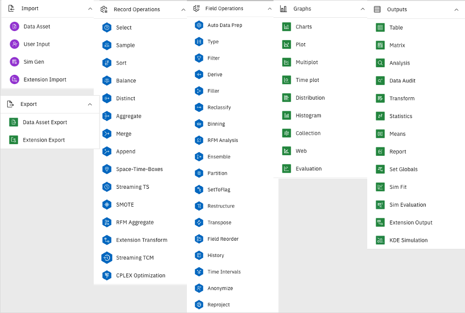

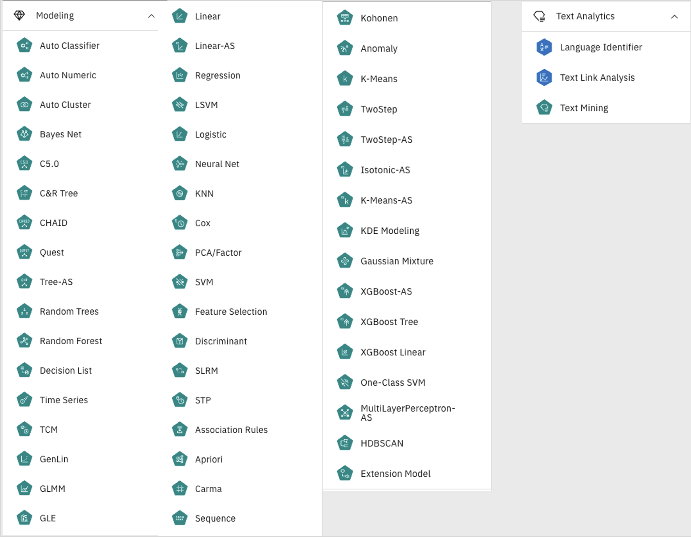

SPSS provides a flexible low-code interface that helps data scientists, from intermediate to experts, explore and understand their data, do feature engineering, create models, and deploy them for production.

In this lab you will create two simple flows. One for feature engineering, and one for model creation. These two flows are unrelated but it is easy to see that similar flows could be part of one solution.

### 1. Feature engineering

In this simplest of example of feature engineering, you will generate the day of the week an employee was hired, and the day of the week an employee left the company. This data can come from files or connections. Data could also come from multiple sources and join together to create a more complete input. In this example, you will read the data from a database using the Data Warehouse connection available in your Cloud Pak for Data project.

Having access to the day of the week of a specific event will allow you to compare activities from week to week. For example, how many transactions did you complete on Monday? How does it compare to other Mondays? Can you see a pattern from week to week? Do you have to plan for more employees and inventory on Fridays compared to Mondays? These are the types of questions that can be addressed once you extract the day of the week from a date. This could be a simple transformation you perform before passing the data to the machine learning model.

Let's see how simple it is to do with SPSS Modeler.


In this exercise you will use the following three operators:

- **Data asset**: To access a table in a database
- **Derive**: To create two new features (attributes / column)
- **Data asset export**: To write the result to a cloud object storage (COS) file

While you follow the instructions, make sure to take time to look at the different options available in each operator.

1. Return to your project in your browser. If you have closed the tab, go to your [list of projects](https://dataplatform.cloud.ibm.com/projects?context=cpdaas) and click on the name of your project from the list.
2. In your project, select the **Assets** tab and click **New asset**.

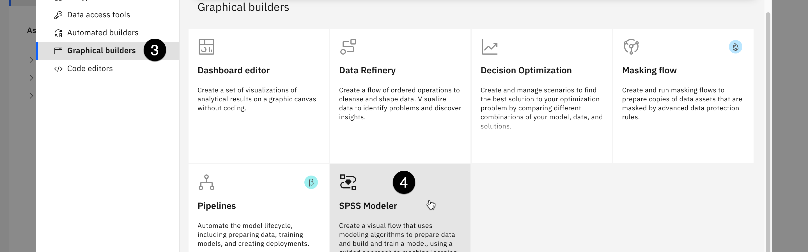

3. Select **Graphical builders** in the tool type column on the left.
4. Click on the **SPSS modeler** tile in the lower right of the screen.
5. Give your flow a name and an optional description, then click on **Create**. You may be prompted to take a guided tour of SPSS Modeler Flows. If you are, click **Maybe later** to close the prompt, and proceed with the lab.

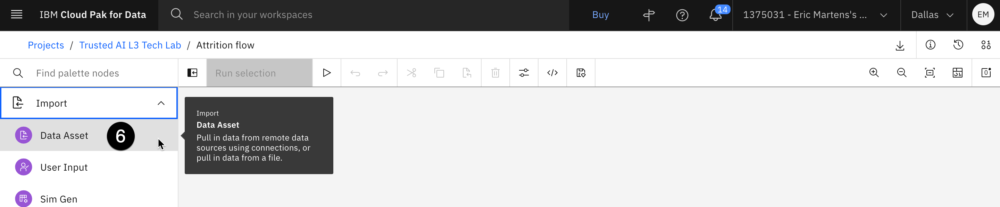

6. Expand the **Import** section of the palette on the left. Click and drag the **Data Asset** operator and drop it on the canvas in the middle of the screen.

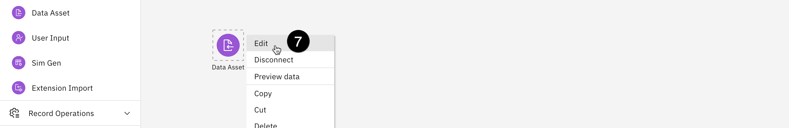

7. Hover your mouse over the data asset you have added to the canvas, click on the three vertical dots that appear, and select **Edit**.

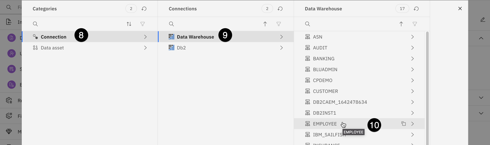

8. Select **Connection** from the menu.
9. Select the **Data Warehouse** connection.
10. Select the **EMPLOYEE** schema.
11. Select the **EMPLOYEE** table.
12. Click on **Select**, then click on the **Save** button. The data asset will be updated with the data from the connected database.

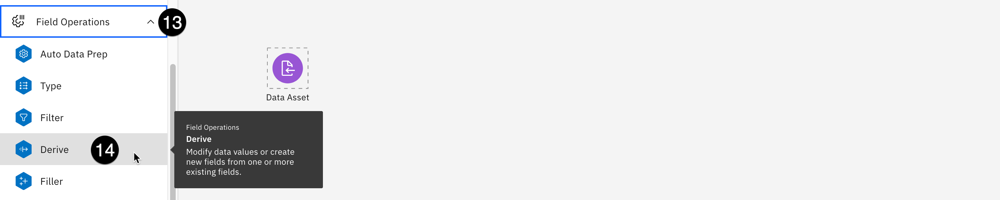

13. Expand the **Fields Operations** in the left palette.
14. Drag and drop a **Derive** operator to the right of the **Data Asset** operator.

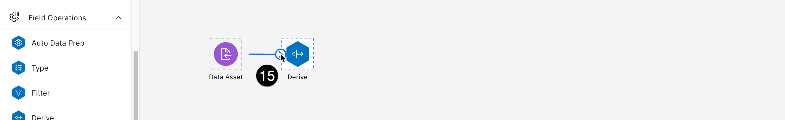

15. To connect the **Data Asset** operator to the **Derive** operator, hover your mouse over the **Data Asset** on the canvas. Click and drag the circle icon with the **>** sign in it to the **Derive** operator. You should now see a line that connects these two operators.

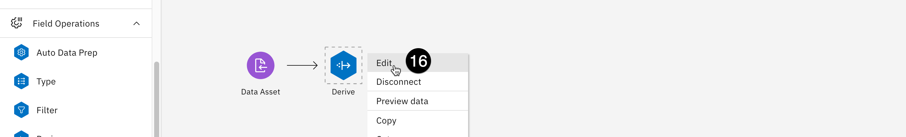

16. Hover your mouse over the **Derive** operator on the canvas, click on the three vertical dots that appear, and select **Edit**.


17. Select **Multiple fields** from the **Mode** section on the right.
18. Click the **Add columns** button.
19. Select the "DATE_HIRED" and "TERMINATION_DATE" columns from the table and click the blue **OK** button in the bottom right.

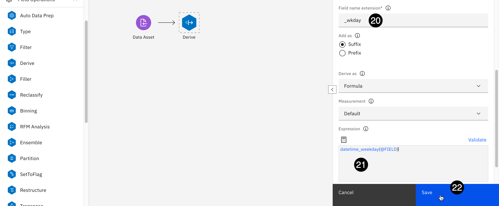

20. Change the Field name extension on the right from **\_Derive** to **\_wkday** to be more explicit for documentation purposes.
21. In the Expression box at the bottom right, copy and paste the following:

```txt
datetime_weekday(@FIELD)
```

22. Click on **Save**.

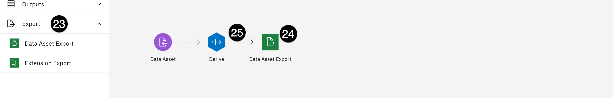

23. Expand the **Export** section of the palette on the left.
24. Drag and drop the **Data Asset Export** operator onto the canvas, placing it to the right of the **Derive** operator.
25. Connect the **Derive** operator to the **Data Asset Export** by hovering your mouse over the **Derive** operator, then clicking and dragging the circle icon with the **>** in it to the **Data Asset Export** node.
26. Edit the **Data Asset Export** operator the same way you did earlier.

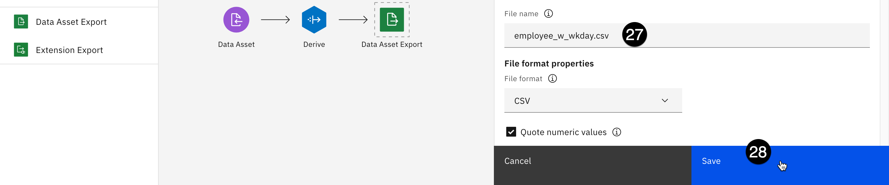

27. Change the **File name** field value from **output.csv** to **employee_w_wkday.csv**.
28. Click on **Save**.
29. Click on the blue **Run selection** button at the top of the window. The **Running flow** popup appears and shows you the status of your run.

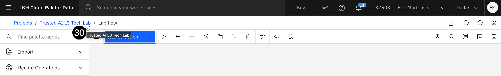

30. When the run has finished, go back to your Cloud Pak for Data project by clicking on the project name in the upper left of the screen.

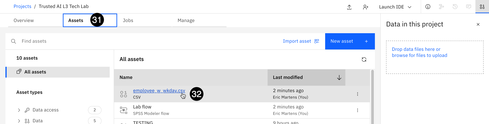

31. Select the **Assets** tab.
32. Click on the newly added **employee_w_wkday.csv** asset in the **All assets** section. The preview shows the two new fields you customized as the last two columns of the file. You may have to scroll to the right to see them.

This simple flow barely hints at SPSS Modeler's capabilities. For example, this flow could have written the result back to a database, or passed it to another flow for model creation.

The number of operators available in SPSS is only part of the story. Each operator includes functions to use in data transformation expressions such as **datetime_weekday**. You could have used the built-in help to find the function you were looking for instead of relying on memory only.

### 2. Model creation

In this section of the lab, you will create a model to predict employee attrition. This is similar to the two attrition models created using Jupyter notebooks in the [Augmenting open-source tools](https://cp4d-outcomes.techzone.ibm.com/data-fabric-lab/trusted-ai#Augmenting_open-source_tools) section of this lab. The model will look like this:

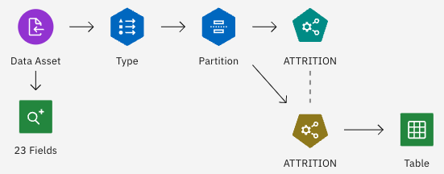

This model will have a total of six operators. A seventh one will be generated in the process:

- **Data asset**: Used to access the input file.
- **23 fields**: Data Audit operator that shows statistical and quality information about each input field.
- **Type**: Helps to identify the proper column types and their roles.
- **Partition**: Splits the data between training and testing sets when creating the model.
- **Attrition** (Green): This is actually an **Auto classifier** operator that provides a choice of operators to evaluate before making a final decision on which one to use.
- **Attrition** (Gold): This is the result of the execution of the previous **Auto classifier** operator. You can look at the model evaluations and decide on the one you want to keep.
- **Table**: This is the output of the entire model. You can save this "branch" as a model and deploy it for use in different contexts.

Follow the steps described below to create this attrition model.

1. Return to your Cloud Pak for Data project using the project name breadcrumb at the top left of the screen.
2. Select the **Assets** tab and click on the **New asset** button on the right.
3. Select **Graphical builders** in the **Tool type** panel on the left.
4. Click the **SPSS Modeler** tile.
5. Give your flow a name and an optional description, then click on **Create**.


6. Expand the **Import** section from the palette on the left, then drag the **Data Asset** operator and drop it on the canvas.
7. Hover your mouse over the **Data Asset** node on the calendar, click on the three vertical dots that appear, and select **Edit**.

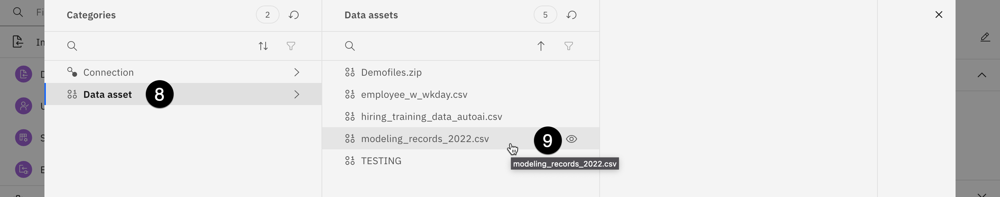

8. Select **Data asset**
9. Select **modeling_records_2022.csv**.
10. Click on **Select** at the bottom right on the screen, then click on the blue **Save** button at the bottom right. The changes will take about 30 seconds to update.

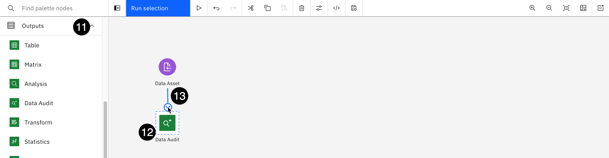

11. Expand the **Outputs** section of the palette on the left side.
12. Drag and drop a **Data Audit** operator below the **Data Asset** one.
13. Connect the **Data asset** operator to the **Data Audit** operator by clicking on the circle icon with the **>** sign in it that appears when you hover over the **Data asset** and drag it to the **Data audit** operator. When you connect these operators together, the **Data Audit** operator will be automatically renamed to **23 Fields**.
14. Right-click on the **23 Fields** operator, and select **Run**.

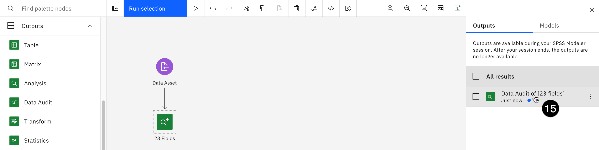

15. The output pane opens on the right-side of the canvas. Click on the **Data Audit** result name (do not select the checkbox).

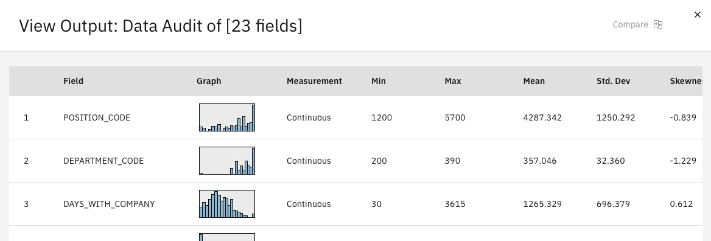

You can see some statistical and quality information on each input field. You may have to scroll to the right to see additional columns. This view provides indications on how good the data is. If the quality is considered low, it would make more sense to go look for new data instead of continuing with modeling.

Once you are done looking at this information, close the view output ("X" in the upper right) and close the Outputs section using the "X" in the upper right to leave yourself more room to work with the canvas.

16. Expand the **Field operations** section of the palette on the right.

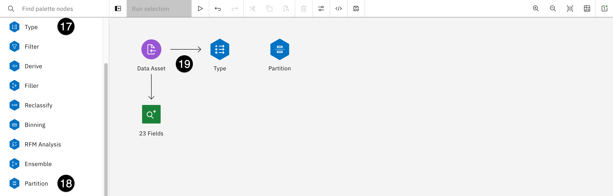

17. Drag and drop a **Type** operator to the right of the **Data asset** operator.
18. Drag and drop a **Partition** operator to the right of the **Type** operator.
19. Connect the **Data asset** operator to the **Type** operator like you've done in earlier steps.
20. Hover your mouse **Type** operator. Click on the three vertical dots that appear, and select **Edit**.

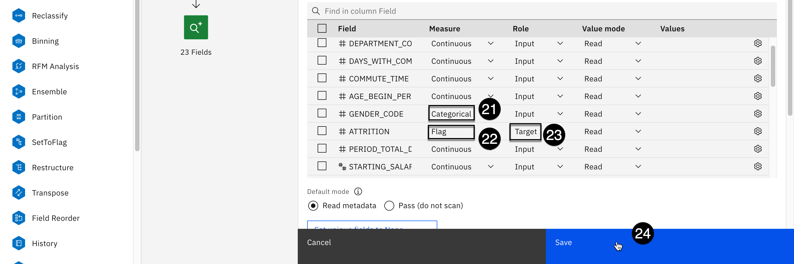

21. Use the dropdown of the **Measure** column in the **GENDER_CODE** row to set the value to **Categorical**.
22. Use the dropdown of the **Measure** column in the **ATTRITION** row to set the value to **Flag**.
23. Use the dropdown of the **Role** column in the **ATTRITION** row to set the value to **Target**.
24. Click on the blue **Save** button the bottom right of the screen.
25. Connect the **Type** operator to the **Partition** one as you've done many times before.
26. Edit the **Partition** operator.

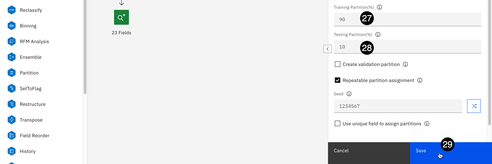

27. Change the **Training partition(%)** field to **90**.
28. Change the **Testing partition(%)** field to **10**.
29. Click on the blue **Save** button in the lower right.

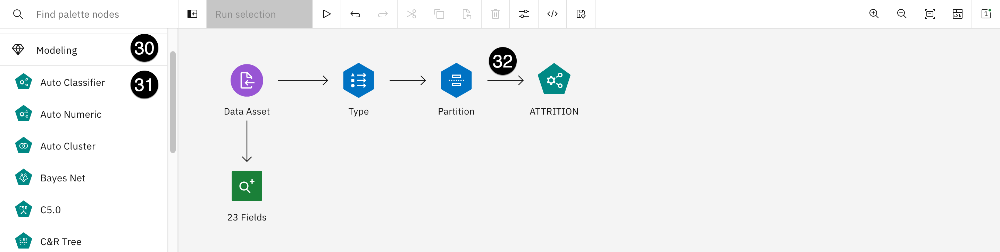

30. Expand the **Modeling** section of the palette on the left.
31. Drag and drop an **Auto Classifier** operator onto the canvas and place it to the right of the **Partition** operator.
32. Connect the **Partition** operator to the **Auto Classifier** one (note that the operator name will automatically change to **ATTRITION**, which you designated as the target in step 23).
33. Edit the **ATTRITION** operator.
34. Scroll down in the window that opens. Note the multiple sections, including **Build Options**, **Criteria for Flag Targets**, **Expert**, and more.

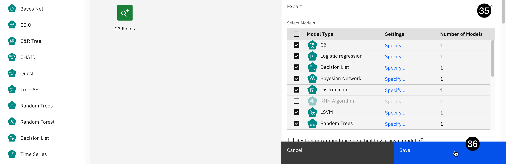

35. Expand the **Expert** section. You can see that there are multiple models selected in the **Select Models** subsection. By default, SPSS Modeler will select a variety of models to use.
36. Click the blue **Save** button on the bottom right.
37. Right-click on the **ATTRITION** operator and select **Run**. The flow will take up to a few minutes to run. Once the execution completes, a new (gold) **ATTRITION** operator appears below the old **ATTRITION** operator, and SPSS draws connections to this new operator from the **Partition** and the **ATTRITION** operators.

This new operator represents the models created from the training data. You can view the model evaluations and decide which one(s) to keep. If more than one model is selected, SPSS Modeler will use them as an ensemble (a group of models) to give an aggregate evaluation of all the model outputs.

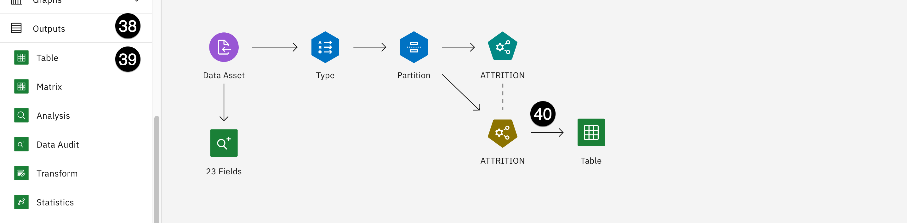

38. Expand the **Outputs** section of the palette on the left.
39. Drag and drop a **Table** operator onto the canvas to the right of the gold SPSS-generated **ATTRITION** operator.
40. Connect the gold **ATTRITION** operator to the **Table** operator you just added.
41. Right-click on the **Table** operator and select Run.


42. Open the **Table output** result by clicking on its name in the right pane.
43. Scroll all the way to the right to see the generated columns:

- **Partition**: Whether this entry is from the training or testing partitions, as specified in the partition node
- **$XF-ATTRITION**: Whether the model predicts the employee will leave the company (1) or stay (0)
- **$XFC-ATTRITION**: How confident the model is in the prediction, between 0 (low confidence) and 1 (high confidence)

44. Close the view output by clicking on the **X** in the top right.

You could save this model for deployment by right-clicking on the **Table** operator and selecting **Save branch as a model**. This is beyond the scope of this lab.

This section barely scratched the surface of what SPSS Modeler can do. SPSS Modeler can be useful in tasks such as data exploration and understanding, feature engineering, model building, and more. Consult the [documentation](https://dataplatform.cloud.ibm.com/docs/content/wsd/spss-modeler.html?context=cpdaas&audience=wdp) for more information on SPSS Modeler capabilities.

In addition to the documentation, you can find projects and notebooks that use SPSS in the gallery. To view the sample project gallery, [create a new project](https://dataplatform.cloud.ibm.com/projects/create-project?context=cpdaas&type=import) and scroll down to the **Gallery** section.

## 2. AutoAI

AutoAI is Watson Studio's no-code solution for rapid model prototyping and development. It can be used by citizen data scientists to create models without writing any code. Additionally, it is frequently used by experienced data scientists to accelerate the creation of boilerplate model code, select the most promising algorithms, or test the validity of a data set for model creation.

In this section of the lab, you will create a "hiring helper" model that a client could potentially use to screen submitted resumes for job openings at your company.

1. Navigate to the home screen of project you've been using for this lab, either from the breadcrumb link at the top-left of the screen, or by clicking on it from your [list of projects](https://dataplatform.cloud.ibm.com/projects).

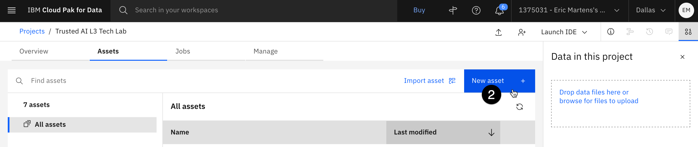

2. Select the **Assets** tab and click on the blue **New asset** button on the right.

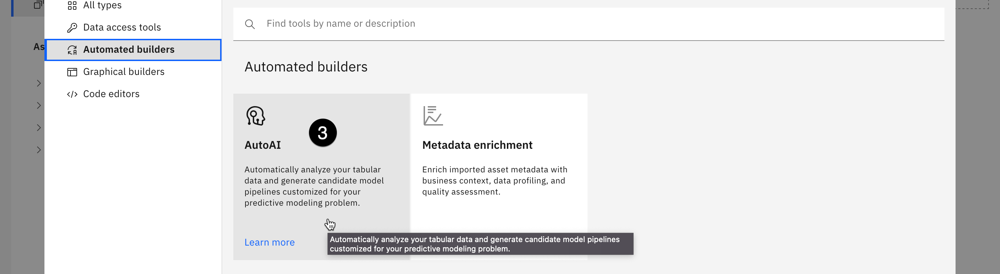

3. Select **Automated builders** from the **Tool type** list on the left of the screen, then click on the **AutoAI** tile. The **Create an AutoAI experiment** screen opens.
4. Give your model a descriptive name like **Hiring helper** and an optional description, then click on the blue **Create** button.
5. Click on the **Select from project** button to add a data source from your project.

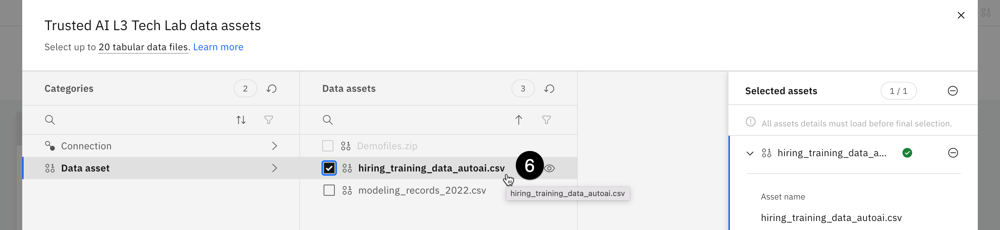

6. From the **Categories** list on the left, select **Data asset**, then select the checkbox next to **hiring_training_data_autoai.csv**. Now click the on blue **Select asset** button at the bottom right.
7. This model is not a time series forecast, so click on **No** in the **Configure details** box.
8. From the **Prediction columns** dropdown, select **HIRED** from the bottom of the list. The AutoAI service will automatically determine that this is a binary classification problem, where your model will choose between two outcomes: to hire or not to hire.

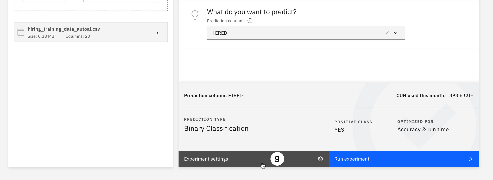

9. To customize the experiment, click on **Experiment settings**. The **Experiment settings** screen will open.

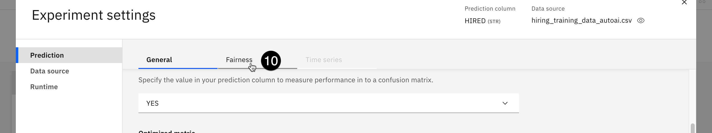

10. The AutoAI service includes technology pioneered by IBM Research that can check for model fairness at build time. To explore this, select the **Fairness** tab on the **Prediction settings** screen.

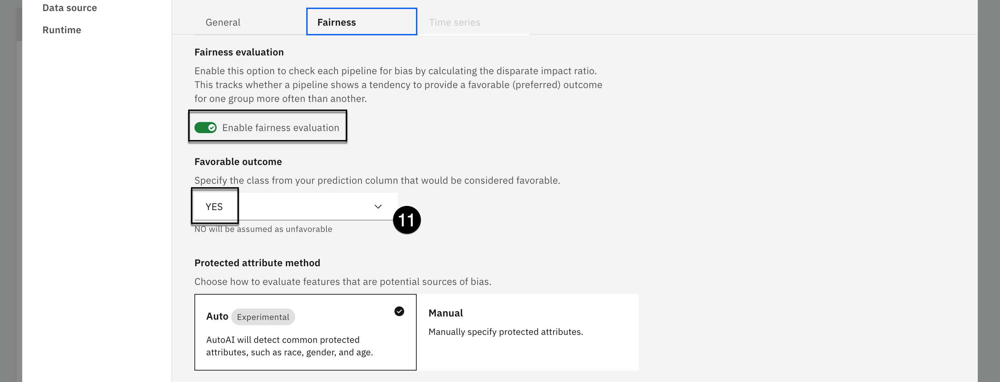

11. Click on the toggle to **Enable fairness evaluation**. Click the **Favorable outcomes** dropdown and select **YES**; this outcome indicates that the screening tool should recommend the applicant continue on in the hiring process. You could set the **Protected attribute method** to manually identify possible sources of bias. In this example you'll be letting AutoAI automatically identify potential fairness issues.

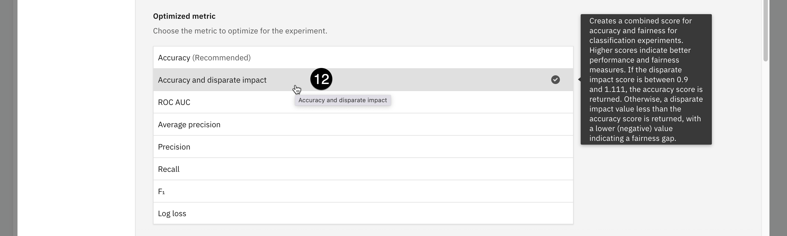

12. Go back to the **Prediction settings' General** tab and scroll down to the **Optimized metric** section. Note that you can select which metric to optimize for, and you can hover your mouse over each one for a short description of what that metric is. Because you are trying to construct a fair model, select **Accuracy and disparate impact** from the list. [Disparate impact](https://dataplatform.cloud.ibm.com/docs/content/wsj/model/wos-disparate-impact.html) compares the percentage of favorable outcomes for a monitored group to the percentage of favorable outcomes for a reference group.
13. Scroll down to the **Algorithms to include** section. Once again, note how a wide variety of algorithms can be included. Again, you can hover your mouse over each to get a brief description of how that algorithm works.
14. Click on the blue **Save settings** button at the bottom right, then click on the blue **Run experiment** button. The AutoAI run will take a few minutes to complete.

You can click on the blue **Swap view** link at the right to see the progress map, or watch as the relationship map is filled in with the different algorithms. As the algorithms are scored, they will be added to the **Pipeline leaderboard** table at the bottom of the screen.

15. Once the run has completed, scroll down to view the **Pipeline leaderboard**. The auto-generated pipelines are ranked based on the criteria you selected in a previous step (accuracy and disparate impact, or fairness). Note that due to the random allocation of training data and holdout (test) data, your results for best algorithm will vary from run to run. Each row of the table shows the different enhancements made to the pipeline, including hyperparameter optimization and feature engineering. For a more detailed explanation of pipelines and enhancements, see the AutoAI section of the [MLOps and Trustworthy AI demo](https://cp4d-outcomes.techzone.ibm.com/data-fabric/trusted-ai). Also note the build time, which is frequently just a few seconds for a full pipeline.

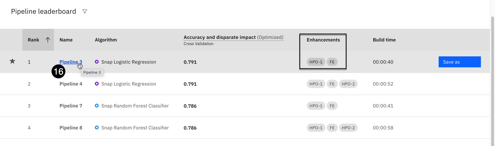

16. Click on a pipeline that shows some enhancements. The corresponding **Pipeline details** screen opens.
17. Select **Feature summary** from the list on the left. This screen shows the importance of different features on the model's outcome. Any transformations performed on the feature can be viewed by hovering your mouse over them in the **Transformation** column of the table.
18. Select the **Fairness** section from the list on the left. The **Fairness screen** shows the disparate impact calculations. Scroll down to the table of protected attributes. AutoAI has identified five features, including **Gender**, **Age**, and **MaritalStatus**. Two other features, **TotalWorkingYears** and **YearsAtCurrentCompany**, are likely proxies for **Age** and have also been identified as potential sources of unfair bias. The table shows the disparate impact ratio for each feature. You can click on the blue **Learn more** link just above the table for information on fairness and disparate impact.

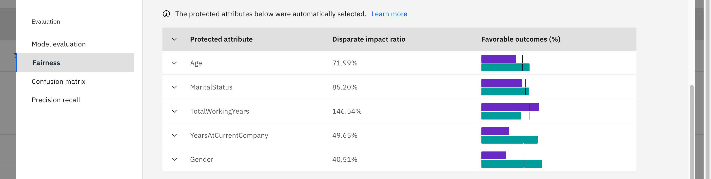

> Note that in a real-world situation, in order to try and remove potentially unfair bias, variables like **Gender** would not be included as features in the model. However, simply removing the feature does not guarantee that your model will be fair. Often, other seemingly benign features in a model will act as proxy features for the excluded ones. You may have seen this in the model fairness section of the [MLOps and Trustworthy AI demo](https://cp4d-outcomes.techzone.ibm.com/data-fabric/trusted-ai), where you use Watson Trust (OpenScale) to evaluate this model for fairness.

19. Click on the blue **Save as** button in the upper right for one of the pipelines. AutoAI allows you to save the pipeline as either a model that can be rapidly deployed as a web service, or as a notebook for further tuning. The former option lets citizen data scientists generate their own models. The latter appeals to expert data scientists, who can rapidly prototype a dozen pipelines, evaluate the best performer, and generate the code necessary for further optimization, all in a matter of minutes. Optionally, save your pipeline to your project as a notebook or a model, or simply click on **Cancel**.
