# Deploying models and functions

A model is only useful if it is used; this model needs to be made available in an easily consumable way. What's more, the model deployment process also has to be done in an orderly manner. For example, you cannot let anyone put models into production. For this purpose, the Cloud Pak for Data environment includes deployment spaces.

Anyone can create their own personal deployment space and promote models to it. However, in an enterprise, designated administrators should be the only ones able to promote a models to production deployment space.

In this section of the lab, you will see what is required to deploy models. You will also explore FactSheets, and see how and why you can deploy Python functions.

## 1. Creating a deployment space

Before you can deploy any model, you have to create a deployment space:

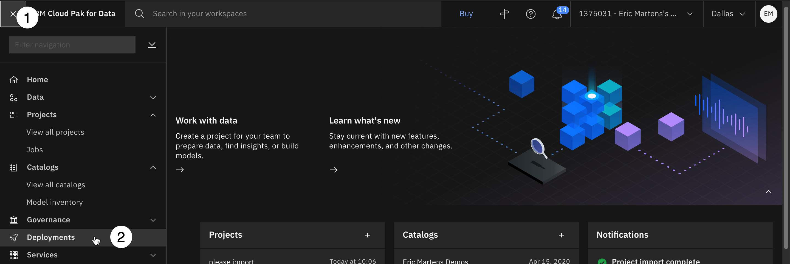

1. From the the [IBM Cloud Pak for Data] home screen, click the navigation menu (four stacked horizontal bars).
2. Select **Deployments**.
3. Select the **Spaces** tab. If you already have a administrator privileges in a deployment space, you may use that space and skip ahead to step 9. Otherwise, continue with these instructions.
4. Click on the blue **New deployment space** button in the upper right.

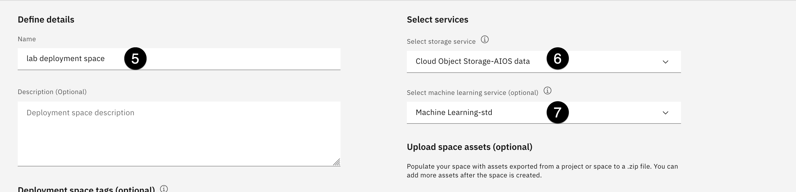

5. Give this new deployment space a name like "lab deployment space".
6. Make sure the storage service you created for this lab is selected.
7. Select the machine learning service you created for this lab form the drop down.
8. Click on the blue **Create** button in the bottom right.
9. Click on **Close**.

You can now see your newly created deployment space under the **Spaces** tab. If you click on the deployment space name, you see multiple tabs: **Overview**, **Assets**, **Deployments**, **Jobs**, and **Manage**. You'll visit some of these tabs later in this lab.

Note that in the **Manage** section of a deployment space, you can add collaborators just as you would for a project.

10. Return to your [list of projects](https://dataplatform.cloud.ibm.com/projects/?context=cpdaas) and click on the name of your project.

## 2. Deploying an online model

In the [Augmenting open-source tools](/mlops/102) section of the lab, you created a few models. It is time to deploy one of them. You will deploy the model created using a Spark environment.

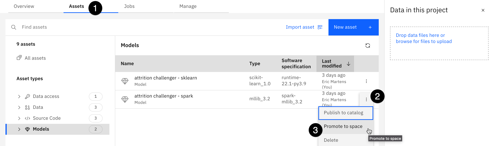

1. Select the **Asset** tab in your project.
2. Click on the three vertical dots at the end of the line for the **attrition challenger - spark** model.
3. Select **Promote to space**.

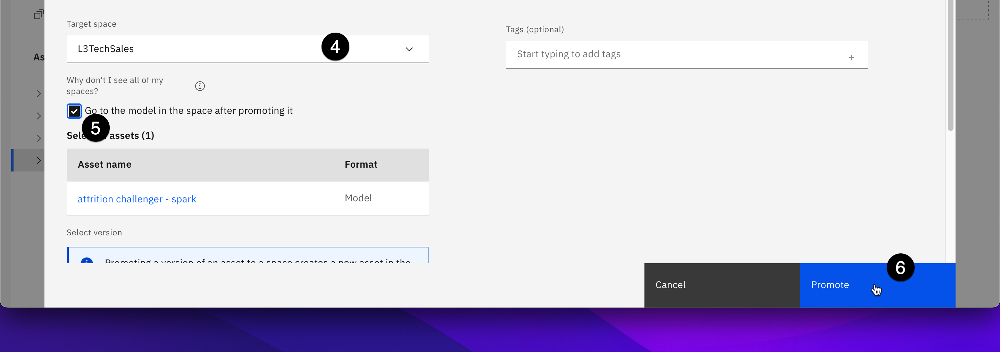

4. Use the **Target space** dropdown to select the space you created in the previous step.
5. Select the checkbox for **Go to the model in the space** after promoting it.
6. Click the blue **Promote** button on the bottom right.

With step 5, you avoid having to navigate to **Deployments**, then selecting the space, then clicking on your model. This way, you are taken there automatically, and are ready to deploy the model.

7. Click on the blue **New deployment** button on the right.

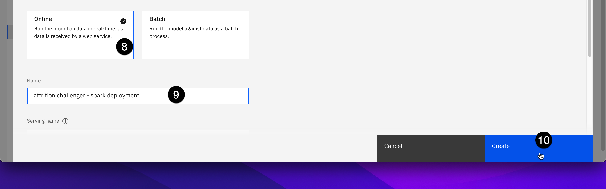

8. Select **Online** tile as the deployment type.
9. Give the deployment a name, such as **attrition challenger - spark deployment**.
10. Click on the **Create** button on the bottom right.

It takes a few seconds to create the service, then the model deployment is completed. In the next step, you will explore how you can either call your newly created deployment from a REST API endpoint or test your model using the built-in Watson Studio Cloud user interface (UI).

## 3. Test a model through the user interface (UI)

<QuizAlert />

From where you left off in the previous step, click on the name of the deployment.

The first thing you see is the **API reference** tab. This tab provides all the information you need to use your model. First, it gives you the API endpoint, which will look like:

```txt
us-south.ml.cloud.ibm.com/ml/v4/deployments/e4d5734c-2f6e-4715-889d-08f26c357332/predictions?version=2022-08-03

```

Then it provides code snippets for multiple languages to help you get started using your model with various types of application code. To complete the code snippet, you need to provide an **API key** from the [Augmenting open-source tools](#augmenting-open-source-tools) section that will authorize access to the model. You also need to provide the data that will be scored. This data represents a record similar to the training data. It is provided in JSON format.

You can also try your model through the Watson Studio Cloud user interface by selecting the Test tab. You have multiple methods of entering the records you want to score:

- Type in records in the table provided.
- Import a file that follows the CSV template.
- Paste JSON content into the provided space.
- Import a JSON file.

The **attrition challenger - spark** model does not contain all the metadata required to support CSV files. In this lab, you will use a JSON file that contains records to score.

1. Right-click on [records_to_score.json](https://raw.githubusercontent.com/CloudPak-Outcomes/Outcomes-Projects/main/TrustedAI-L3-Tech-Lab/records_to_score.json) and use the "Download Linked File As..." or "Save As..." option, depending on the browser you use, then save the file on your local machine. If the saved file has a "txt" extension, change it to "json".

If the right-click option is not available, just click on the link. The file content will display in a new tab. Save its content to a file on your local machine.

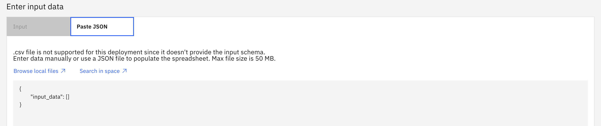

2. Select the **Test** tab.
3. Drop the **records_to_score.json** file in the screen input section, over the sample JSON text where you can see: **"input_data":[]**
4. Click on the blue **Predict** button at the bottom right.
5. Select the **JSON view**.
6. Scroll down to the bottom of the fields section. You will see see four additional fields: **features**, **rawPrediction**, **probability**, **prediction**.

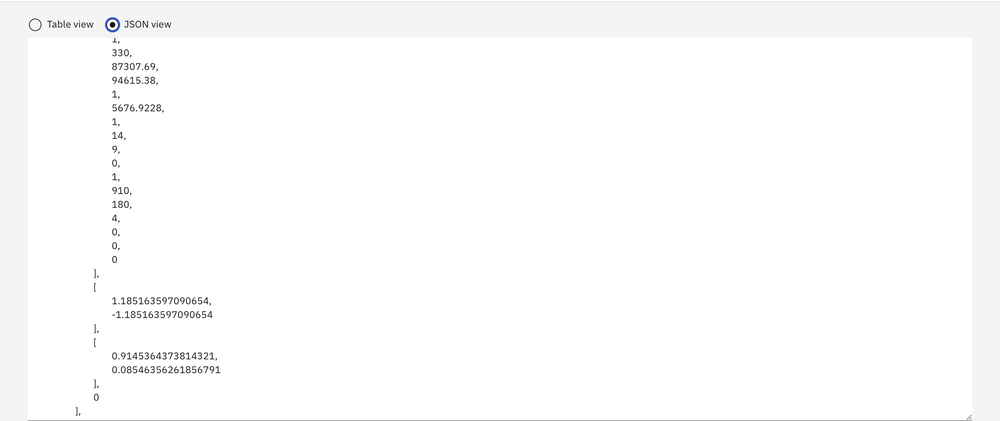

7. Scroll down to the end of the first record to see the new fields.

The **values** section needs some explanations. You get all the input values passed to the model and four additional fields as follow (you can see these names in the fields section at the beginning of the prediction results):

- **features**: An array of values from the input record
- **rawPrediction**: Raw prediction values for each possibility. For example, +1.18 for no attrition and -0.73 for attrition
- **probability**: probability of each event to occur, or a measure of confidence the model has in its prediction. The closer the value is to 1, the more confident the model is. Example: 0.914 and 0.086
- **prediction**: Result of the prediction. For example: 1 if the model predicts the employee will leave the company, or 0 if the model predicts the employee will stay

With these additional fields you don't only know what the model predicted, but its confidence level as well. An application could take advantage of this by raising an alert when the confidence level is below a certain threshold.

In testing, if the confidence level is always 100%, it would most likely indicate a problem with the model; for example, it might suggest that the model is too specific to the training data and you are testing with data that was used for training.

The output of a model varies depending on which tool or library is used. Still, having the result in JSON format allows for some flexibility on processing these results if multiple models created with different tools and libraries are used.

## 4. Using a batch deployment

There is another way to deploy models: batch deployment.

A [batch deployment](https://dataplatform.cloud.ibm.com/docs/content/wsj/analyze-data/deploy-batch-details.html?context=cpdaas&audience=wdp) processes input data from a file, data connection, or connected data in a storage bucket, and writes the output to a selected destination. Batch processing is done through a deployed job that can be scheduled for a one-time execution or as a recurring job.

Batch jobs are ideal for processing large data sets with no real-time requirements: the results can be analyzed as they become available. Scheduling jobs on an interval basis could also be useful in situations where records added during the course of a day can be processed at night and the results can be reviewed at the beginning of the next day.

Two important facts to keep in mind when working with batch models:

- The input data asset must be in the same deployment space as the deployed model.
- The available data asset type varies per [model framework type](https://dataplatform.cloud.ibm.com/docs/content/wsj/analyze-data/deploy-batch-input-by-framework.html?context=cpdaas&audience=wdp).

In the exercise below, you will re-deploy the attrition challenger - spark model, this time in batch mode. Spark models only accept inline data. The output is generated as a log, as you'll see later.

1. Click on the hamburger icon in the top-left to open the **Navigation Menu**, then select **Deployments**.
2. Select the **Spaces** tab, then click on the linked name of the deployment space you created at the beginning of this section.
3. Select the **Assets** tab.

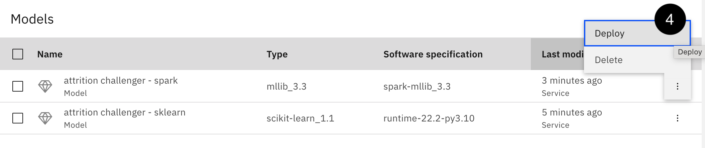

4. Hover your mouse over the **attrition challenger - spark** model, then click the three dots and **Deploy** button that appears.
5. Click on the **Batch** deployment tile.
6. Give it a name such as **attrition challenger - spark** batch and optionally enter a description.
7. Scroll down and note the available hardware specifications. Keep the default of "1 CPU and 4 GB RAM".
8. Click on the blue **Create** button in the bottom right.

This takes you to the deployment, where you can now create a job to try the deployed batch model.

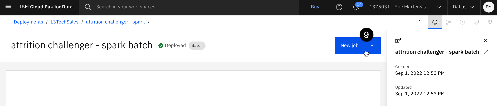

9. Click the **New job** button on the right.
10. Give the job a name such as "First batch job", then click on the blue **Next** button at the bottom right.

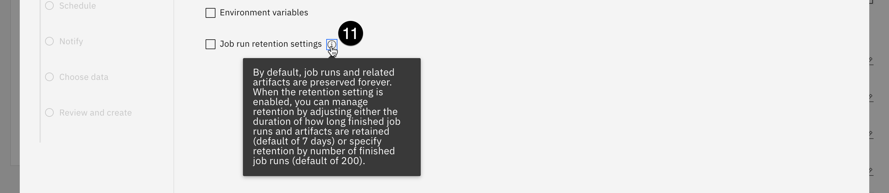

11. Click on the **"i"** next to **Job run retention settings** to get an idea of what it does. Click the **Next** button.

12. Leave the **Schedule off** toggle set to off. Click the **Next** button.

13. You can configure the job to send notifications when it succeeds or fails, but for now, skip this and click the **Next** button.
14. Clear all data from the **Input** field.

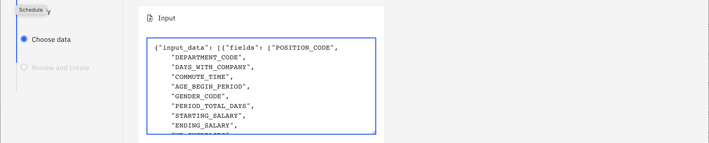

15. Earlier you used the [records_to_score.json](https://raw.githubusercontent.com/CloudPak-Outcomes/Outcomes-Projects/main/TrustedAI-L3-Tech-Lab/records_to_score.json) file. Copy its contents into the input field. Click the **Next** button.

In cases where frameworks are used to support other input data types, an output file would be identified as part of the job definition.

16. Click the **Create** button.

At this point, the job is created and executed.

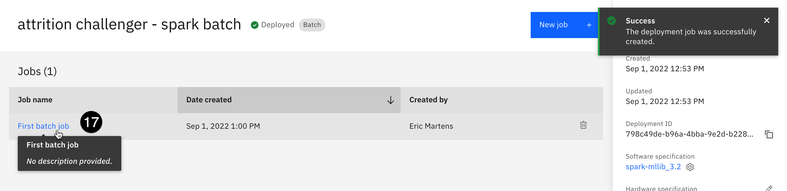

17. Click on the link for the job you created to open the job details screen.

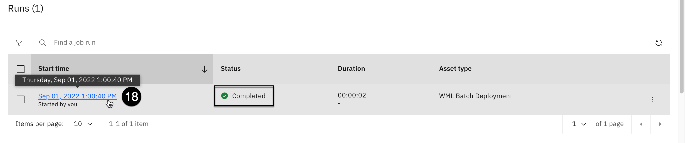

18. When the **Status** shows **Completed**, click on the timestamp to view the output.

In the output, you can see the same format as in the online processing with the four additional fields added to the prediction records: "features", "rawPrediction", "probability", and "prediction".

## 5. View the updated FactSheets for the deployed model

You have now deployed one of the models created by the notebook in a previous step. Because you enabled FactSheet tracking for this model, you can now see the model metadata, which has been automatically updated to reflect the deployment of the model.

1. Navigate to the catalog model entry you created in the [Augmenting open-source tools](https://cp4d-outcomes.techzone.ibm.com/data-fabric-lab/trusted-ai#Augmenting_open-source_tools) section of the lab. You can copy and paste the URL for the catalog asset into a new browser tab if you saved it earlier.

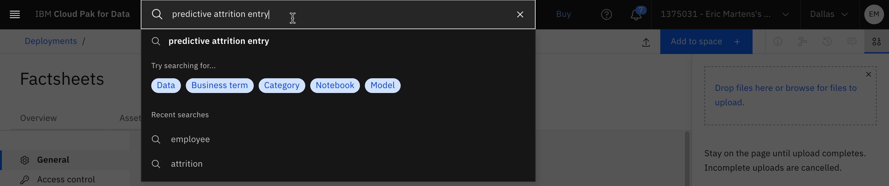

Alternately, type the name of your entry in the search field at the top of the screen and press **Enter**. This will search your catalogs for assets with this name.


If necessary, set the **Type** filter dropdown on the left to **Model entry**. Select the model entry you created earlier from the list of search results.

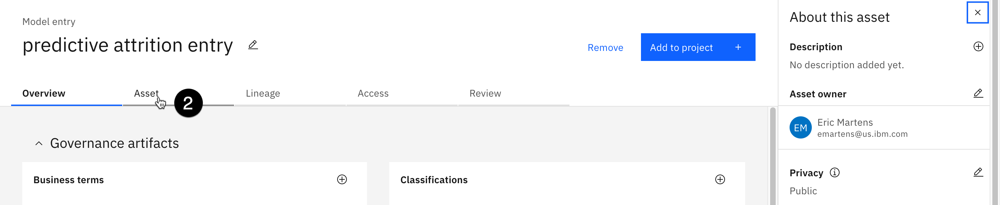

2. Select the **Asset** tab for the model entry. Note that there is now a new entry in the **Deploy** bucket. The spark model, which you deployed earlier, now has a new entry. Because it was promoted to a deployment space, it is listed underneath that space in the bucket.

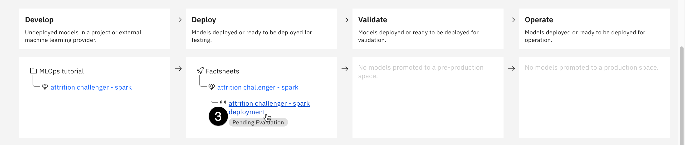

3. Click on the name of the deployed Spark model in the table. Note that the **Deployment information** section contains information on when the model was deployed, its associated deployment space, and how many copies are running. Also note that the **Evaluation information** section is blank, as the model is awaiting an evaluation.

## 6. Deploy a Python function

You saw earlier that it is easy to deploy models for use through a REST API.

Deploying functions gives you the ability to hide details (such as credentials), pre-process data before you pass it to models, handle errors, and include calls to multiple models, all within the deployed function instead of in your application.

To demonstrate this capability, this lab deploys a function that uses the already deployed **attrition challenger - spark deployment** model. Most of this part of the lab is through a notebook, but you need to prepare some information beforehand.

### Gather the necessary credentials

1. Make sure you have the API key that was created in the **Create an API key and a project token** portion of the [Augmenting open-source tools](/mlops/102) section. If you no longer have your API key, follow the instructions provided in that section to create a new one. Remember, you cannot go back and retrieve this key.
2. You will need to retrieve the GUID of your deployment space. Go to your [list of spaces](https://dataplatform.cloud.ibm.com/ml-runtime?context=cpdaas) and click on the link for your space.

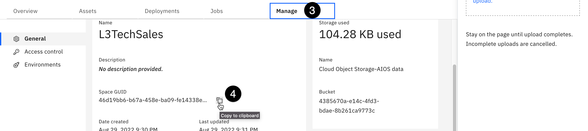

3. Select the **Manage** tab.
4. Copy the **Space GUID** by using the **copy** icon to the right of the GUID, and save it for later.

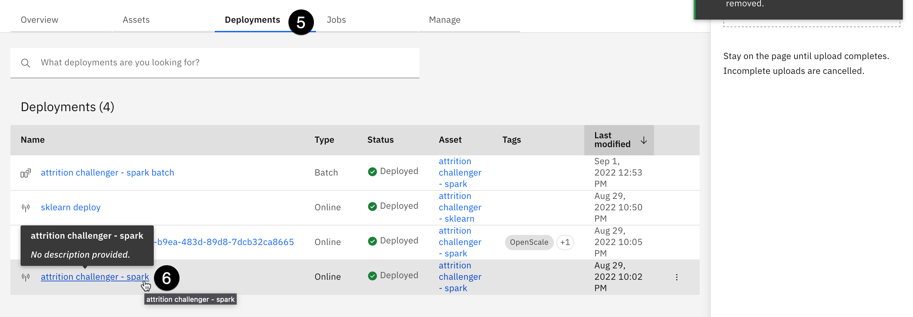

5. You will also need the deployment ID for the deployed Spark model. Select the **Deployments** tab.
6. Click on **attrition challenger - spark deployment** link from the list.

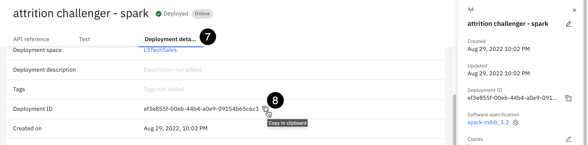

7. Select the **Deployment details** tab.
8. Copy the **Deployment ID** by using the **copy** icon to the right of the ID, save it for later.

### Run the notebook

1. Return to your [list of projects](https://dataplatform.cloud.ibm.com/projects?context=cpdaas) and click on the link for the project you are using.

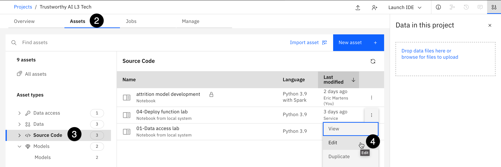

2. Select the **Assets** tab.
3. Select the **Notebooks** asset type from the list on the left.
4. Click the three vertical dots to the right of the **04-Deploy function lab** notebook, and select **Edit**. Follow the instructions and run through the notebook.

> Editing this notebook is done the same way you edited the **01-Data access lab** notebook in the **Accessing data** section.

<Danger text='The rest of this section assumes the successful completion of the notebook run.'/>

5. Go to your [list of spaces](https://dataplatform.cloud.ibm.com/ml-runtime?context=cpdaas) and click on the link for your space.
6. Select the **Assets** tab. Note that the function **attrition function** is now listed in the **Functions** section.

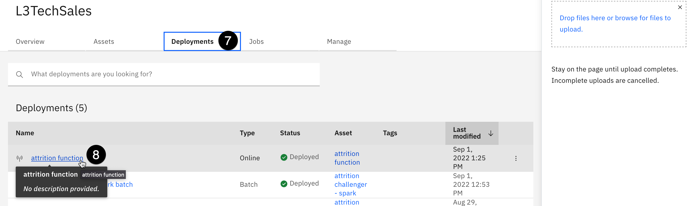

7. Select the **Deployments** tab.
8. Click on link for the deployed function: **attrition function**.
9. Select the **Test** tab.

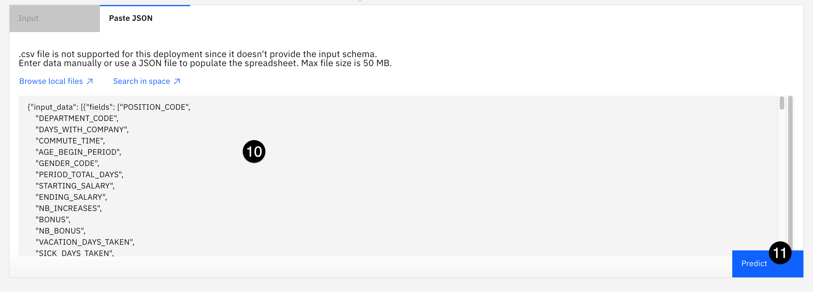

10. Drag and drop the records_to_score.json file to the text entry field.
11. Click the **Predict** button in the lower right.
12. Optionally: Change the view to a JSON view.

As you have seen, you can call the deployed Python function using both the notebook and the Watson Studio Cloud user interface. Deployed Python functions can be useful for preprocessing data sent to models, manipulating the data the models return, or even combining inputs and outputs for multiple models. In this case, the Python function called the **attrition challenger - spark deployment** model and processed the results to return only the prediction and its probability.
