# 105: Validación y seguimiento de los modelos

A lo largo de este laboratorio, has utilizado Watson Studio para trabajar con datos de múltiples fuentes, en múltiples formatos. Ha construido una variedad de modelos, utilizando métodos de código completo, de bajo código y sin código. Ha visto cómo Watson Studio registra automáticamente y hace accesible la información del ciclo de vida de los modelos. En este último paso, verá cómo los modelos pueden validarse y supervisarse en producción.

## 1. Configurar la supervisión de OpenScale

<QuizAlert />

1.  Vaya a [Watson Trust (OpenScale)](https://aiopenscale.cloud.ibm.com/).


Si es la primera vez que utiliza OpenScale, la herramienta le ofrecerá ejecutar una utilidad de configuración automática. Aunque tarda varios minutos en ejecutarse, se recomienda encarecidamente que lo haga, ya que creará un datamart y asociará sus servicios de aprendizaje automático. La configuración manual de OpenScale está fuera del alcance de este laboratorio. Seleccione **Configuración** automática para realizar la configuración automatizada.

Cuando haya terminado, haga clic en el botón azul **Let's go**. Comenzará una visita guiada por OpenScale. Puede realizar la visita para conocer OpenScale o cerrar las indicaciones y continuar.

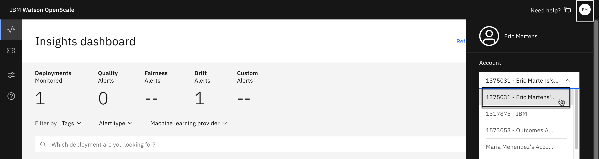

Si ha realizado la [demostración de Data Fabric](https://cp4d-outcomes.techzone.ibm.com/data-fabric/trusted-ai) o ha trabajado con otros servicios de OpenScale, es posible que no haya iniciado sesión en la instancia de OpenScale correcta. Compruebe que ha seleccionado la instancia correcta haciendo clic en el icono del avatar (probablemente sus iniciales) en la esquina superior derecha de la pantalla y, a continuación, seleccionando una instancia en el menú desplegable **Cuenta** para la que tenga permisos de **administrador**.

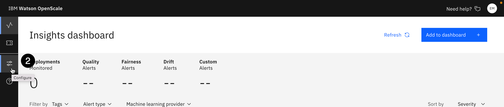

2.  Haga clic en el icono **Configurar** de la izquierda.
3.  En la lista **Obligatorio** de la izquierda, haga clic en **Proveedores de** aprendizaje automático. Si el espacio de despliegue que utilizaste para desplegar tu modelo ya aparece como proveedor de aprendizaje automático de preproducción, puedes saltar al paso 9.
4.  Haga clic en el botón azul **Añadir** proveedor de aprendizaje **automático** de la derecha para añadir un espacio de despliegue como proveedor de aprendizaje automático para OpenScale.

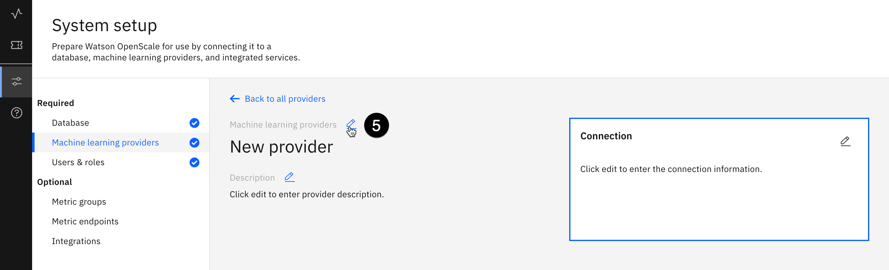

5.  Haga clic en el icono **Editar** (lápiz) situado encima de **Nuevo proveedor** para dar un nombre a su proveedor; por ejemplo, **preproducción de** bajas, y luego haga clic en el botón azul **Aplicar**.


6.  Haga clic en el icono **Editar** situado junto al mosaico **Conexión** de la derecha. Se abre la pantalla de configuración de **la** conexión.

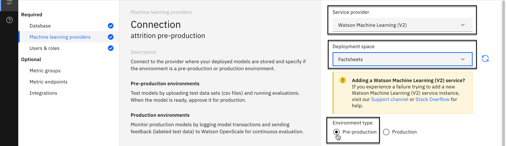

7.  Seleccione **Watson Machine Learning** en el desplegable **Proveedor de servicios**. Seleccione el **espacio de despliegue** que utilizó para desplegar sus modelos en el desplegable **Espacio de despliegue**. Asegúrese de que el **tipo de entorno** está establecido en el botón de opción **Preproducción**, lo que le permitirá realizar pruebas de validación en sus modelos en lugar de configurar una alimentación de datos continua.
8.  Haga clic en el botón azul **Guardar** de la parte inferior derecha.

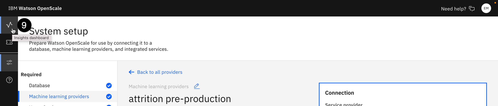

9.  Haz clic en el icono **del panel de control de Insights** (que parece un latido) situado a la izquierda.
10. Haga clic en el botón azul **Añadir al cuadro de mandos** en la parte superior derecha. Se abre la pantalla **Seleccionar un despliegue** de modelos.

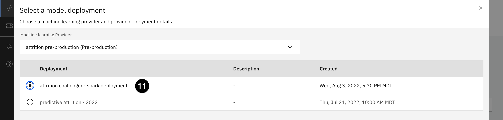

11. Utilice el menú desplegable **Proveedor de aprendizaje automático** para seleccionar el proveedor que acaba de añadir. La tabla de despliegue se rellenará. Seleccione el botón de opción asociado con el modelo Spark que desplegó en la sección [Despliegue de modelos y funciones](/mlops/104) de este laboratorio y haga clic en el botón azul **Configurar** en la parte inferior derecha.
12. Haga clic en el botón azul **Configurar monitores** en la parte inferior derecha para configurar los monitores OpenScale. Tenga en cuenta que esta configuración también se puede realizar a través de Python en un cuaderno Jupyter.

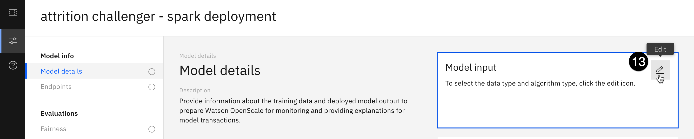

13. En la pantalla **Detalles del modelo**, haga clic en el icono **Editar** (lápiz) de la ficha **Entrada del modelo**.

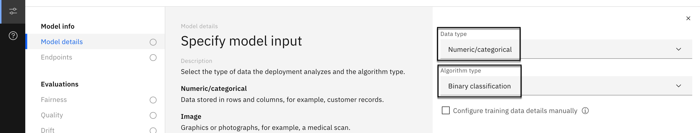

14. Seleccione **Numérico/categórico** en el desplegable **Tipo de datos**. Seleccione **Clasificación binaria** en el desplegable Tipo **de algoritmo**. Haga clic en el botón azul **Guardar y continuar** de la parte inferior.
15. En la pantalla **Detalles del modelo**, haga clic en el icono **Editar** (lápiz) del mosaico **Datos de entrenamiento**.
16. En el menú desplegable **Ubicación**, seleccione **Almacenamiento de objetos en la nube**. En el campo **ID de instancia de** recurso que aparece, copie y pegue el siguiente valor:

```txt
crn:v1:bluemix:public:cloud-object-storage:global:a/7d8b3c34272c0980d973d3e40be9e9d2:2883ef10-23f1-4592-8582-2f2ef4973639::
```

En el campo Clave API, copie y pegue el siguiente valor:

```txt
yqcPbWZ0AQPHleHVerrR4Wx5e9pymBdMgydbEra5zCif
```

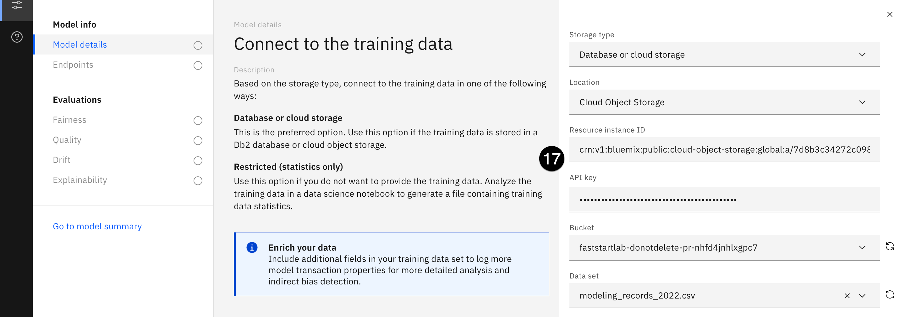

17. Haz clic en el botón **Conectar** situado debajo del campo de **la clave API**. Una vez establecida la conexión con el servicio de almacenamiento de objetos, utilice el menú desplegable **Bucket** para seleccionar **faststartlab-donotdelete-pr.**.. Aparecerá el desplegable **Conjunto de datos**. Utilícelo para seleccionar **modeling_records_2022.csv** y, a continuación, haga clic en **Siguiente**.

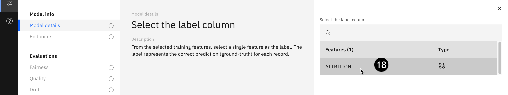

18. **ATTRITION** ya debería estar seleccionada como única opción para la columna de etiquetas de la derecha. Si no es así, selecciónela y haga clic en **Siguiente**.
19. En la pantalla **Seleccionar las características de entrenamiento**, todas las características han sido seleccionadas por defecto. Haga clic en **Siguiente** en la parte inferior derecha.
20. Utilice el menú desplegable **Método de puntuación** para seleccionar la opción **Carga útil JSON**. Elimine todo el texto del cuadro de texto que aparece y sustitúyalo por el código siguiente:

```json
[ { "request": { "fields": [ "CÓDIGO_PUESTO", "CÓDIGO_DEPARTAMENTO", "DÍAS_EN_EMPRESA", "HORA_VIAJE", "EDAD_INICIO_PERIODO", "CÓDIGO_SEXO", "DÍAS_TOTAL_PERIODO", "SALARIO_INICIAL", "SALARIO_FINAL", "NB_INCREMENTOS", "BONUS",
        "NB_BONUS", "VACATION_DAYS_TAKEN", "SICK_DAYS_TAKEN", "PROMOTIONS", "NB_MANAGERS", "DAYS_IN_POSITION", "DAYS_SINCE_LAST_RAISE", "RANKING_CODE", "OVERTIME", "DBLOVERTIME", "TRAVEL" ], "values": [ [ 5400.0, 390.0, 1363.0, 28.0, 42.0, 0.0, 330.0, 67653.85, 71230.77, 1.0, 2849.2308, 1.0, 29.0, 9.0, 0.0, 1.0, 1363.0, 270.0, 3.0, 0.0, 0.0, 0.0 ], [ 2600.0, 320.0, 2687.0, 0.0, 35.0, 1.0, 330.0, 31692.31, 33307.69, 1.0, 1267.6924, 1.0, 15.0, 11.0, 0.0, 1.0, 2687.0, 120.0, 3.0, 255.9375, 71.7609375, 0.0 ] }, "response": { "fields": [ "CÓDIGO_PUESTO", "CÓDIGO_DEPARTAMENTO", "DÍAS_EN_EMPRESA", "TIEMPO_VIAJE", "EDAD_INICIO_PERIODO", "CÓDIGO_SEXO", "DÍAS_TOTAL_PERIODO", "SALARIO_INICIAL", "SALARIO_FINAL", "INCREMENTOS_NB", "BONIFICACIÓN", "BONIFICACIÓN_NB", "DÍAS_VACACIONES_TOMADOS",
        "SICK_DAYS_TAKEN", "PROMOTIONS", "NB_MANAGERS", "DAYS_IN_POSITION", "DAYS_SINCE_LAST_RAISE", "RANKING_CODE", "OVERTIME", "DBLOVERTIME", "TRAVEL", "features", "rawPrediction", "probability", "prediction" ], "values": [ [ 5400.0, 390.0, 1363.0, 28.0, 42.0, 0.0, 330.0, 67653.85, 71230.77, 1.0, 2849.2308, 1.0, 29.0, 9.0, 0.0, 1.0, 1363.0, 270.0, 3.0, 0.0, 0.0, 0.0, [ 5400.0, 390.0, 1363.0, 28.0, 42.0, 0.0, 330.0, 67653.85, 71230.77, 1.0, 2849.2308, 1.0, 29.0, 9.0, 0.0, 1.0, 1363.0, 270.0, 3.0, 0.0, 0.0, 0.0 ], [1.499764255005011, -1.499764255005011], [0.9525528219338582, 0.04744717806614185], 0.0 ], [ 2600.0, 320.0, 2687.0, 0.0, 35.0, 1.0, 330.0, 31692.31, 33307.69, 1.0, 1267.6924, 1.0, 15.0, 11.0, 0.0, 1.0, 2687.0, 120.0, 3.0, 255.9375, 71.7609375, 0.0, [ 2600.0, 320.0, 2687.0, 0.0, 35.0, 1.0, 330.0, 31692.31, 33307.69, 1.0, 1267.6924, 1.0, 15.0, 11.0, 0.0, 1.0, 2687.0, 120.0, 3.0, 255.9375, 71.7609375, 0.0 ], [-1.5153949701647946, 1.5153949701647946], [0.0460541100395183, 0.9539458899604817], 1.0 ] ] } } ]
```

21. Haga clic en el botón **Enviar ahora** situado debajo del cuadro de texto. Una vez que la solicitud de puntuación se haya realizado correctamente, haga clic en **Siguiente**.

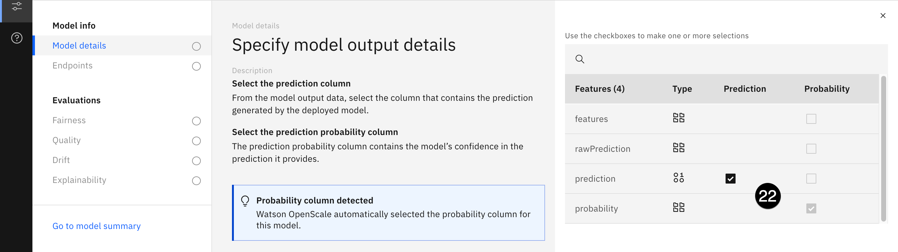

22. Los campos de **predicción** y **probabilidad** se han identificado correctamente, así que haga clic en **Guardar**.

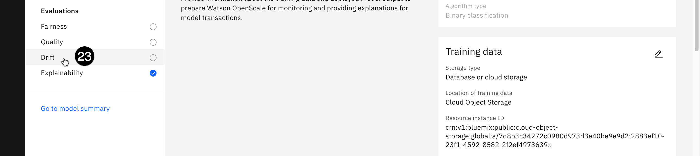

23. Cuando el modelo termine de guardarse, volverá a la pantalla **Detalles del modelo** y podrá empezar a configurar los monitores. En primer lugar, haga clic en el monitor de **deriva** en la lista de **evaluaciones** de la izquierda. OpenScale puede entrenar el monitor de deriva utilizando los datos de entrenamiento a los que proporcionó una conexión en un paso anterior.
24. Haga clic en el icono **Editar** del mosaico del **modelo Drift** de la derecha. Seleccione el botón de opción **Entrenar en Watson OpenScale** y haga clic en **Siguiente**. OpenScale entrenará un modelo de deriva independiente que compara las entradas del modelo con los datos de entrenamiento y predice la precisión del modelo. Por ejemplo, si los datos enviados al modelo son similares a los datos de entrenamiento que el modelo tiene dificultades para predecir con precisión, el modelo de desviación de OpenScale puede advertir de posibles problemas de precisión en tiempo real. El modelo de deriva puede ser entrenado automáticamente por OpenScale si tiene acceso a los datos de entrenamiento, o entrenado manualmente por un usuario con el código del cuaderno proporcionado en el enlace de la pantalla de configuración.
25. Deje los umbrales de alerta como están y vuelva a hacer clic en **Siguiente**.
26. Establezca el **Tamaño mínimo de la muestra** en **100** y haga clic en **Guardar**. OpenScale comienza a entrenar el modelo de deriva en segundo plano mientras usted configura otros monitores. En un escenario del mundo real, dejaría estos mínimos de muestra en sus valores por defecto o incluso los aumentaría. Sin embargo, para los propósitos de este laboratorio, bajarlos le permitirá ver los resultados de la monitorización del modelo más fácilmente.
27. Haga clic en el monitor de **calidad** de la lista de **evaluaciones** de la izquierda y, a continuación, en el icono **Editar** del mosaico **Umbrales de** calidad de la derecha.
28. Observe la gran variedad de métricas de calidad que proporciona OpenScale, y que cada una de ellas puede configurarse con un umbral de alerta diferente. Por ahora, déjalas todas en 0,8 y haz clic en **Siguiente**.
29. Una vez más, ajuste el **Tamaño mínimo de la muestra** a **100** y haga clic en **Guardar**. Ya ha terminado de configurar los monitores para este modelo. Tenga en cuenta que no configuró un monitor de equidad para este modelo en particular. Si fuera a desplegar el modelo de contratación de AutoAI que construyó en la sección de [soluciones No-code y low-code](/mlops/103), podría configurar OpenScale para monitorizar la equidad para cualquiera de los campos incluidos en ese modelo.

## 2. Evaluar el modelo

1.  Haga clic en el icono **del panel de control de Insights** (que parece un latido) a la izquierda para volver al panel de control. Ahora debería ver el modelo de desgaste de Spark en el tablero. Si lo desea, puede volver a la entrada del modelo en el catálogo y ver que el modelo ha pasado del bucket de **despliegue** al bucket de **validación**, ya que IBM FactSheets realiza un seguimiento del modelo a lo largo de su ciclo de vida.
2.  Haga clic en la ficha del modelo Spark. Cuando se cargue la pantalla de evaluaciones, verás que aún no hay métricas disponibles. Esto se debe a que el modelo no ha sido evaluado. Haga clic en el menú desplegable azul **Acciones** de la parte superior y seleccione **Evaluar ahora**.

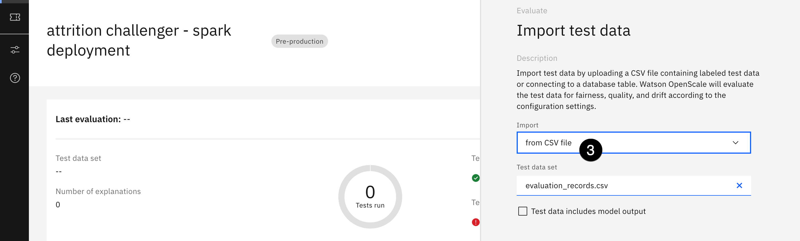

3.  Utilice el menú desplegable **Importar** para seleccionar **un archivo CSV**.
4.  Descargue el archivo [evaluation_records.csv](https://raw.githubusercontent.com/CloudPak-Outcomes/Outcomes-Projects/main/TrustedAI-L3-Tech-Lab/evaluation_records.csv) a su ordenador. Puede hacer clic con el botón derecho del ratón en el enlace de su navegador y seleccionar **Guardar como**.. **.**, o hacer clic con el botón izquierdo del ratón en el enlace para abrirlo en una nueva ventana y, a continuación, hacer clic con el botón derecho del ratón en la página y seleccionar **Guardar como....**. Una vez guardado el archivo, arrástrelo y suéltelo en la ventana o búsquelo en su sistema de archivos.
5.  Haga clic en **Cargar y evaluar**. OpenScale utilizará los datos "reales" del archivo suministrado para evaluar el modelo en función de los parámetros de deriva y calidad configurados. La evaluación puede tardar varios minutos en completarse.

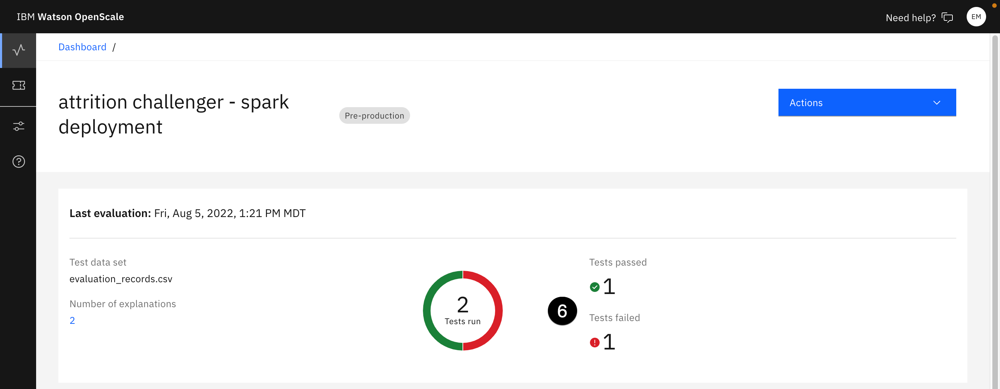

6.  Cuando termine la evaluación, podrá ver cómo se ha comportado su modelo tanto en la métrica de deriva como en la de calidad. Tómese un momento para revisar rápidamente las puntuaciones y cualquier infracción. En el ejemplo que se muestra en la captura de pantalla anterior, se ha aprobado una evaluación**(Precisión**) y se ha suspendido otra**(Der**iva). Esto significa que la puntuación de precisión para este modelo estaba por encima del umbral especificado cuando se configuró el monitor, y la puntuación de deriva cayó por debajo del umbral especificado. Tenga en cuenta que, debido a la selección aleatoria de los datos de entrenamiento y prueba durante el desarrollo del modelo, las puntuaciones de su modelo pueden diferir de las de las capturas de pantalla.

## 3. Ver la ficha

1.  Vuelva a la pestaña Activo de la entrada FactSheet de sus modelos. Puede utilizar la URL directa para abrir el activo del catálogo en otra pestaña.


Si no dispone de la URL, navegue hasta [IBM Cloud Pak for Data](https://dataplatform.cloud.ibm.com/), introduzca el nombre de la entrada de modelo en la barra de búsqueda de la parte superior de la pantalla y pulse la tecla **Intro**.

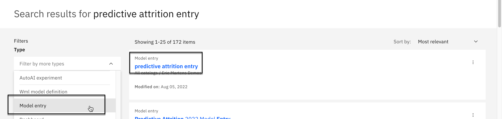

Si es necesario, ajuste el filtro desplegable **Tipo de** la izquierda a Entrada **modelo**. Seleccione la entrada modelo que creó anteriormente en la lista de resultados de búsqueda y haga clic en la pestaña **Activo** una vez que se cargue.

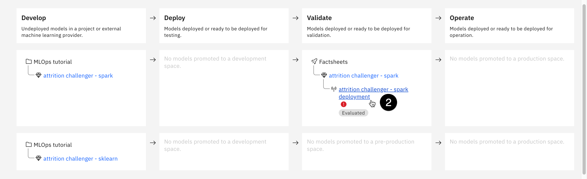

2.  Observe que el modelo Spark se ha movido al bucket **Validar** de la hoja de datos y que se ha evaluado el despliegue. Haga clic en el enlace asociado al despliegue.
3.  Desplácese hacia abajo hasta la sección **Información de la evaluación**. Aquí puede ver el ID de la instancia de OpenScale utilizada para realizar la evaluación, la hora y la fecha en que se realizó y el conjunto de datos utilizado. Más abajo en la página, puede ver las secciones **Calidad** y **Deriva**, que muestran las mismas puntuaciones de evaluación que OpenScale. La aparición de esta información en el catálogo proporciona un método fácil, automatizado y gobernado para que los validadores de modelos obtengan información actualizada sobre el rendimiento del modelo, que pueden utilizar para decidir si lo ponen en producción o no.

## 4. Aprobar el modelo para la producción

1.  Vuelva al [panel de OpenScale Insights](https://aiopenscale.cloud.ibm.com/aiopenscale/insights/) y haga clic de nuevo en el mosaico del modelo Spark.

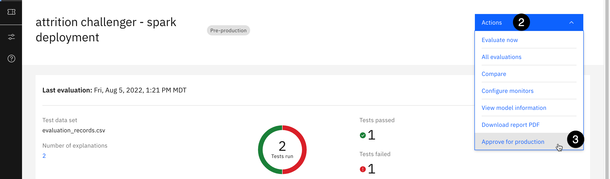

2.  Haga clic en el menú desplegable azul **Acciones**.
3.  Seleccione **Aprobar para producción**. Se abrirá una ventana modal pidiéndole que confirme su elección. Haga clic en **Aprobar** para confirmar.

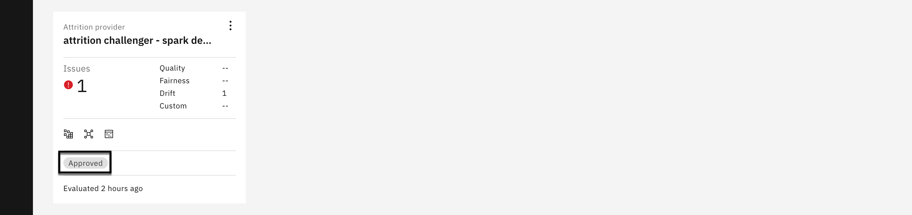

## Limpieza

En este laboratorio, has creado servicios, importado un proyecto, importado un bloc de notas, creado un catálogo, un espacio de despliegue y mucho más. Es posible que desee liberar estos recursos si no planea reutilizarlos pronto, pero tenga en cuenta que los servicios y otros activos son requisitos previos para varios laboratorios.

Como mínimo, debe **eliminar** los despliegues que se crearon. Estos despliegues son servicios de la API REST que se están ejecutando y utilizando recursos. Siempre puede volver a desplegarlos cuando desee reutilizarlos. Por supuesto, esto significa que sus **identificadores de** despliegue cambiarán y que cualquier referencia a ellos deberá actualizarse. Sus entradas y configuraciones se eliminarán de OpenScale, y sus métricas y detalles de evaluación de despliegue ya no estarán disponibles en la entrada FactSheet del modelo.

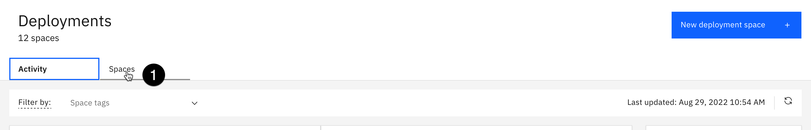

1.  Para eliminar las implantaciones, vaya a la [lista de implantaciones](https://dataplatform.cloud.ibm.com/ml-runtime/spaces?context=cpdaas) y seleccione la pestaña **Espacios**.
2.  Haga clic en el enlace asociado al espacio de despliegue que ha utilizado.

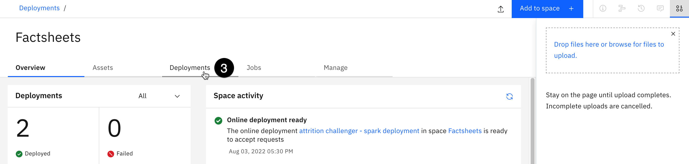

3.  Seleccione la pestaña **Despliegues**.

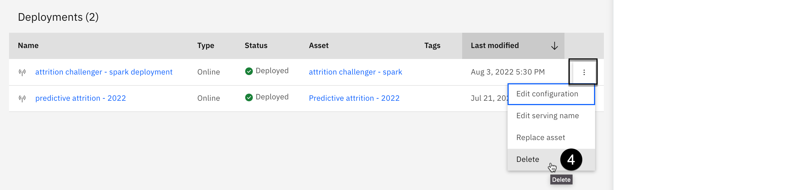

4.  En la tabla **Despliegues**, pase el ratón por encima de una de las filas, haga clic en el botón con tres puntos verticales que aparece en la columna de la derecha y haga clic en **Eliminar**.
5.  Se abrirá una ventana de confirmación. Haga clic en el botón rojo **Eliminar** para confirmar la eliminación.
6.  Repita los pasos 4 y 5 para eliminar cualquier otro despliegue no deseado. Tenga en cuenta que los modelos que ha creado seguirán apareciendo en la pestaña **Activos** del espacio de despliegue, y se pueden volver a desplegar desde allí si se necesitan de nuevo.
