# Maximo Visual Inspection Lab Prerequisites

## Step 1: Access to Maximo Application Suite Demo Environment

Completing this lab requires access to the latest version of the worldwide Maximo Application Suite (MAS) v8.6 demo cluster environment. To make a reservation for the MAS demo environment, please perform the following steps,

1. Click on this [**TechZone form**](https://techzone.ibm.com/my/reservations/create/635952829aaefe0019bea350) to request access to the MAS demo environment.
1. On this form, select **Reserve now** or schedule a preferred time to provision your demo environment access (by selecting **Schedule for later** option) and click **Submit**.

3. Click **Purpose** and select **Practice/Self-Education** from the drop-down list **(A)**.
4. Click **Purpose description** and enter “To follow Maximo Visual Inspection Level 3 Demo Script” **(B)**.
5. Click **Preferred Geography** and select **Americas** from the drop-down list **(C).**
6. Choose an **End date and time** which ensures you have the time required to complete the demo script **(D)**.
7. Click **Submit (E)**. You will receive an email almost immediately that your environment has begun provisioning. After 5-10 minutes, you’ll receive another email notifying that your environment is ready, with details on how to access it.

**Caution:** The default duration for reserving this demo environment is 3 days (72 hours), with a maximum duration of 2 weeks (336 hours) depending on the end date you choose when booking the demo (screenshot below). Please try and complete this demo script within the time requested to avoid losing demo access before completion.

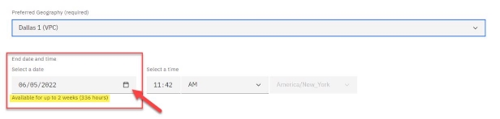

8. Once you receive an email notifying your environment is ready to use, locate the URL (Uniform Resource Locator) link in this email for the demo environment **MAS v8.6 Demo Environment URL** and the list of corresponding login credentials. This URL and login credentials will be used later in the demo script.

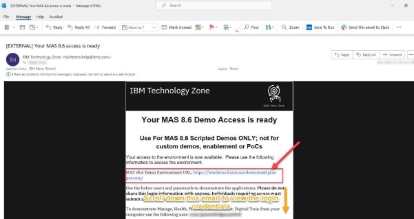

9. Scroll down this email to view a list of login credentials for each application in the Maximo Application Suite. To follow this demo script, you only require using Maximo Visual Inspection (MVI) username and password. Take a note of the username and password for Maximo Visual Inspection (MVI), as it will be required to log in to the application at a later step.

### Step 2: Download the Training and Validation Tank Images for the AI Model\*\*

1. **Download** the images folder from[ Seismic ](https://ibm.seismic.com/Link/Content/DCpWQCmg4Wbg889TgW8X383JR7XB)to your local machine. These images of Sedimentation tanks will be used to train the computer vision model in the later steps.

2. **Unzip** the downloaded file and note the location of the directory where you unzipped the file. Once the images are downloaded and unzipped, switch back to the MVI **Data sets** screen (from step 1 in this section)
3. **Download** the model validation images from the Seismic folder link[ Images of Sedimentation Tanks for Testing.](https://ibm.seismic.com/Link/Content/DC6Mq74dFcQV28fG6F74fCpMc9H3) Unzip the images folder and take note of the location of that folder (like you did in[ Step 3: Create a Dataset for Model Training ](#_page0_x57.00_y410.00)). Note that there are multiple images of sedimentation tanks in clean and dirty conditions in the downloaded images folder as shown in the screenshot below.

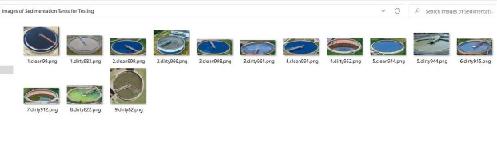

## Step 3: Install MVI Mobile Application:

1. Open the Apple App Store on your iPhone or iPad and search for **“**IBM Maximo Visual Inspection**”** and click on the result (IBM Maximo Visual Inspection).

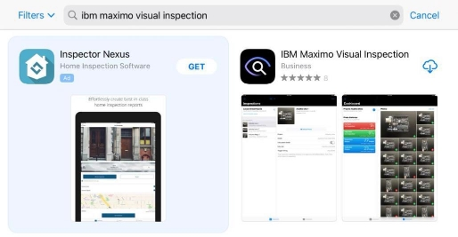

2. Clicking the application search result will direct to the application information and download page. This page contains a high-level overview of the IBM MVI Mobile application.

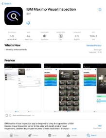

3. Click the **download** icon button (or **Get** button, depending on your device) to install the app on your device.

4. Once installed you will have a Maximo Visual icon on one of the pages in your device’s home screen.

5. If still on the MVI Mobile page in the App Store, click the **OPEN** button to run the app (or alternatively, if you have gone to your home screen then click on the **Maximo Visual icon** to start it).
6. If this is the first time starting the app, you will be presented with Terms and Conditions. Read them and click on **Agree** (step figure not shown).
7. At this point you can choose whether to explore MVI Mobile (demo mode) or get started right away. Click on **I already have an account** (since you already have an account of the MVI training server – where you labeled tank images)

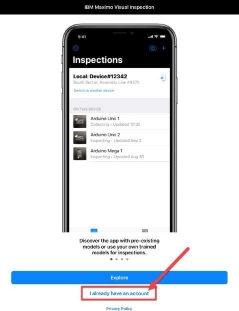

8. You will be prompted to allow MVI Mobile to access the Camera, Photos, and Bluetooth; click **OK** for each one (figure not shown for this step).
9. Once all permissions are allowed, **Name this Device** page appears, enter a name of your choosing in the Device Name field (e.g., “Sedimentation Tank iPad”). Enter a location of your choosing in the Location field (e.g., “Office”). Then click **Next**.

10. At this point you can click **Next** and exit out of the application. The remaining tasks are part of the demo and are defined in[ Part four ](#_page0_x57.00_y546.00)of the demo script.

## Step 4: Signup Twilio Trial Account for Text Message (SMS) Notifications

MVI Mobile and MVI Edge are tightly integrated with Twilio (https://www.twilio.com), a cloud communications platform-as-a-service that allows consumers to programmatically make and receive phone calls, send, and receive text messages, and perform various other communications functions.

This integration allows MVI Mobile and MVI Edge to send a text message (SMS) notification to a mobile phone number when an inspection is completed. Included in the message is information about the objects detected in the inspection image.

Sending text messages via Twilio requires a Twilio account. It also requires that a phone number be assigned to your account. This is not your own personal phone number, but one that Twilio provisions for you. It is a real phone number that effectively provides a software application (MVI Mobile and Edge in this case) with a virtual presence within the physical telephony network. The Twilio phone number will be used to send text messages to your own personal or corporate mobile phone. In other words, you will be receiving text messages on your own mobile phone, and they will be coming from the Twilio phone number assigned to you.

Twilio has partnerships with various telecom providers around the world, from which they have reserved blocks of phone numbers.

Twilio offers a trial account with a preloaded amount of credit (this amount may differ depending on where you are in the world). **No credit card is required** to sign up for this trial account.

Follow the instructions below to sign up for a Twilio account and note your account details particularly;

1. Messaging Service SID
2. Account SID
3. Authorization token
4. Twilio Phone number

**Actions:**

1. Go to Twilio’s website (http[s://www.twilio.com/). ](<http://www.twilio.com/)>)
2. Click the **Sign-up** button on the far top right of the screen.

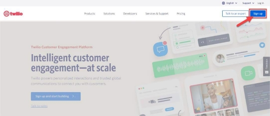

3. Fill in your personal information **(A)** and then click the **Start your free trial** button **(B)**.

4. You will be sent a verification email to the email address you provided when signing up in the above step. Click the **Confirm Your Email** link within the email you received in your inbox.

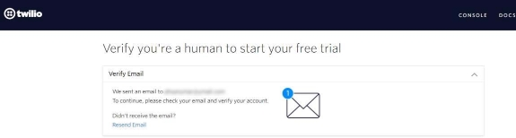

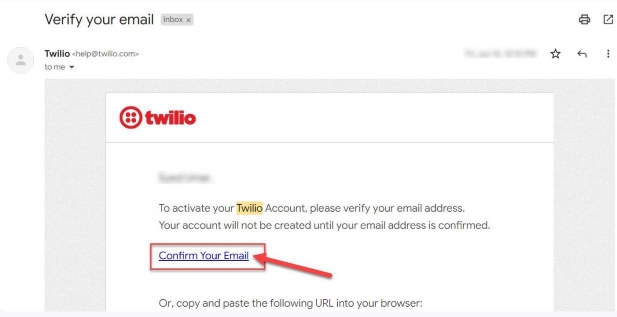

5. Once your email has been verified you will also be asked to verify your own personal/corporate mobile phone number. Enter your **mobile phone number** and click the **Verify** button.

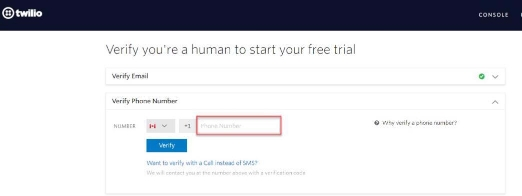

6. Once you’ve received the verification code on your phone number as SMS, enter it

**(A)** and then click **Submit (B)**.

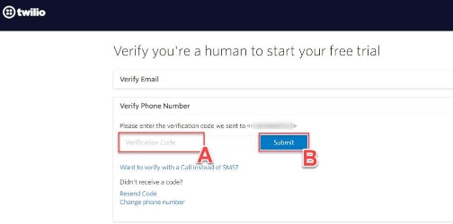

7. You will be prompted with a series of questions about how you intend to use Twilio. Answer the questions as required (you may take inspiration from the screenshot below)

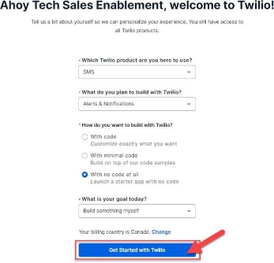

8. You will now be taken to the main dashboard screen. If you ever leave the page, you can always click **My first Twilio account** label on the top left of the screen to get back to it.

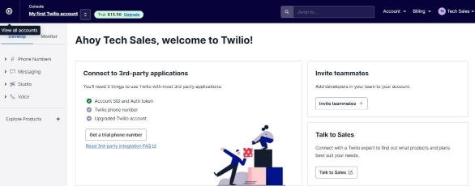

You will start with a trial balance of credit. Each phone number that you provision (you will only use one in this demo) and all text/API interactions between MVI Mobile and Twilio, and Twilio and your mobile phone, will consume some of this credit.

9. From the dashboard, click on the **Get a Trial Number** button.

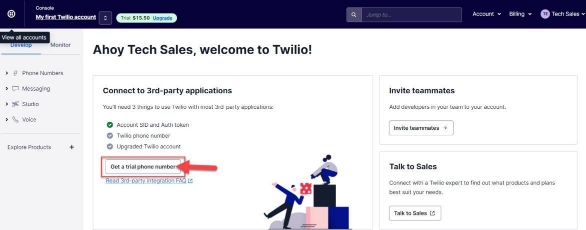

10. Next, scroll down below where your newly provisioned phone number will now be visible under **My Twilio phone number** label.

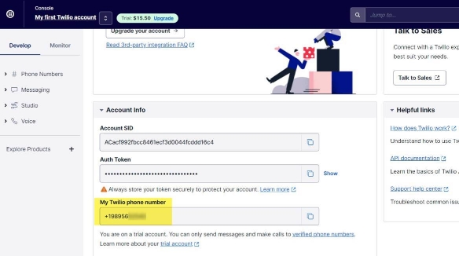

You now have a phone number associated with your account. The next step is to setup a messenger service within Twilio and associate it with your new phone number. This is done with Twilio’s “Messaging” capability, which allows text messages (SMS) to be sent and received worldwide.

11. From the left side panel of the main dashboard, click **Messaging** (**A)** and then click **Services** from the sub-menu that opens.

12. **Messaging Services** page appears on the right, click **Create Messaging Services** blue button.

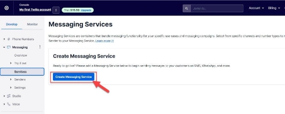

13. When prompted to create the new messaging service, enter a name of your choosing for the **FRIENDLY NAME** (e.g., **“Tank Health Detection Alert Service”**) and then select **Notify my users** for the purpose from the drop-down menu. Finally, click the **Create Messaging Service** button.

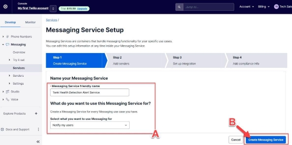

14. Next you will be prompted to add senders to your messaging service. Click **Add Senders** button here.

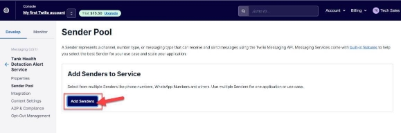

15. **Add Senders** screen opens. Select **Phone Number** under **Sender Type** dropdown menu option **(A)** and click **Continue (B)**.

16. **Add Senders** page appears. At the bottom of the screen, you will see any Twilio numbers provisioned for your account. Click on the checkbox next to the number assigned to your account. Finally click on **Add Phone Numbers**. Now you have configured SMS inspection alerts to be sent by this Twilio number.

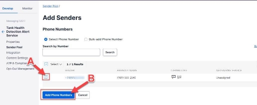

17. To record the Messaging Service SID, click **Properties** from the left side panel to view the properties of your newly created messaging service.

18. Take note the Messaging Service SID from the screen **(A)** (you can copy it on a new notepad file). Afterwards, click on **My first Twilio account** to go back to the main dashboard screen **(B)**.

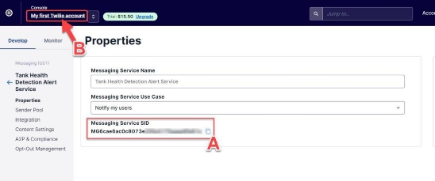

19. On the dashboard screen, record the following pieces of information (you can copy it on the same notepad file you recorded the Messaging Services SID in the previous step).

- Account SID
- Authorization token (click **Show** to see the value)
- Phone number

20. Save the Notepad file where you recorded the Twilio account details. You will use this information to configure MVI Mobile/MVI Edge and Twilio connectivity in[ Part four : Step 3 Integrating MVI Mobile with Twilio Account.](#_page0_x57.00_y407.00)
