# Guía de preparación de la demostración

## Introducción

En este laboratorio, usted configurará una instancia de demostración del producto QRadar Security Information and Event Management con datos de muestra. Después, el ambiente puede ser usado para explorar las características clave del producto o para entregar una demostración a un cliente.

Aquí están los enlaces complementarios para que usted pueda utilizar **después** de completar el taller en persona.

- Vea el [vídeo de ejemplo](https://ibm.seismic.com/Link/Content/DCDJ8qCbhJPB28MTDjXBpB63WP7d)que muestra cómo puede realizarse esta demostración.

- Solicite una nueva demostración en vivo utilizando la [Instancia de QRadar reservada en la Zona Técnica](https://ibm.biz/L300-SEIM-TZ).

- Prepare la demostración como se describe en esta [guía de preparación de demostraciones](/qradar-siem/102).

- [OPCIONAL] Utilice la [demo virtual, también conocida como demo click-through,](https://ibm.seismic.com/Link/Content/DCMh7JWdbXjQR89MR2TRjBJmPhJG)para este caso de uso.

### Requisitos previos

Aunque no es obligatorio, para obtener la mejor experiencia, se recomienda encarecidamente el uso de una VPN con [WireGuard](https://www.wireguard.com/). Por favor, instale esta aplicación en su estación de trabajo antes de completar el intento de conectarse a QRadar utilizando la URL directa o SSH directo. Si está utilizando una plataforma Microsoft Windows 10 o posterior, incluye un cliente SSH. De lo contrario, puede instalar [PuTTY](https://www.putty.org/) o [git bash](https://gitforwindows.org/) para el acceso SSH directo.

### \[OPCIONAL] Solicitar acceso a un despliegue en directo

Más adelante, si desea demostrar el caso de uso utilizando el sistema en vivo, puede solicitar acceso al sistema de demostración de QRadar SIEM en la Zona Tecnológica de IBM. Para el taller presencial, estos pasos ya se han realizado por usted, así que pase a la [siguiente sección](#learn-about-lab-architecture-and-get-access)

TODO - actualizar capturas de pantalla, TechZone ha cambiado

1. Utilice el siguiente enlace para acceder a la instancia de QRadar en IBM TechZone.

    [https://ibm.biz/L300-SEIM-TZ](https://ibm.biz/L300-SEIM-TZ)

    **Sugerencia**: La URL distingue entre mayúsculas y minúsculas.

2. Utiliza tu IBMid para autenticarte en el sitio.

3. En la barra de menú de la izquierda, seleccione **Entornos**.

    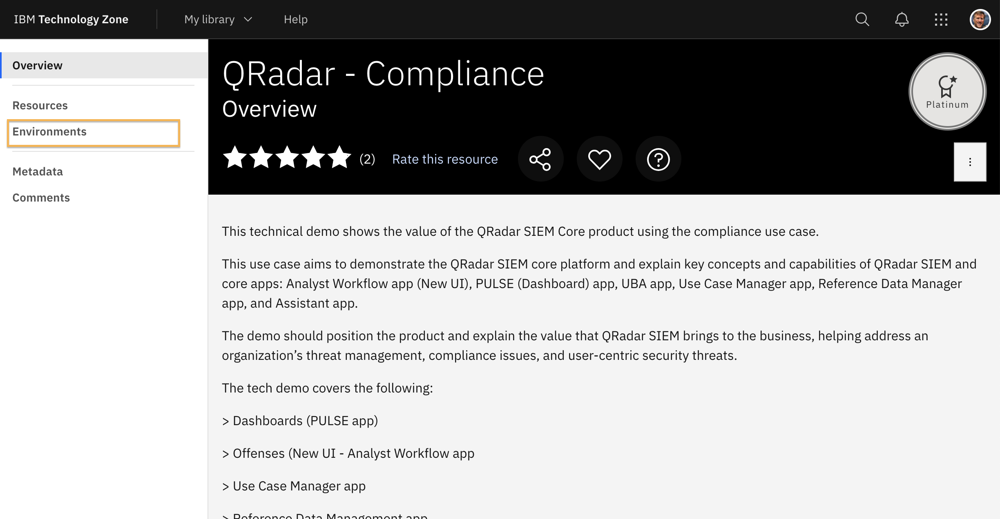

4. Haga clic en **Reservar**.

    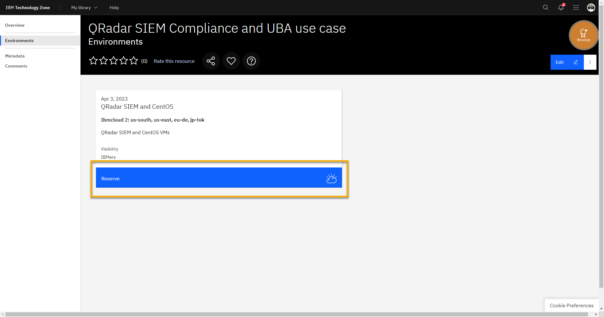

5. Seleccione **Reservar ahora**.

    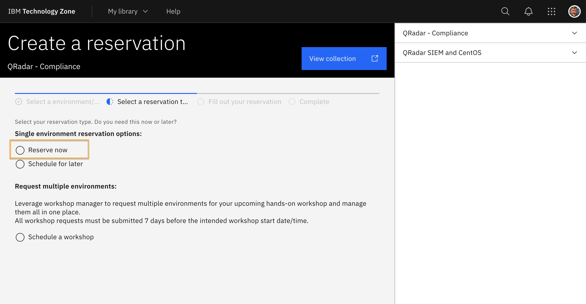

6. En el formulario Rellene su reserva, rellene todos los campos y, en Geografía preferida, elija el centro de datos geográfico más cercano para reducir la latencia y mejorar la experiencia de demostración.

    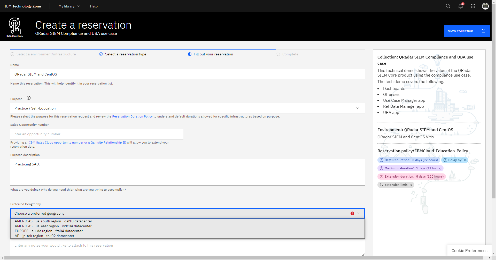

7. Seleccione una hora de reserva adecuada.

    > La demo también ofrece dos extensiones.

    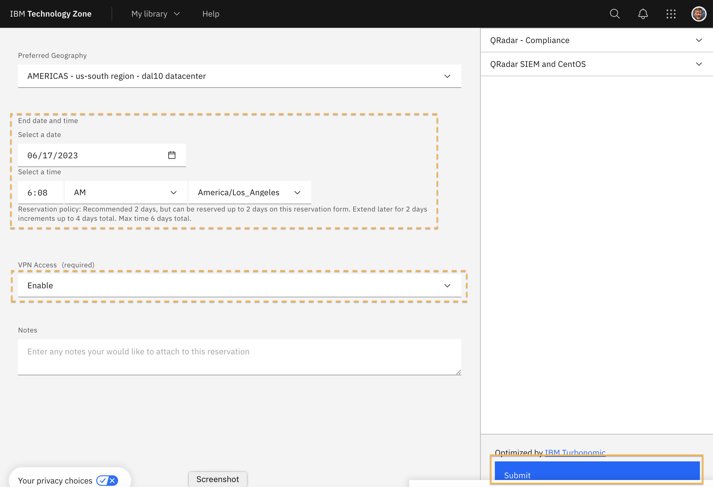

8. **Envíe** su reserva.

9. Para ver el estado de su nuevo entorno, vaya a **Mis reservas**.

    [\[https://techzone.ibm.com/my/reservations\]](https://techzone.ibm.com/my/reservations)

    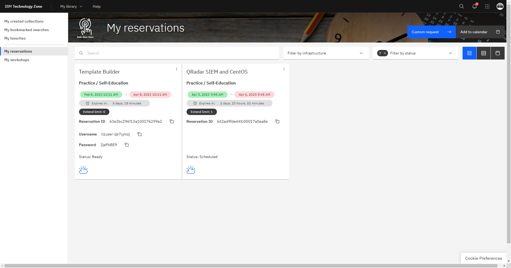

    **Sugerencia**: La reserva tarda unos **30 minutos** en efectuarse. Después podrás acceder a la demo.

## Conozca la arquitectura del laboratorio y obtenga acceso

El laboratorio de QRadar SIEM utiliza dos máquinas virtuales.

- CentOS 8
- QRadar SIEM

El sistema Linux CentOS se utiliza como sistema de salto para acceder a la máquina virtual QRadar SIEM a través de SSH (terminal) y HTTPS (navegador).

- Para el acceso SSH utilice la cuenta root y la contraseña `Q1d3m0`
- Para el acceso HTTPS, utilice la cuenta `admin` y la contraseña `Q1d3m0.Demo`

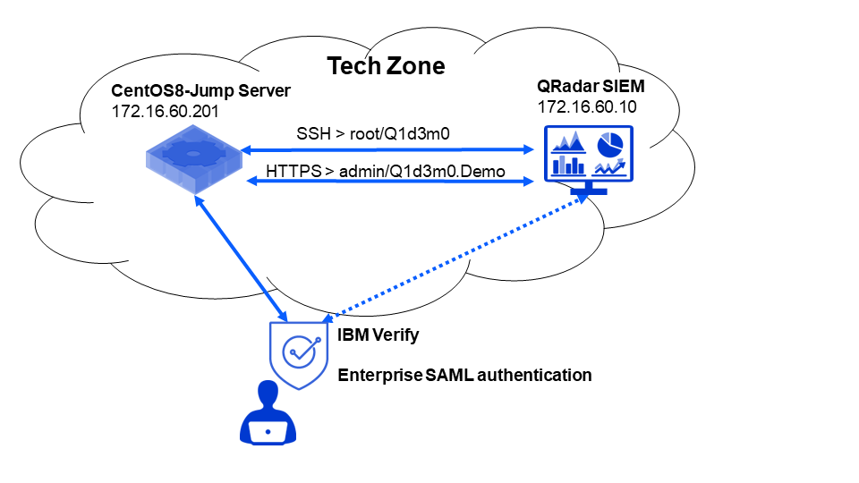

Para obtener la respuesta más rápida, recomendamos [utilizar VPN para acceder directamente al laboratorio](#using-wireguard-vpn-to-access-the-lab), pero si no desea configurar el software adicional, que consiste en WireGuard y un cliente SSH, puede utilizar un navegador web para [acceder a un escritorio virtual en el servidor Jump](#using-the-jump-server-to-access-the-lab).

### Usando WireGuard VPN para acceder al laboratorio

Usted ya debe tener [WireGuard](https://www.wireguard.com/) instalado y funcionando en su estación de trabajo.

1. Una vez aprovisionada la demo, desde la página Mis reservas, haga clic en su demo reservada.

    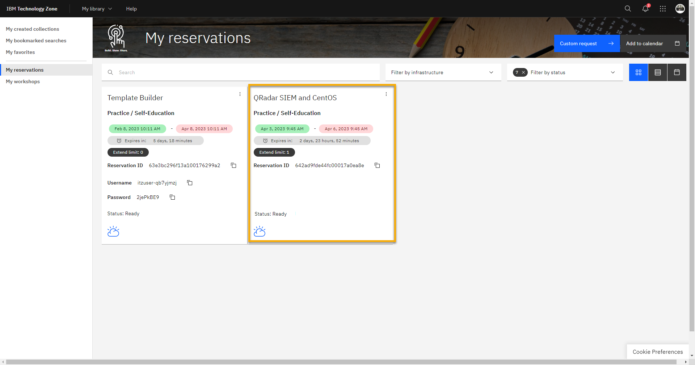

2. Desplácese hasta la parte inferior de la página de reserva y haga clic en la descarga para la configuración de la VPN

    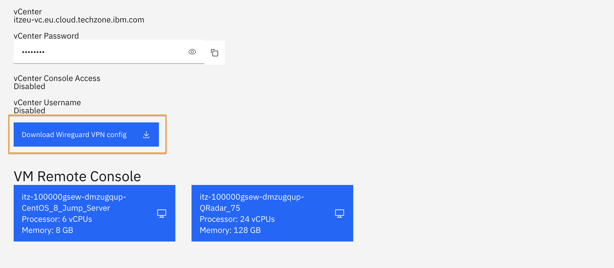

3. Una vez descargado el archivo `conf_wg_download.conf`, desde la aplicación WireGuard, seleccione la opción **Importar túnel(es) desde archivo**

4. Seleccione el archivo utilizando el explorador de archivos y haga clic en **Importar**. Inmediatamente después, si la aplicación o el sistema operativo le piden que añada el túnel, **Permita** la solicitud.

    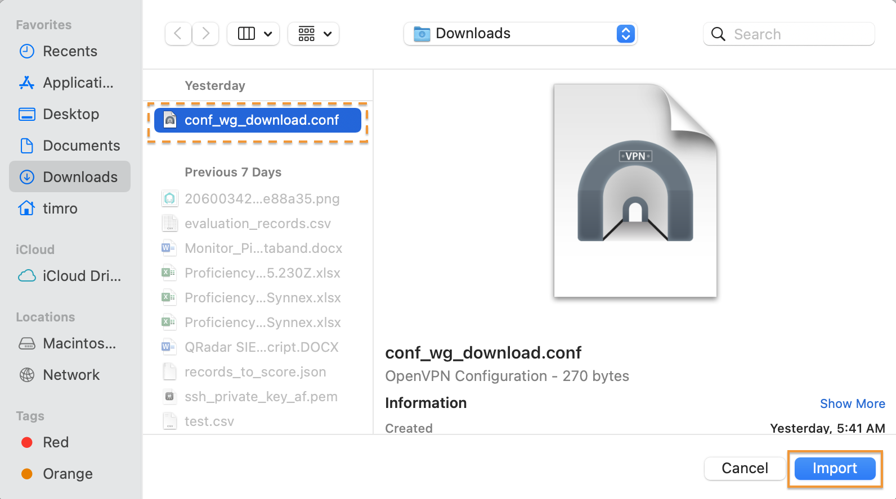

5. Con la configuración seleccionada en el panel **Manage WireGuard Tunnels**, seleccione en **Edit**.

6. Seleccione y elimine la entrada **DNS**, ya que este laboratorio no requerirá acceso para resolver nombres DNS a través de la VPN.

    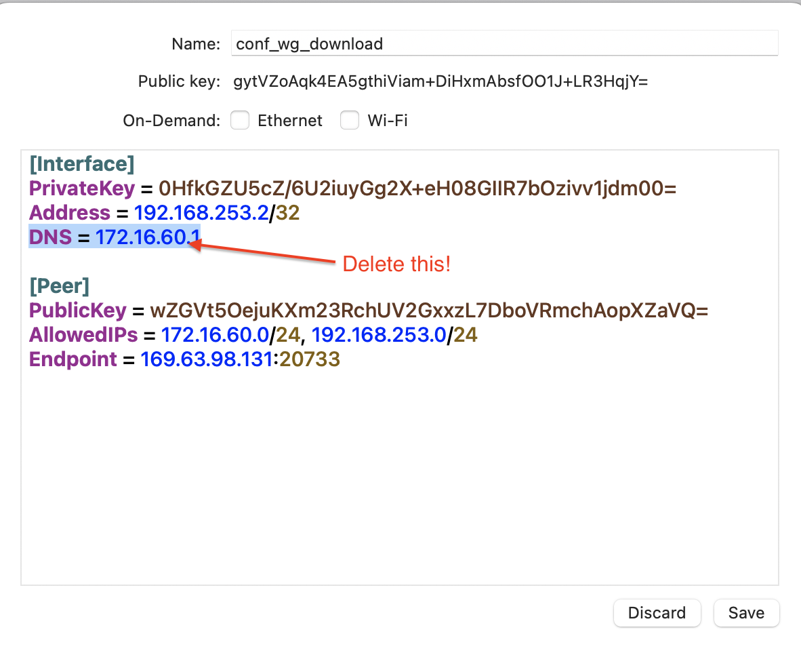

7. **Guardar** la configuración actualizada

    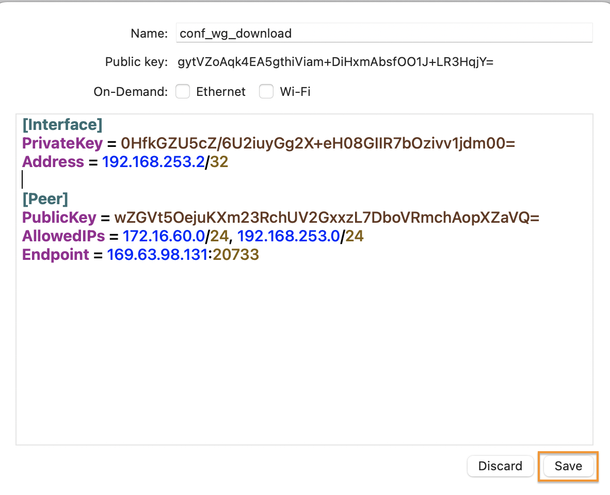

8. Haga clic en el botón **Activar** para habilitar el túnel VPN y el estado cambiará a **Activo**.

9. Acceda a la consola de QRadar. En una pestaña del navegador, abra [https://172.16.60.10,](https://172.16.60.10) acepte las advertencias de certificado que se presenten e inicie sesión con el usuario `admin` y la contraseña `Q1d3m0.Demo`, a continuación, haga clic en **Iniciar sesión**.

    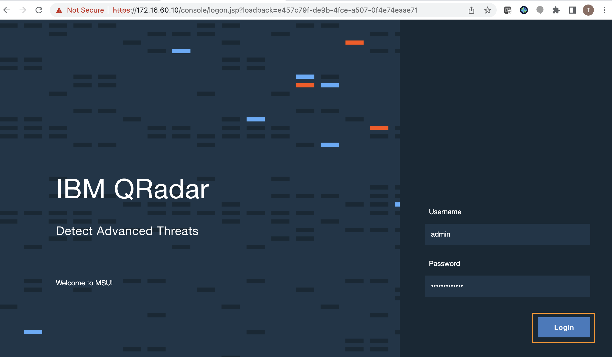

Si el inicio de sesión es exitoso, usted tiene acceso directo desde su estación de trabajo a la instancia en vivo de QRadar. Siga adelante para [verificar el entorno](#verify-and-configure-the-live-demo-setup).

### Utilizar el servidor de salto para acceder al laboratorio

1. Una vez aprovisionada la demo, desde la página Mis reservas, haga clic en su demo reservada.

    

2. Desplácese hasta la parte inferior de la página de reserva y haga clic en el botón azul de la Consola Remota VM al sistema CentOS.

    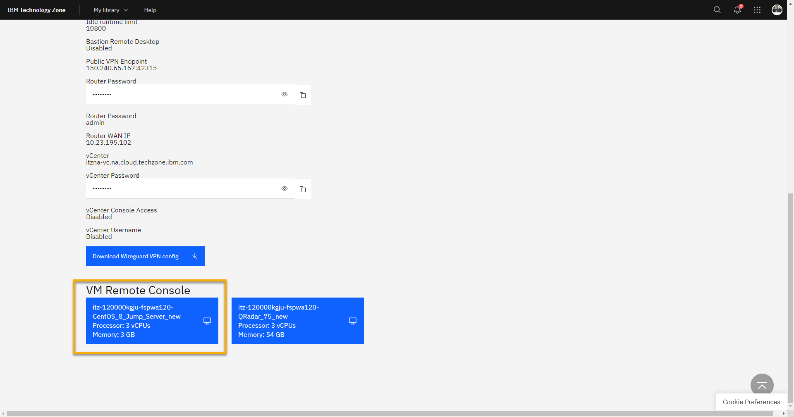

3. En la nueva ventana emergente, haga clic en **Abrir en una ventana nueva**.

    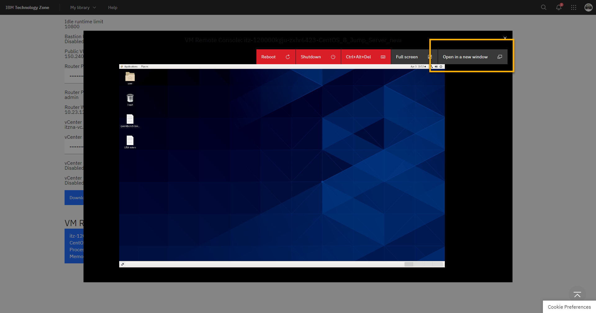

4. Para disfrutar de la mejor experiencia, en la nueva ventana, haz clic en **Pantalla completa**.

    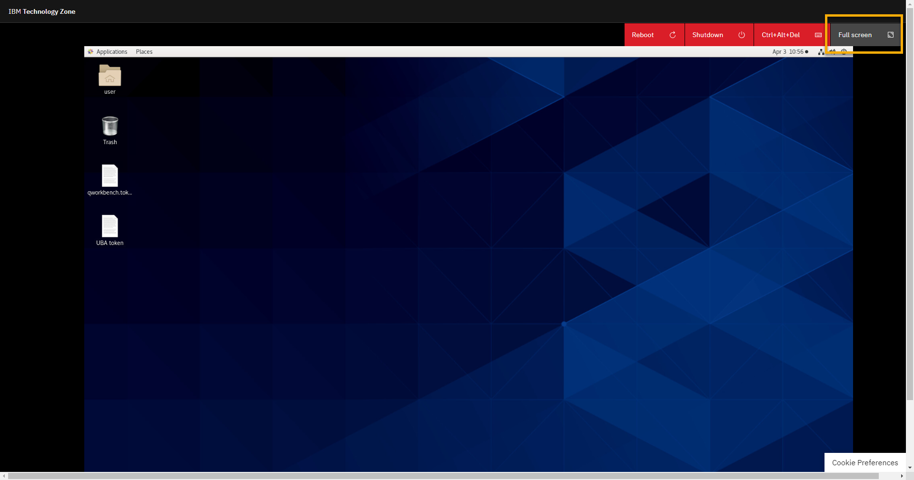

    Ahora tiene acceso a la demostración. Verifique el sistema e inyecte algunos datos de demostración antes de continuar con los pasos de la demostración.

5. Desde el escritorio de CentOS, abra **Aplicaciones > Favoritos > Firefox**.

    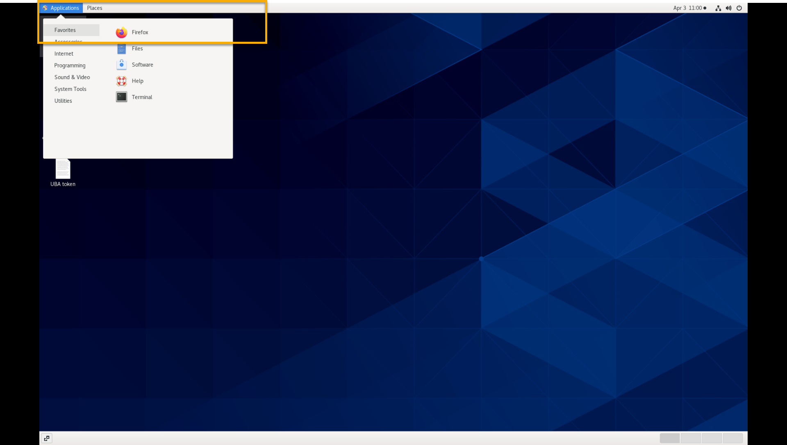

6. En la página de inicio de sesión, si es necesario, proporcione la contraseña de administrador (Q1d3m0.Demo) y haga clic en **Iniciar sesión**.

    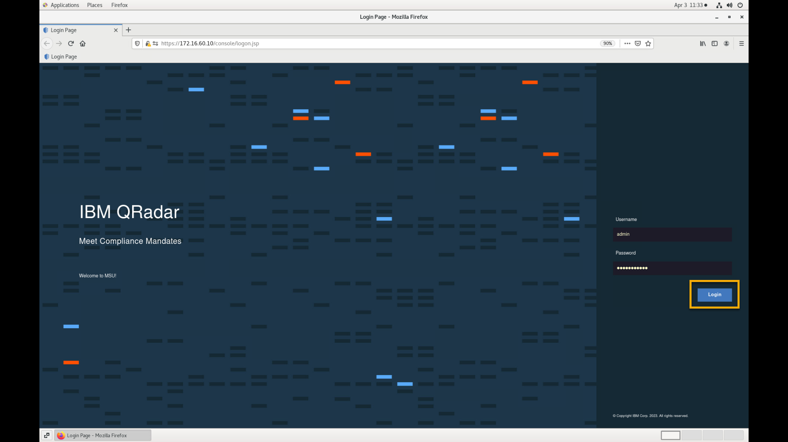

## Verificación y configuración de la demo en vivo

Tanto si utiliza una conexión directa a través de WireGuard como una conexión a través del servidor de salto, ha llegado el momento de verificar el sistema. Para verificar que su sistema funciona, realice los siguientes pasos.

### Acceda a la consola de QRadar desde el sistema CentOS

En la consola de QRadar, vaya a **Delitos > Todos los delitos**.

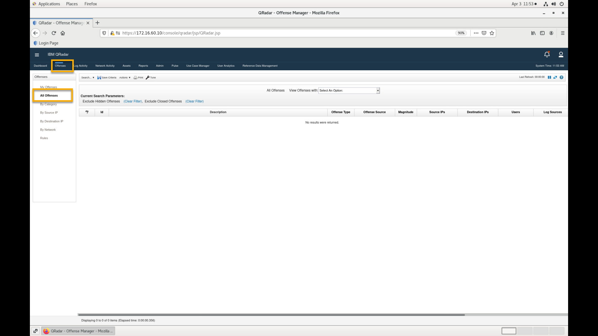

1. Confirme que no tiene ningún delito abierto.

    > Si tiene delitos abiertos, borre los delitos antes de ejecutar la demostración con estos pasos, de lo contrario continúe en la siguiente sección.

    - Seleccione todas las infracciones y, a continuación, expanda **Acciones** y seleccione **Cerrar**.
    - 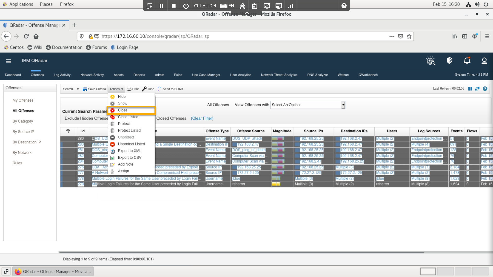
    - En la ventana Cerrar infracción, para los _motivos de_ cierre seleccione Falso positivo y en la sección de notas escriba prueba.

### Generar los sucesos aleatorios

Antes de empezar con la demo, debe generar los datos de los eventos y las infracciones.

1. _Si utiliza el escritorio remoto en el Servidor Jump_, abra un terminal seleccionando **Aplicaciones > Favoritos > Terminal**.

    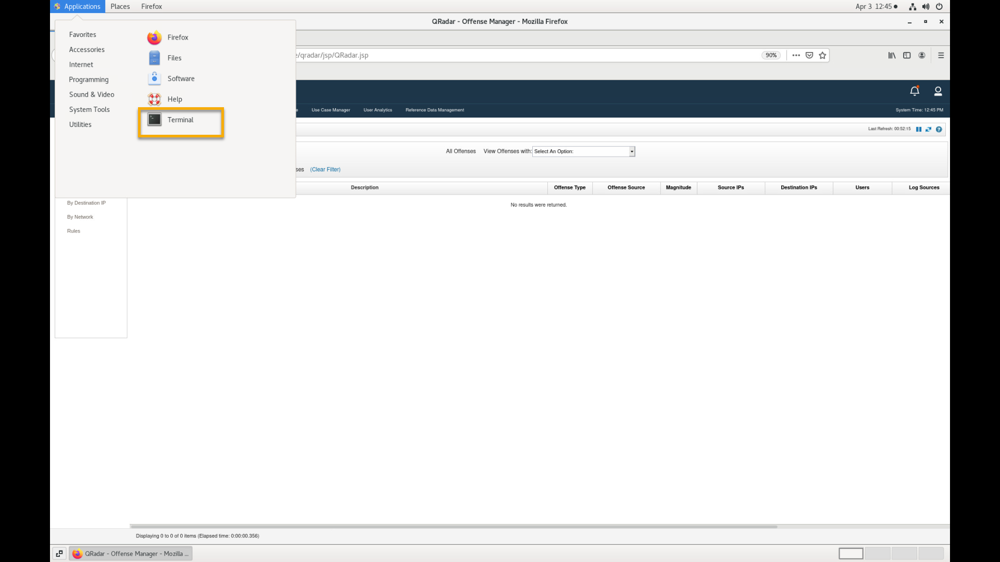

2. Utilice este comando en un terminal local (vpn) o remoto (escritorio del servidor de salto) para `ssh` al servidor QRadar.

    ```bash
    ssh root@172.16.60.10
    ```

3. Escriba la contraseña de root: `Q1d3m0`

4. Para ejecutar el generador de eventos aleatorios, escriba los siguientes comandos

    ```bash
    cd /labfiles
    ./noiseOn.sh
    ```

5. Deje que el generador funcione durante **15 minutos**, para que los eventos resulten en infracciones aleatorias. Continúa con el resto de pasos del laboratorio mientras esperas.

### Verificar la nueva interfaz de usuario

1. Vuelve al navegador.

2. En la consola de QRadar, vaya a la pestaña **Actividad de registro**.

3. Confirme que ve nuevos eventos en tiempo real en la vista Actividad de registro.

    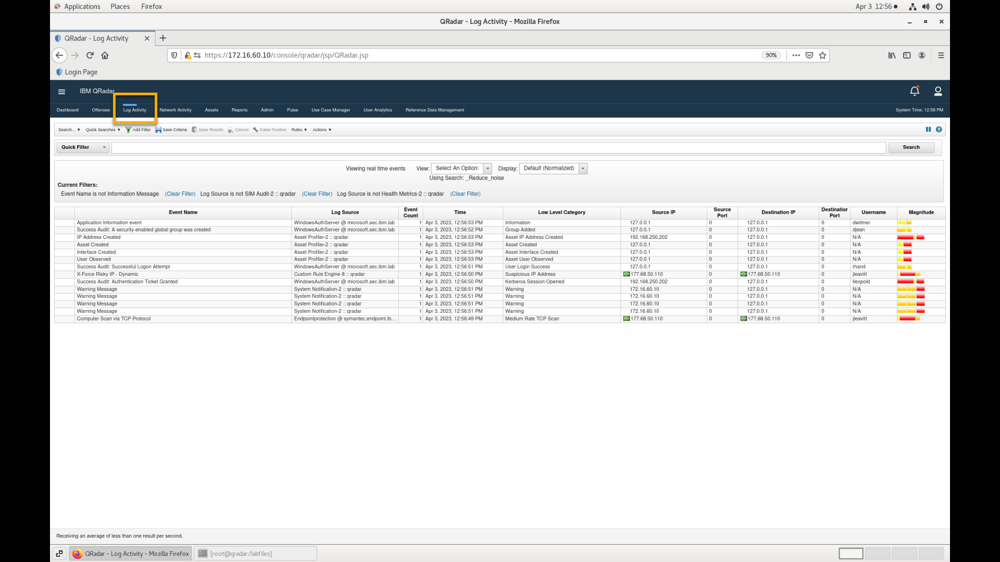

4. En el menú principal, haga clic en **Probar la nueva interfaz de usuario**.

5. En la Nueva interfaz de usuario, confirme que ve las demás aplicaciones importantes para la demostración.

    - Pulso
    - Gestor de casos de uso
    - Gestión de datos de referencia
    - Análisis de usuarios
    - Asistente

    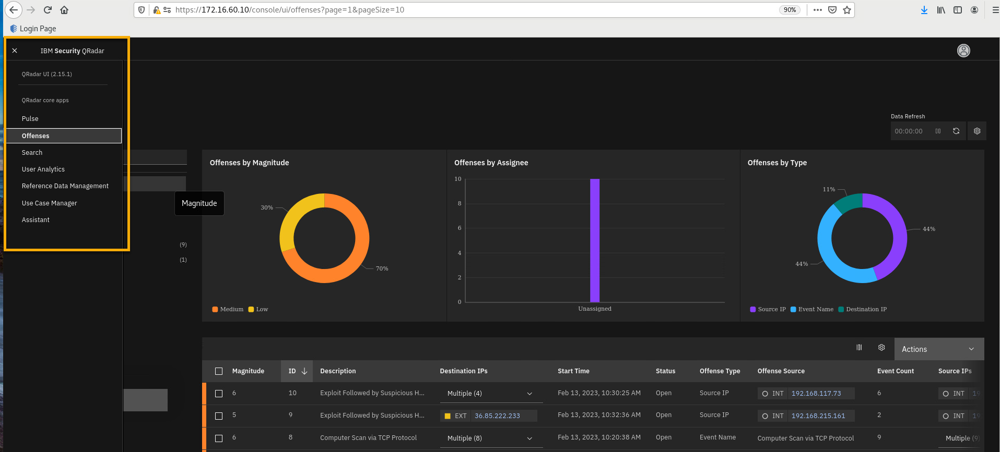

## \[Opcional] -- Solucionar los problemas de las aplicaciones si no aparecen en la nueva interfaz de usuario

TODO - eliminar si estamos recibiendo envs consistentemente OK de TechZone

1. Vuelva a la ventana del terminal o, desde el servidor Jump Server, vaya a **Aplicaciones > Favoritos > Terminal**.

    

2. Si es necesario, vuelva a conectarse a la consola SSH de QRadar.

    ```bash
    ssh root@172.16.60.10
    ```

3. En la línea de comandos, escriba la contraseña de root: `Q1d3m0`

4. Para verificar el estado de todas las aplicaciones, escriba el siguiente comando

    ```
    /opt/qradar/support/qappmanager
    ```

    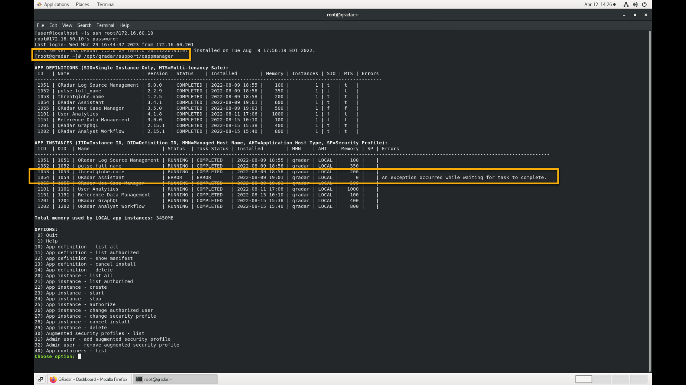

5. Inspecciona el estado de todas las apps. Si alguna app no está en estado RUNNING, teclea la opción 23.

6. A continuación, escriba el ID correspondiente al nombre del administrador. Lo más probable es que sea 2.

7. Escriba el ID de la instancia que no está en estado de ejecución. En este caso es 1054.

    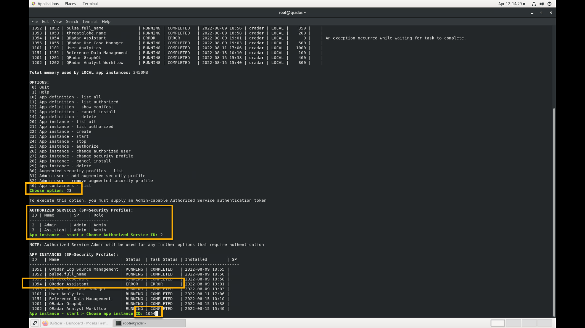

8. Espere **unos minutos** y ejecute la opción 20 para confirmar que la aplicación pasa al estado RUNNING.

    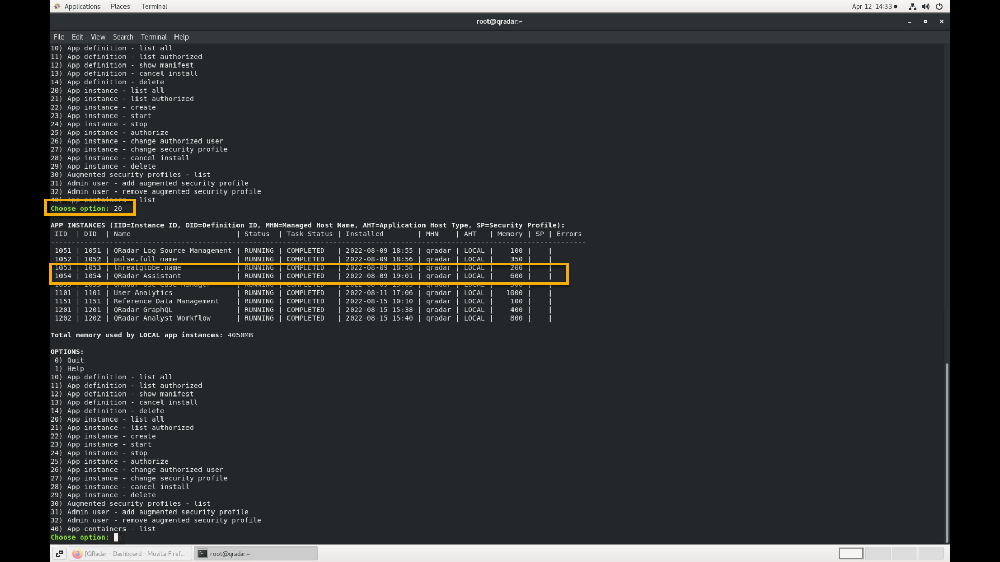

9. Si la aplicación no está en estado de ejecución, espera unos minutos más y vuelve a escribir la opción 20.

    Puedes repetir estos pasos para todas las aplicaciones que no estén en estado RUNNING.

10. Al final, salga del gestor de aplicaciones utilizando la opción 0.

## Inyectar los datos específicos del caso de uso

Para demostrar de forma consistente y fiable la solución SIEM, además de los eventos y delitos aleatorios, también debe inyectar los eventos que son específicos del caso de uso, utilizando el siguiente script de shell en la consola de terminal SSH de QRadar.

Si ya tiene la terminal SSH con QRadar abierta, ejecute los siguientes comandos. (Si ha cerrado la sesión de terminal SSH de QRadar, utilice los pasos de la sección [Generar los eventos aleatorios](#generate-the-random-events) para volver a conectarse a QRadar):

```bash
cd /labfiles
./runUC.sh
```

Espere a que se complete la secuencia de comandos (unos **5 minutos**).

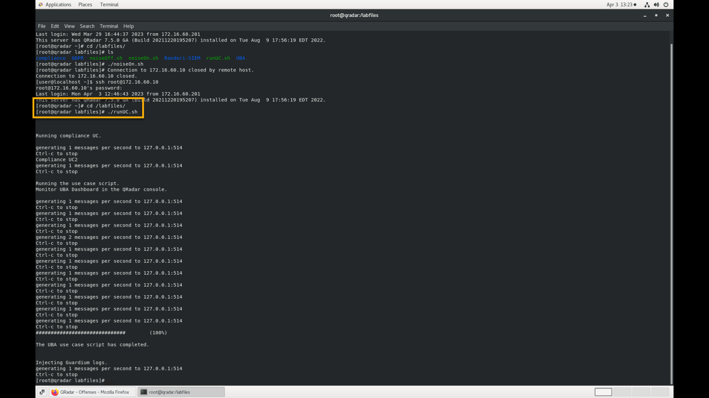

En este momento, la configuración del entorno de demostración está lista. Ahora puede iniciar la demostración y seguir las instrucciones del [guión de demostración](/qradar-siem/102).
