# Demostración de QRadar con un caso de uso de cumplimiento y análisis del comportamiento del usuario

## Introducción

Este laboratorio le ayudará a aprender características importantes de QRadar SIEM y cómo entregar de manera consistente y confiable una demostración a un cliente utilizando el caso de uso de cumplimiento y la aplicación UBA. El esquema del laboratorio y la demostración es el siguiente:

* Comience con IBM Security® QRadar® New UI (también conocida como Analyst Workflow app) y Pulse Dashboard.

* Realice un breve repaso de los cuadros de mandos utilizando el cuadro de mandos general de cumplimiento y el cuadro de mandos de GDPR.

* Continúe con el panel de infracciones y ofrezca un análisis en profundidad de las infracciones utilizando un ejemplo del GDPR. Abarque los principales atributos de las infracciones, como el índice, la magnitud, las categorías de eventos, las perspectivas (reglas, bloques de construcción y conjuntos de referencia) y los eventos.

* Cambie a la aplicación Use Case Manager (UCM). Muestre el valor de la aplicación para analizar reglas y visualizar relaciones y dependencias con bloques de construcción y conjuntos de referencia. Termine con una breve descripción de la aplicación de gestión de datos de referencia.

* Mediante UCM, comprenda las relaciones entre el marco ATT\&CK de MITRE y las reglas de QRadar. Conozca y explique los paquetes de contenido, IBM Security App Exchange y QRadar Assistant App.

* Explicar el valor de la aplicación User Behavior Analytics (UBA) y proporcionar una visión general de la consola UBA.

### Cómo utilizar este documento de laboratorio

Este laboratorio está estructurado tanto para introducirle a QRadar SIEM como para ser un punto de partida para que pueda crear demostraciones a clientes. El texto que aparece así incluirá acciones a realizar e información importante a entender cuando repase el laboratorio. Será útil leer todo este texto.

> También habrá cuadros azules de "notas" como éste que contienen puntos de discusión adicionales de la narración que usted utilizaría en la conversación con el cliente mientras realiza una demostración basada en este contenido de laboratorio. Para el laboratorio, puede hojear rápidamente estas notas para obtener contexto adicional.

Debe haber completado todos los pasos del [laboratorio de configuración](./qradar-siem/101). Esto incluye la ejecución de los scripts `noiseOn.sh` y `runUC.sh` para preparar la instancia de QRadar SIEM con los datos utilizados en los ejemplos.

## Caso práctico de demostración

> La regulación se ha vuelto crucial para la ciberseguridad a raíz de numerosas violaciones de datos de gran repercusión. Muchas normativas sectoriales y geográficas ejercen una presión significativa sobre las organizaciones para que cumplan los requisitos de protección de los datos de los clientes. Cada conjunto de normativas (HIPAA, PCI, GDPR, SOX, etc.) contiene diferentes definiciones y requisitos, todos los cuales afectan a la forma de trabajar de una organización. IBM Security QRadar proporciona configuraciones enriquecidas que pueden automatizar la recopilación, correlación y generación de informes de datos de cumplimiento normativo.
>
> El objetivo de este caso de uso es demostrar cómo la cartera SIEM de QRadar permite a los analistas de seguridad identificar, detectar y responder al comportamiento sospechoso de la red en relación con los activos protegidos por el cumplimiento.
>
> La protección de datos críticos y regulados es el núcleo de nuestra cartera de seguridad. Se trata de una tarea polifacética que requiere un enfoque multicapa.
>
> El propio QRadar ha obtenido certificaciones de cumplimiento vitales que validan la seguridad del producto para que pueda confiar en sus soluciones, incluyendo [DHS CDM Approved Product List](<https://www.cisa.gov/resources-tools/programs/continuous-diagnostics-and-mitigation-cdm-program/program-approved-products-list-apl>), FIPS 140-2 Nivel 1 y Nivel 2: Cert [#2737](<https://csrc.nist.gov/projects/cryptographic-module-validation-program/certificate/2737>) y [#2554](https://csrc.nist.gov/projects/cryptographic-module-validation-program/certificate/2554), y habilitando [NIST 800-53 Security Controls](https://www.ibm.com/downloads/cas/ODQ9P07O).
>
> QRadar está equipado con los análisis necesarios para alertar sobre una multitud de casos de uso que permiten a las organizaciones seguir cumpliendo con un mundo cada vez más amplio de normativas y requisitos actuales y futuros:
>
> Estos son sólo algunos de los muchos casos de uso que también pueden configurarse para ampliar la cantidad de cobertura de cumplimiento:
>
> - Actividad sospechosa realizada sobre datos confidenciales
> - Datos sensibles borrados o modificados
> - Correos electrónicos que contienen archivos sensibles enviados a un host potencialmente hostil o externo
> - Archivos confidenciales compartidos con un usuario o grupo invitado
> - Archivos sensibles subidos a una carpeta de acceso público o permitir permisos
> - Archivos borrados o modificados de directorios de archivos sensibles
> - GDPR: datos personales procesados para usuarios objetados o transferidos a terceros países o regiones Esta demo analiza algunos casos de uso e infracciones de cumplimiento.

## Resumen de la conformidad en el cuadro de mandos Pulse

1. Utilice un navegador web para acceder a la consola de QRadar.

2. En la consola de QRadar, seleccione **Menú > Probar la nueva interfaz de usuario**.

        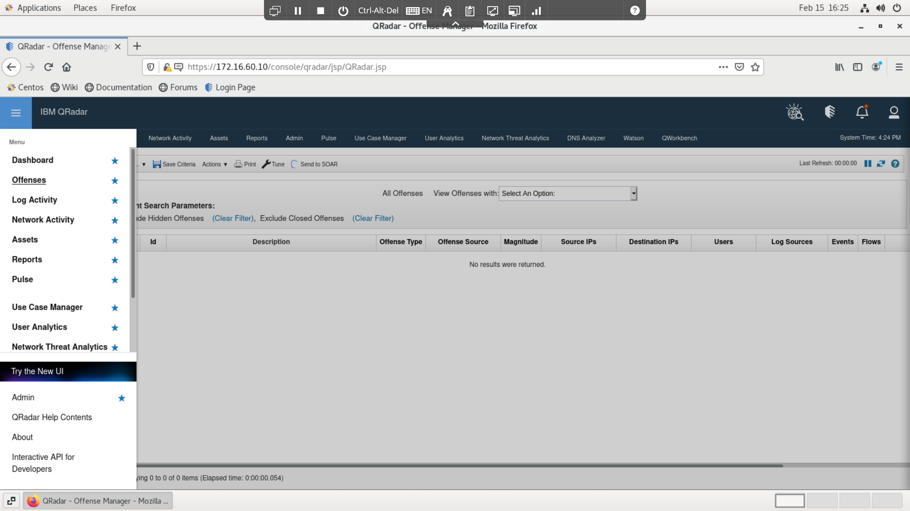

        Esto abre la nueva interfaz oscura de QRadar, que puede cargar múltiples cuadros de mando. Los cuadros de mando son configurables y pueden personalizarse y desarrollarse por separado. Los cuadros de mando se cargan en la aplicación **PULSE**.

3. Desde el menú principal, abra la aplicación **PULSE**.

    La aplicación **PULSE** es una de las muchas aplicaciones desacopladas del producto central QRadar SIEM, lo que hace que la solución global sea más modular. La aplicación puede descargarse e instalarse desde IBM Security App Exchange, pero viene preinstalada con la última versión de QRadar SIEM.

4. Haga clic en el menú **Panel de control**.

    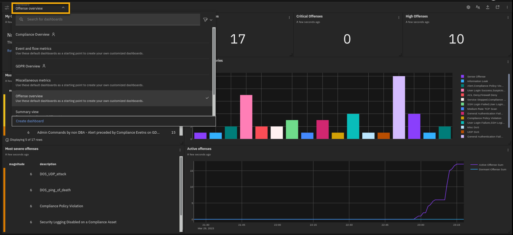

    > Existen múltiples cuadros de mando que se pueden añadir o eliminar y personalizar. Los paneles dinámicos en tiempo real ayudan a los analistas de un SOC (Centro de Operaciones de Seguridad) y a otros equipos de QRadar a presentar diferente información crítica de seguridad en la página de inicio. También puede organizar los cuadros de mando según diferentes necesidades y requisitos. Por ejemplo, hay un cuadro de mandos centrado en las perspectivas de cumplimiento de la postura de seguridad de su organización.

5. Seleccione el cuadro de mandos **Descripción general del cumplimiento**.

    **Sugerencia**: Debido a los eventos generados aleatoriamente, los datos del sistema en vivo pueden ser ligeramente diferentes de las capturas de pantalla de la guía de demostración.

    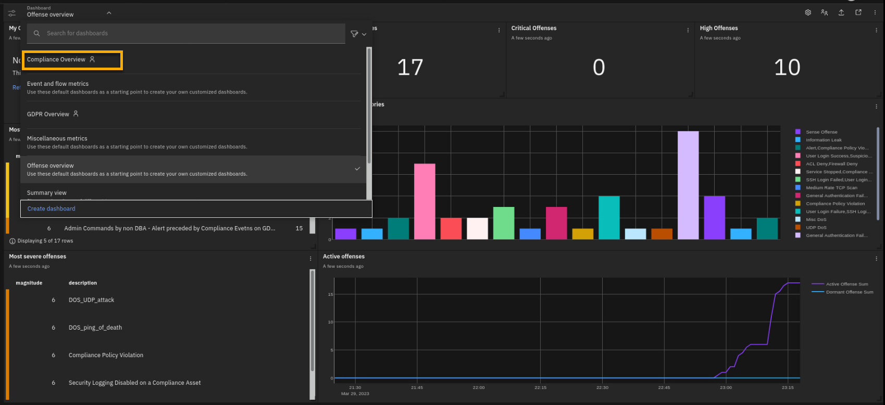

    Este panel centrado en el cumplimiento captura todos los casos de uso, también conocidos como reglas de QRadar, que se han activado en función de los eventos, el tráfico de red, las vulnerabilidades y la actividad de los usuarios en su red y activos relacionados con diferentes normativas de cumplimiento. El panel se suministra mediante el paquete de contenido del sitio IBM Security App Exchange.

    > App Exchange es un portal en el que IBM y toda la comunidad de IBM Security pueden desarrollar funciones complementarias para QRadar SIEM core y otros productos de IBM Security. También puede crear sus propios paneles y portlets.

    El cuadro de mandos de Cumplimiento tiene múltiples portlets o widgets. Muchos de estos gráficos son interactivos, y puede personalizar cada uno de estos widgets utilizando búsquedas de sentencias QRadar Ariel Query Language[(AQL](https://www.ibm.com/docs/SS42VS_7.4/com.ibm.qradar.doc/b_qradar_aql.pdf?view=kc)).

6. Céntrate en la esquina superior derecha del salpicadero.

    Revise los _eventos de autenticación en el_ gráfico de barras _del servidor GDPR_ en la parte superior derecha.

7. Demuestre que los gráficos tienen algo de interactividad haciendo clic en las etiquetas **Inicio de sesión de usuario** e **Inicio de sesión fallido** para ocultar esos eventos y centrar la atención en el resto de los eventos generados.

    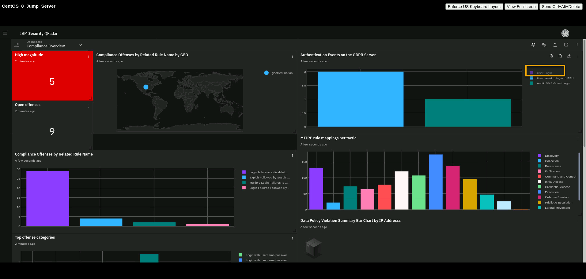

    Observe cómo el gráfico es interactivo. Al ocultar los datos atípicos, puedes centrar más fácilmente tu investigación en los datos importantes, como los distintos tipos de fallos de inicio de sesión en este caso.

    > Opcionalmente, puede dedicar algún tiempo a revisar cada visualización, ya que proporciona una gran visión a un administrador o ejecutivo sobre todos sus servidores relevantes para el cumplimiento y los fallos de inicio de sesión observados en cada uno por nombre de usuario. Puede extraer los resultados de cualquier consulta en un gráfico o una tabla de visualización; estos son sólo algunos ejemplos.
    >
    > También tenga en cuenta que QRadar puede mostrar cuadros de mando y reposts basados en el MITRE ATT\&CK Framework. Más adelante hablaremos de ello con más detalle.

    Otra función del panel de información _general_ de cumplimiento que debe investigarse son _las amenazas de X-Force Exchange que se encuentran en_ el panel de _servidores de cumplimiento_.

8. Desplázate hasta la parte inferior del panel de control para encontrar este widget.

    > El feed de IBM Security X-Force Threat Intelligence se incluye con la licencia estándar como parte del contrato de servicio y soporte, pero debe habilitarlo.

    > Al habilitar las fuentes de X-Force Threat Intelligence en QRadar, puede recibir información de X-Force Threat Intelligence. Mientras QRadar escanea sus registros y flujos entrantes, esta información de Threat Intelligence se utiliza para crear delitos si se encuentra un Indicador de Compromiso[(IOC](https://en.wikipedia.org/wiki/Indicator_of_compromise)) válido dentro de su entorno.

    La consulta AQL para el widget _Amenazas de X-Force Exchange encontradas en servidores de_ cumplimiento es una búsqueda centrada en si algún evento con un IOC de los feeds de amenazas de X-Force se encuentra dentro de los activos de cumplimiento.

    En este caso, el widget tiene un gráfico vacío. Esto es bueno, e indica que QRadar no ve ningún IOC en este entorno.

9. Para revisar la consulta AQL que alimenta el gráfico de visualización, seleccione el lápiz (icono de edición) del widget **HIPAA Assets Failed Logins by Username**.

    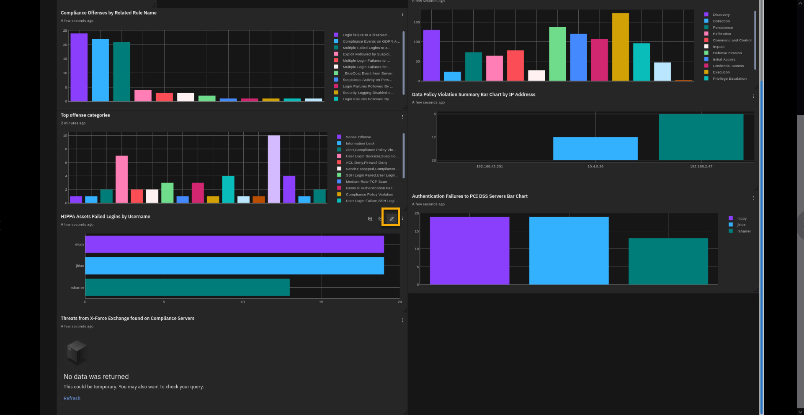

    Veamos los detalles del widget de la HIPAA que informa sobre el inicio de sesión fallido de tres usuarios.

10. En la pantalla Editar elemento del cuadro de mando, revise el NCA.

        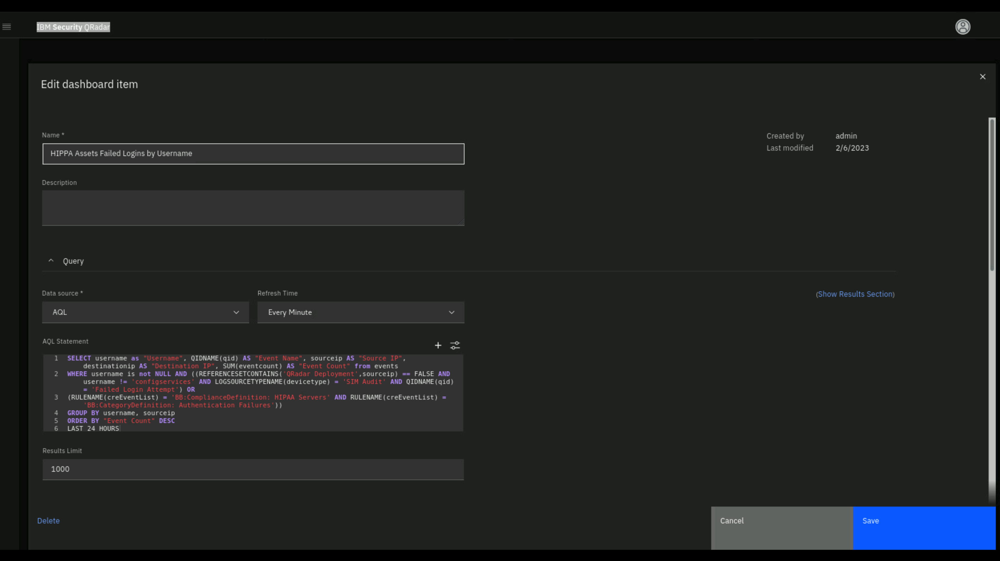

        > Para construir gráficos es necesario conocer el Lenguaje de Consulta Ariel (AQL).
        >
        > Las consultas AQL pueden parecer muy complejas, pero, en general, son sentencias similares a SQL que puede crear utilizando el asistente QRadar Query Builder. El mismo lenguaje AQL puede buscar eventos QRadar y tráfico de red. Si modifica la sentencia AQL, puede ejecutar la consulta para obtener una vista previa actualizada.

11. Haga clic en **Ejecutar consulta**.

    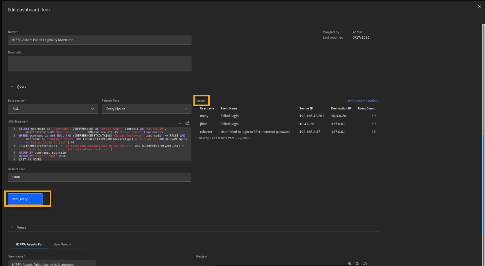

12. Desplázate hacia abajo y céntrate en la sección Vistas.

    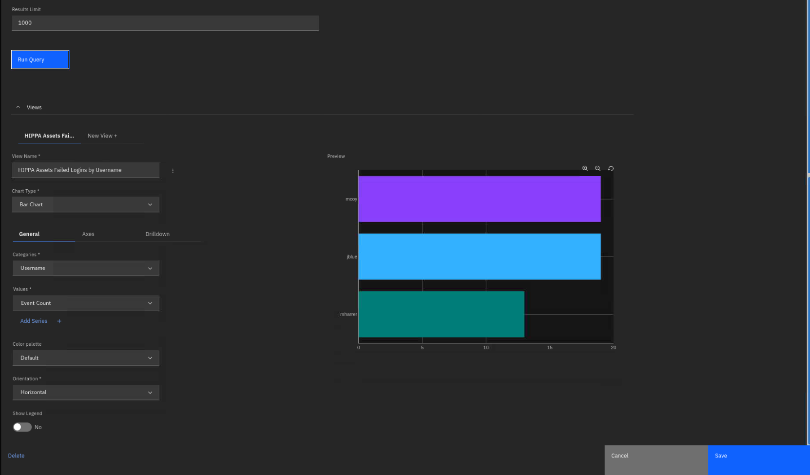

13. Como experimento, realice estos cambios en la vista de gráfico:

    - Tipo de gráfico: **Gráfico circular**
    - Etiqueta: **Nombre de usuario**
    - Valor: **Recuento de eventos**

    También puede presentar los datos gráficamente en otros tipos de gráficos. Algunos ejemplos son el gráfico de barras, el gráfico de series temporales, el gráfico circular, etc.

    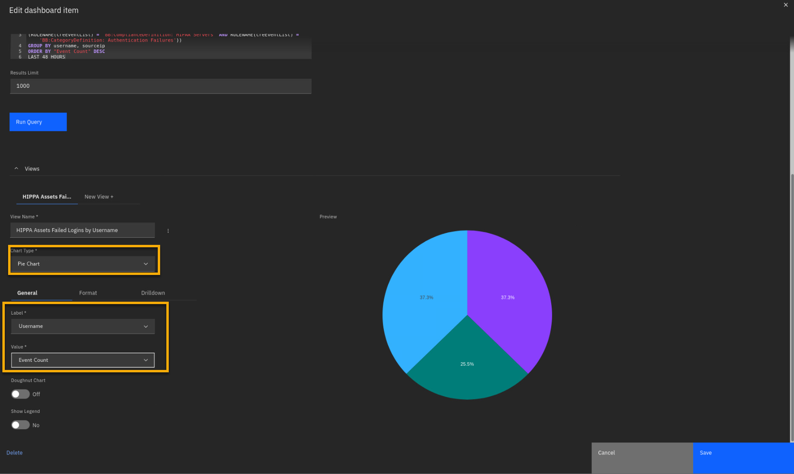

    Nota: no es necesario guardar estos cambios.

14. Para cerrar la página Editar elemento del cuadro de mandos, haga clic en **Cancelar**.

    > Puede tener una visión general de todos sus datos y mandatos relacionados con el cumplimiento dentro de un Dashboard consolidado, como acabamos de ver aquí con el dashboard **Compliance Overview**, o puede utilizar una vista centrada en solo una de las normativas que su organización debe cumplir, como el GDPR, en preparación para una próxima auditoría.

15. Seleccione el menú **Cuadro de mandos** **> Cuadro de mandos general de GDPR**.

    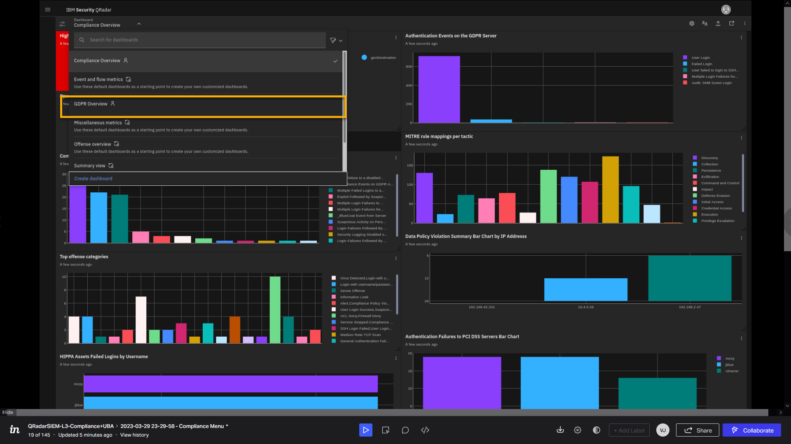

16. Dedique tiempo a revisar las visualizaciones centradas únicamente en los activos críticos relevantes para el GDPR.

    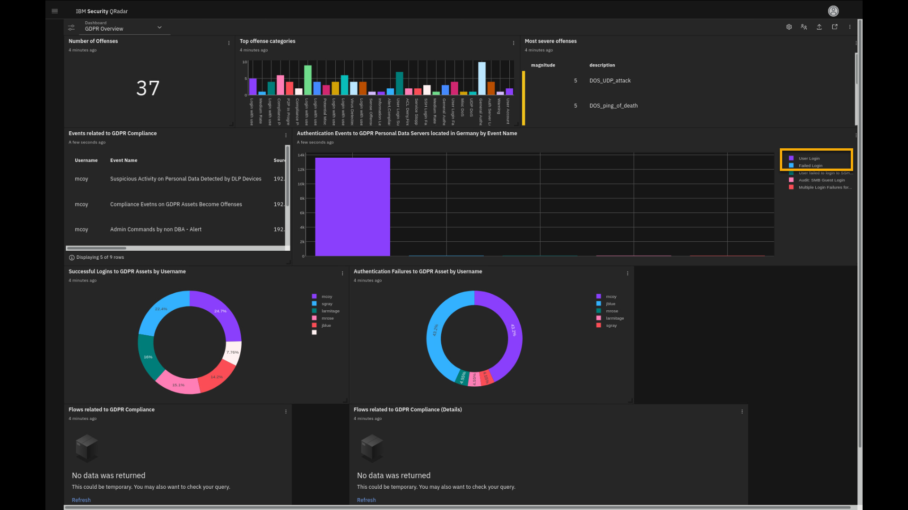

    > En el cuadro de mandos centrado en el GDPR, vemos los eventos de autenticación en los activos del GDPR ubicados en Alemania. Los eventos de inicio de sesión con éxito son numerosos, pero también hay varios inicios de sesión fallidos, lo que podría ser un indicador de que un actor malicioso está intentando acceder a servidores y datos críticos.

17. En el gráfico _Eventos de autenticación a servidores de datos personales GDPR ubicados en Alemania por nombre de evento_, anule la selección de los eventos **Inicio de sesión de usuario** e **Inicio de sesión fallido**. Pase el ratón por encima de cada una de las barras del gráfico. Verá una razón más detallada de los eventos de inicio de sesión fallido junto con el número acumulado de intentos fallidos.

    

    Observa que hay algunos otros tipos de eventos de autenticación registrados en esos servidores.

    Los otros dos gráficos muestran los inicios de sesión exitosos y fallidos en los activos GDPR distribuidos por usuario. La consulta AQL puede crearse para obtener el informe sobre los activos específicos, como los de Alemania, o ser más genérica para cualquier activo con información de identificación personal (PII).

    > En esta primera parte de la demostración, mostramos cómo utilizar el poder de la vasta información de QRadar SIEM visualizando los datos en una variedad de tableros usando QRadar AQL. Ahora, centrémonos en la investigación de incidentes detectados por el motor de reglas personalizadas de QRadar.

## Análisis del ataque

1. Haga clic en **Menú principal > Infracciones**.

    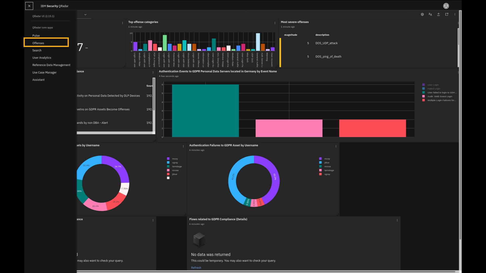

    > QRadar puede recibir millones de eventos combinados con información de tráfico de red durante un día. Entonces, ¿cómo puede un analista de seguridad lidiar con tal cantidad masiva de datos, procesarlos y encontrar amenazas potenciales de manera efectiva? Aunque un analista senior debería llevar a cabo una caza proactiva de amenazas buscando en los datos SIEM al realizar su trabajo diario de analista de seguridad, QRadar viene con un motor de reglas personalizadas que puede detectar automáticamente amenazas potenciales en su entorno. Por defecto, el motor de reglas personalizadas viene con cientos de reglas diferentes, también conocidas como casos de uso o insights, que buscan ciertas actividades de amenazas. Puede ampliar el número de reglas instalando paquetes de contenido de IBM Security App Exchange o escribiendo sus propias reglas para un caso de uso específico.
    >
    > Si las reglas encuentran un patrón coincidente en los eventos y el tráfico de red, pueden desencadenar una _infracción_. La _infracción_ es un posible incidente de seguridad que los analistas deben investigar y decidir si es benigno o malicioso para el entorno informático.

    Investiguemos algunos de los delitos desencadenados a partir de los datos de eventos en esta instancia SIEM de QRadar.

    Por defecto, la vista de infracciones muestra algunas estadísticas en la parte superior y enumera las infracciones abiertas (activas) en la tabla. Puede personalizar esta vista de tabla o ajustar la vista de elementos por página.

2. Haz clic en el icono de **personalizar columna**.

    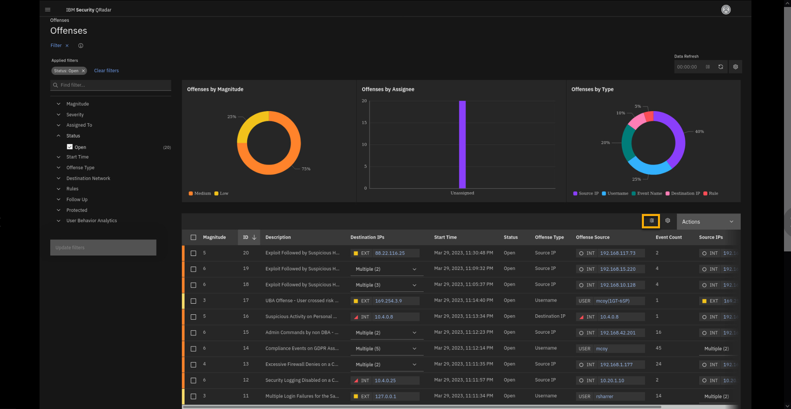

3. En la pantalla de personalización de columnas, tómese un momento para estudiar y resaltar para su discusión los atributos clave

    > En la pantalla de personalización de columnas, puede ver todos los atributos relacionados con la infracción y seleccionar cuál desea ver en la vista de tabla predeterminada. Por ejemplo, puede mostrar qué fuentes de registro contribuyen a las infracciones. Deje la vista como está.

4. Para volver a la página de infracciones, haga clic en **Cancelar**.

    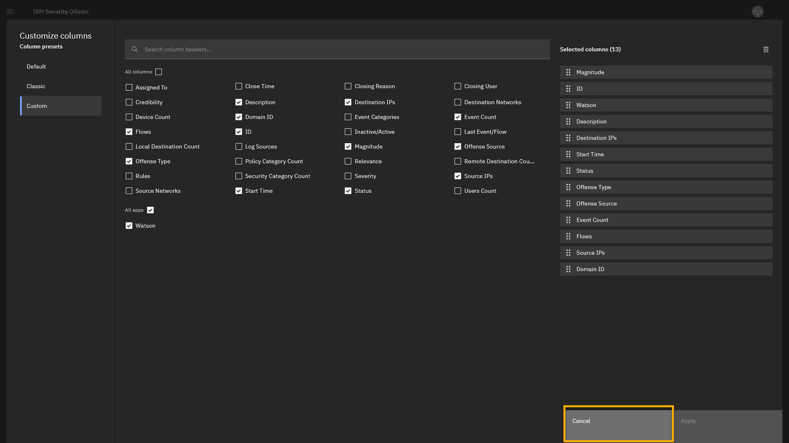

5. De vuelta a la lista de infracciones, amplíe algunos atributos utilizados para el filtrado: Magnitud y Gravedad.

    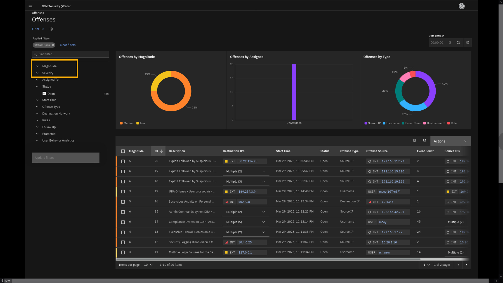

    La tabla de delitos enumera los delitos y algunos atributos, como la magnitud, la descripción, el tipo de delito, las direcciones IP implicadas, etc.

    Observe que el panel izquierdo contiene muchos filtros que pueden ayudar a revisar y analizar las infracciones.

    Por ejemplo, utilizando los filtros Magnitud o Gravedad, puede mostrar sólo las infracciones calificadas como bajas, medias o altas para esas dos categorías de filtros.

    En esta demostración, queremos buscar infracciones específicas relacionadas con el cumplimiento.

6. En la sección de filtros, haga clic en el campo **Buscar** y escriba Cumplimiento.

7. Seleccione las cuatro normas relacionadas con el cumplimiento.

8. Haga clic en **Actualizar** **filtros**.

    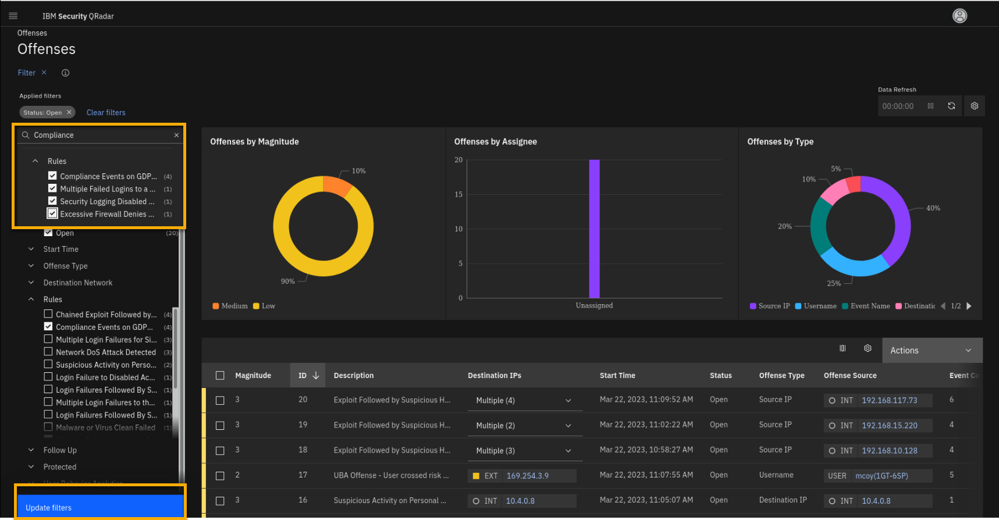

9. Cierre el panel de filtros.

    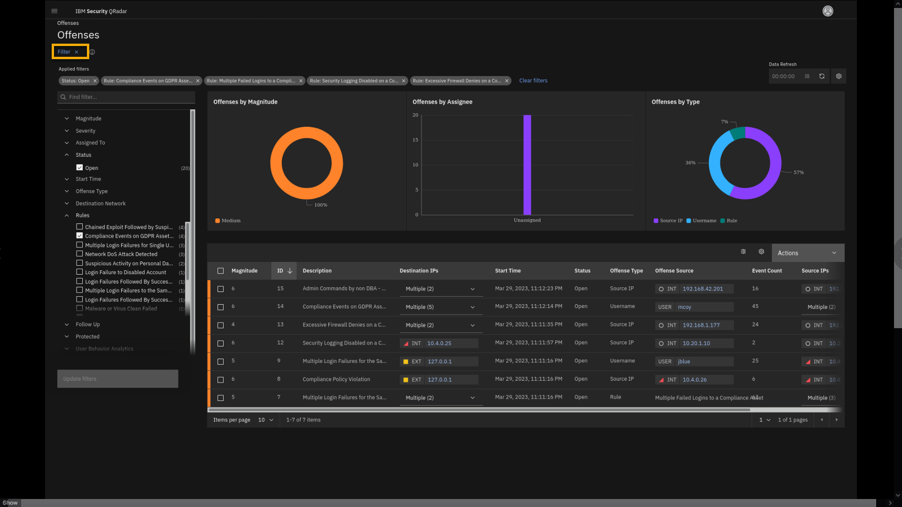

10. Revisar el delito relacionado con el cumplimiento.

    Revisemos ahora algunas de las infracciones, actuando como un analista de seguridad. Tenga en cuenta que la descripción o el nombre de la infracción pueden ser bastante largos y que, si pasa el puntero del ratón por encima, obtendrá el nombre completo.

    

    > Dependiendo del momento y del flujo de la demostración, puede mostrar una o más infracciones de este capítulo. Sin embargo, es importante que repase el delito de GDPR indexado por mcoy user, porque los temas de demostración posteriores se basan en esa historia.
    >
    > Si tiene poco tiempo para completar este laboratorio en el taller, pase sólo por la infracción [relacionada con el GDPR](#offense-compliance-events-on-gdpr-asset-indexed-by-user-mcoy). Esta es la tercera infracción de la lista siguiente

### Infracción - Excesivas denegaciones de cortafuegos en un activo de conformidad

> El motor de correlación de QRadar, líder del mercado, puede detectar un pico inusualmente grande de tráfico de red denegado por listas de control de acceso (ACL) o reglas de cortafuegos. Esta ráfaga de tráfico denegado suele estar causada por: 1) una aplicación o cortafuegos mal configurados o 2) una actividad sospechosa o maliciosa. Esta actividad sospechosa o maliciosa puede estar relacionada con intentos fallidos de conexión a un servidor de mando y control (C2) o con la filtración de datos, lo que provoca una ráfaga de conexiones fallidas. También podría deberse a cantidades inusualmente grandes de tráfico de reconocimiento o enumeración. Los ataques de denegación de servicio o las inundaciones de tráfico también pueden producir este aumento del tráfico.

1. Haga clic en la ofensa **Denegaciones excesivas de cortafuegos en un activo de cumplimiento**.

2. Haga clic en la **elipsis** (...) del título para ampliar el nombre completo del delito.

    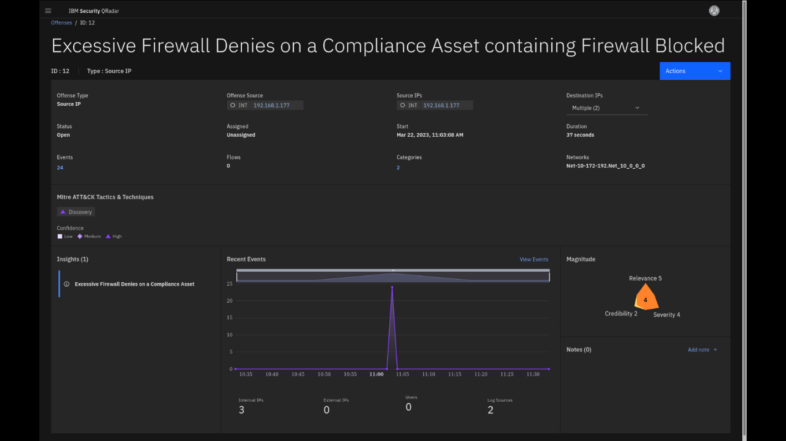

    > Esta es la página de resumen del delito, donde el analista de seguridad comienza a revisar los detalles del delito.
    >
    > Al clasificar sus servidores relevantes para el cumplimiento de normativas con datos obligatorios o protegidos por normativas en ellos, puede asegurarse de que las reglas específicas de QRadar relacionadas con los intentos fallidos de tráfico de red le alerten cuando se detecte actividad maliciosa en esos activos. Esto permite a sus analistas adelantarse proactivamente al camino del atacante.

    Esta ofensa está indexada en la IP de Origen y tiene múltiples IPs de Destino. La magnitud de la infracción es 4, lo que le ayuda a priorizar la revisión de la infracción. La infracción resume 24 eventos, que desencadenan una observación Denegaciones excesivas de cortafuegos en un activo de cumplimiento.

    **Nota**: Ten en cuenta que algunos de estos números pueden ser diferentes en tu demo.

    Echemos un vistazo a los Insights, también conocidos como Condiciones de Prueba, que se cumplieron con éxito a partir de los eventos recopilados.

3. Seleccione **Excessive Firewall Denies on a Compliance Asset**Insights para revelar un panel lateral que muestra las condiciones de prueba de la regla.

    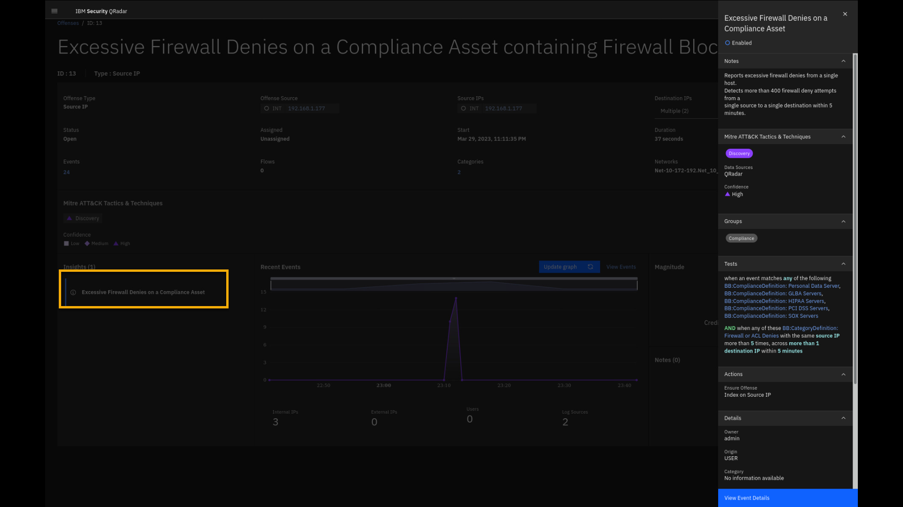

    Revisar los insights ayuda a un Analista de Seguridad a analizar el problema sin revisar todos los eventos individuales. Las Notas de insights ya explican por qué se activó la infracción. La sección Pruebas proporciona detalles sobre cómo se genera esta infracción. Está diseñado para alertarle si se cumplen varias condiciones:

    - La dirección IP debe representar un activo crítico según lo definido por los bloques de construcción enumerados, como datos personales, GLBA, HIPAA, PCI DSS o servidores SOX.
    - Otra parte de la regla, la condición de prueba, dice que el evento debe generar Firewall o ACL deniega y no es un solo evento. QRadar rastrea eventos y tiene contadores que alertarán si esto sucede al menos a 2 destinos más de 5 veces en 5 minutos.

    Tenga en cuenta que hemos reducido los umbrales de estas pruebas de reglas respecto a los valores predeterminados debido a las limitaciones del entorno de demostración.

4. Haga clic en **Ver detalles del evento**.

    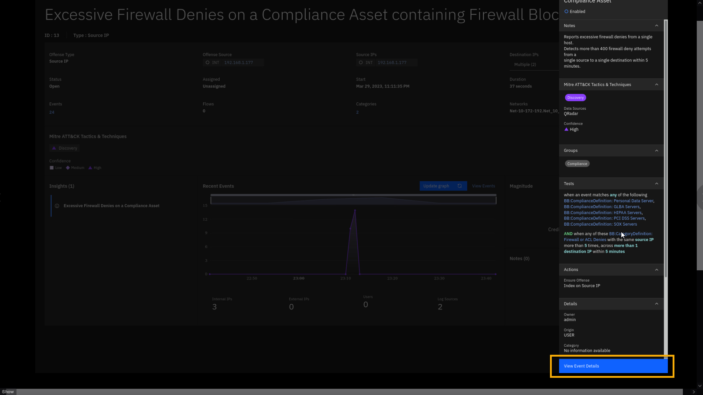

5. Observe y esté preparado para describir la consulta AQL a alto nivel en una demostración.

    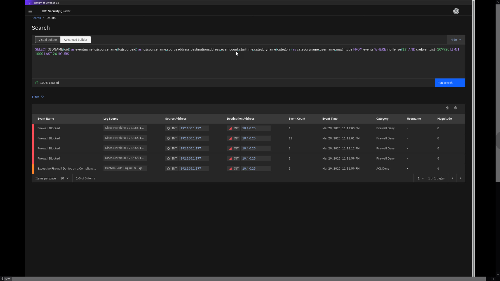

    Al comprender los insights, no es necesario revisar los detalles de todos los eventos individuales implicados en esta actividad sospechosa. Si decide ver los eventos relacionados con estos insights, se abre la pantalla de Búsqueda. Sin necesidad de conocimientos profundos de AQL, la consulta construida automáticamente muestra los eventos asociados con este delito y los insights particulares.

    Observe la columna de recuento de eventos. Algunos eventos se agrupan utilizando la función de **coalescencia**. La agrupación de eventos ayuda a mejorar el rendimiento y a reducir el almacenamiento de eventos de seguridad no críticos en los que no es necesario guardar toda la carga útil del evento.

    Observe también que la IP interna 10.4.0.25 está marcada en rojo.

    > A medida que los datos llegan y se fusionan, una gran ráfaga de eventos puede convertir cientos de miles de eventos en sólo unas pocas docenas de registros. Esta acción se realiza mientras QRadar mantiene el recuento de los eventos reales. La coalescencia proporciona a QRadar la capacidad de detectar, enumerar y rastrear un ataque a gran escala. También protege el rendimiento de la canalización al reducir la carga de trabajo del sistema, incluidos los requisitos de almacenamiento para esos eventos. Cuando se reciben eventos que coinciden con un criterio específico, QRadar puede utilizar el coalescente para determinar qué almacenar de la carga útil del evento basado en la configuración de la fuente de registro en QRadar.

6. Haga clic en cualquiera de las direcciones IP de dirección de **destino** y examine el panel deslizante de direcciones IP.

    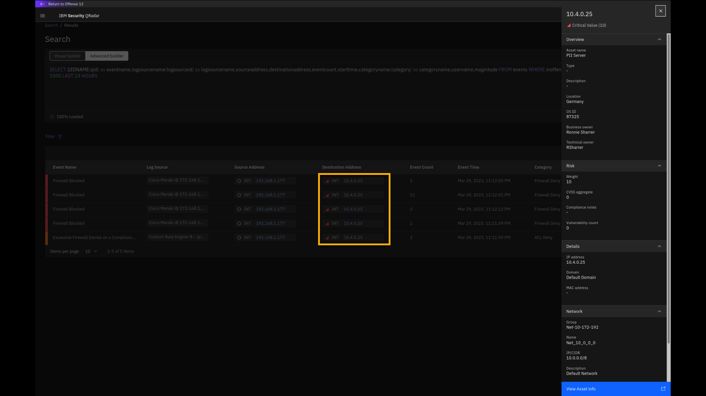

    Tenga en cuenta que esta dirección IP interna está etiquetada como Servidor PII, lo que significa que contiene información personal identificable. Si no se guardan, procesan y protegen adecuadamente los datos PII, pueden surgir problemas con muchas normativas de cumplimiento si los datos se ven comprometidos. También vemos que a este activo se le ha asignado manualmente una ponderación de riesgo de 10 en la base de datos de activos de QRadar, está ubicado en Alemania y el propietario es Ronnie Sharrer. Si necesita más detalles sobre el activo, puede hacer clic en Ver información del activo, que abre una nueva pestaña de Detalles del activo.

7. Haga clic en **Ver información de activos**.

8. Revise la página de detalles del activo y ciérrela.

    **Sugerencia**: Si está ejecutando la demostración virtual, puede hacer clic en cualquier lugar de la página para cerrarla.

    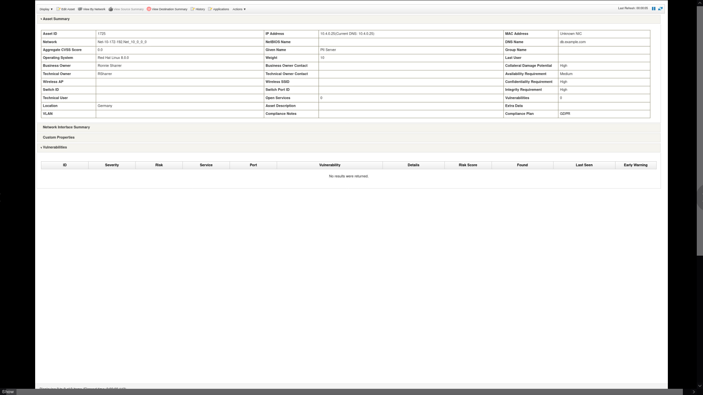

    Por ejemplo, el Nombre DNS indica que se trata de una base de datos, y el Sistema Operativo indica que el servidor ejecuta Red Hat Linux 8.

9. Cierre la pestaña Detalles del activo.

10. En la página de búsqueda de eventos, cierre el panel lateral de información de Activos y, en la esquina superior izquierda, haga clic en **Volver a Delito \<n>**.

    **Nota**: El número de infracciones puede variar.

    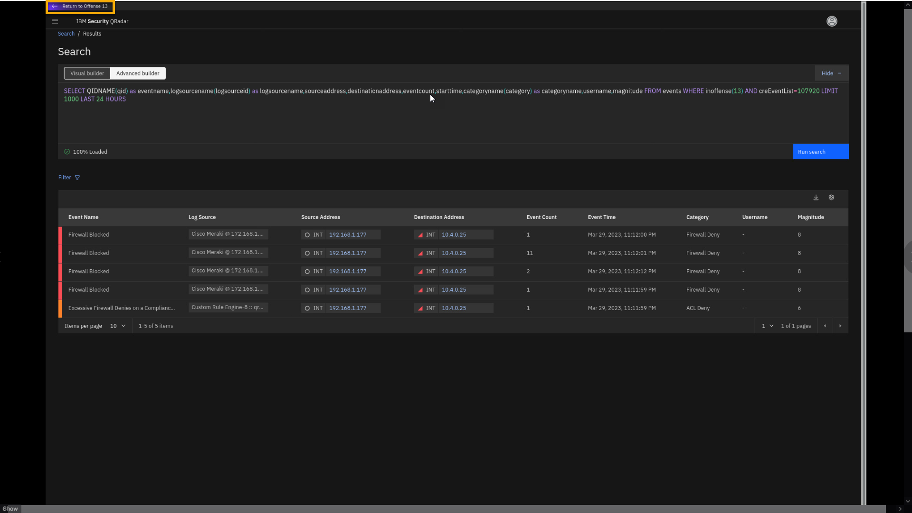

    Esta infracción no era compleja; sólo contenía un insight y 24 eventos. A continuación examinaremos otras infracciones relacionadas con otros aspectos del cumplimiento.

11. Haga clic en **Infracciones** en la barra de navegación para volver a la pantalla principal del panel de infracciones.

    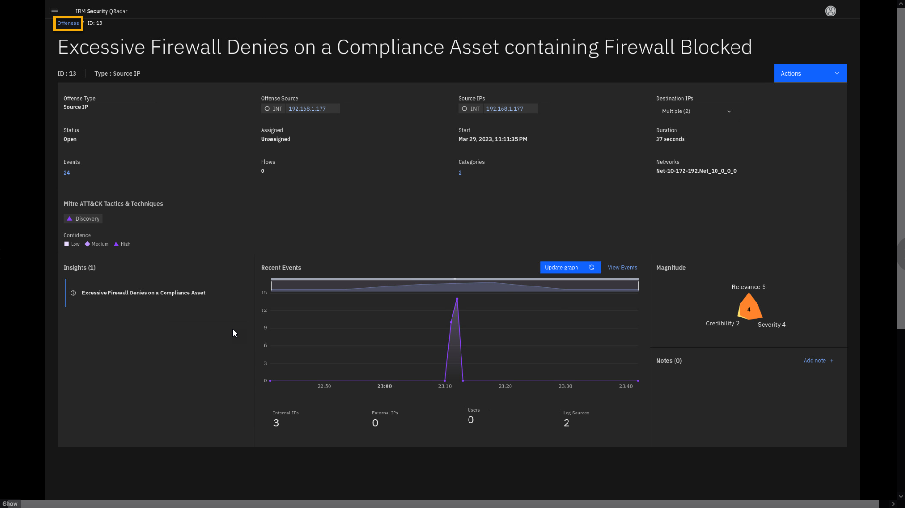

### Delito -- Registro de seguridad deshabilitado en un activo de cumplimiento

**Sugerencia**: Si es necesario, aplique de nuevo el filtro **Cumplimiento** para reducir el número de infracciones en la pantalla.

> Muchas normativas tienen requisitos destinados a proporcionar directrices para una protección mínima relacionada con objetivos estándar. Por ejemplo, la Payment Card Industry Data Security Standard (PCI DSS) es un conjunto de requisitos destinados a garantizar que todas las organizaciones que procesan, almacenan o transmiten información de tarjetas de crédito mantengan un entorno seguro.
>
> QRadar le ayuda a mantener el cumplimiento de estas normas mediante el registro preciso de todos los intentos de acceso, modificación y eliminación de datos PCI. Toda actividad relacionada con datos de titulares de tarjetas y números de cuenta principales (PAN) requiere una entrada de registro de acuerdo con diversas normas de cumplimiento.

1. En la página de infracciones, filtrada por eventos relacionados con el cumplimiento, haga clic en la infracción **Registro de seguridad deshabilitado en una C...** para revisar los detalles.

    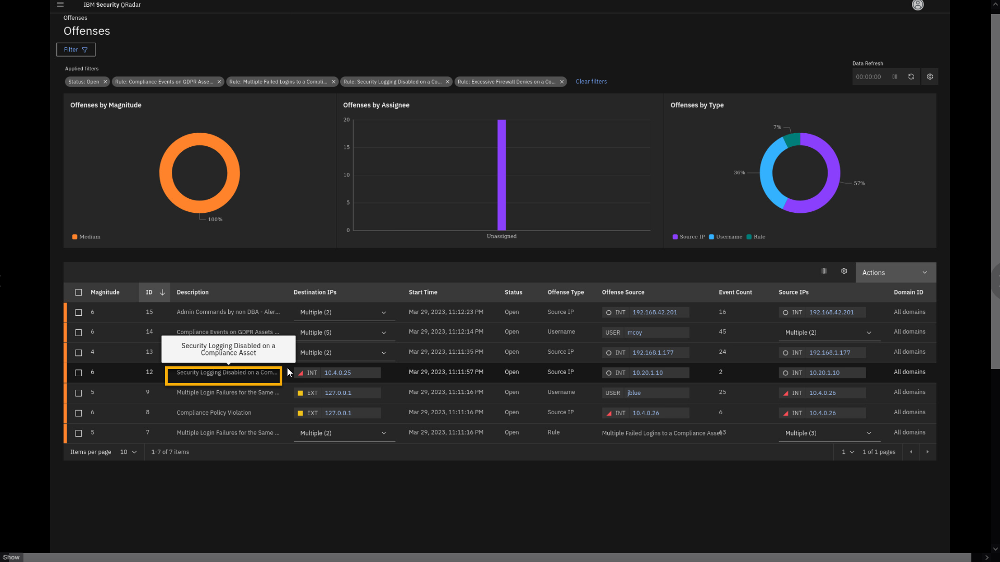

2. Haga clic en la **elipsis** del título para ampliar el nombre completo del delito.

    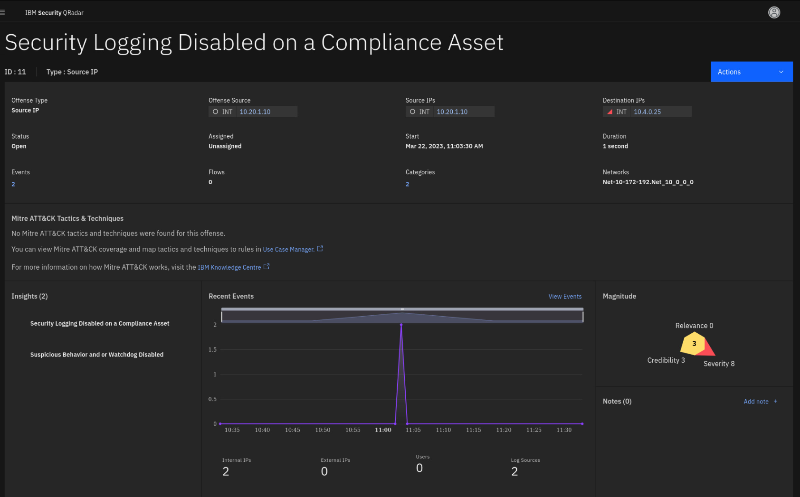

    Al igual que en nuestro caso de uso anterior, observamos de cerca un comportamiento sospechoso en un activo relevante para el cumplimiento relacionado con la desactivación de los registros de seguridad.

    Los registros de seguridad son importantes para la cobertura global en la supervisión y detección de actividades maliciosas. Además, el delito indica que está ocurriendo en un activo con datos relevantes para el cumplimiento (IP de destino).

    El delito se basa en la comunicación entre dos direcciones IP internas. No hay rastro de actividad del usuario. Obsérvese que la IP de destino muestra un triángulo rojo que indica una puntuación de alto riesgo para el activo.

3. Para saber más sobre el activo, haz clic en la IP **10.4.0.25**.

    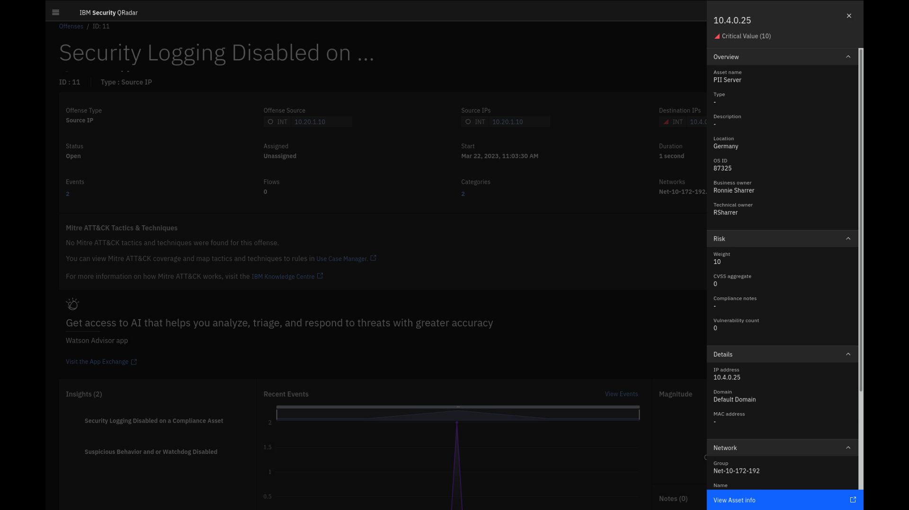

    Este activo se reporta como un servidor que contiene información PII, y tiene una ponderación de riesgo de 10. Está ubicado en Alemania y su propietario es Ronnie Sharrer. Se encuentra en Alemania y su propietario es Ronnie Sharrer.

4. Haga clic en **Ver información del activo** y se abrirá una nueva pestaña de Detalles del activo.

5. Revisar el activo.

    

    Por ejemplo, el nombre DNS implica que se trata de una base de datos, y el sistema operativo indica que el servidor funciona con Red Hat Linux 8.

6. Para volver al delito, cierre la pestaña Detalles del activo.

7. **Cierre** el panel lateral de Información de activos.

    Revisemos algunos otros parámetros del delito, como las fuentes de registro que informan sobre este activo.

8. Para revisar las fuentes de registro, haga clic en **Fuentes de registro 2** en la parte inferior derecha de la página, que indica la cantidad de fuentes de registro que contribuyeron a la infracción.

    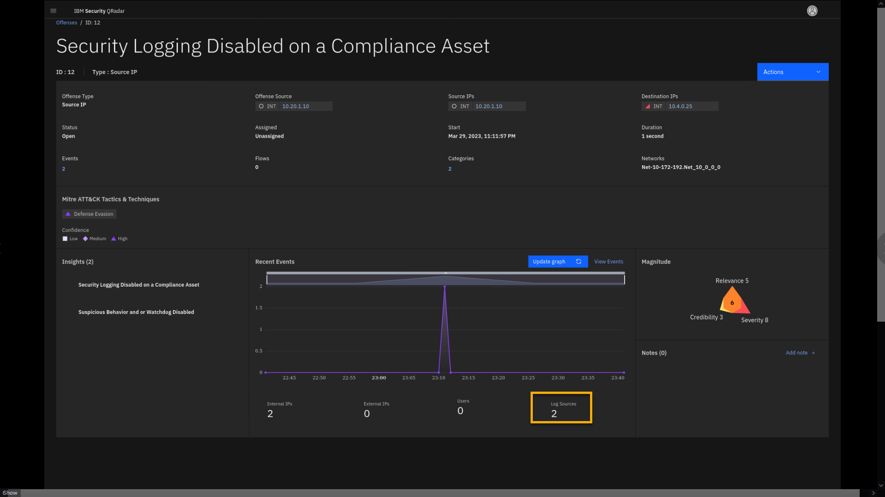

9. Revise los resultados de la búsqueda de las fuentes de registro asociadas al delito.

    La principal fuente de registro que informa sobre este delito es un sistema EDR (protección de punto final) con la dirección IP 10.20.1.10. Puede tratarse de un servidor EDR que informa sobre el endpoint, que es, en este caso, la IP de destino del servidor de base de datos PII que revisamos hace un rato.

    La otra fuente de registro en este resultado de búsqueda es el motor de reglas personalizadas de QRadar. Estos eventos son usualmente disparados por condiciones encontradas en otros eventos, por ejemplo, si un cierto número de eventos han ocurrido o si un cierto puntaje de riesgo acumulado ha sido alcanzado. Los eventos del motor de reglas personalizadas de QRadar pueden influir en la creación de nuevos eventos, aumentar o disminuir la magnitud y otros niveles para infracciones, o actuar de muchas otras maneras.

10. Haga clic en **Volver a Ofensa \<n>**.

    **Nota**: El número de infracción puede variar.

    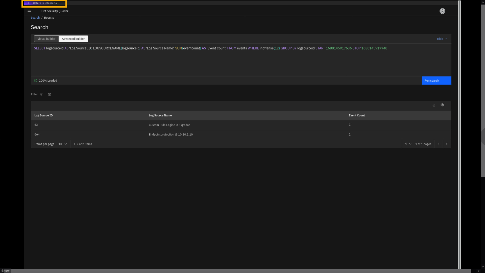

11. Para revisar la información, haga clic en **Comportamiento sospechoso o en Vigilancia desactivada**.

    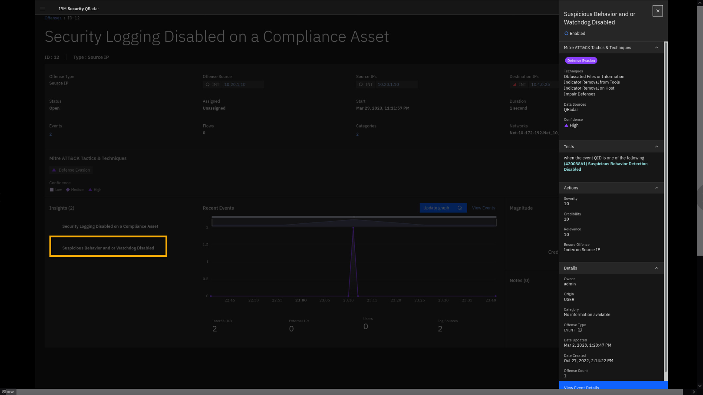

    Observando la condición Pruebas, se puede ver que la Detección de Comportamiento Sospechoso ha sido desactivada. Examinemos los eventos asociados a estos insights.

12. Haga clic en **Ver detalles del evento**.

    Tenga en cuenta que la búsqueda se forma automáticamente para recopilar los datos asociados con el delito y este insight.

13. En la tabla de resultados de búsqueda, haga clic en el Nombre del evento para abrir el panel de detalles.

    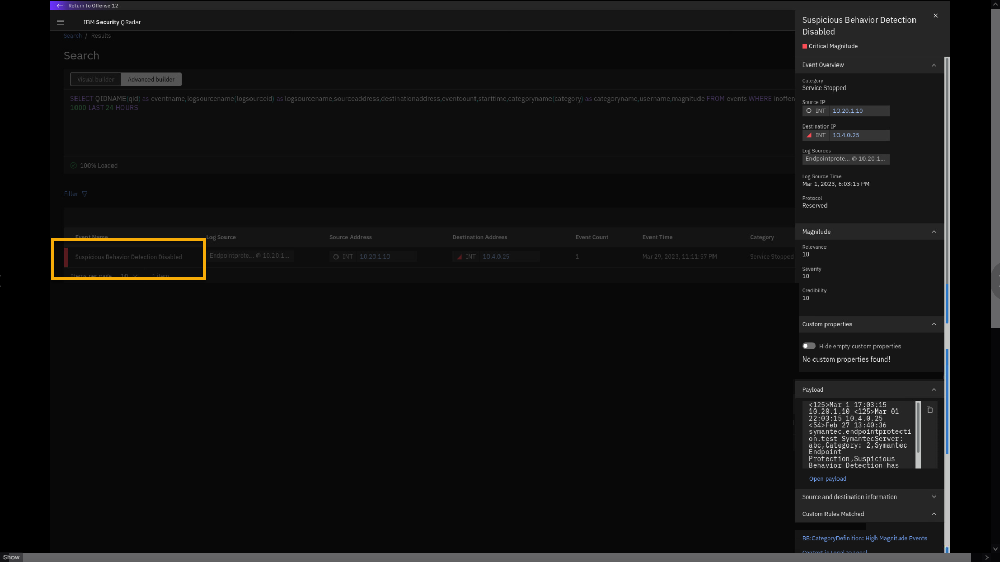

    Este evento fue generado por Symantec Endpoint Protection. La categoría del evento es Servicio detenido. Basándose en la magnitud crítica y dándose cuenta de que esta información pertenece a un activo crítico relevante para el cumplimiento, el analista debe actuar inmediatamente. Examinemos la carga útil sin procesar con más detalle.

14. En el panel Insights, haga clic en **Abrir carga útil**.

    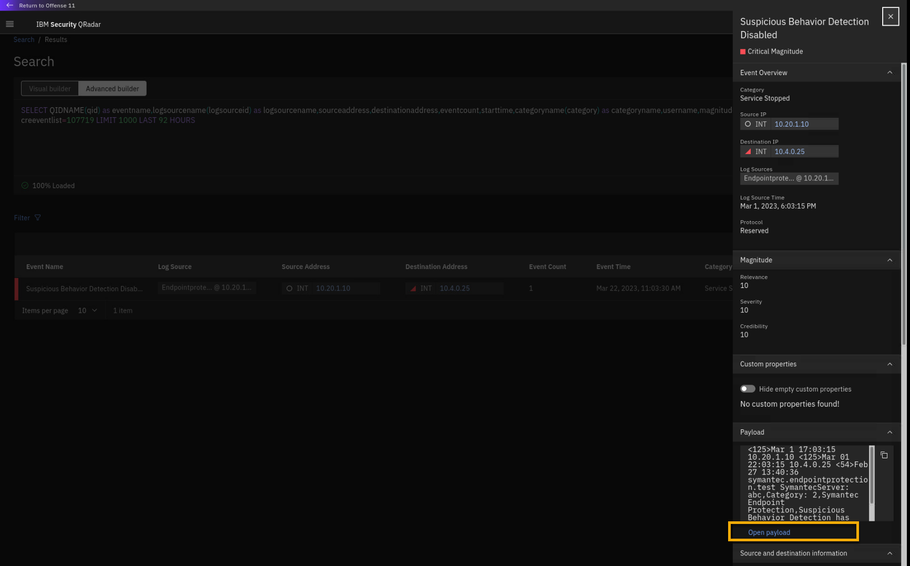

15. Revisa la carga útil.

    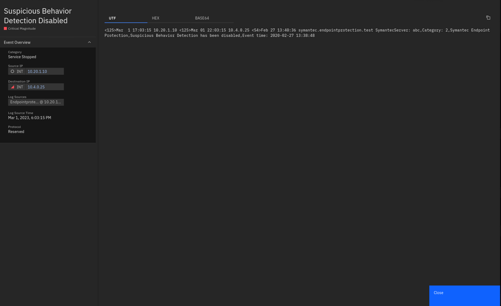

    El payload confirma que Symantec Endpoint Protection fue desactivado en el activo relevante para el cumplimiento (10.4.0.25) con datos PII.

16. Cierre la ventana Carga útil.

17. Para volver a la ventana de búsqueda, cierre el panel lateral\*\*.\*\*

18. Haga clic en **Volver al delito \<n>**.

**Nota**: El número de infracción puede variar.

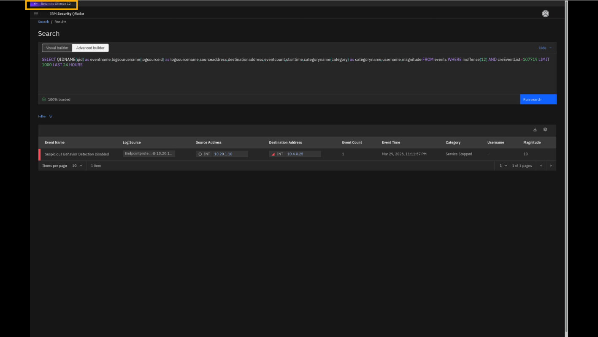

> Muchas organizaciones utilizan el [marco ATT\&CK de MITRE](https://attack.mitre.org/), que representa las tácticas de los adversarios que se utilizan en un ataque a la seguridad. Documenta tácticas, técnicas y procedimientos comunes que pueden utilizarse en amenazas persistentes avanzadas contra redes empresariales. La aplicación QRadar Use Case Manager puede asignar reglas personalizadas y bloques de construcción a tácticas y técnicas específicas para permitir a las organizaciones visualizar, comprender y planificar su cobertura de detección de amenazas.

A continuación, en esta demostración, investigará la clasificación ATT\&CK de MITRE y aprenderá que la ofensiva está clasificada como una táctica de Evasión de Defensa.

1. Para revisar los detalles de la clasificación ATT\&CK de MITRE, haga clic en **Evasión de la defensa**.

    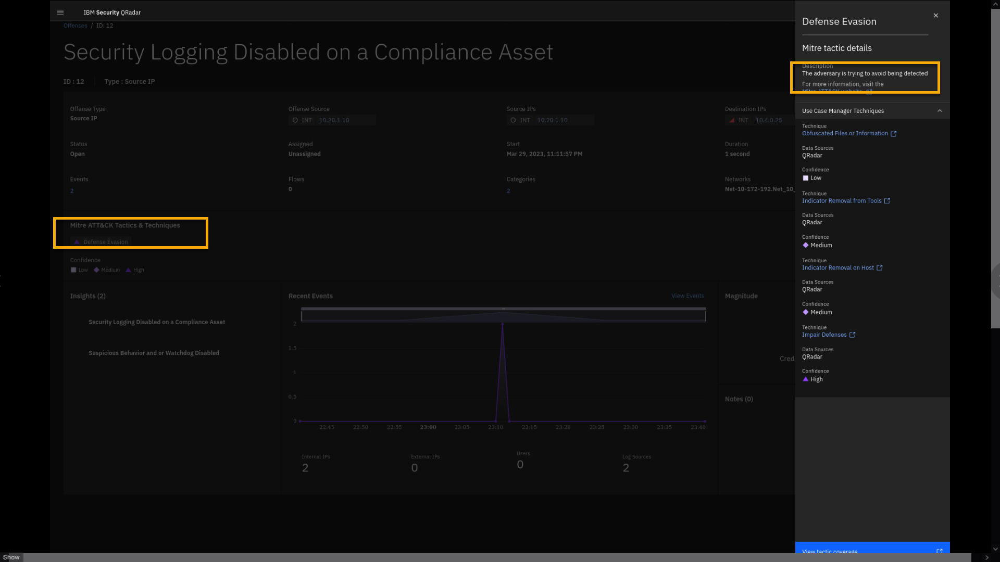

    El ataque se clasifica como evasión de la defensa: el adversario intenta evitar ser detectado.

    En el panel lateral puede ver cuáles de las técnicas de MITRE están cubiertas por sus reglas y bloques de construcción que apoyaron la activación de la ofensiva, incluido el nivel de confianza.

    Obtenga más información sobre la táctica de evasión de la defensa de MITRE haciendo clic en **Ver cobertura de la táctica**.

2. Haga clic en **Ver cobertura de la t** áctica para navegar al sitio web de MITRE de la táctica Evasión de la defensa. Navegue por algunos de los detalles.

    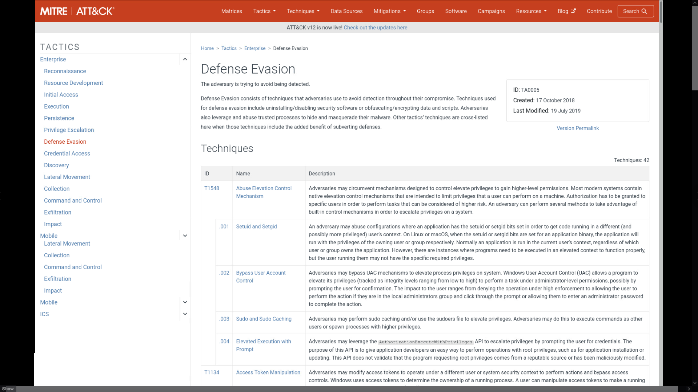

    Esta integración a través del enlace en la **cobertura de Ver Tácticas** al sitio web de MITRE acelera el acceso del analista de seguridad a los detalles sobre cada una de las tácticas y técnicas.

3. Después de revisar la página MITRE, cierre la pestaña MITRE.

4. Cierre el panel lateral de Evasión de la Defensa y haga clic en el breadcrumb de **Delitos**para revisar el último caso de uso.

    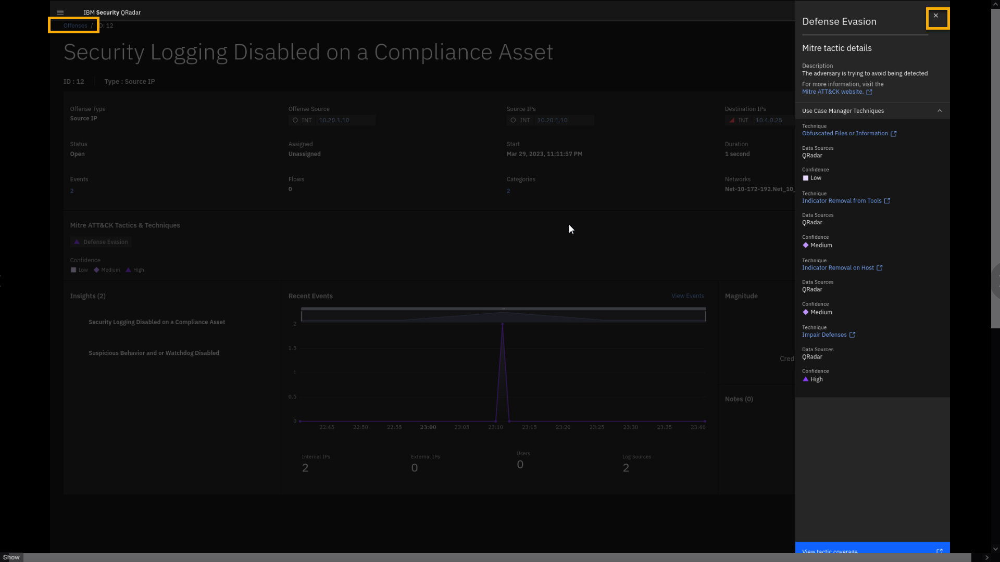

> Hemos revisado una infracción más, que se indexó en la dirección IP de origen. En este delito, un servidor de Symantec Endpoint Protection informó de un servicio de protección de endpoints desactivado en la dirección IP de destino de un activo de alto valor relevante para el cumplimiento.
>
> Ha llegado el momento de examinar el último ejemplo de delito, aunque éste es un poco más complejo que los dos anteriores.

### Eventos de Cumplimiento de Ofensas en el activo GDPR... indexado por el usuario mcoy

**Sugerencia**: Si es necesario, aplique de nuevo el filtro **Cumplimiento** para reducir el número de infracciones en la pantalla.

> El Reglamento General de Protección de Datos (conocido como GDPR, por sus siglas en inglés) es una normativa que obliga a las organizaciones a proteger los datos personales y la privacidad de los ciudadanos de la Unión Europea (UE), y su incumplimiento puede acarrear importantes multas.
>
> Las salvaguardas técnicas, como la tecnología de Prevención de Pérdida de Datos (DLP), ayudan a prevenir una brecha. Puede emparejar QRadar con sus herramientas de seguridad para que le notifique alertas de políticas específicas que haya desplegado a través de otras tecnologías de seguridad, como IBM Guardium, Imperva, Vormetric, etc.
>
> Dado que las organizaciones son responsables de la pérdida de cualquier dato personal que recopilen, se añaden capas de protección mediante la incorporación de controles DLP en QRadar para identificar y restringir la transmisión de datos personales fuera de la red.

Veamos ahora de cerca y analicemos un delito relacionado con el GDPR.

**Importante**: Tenga en cuenta que puede haber varios Eventos de Cumplimiento similares en infracciones de activos GDPR, pero solo uno en el que la Fuente de Infracción sea el usuario mcoy. Utilice ese para este laboratorio y demostraciones.

1. En la página de infracciones, filtrada por eventos relacionados con el cumplimiento, haga clic en la infracción **Eventos de cumplimiento en GDPR Ass**... que muestra el usuario mcoy como origen de la infracción.

    

2. En la página de detalles de la infracción, haga clic en la **elipsis** para ver el nombre completo de la infracción.

    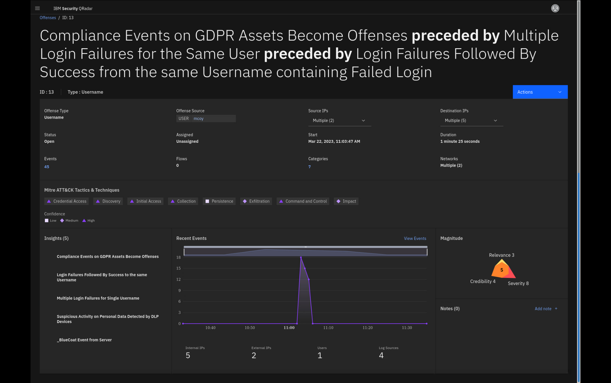

    Observe que el nombre de este delito es muy largo. Esto se debe a que la función de encadenamiento de **_infracciones_** combina varias percepciones que contribuyen a la infracción utilizando el mismo índice. Estos conocimientos se enlazan o encadenan utilizando la palabra clave **proceder por**.

    Antes de sumergirnos en las percepciones de esta ofensiva, examinemos la parte superior de la página, donde se encuentran los datos resumidos de la ofensiva.

    El Tipo de Delito le informa sobre la información raíz que se utilizó para recoger los datos. También llamamos a ese parámetro el índice de ofensa. Los dos tipos de infracción más comunes son IP de origen, IP de destino y nombre de usuario.

    Esta ofensa está indexada por _nombre de usuario_.

3. Haga clic en el **mcoy de** USUARIO de Fuente de Ofensa.

    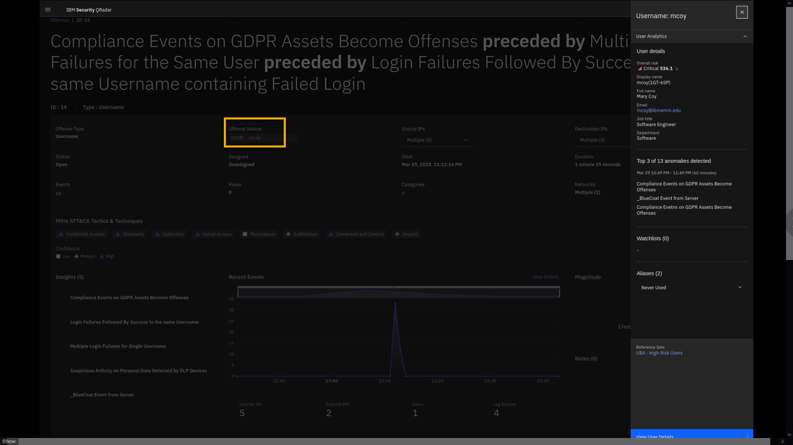

    Al abrir el panel de detalles de la Fuente de la Infracción o el nombre de usuario, puede obtener información adicional sobre ese usuario, que le llevará a la aplicación de Análisis del Comportamiento del Usuario (UBA). Hablaremos de la aplicación UBA con más detalle más adelante.

4. Cierre el panel lateral de detalles del usuario y vuelva a la página de detalles del ofensor.

5. Amplíe las direcciones **IP** de **origen** e **IP de destino**.

    Además de la infracción indexada en el nombre de usuario, la infracción recopila todas las direcciones IP de origen y destino internas y externas de los registros (y flujos) que contribuyen a la infracción.

    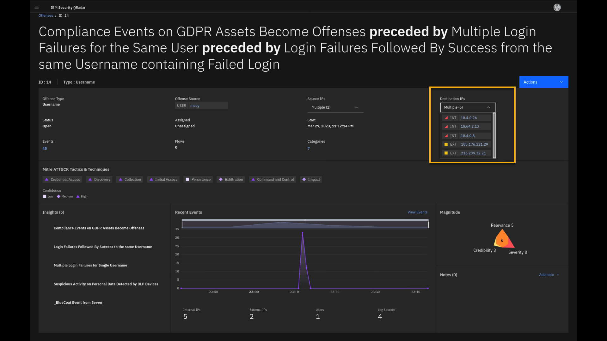

    El siguiente detalle importante que queremos investigar es la magnitud del delito.

6. Haga clic en la región **Magnitud**.

    

7. Revise el panel lateral de Magnitud de la Ofensa.

    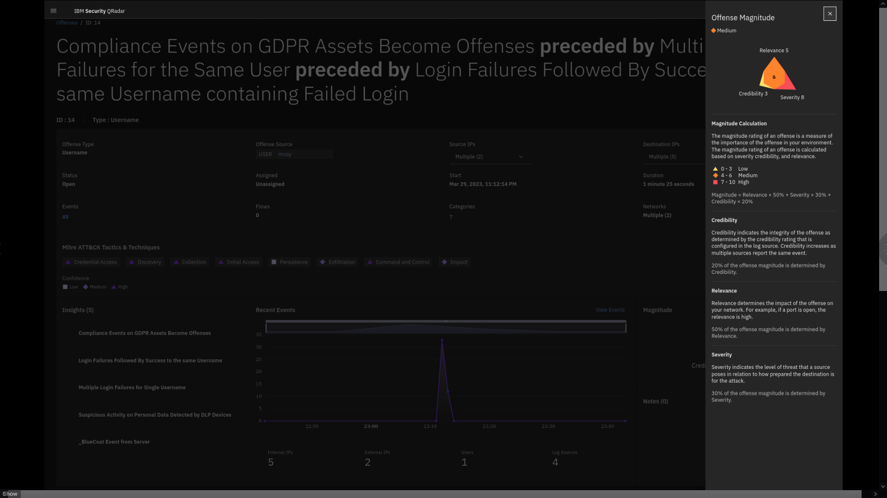

    La magnitud proporciona una puntuación sobre la gravedad del problema asociado a la infracción. La magnitud se calcula en función de la relevancia y gravedad de los eventos que contribuyen a la infracción, así como de la credibilidad, que depende de un nivel asignado a la fuente de registro que procesa el evento. Por ejemplo, la credibilidad de los registros de IBM Security Guardium podría considerarse mayor que la de los registros de un servidor web que no maneja información personal identificable (PII).

    Observe la fórmula que aparece en la pantalla y que muestra cómo se calcula la magnitud.

    RELEVANCIA x **50%** + GRAVEDAD x **30%** + CREDIBILIDAD x **20%**.

    > Obsérvese que la puntuación de la magnitud disminuye con el tiempo. Esto es lógico porque cuanto más antiguo es el delito, menos relevante resulta. La puntuación de magnitud oscila entre 0 y 10. Cuanto más alta sea la puntuación, más urgente será el análisis de la infracción para detectar posibles problemas de seguridad.

8. Cierre el panel de magnitud de la infracción y vuelva a la pantalla de resumen de infracciones.

    Observe que el delito incluye múltiples direcciones IP de origen y destino relevantes para la actividad de mcoy. Además, QRadar informa sobre las tácticas y técnicas de MITRE ATT\&CK observadas en este delito. También puede ser relevante para el analista observar las categorías de eventos que contribuyeron a esta ofensa.

9. En la página de detalles de la ofensa, haga clic en el **número de** eventos en las **Categorías**.

    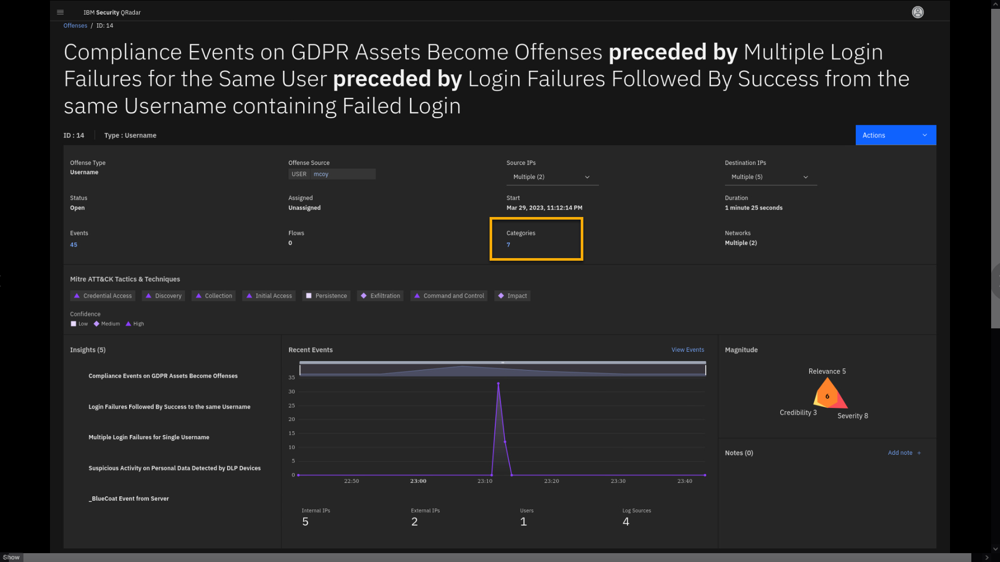

    QRadar utiliza categorías de eventos para agrupar los eventos entrantes para su procesamiento. Las categorías de eventos se pueden buscar y le ayudan a supervisar su red. Cada evento que ocurre en su red tiene asociadas categorías de alto y bajo nivel. Así, los eventos son agregados y pueden ser buscados por esas categorías.

10. Revise los resultados de la búsqueda.

    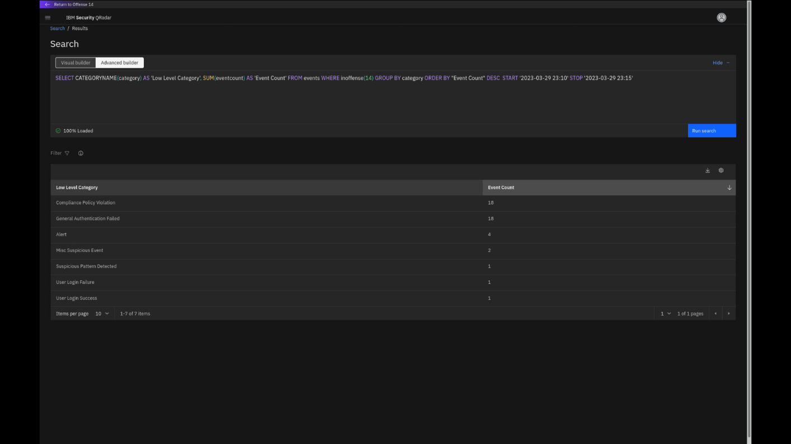

    Al examinar las categorías de bajo nivel que contribuyeron a este delito, observe que el único evento de la categoría Éxito de inicio de sesión de usuario indica la urgencia de investigar inmediatamente este delito con más detalle, especialmente en el contexto de la gran cantidad de eventos anteriores encadenados de la categoría Autenticación general fallida.

11. Para cerrar la lista Categorías de eventos, haga clic en **Volver a Ofensa** **\<n>**.

    **Nota**: El número de infracción puede variar.

    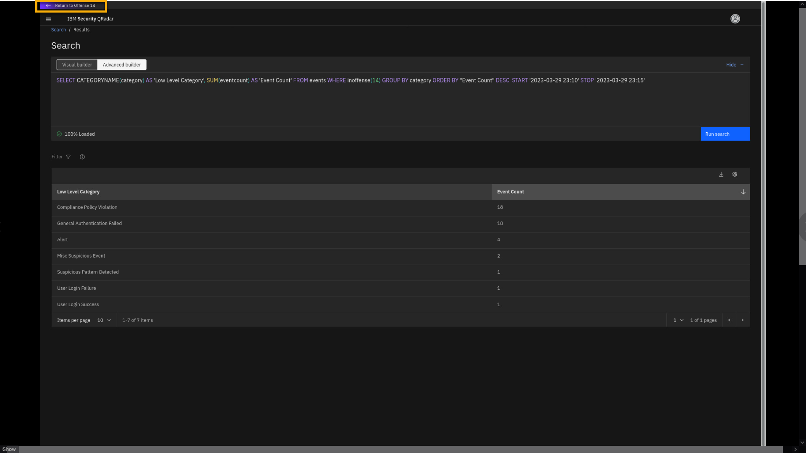

    Antes de profundizar en los acontecimientos que han contribuido a esta ofensiva y desenterrar todos los detalles sobre lo que ha sucedido, analicemos algunos de los puntos de vista sobre la ofensiva.

12. Haga clic en el **evento \_BlueCoat desde** la perspectiva del **servidor**.

    Al observar las definiciones de las Pruebas, se ve que los insights se activan porque se detecta tráfico de red entre el controlador de dominio y una o más categorías web que se han marcado como potencialmente maliciosas dentro del conjunto de referencia _BlueCoat Investigate Categories_. Para comprender mejor lo que ha sucedido, debemos examinar los eventos asociados a este insight.

13. Haga clic en **Ver detalles del evento**.

    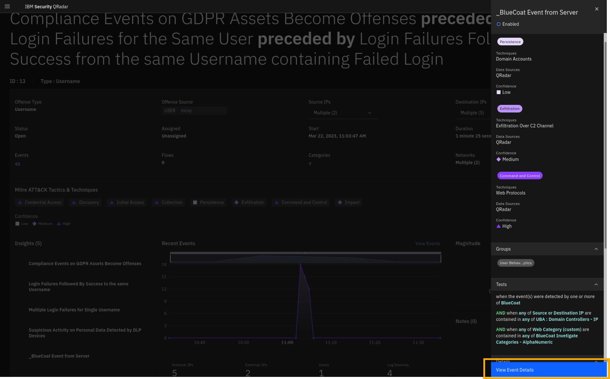

14. Revise los eventos asociados con la fuente de registro de BlueCoat.

    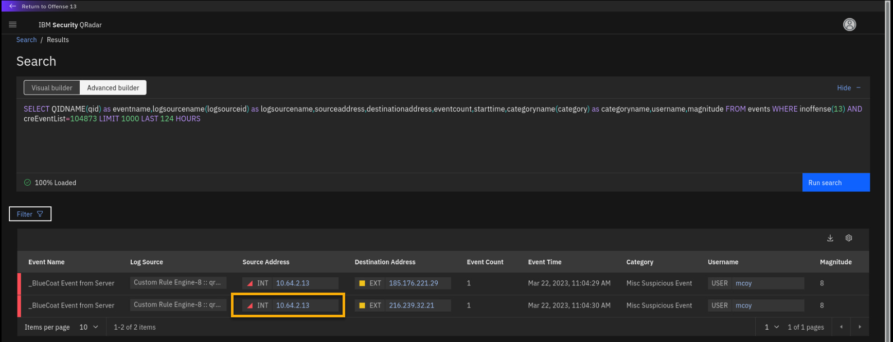

    Los eventos asociados con el BlueCoat insight se extraen de QRadar usando la consulta AQL formada automáticamente. Puede ver que hay dos sitios remotos que se comunican con la dirección IP interna 10.64.2.13.

15. Haga clic en la dirección IP interna **10.64.2.13**.

    

16. Revise el activo Controlador de dominio.

    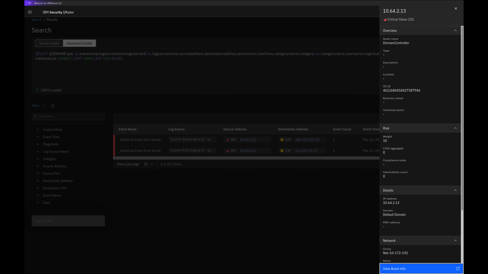

    Nótese que la dirección IP interna está clasificada como Controlador de Dominio y tiene una ponderación de riesgo de 10. Un analista de seguridad sabría que no hay ninguna razón plausible para la interacción directa entre redes externas y un controlador de dominio. A continuación, echemos un vistazo a una de las IPs externas.

17. Cierre el panel lateral de activos y haga clic en la IP externa **216.239.32.21**.

    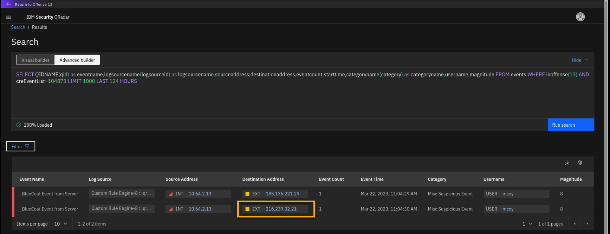

18. Revise el panel lateral de la dirección IP.

    Tenga en cuenta que esta dirección IP muestra una puntuación de riesgo X-Force baja en este momento. Se trata de información en tiempo real extraída de la base de datos de IBM X-Force Exchange. Sin embargo, para investigar cómo se ha comportado esta dirección IP en el pasado, puede hacer clic en Ver información de X-Force.

19. Haga clic en **Ver información de X-Force**.

    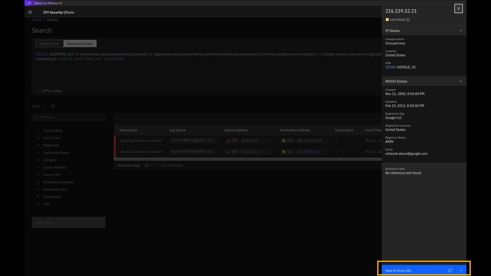

20. Revisa la página de X-Force Exchange con los datos históricos de la dirección IP que se presentan en una nueva pestaña del navegador.

    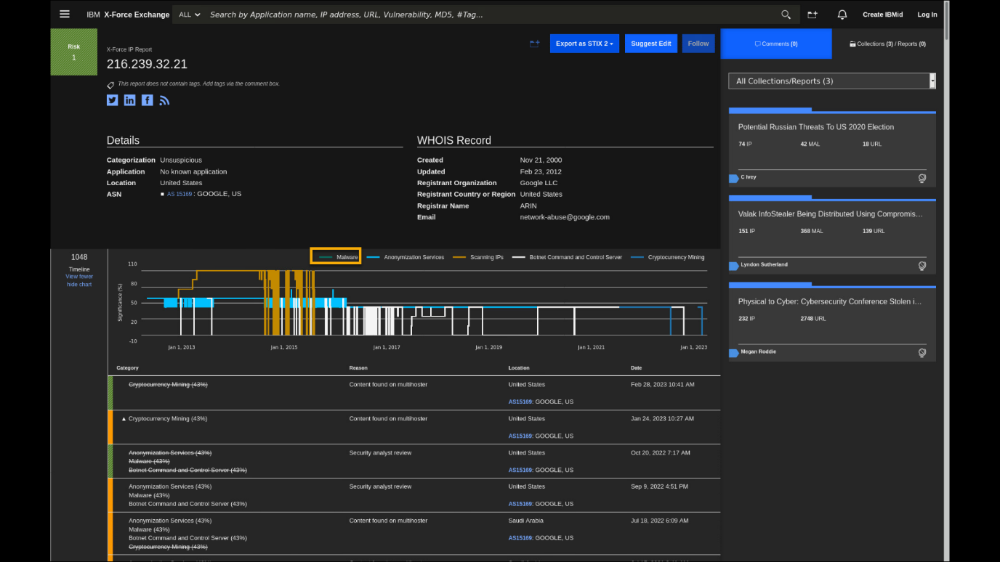

    > La base de datos de X-Force Exchange mantiene registros históricos de actividades maliciosas en el espacio público de direcciones IP. Ahora mismo, esta dirección IP está limpia, pero en el pasado (cuando esta demostración se desarrolló originalmente) vemos que la dirección IP tiene múltiples problemas relacionados con spam, botnet y actividades de malware. La dirección IP también formaba parte de múltiples colecciones que se utilizaban para rastrear diferentes campañas de amenazas. Todos estos datos se integran con QRadar SIEM y pueden utilizarse para mejorar la detección e investigación de actividades maliciosas.

21. Cierra la ventana de X-Force Exchange y el panel lateral de direcciones IP.

22. Desde la página de búsqueda, vuelva al delito haciendo clic en **Volver al delito \<n>**.

    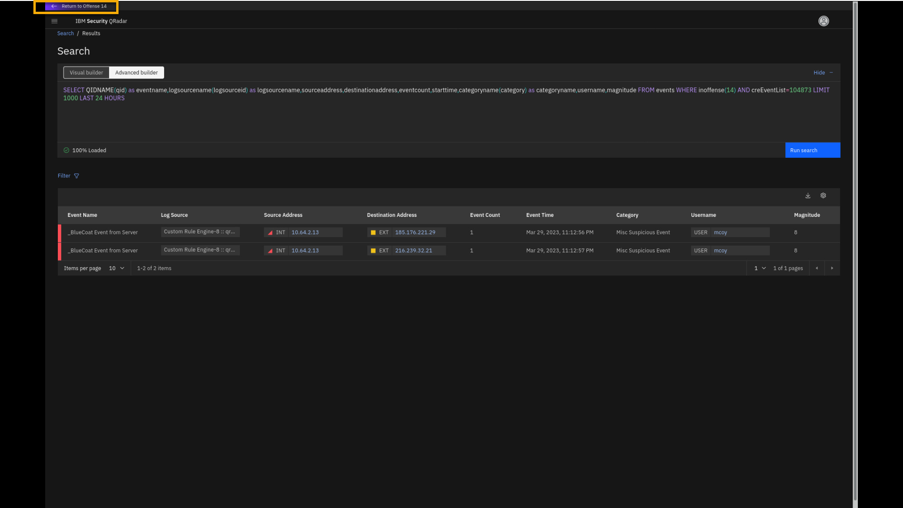

    Repasemos la siguiente información de este delito, Actividad sospechosa en datos personales detectada por dispositivos DLP.

23. Haga clic en el cuadro de diálogo **Actividad sospechosa en datos personales detectada por dispositivos DLP**.

    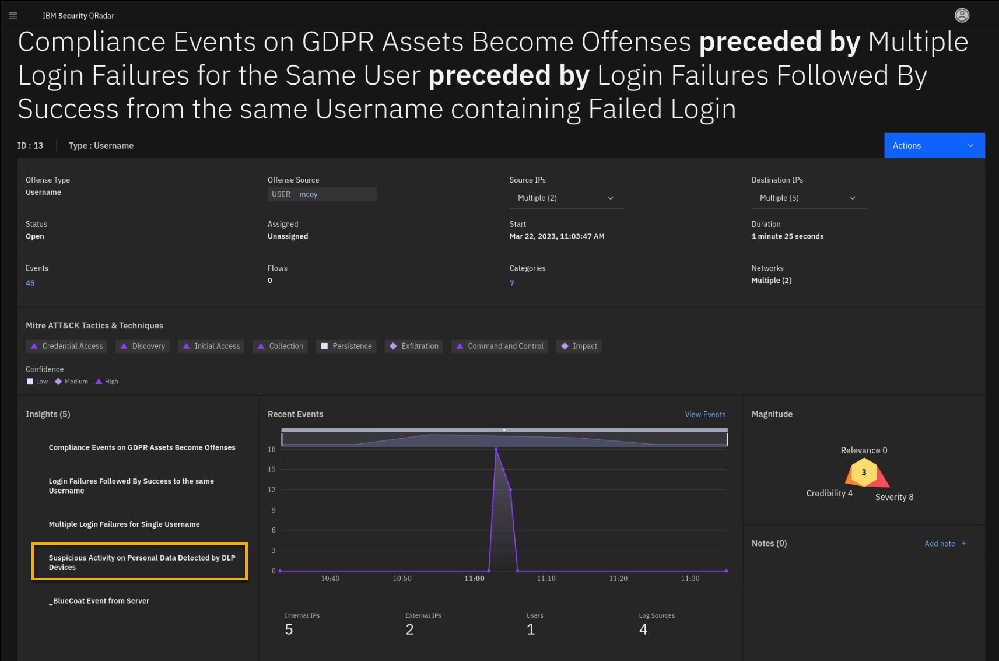

24. Revise las secciones Notas y Pruebas relacionadas con este insight.

    Si observamos la sección Notas y las Pruebas relacionadas con este insight, nos daremos cuenta de que la prueba se dispara si un servicio DLP (Prevención de Pérdida de Datos) detecta una política o regla definida en el conjunto de referencia _Políticas GDPR DLP_. Veremos esas pruebas y los insights con más detalle un poco más adelante utilizando la aplicación Use Case Manager, pero ahora revisemos los eventos relacionados con esta prueba y el delito.

25. En la parte inferior de la ventana lateral, haga clic en **Ver detalles del evento**.

    

    La nueva búsqueda se forma automáticamente mostrando los eventos Guardium que observaron actividades entre sistemas internos. Los sistemas de destino están marcados en rojo, lo que significa que se trata de activos críticos.

26. En la pantalla Detalles del evento, haga clic en la IP crítica **10.4.0.26**

    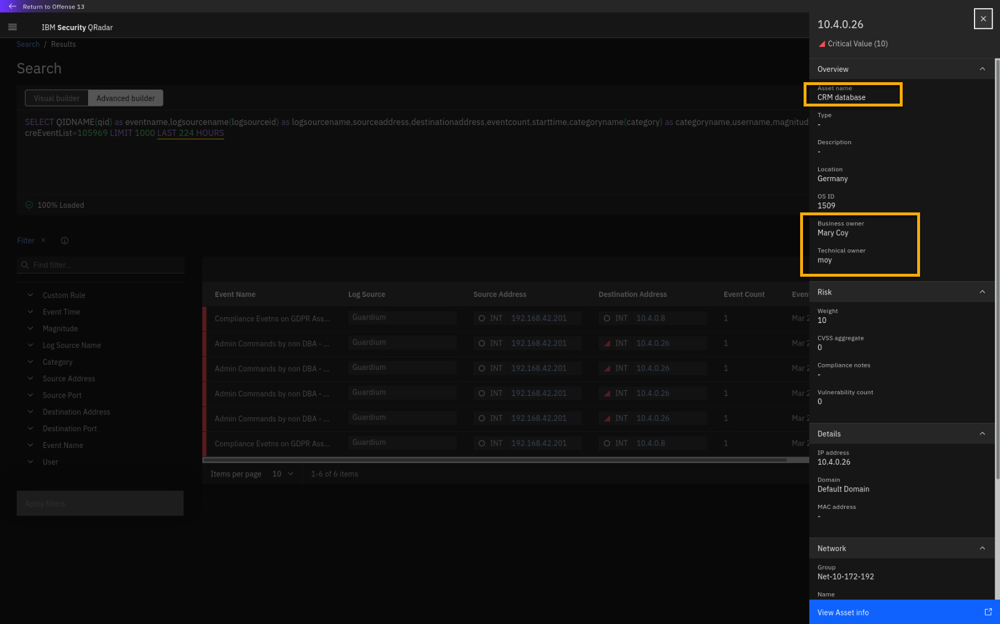

    Este activo está etiquetado como una base de datos CRM y su propietaria es Mary Coy, que también está implicada en este delito. Esto indica que se trata de una amenaza interna maliciosa o de un adversario externo que utiliza credenciales robadas. Continuemos la investigación.

27. Salga del panel de detalles del activo y vuelva a la ventana de resultados de la búsqueda.

    Veamos con más detalle el evento _Comandos Admin por no DBA - Alerta_.

28. Haga clic en **Comandos de administración por no DBA -- Alerta**.

    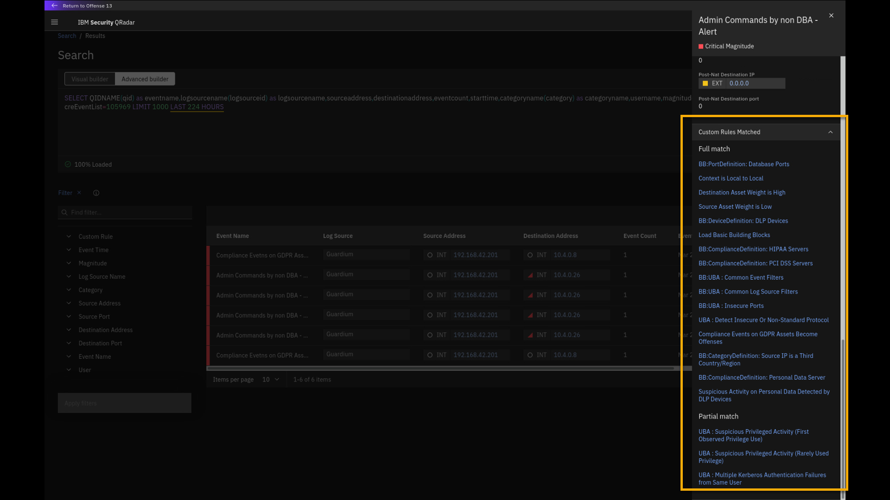

    Este evento Guardium está marcado como crítico. Si nos desplazamos a la parte inferior del panel de detalles del evento, podemos ver qué insights (reglas y building blocks de QRadar) coincidieron total o parcialmente en este evento. Cualquier regla o building block coincidente puede contribuir a un ataque o crear uno nuevo.

    También puede ver el payload completo, cómo el evento es recibido por QRadar desde Guardium.

29. Si aún no lo está, amplíe la sección **Propiedades personalizadas**.

    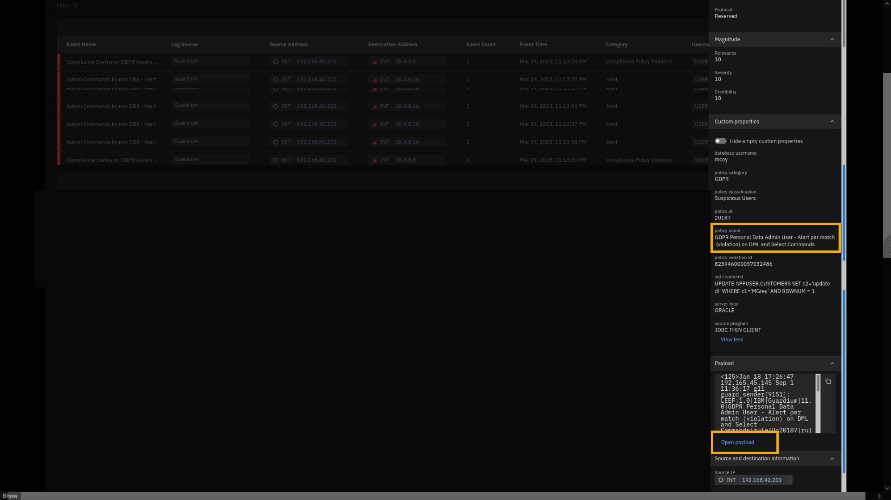

    En la sección **Propiedades personalizadas**, puede ver qué parámetros se extraen de la carga útil del evento. Uno de ellos es el nombre de la política -- **_GDPR Personal Data Admin User -- alert per match (violation) on DML and Select Commands_**. Tome nota del nombre de esta política, porque haremos referencia a ella más adelante en el laboratorio y en la demostración.

    También se ve el usuario, mcoy, que ejecutó el comando SQL de la base de datos.

30. Haga clic en **Abrir carga útil**.

    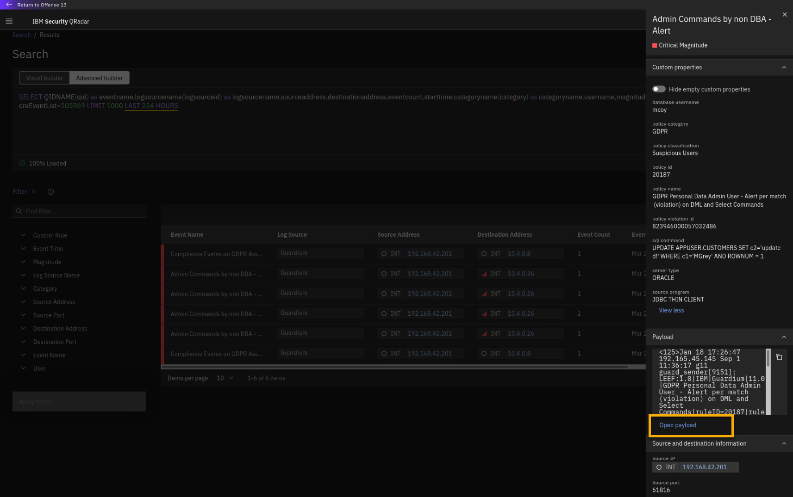

31. Revise la página de detalles de la carga útil.

    En esta página, puede ver el aspecto de la carga útil sin procesar. Si identificas algunos datos relevantes en la carga útil, podrías crear una propiedad personalizada adicional para extraer la información, que puedes utilizar en las reglas que procesan los eventos.

    Esto facilita las actividades diarias de sus analistas de seguridad porque ya no necesitan revisar un montón de cargas útiles sin procesar. En su lugar, QRadar extrae automáticamente los campos importantes de las propiedades personalizadas y utiliza el motor de reglas personalizadas, las pruebas y las perspectivas para digerir la información para el analista, empaquetando todas las piezas de información en un paquete humano, más consumible, lo que llamamos una ofensa.

32. **Cierre** la página de detalles de la carga útil.

    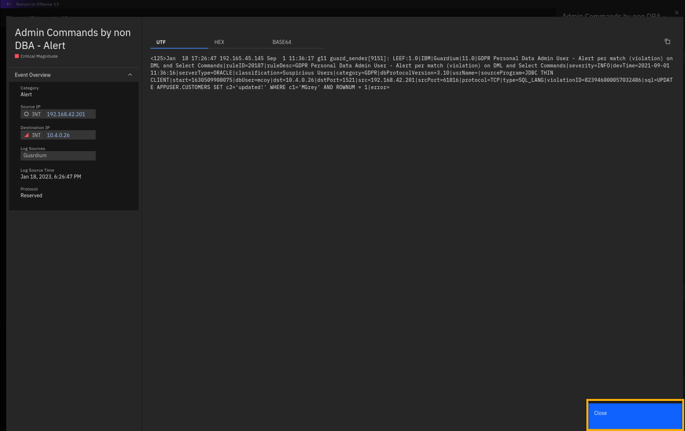

    Volvamos a la ofensiva.

33. Cierra también el panel lateral.

34. En la página Buscar, haga clic en **Volver a Delito \<n>**.

    **Nota**: El número de infracciones puede variar.

    Podemos seguir examinando cada uno de los insights y analizarlos en mayor profundidad. Pero, incluso leyendo los títulos de los insights, podemos ver el desarrollo de la historia del ataque: el Controlador de Dominio se comunicaba con direcciones IP remotas con mala reputación. A continuación, la cuenta mcoy ejecutó una actividad sospechosa en la base de datos CRM -quizás se exfiltraron datos. Y después, la cuenta intentó iniciar sesión en otro sistema y finalmente lo consiguió. Todos estos datos se recopilaron en 45 eventos. La función _de encadenamiento de of_ ensas resume la amenaza en el título de la ofensa combinando múltiples percepciones en una ofensa conectada con la palabra **procedido por**.

    > Basándose en el análisis detallado de la infracción, un analista puede llevar a cabo una serie de acciones sobre la infracción, como cerrar falsos positivos o escalar la infracción a un sistema de respuesta a incidentes o a un sistema de tickets.

35. Haga clic en **Acciones** para ver una lista de las acciones que pueden realizarse en la infracción.

    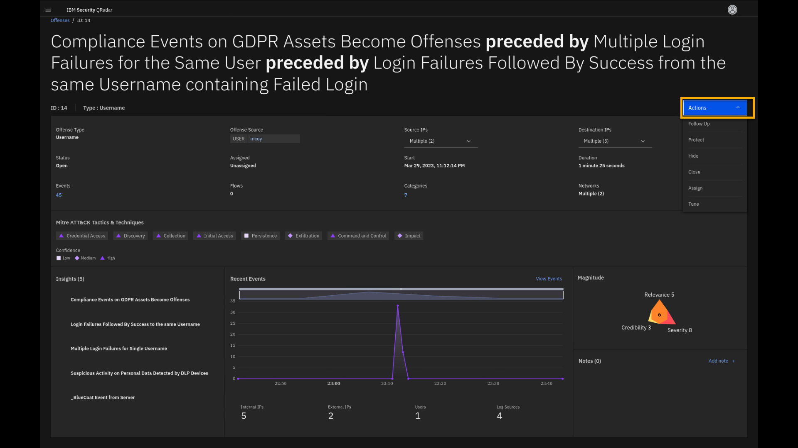

    Si la infracción se considera falso positivo, el analista debe cerrarla. No se considera una buena práctica aplazar o no realizar el cierre de la ofensa porque QRadar se entrena basado en la razón de cierre de la ofensa que el analista especifica. Cerrar infracciones también ayuda al rendimiento.

    Si no gestiona correctamente las infracciones, éstas pueden caducar. Si es necesario, un analista también puede congelar una infracción para evitar que caduque.

    En este caso, el incidente es una amenaza real y requiere una respuesta a incidentes. Por lo tanto, puede enviar la información de la ofensa a QRadar SOAR para una mayor respuesta a incidentes. Esa acción está más allá del alcance de este laboratorio.

    Por lo tanto, deje el delito en el estado activo actual.

36. Cierra el menú emergente de acciones.

Hasta ahora, hemos demostrado cómo un analista de seguridad puede usar las ofensas para analizar la información que QRadar ha recibido y procesado. Realizamos un análisis detallado de las infracciones y resaltamos los artefactos importantes, como el índice, la magnitud, las categorías de eventos, las percepciones y los eventos.

Echemos ahora un vistazo de cerca a los casos de uso y reglas de QRadar con la aplicación Use Case Manager.

## Análisis de reglas con la aplicación Use Case Manager

> El panorama de la conformidad y las amenazas evoluciona constantemente. Además, a medida que su organización crece, nuevos activos y patrones de tráfico de red se añaden a su entorno de TI.
>
> Para hacer frente a estos retos en constante cambio, su equipo de seguridad debe ser capaz de adaptar y aumentar de forma constante y consistente las reglas predeterminadas y los bloques de construcción de QRadar SIEM.
>
> Utilizando la aplicación Use Case Manager, puede desplegar, gestionar y modificar el conjunto de reglas en su despliegue QRadar en un solo lugar.
>
> Use Case Manager (o UCM) tiene muchos filtros que pueden ayudarle a analizar su conjunto de reglas y revisar y analizar las dependencias de las reglas. Integra el marco ATT\&CK de MITRE y muestra la cobertura de reglas desplegadas de QRadar para diferentes tácticas y técnicas.
>
> Por último, UCM puede ayudarle a ajustar las reglas en su despliegue de QRadar.

Revisemos la aplicación Gestor de Casos de Uso.

1. Vaya al Menú principal y seleccione **Gestor de casos de** uso.

    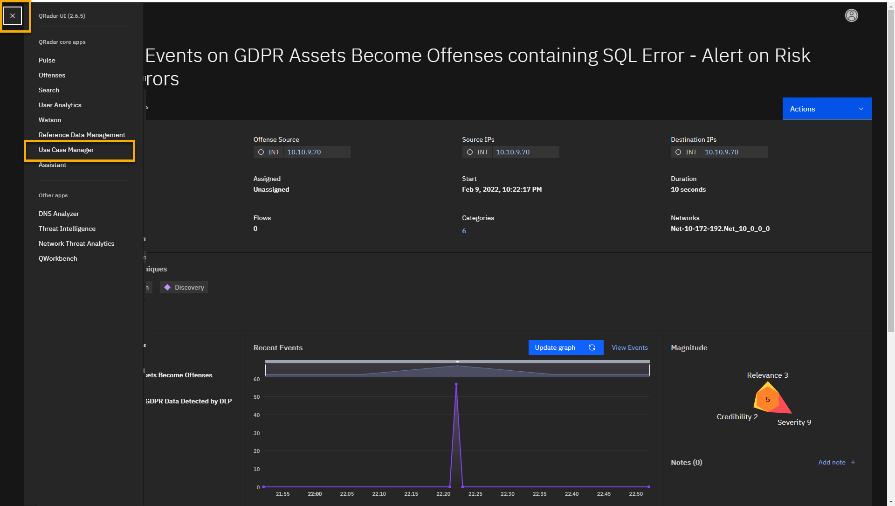

    La aplicación UCM carga el Explorador de Casos de Uso. El explorador le ayuda a buscar y revisar las reglas y los bloques de construcción basándose en muchas opciones de filtrado. Normalmente, empezarás cargando algunos de los filtros de plantilla.

2. Haga clic en el icono **Seleccionar plantilla**.

    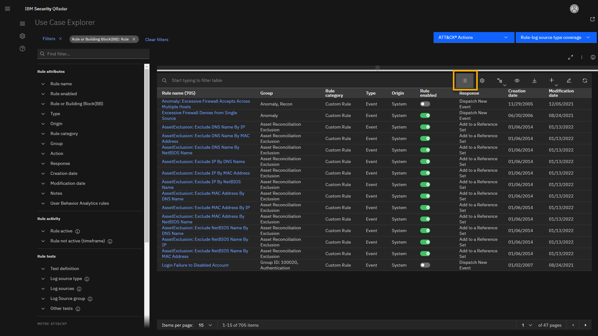

    Se abrirá la pantalla Seleccionar plantilla, donde podrá elegir una de las plantillas preconfiguradas. Tenga en cuenta que puede seleccionar su combinación de filtros preferida y añadir su propia plantilla personalizada a la lista.

    Vamos a cargar todas las reglas que tenemos instaladas en QRadar.

3. Haga clic en **Plantilla por defecto -- Todas las reglas**.

    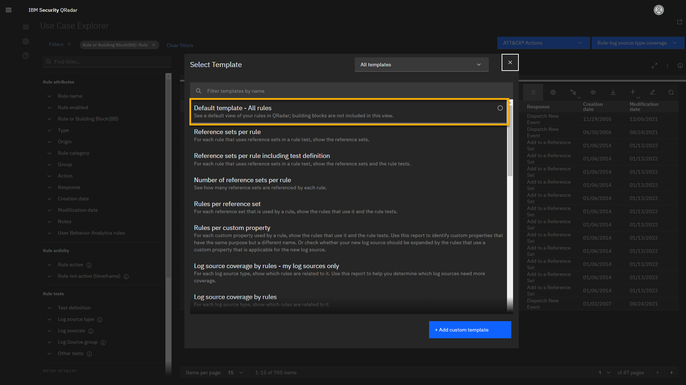

    Esta vista tiene casi 400 reglas diferentes. La vista contiene muchos filtros que pueden ayudarle a buscar casos de uso específicos. Por ejemplo, puede visitar los casos de uso relacionados con las normativas de cumplimiento.

4. En el menú Filtros, expanda el **Grupo** y haga clic en

    > **Conformidad**.

    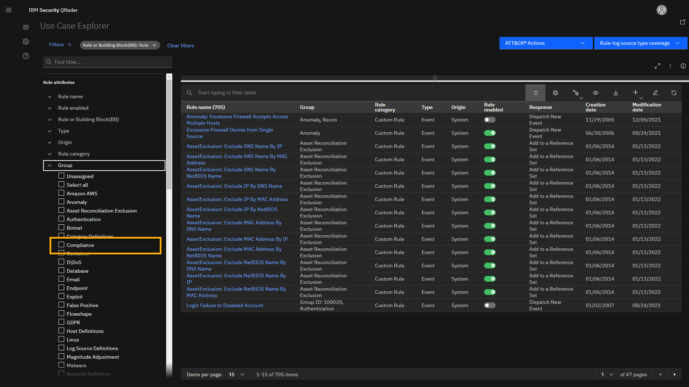

    Observe que se añade un nuevo filtro resaltado en blanco a la lista de filtros. Para activar el filtro, debe hacer clic en Aplicar filtros.

5. Haga clic en **Aplicar filtros**.

    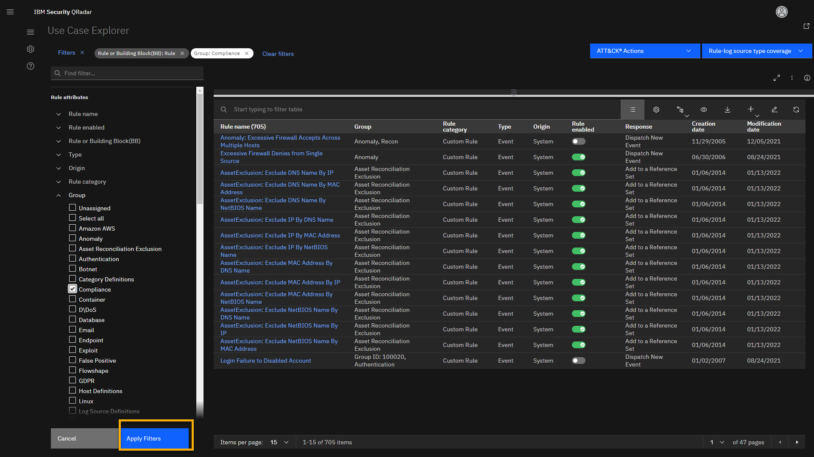

    Esta combinación de filtros carga 50 reglas diferentes y bloques de construcción relacionados con la configuración de QRadar para ayudar con la cobertura de diferentes casos de uso de cumplimiento, como HIPAA, PCI, SOX, GDPR, etc.

    Los nuevos filtros aplicados aparecen en la parte superior de la pantalla. Observe que el filtro _Grupo: Cumplimiento_ ha cambiado de color. Siempre puede utilizar **Borrar filtros** para empezar su análisis e investigación desde el principio.

    Con la barra de búsqueda, puede limitar los resultados.

    Por ejemplo, veamos las normas relacionadas con los casos de uso del GDPR.

6. Haga clic en la **barra de búsqueda** y escriba GDPR.

    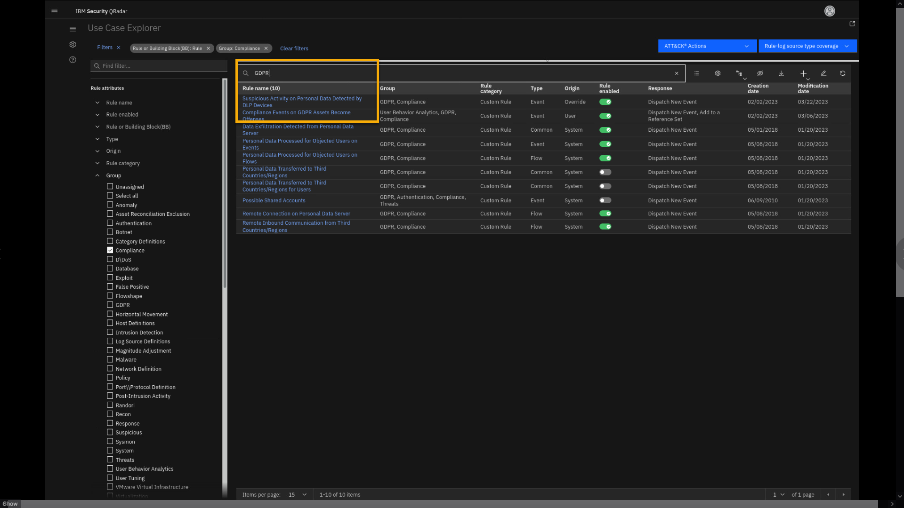

    Como resultado, la lista de reglas reduce la búsqueda a 10 reglas relacionadas con el cumplimiento del GDPR. Observe que la lista también contiene las dos reglas (o perspectivas) que mostramos en la primera parte del laboratorio. Analicemos ahora la regla (o insight) _Actividad sospechosa en datos personales detectada por dispositivos DLP_ con más detalle.

7. Haga clic en la regla **Actividad sospechosa en datos personales detectada por dispositivos DLP**.

8. Revise la infracción mostrada en el gráfico y, a continuación, contraiga la sección de **Infracciones creadas por la norma actual en un tiempo** determinado.

    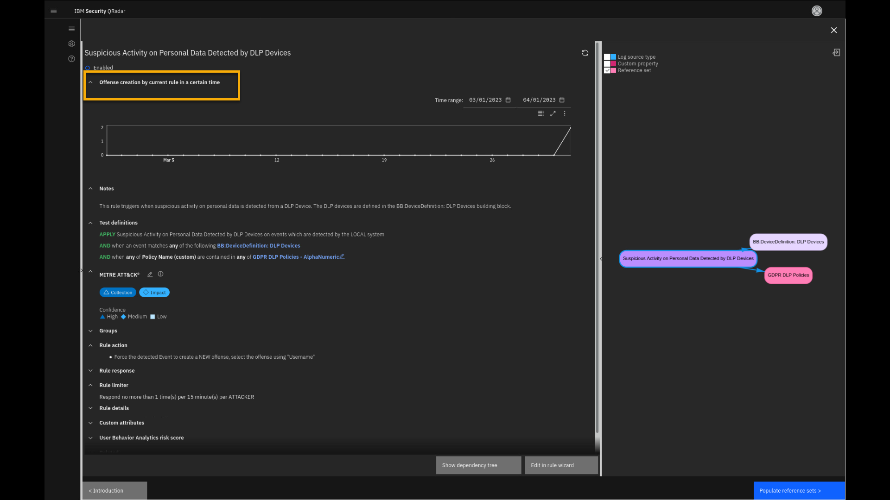

    Se carga la nueva página, donde vemos los datos del resumen de la regla. La sección de **Infracción creada por la norma actual en un tiempo** determinado muestra a cuántas infracciones ha contribuido la norma durante un intervalo de tiempo específico. En la sección de **Notas**, vemos la descripción de la regla. Además, vemos las **definiciones de Prueba** que ya habíamos analizado anteriormente en la demostración. También vemos la cobertura **MITRE ATT\&CK** predeterminada para esta regla, que puede editar y ajustar si es necesario.

    La región principal muestra información adicional relevante sobre la norma.

    La sección **Acción de** la regla describe lo que ocurre si la regla se activa. En la sección **Respuesta de la regla** se ve que la regla crea un nuevo evento y un delito con los niveles de riesgo y las categorías de eventos apropiados.

    El **limitador de reglas** ayuda a reducir el ruido si los eventos se producen con demasiada frecuencia.

9. Desplácese hacia abajo si es necesario y haga clic en **Tipos de fuente de registro**.

    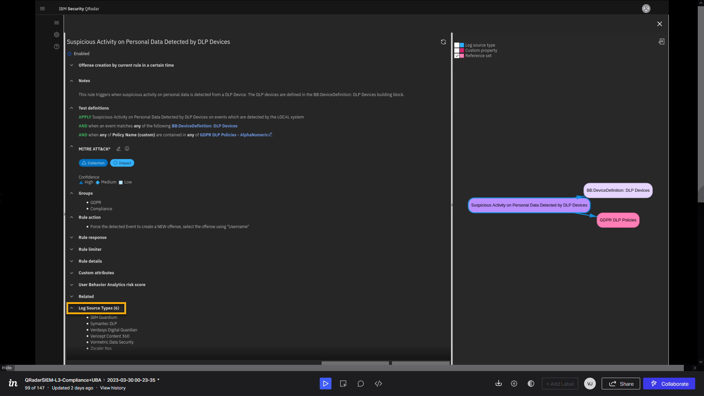

    También es interesante revisar qué tipo de fuentes de registro están asociadas a esta regla. Vemos que una de ellas es IBM Guardium.

    Centrémonos ahora en la parte derecha de la página. Aquí se ve el gráfico de relaciones entre los distintos elementos de la regla.

10. En el gráfico de relaciones, seleccione **Tipo de fuente de registro** y **Propiedad personalizada**.

    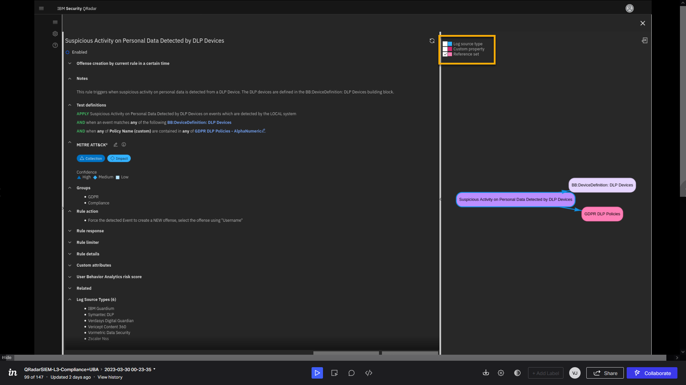

    Podemos profundizar en el análisis de dependencias seleccionando el bloque de construcción **Device Definition: Dispositivos DLP**.

11. En el gráfico de relaciones, seleccione **BB:Definición de dispositivos: Dispositivos DLP**.

    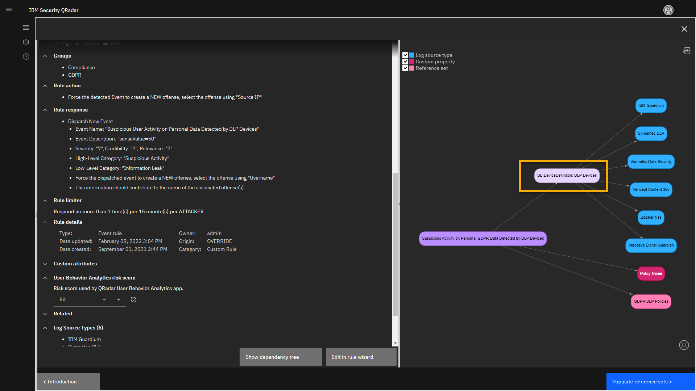

    Esta acción abre la descripción del building block en la parte izquierda de la pantalla.

    El Building Block es un tipo especial de regla que puede activarse una vez y reutilizarse ilimitadamente en otras reglas. Es una regla anidada que mejora el rendimiento de QRadar porque se prueba una sola vez pero se puede utilizar varias veces.

    A partir de las definiciones de prueba, se ve que la fuente de registro IBM Guardium en la red local se reconoce como uno de los dispositivos DLP.

12. Haga clic en **Rellenar conjuntos de** referencia.

    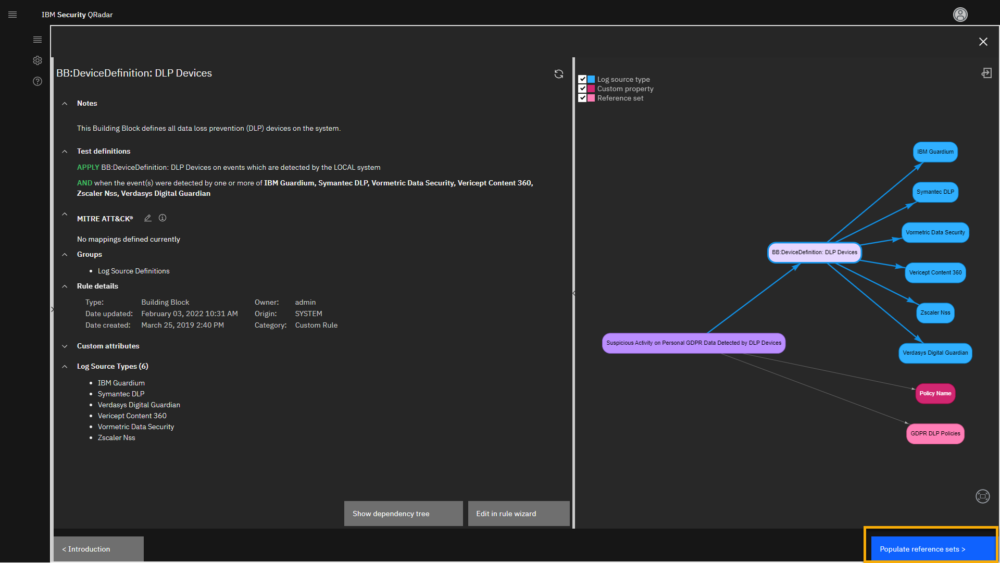

    La pantalla se centra en el conjunto de referencia. Vamos a revisarlo.

13. En el centro de la pantalla, haga clic en **GDPR DLP Policies -- AlphaNumeric**.

    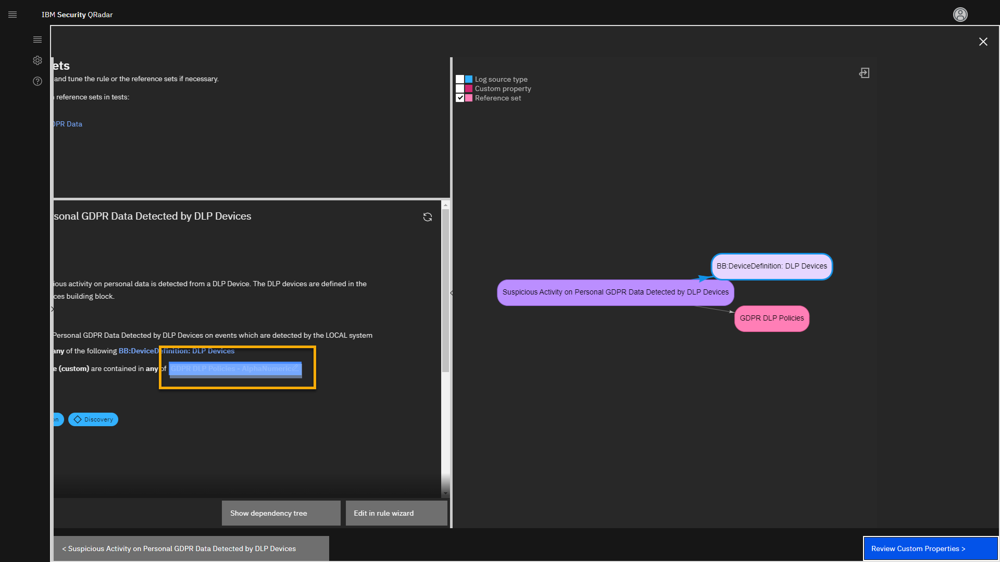

### Gestor de datos de referencia - visión general

Esta acción abre una nueva aplicación llamada **Gestión de Datos** de Referencia en una nueva pestaña del navegador. Esta app gestiona las colecciones de datos de referencia que se utilizan en las reglas (casos de uso). Estas colecciones de datos de referencia pueden ser multidimensionales, pero el tipo más utilizado es una lista simple, también conocida como conjuntos de referencia. Uno de los conjuntos de referencia son las Políticas GDPR DLP. Vemos que actualmente tiene 17 elementos, y son distintos eventos que pueden observarse en dispositivos DLP, como IBM Guardium. Si necesita ampliar su cobertura a otros eventos de DLP, añada más elementos a este conjunto de referencia.

Observe que una de las políticas listadas es la política de Guardium que analizamos anteriormente en el delito de GDPR -- _GDPR Personal Data Admin User -- Alert per match (violation) on DML and Select Commands_.

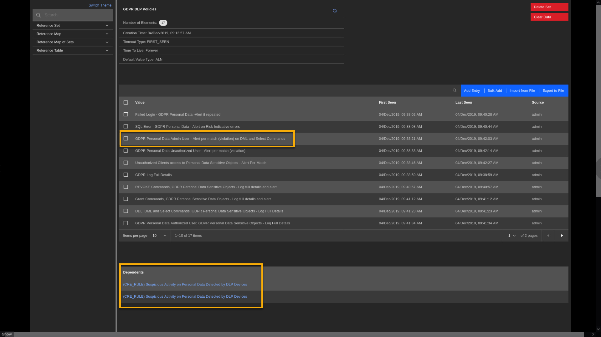

Repasemos también otro conjunto de referencias del que hemos hablado antes en la demostración: Servidores de Datos Personales. Para mayor eficacia, haga clic en el campo de búsqueda y escriba Personal.

1. En la parte izquierda de la pantalla, haga clic en **Buscar** y escriba Personal.

    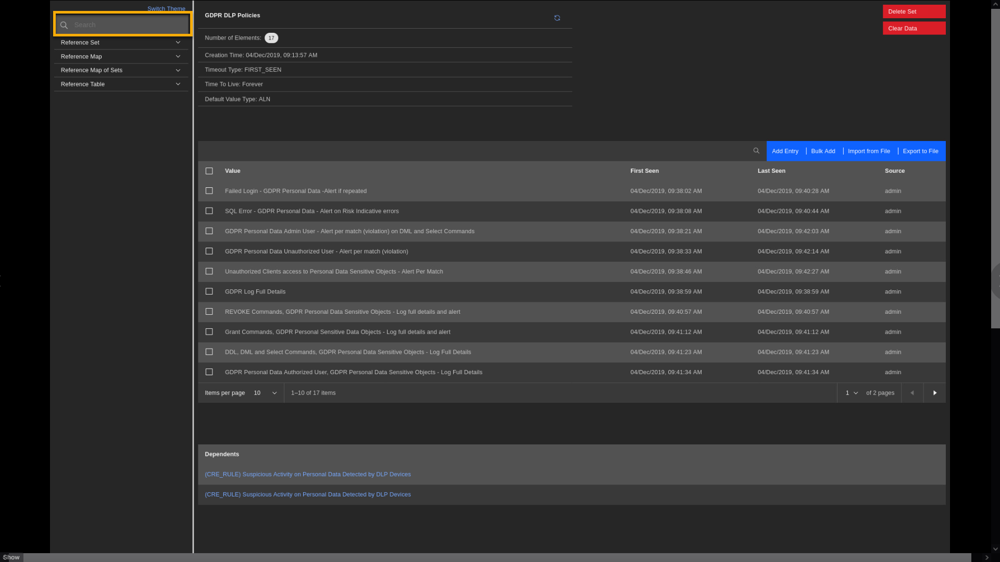

    A continuación, haga clic en el conjunto de referencia Servidor de datos personales.

2. Haga clic en **Servidor de datos** personales.

    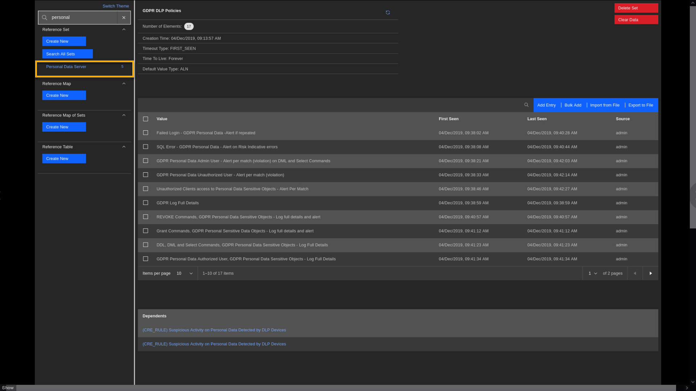

    Observe que cinco direcciones IP de la red están definidas como servidores con datos personales. Una de ellas es la IP 10.4.0.26, detectada anteriormente en la demostración. En la parte inferior de la pantalla se muestran los Dependientes en los que se utiliza este conjunto de referencia. Un lugar es el Building Block _BB: Compliance Definition: Servidores de datos_ personales. Recordatorio rápido: este es el Building Block que enlaza con la regla de actividad sospechosa que se activó en una parte anterior de la demo.

    Esto muestra la imagen de cómo las partes se unen para identificar los servidores que contienen PII.

3. Para volver a la aplicación UCM:

    - Cierre la pestaña Gestión de datos de referencia.

4. Cierre la ventana de análisis de reglas.

    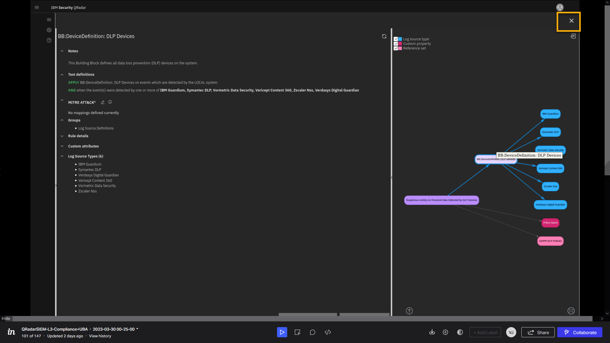

    Ahora, observemos otra potente función de UCM. Como hemos mencionado, la aplicación viene con algunos filtros precargados. Carguemos otro filtro que nos ayude a revisar **todo el contenido no instalado**.

5. Haga clic en el **icono Seleccionar plantilla**.

    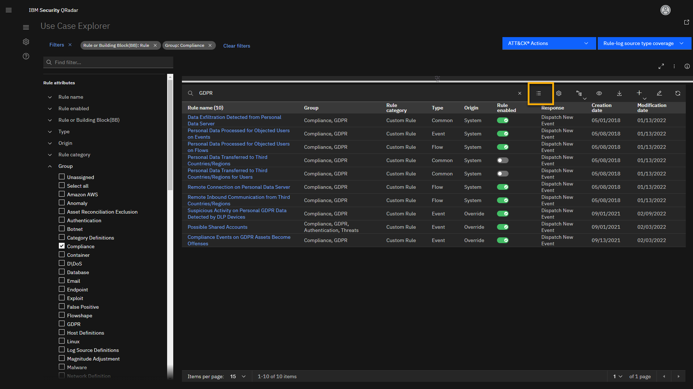

6. En la ventana emergente, **desplácese hacia abajo** y seleccione **Todos los contenidos no instalados**.

    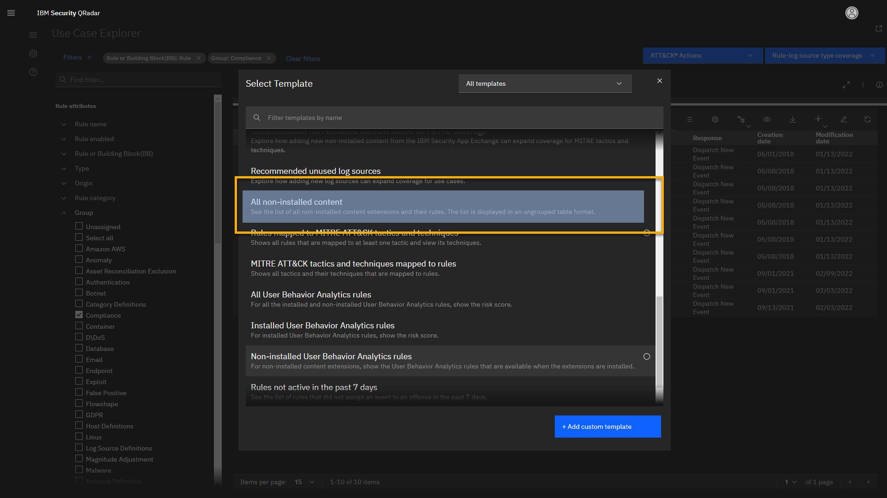

7. Revise la página cargada.

    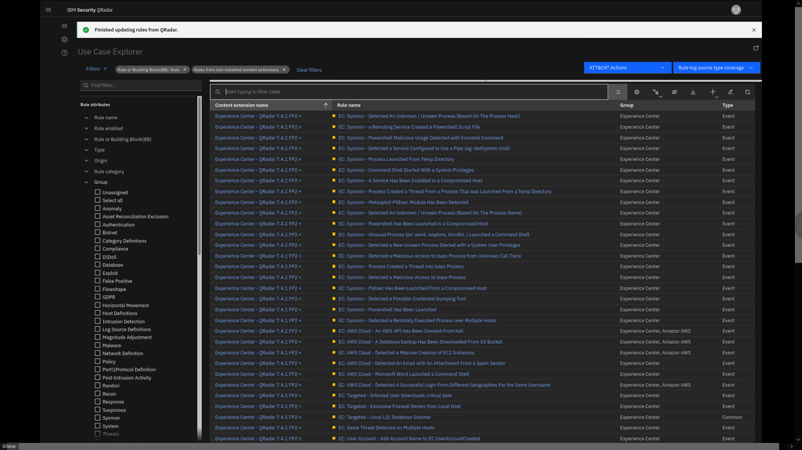

    Se carga la nueva vista. Aquí puede ver todo el contenido disponible que puede descargar de IBM App Exchange y añadir a su despliegue de QRadar SIEM. Puede reducir esta lista utilizando la barra de búsqueda. Por ejemplo, busquemos contenido sobre el cumplimiento de la norma ISO 27001.

8. Haz clic en la barra de **búsqueda** y escribe ISO.

    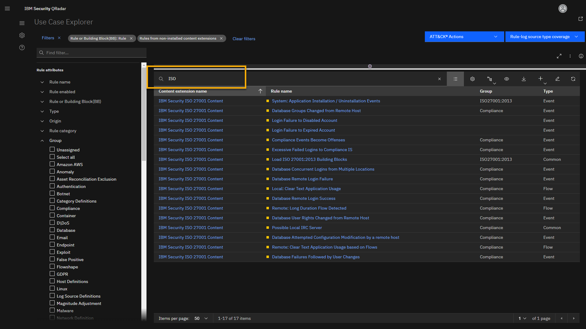

    Vemos 18 reglas diferentes que forman parte de la extensión ISO 27001 Content, que actualmente no están instaladas en su QRadar SIEM. Abramos una regla.

9. Haga clic en **Fallo de inicio de sesión en cuenta desactivada**.

    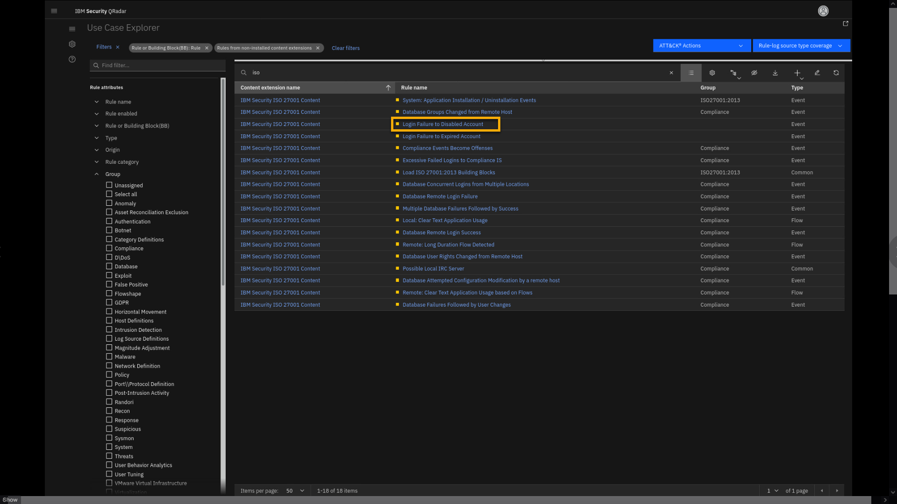

10. Revise la página de normas.

    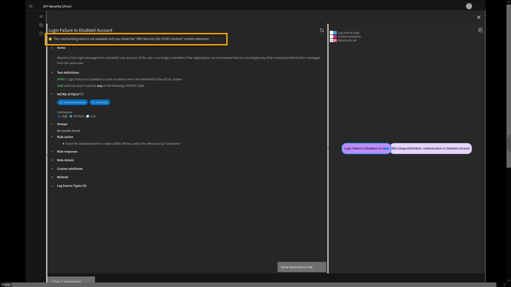

    Tenga en cuenta que la regla forma parte de la extensión _IBM Security ISO 27001 Content_, que no está instalada. Sin embargo, tenga en cuenta que aún puede analizar reglas y ver detalles y dependencias.

11. Cierra la página.

12. En la columna Nombre de extensión del contenido, haga clic en cualquier **contenido de IBM Security ISO 27001**.

    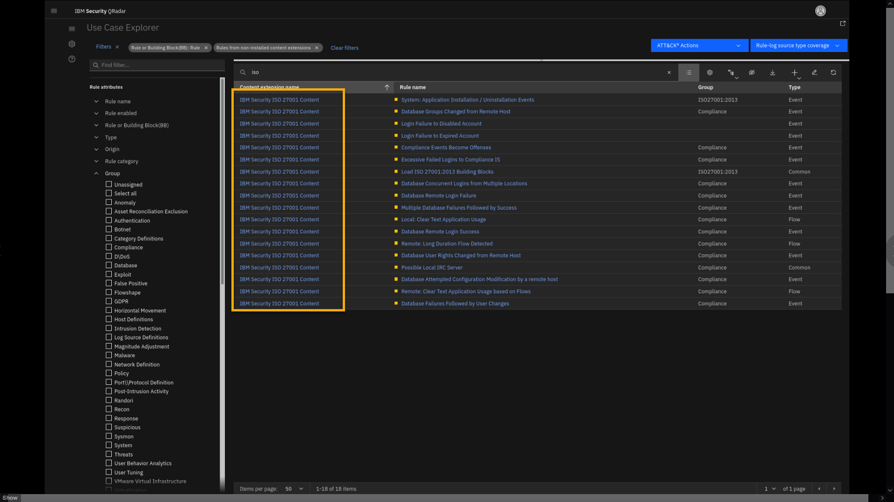

    Haga clic también en el nombre de la extensión del contenido.

13. Revise la página de la aplicación QRadar Assistant, que se abre en una nueva pestaña del navegador.

    

    > Cuando selecciona cualquier paquete de contenido dentro de la aplicación UCM, le lleva a la aplicación Asistente de QRadar. Esta aplicación está vinculada a IBM App Exchange, y si se le ha concedido el permiso administrativo adecuado en QRadar, puede instalar el paquete de contenido con un solo clic. Para este laboratorio NO instalará el paquete de contenido. Continuemos con UCM.

14. Cierra la pestaña de la aplicación Assistant y vuelve a centrarte en la aplicación UCM.

    - La aplicación Assistant se abre en una nueva pestaña del navegador. Cierra la pestaña y vuelve a centrarte en la aplicación UCM.

    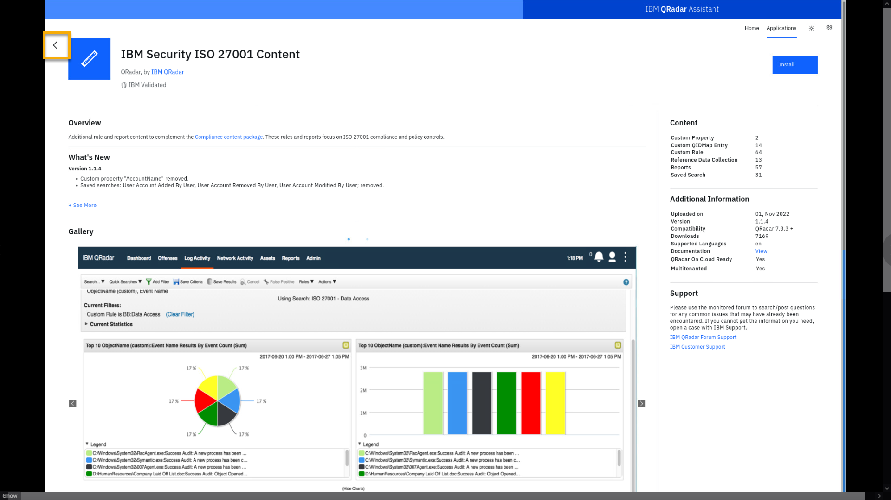

Veamos cómo puede utilizarse la aplicación UCM para revisar la cobertura ATT\&CK de MITRE.

### Demostración de cobertura de MITRE

1. Haga clic en el menú Acciones ATT\&CK, seleccione **Mapa de cobertura e informe**.

    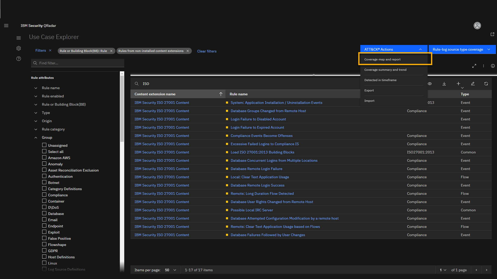

2. A continuación, cambia a pantalla completa con el icono de **pantalla completa**.

    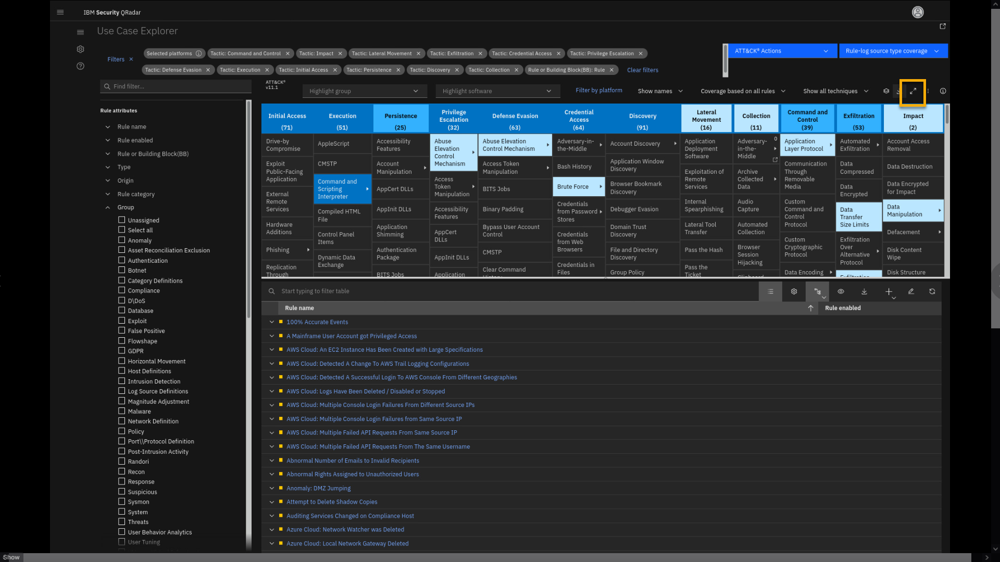

    El mapa de cobertura y la matriz de informes muestran su cobertura actual de QRadar por tácticas y técnicas. El código de color es significativo; el tono más oscuro de azul significa que la cobertura es mejor. Examinemos las técnicas Command y Scripting Interpreter.

3. Haga clic en **Intérprete de comandos y secuencias de comandos > PowerShell**.

    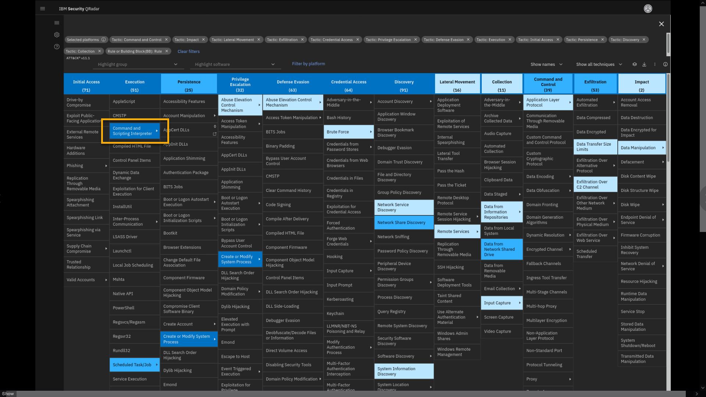

    Observe que aparece un nuevo filtro en la lista de filtros. Ahora salga de la pantalla completa y aplique los filtros.

4. Salir de la pantalla completa.

    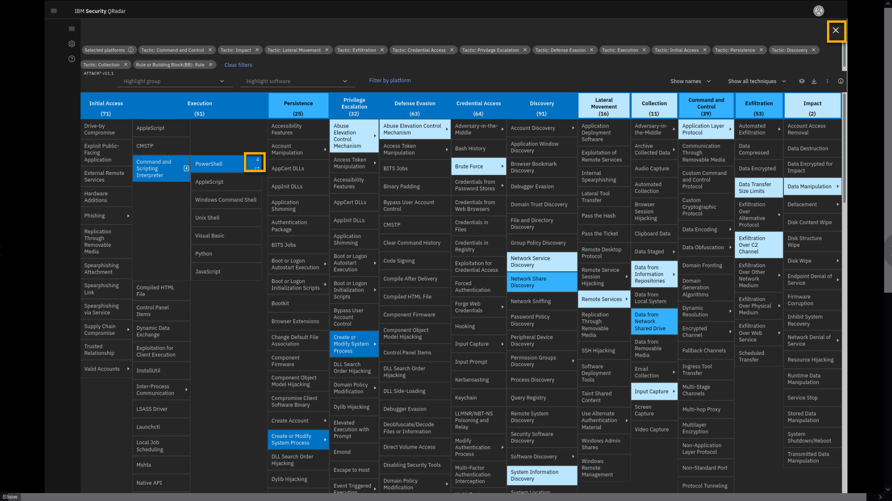

5. Haga clic en **Aplicar filtros**.

    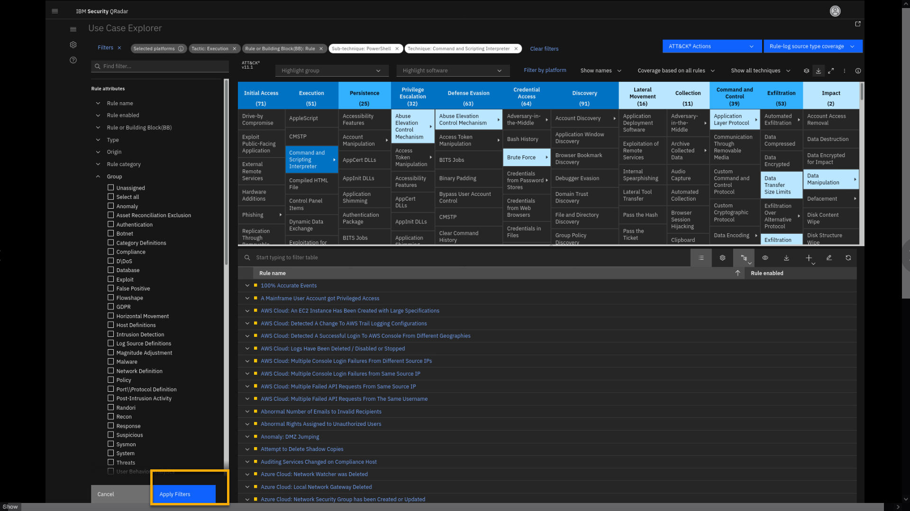

6. Revise los resultados filtrados.

    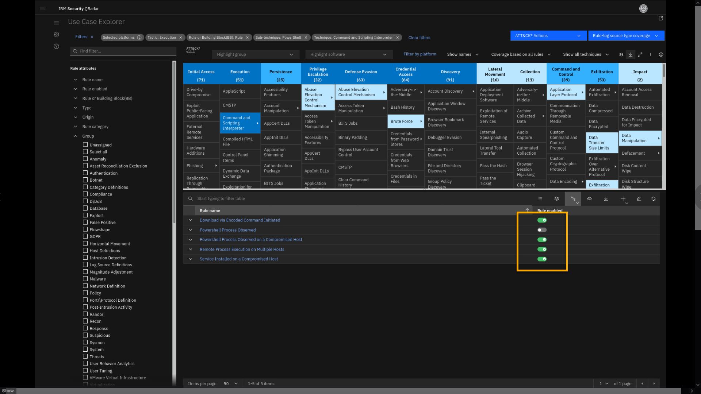

    Observe que en la tabla aparecen cargadas 5 reglas relacionadas con esta técnica. Una está desactivada y otras cuatro activadas.

    También puede utilizar los filtros MITRE para ver el uso y las tendencias de implementación del marco MITRE en su despliegue de QRadar.

7. Haga clic en el menú **Acciones ATT\&CK** y, a continuación, en **Resumen de cobertura y tendencia**.

    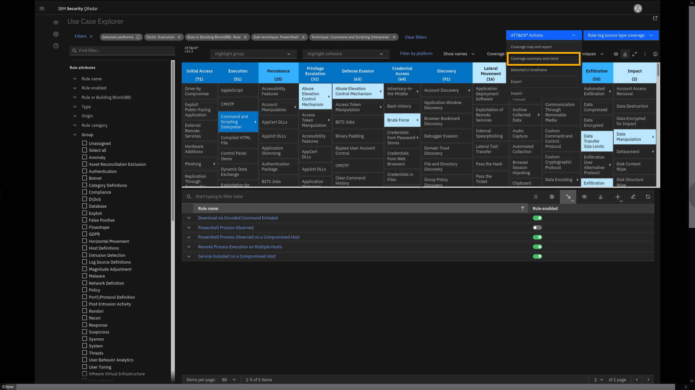

8. Consulte la página de resumen y tendencias de la cobertura.

    Los datos del Resumen de Cobertura de MITRE le ayudan a comprender dónde se encuentra con su implementación actual de QRadar en relación con las diferentes tácticas ATT\&CK de MITRE. Por ejemplo, en este despliegue de QRadar, del total de reglas instaladas, el 18% están asignadas para cubrir la táctica de Acceso Inicial.

    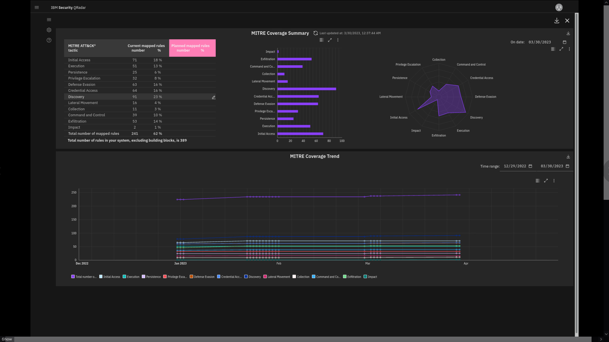

    También hay un gráfico de tendencias de cobertura de MITRE.

    Por último, queremos señalar que puede revisar la implementación de casos de uso.

9. Salir de la página de resumen.

10. Expanda la **cobertura del tipo de fuente del registro de reglas** y, a continuación, haga clic en **Cobertura actual y** potencial.

    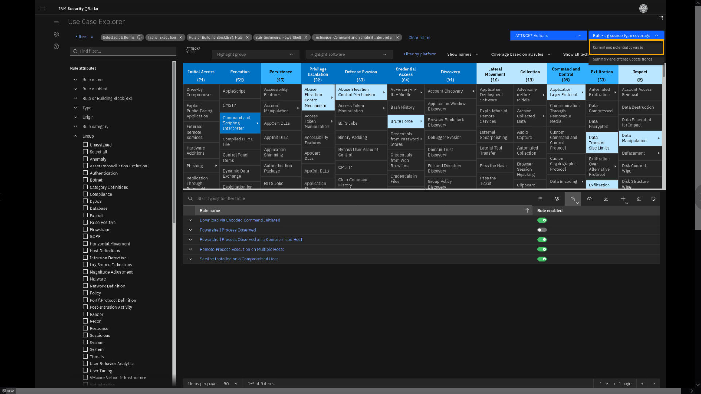

11. Revisa la página.

    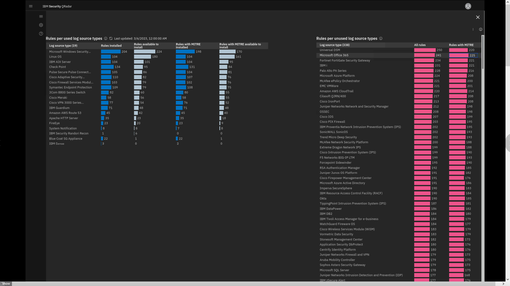

    Esta página muestra todas las reglas por fuente de registro que ha instalado y que puede instalar.

    Aquí puede ver Reglas por tipo de fuente de registro, usadas y no usadas, cuántas reglas están instaladas y cuántas más puede implementar. La lista también muestra que, por defecto, QRadar soporta casi 400 tipos de fuentes de registro. La Cobertura MITRE también está documentada.

12. Salir de la página.

    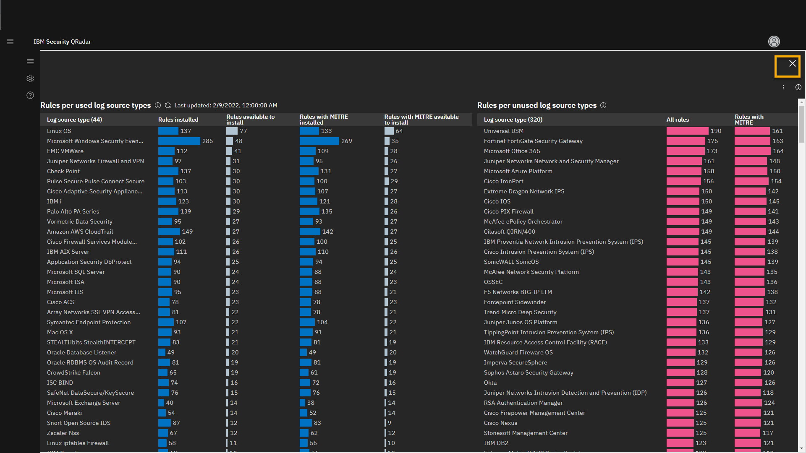

    También puede utilizar la aplicación UCM para ajustar las reglas de QRadar.

> Esta parte del laboratorio trató sobre cómo el Administrador de casos de uso, la Gestión de datos de referencia y la aplicación Asistente pueden ayudarle a analizar el contenido faltante e instalado en su implementación de QRadar SIEM. Estas aplicaciones también ayudan a entender las dependencias entre reglas, bloques de construcción y datos de referencia. Asimismo, Use Case Manager permite comprender cómo las reglas configuradas actualmente se corresponden con las tácticas y técnicas del marco ATT\&CK de MITRE.

Es hora de seguir adelante y ver cómo la aplicación UBA puede ayudar en el análisis de posibles actividades maliciosas de los usuarios.

## Análisis del comportamiento de los usuarios

> IBM QRadar User Behavior Analytics (UBA) analiza la actividad de los usuarios para detectar intrusos malintencionados y determinar si las credenciales de un usuario están en peligro. Los analistas de seguridad pueden detectar rápidamente a los usuarios de riesgo, ver sus actividades anómalas y profundizar en los datos de registro y flujo subyacentes que han contribuido a la puntuación de riesgo de un usuario.
>
> Como componente integrado de la Plataforma de Inteligencia de Seguridad QRadar, UBA aprovecha las reglas de comportamiento predeterminadas y los modelos de aprendizaje automático (ML) para añadir contexto de usuario a los datos de red, registro, vulnerabilidad y amenazas para detectar ataques con mayor rapidez y precisión.
>
> El análisis del comportamiento de los usuarios proporciona información para garantizar que solo tienen acceso a la información personal aquellos que lo necesitan, y se alertará de cualquier otra actividad, detectando intentos no autorizados. Los requisitos de notificación de violaciones son de los más notables del RGPD. En caso de una posible violación de datos que afecte a información personal, una organización debe notificarlo a la Autoridad de Protección de Datos en un plazo de 72 horas tras tener conocimiento de la violación, lo que hace que las infracciones y sus perspectivas, como las que se muestran a continuación, sean cruciales para la investigación.

Comenzaremos abriendo la interfaz UBA.

1. Haga clic en el **Menú** principal y seleccione **Análisis de usuarios**.

    

2. Proporcionar una visión general de la página principal de la UBA.

    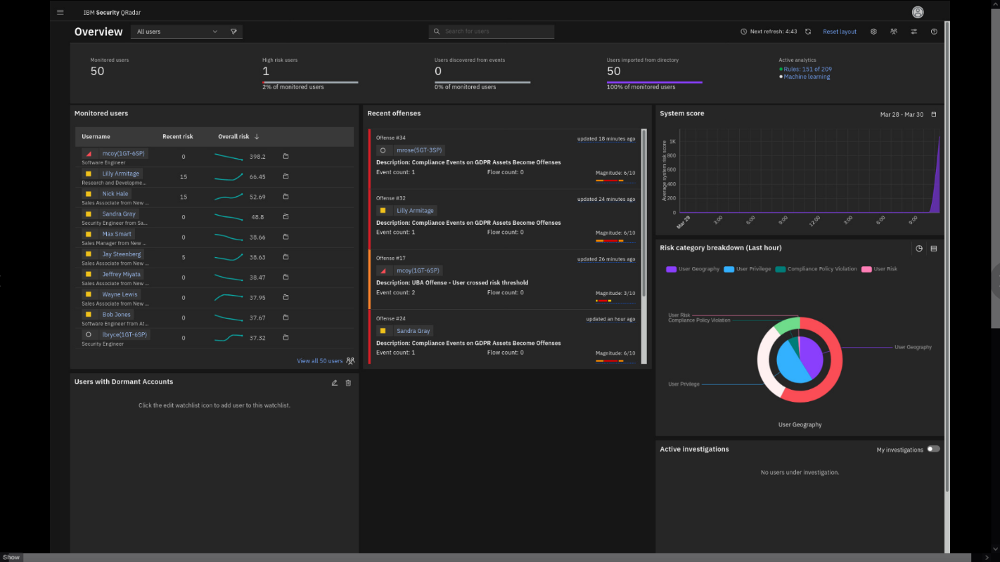}

    Esto carga el panel de control de la aplicación Análisis del Comportamiento del Usuario. En la parte superior de la página Descripción general, dispone de algunas estadísticas sobre los usuarios: cuántos usuarios se supervisan, si se importan de un directorio LDAP o si se descubren a través del análisis de registros y flujos.

    El widget **Usuarios supervis** ados le ayuda a comprender las tendencias de los usuarios supervisados. Puede ver la puntuación de riesgo actual del usuario, así como la tendencia general del riesgo. ¿Está subiendo o bajando el riesgo? En la sección central, se muestran las **infracciones recientes** relacionadas con la actividad del usuario. Vemos que el usuario mcoy previamente observado en la infracción analizada anteriormente sobre actividad sospechosa en el activo GDPR está en o cerca de la parte superior de la lista monitorizada.

    La parte derecha de la pantalla Resumen contiene algunos datos gráficos: puntuación global del riesgo (puntuación del sistema) y desglose por categoría de riesgo. Vemos que la mayoría de los problemas están relacionados con los privilegios de los usuarios y los problemas de acceso geográfico de los usuarios. Pase el ratón por encima de algunas partes del gráfico de desglose de categorías de riesgo para examinar algunos de los detalles.

    Debido a que el usuario mcoy está marcado con un triángulo rojo y es reportado como un usuario de alto riesgo con altos puntos de calificación, usted actuando como analista revisará al usuario mcoy con más detalle.

3. En la lista Usuarios supervisados, haga clic en **mcoy**.

    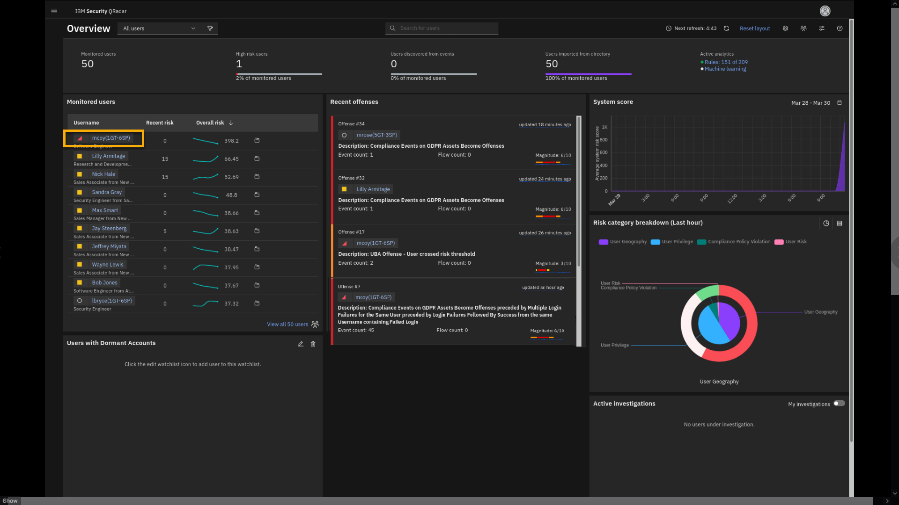

4. Haga clic en **Ver detalles del usuario**.

    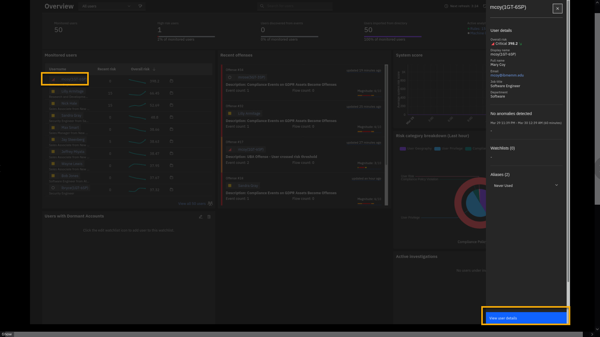

    El panel de detalles del usuario muestra una puntuación de riesgo global de 398,2, y la tendencia es a la baja. La tendencia a la baja significa que la actividad actual del usuario está disminuyendo.

    **Nota**: La puntuación de riesgo es dinámica, y tendrá un número diferente en su demostración en vivo.

5. Haga clic en **Ver detalles del usuario**.

    Esto carga una nueva página, dando información sobre las actividades de Mary Coy. Como empezamos a analizar al usuario, puedes marcar mcoy.

6. Para marcar al usuario bajo investigación, haga clic en la **bandera**.

    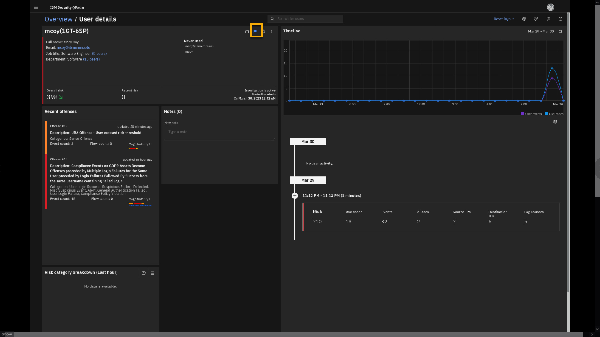

    Revise la información que aparece en pantalla.

    La parte superior describe el usuario, los alias y la puntuación de riesgo.

    La parte de infracciones recientes muestra las infracciones relacionadas con la actividad de este usuario.

    El gráfico cronológico muestra la actividad registrada de los usuarios y la tendencia general.

    La sección inferior derecha también proporciona información para la investigación del usuario. Muestra la puntuación de riesgo acumulada en el periodo de actividad y los casos de uso relacionados con ese tiempo. Examinémoslo con más detalle.

7. En el informe de actividad, haga clic en **Casos de uso**.

    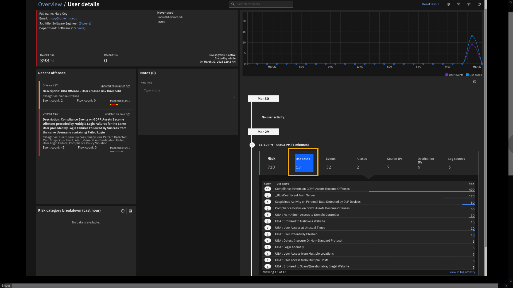

    UBA informa sobre 13 reglas (casos de uso) que contribuyeron a la puntuación de riesgo UBA y la cantidad de riesgo acumulado por caso de uso.

    También puede revisar los eventos relevantes que contribuyeron a los casos de uso.

8. Haga clic en **Eventos**.

    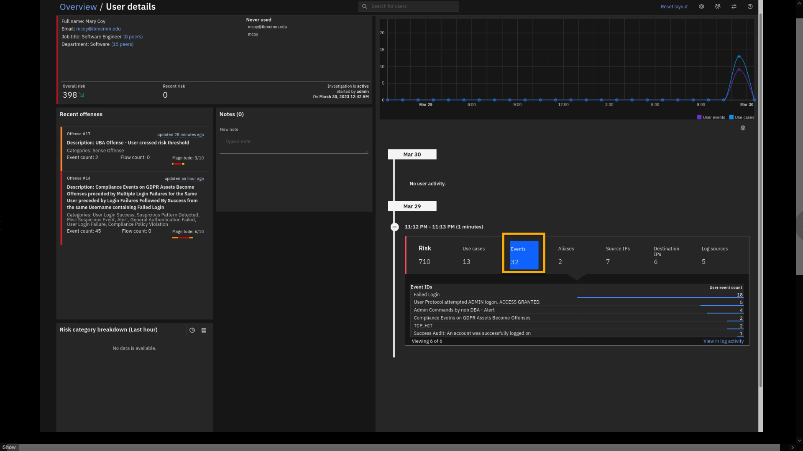

    Aquí puede ver el evento de Guardium "Admin Commands by non DBA -- Alert". Ya vimos ese evento como parte del delito GDPR. También vemos algunos otros eventos que se reportan como actividad mcoy.

9. Haz clic en **Alias**.

    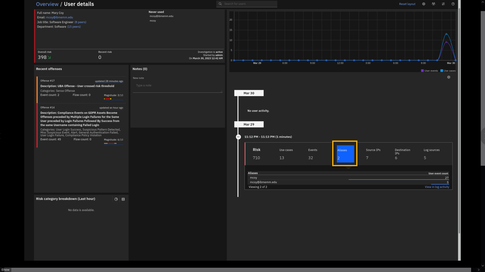

    La vista de alias muestra todas las variaciones de cuentas en los registros asociadas a un mismo usuario. En otras palabras, la actividad del usuario en algunos sistemas puede ser rastreada por la dirección de correo electrónico, y en otros, puede ser el ID de inicio de sesión de Windows, el ID de usuario de Linux®, u otros. Todas esas cuentas diferentes están asociadas a una única persona de usuario y contribuyen a la puntuación de riesgo global.

    La IP de origen y destino muestra todas las direcciones IP que participan en la actividad del usuario.

10. Haz clic en **Fuentes de registro**.

    

    Las fuentes de registro también muestran el aspecto convincente del análisis de usuarios. Esta vista muestra las fuentes de registro que han informado de actividad del usuario. Por ejemplo, el usuario mcoy ha informado de actividad en la puerta de enlace VPN. Veamos los eventos asociados a esta fuente de registro y al usuario mcoy.

11. Haga clic en **Puerta de enlace VPN**.

    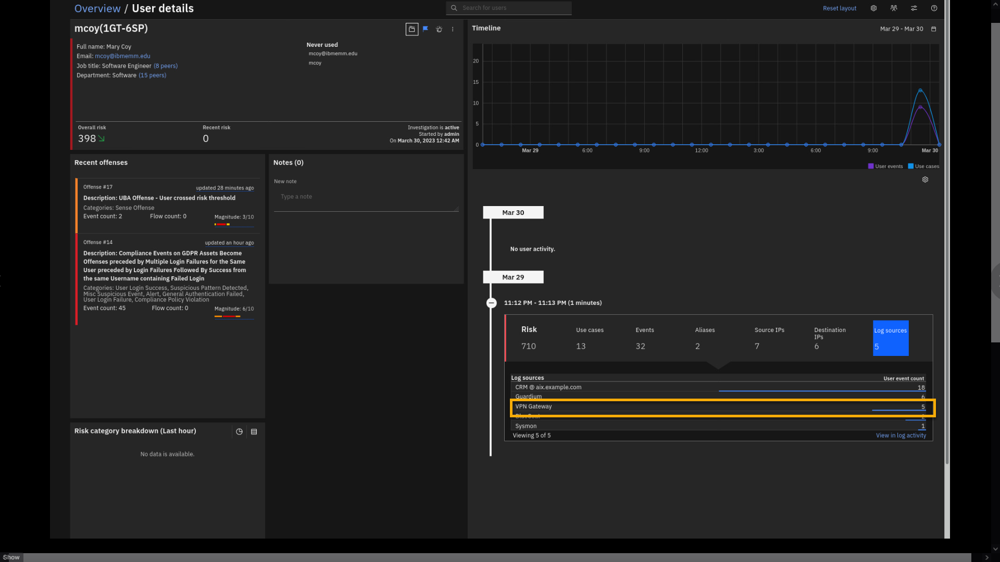

12. Revise los eventos de registro relacionados con VPN.

    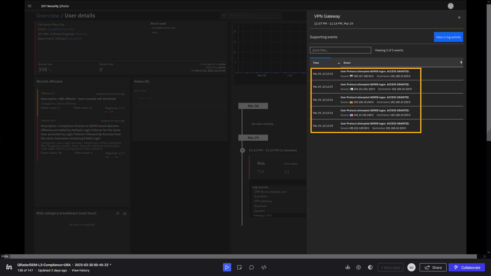

    En esta vista, vemos desde qué países se ha autenticado el usuario mcoy en la pasarela VPN. Veamos los registros de Guardium.

13. Cierre los eventos de **la puerta de enlace VPN**.

14. En Fuentes de registro, haga clic en **Guardium**.

    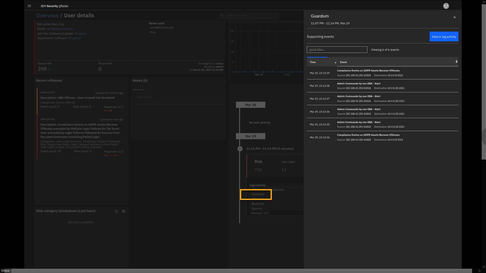

    Ahora, vemos los eventos reportados por Guardium indicando actividad mcoy en la base de datos que se encuentra en las direcciones IP 10.4.0.8 y 10.4.0.26.

15. Cierra los eventos de **Guardium**.

    Veamos también qué actividad de usuario se registra en el dispositivo proxy BlueCoat.

16. Haga clic en los registros de **BlueCoat**.

    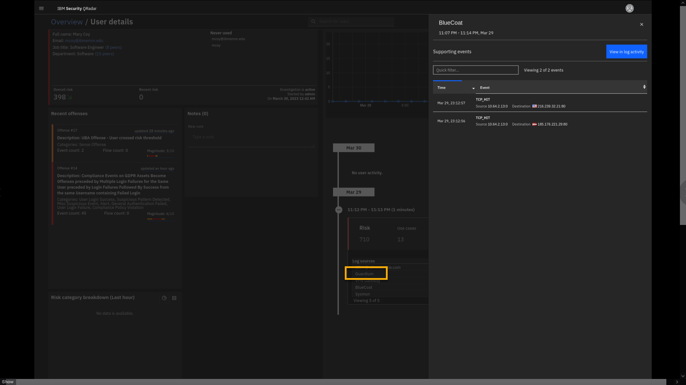

    Sin entrar en muchos detalles, fíjate en las direcciones IP remotas a las que accede mcoy.

17. Cierre la ventana de eventos de BlueCoat.

    Ahora, queremos mostrar el poder de las listas de vigilancia en la UBA.

    Puede crear una lista de vigilancia para supervisar y manipular con la puntuación de riesgo de comportamiento del usuario basada en diferentes atributos.

18. En el widget de resumen de cuenta de mcoy, haz clic en el icono de **la lista de vigilancia**.

    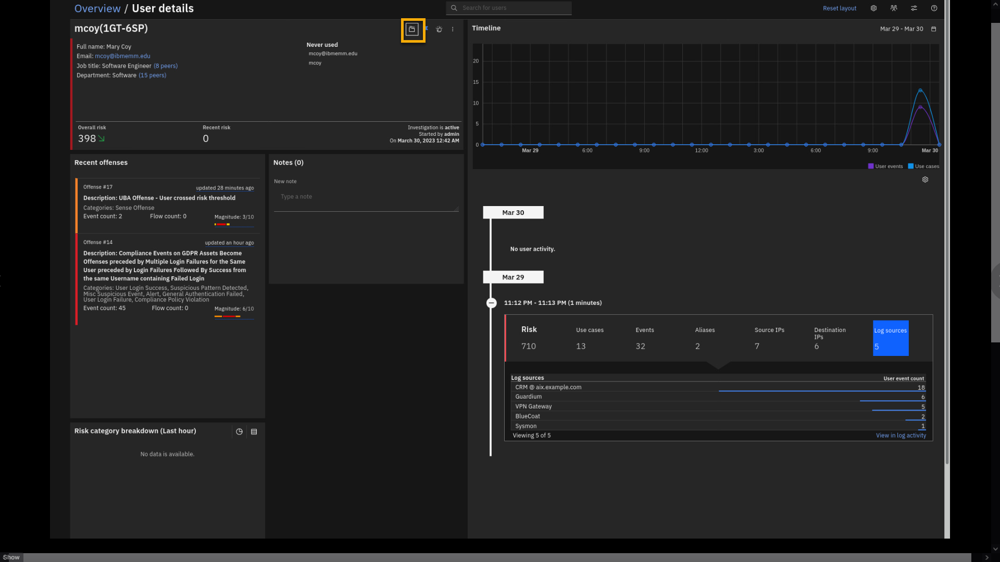

19. Haga clic en **Crear nueva lista de vigilancia**.

    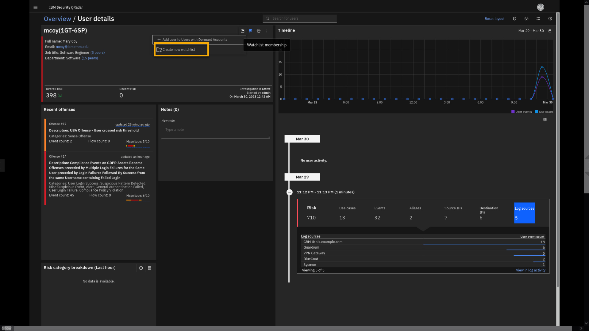

20. En la ventana Crear una lista de seguimiento, haga clic en el campo **Nombre** y escriba Usuarios críticos.

    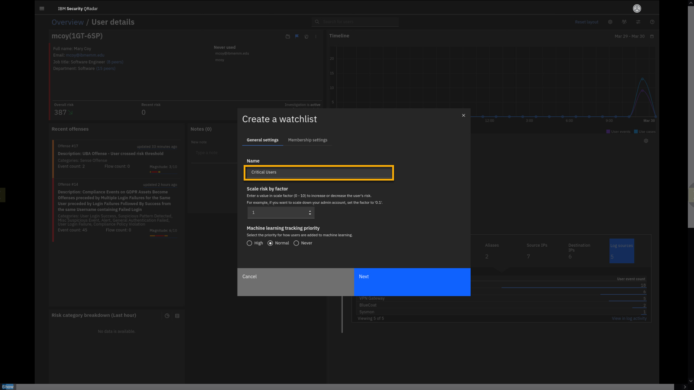

    La lista de vigilancia le ayuda a afinar la puntuación de riesgo. Por ejemplo, para los usuarios de la lista de usuarios críticos, la puntuación del riesgo de comportamiento debe ser dos veces mayor que para un usuario normal. Otro ejemplo pueden ser las cuentas con privilegios de administrador o las cuentas ejecutivas que son objeto de ataques de whaling (phishing).

21. Haga clic en el campo **Escala de riesgo por factor** y escriba 2.

    Tenga en cuenta que si el factor de puntuación de riesgo está entre cero y uno, la puntuación de riesgo global de los miembros de la lista de vigilancia disminuirá.

    Seleccionemos los miembros de esta lista de vigilancia.

22. Haga clic en **Configuración de la afiliación**.

    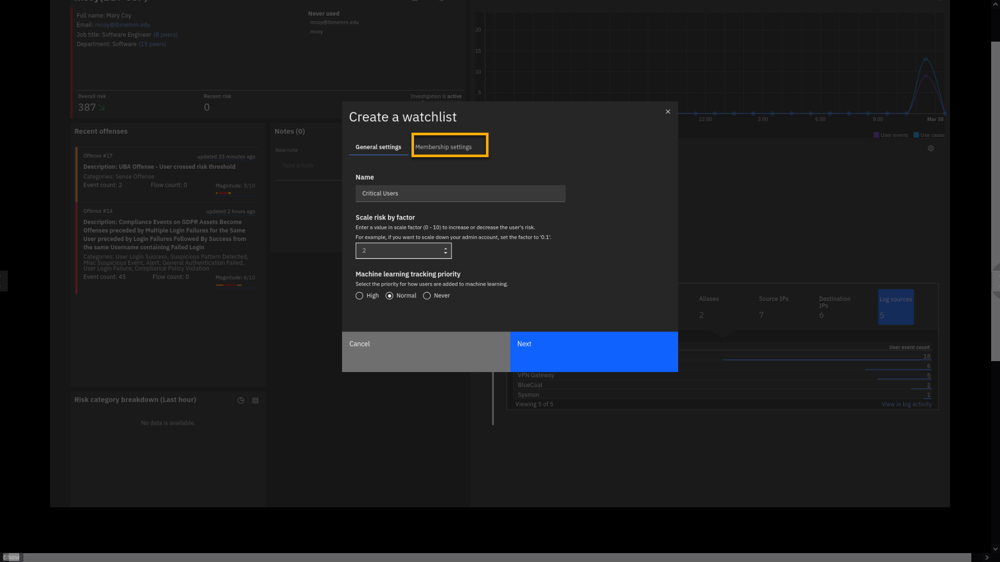

23. Revise la página de afiliación.

    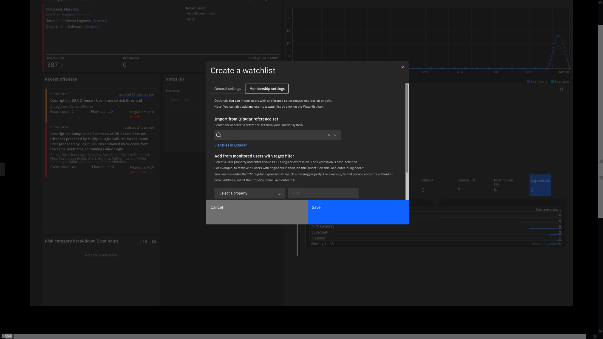

    En esta página, puede crear la regla para definir la pertenencia de los usuarios a la lista de vigilancia utilizando diferentes propiedades y expresiones regulares para hacerlas coincidir. Además, puede elegir la lista de referencia que contiene las cuentas de usuario que le interesa supervisar.

24. Haga clic en el campo **Conjunto de referencia** y escriba UBA.

    **Nota**: Si la búsqueda no arroja ningún resultado, desplácese manualmente por la lista para realizar su selección.

25. Seleccione el conjunto de referencias **UBA : Usuarios ejecutivos**.

    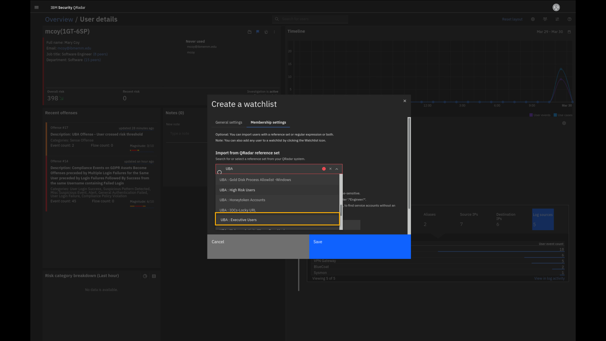

    Vemos que el conjunto de referencia tiene cero entradas. Pero, si la cuenta se añade a este conjunto de referencia, la puntuación de riesgo acumulará el doble de puntos por la actividad de ese usuario. La acción está definiendo a ese usuario como "arriesgado", elevando la puntuación de riesgo del usuario al primer puesto de la lista, y aumentando la atención del analista de seguridad para priorizar la investigación de la actividad de ese usuario.

Con esto se pone fin a la demostración.

## Resumen

Este laboratorio y demostración revisó cómo los analistas de seguridad usando la Consola QRadar y diferentes tableros pueden revisar actividades relevantes a la seguridad en la red de la organización. Usamos la interfaz Analyst Workflow (también llamada New UI) para analizar infracciones. Analizamos en profundidad una infracción relacionada con el GDPR. Revisamos los detalles de la infracción y los eventos relacionados con ella.

Luego aprendió cómo Use Case Manager puede ayudar a analizar el impacto de las reglas instaladas y no instaladas y su relación con el marco MITRE ATT\&CK. También tocamos algunos puntos sobre la app Reference Data Management y la app Assistant.

Por último, analizamos el comportamiento de los usuarios relacionado con una probable infracción del GDPR.
