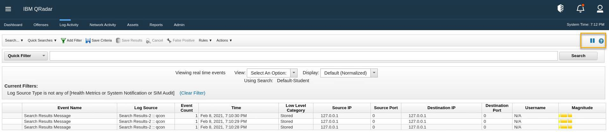
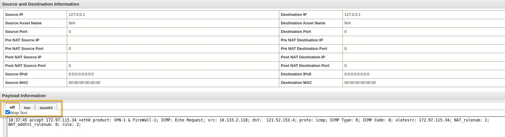
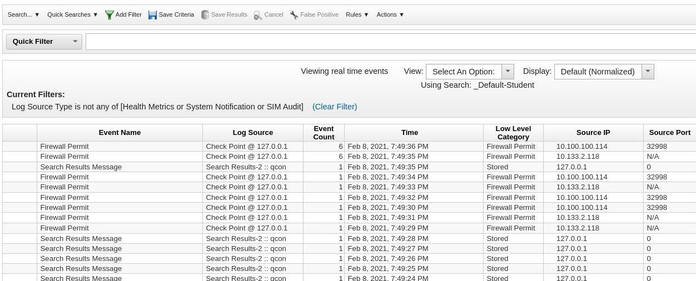
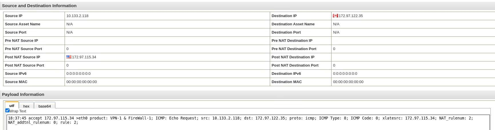
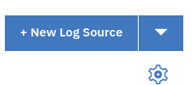
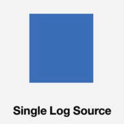
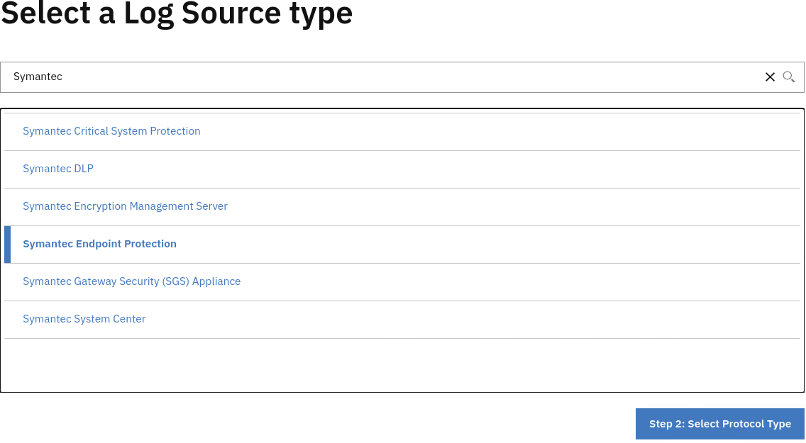
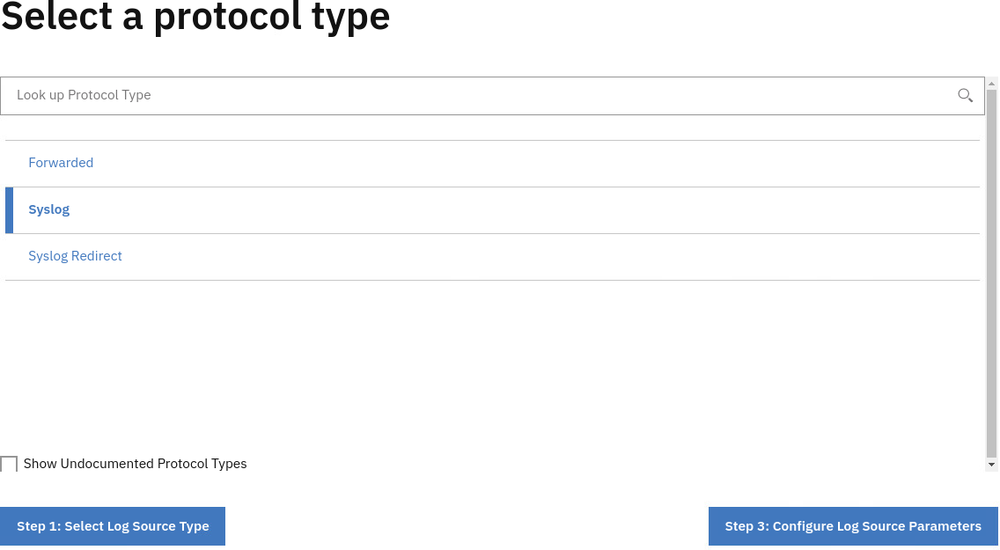

# Fuentes de registro

## Introducción

Las funciones principales de IBM QRadar SIEM son gestionar la seguridad de la red mediante la supervisión de flujos y eventos.

Una diferencia significativa entre los datos de eventos y de flujo es que un evento, que normalmente es un registro de una acción específica como el inicio de sesión de un usuario, o una conexión VPN, ocurre en un momento específico y el evento se registra en ese momento. Un flujo es un registro de actividad de red que puede durar segundos, minutos, horas o días, dependiendo de la actividad dentro de la sesión. Por ejemplo, una petición web puede descargar varios archivos como imágenes, anuncios, vídeo, y durar entre 5 y 10 segundos, o un usuario que ve una película de Netflix puede estar en una sesión de red que dure hasta unas horas. El flujo es un registro de la actividad de red entre dos hosts.

### Eventos

QRadar acepta registros de eventos de fuentes de registro que están en su red. Una fuente de registro es una fuente de datos como un cortafuegos o un sistema de protección contra intrusiones (IPS) que crea un registro de eventos.

QRadar acepta eventos de fuentes de registro usando protocolos como syslog, syslog-tcp, y SNMP. QRadar también puede configurar conexiones salientes para recuperar eventos usando protocolos como SCP, SFTP, FTP, JDBC, Check Point OPSEC, y SMB/CIFS.

Si QRadar nunca ha recibido eventos de una fuente de registro, los nuevos eventos son listados con una Categoría de Bajo Nivel de "Desconocido" en la pestaña de Actividad de Registro. QRadar puede autodescubrir muchas fuentes de registro, y después de una cierta cantidad de tiempo (o eventos de registro procesados), QRadar asignará apropiadamente la fuente de registro correcta. A veces, sin embargo, QRadar no puede averiguar la fuente de registro correcta detrás de los datos recolectados, y esos eventos muestran una Categoría de Bajo Nivel de "Almacenado".

En este laboratorio, usted configura QRadar para reconocer un evento desconocido. Extraerá propiedades adicionales de la carga útil del evento sin procesar. Utilizará la aplicación Log Source Management (LSM) para configurar y gestionar fuentes de registro individuales y masivas. También probará una nueva fuente de registro.

## Análisis de un suceso desconocido

En este ejercicio, analizará un evento recibido de una fuente de registro desconocida. Cuando es procesado por el canal de eventos, este tipo de evento es etiquetado como CONOCIDO. Cuando se detectan eventos para un tipo de fuente de registro incorrecto, se les asigna la categoría de bajo nivel ALMACENADO. Una vez analizados, puede decidir qué nuevas fuentes de registro necesita crear.

Para simular el envío de las fuentes de registro a QRadar, inicie sesión en la consola de QRadar mediante el terminal SSH y ejecute un script.

> Si está utilizando la VPN Wireguard configurada en **101: Configuración de demostración de QRadar** para acceder al entorno de demostración, podrá realizar las siguientes actividades desde su estación de trabajo. Si no ha configurado el acceso VPN puede realizar las actividades desde el servidor de salto.

1.  Abra el navegador y acceda a la Consola en la siguiente URL:

    ```bash
    https://172.16.60.10
    ```

2.  Inicie sesión con la cuenta de administrador y la contraseña "Q1d3m0.Demo".

3.  Para cargar los filtros de búsqueda predeterminados, haga doble clic en la pestaña **Actividad de registro**.

    > Estos ejercicios clásicos QRadar UI y no el Nuevo QRadar UI.
    >
    > Si necesita volver a la interfaz de usuario clásica, vaya a la URL: [https://172.16.60.10.](https://172.16.60.10)

4.  NO cierre el navegador. Mientras el navegador espera para mostrar los eventos en tiempo real, abra el terminal SSH e inicie sesión en QRadar como root mediante el siguiente comando:

    ```bash
    ssh root@172.16.60.10
    ```

5.  En el indicador de contraseña, escriba "Q1d3m0".

6.  Para generar eventos, escriba los siguientes comandos:

    ```bash
    cd /labfiles/extended/labfiles/logsources
    ```

    ```bash
    /opt/qradar/bin/logrun.pl -f checkpoint1.syslog 1
    ```

    > El directorio /labfiles/extended/labfiles fue subido al servidor QRadar en los ejercicios **103: Configuración Avanzada de Laboratorio**.

7.  Vuelva a la ventana del navegador.

    > **Nota:** La Consola detectó tres eventos con la Categoría de Bajo Nivel ALMACENADO. Debido a que usamos el contexto localhost para estos eventos (127.0.0.1), el Nombre del Evento puede variar. En las capturas de pantalla de abajo se ve un Nombre de Evento de "Mensaje de Resultados de Búsqueda", pero también puede ser "Motor de Detección de Anomalías" u otros.

8.  Para abrir cualquiera de los eventos, haga clic en el icono de **pausa** situado en la parte superior derecha de la Consola. Esta acción pausa la captura de eventos en tiempo real.

9.  Para revisar los detalles del evento, haga doble clic en cualquiera de los tres eventos.

    

10. En la página Detalles del evento, desplácese hasta la sección Información de la carga útil y haga clic en **Ajustar texto**.

    

11. Analice la carga útil sin procesar y observe que las direcciones IP de origen y destino no se analizan correctamente comparando las direcciones con las que aparecen en la sección Información de origen y destino.

En este punto, usted concluye que QRadar no procesó correctamente este evento. Puede determinar la fuente del registro generado y crear una fuente de registro adecuada. Además, en muchas ocasiones, si QRadar recibe suficientes eventos de registro para procesar, puede autodescubrir la fuente de registro y decidir la fuente de registro que mejor coincida con los eventos.

## Visualización de fuentes de registro autodescubiertas

QRadar autodescubre muchas fuentes de registro después de recibir varios registros de un tipo específico. No necesita configurar la fuente de registro para que QRadar reconozca los eventos de esa fuente de registro. En este ejercicio, analizará una fuente de registro autodescubierta.

1.  Empiece por la Consola. Para cargar los filtros de búsqueda predeterminados, haga doble clic en la pestaña **Actividad de registro**.

2.  A continuación, en el terminal SSH de QRadar, ejecute el siguiente script desde el directorio /labfiles/extended/labfiles/logsources:

    ```bash
    /opt/qradar/bin/logrun.pl -f checkpoint.syslog 10
    ```

3.  Vuelva a la ventana del navegador y observe los eventos que se muestran en la Consola.

4.  Transcurridos unos 30 segundos, observará que la columna Event Name comienza a mostrar Firewall Permit, el LogSource se denomina Check Point y Low Level Category se actualiza a Firewall Permit.

    

5.  Para pausar los eventos en tiempo real, en la parte superior derecha de la Consola, haga clic en el icono de **pausa**.

6.  Haga doble clic en cualquier evento **Firewall Permit** y observe que la IP de origen y la IP de destino analizadas coinciden con las direcciones IP de la carga útil sin procesar.

    

    Usted aprendió que QRadar puede autodescubrir algunos registros después de recibir algunos eventos. Sin embargo, no todos los registros son autodescubiertos, y para estos, usted debe crear fuentes de registro manualmente usando la aplicación Log Source Management. Si no quiere perder parte de la información de los primeros eventos mientras espera a que QRadar los analice, también puede utilizar este método para las fuentes de registro autodescubiertas.

## Utilice la aplicación Log Source Management para configurar una fuente de registro

En este ejercicio, configurará un origen de registro de Symantec Endpoint Protection y analizará los eventos de este origen de registro. Para configurar un origen de registro, debe utilizar la aplicación Log Source Management (LSM).

1.  Desde el navegador, vaya a la Admin Console.

2.  En Admin Console, desplácese hasta la sección Apps y haga clic en **QRadar Log Source Management**.

3.  En la aplicación LSM, haga clic en **Fuentes de registro.**

4.  En el panel de control de la aplicación LSM, en la parte superior derecha de la ventana, haga clic en **Nueva fuente de registro**.

    

5.  Haga clic en **Fuente de registro única**.

    

    > Deténgase y navegue a través de la larga lista de fuentes de registro disponibles. Esto le muestra todas las fuentes de registro con las que QRadar puede integrarse.

6.  En el paso Seleccionar un tipo de origen de registro, en el campo **Buscar tipo de origen de registro**, escriba "Symantec".

    

7.  En la lista, seleccione **Symantec Endpoint Protection**.

8.  Haga clic en **Paso 2: Seleccionar tipo de protocolo**.

9.  En el paso Seleccionar tipo de protocolo, confirme que **Syslog** está resaltado.

    

10. Haga clic en **Paso 3: Configurar parámetros de origen de registro**.

11. En el paso Configurar parámetros de origen de registro, complete los parámetros utilizando la siguiente tabla.

    | **Parámetro**        | **Valor**                                |
    | -------------------- | ---------------------------------------- |
    | Nombre               | Protección de endpoints                  |
    | Descripción          | Protección de puntos finales de Symantec |
    | Eventos coalescentes | OFF (desactivado)                        |

12. Haga clic en **Paso 4: Configurar parámetros de protocolo**.

13. En el campo **Identificador de origen de registro**, escriba \<provided de instancia de QRadar proporcionada>..

14. Haga clic en **Finalizar**.

15. Cierre la aplicación **Log Source Management**.

16. En Admin Console, aparece el mensaje "Hay cambios sin desplegar". Haga clic en **Desplegar cambios**.

> **Sugerencia:** La implementación de cambios en el entorno de laboratorio puede tardar entre 1 y 2 minutos.

Ha creado manualmente un nuevo origen de registro que utiliza el protocolo syslog. Después de crear una nueva fuente de registro, debe implementar los cambios en la Consola.

## Resumen

Esta ha sido una introducción muy rápida a las fuentes de registro de QRadar. Usted ha visto

- Cómo ver el flujo de registro sin procesar de QRadar
- Cómo analizar un evento que hace de una fuente no reconocida
- Cómo configurar una fuente de registro

Para ver las aplicaciones que proporcionan fuentes de registro para QRadar, visite X-Force App Exchange en: [https://exchange.xforce.ibmcloud.com/hub?br=QRadar\&con=CO31\&ippc=64\&ippr=64.](https://exchange.xforce.ibmcloud.com/hub?br=QRadar&con=CO31&ippc=64&ippr=64)
