# 101: Introduction, data sources, and automatic investigation

<QuizAlert text='Heads Up! Quiz material will be flagged like this!' />

## Create a case

First, let's log in to the system and create a case that can be used for the lab. Each person must create their own case and remember the Case ID to be used in future steps.

1. If not already, access the XDR Connect using the following SaaS URL: https://ibm.biz/QR-XDR-4-CTP
2. Choose **Enterprise SAML** as the authentication method.

   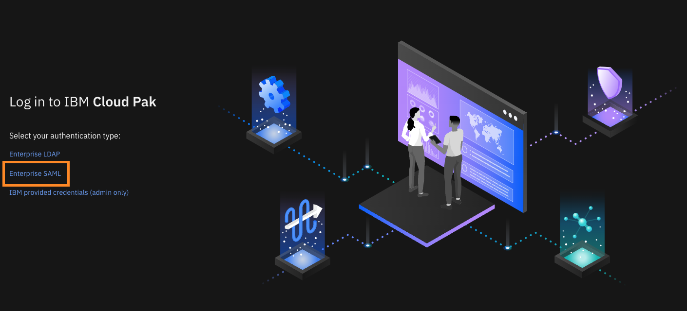

3. Choose the **Sign in with IBMid** link.

   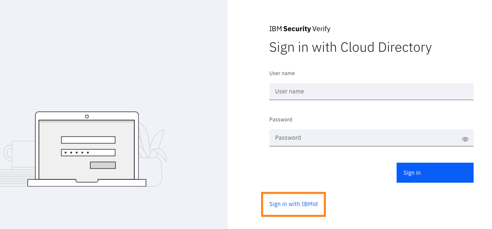

4. After you enter your IBMid login credentials, to start the demonstration, select the 30X_XDR account from the top right menu.
5. From the My applications menu, click **Case Management**.

6. Click Create case.

   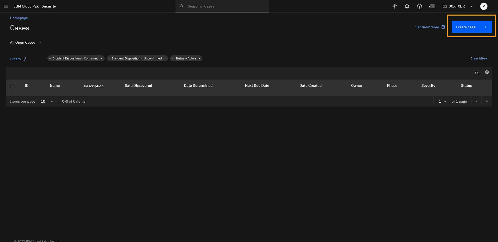

7. For the case name type any word. It will be overridden by a stock value using a playbook.
8. Click **Next**.

   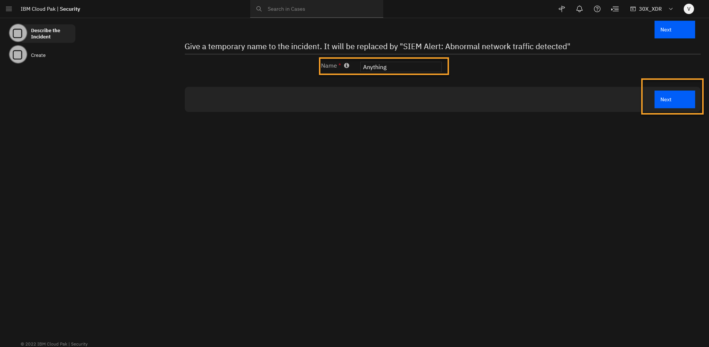

9. Click Create Incident.

   **Note**: In the background the playbook workflow overwrites the case name into the name used for the demo. It also adds two artifacts and assign the case to the Tier1 Analysts.

   Upon creation you will land on the overview page of your newly created case. Using the URL you can determine your case ID that will be needed in future lab steps.

   

   An example URL is with case ID '18001' is `https://deployment-9pnitj.test.cloudpak.security.ibm.com/app/respond/#cases/18001`

   You may also find the case ID on the 'Details' tab of the newly created Case.

   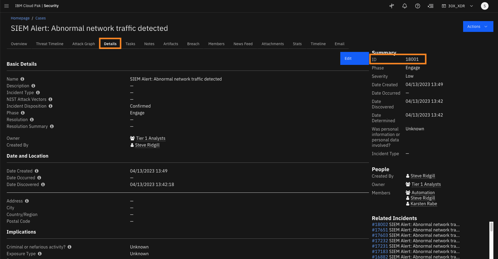

   **Important**: Remember your case number (case ID) because this system is shared with other sales engineers who might run the demo at the same time. All demos are using the same case name, however every user creates/opens unique case ID.

 
 

## Data sources and case artifacts

Now that we have created a case, lets explore the data sources that feed QRadar XDR and use the information from these data sources.

1. Start from the **Homepage**.

   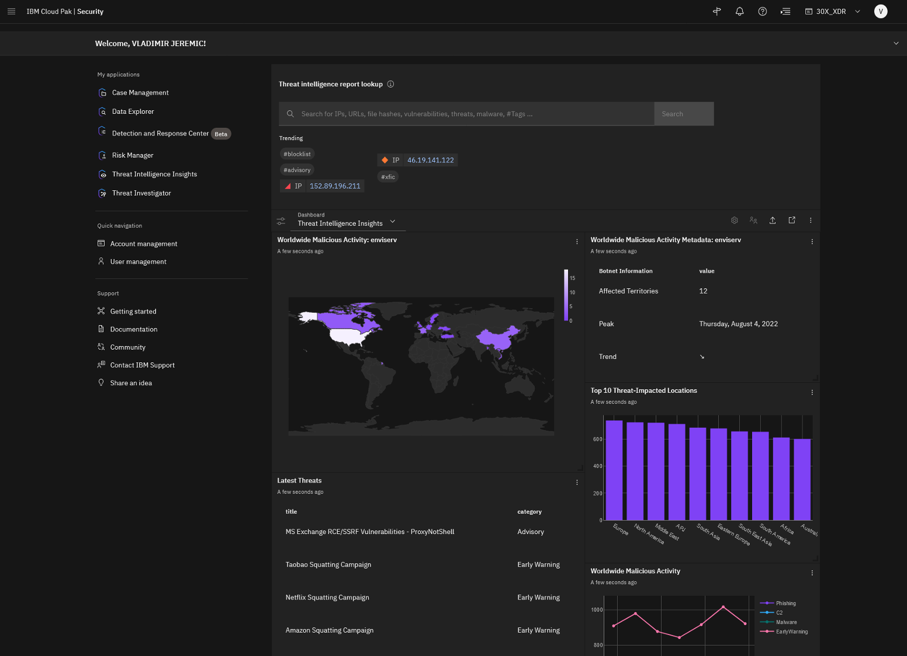

   > Today you will see a demonstration of the QRadar XDR platform, delivered on Cloud Pak for Security. The XDRC solution is scalable and open to integration with any security and cloud vendor such as Splunk, Microsoft Sentinel, CrowdStrike, AWS CloudWatch and so on.

   > Using XDRC, you can connect multiple sources of security data, correlate alerts, and run a case investigation on numerous data sources all from a single console. Also, XDRC can help facilitate automatic investigations of potential incidents (in the form of cases) and enrich discovered indicators of compromise using the threat intelligence from X-Force Threat Intelligence, or various third-party threat feeds such as Virus Total, Alien Vault, and so on.

   > In addition, you can perform threat hunting on the data from numerous security solutions, all from a single console, eliminating the traditional methods of investigation across multiple solutions that analysts do today. Let’s review data sources that are connected to the platform.

2. From the main menu, click **Connections > Data sources**.

   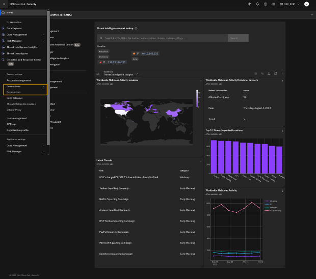

   > To see connected data sources you must go to the main menu and open Connections > Data Sources.

3. If not already opened, click the **Data Sources** tab.
   <QuizAlert text="Quiz material"/>

   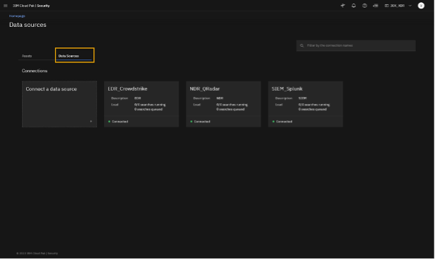

   > This page shows the connected data sources used for this demo. We see IBM and other vendors used in an integrated way. You are analysing data from the third party EDR, CrowdStrike, but you can also integrate with IBM’s EDR solution (ReaQta). In the demo, the network data is generated from QRadar NDR and the SIEM data is generated from Splunk. Obviously QRadar SIEM is another option but we wanted to emphasise that you can integrate easily with other vendors. Additional data sources can be easily added.

   > Let's now review the open cases related to our demo use case.

4. From the main menu, click **Case Management > Cases**.

   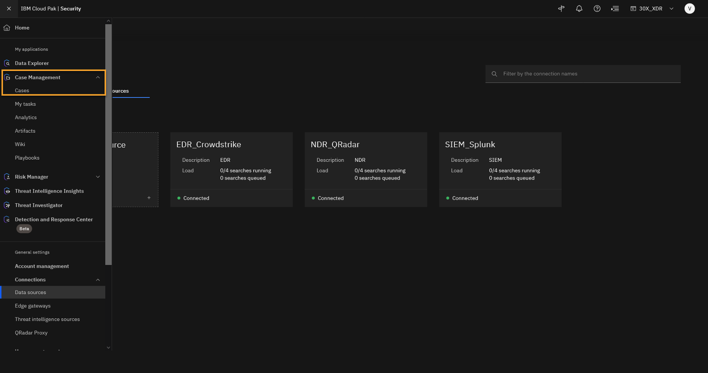

   > To see the open cases, from the main menu, you must navigate to the Case Management tool.

5. The Cases main page is shown.

   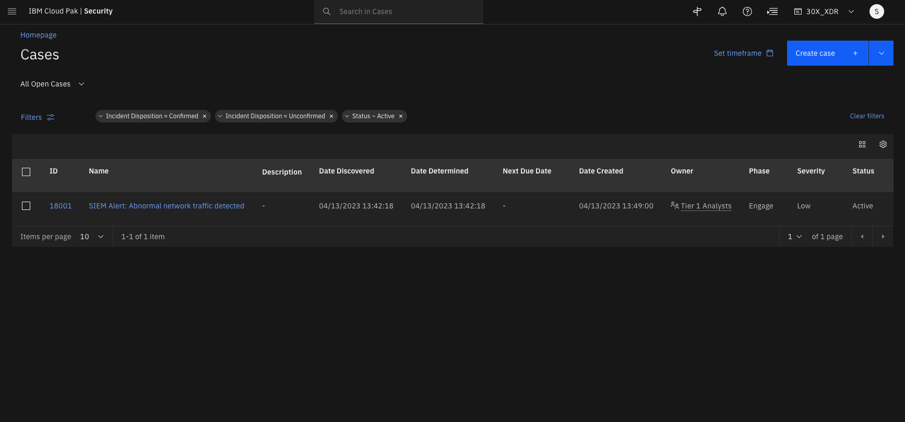

   > This page shows all the open cases that an analyst has permissions for. The default filters show open/active cases, but you can also modify filters and review even the closed cases.
   >   The open cases can be created manually or automatically by integrating with other solutions such as SIEM. Although our platform works with QRadar SIEM, it is an open platform and can integrate with any SIEM and security solution that can send potential incidents to the XDR SOAR (Case management) and analysis can be orchestrated by the XDRC solution.
   >   Let’s now review the case SIEM Alert: Abnormal network traffic detected (your case number most likely is different) that is coming from a SIEM, and it is automatically assigned the ownership to the Tier 1 Analysts group.

6. Click the _SIEM Alert: Abnormal network traffic detected_ case.

   **Important:** There might be multiple cases with the same name, due to shared demo environment. Ensure that you open and use the case with case ID that you have created at the beginning of the demo.

7. Review the case overview page of the _SIEM Alert – Abnormal network traffic detected_ case.
   <QuizAlert text="Quiz material"/>

   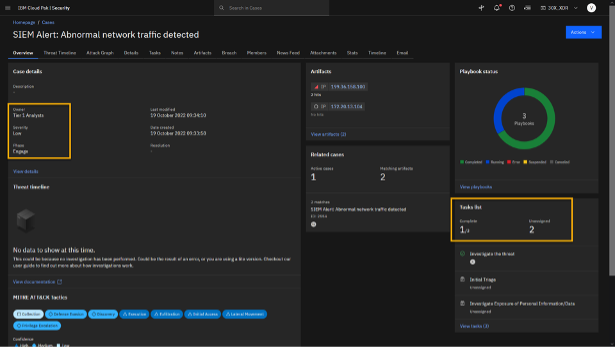

   > The case overview tab shows the basic information sent from the SIEM tool into the XDR SOAR Case.
   >   The description of the case says that abnormal network traffic is detected. We see that the initial severity of the case is Low. It is assigned to Tier 1 Analysts and is in the Engage phase of the case task progression. The open case might trigger one or more playbooks. A playbook describes specific steps and tasks that must be performed to analyze, close, or escalate the case successfully. Right now, three playbooks are associated with this case.
   >   Also, at the moment, we see that the task list contains three tasks. One is completed and two still need an owner (unassigned). The completed task is the automatically investigated threat. A task might be added or removed, manually or automatically, using the playbooks.
   >   At the bottom of the page, you can see different MITRE ATT&CK Tactics that were discovered during the Automatic investigation.

   Let’s review the tasks related to this case and the running playbooks.

8. Click the **Tasks** tab.

   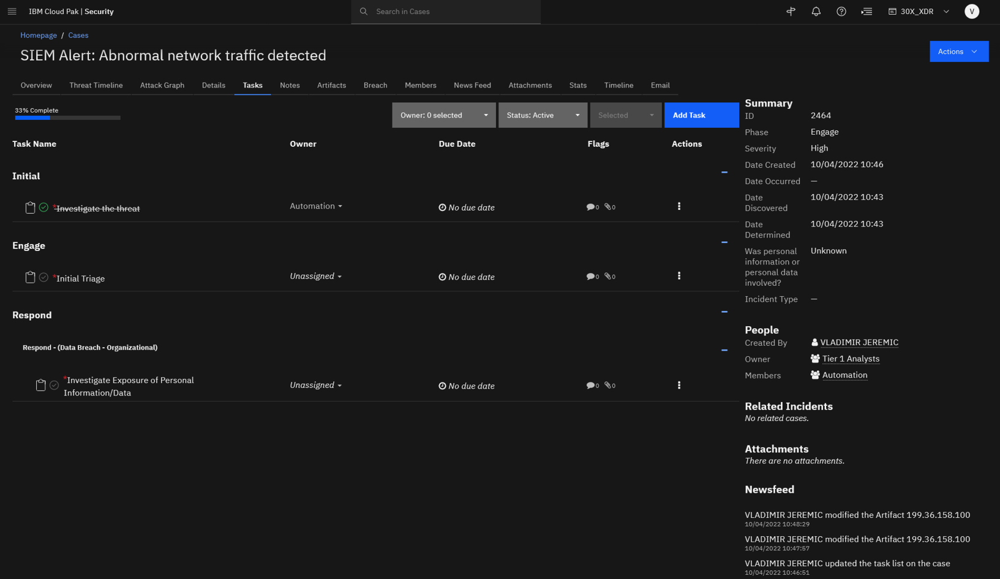

   > Looking at the task list, you see that the automated threat investigation is already preformed for the analyst.
   >   The next step to perform on this case is the initial triage which guides you and helps to better understand the scope and severity of the threat.
   >   Before you review the findings for the automatic threat investigation, let’s look at the initial set of artifacts which triggered the case.

9. Click the **Artifacts** tab.

   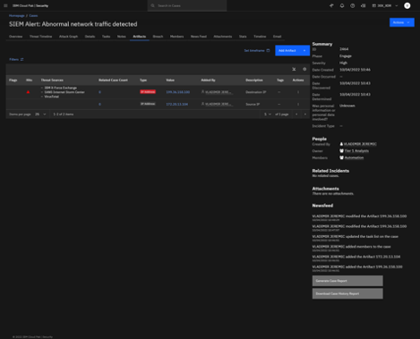

   > The SIEM tool escalated two case artifacts as part of this alert – destination IP address and a source IP address. The configured threat intel feeds have flagged the destination IP address so this _may_ indicate malicious activity.

   Let’s open the flagged artifact.

10. Click the **199.36.158.100** artifact.

    > On this page, you see the detailed report based on Threat Intelligence sources connected to XDRC. Besides IBM X-Force Threat Intelligence, VirusTotal (and SANS Internet Storm Center) threat intelligence is connected and reporting the risk by lookup from the XDR Connect.
    >  The XDRC SaaS offering comes with IBM X-Force Threat Intelligence included in the product's license. You can also integrate with other third-party threat intelligence solutions, available at no charge.

    **Important:** X-Force report is based on real-time data, so the risk score on the IoC (IP address) can change. At time of writing of this lab, X-Force no longer considers 199.36.158.100 as a risky IoC. We can see in the [X-Force timeline diagram](https://exchange.xforce.ibmcloud.com/ip/199.36.158.100) for the IoC that status changed on Oct 20, 2022 after a security analyst review.

    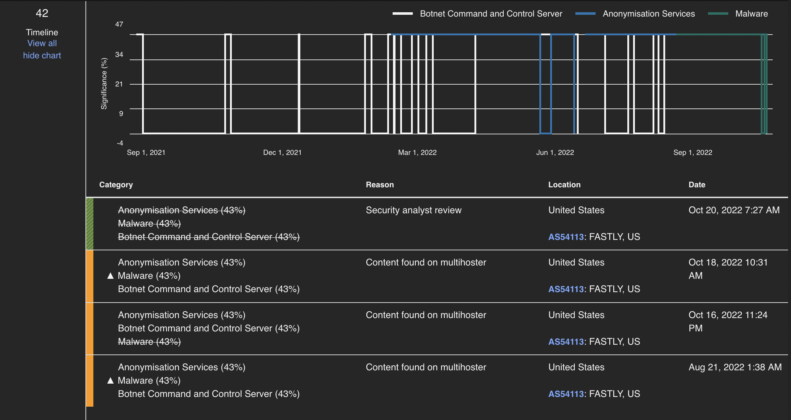

    So, X-Force Exchange no longer shows up as a hit, but you can explore hits from other Threat intelligence platforms, like Cisco Threat Grid or VirusTotal by clicking those tabs.

11. Click on a few of the Threat Intelligence hits to see the information that is automatically pulled in.

    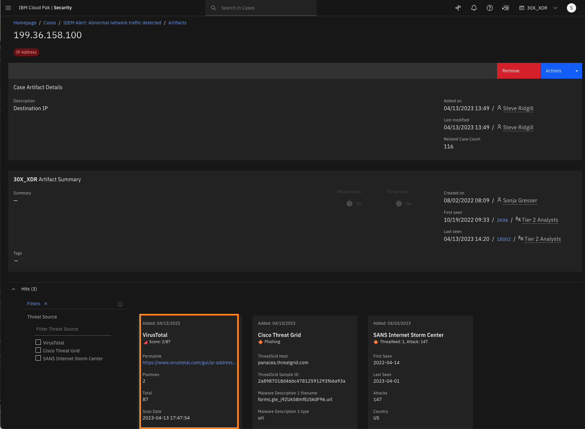

    **Note:** All of this information could be viewed in the individual sites of each threat intelligence platform, but QRadar XDR gives all the information on one pane of glass.

    > Although this artifact is flagged as malicious, from a case investigation standpoint, the two captured artifacts do not have much context on their own. To perform a more detailed triage of the threat, go back to the case and review the results of the automatic investigation.

12. Click the _SIEM Alert: Abnormal network traffic detected_ bread crumb link.

    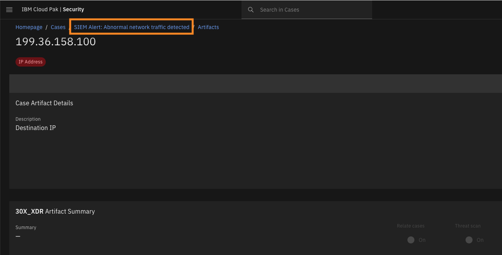

    > Let’s look at the treat timeline.

 
 

## Threat timeline and attack graph

1. Click the **Threat Timeline** tab.

   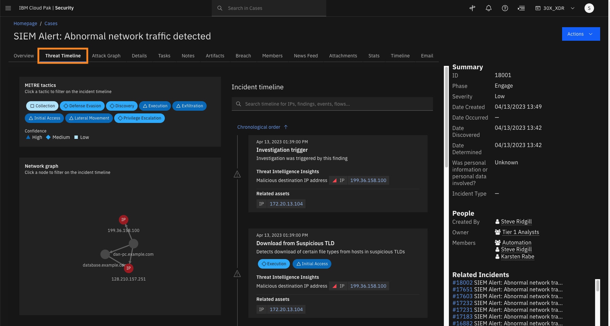

   > The platform’s automatic threat investigation capability mines your collected data sources for any information related to the initial case artifacts. For this case, the artifacts are two IP addresses that SIEM has added as a part of the initial case creation process.
   >   After querying the data sources, TI correlates that information with the MITRE ATT&CK database of known tactics, techniques, and procedures (TTPs), and builds the incident timeline and visual attack graph.

   Let’s first analyze the timeline.

2. Focus on the timeline section of the analysed incident and click the **Download from Suspicious TLD** finding.j

   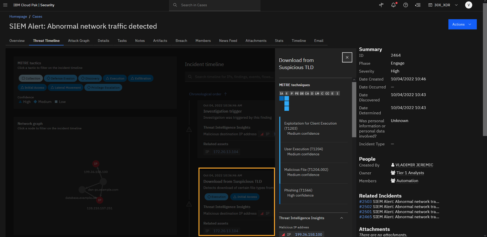

   > You can start with the timeline analysis of the incident beginning with the Download from Suspicious top-level domain (TLD).

   **Hint:** At this point, feel free to explore each of the eight findings associated with the attack and bring your own personal approach to the demo. Here is one way to summarize the attack and highlight some findings that are good ones to drill into during a demo.

3. Review the information from this section of the automated analysis.

   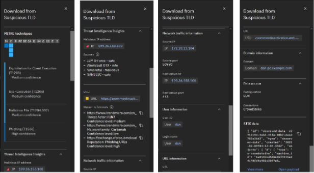

   > By opening this timeline item, you see that the investigation artifact shows that user Dan connected from the local IP address 172.20.13.104 to the remote IP address 199.36.158.100 which hosts the website zoommeetinactivation.web.app. The investigation artifact shows related MITRE Techniques. The medium confidence is associated with the malicious file that was executed by user Dan to exploit the client machine. Overall, there is high confidence that a Phishing attack was performed on the user Dan’s account.
   >   You can also see that the information came from the connected EDR data source, in this case, CrowdStrike, as we openly integrate with third parties. However, this can easily be our IBM ReaQta EDR solution.
   >   Threat Investigator was able to enrich our initial SIEM alert with endpoint data to give us a clearer picture.
   >   Also, you can click the destination IP address and URL and see the Threat Intelligence Insights information related to those artifacts that were coming from X-Force, and other connected threat intelligence sources, such as VirusTotal.

4. Click the IP address **199.36.158.100**.

   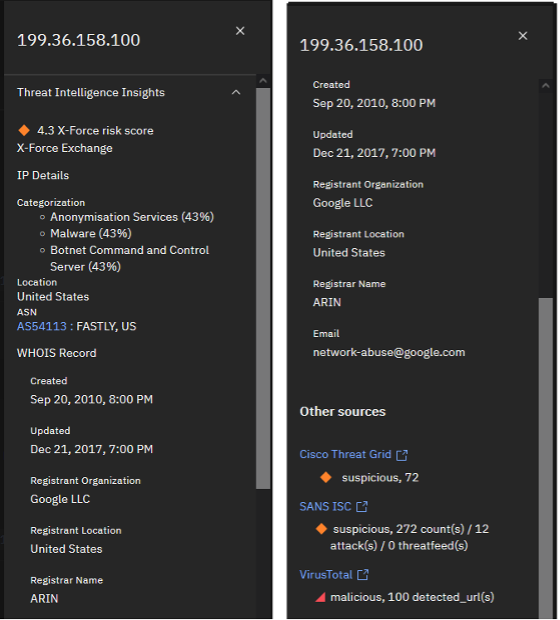

   > Note, as previously mentioned X-Force Threat Intelligence no longer classifies this IP as a threat. If you scroll down, you will see if any other connected threat intelligence sources have reported on the IP. In this case, Virus Total has strong confidence that the IP is detected in 100s of malicious URLs.

5. **Scroll** through the rest of the timeline.

   > Each of the items on the timeline adds additional investigation data creating a more holistic view of the incident. However, to easily follow the sequence of attack, you can move to the Attack Graph visual.

6. Click the **Attack Graph** tab.
   <QuizAlert text="Quiz material"/>
   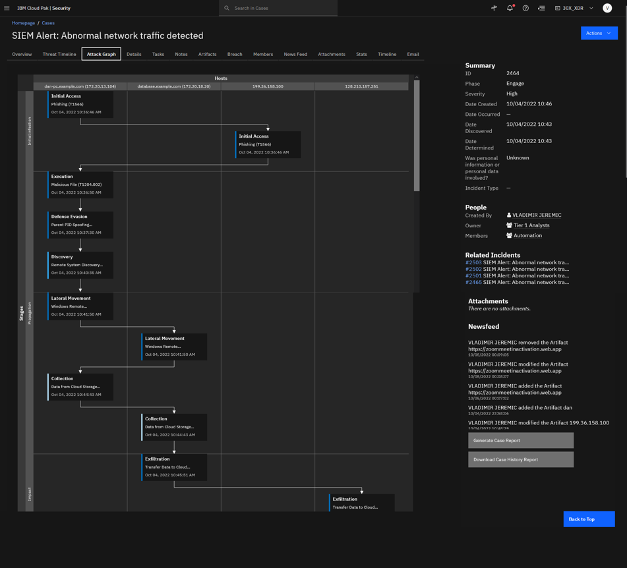

   > The Attack Graph is a visual representation of the attack and helps the analyst better understand behaviour of the attacker as they traverse the network, including affected hosts.

   > The graph outlines different stages of attack progression on the y-axis (Initial infection, Propagation, and Impact) and how the attack progress across different IP addresses presented on the x-axis.

7. Click Initial access - Phishing (T1566).

   > You can see that the Initial Access phase includes two IP addresses: Dan’s internal IP and the remote malicious IP.

   > The details of this phase on the graph matches the Download from Suspicious TLD timeline artifact that we have already discussed.

   > Let’s now review the rest of the attack on the graph.

8. Click Execution - Malicious File (T1204.002).

   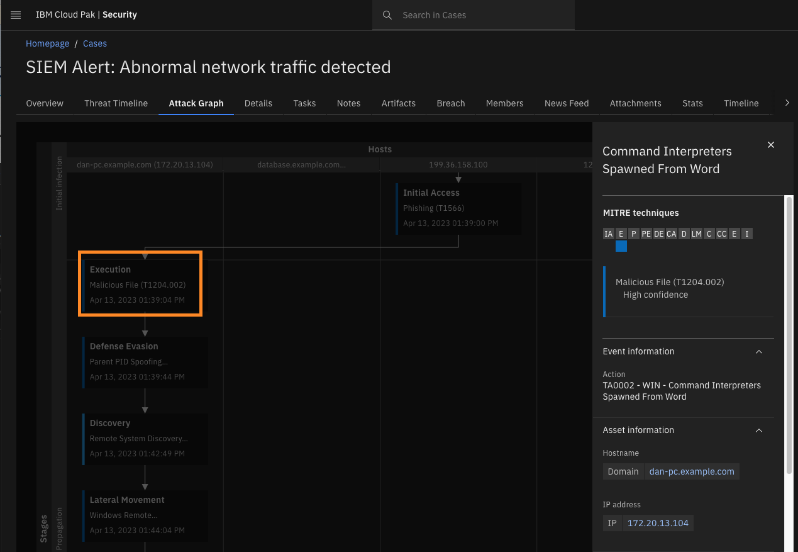

   > Now you realize, after Dan clicked on the URL, he probably downloaded a Microsoft Word document, and opened it. That action was picked up from our connected data sources and identified as a Command Interpreters Spawned From Word alert.
   >   Now you know that there was a malicious document that was executed as part of the original email.

9. Click Defense Evasion - Parent PID Spoofing (T1134.004).

   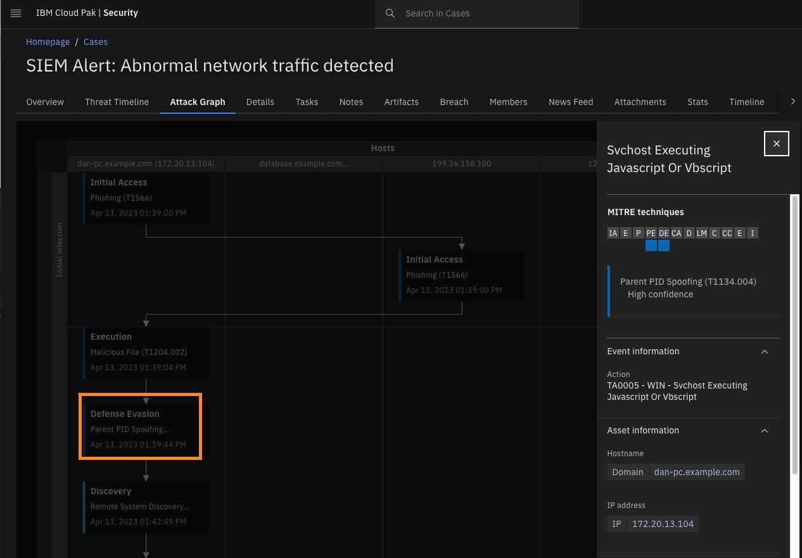

   > You see that the attack continued at Dan’s endpoint and some malicious scripts were executed, which are indicators of privilege escalation and malicious persistence mechanisms that further evade the defenses.

10. Click Discovery – Remote System Discovery.

    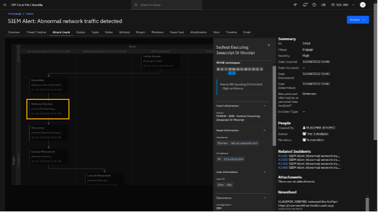

    > The attacker then started network enumeration of the internal network to discover additional targets and initiate lateral movement.

11. Click Lateral Movement – Windows Remote Management.

    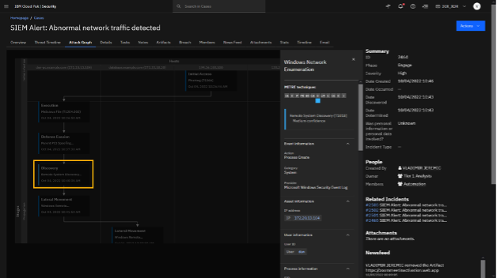

    > You see that lateral movement was performed using the Windows Remote PowerShell session to the database.example.com system.

12. Click Collection.
    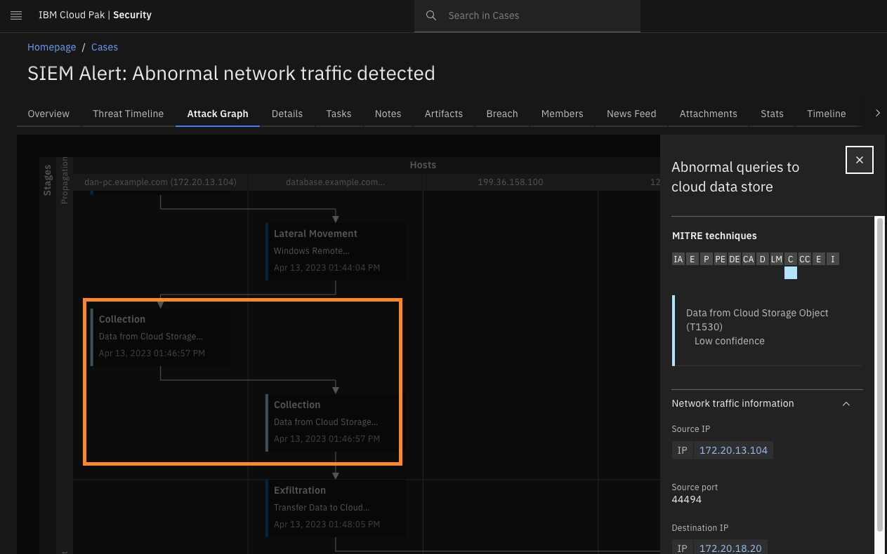

    > The next timeline item shows that the SIEM system (in this case Splunk, although QRadar can do the same) has detected abnormal queries to the cloud datastore at database.example.com.

13. Click Exfiltration.

    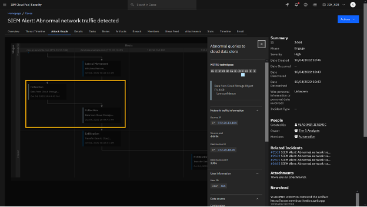

    > In the last stage of the attack, the Impact phase, we see that communication happen between the database and C2 IP address. The SIEM system reported data transfer between the internal system, database.example.com, and the remote IP address, 128.210.157.251.

14. Click the Malicious IP address 128.210.157.251 to open Threat Intelligence Insights for this IP.
    <QuizAlert text="Quiz material"/>
    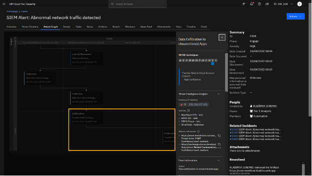

    > You see that X-Force Threat Intelligence labels this destination IP to be part of a Botnet Command & Control server (C2) with the risk score of 7.1 points out of 10, or 71%.

15. Scroll to the bottom of the IP report and note the other threat intelligence reports.

    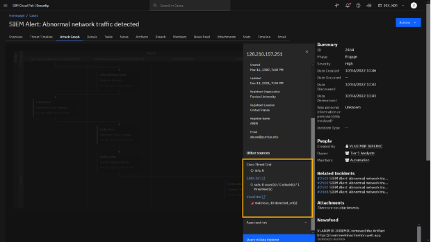

    > Note the other threat intelligence sources connected to the platform provided additional reports.
    >   After exploring this attack graph, it’s clear that one of our users, Dan, was the victim of a phishing attack that resulted in data exfiltration to a known C2 server.
    >   Automatically piecing this together, a complete attack story across multiple domains (network and endpoint in this case) is one of the many outcomes a SOC analyst can derive from XDR Connect while mitigating an attack.
    >   It is worth investigating further to see if some other IP addresses on the internal network also communicated to this C2 server IP.

### Congratulations, you've reached the end of lab 101.

Leave your browser window open, Lab 102 starts from this screen.
