# 102: Data explorer, threat hunting and case management

<QuizAlert text='Heads Up! Quiz material will be flagged like this!' />

## Prerequisite

This lab starts from the end of 101. If you have closed your browser, navigate back to the threat intelligence pop up for IP 128.210.157.251 by taking the following steps:

- From the homepage left navigation menu, expand **Case Management** and click **Cases**
- Click on the case you created (matching Case ID) at the beginning of Lab 101
- Click the **Attack Graph** tab
- Click on the **Exfiltration - Transfer Data to Cloud..** artifact
- Click the Click the Malicious IP address **128.210.157.251**

## Data sources and case artifacts

1.  At the bottom of the IP report, click **Query in Data Explorer**.
    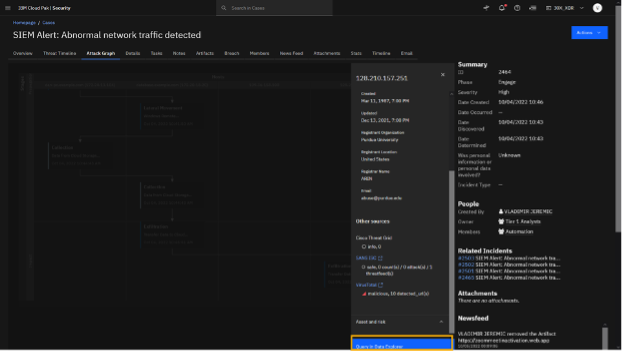
    <QuizAlert text="Quiz material"/>

    > Before taking response actions to mitigate the threat, let’s perform some additional threat hunting by searching our connected data sources for some of the IOCs uncovered as part of our initial investigation.

    **Note**: Data soruces allows an SOC analyst to search multiple sources of data at rest. This is a key differentiator from other solutions that require data ingestion before searching.

    We will add the following as case artifacts:

        - Domain name: database.example.com

        - IP address with bad IP reputation 128.210.157.251 (the 199.36.158.100 is already an artifact)

        - User account: dan

2.  In the Data Explorer, at the Search Results page, review the results of the query.

    > The query for that IP address returns two results from the QRadar NDR data source.

    > From the query results, you see that the C2 Server has only communicated with the two IP addresses discovered by Threat Investigator.

3.  To open the log details of the second log result that has database.example.com domain, click **Expand**.

    

4.  To add the domain to the artifact, right-click domain **database.example.com > Add artifact to case**.

    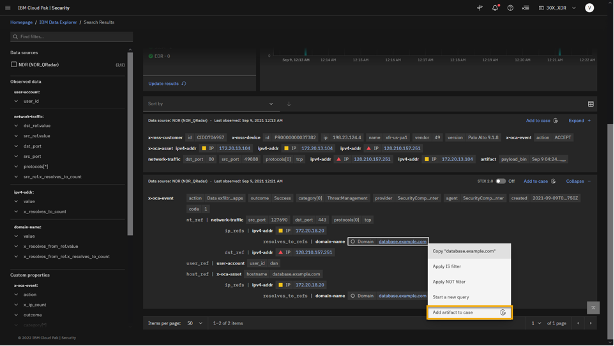

    > Let’s add this domain to our list of artifacts so we can isolate this database.

5.  At the "Add artifact to case" window, type appropriate **Description**, select the appropriate **case number** (the one you created at the beginning of Lab 101).

    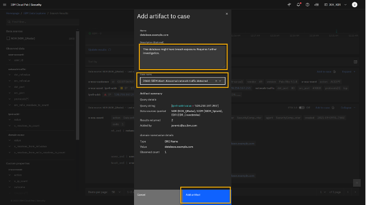

    **Hint**: When adding the artifact, it is a good practice to describe why artifact is added to the case and ensure that you are using right case number.

6.  Click **Add artifact**.
    > Repeat steps 4 and 5 to add additional artifacts "user_id dan" and malicious Command and Control (C2) IP addresses "128.210.157.251".
7.  Add user **user_id dan** and malicious **IP 128.210.157.251** as the artifacts to the case.

    > After we add those artifacts to the case, let’s navigate back to the open case.

    **Hint**: You can easily launch to the open case after the artifacts have been added by using the pop-up link that appears the bottom of the page. However, the link disappears quickly.

## Case management

1. From the main menu, go to **Case Management > Cases** if you're not already .
   You should confirm that the artifacts collected during the investigation are now part of the case.
2. Open your case number.
3. Click the **Artifacts** tab.

   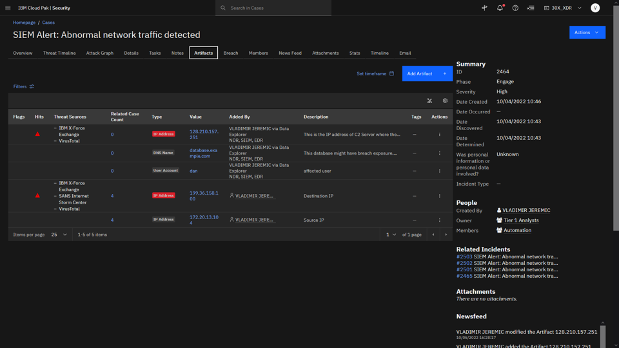

   > Now that we have a better understanding of the malicious activity that has occurred, you can continue the incident response process and complete the next step in our playbook.

   > Let’s go back to the tasks list.

4. Click the **Tasks** tab.
   > From the tasks list, let’s open and execute the next task _Initial triage_.
5. To open the task, click **Initial triage**.

   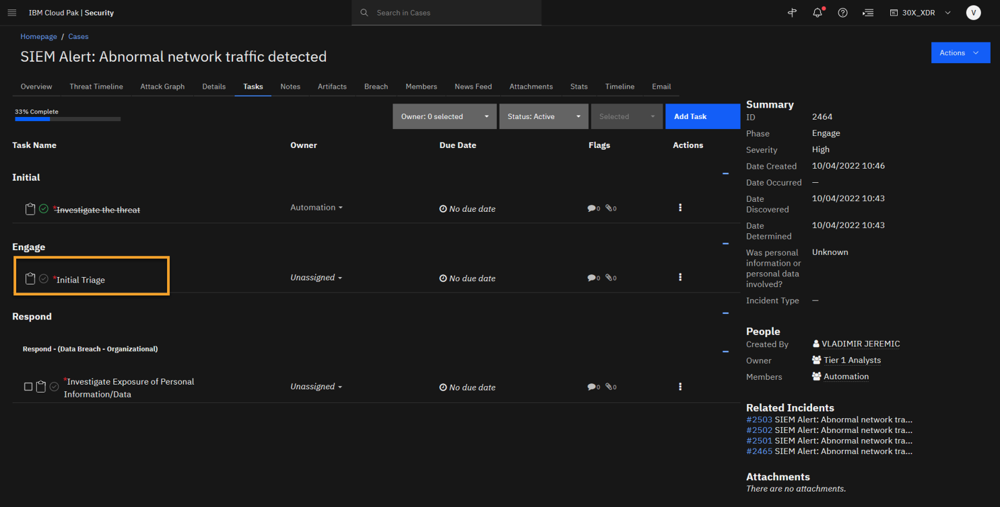

6. To update the task, click **Edit**.

   > This task asks you to complete an initial triage of the threat and disclose whether this is a confirmed incident or a false positive. Let’s confirm this incident, which is the default setting.

7. To confirm the incident, at the Incident Disposition field select **Confirmed**.

   **NOTE**: This should be the default value, but if we were not certain of the attack we could disposition as "Unconfirmed", but given the data we should leave it as "Confirmed".

   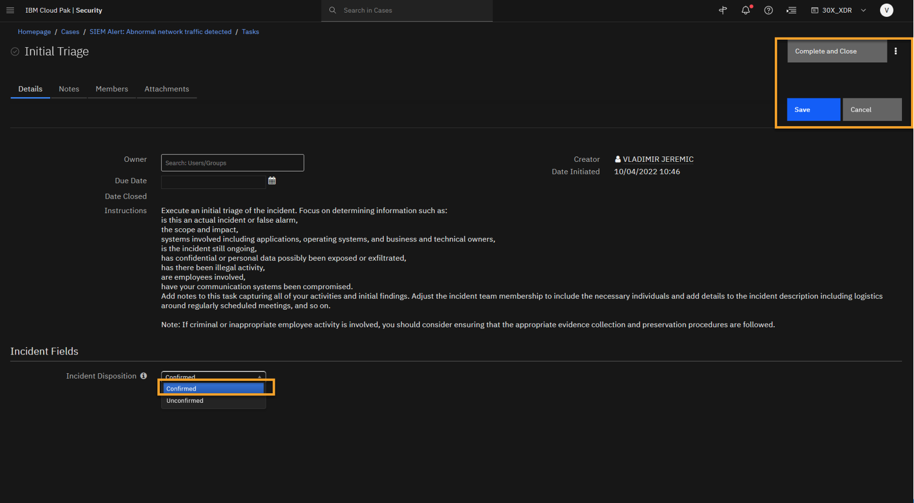

   > And then we can close this task.

8. Click **Save**.
9. Click **Complete and Close**.
10. In the tasks list, note the newly created tasks.

    > Completing the previous task generates a new task, asking you to take response actions.

    > The workflow of the incident response and tasks is driven by the playbooks that are associated with this case. Also, notice how the severity has been automatically set to **High** and the **Tier 2** Analyst team has been added as the case owner.

    > Now, you can open the _Take Appropriate Response Actions_ task.

11. Click the **Take appropriate response actions** task.

    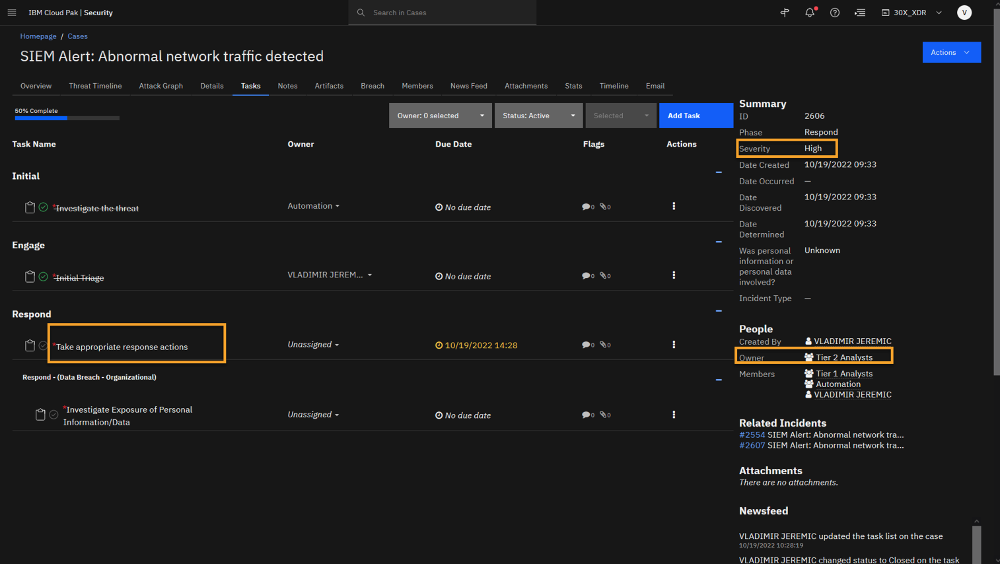

    > You can see that the next step is to Take Response Actions to mitigate the threat

12. To update the task, click **Edit**.

    

13. In the **How to respond?** field select appropriate options:

- **Isolate machine** (database.example.com and 172.20.13.104 are compromised)
- **Deactivate user** (Dan is compromised).
- **Blocklist IP address** (The IP with bad reputation should be blocked: 128.210.157.251 and 199.36.158.100).

  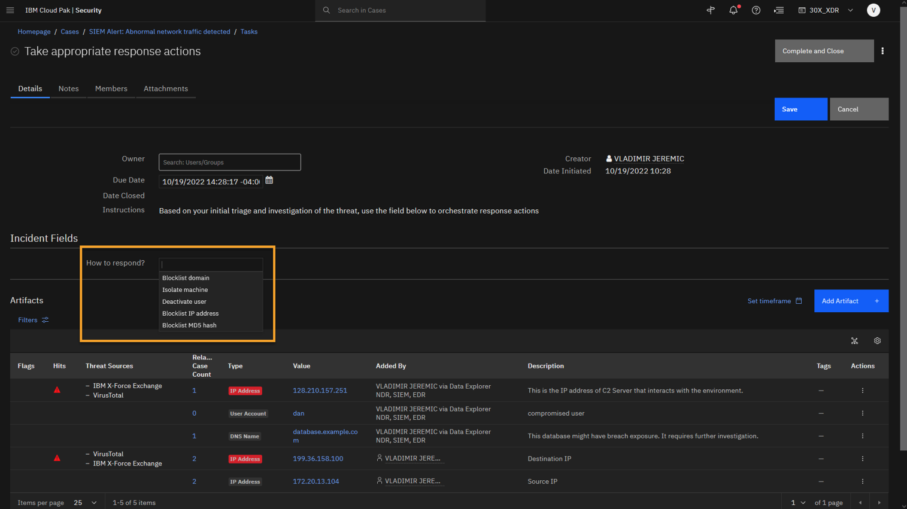

  > Using the How to respond field, you can select the response actions that should be taken, and then SOAR will reach out to the integrated tools to orchestrate and execute the response action, and, in this scenario, to post the results back to the case as a note.

  > You will want to execute the following responses:

  > • Isolate machine; because the database.example.com and 172.20.13.104 (Dan’s PC) are compromised.

  > • Deactivate user; because the account Dan is compromised.

  > • Blocklist IP address; because the IP addresses with bad reputation should be blocked: 128.210.157.251 and 199.36.158.100.

14. Click **Save**.

    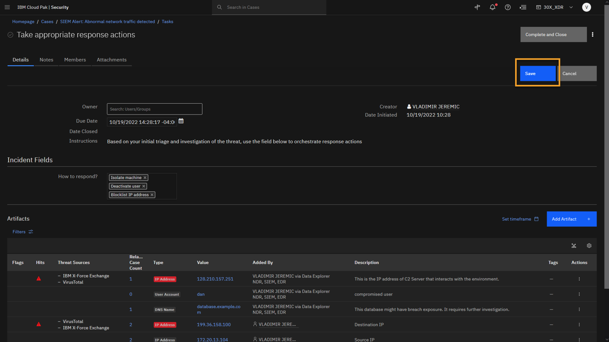

15. Review the pop-up message on the page and click **Close**.

    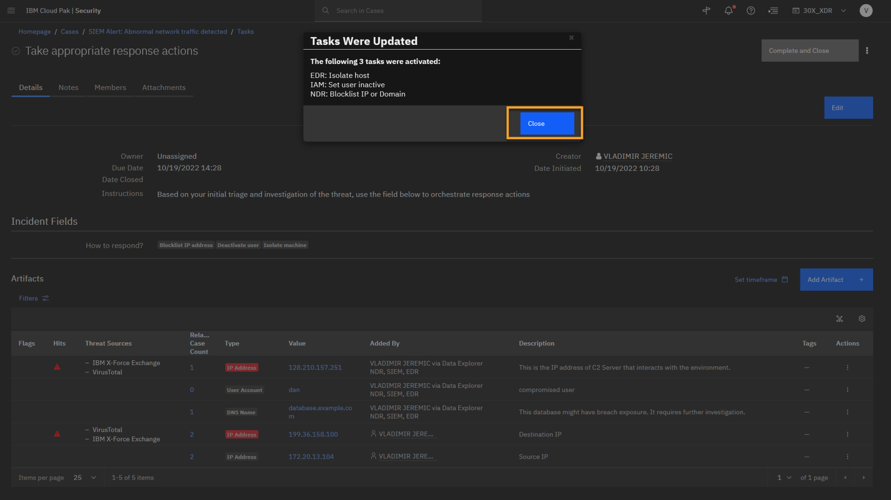

    > Note that based on the inputs you select, the system will respond accordingly and add additional tasks. Here, we see that we have taken containment actions at the:

    > Device layer via our integrated EDR, so the affected machines are isolated using the EDR.

    > Identity layer via our integrated IAM, so the compromised user is isolated.

    > Network layer via our integrated NDR, so you can block access to the external IP addresses with bad reputation.

    > The ability to take response actions cross-product is another XDR feature which can be used to help enforce a Zero Trust strategy.

16. To close the task, click **Complete and Close**.
17. In the task list, note the new tasks that are autocompleted.

    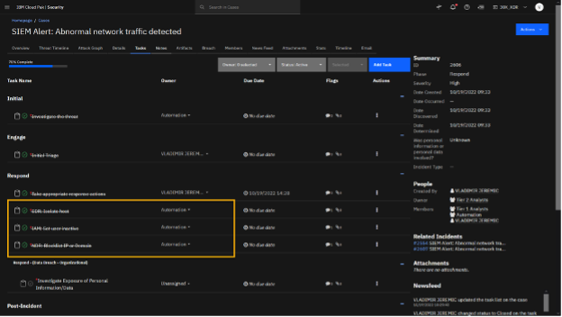

    > Note that the newly injected tasks are configured to auto-respond. Thus, the SOAR platform can automatically remediate some actions, such as isolating the host by integrating with EDR tools, block-listing the malicious IP addresses in NDR tools. and deactivating compromised accounts in IAM tools. Every task that you perform (user and machine) as part of the response strategy is documented, tracked, and available for reporting.

    > Before moving on to the post-Incident phase to wrap up this case, you can navigate to the Notes section and review the output from our automations.

18. Click the **Notes** tab.

    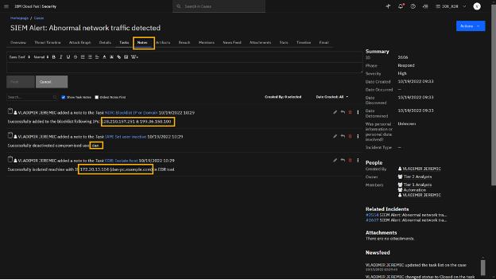

    > Here, you see that our automation was completed successfully, and you are able to see the users and IP addresses you have taken action on.

    > You can now focus on completing the final step in the task list.

19. Click the **Task** tab.

    > To recap, you have effectively detected a threat to the environment, performed analysis with the help of automated threat investigation and federated searches. As a result, you determined it to be a phishing attack, and then you took response actions to contain and mitigate the threat.

    > Now, as part of the post-incident review, you can generate a case report.

20. At the lower right side of the page, click **Generate Case Report**.

    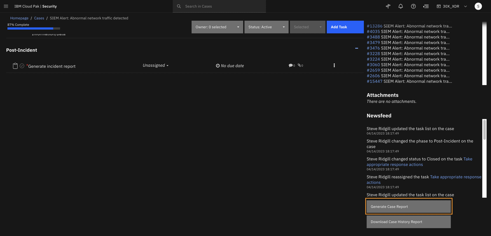

21. At the Select a Template window click **Customize**.

    

    > By default, there are several templates that come with the product, or you can create your own custom templates and save them for future use.

22. Review the page and click **Back to Case**.

    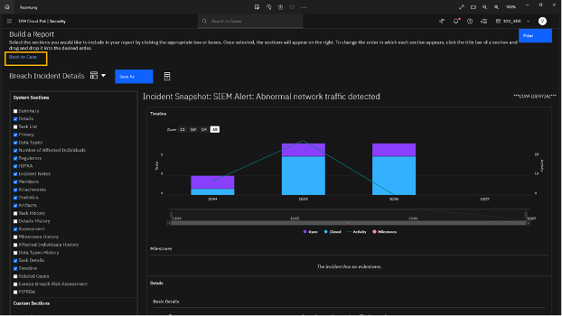

    > The report is very customizable and provides a lot of data. You can also export the report to a pdf.

    > Let's go back to the case and close it.

    **Note**: At this point, feel free to select different sections to show off the granularity of data in the report, as well as the flexibility of views by selecting and dragging different views as necessary

23. After generating the report, mark the **Generated incident report** task as completed and also the **Investigate Exposure of Personal Information/Data** task. That automatically closes the case.

    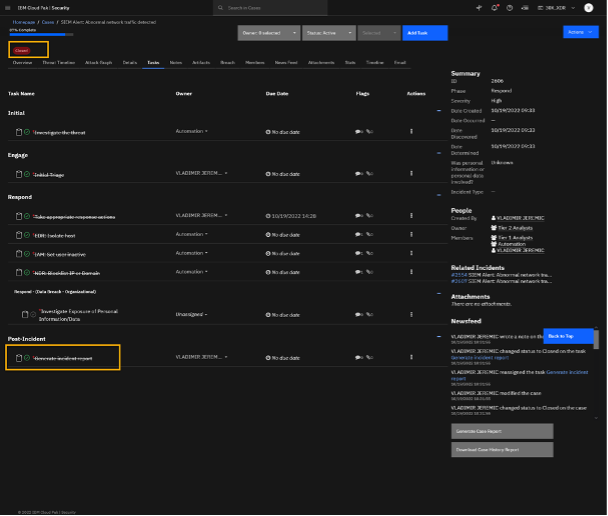

    > After generating the report, you have completed the last task on the list, which automatically closes the case.

    > We are able to show the whole incident response lifecycle on the QRadar XDR platform.

    > The case data can be preserved and available to reference in the future from within the platform.

## Summary

> During today’s demonstration, we have covered how the XDR platform can augment the traditional SOC processes and enhance the overall analyst experience through accelerated incident response with simple automation, process standardization, and integration to your existing security tools. Your SOC analysts can work more efficiently by leveraging an open security platform to connect the pieces together using the attack timeline and enrich the data using X-Force threat Intelligence and other third-party threat intelligence, such as VirusTotal. Then the platform orchestrates cross-domain incident response and enables federated threat hunting still leveraging X-Force and other vendors threat intelligence. With the XDR platform, your analysts can achieve faster time-to-value with out of the box capabilities and content to address your most critical use cases.
