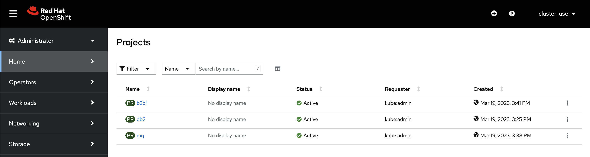

# Demo prep - OpenShift Logon

This demonstration workshop uses an OpenShift environment provisioned from IBM Technology Zone (ITZ) [here](https://techzone.ibm.com/my/reservations/create/63dba359cc19150018af084f). If you are attending the workshop in-person, this OpenShift environment has already been created for you.

In a web browser open the link to the OpenShift Cluster provided from your workshop leader.

When the page loads, you will see an IDP selector, choose **workshop-user**

At the login prompt, type in **cluster-user** as the Username and enter the password from your workshop leader. Then, press **Log in**.

In a moment, a page like the one below should open in the browser window.

Leave this browser window open. It will be used again later.

That concludes the setup of access to the OpenShift cluster. Proceed to the next part of the demonstration guide to configure B2Bi.
