# Bonus - Configure a secured HTTP endpoint

In this activity, you will learn more about how services and adapters can be configured in Sterling B2B Integrator. Like the Configuration Part 1 activity, since the steps in this lab will deploy a new service in the cluster, the first section where the service is configured will be performed once per cluster.

For the last section, each lab user could configure their own route in the `b2bi` project if desired.

## Add a HTTP Service Adapter

Sterling B2B Integrator includes a number of pre-installed adapters that can be configured to send and receive data. To make this section a little different from Configuration Part 1, instead of configuring the HTTP Service Adapter for the ASI (application server-independent) node, it will be configured on the Adapter Container (AC) node. The AC node is a supplemental node to the ASI and allows Service Adapters to be distributed off the ASI.

1. Return to the OpenShift **Routes** list and open the **sterling-fg-b2bi-asi-internal-route-dashboard** route. When prompted, log in using the **admin** user. Then expand **Deployment** -> **Services** and click on **Configuration**.

   

1. Type **HTTP Server Adapter** for the Service Name in the Search panel and click on **Go!**.

   

1. Find the row with **Http Server Adapter** in the name column and click on the **copy** text/icon.

   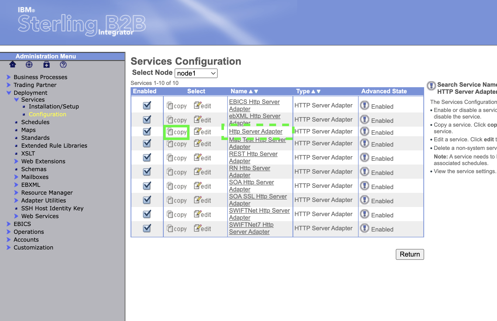

1. Change the name to **AC Hosted Authenticating Http Server Adapter**, scroll in the **Environment** panel to select the **node 1 Adapter Container1** resource. Then, click on **Next**.

   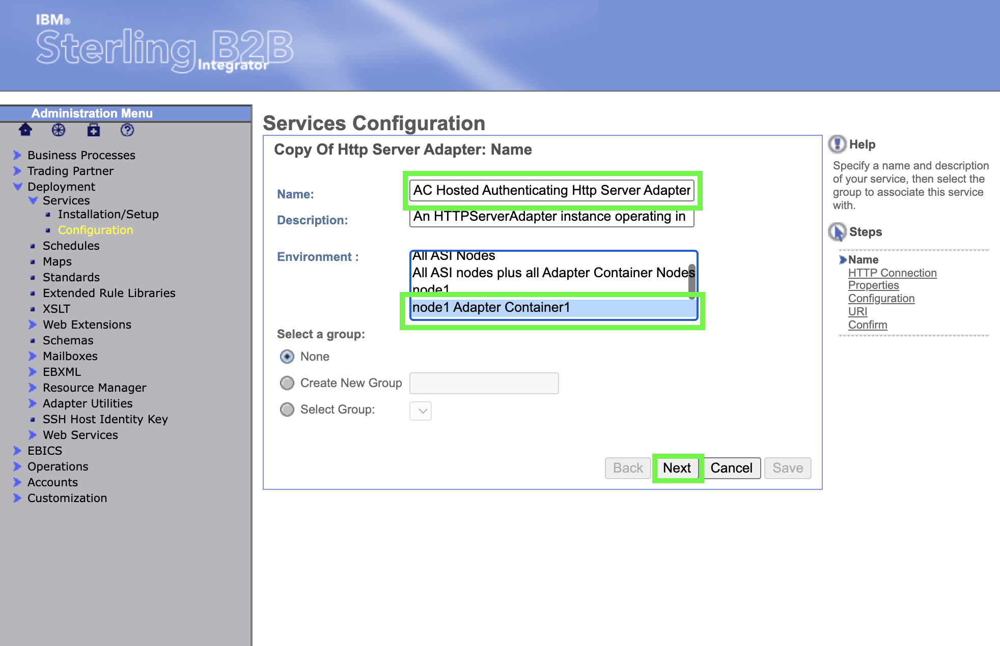

1. To find a port to use for the Http Server Adapter instance, go back to the OpenShift console and the **Services** list. This time, select the **sterling-fg-b2bi-ac-backend-svc** service and note the port used for the `adapters-2` Service port.

   

   Notice that the Kubernetes service and the node port are identical. Techincally, they do not need to match. The important part to note is the port number associated with the service, or the pod port if given. Since the pod port name matches the service port mapping name, the correct port to choose is `30352`.

1. Enter the port from the service in for the **HTTP Listen Port**, change **User Authentication Required** to **Yes**. Then, click on **Next**.

   

   > There is a warning on this page that not enabling SSL would result in a weak security configuration. This is generally true, but we will mitigate the security exposure of credentials going over the Internet in cleartext when we create the **Route** to expose the service using OpenShift.

1. Review the option to specify a particular group for access to the service, but do not make changes. Click on **Save**.

   

1. In the confirmation page, scroll down to find the **URI: /hello** entry. Notice that the Business Process to run is called **Hello World**

   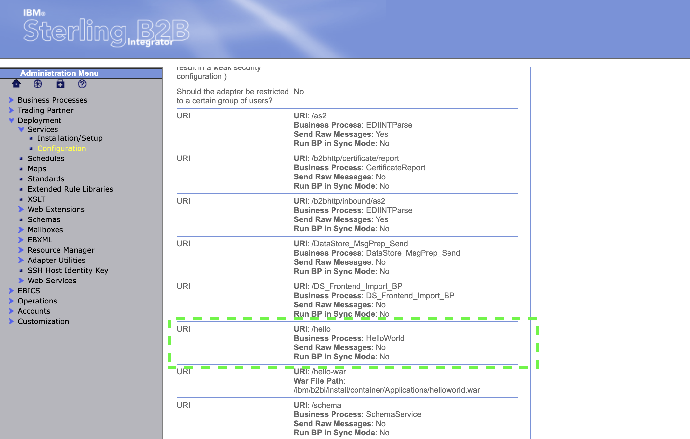

1. Continue scrolling to the bottom of the confirmation page and click on **Finish**.

   

1. Click on **Return** to go back to the Services Configuration panel.

   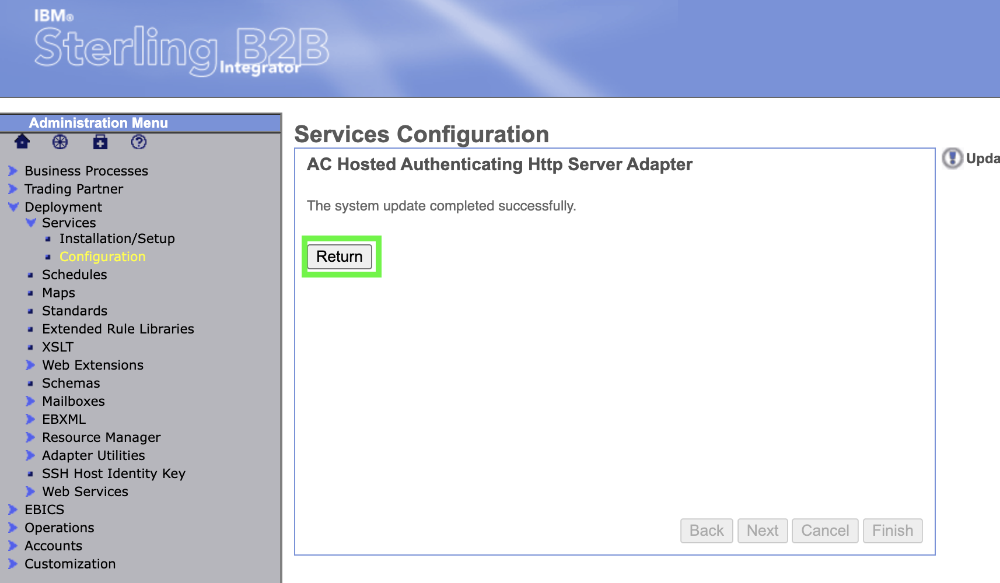

1. Check the status of the new adapter. Using **Select Node**, change to **node1AC1**.

   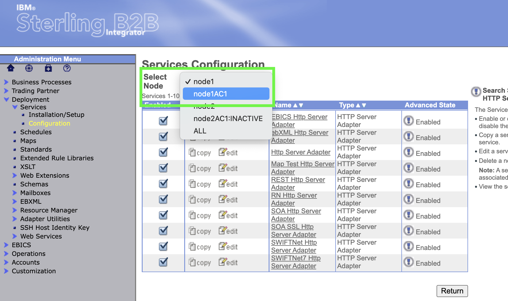

1. Click on the exclamation mark for the service adapter to check the running status (it will be automatically enabled since it was copied from an enabled service adapter).

   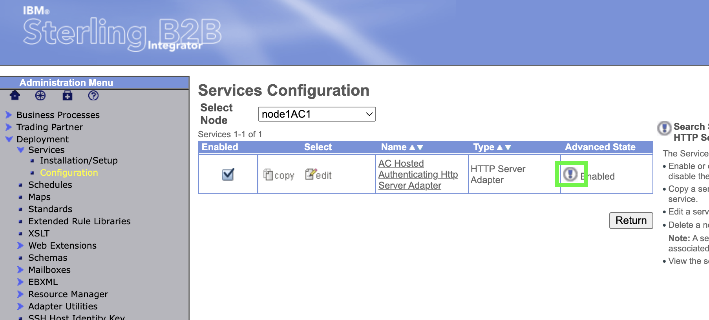

1. Note the progression in timestamps ending with **REGISTER_JNDI**, this shows the service adapter is operating. Click on **CLOSE** in the upper right to dismiss the panel.

## Explore the sample Business Process

Before configuring an OpenShift Route to access the service, spend a moment reviewing the sample Business Process that will be invoked when the `/hello` endpoint is accessed.

1. On the main B2Bi left navigation, expand **Business Process** -> **Manager**. Then, type **Hello World** as the Process Name in the Search panel. Finally, click on **Go!**.

   

1. Click on the Process Name to open a view of the process.

   

1. Expand the window so that the full business process is shown.

   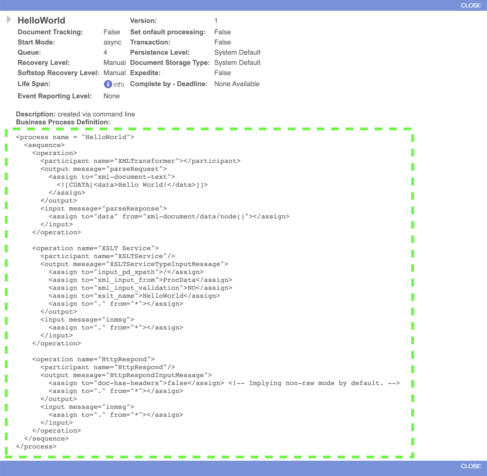

   Without getting too technical, it is clear to see that the sequence of this business process has three operations. The first operation generates a xml document with a data element containing `Hello World!`. The second operation invokes an XSL Transformation using a stylesheet called "HelloWorld". If you were to look up this XSL stylesheet in the B2Bi dashboard you would see that it takes the data from the xml document and wraps it with some basic html tags. The last operation creates a http response sending the data from the XSL Transformation. In effect, when this business process is invoked it will generate a response like this to the caller:

   ```html
   <html>
     <body>
       Hello World!
     </body>
   </html>
   ```

1. Close the view of the business process by clicking on **CLOSE** in either the upper right or lower right corner.

   

## Configure an OpenShift Route to expose the HTTP Service Adapter and its endpoints

Red Hat OpenShift has a resource type called a `Route` that is very similar to the Kubernetes `ingress` resource. In OpenShift, routes allow the cluster (or project) administrator to expose a service in the project for access over http or https. When creating a route that implements https, there are three options that can be selected; **edge**, **reencrypt**, and **passthrough**. For the sake of simplicity, this lab will use an **edge** route to securely terminate the inbound connection on a routing pod in the cluster.

As was done earlier in the lab, if you are working in a multi-tenant environment, the route that you create should be made unique by prefixing the name with your initials in lower case with a `-` immediately after.

1. Switch back to the OpenShift console and go to the **Routes** panel with the **b2bi** project selected. Then, click on the **Create Route** button.

   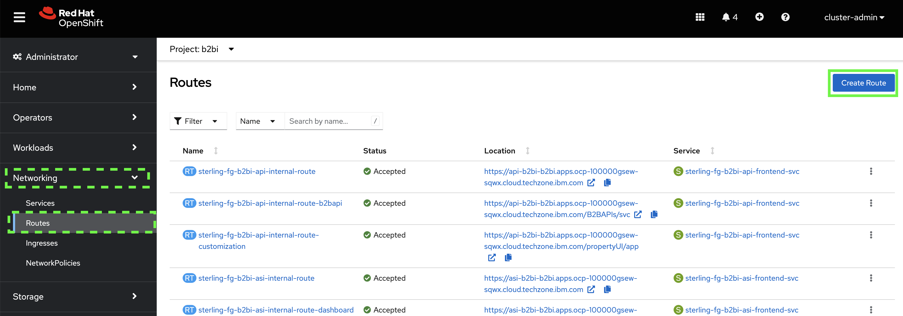

1. For then name of the route, use the base name of `auth-helloworld`. If you are working in a group, place your initials followed by a dash before this name. Following the example from the earlier lab, Bilbo Baggins would enter `bb-auth-helloworld`.

   

1. For the hostname, place this name to the left of the cluster apps domain name in the browser URL, leaving off any path elements. For example for this console url:

   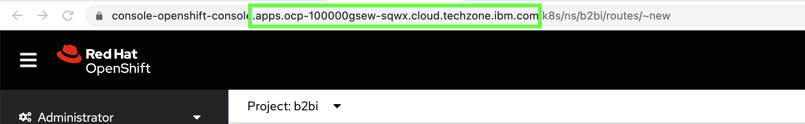

   Bilbo would use the **Hostname** of `bb-auth-helloworld.apps.ocp-100000gsew-sqwx.cloud.techzone.ibm.com`

1. Keep the **Path** as the default and for **Service**, select **sterling-fg-b2bi-ac-backend-svc**. For the **Target Port** select **30352 -> adapters-2 (TCP)**.

   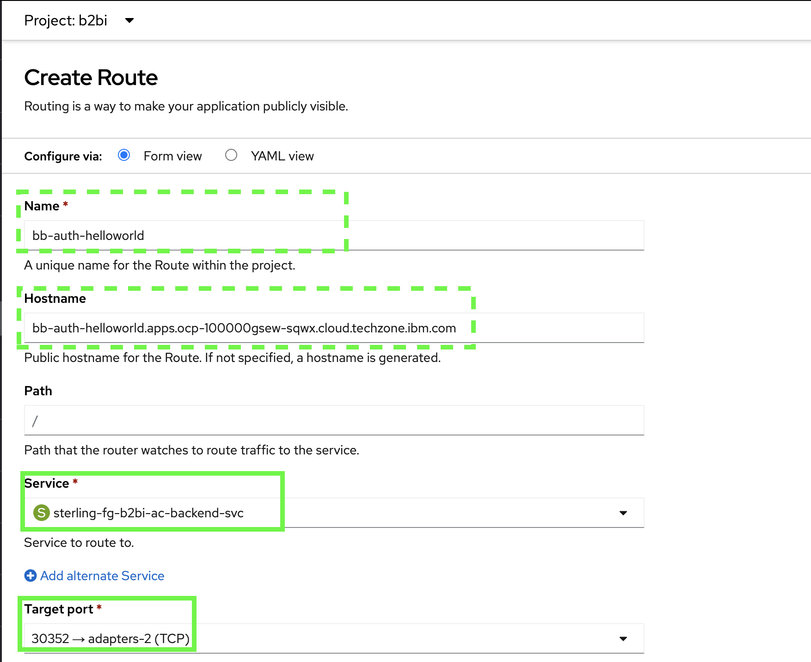

1. Select the checkbox next to **Secure Route** and select **Edge** from the **TLS termination** pulldown.

   

1. The remaining parts of the form for **Insecure traffic** and **Certificates** may be left at their default. Click on the **Create** button to create the route.

   

1. OpenShift will display a status page with the newly created **Location** shown. Copy the URL.

   

1. Open a new browser tab and paste the URL and append `/hello` as the endpoint.

   

1. In the dialog, enter in the username and password for one of the trading partners created in the earlier lab and click on **Sign In**.

   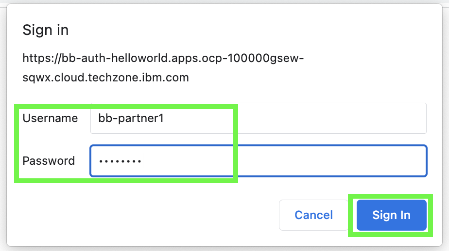

1. The expected response is provided back from the business process.

   

## Summary

In this activity, another protocol adapter was added to the B2B Integrator environment. In addition to the very simple HelloWorld business process, this adapter also supports a large number of other relevant business processes for B2B integration scenarios and can be customized as needed for business requirements.

When the HTTP Service Adapter was configured, it was set to match a port defined in a Kubernetes **Service**. This made it very simple to expose the HTTP Service Adapter securely on the OpenShift cluster using a Route. Note that in this simplified example, there was no grouping of access set with the HTTP Service Adapter. This means that any valid trading partner username and password would work for authentication. In a production environment, further organization around group-based access would be common.
