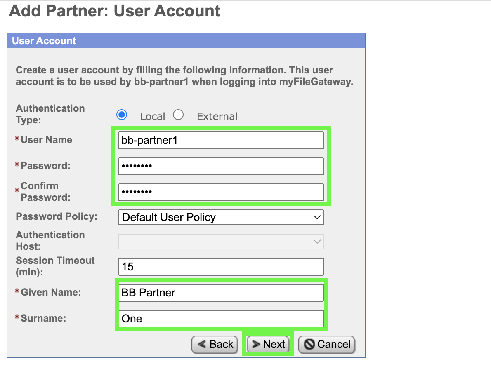
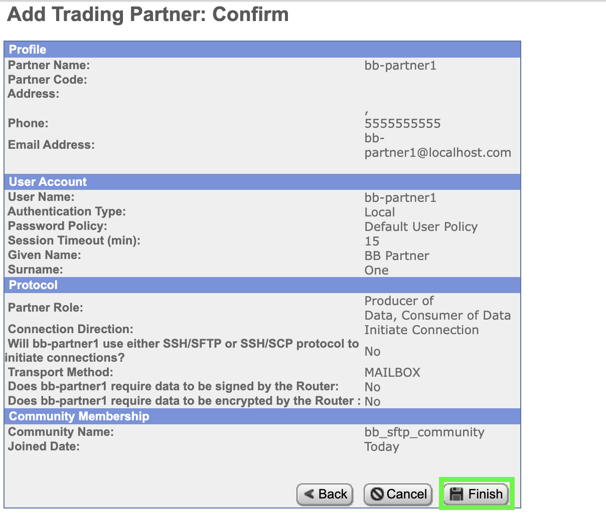
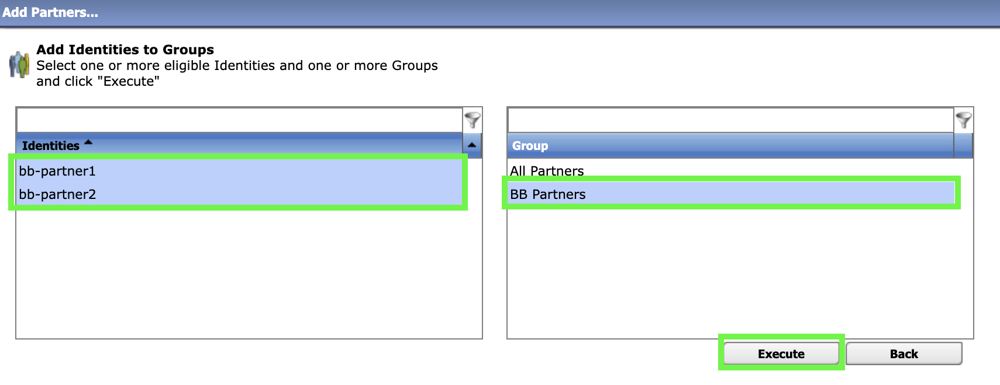
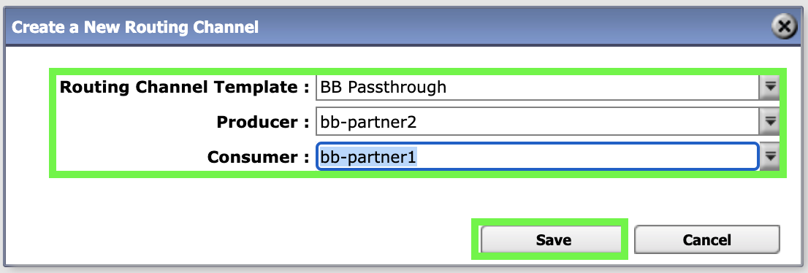

In this chapter, learn how to create a B2Bi partner community, add partners to the community, create a group with these users, create a routing template for the group, and create routing channels.

To make this workshop interesting, we will implement a collection of trading partner networks, with each sharing files within their network. To do this, each workshop participant will uniquely name resources by using a prefix of their initials on resources. All of the examples that follow are what Bilbo Baggins would use (bb).

## Create a partner community

1. Return to the OpenShift web console and click on the route link to the IBM Sterling File Gateway user interface (UI): **sterling-fg-b2bi-asi-internal-route-filegateway**.

    

1. Enter **fg_sysadmin** in the User ID field, **password#** in the Password field, and then click the **Sign In** button.

    

1. Click the **Participants** pull-down menu item on top menu bar.

    

1. Click **Communities** in the **Participants** menu.

    

1. In the **Communities** pop-up window, click the **add** link.

    

1. Append your initials to the community name followed by an underscore. For example, Bilbo Baggins would enter **bb_sftp_community** in the **Community Name** entry field and click **Next**.

    

1. Select both the **Partner Initiates Protocol Connections to Mailbox** and the **Partner Listens for Protocol Connections** check boxes.

    

1. Select the **SSH/SFTP** checkbox and click **Next**.

    

1. Click **Next** on the **Add Community: Notifications** form.

    

1. Click **Finish** to confirm the creation of the new community.

    

1. Click **Return** on the community confirmation screen.

    

## Add partners to the partner community

Next, add 2 partners to the newly created **bb-sftp_community**.

1. Click the **edit** link for the community that has your initials as the prefix (following the same example for Bilbo): **bb_sftp_community** on the **Communities** pop-up window.

    

1. Under **Partner**, click the **Add** link.

    

1. Use your initials followed by a **dash** as a prefix for the first partner identifier. Enter **bb-partner1** in the **Partner Name** field, 10 digits in the **Phone** field, **bb-partner1@localhost.com** in the **Email Address** field, and then click **Next**.

    

1. Enter **bb-partner1** in the **User Name** field, **password** in the **Password** field, **password** in the **Confirm Password** field, **BB Partner** in the **Given Name** field, **One** in **Surname** field, and then click **Next**. Technically, you can use any password you prefer, but it will be needed later in client demo lab.

    

1. Click **bb-partner1 is a Producer of Data** and then click **Next**.

    

1. Review the default settings on the **Initiate Connections Settings** screen and then click **Next**.

    

1. Review the default settings on the **PGP Settings** screen and then click **Next**.

    

1. Review the settings for **bb-partner1** and click **Finish**.

    

1. Click **Return** on the **Added Partner Successful** screen.

    

1. Repeat the Steps 13 through 20 to create a second partner named **partner2** using the same settings.

    

1. Click **Return** on the **Edit Community: bb_sftp_community** screen after creating both partners.

    

1. Close the **Communities** pop-up window.

    

1. Click **Partners** under the **Participants** menu.

    

1. Click the **Refresh** button if **partner1** and **partner2** do not appear in the **Partners** table.

    

## Create a group

You will now add a group to make mapping selecting users into a routing channel more simple and scalable

1. Click **Groups** under the **Participants** menu.

    

1. Click **Create** to add a new Group.

    

1. Enter your capital initials followed by a space and then **Partners**, continuing with the example, it would be **BB Partners**. Then click on **Save**.

    

    Click on **Ok** to clear the confirmation.

    

1. With the Group you added selected, click on **Add Partners...**.

    

1. Select the identities that you added and the group (use Ctrl-Click for multiple selections) and then Click **Execute**

    

1. Review the proposed changes for moving the users to the group and Click **Ok**

    

1. Click **Back** to return to the previous page.

    

1. Select the group to confirm that the partners are showing as belonging in the group.

    

## Create a routing template

1. Click **Templates** under the **Routes** menu.

    

1. Click the **Create** button at the bottom of the **Routing Channel Templates** page.

    

1. Enter **BB Passthrough** in the **Template Name** field and then click **Next>>**.

    

1. Review the **Special Characters** settings and then click **Next>>**.

    

1. Add only **BB Partners** to both the **Producer Groups** and **Consumer Groups** tables.

    

1. Click **Next>>** after adding **BB Partners** to both groups.

    

1. Review the **Provisioning Facts** page and then click **Next>>**.

    

1. Review the **File Operation** page and then click **Next>>**.

    

1. Click the **Add** button on the **Producer** page.

    

1. Click the **Producer File Type** pull-down menu and select **Unknown**.

    

1. Enter **.+** in the **File name pattern as regular expression** field and then click **Save**.

    

    Setting the file pattern to the regular expression **.+** allows for file names of one or more characters.

1. Click **Next>>** on the **Producer** page.

    

1. Click the **Add** button on the **Consumer** page.

    

1. Click the **Add** button on the **New Delivery Channel** pop-up window.

    

1. Click **Unknown** in the **Consumer File Type** pull-down menu.

    

1. Enter **${ProducerFileName}** in the **File name format*** field.

    ```
    ${ProducerFileName}
    ```

1. Review the help information regarding file name formats by hovering over the **File name format** entry field and then click **Save**.

    

1. Click **Save** on the **New Delivery Channel** pop-up window.

    

1. Click **Save** on the **Consumer** page.

    

1. Click **OK** on the **Routing Channel Template successfully created.** pop-up message.

    

1. Review the settings for the new **BB Passthrough** routing channel template.

    

## Create routing channels

1. Click the **Channels** option under the **Routes** menu.

    

1. Click the **Create** button at bottom right to create a new **Channel**.

    

1. Select **BB Passthrough** for the **Routing Channel Template**, **bb-partner1** for the **Producer**, and **bb-partner2** for the **Consumer**, and then click **Save** to create the new channel.

    

1. Click **OK** on the **Success** pop-up window.

    

1. Repeat the prior steps to create a channel from bb-partner2 to bb-partner1.

    

1. Click **Sign Out**.

    

In the next chapter, the fun begins as the partners start to securely exchange files.
