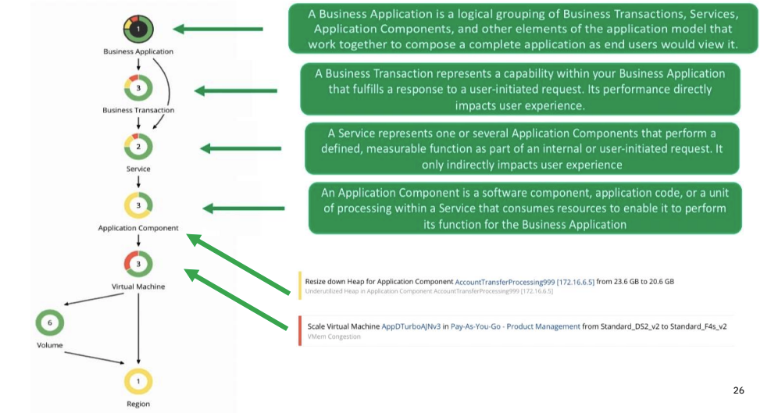
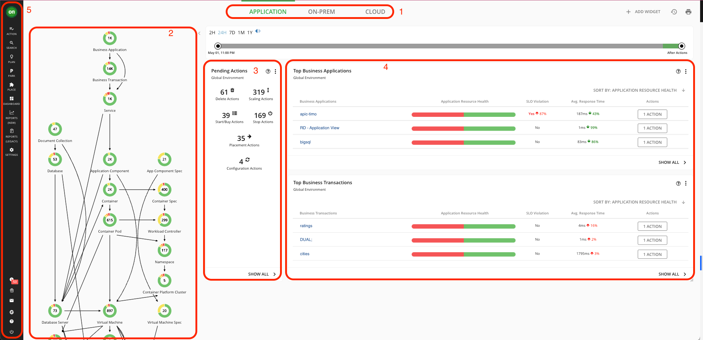
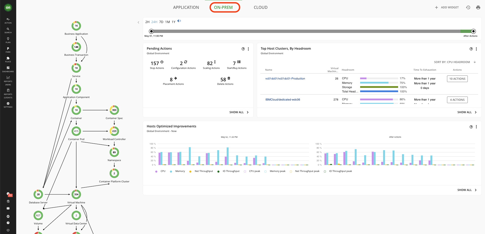
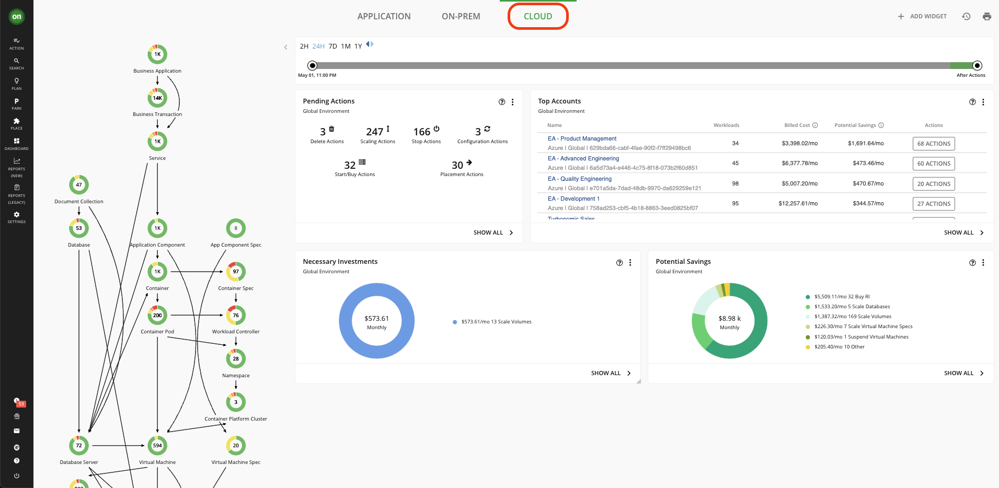
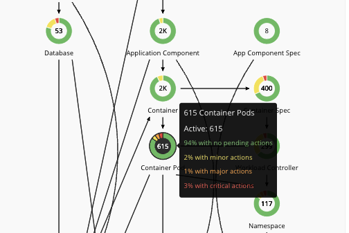
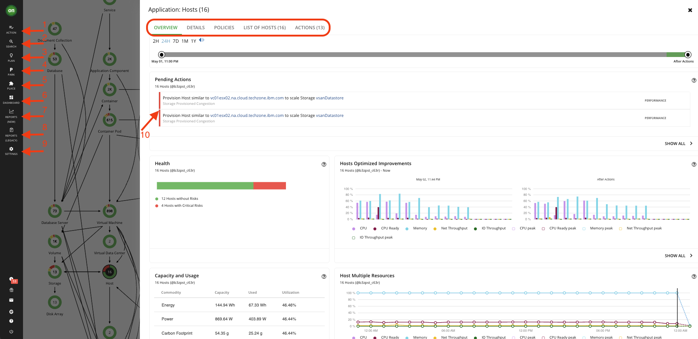

# 101: Turbonomic Overview and Explore UI

## Turbonomic Overview
Application Resource Management is a top-down, application-driven approach that continuously analyzes applications' resource needs and generates fully automatable actions to ensure applications always get what they need to perform. It runs 24/7/365 and scales with the largest, most complex environments.

Welcome to this demonstration of the Turbonomic platform. Turbonomic is an Application Resource Management (ARM) platform designed to put your hybrid environment into the 
optimal state by achieving three primary goals: 

- assuring the performance of your applications by making sure that the applications get the resources they need when they need them
- using limited on-premises and cloud resources as efficiently as possible at the lowest cost, and finally
- adhering to any compliance and business policies required by your organization.

When the Turbonomic ARM is deployed and selected environments are targeted, Turbonomic discovers all the entities in the targeted environments. It then builds out “the supply chain” (the graph on the left), stitching together all of the entities from the top-level business application down through the supporting infrastructure.

You should be familiar with the following terminology when discussing Turbonomic:

- **Business Application** - a logical grouping of Business Transactions, Services, Application Components, and other elements of the application model that work together to compose a complete application as end-users would view it. (e.g. a travel booking application like SAP Concur)

- **Business Transaction** - represents a capability within your Business Application that fulfills a response to a user-initiated request. Its performance directly impacts user experience. (e.g. making a hotel booking)

- **Service** - represents one or several Application Components that perform a defined, measurable function as part of an internal or user-initiated request. It is consumed by internal parts of the application. (e.g. service to locate hotels around specified location)

- **Application Component** - a software component, application code, or a unit of processing within a Service that consumes resources to enable it to perform its function for the Business Application. (e.g. database)

Actions are recommended for Application Components or underlying Infrastructure and propagated up the stack.

### Types of Actions in Turbonomic

- **Placement** — These actions determine the best provider for an entity. These include initial placement for a new entity and move actions that change it to use a different provider. For example, moving a VM assigns it to a different host. Moving a VM’s storage means the VM will use a different data store.

- **Scaling** — Resize allocation of resources, based on consumption. Resize up, shown as a required investment. Resize down, shown as savings. Discount Optimization, Increase discount coverage and reduce costs by scaling VMs to instance types that are charged discounted rates.

- **Configuration** — These are reconfigure and resize actions. Reconfigure actions can add necessary network access or reconfigure storage. Resize actions allocate more or less resource capacity on an entity, which can include adding or reducing VCPUs or VMem on a VM, adding or reducing capacity on a datastore, and adding or reducing volumes in a disk array.

- **Start/Buy** — Start a new instance to add capacity to the environment, shown as a required investment. For cloud environments, purchase discounts to reduce costs.

- **Stop/Suspend** — Suspend an instance to increase efficient use of resources, shown as savings.

- **Delete** — Delete actions affect storage. For example, Turbonomic might recommend that you delete wasted files to free up storage space or delete unused storage in your cloud environment to reduce storage costs.

### Action Modes

Action modes specify the degree of automation for the generated actions. For example, in some environments, you might not want to automate resize down of VMs because that is a disruptive action. You would use action modes in a policy to set that business rule. We will explore this further in the **Policies** lab.

Turbonomic supports the following action modes:

- **Recommend** — Recommend the action so a user can execute it via the given hypervisor or by other means.

- **Manual** — Recommend the action and provide the option to execute that action through the Turbonomic user interface.

- **Automatic** — Execute the action automatically. This automation is defined in Policies. We will explore this further in the **Policies** lab

### Policies in Turbonomic

Policies set business rules to control how Turbonomic analyzes resource allocation, how it displays resource status, and how it recommends or executes actions. Turbonomic includes two fundamental types of policies:

- **Placement Policies** - To optimize your environment, Turbonomic recommends actions to place workloads such as applications, containers, or VMs on their providers. Turbonomic can recommend these actions or execute them automatically.

- **Automation Policies** - As Turbonomic gathers metrics, it compares the metric values against specified constraints and capacity settings to determine whether a metric exhibits a problem and what actions to recommend or execute to avoid a problem. Turbonomic uses Automation Policies to guide its analysis and resulting actions.

### Target in Turbonomic

A target is a service that performs management in your virtual environment. Turbonomic uses targets to monitor workload and execute actions in your environment. Turbonomic communicates with the target via the management protocol that it exposes — The REST API, SMI-S, XML, or some other management transport. Turbonomic uses this communication to discover the managed entities, monitor resource utilization, and execute actions.

Turbonomic must be on a network that has access to the specific services you want to set up as targets.

## Explore UI

Techzone Turbonomic Reservation authorizes access to four demo instances:
-	https://tz4.demo.turbonomic.com
-	https://tz5.demo.turbonomic.com
-	https://tz6.demo.turbonomic.com (Cisco OEM version)
-	https://tz7.demo.turbonomic.com (Cisco OEM version)

You can also go to your Techzone Reservation and navigate to [My Reservation](https://techzone.ibm.com/my/reservations) and click on the Turbonomic Instance to see details. At the bottom of the page, you will find four demo urls. 

You can click on any demo url from above demo link provided or from your reservation detail page. Upon login, you will be presented with the main Turbonomic dashboard.

1. The three tabs at the top give you access to global (full-environment) views.
2. The Supply Chain on the left show you the entities Turbonomic has discovered and their health.
3. The pending actions shows you the actions you should take to optimize your environment and assure performance. We will explore this further in the **Actions** lab.
4. These are Widgets. They are panels that contain information regarding your environment.
5. On the far left is the Navigator – you can use this to access Turbonomic’s other features.

Click on **On-Prem** from the tabs above to view the health of your entire on-prem environment.

Now click on the **Cloud** tab to narrow the focus on all of the cloud environments being monitored.

Since cloud instances usually have dollar values associated with them, Turbonomic is able to provide you with a detailed report of what are the necessary investments you need to make to assure performance, and what would be total cost savings as a result of taking all actions.

Keep in mind, the total dollar amount is IF you take ALL actions generated by Turbonomic for the cloud instances. As you can see in the example below, the cost savings is significant compared to the necessary investments. And this is while assuring application performance.

Click on **Show All** under both **Necessary Investments** and **Potential Savings** to explore actions regarding each. We will go through actions thoroughly in the **Actions** lab.

Let's take a closer look at the **Supply Chain**. From the three tabs above, click on **Applications** to go back to the main dashboard. Business applications are comprised of multiple application components running on lots of different infrastructures. Each circle in the supply chain represents an entity. Each entity has a name, number and is surrounded by a circle of colors. Green is the desired state, Yellow represents efficiency actions, and Red shows that the resources are congested. See the example below.

The direction of the arrows is also meaningful. They show the direction of the purchase's resources. Turbonomic sees the resources available as a marketplace. Every entity can sell resources and/or buy them. For example, a VM buys resources from the host it is residing on and then sells them to the application components running on it. In this scenario, a VM is both a consumer of resources (from the physical host) and a supplier of resources (for the application components). See the image below.

Click on the Host entity in the supply chain. This will open up a page with information regarding all your hosts, policies applied to them, and a list of actions for them.

Explore each tab. The pending actions section shows you the actions that Turbonomic recommends that you tackle to assure performance, save cost, etc. It analyzes your environment once you add it as a target and starts providing the actions.

The Navigator will provide you with quick access to different parts of Turbonomic. This toolbar will remain constant as you explore different parts of the environment.

1. Use the **Action** button to take actions on on-prem and cloud resources. Turbonomic starts its analysis of the environment after configuring the target. This holistic analysis identifies problems and the actions you can take to resolve and avoid these problems.

2. Use the **Search** page to find the entities you are looking for. This page will provide a categorized view of your entities and also provide you filters to narrow down the entity you are looking for.

3. Planning page in Turbonomic is used to run simulations for what-if scenarios that will help you gain insight into what are the results of certain changes before making them. A plan has no impact on real-time environments.

4. Turbonomic supports 'parking' actions for cloud resources. These user-initiated actions stop your cloud resources for a given period of time to help you reduce your cloud expenses, and then start these resources later when you need them. 

5. From the Workload Placement Page, you can set up reservations to save the resources you will need to deploy VMs at a future date. Turbonomic calculates optimal placement for these VMs and then reserves the host and storage resources that they need.

6. Dashboard tab will allow you to create custom dashboards to fit your needs. 

7. **Repors(New)** 

8. **Reports(Legacy)** tab will allow you to generate different reports of your environment and resources. By clicking on **Reports** a new window will open that contains a list of predefined reports under the **General** folder. Explore different reports.

9. The **Settings** page includes important links including, Policies, License, User Management, Targets, etc. You will explore **Targets**, **Policies** and **User Management** extensively in their corresponding labs.

