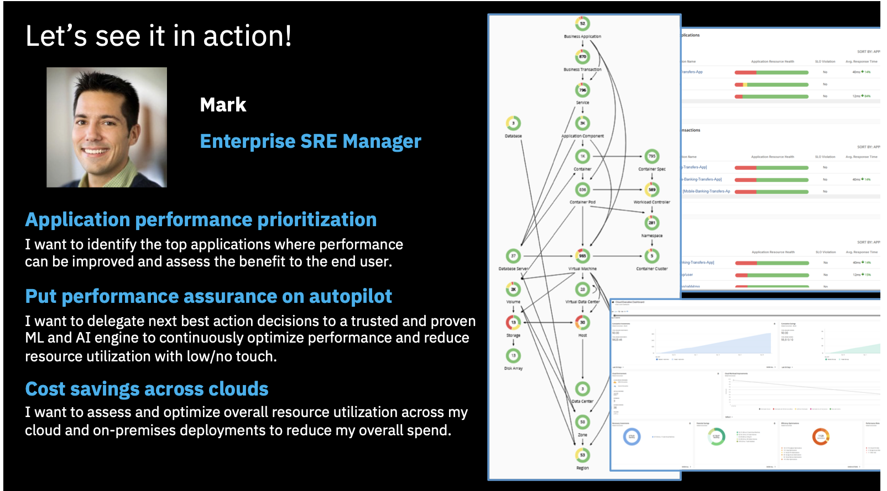
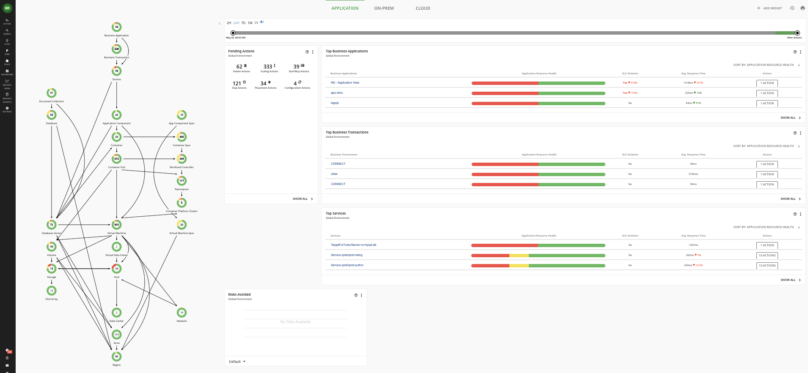
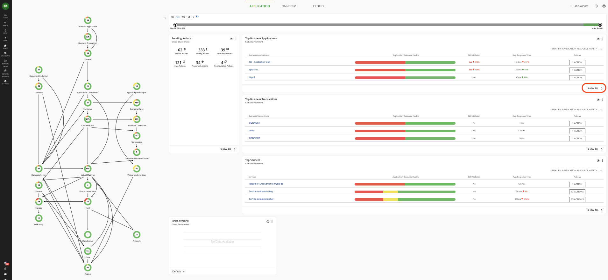
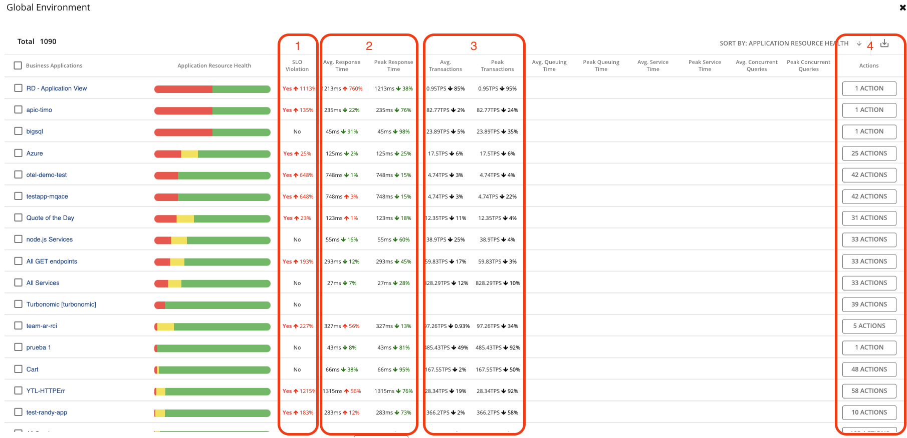
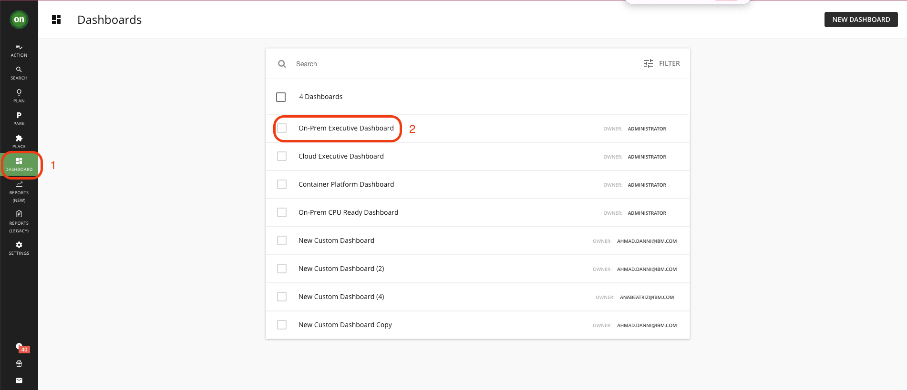
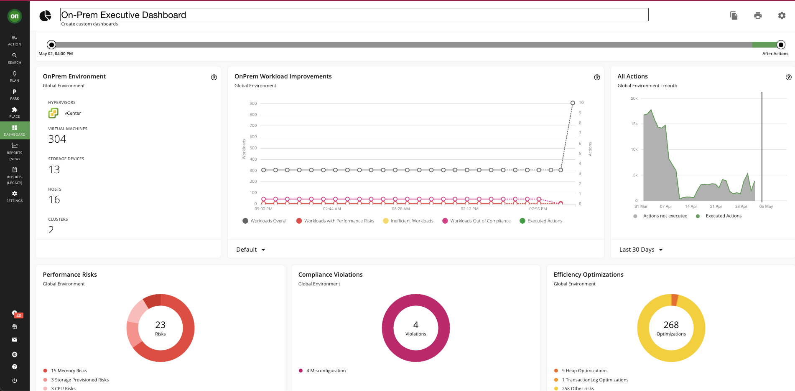

# 102: Optimizing Cost

Turbonomic can help multiple personas in a typical client organization in their daily duties. Let’s start with Mark – the Enterprise Site Reliability Engineer (SRE) Manager. Mark manages a team of SREs and is responsible for the performance of key business applications, but also for optimizing costs of running them.

Navigate to the Turbonomic home page (it opens by default). If you want to return there, click the green **ON** icon in the top left corner of the window.

When the Turbonomic ARM is deployed and selected environments are targeted, Turbonomic discovers all the entities in the targeted environments. It then builds out “the supply chain” (the graph on the left), stitching together all of the entities from the top-level business application down through the supporting infrastructure

This shows the relationships among the various entities and gives you full-stack visibility into your entire hybrid environment, which is very powerful. 

In this example, Turbonomic is pulling in:

- business applications from Application Performance Monitoring (APM) tools like Instana, AppDynamics, Dynatrace, or New Relic
- their associated transactions, services, and application components
- containers, pods, and nodes (represented as virtual machines) from any Kubernetes environment whether on-premises or in the cloud
- virtual machines and storage from on-prem environments like VMWare vCenter and public cloud environments like AWS and Azure 
- physical hosts, storage, network with many more targets available.

No agents are required to be installed as Turbonomic is agentless. It discovers all these entities automatically via the APIs of the targeted environments and pulls them into a common data model.

Within about 30 minutes of discovery, Turbonomic determines the actions required to put this hybrid environment into the optimal state that I mentioned previously. In this optimal state, the demand of the applications is met by the underlying supply of IT resources.

On this home page, there are widgets for Top Business Applications, Top Business Transactions, and Top Services that allow you to quickly assess the risk to the running applications. Not only can you quickly see the applications with the highest risk, but you can also click Show All to see the complete list of Business Applications and relevant metrics. This helps prioritize the SRE team effort.

Click Show All on the Top Business Applications widget.

> Note: The list of the applications as well as values for metrics may be different from the ones shown above. However, this should not affect the demo flow.

For example, if you look at the Top Business Applications widget, you can see the specific application, any resource risk from the underlying infrastructure, if there is a violation of a Service Level Objective (SLO) **(1)** like exceeding the desired transactions per second, the averages and peaks for response time **(2)** and transactions **(3)** and all of the actions **(4)** required to put this application into a healthy state. The underlying infrastructure actions are propagated up to the application so that when you click on “Actions”, you will see all the actions that impact the specific application.

Click the **DASHBOARD** icon in the menu **(1)**. Click **On-Prem Executive Dashboard (2)**.

> Note: Depending on your client's interest you may start with Cloud or Container dashboards. Adjust your narration accordingly.

An Enterprise SRE Manager usually wants to understand the overall status of the infrastructure and long-term utilization trends. Turbonomic provides several dashboards available out of the box and you can easily build new custom ones. 

For example, **On-Prem Executive Dashboard** provides the summary of the status and risks related to on-premises virtualization resources. At the top of the screen, you can select the time for which you would like to see the data. Below, there are details for virtualization platforms, a summary of the performance, risks, and actions taken. At the bottom, you can find important metrics related to virtual machine density on hosts and storage, and how they are changing over time. Similarly, there is a dedicated dashboard for cloud infrastructure (Cloud Executive Dashboard) and Kubernetes infrastructure (Container Platform Dashboard).

