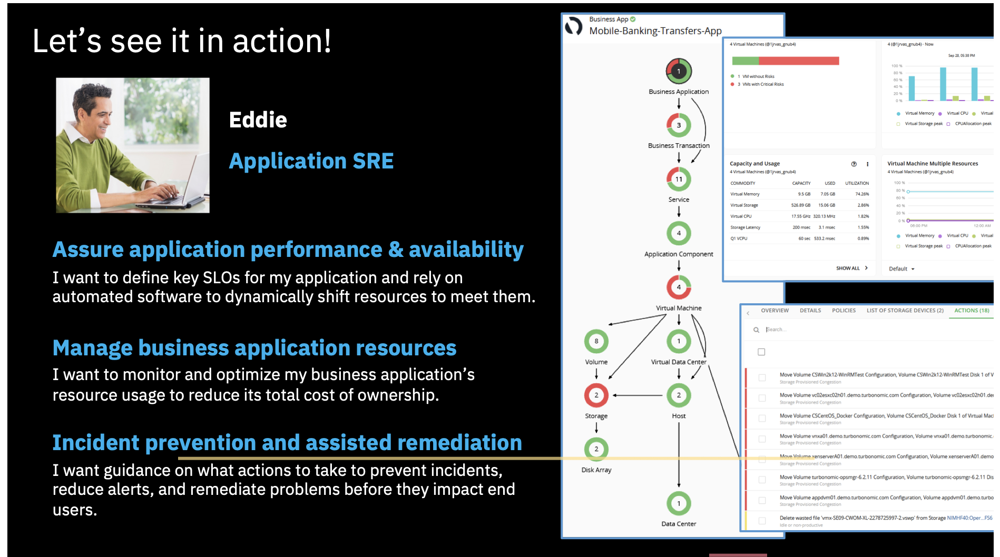
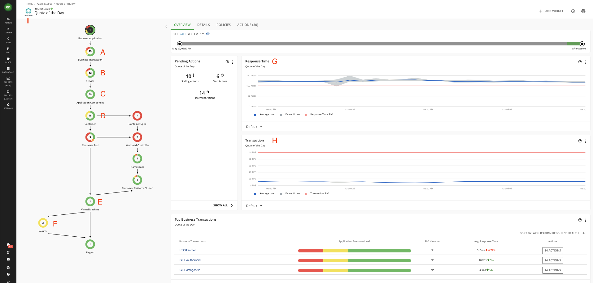
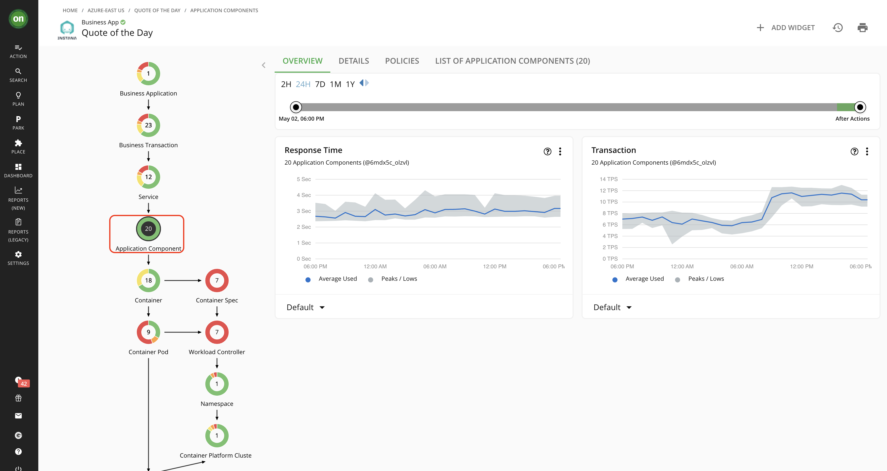
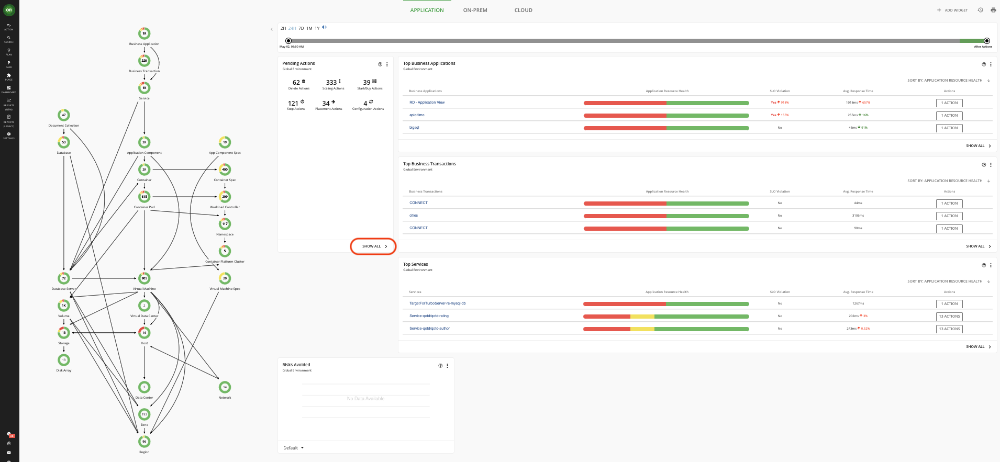
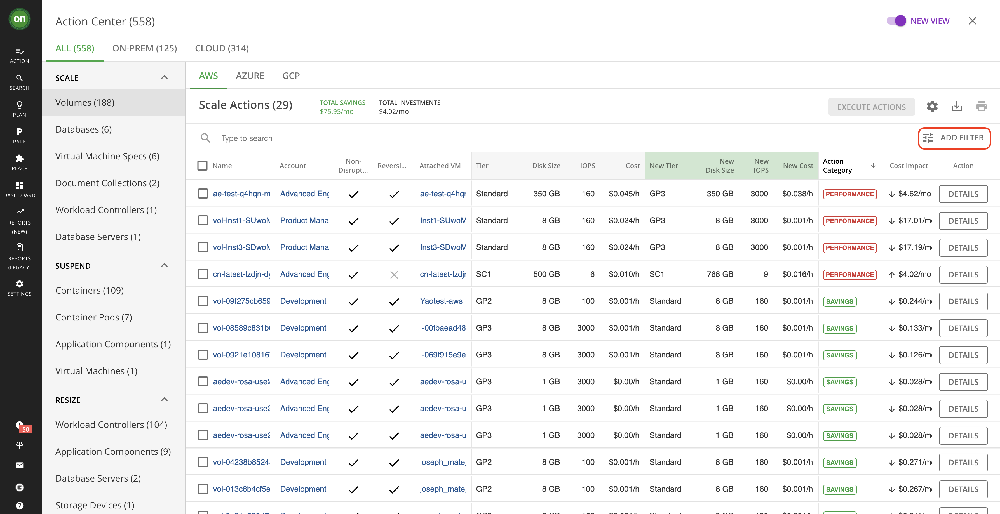
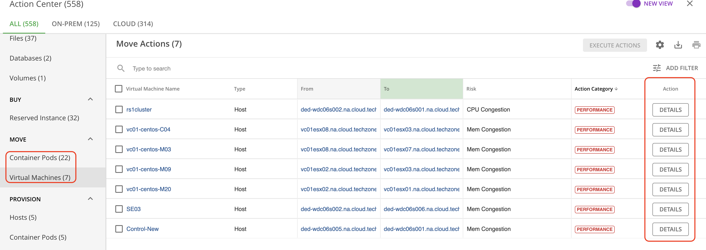
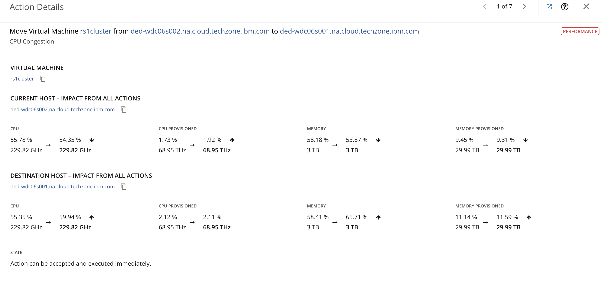
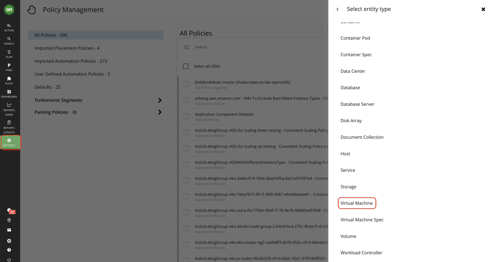
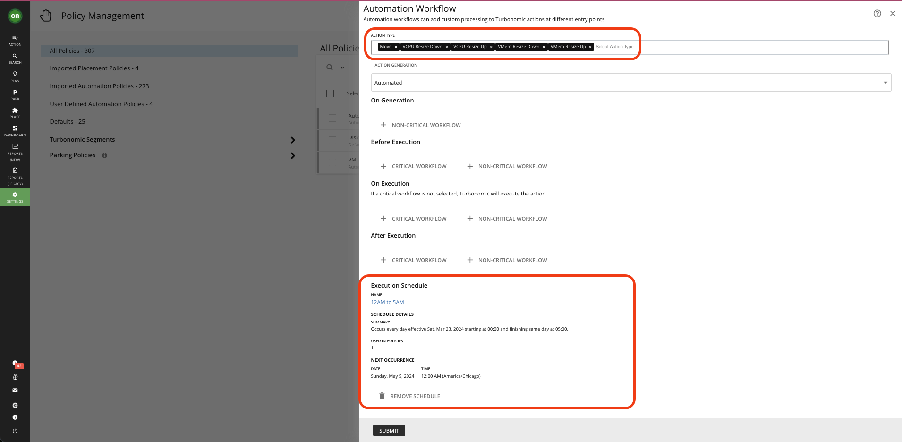

# 103: Desglose de aplicaciones empresariales

Veamos cómo Turbonomic ayuda a los ingenieros de fiabilidad del sitio con sus tareas. En comparación con la función de gestor de SRE, un SRE suele estar interesado en el estado de una aplicación específica y en las medidas que pueden tomarse para garantizar su rendimiento, mitigando cualquier riesgo antes de que afecte a los usuarios finales.

> Nota: La aplicación empresarial que elija puede diferir de la presentada en este guión. Por favor, ajuste su historia en consecuencia

Haga clic en cualquiera de las aplicaciones que aparecen en el widget de las principales aplicaciones empresariales, por ejemplo "Cotización del día". Si no aparece en la vista principal, haga clic en **MOSTRAR TODAS** para abrir la lista completa.

Cuando se llega a esta aplicación de negocio, la cadena de suministro ha cambiado de mostrar todas las entidades en el entorno global a sólo las entidades que son relevantes para la aplicación seleccionada. Esta aplicación de negocio consiste en 23 transacciones de negocio **(A)**, 12 servicios **(B)**, y 20 componentes de aplicación **(C)** ejecutándose en 18 contenedores **(D)** que se asientan sobre 2 máquinas virtuales **(E)**. Esta máquina virtual está conectada a 2 volúmenes de almacenamiento **(F)**. Observe que las entidades pueden tener diferentes colores donde:

*   El "rojo" indica un riesgo de rendimiento en el que las entidades deben trasladarse a un host más óptimo o ampliarse debido a la congestión de recursos o a un aprovisionamiento insuficiente.
*   el "amarillo" indica oportunidades de eficiencia en las que se pueden recuperar recursos por exceso de provisión; y
*   "verde" indica entidades en su estado deseado, que es lo que buscamos.

El resultado es que, al delimitar la aplicación específica, se puede ver rápidamente dónde hay riesgo de congestión o dónde se desperdician potencialmente los recursos.

Puede ver las métricas de los tiempos de respuesta **(G)** y las transacciones por segundo **(H)** junto con sus objetivos de nivel de servicio (SLO) que puede establecer en la sección de políticas de Turbonomic. Esta información procede de la herramienta APM conectada, en este caso Instana, lo que se indica en la esquina superior izquierda **(I)**.

La estructura de la cadena de suministro también se importó de Instana, donde la Aplicación de Negocio se define como una agrupación lógica de Transacciones de Negocio, Servicios y Componentes de Aplicación.

Haga clic en **Transacción comercial**

Si se refiere a la Transacción de Negocio, representa una capacidad dentro de su Aplicación de Negocio que satisface una respuesta a una petición iniciada por el usuario. Su rendimiento afecta directamente a la experiencia del usuario.

Haga clic en el **Servicio**

La entidad de Servicio está formada por uno o más Componentes de Aplicación que realizan una función definida y medible como parte de una petición interna o iniciada por el usuario. Su rendimiento es clave para comprender el rendimiento de la aplicación, pero sólo afecta indirectamente a la experiencia del usuario.

Haga clic en el **componente de aplicación**

Por último, si va al componente de aplicación, verá un componente de software, código de aplicación o una unidad de procesamiento dentro de un servicio que consume recursos para poder realizar su función para la aplicación empresarial. Turbonomic puede recomendar acciones para ajustar la cantidad de recursos disponibles para los componentes de la aplicación.

Turbonomic no recomienda acciones para una aplicación de negocio, transacciones o servicios, pero sí recomienda acciones para los componentes de aplicación subyacentes y las entidades de infraestructura, proporcionando así visibilidad de los riesgos que tienen un impacto directo en el rendimiento de la aplicación de negocio. Por ejemplo, puede ver aquí las acciones para reducir el tamaño del montón (asignación de memoria) para una máquina virtual Java (JVM) y la máquina virtual (VM) que aloja esa JVM.

Exploremos las acciones de Turbonomic con más detalle.

Haga clic en el botón verde **ON** en la esquina superior izquierda para volver a la página de inicio de Turbonomic. Haga clic en **MOSTRAR TODO** en la parte inferior del widget **Acciones pendientes**.

Puede ver aquí, en el widget Acciones pendientes, los tipos de acciones que se generan. Estas pueden ser:

*   acciones de "colocación" para mover una máquina virtual al host o almacenamiento más deseable de un nivel a otro
*   acciones de "supresión" para eliminar volúmenes de almacenamiento que han quedado huérfanos
*   acciones de "escalado" para redimensionar una máquina virtual, un contenedor o una base de datos
*   acciones de "parada" o "suspensión" para desactivar recursos ociosos y evitar cargos innecesarios, y
*   acciones de "inicio/compra" para encender nuevas máquinas virtuales, aprovisionar un nuevo host o comprar instancias reservadas (RI) en la nube.

En este ejemplo, hay más de 500 acciones que se pueden tomar para mover este entorno híbrido al estado óptimo o lo que llamamos el estado deseado. Puedes ver que hay acciones para escalar la CPU virtual o la memoria virtual de las máquinas virtuales, acciones de aprovisionamiento para añadir un host en un clúster donde los recursos son bajos y acciones de movimiento para mover una máquina virtual de un host a otro.

Dado que hay cientos y a veces miles de acciones en un entorno, Turbonomic le permite aplicar filtros a la lista de acciones para ayudarle a ordenar rápidamente la lista. Al hacer clic en AÑADIR FILTRO y abrir el menú desplegable, puede filtrar las acciones por tipo de acción, modo de acción, categoría de acción, prerrequisito de acción o tipo de entidad.

Quizás se pregunte: "¿Cómo sabe una SRE que estas son las acciones correctas que hay que tomar?". Para cada acción, Turbonomic no solo muestra el estado actual del entorno, sino que también muestra el impacto positivo en el entorno si se realiza la acción sugerida. Vamos a ampliar un par de acciones para mostrar esto, empezando por una acción de movimiento.

Despliegue **Mover** -> **Máquinas Virtuales** (o **Mover** -> **Container Pods** si el otro no está visible). Haga clic en el botón **DETALLES** de cualquier registro.

> Nota: Dependiendo de la acción seleccionada, el riesgo detectado (motivo de la acción que se va a generar) - RENDIMIENTO en este caso - puede ser diferente. Ajuste su narración en consecuencia.

Si nos fijamos en la descripción de esta acción de movimiento, la máquina virtual (o contenedor Pod) se está moviendo a un nuevo host debido a la congestión de memoria en el host actual. Para cada una de las métricas mostradas, el valor de la izquierda es el estado actual, mientras que el valor de la derecha es el estado proyectado después de realizar la acción.

A continuación, veamos una acción de escalado de VM.

Expanda **Escala** -> **Máquinas Virtuales**. Haga clic en **DETALLES** de cualquier acción de escalado de máquinas virtuales.

> Nota: Dependiendo de la acción seleccionada, los gráficos asociados y los detalles de la acción pueden ser diferentes. Adapte su narración en consecuencia.

Para el escalado de máquinas virtuales, Turbonomic utiliza cálculos de percentiles para medir la utilización de la CPU virtual y de la memoria virtual con mayor precisión, e impulsar acciones de escalado que mejoren la utilización general y reduzcan el coste de las máquinas virtuales en nube. Cuando examine los detalles de una acción de escalado pendiente en una máquina virtual, verá gráficos que resaltan los percentiles de utilización de la CPU virtual y/o de la memoria virtual para un periodo de observación determinado, y los percentiles proyectados después de ejecutar la acción. La configuración de agresividad de Turbonomic es el percentil 95 con un período de observación de 30 días. Esto significa que, en este ejemplo, Turbonomic muestra que la utilización de vCPU está por debajo del 93% durante el 95% del tiempo en los últimos 30 días. Debido a que esto está muy por encima de la configuración actual para el estado deseado del 70%, hay una acción para cambiar el tamaño de la vCPU. Se puede ver que después de esta acción de redimensionamiento, la utilización del percentil de vCPU se proyecta por debajo del 62% durante el 95% del tiempo. La razón por la que se ve que el percentil de vMem aumenta es porque hay una acción correspondiente para reducir el tamaño de vMem que no se muestra aquí.

Por ejemplo, si el modo de acción se establece en manual, un SRE puede hacer clic en esta casilla de verificación, desplazarse hacia arriba y hacer clic en **EJECUTAR ACCIONES** y esta máquina virtual se moverá al nuevo host o, en el caso de la acción de cambio de tamaño, se cambiará el tamaño de la máquina virtual. Además, puede crear políticas de automatización para que Turbonomic adopte un enfoque preventivo y tome automáticamente estas medidas antes de que se produzcan problemas.

Esto mantiene el entorno en el estado deseado sin intervención humana y minimiza la cantidad de tiempo que los equipos de TI deben dedicar a depurar los problemas de recursos de las aplicaciones después de que se produzcan y garantiza que las aplicaciones obtengan los recursos que necesitan exactamente cuando los necesitan.

En otras palabras, Turbonomic garantiza que la demanda de las aplicaciones se satisface en tiempo real con la oferta de recursos de TI disponibles. Por último, estas acciones pueden programarse para ejecutarse durante una ventana de mantenimiento e incluso obtener aprobaciones mediante solicitudes de cambio a través de la integración de Turbonomic con ServiceNow. Exploremos cómo SRE puede establecer políticas de automatización.

Vamos a crear una única política de automatización para la colocación y redimensionamiento de máquinas virtuales. Además, supongamos que desea que las acciones de colocación se ejecuten en cualquier momento en que se genere la acción y que desea que las acciones de aumento y reducción de tamaño para vCPU y vMem se produzcan cada noche.

1.  Vaya a **Configuración** > **Políticas** > **NUEVA POLÍTICA** > **Política de automatización** > **Máquinas virtuales**.

2.  Dé un nombre a la política: por ejemplo, "VM\_placement\_resize".
3.  Alcance esta política a un grupo de máquinas virtuales y, en este caso, vamos a automatizar dentro de un único clúster (seleccione **ad\_win**).
4.  En **AUTOMATION WORKFLOW**, haga clic en **ADD ACTION**. Puede elegir el tipo de acción **Mover** para automatizar la colocación, **Generación de la acción** a **Automatizada** y, a continuación, **Enviar**.
5.  Para añadir la automatización del redimensionamiento, haga clic de nuevo en **AÑADIR ACCIÓN**. Puede elegir los cuatro tipos de acción **vCPU Resize Up**, **vMem Resize Up**, **vCPU Resize Down** y **vMem Resize Down** para automatizar los cambios de tamaño de las máquinas virtuales.
6.  Establezca la acción Generar en Automático.
7.  Para los redimensionamientos, dijimos que querías hacerlos en un horario entre la medianoche y las 5 am, lo que se puede hacer con un Horario de Ejecución de Acciones. Agreguemos el horario.
8.  Haga clic en **AGREGAR PROGRAMA** desde **Programa de Ejecución**. Seleccione **12AM a 5AM** y haga clic en **GUARDAR**.

9.  Haga clic en **ENVIAR** en **Flujo de trabajo de automatización**.
10. Haga clic en **GUARDAR POLÍTICA** y **APLICAR** para aplicar la política.

Puedes ver que hay mucha flexibilidad en la configuración de las políticas, y tienes el control total si esas acciones se toman manualmente o de forma totalmente automatizada.
