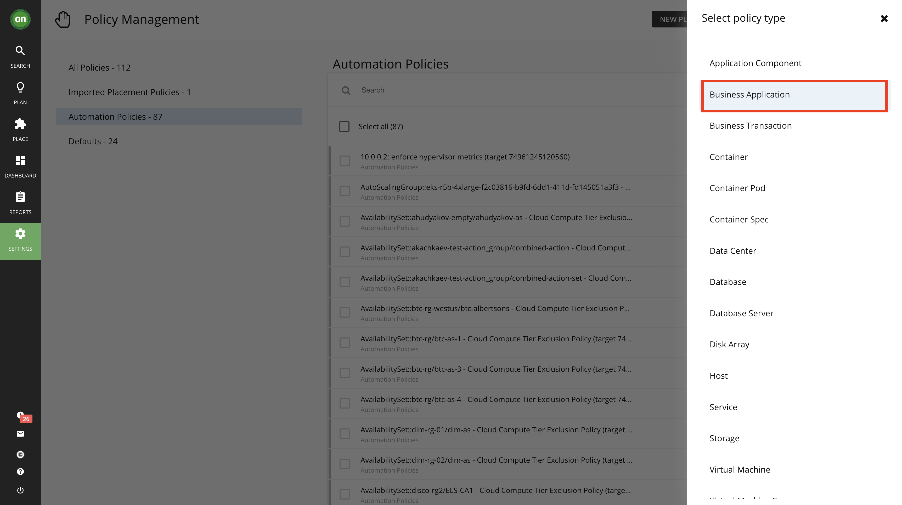
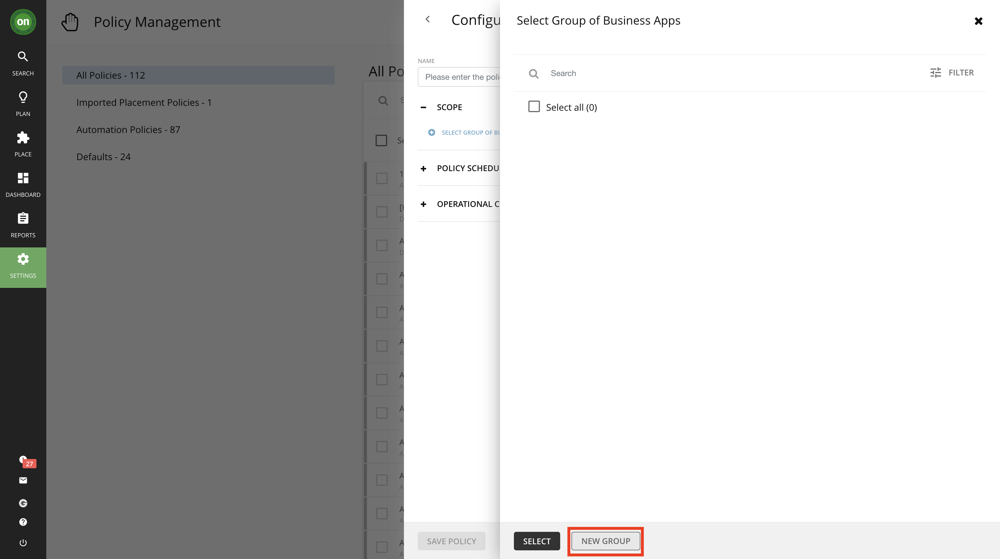
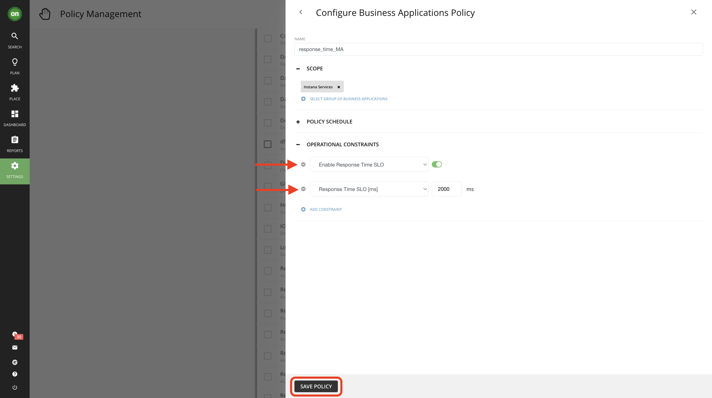
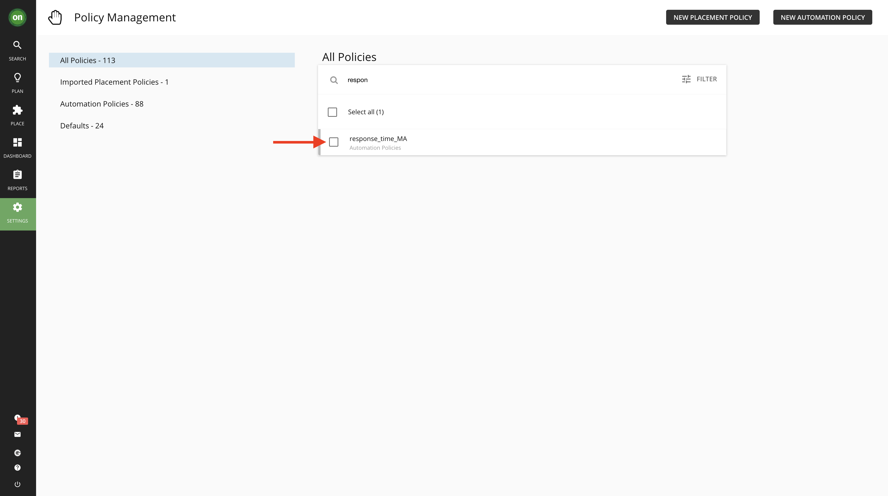
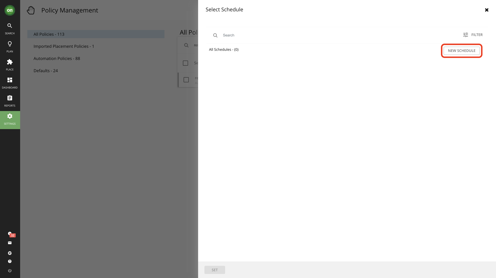
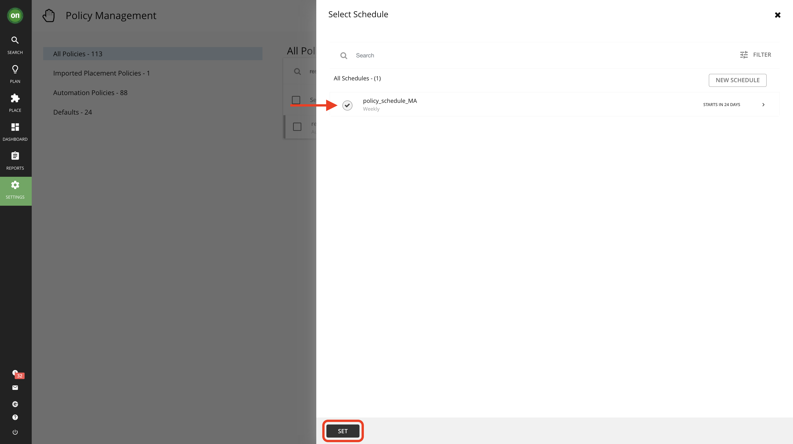

# 104: Turbonomic Actions and Policies

## Goal

In this lab you will:

- Explore different action types
- Explore existing policies
- Create an Automation Policy
- Schedule a policy

**Please note that your number and types of actions may vary on your environment**

## Explore different action types

1. Navigate to the main dashboard by clicking on the **On** button from the navigator. Then select **Show All** from the **Pending Actions** section

2. In this page you will see all pending actions - including on-prem and cloud. If you look at the list on the left you will see actions are categorized by their type. Spend few minutes to explore actions by going to the on-prem or cloud tabs.

3. While exploring actions, you will notice that each action type has multiple entities that it affects. For example, the type **Scale** - which is basically a resize action for cloud entities - affects VMs, databases, VM storage and volumes. Let's take a closer look at some of these actions.

Navigate to **Volumes** under **Scale** action type.

Select the **Azure** tab. Then click on **Details** for an action that is market **Performance** and reduces your cost. You may need to scroll to the right to locate the button.

This page displays all the detail about this action including why it was generated, what is the impact if taken, costs or cost savings associated with taking this action, and important information about if it will cause downtime if taken and whether or not it is reversable. Let's take a closer look at the information specified in this action details.

1. This section informs you of the action, the entity it affects, the location in which the entity exists and the reason. In this picture we have a scaling volume action for entity named **ptericdisks3_datadisk_2** in the deployment named **EA - Development** and the reason is IOPS Congestion.

2. The action essentials section gives a quick view into what you need to know about taking this action.

   - The action can be accepted and executed immediately means there is currently no restrictions that will prevent you from taking it right now. We will explore what this means further when we disscuss action modes.
   - Whether or not there is downtime associated with taking this action. In our example, this change requires a period of downtime so when considering taking it one must plan ahead and inform the users of this volume of a planned downtime.
   - Whether or not this action is reversible.

3. In this section you will learn why this action is generated. Typically Turbonomic observes the entity over a period of time and captures the 95th percentile for it. Considering the example shown in the picture below, Turbonomic tells us that the IOPS utilization is about 100% for 95% of the time during a 30-day observation period. This means there is an IOPS congestion on this volume so a scaling action is generated for this entity to move it to a more suitable volume.

4. The IOPS 95th percentile graph.

5. IOPS daily average graph.

6. The dotted line represents the projected 95th percentile after taking this action.

7. Detailed comparison between the current state of the resources and the projected result after taking the action.

8. Detailed cost savings comparison for if you take this action. Notice how scaling to a different volume will result in higher IOPS, lower utilization and it even saves money. So why wouldn't you take it?

### Optimize on-prem resources

In this section you will take actions that will optimize your on-prem resources while assuring performance. Taking such actions will result in resources being released by entities or VMs that are not utilizing what they have over the observation period (by default 30 days) so that they can be allocated to workloads that needs these resources.

1. Navigate to **On-Prem** tab from your actions page. Then under **resize** select **Virtual Machines**.

2. Scroll down the list and select an action to downsize virtual memory that has **Efficiency** as its action category. Click on its **Details**.

3. Check the details, you will notice that this VM's virtual memory utilization was under 1% for 95% of the time over 30 days. This means this VM has overallocated memory which it does not consume. So you can safely reduce the memory capacity while still providing optimal performance. Notice the projected results of taking the action, it will bump up the utilization from 1% to 2% which is perfectly acceptable.

Once you approve of all details and ensure this action is safe, click on **Execute Action** button at the bottom of the details page. Once you execute this action, Turbonomic will use API calls to adjust the virtual memory of this VM for you. So you won't need to log into your vCenter environment. If the action is executed successfully, you will see a green checkmark next to that action.

## Turbonomic Policies

You’ve learned how to take actions manually. But what if we wanted to automate this? Once we validate that it is safe and good to take a certain action and we trust it, we can allow the entities to act on their own decisions.

### Explore existing policies

_As a reminder, please ensure that you are logged in with an **Administrator** user. If you are not logged in as an administrator user, you will not have the necessary permissions to run through the labs_

1. Navigate to **Settings**, then **Policies**. In this page, you will see a list of all existing policies.

2. From the list to the left, select **Defaults**. This will show a list of all system default policies.

_**Tip**: These default policies remain effective unless user creates a policy affecting same resources but with different criteria. User defined policy overrides the default policy._

3. Scroll down in default policy list and click on **Storage Defaults**. Now notice that this policy sets the **Resize** action acceptance are set to recommend. This will result in all resize actions generated for storage to be set to recommend only and be unable to execute within Turbonomic.

4. Respectively, for the action that you explored for a cloud VM where you could manually accept and execute it within Turbonomic, there is a default policy set that defines that:

Navigate to **Virtual Machine Defaults** policy from the default policies list. You can see that all cloud scaling actions are set to **Manual** which allows them to be accepted and executed (assuming there are no prerequisites for them).

### Create an Automation Policy

You will create an automation policy to define how you'd like Turbonomic to treat actions as they appear. Keep in mind, user defined policies will override system default policies that affect the same entity.

#### Add response time service level objective (SLO) constraints

1. Navigate to **Policies** from **Settings**. Then click on **New Automation Policy** on the top right side of the window.

2. Click on **Business Application**. Once you do the Policy Editor window will appear.

3. In the Policy editor, give your policy a unique name like response_time_YourInitials. Then under **Scope** click on **Select group of business applications**. This will specify which group of business applications will be affected by this policy.

4. Once you click on **Select group of business applications**, the **Select Group of Business Apps** Editor window will appear.

5. Click on **New Group** button. The **Add members to a new group** editor window will appear.

6. (1) Name your group **Instana Services**. Change the type to (2) **Static** in the **Type** dropdown menu. (3) Select **RobotShop** and (4) **Quote of the Day**. Then (5) click on the **Save Group** button

7. Select the **Instana Services** group and click on the **Select** button.

6. In your policy editor, add the **Enable Response Time SLO** and **Response Time SLO (ms)** constraints and then click on **Save Policy**. You may recieve a message saying it may take 10 minutes for the policy to become effective, click **Yes** to proceed.

7. To check if your policy is created try searching for your policy's name in the list. you can make changes and edit it as necessary from here as well.

### Schedule a Policy

You can set a schedule for an automation policy, which sets a window of time when the policy takes effect. In addition, a scheduled policy can include scheduled actions. When the policy is in effect, Turbonomic recommends or automatically executes those actions as they are generated. Some of those actions could be disruptive so you may want to defer their execution to a non-critical time window. In this case, you will need to set an action execution schedule within the scheduled policy.

1. Click on the automation policy, response_time_YourInitials,  we just created. 

2. Expand **Policy Schedule** and click on **Attach Schedule**. Then click on **New Schedule**

3. This section will define when your policy is on effect.

      A. Give your policy schedule a name like policy_schedule_YourInitials.

      B. Select **Weekly** under Recurrence.

      C. Set to repeat every week only on **Saturdays** and **Sundays**.

      D. Select today's date as start date and **None** as end date.

      E. Set 12:00 as start time and 12 for duration hours. Please Note if you are completing this lab after noon local time, you may want to adjust this time from 12:00 to few hours after your current time. The reason is that the system will not allow you to create a policy in the past.

      F. Select your timezone.

      G. Check the Summary and click on **Submit**.

4. Select your newly created schedule and click **Set**

5. Now you should be back in **Configure Business Applications Policy** page. Check all the information and ensure their accuracy. Once done, click on **Save Policy**.

