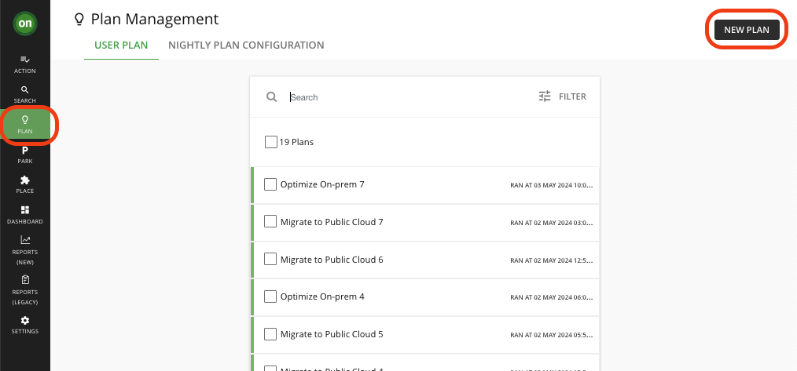
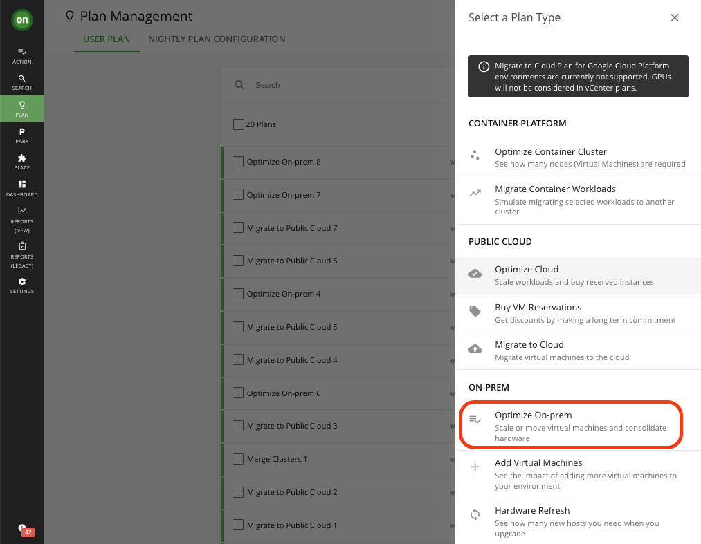
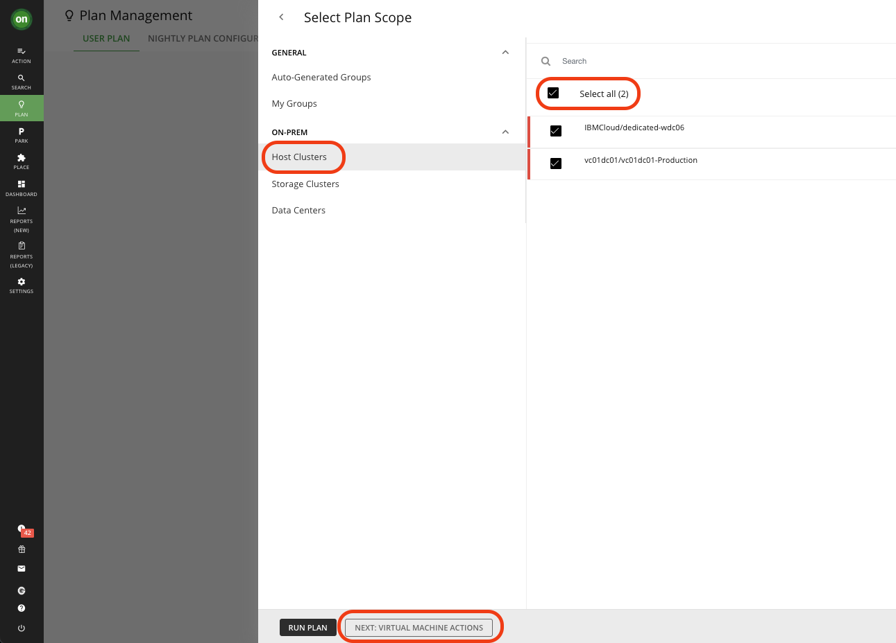
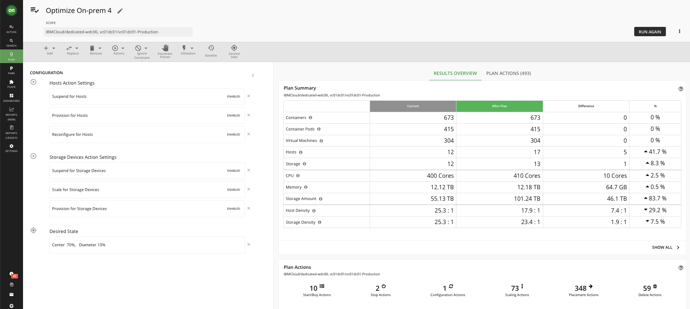
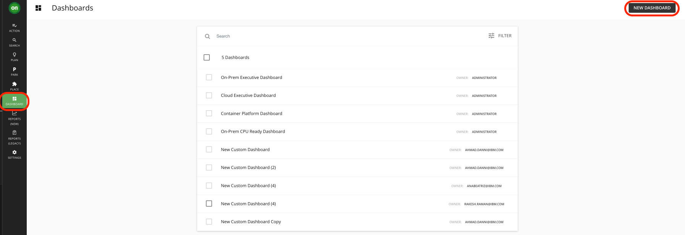
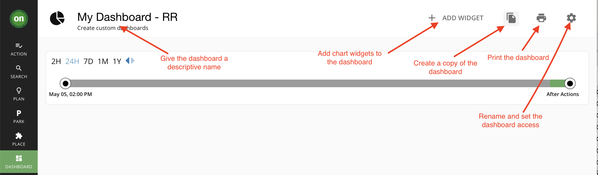
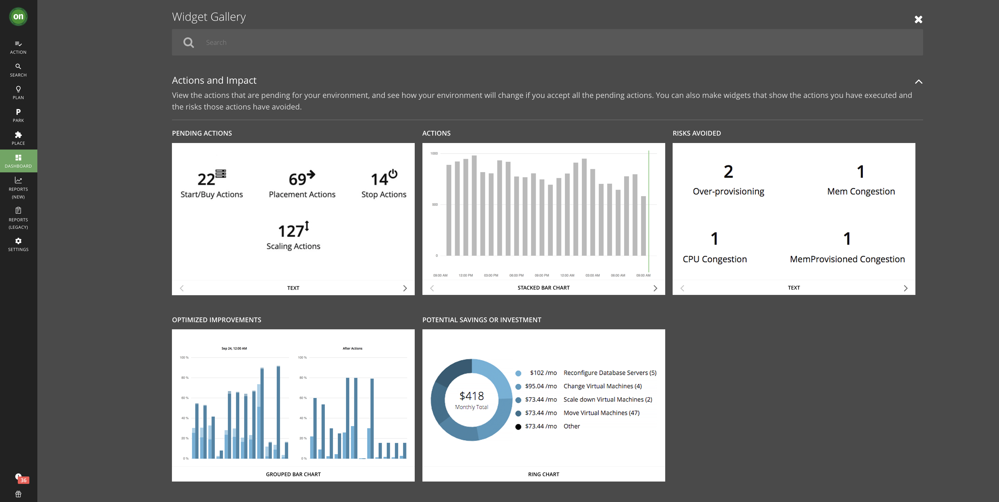
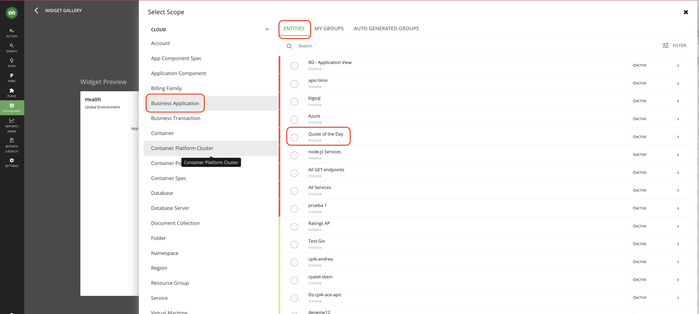
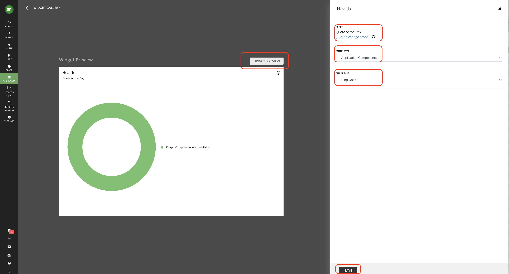

# 104: Infrastructure Changes Planning

## Plan

let’s look how Turbonomic helps Infrastructure Managers with planning infrastructure changes, optimizations, or cloud migrations

Click the **PLAN** icon in the left menu, then click the **NEW PLAN** button in the top-right corner.

Along with the dashboards that were explored before, Turbonomic provides a dedicated planning tool to help Infrastructure Managers decide infrastructure changes.

You can see there are multiple plan types available, for on-premises infrastructure, for Kubernetes clusters as well as for Public Clouds. 

Let’s see an example plan for optimizing the infrastructure.

1. Click on **NEW PLAN**
2. Select **Optimize On-prem**

3. Select **Host Cluster** and select all listed cluster
4. Click on **Next** buttons and keep default value on all screen.

5. On final screen click on **RUN PLAN**
6. Review the result

## Dashboard 

A custom dashboard is a view that you create to focus on specific aspects of your environment. You can create dashboards that are private to your user account, or dashboards that are visible to any user who logs into your Turbonomic deployment.

1. To create a custom dashboard, Click on **Dashboards** from the left navigation

2. Click **NEW DASHBOARD** to add a new dashboard to your Turbonomic session.

3. The dashboard appears with a default name and without chart widgets. The time range in the Time Slider is set to 24 hours by default as shown below

4. Add chart widgets to the dashboard by clicking **ADD WIDGET**

We will customize this dashboard to show certain metrics for the Quote Of The Day Application.

5. You will see the default screen with multiple Widget Galleries as shown below:

6. Type **Health** in the search bar as shown below and select that widget by clicking anywhere in the white space.

7. Under **Scope**, **Click to change scope**

8. Next, **Select Scope**, ensure you are on **Entities** and select **Business Application** as shown in the below image. 

9. Next, Select **Quote of the Day** from **Business Application**.

10. Next, select **Application Components** from **Entity Type** and select **Ring Chart** from **Chart Type**

11. Next, click **Update Preview** button to see the result and then click **Save** at the bottom

12. Finally, you will see your widget published on your Custom Dashboard

To learn more about the chart types/widgets available, please review our documentation by [clicking here](https://www.ibm.com/docs/en/tarm/8.12.2?topic=views-chart-types).
